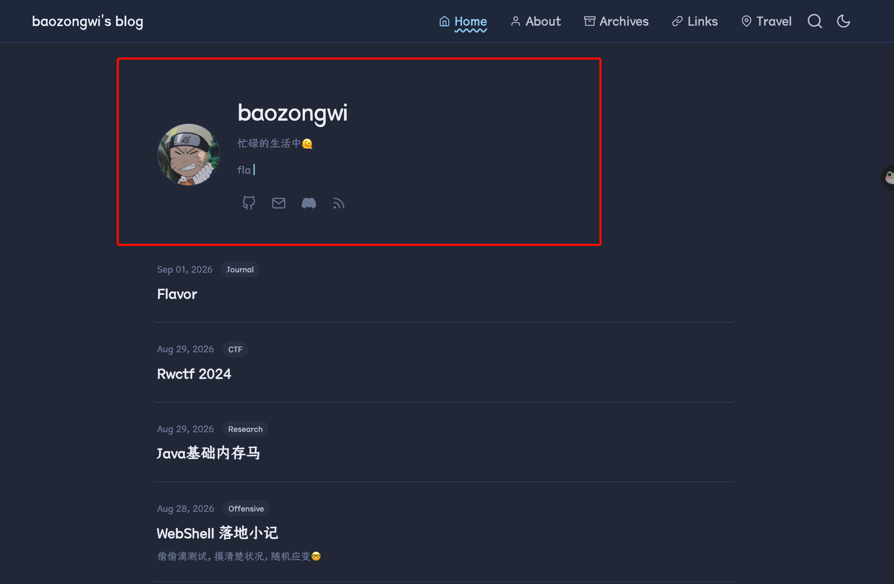
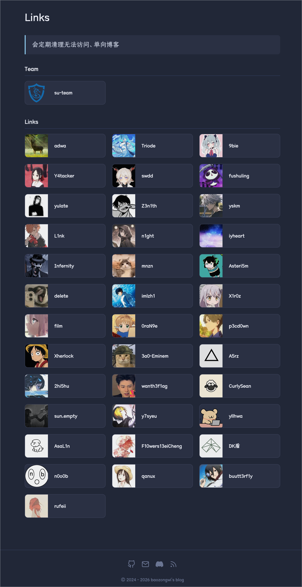
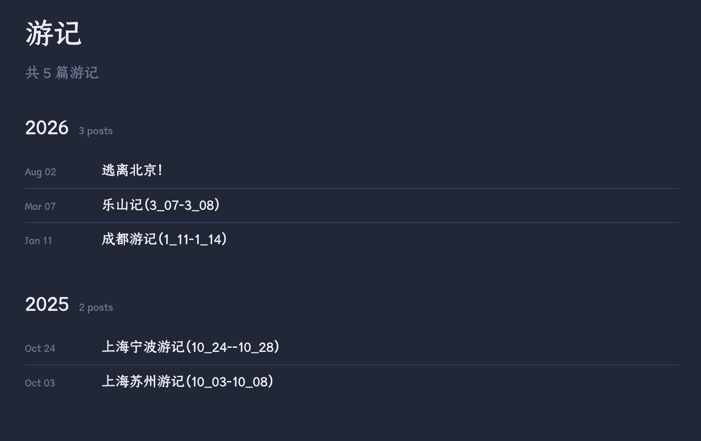
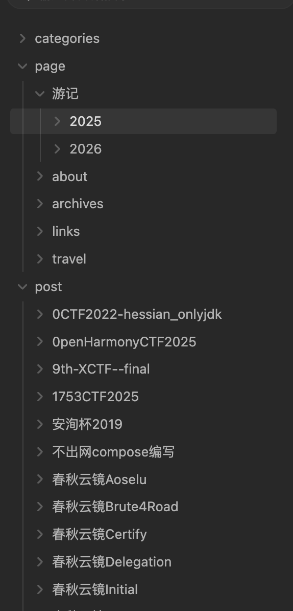

## TL;DR

https://github.com/baozongwi/flavor

这个主题终于是在我看来是完全做出来了，使用了 Claude、GLM、grok、codex 多次折腾，现在是我想要的样子，我说说我认为做的比较好的细节

## hero & welcome



这里的欢迎页，有一个打字机，还有一个说说，说说是可以经常改动的。

还有一个就是“**越想越难耐🤬**”，这边截图不好截，大家可以访问我的网站删除 session 就能每次触发了

## 加密文章

使用的 AES-GCM 加密，分 private 仓库去存储，这样子会安全很多了，具体代码就不放了

```bash
hugo new --kind encrypted "private/wp2shell/wp2shell.md"
```

## 字体、按钮、黑白模式

选了我比较看的好的，字体出自妙言

按钮一开始没有图标，很难看，后来我突然灵机一动就想到了这个问题给加上了

黑白模式，选了一种对眼睛比较友好的双色

## 友链



这里就比较直接了，用的本地图片还有一个 yaml 做存储，非常常见，但是我这里的头像尺寸，卡片尺寸，让我看起来很舒服，还加了一个随机排名，比较友好

## 游记



其实就是普通的文章，只不过做了一个渲染

```bash
hugo new --kind travel "page/游记/2026/南京记/南京记.md"
```

整个目录树大概就是这样

