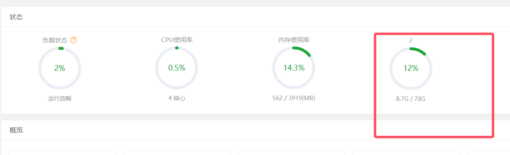
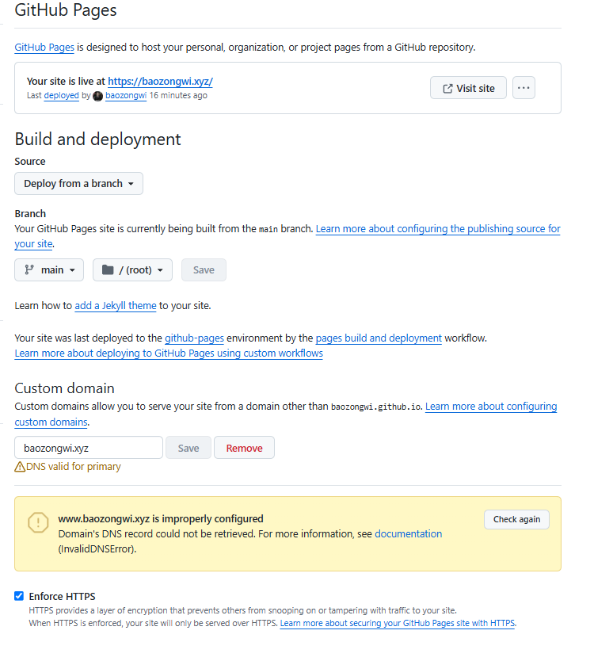
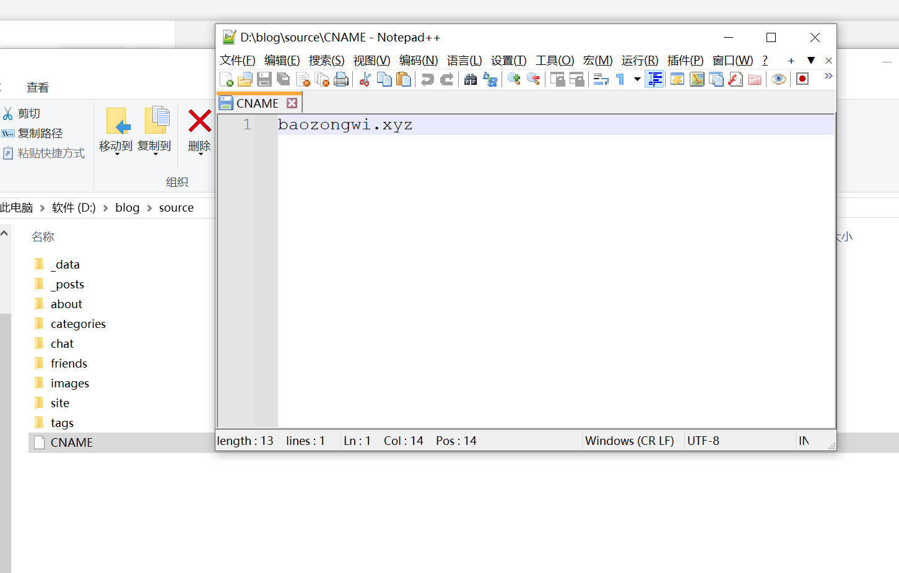
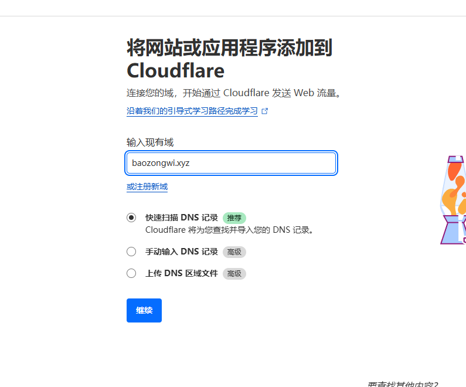
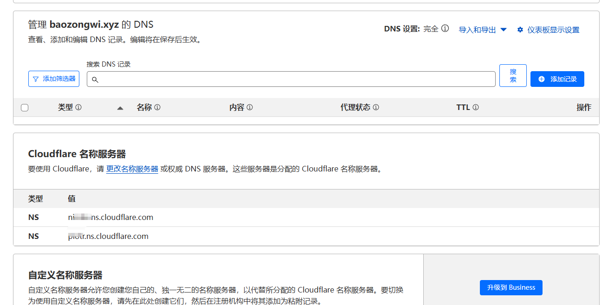
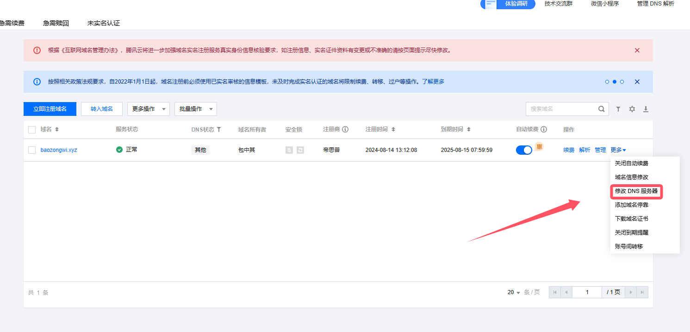
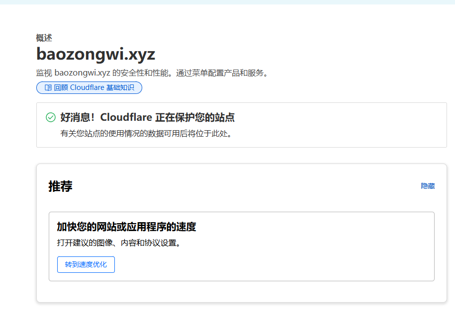

+++
title = "github-pages自定义域名及加速"
slug = "github-pages-custom-domain-acceleration"
description = ""
date = "2024-11-08T11:42:44"
lastmod = "2024-11-08T11:42:44"
image = ""
license = ""
categories = ["talk"]
tags = ["小站"]
+++

# 0x01 说在前面

起因是我这三个月爆肝了一百篇文章(个人认为不是都是水文，有师傅和我交流技术

我本身的博客是这样的(双保险)

首先部署到github上面然后再利用DK盾赞助的服务器进行转载，当然这样子即使服务器挂了也能用，而且也是进行了自然存档的(当然为了数据遗失，我在U盘上面存了我的blog文件夹)，毕竟都是我的心血



这样算下来过不了多久可能就会满，今天在群里面提了一嘴，Y爹和生蚝师傅都说githubpages也能满？

诶那我确实是可以直接打一个重定向，同时我还可以省一台服务器出来

# 0x02 action

## 自定义域名

这个其实真的很简单，我们就直接解析，然后写个文件就可以了

这里先去腾讯云解析，我是直接用的CNAME当然A也可以就是比较麻烦(注册域名就不说了，给钱就行)


```
https://myssl.com/dns_check.html
```

可以来这个网站查询一下，然后上github搞一下



就这样还不行，我之前以为就这样就可以了，但是发现只要一更新部署这里的东西就会不见，经过查询知道是说需要在本地的`source`文件夹里面创建一个文件



这样子就可以了，可以自己试试，不过我们信安人都是一直有魔法，如果没有魔法的话，这个网站就会很卡，那么下一步

## 加速

但是我发现国内加速都要备案才可以，备案真的很麻烦而且我也很难操作，那只能用CF了虽然是慢了点

```
https://dash.cloudflare.com/
```



然后找到解析记录去换一下



```
https://console.cloud.tencent.com/domain/all-domain/all
```



修改成CF给的就可以了，不过我看了一下，还是有部分被墙的，不过已经很好了，至少不会像github.io一样，连有些图标都显示不出来(毕竟不要钱)



# 0x03 小结

或许后面有钱会换CDN，但是暂时用这个，而且过程都差不多的，不用担心vps的内存问题了哈哈哈
谢谢生蚝和Y爹
