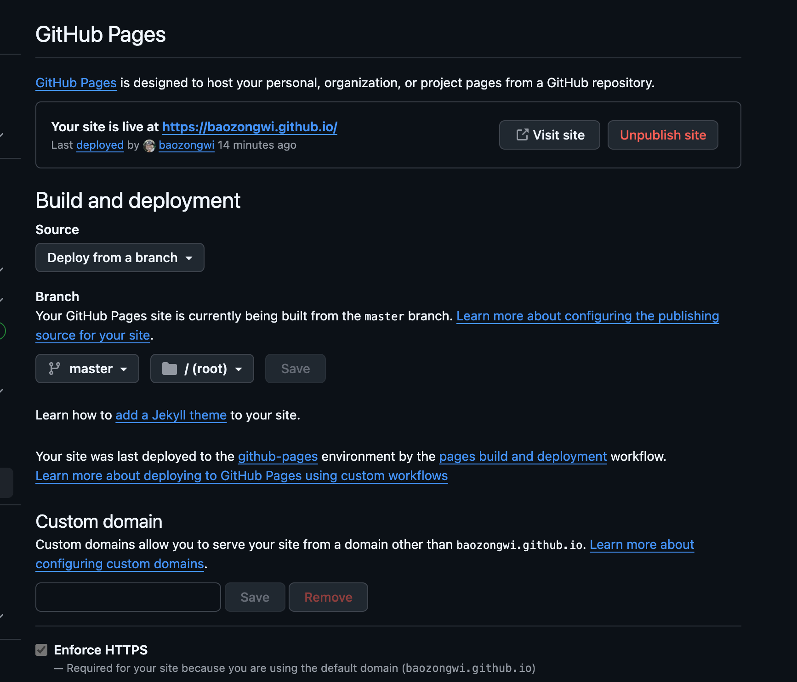

+++
title= "Hello Actions"
slug= "hello-actions"
description= ""
date= "2026-03-11T20:36:24+08:00"
lastmod= "2026-03-11T20:36:24+08:00"
image= ""
license= ""
categories= [""]
tags= [""]

+++

看到这里的时候，我已经用上 actions 进行博客更新了，挺方便的，比在本地部署快很多，也很简单，问 AI 写几个文件就操作好了，唯一让我有点烦的就是生成 key 的时候，emm，没起好名字，后来改也不好改，还有就是时差

test
test

通过探索发现，使用这样的`yml`是能绕过时差机制的，然后域名解析我们需要去掉，这样就没问题了

```yml
name: Deploy Hugo Site

on:
  push:
    branches:
      - main

jobs:
  deploy:
    runs-on: ubuntu-latest
    concurrency:
      group: ${{ github.workflow }}-${{ github.ref }}
    steps:
      - uses: actions/checkout@v4
        with:
          submodules: true
          fetch-depth: 0

      - uses: peaceiris/actions-hugo@v3
        with:
          hugo-version: "0.157.0"
          extended: true

      - run: hugo --minify --buildFuture

      - uses: peaceiris/actions-gh-pages@v4
        with:
          deploy_key: ${{ secrets.DEPLOY_KEY }}
          publish_branch: master
          publish_dir: ./public
          force_orphan: true
          cname: baozongwi.xyz

```



