+++
title = "hexo&&hugo搭建个人博客"
slug = "hexo-hugo-personal-blog-setup"
description = ""
date = "2024-12-03T12:23:54"
lastmod = "2024-12-03T12:23:54"
image = ""
license = ""
categories = ["talk"]
tags = ["小站"]

+++

# 0x01 说在前面

蒙上完学长课堂之后，有学弟询问怎么搭建个人博客，hexo我网上网友，线下的一些问题，说起来也有四五个了，所以非常顺手，同时我看到有挺多师傅是用的hugo的框架，那个[FixIt](https://github.com/hugo-fixit/FixIt)主题也是非常好看所以顺手来看看

# 0x02

首先注册[github](https://github.com/)

注册好了之后应该是这样子的

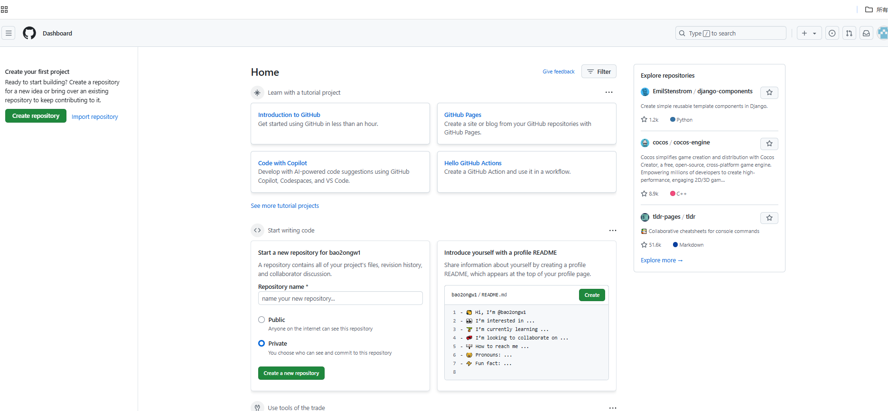

嗯那么我们首先来看hexo博客怎么搭建吧

## hexo

### 初始化必要的东西

对于初学者的博客记录学习过程其实不需要知道每个东西是什么，因为我们只是用这个来记载，而不是说我们要自己写一个，所以说搭建博客没那么难，当一个脚本小子就可以了

安装nodejs和git

[nodejs](https://nodejs.org/en/)

[git](https://git-scm.com/downloads)

nodejs最好是安装好TLS也就是长期智齿版本，那么到了一个不懂环境变量的小盆友最难受的时候了，也就是如何把这两个搞到环境变量里面去，首先我们到桌面有个搜索框

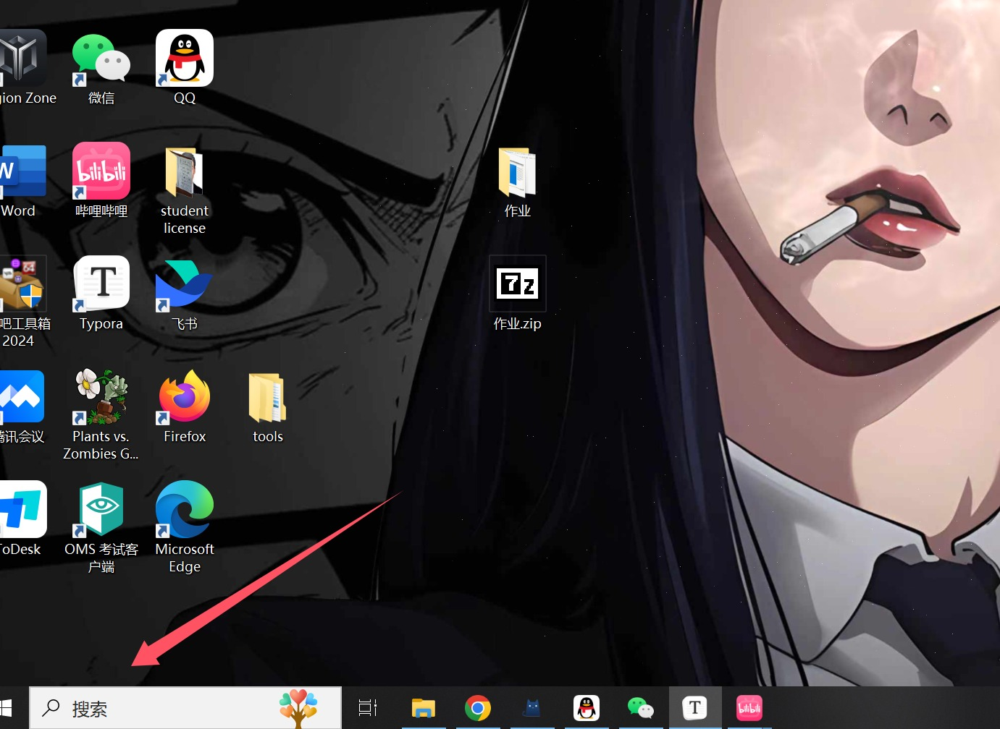

搜索**系统环境变量**一般的名称应该是**编辑系统环境变量**，不一样的话也是点小差异，无伤大雅

```
环境变量->Path(系统变量里面的)->编辑环境变量->新建
```

新建之后放文件路径这里

```
C:\Program Files\Git\cmd
C:\Program Files\nodejs\
```

可能路径稍微有不同，但是后面的一样就行也就是说只要是

```
nodejs\
Git\cmd
```

即可，然后`win+r`打开cmd进行检查

```cmd
node version
git version
npm -v  # (nodejs自带的)
```

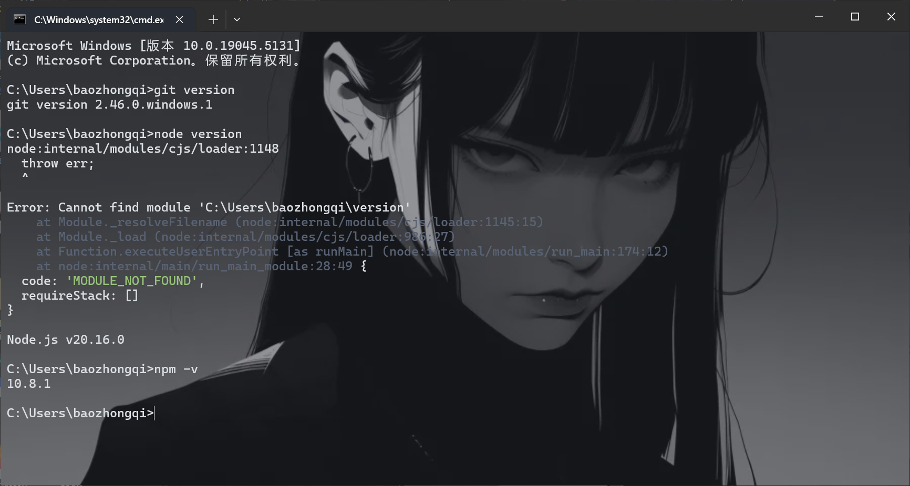

### 本地初始化

然后我们下载hexo直接在终端中运行命令

```shell
npm install hexo-cli -g
```

然后在本地新建一个文件夹，这里选择一个大一点的盘，最少要有100G，固态硬盘最好，因为你的博客可能能坚持很久，也有可能开了一年就不开了，哈哈先想好的结果吧

文件名你要记得住，然后进入这个文件夹，鼠标右键选择`Open Git bash here`，我这里截图截不下来，win10应该是直接有，win11要选择更多选项，我为啥这么熟悉呢，因为我起码搭建了四五个hexo了

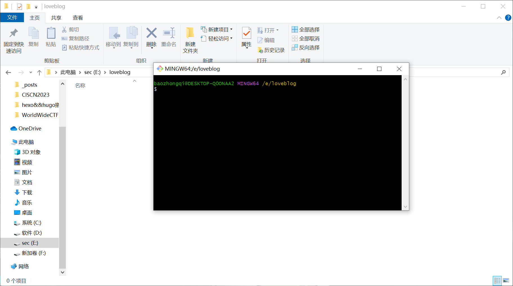

```bash
hexo init
```

这里可能会失败比如说下载不全等等原因，因为使用的git不过多试几次就好了，后面有师傅提供了一个比较方便的方法，容易成功就是在初始化的前面加上`npx`，不过相应的后面所有命令都要这样了并不是那么的方便

```
npx hexo init
```

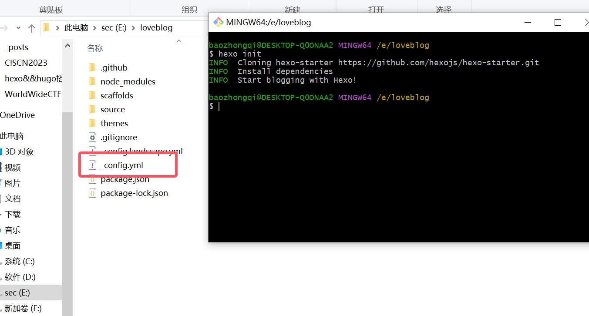

然后点进去我修改的文件，刚才我也提到git会容易失败所以可以换成SSH，SSH等会我们配置先改配置文件

```yaml
deploy:
  type: git
  repo: git@github.com:bao2ongw1/bao2ongw1.github.io.git
  branch: main
```

这里写的**baozongwi/baozongwi.github.io.git**其实就是自己的用户名，你把自己github的用户名换上去就行了，然后我们在`git bash`里面运行`hexo s`

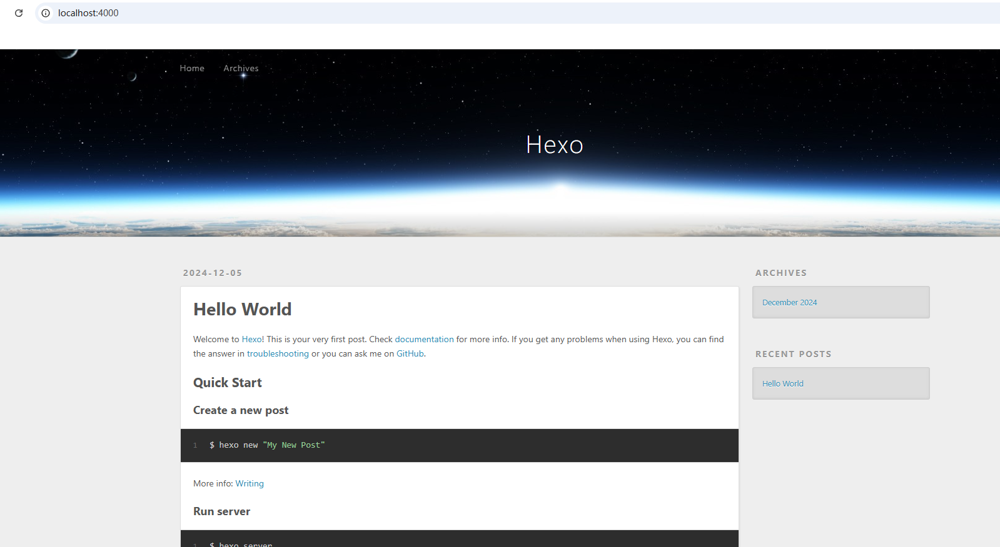

访问就成功了，然后我们配置githubpages的方面

### github pages

先新建一个仓库  **用户名.github.io**，一定要和自己的用户名一样，像我这样设置就好了，一定要是public哈

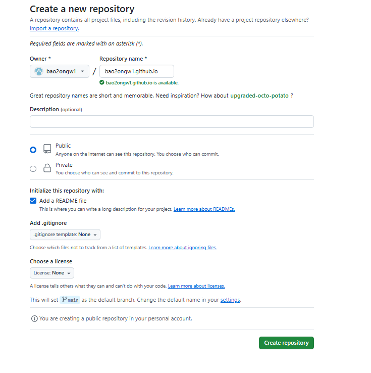

过会访问就可以看到这个网站上线了

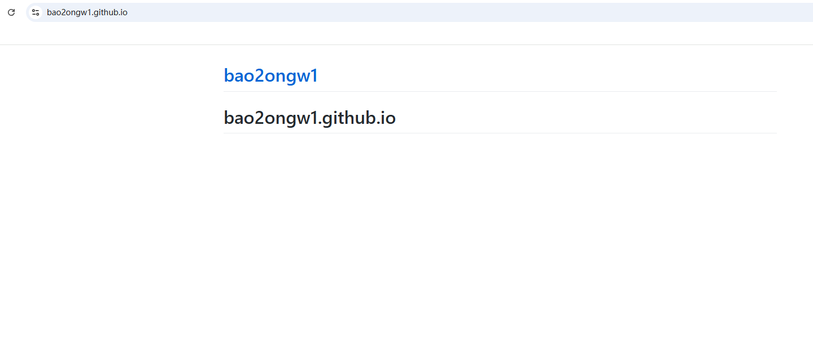

那么我们就是本地有博客，网上有github提供的免费网站，我们现在就是把博客推上去就可以了呀

随便进一个文件夹然后打开终端(git bash也可以)

```shell
ssh-keygen -t rsa -C "2405758945@qq.com"
# 这里写QQ邮箱就可以了，运行这个命令之后还要敲四下enter
```

然后进自己的文件管理，找到我图里框子的文件

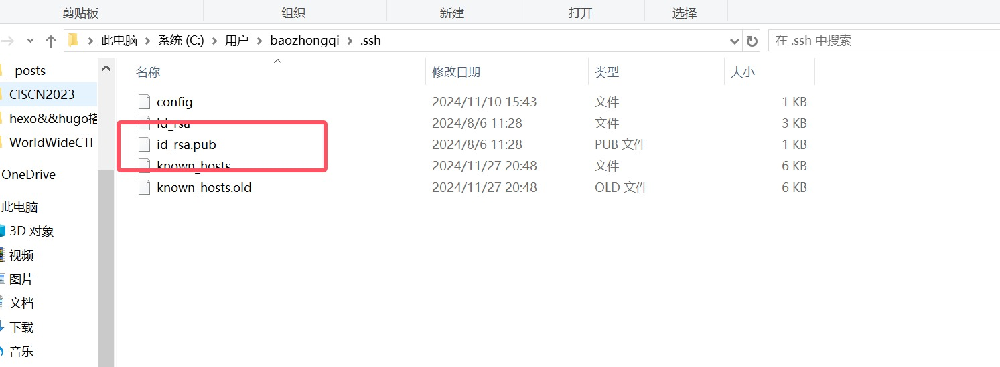

打开，把所有东西复制了，然后放在github配置SSH来

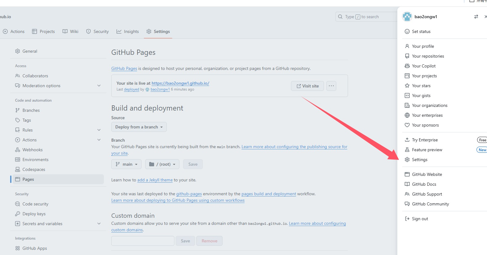

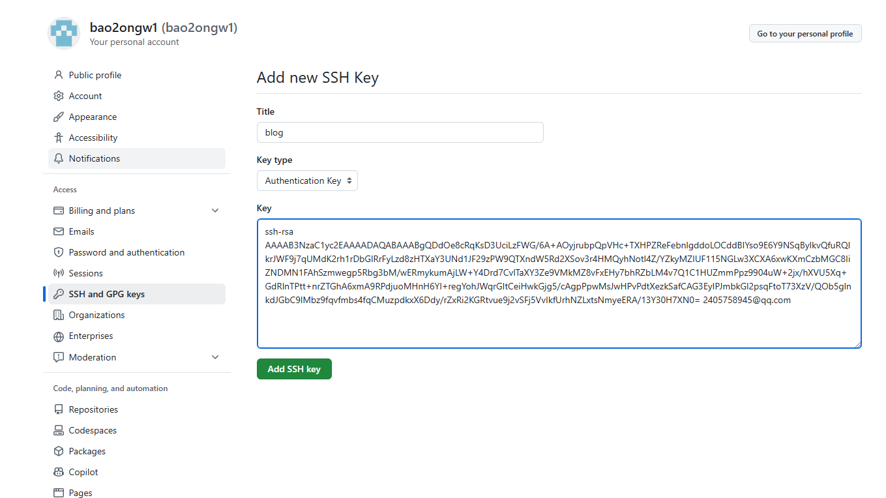

```bash
ssh -T git@github.com
```

然后回显successful就可以了，然后安装部署工具

```shell
npm install hexo-deployer-git --save
```

#### 常见命令

然后就是我们熟悉的三件套

```shell
hexo clean
# 清理缓存
hexo g
# 生成目录
hexo s
# 本地部署博客
hexo d
# 推上pages
hexo new post test
# 写文章
hexo new draft test
# 写草稿
hexo publish test
# 公布草稿(草稿变文章)
```

不过大家可能是只有一个博客，我为了做演示就得寻找如何使用SSH来把控两个githubpages了，因为一个密钥只能用于一个账户所以我们指定路径生成一个密钥，然后配置好之后

```bash
ssh-keygen -t rsa -b 4096 -C "2405758945@qq.com" -f C:\Users\baozhongqi\.ssh\github_bao2ongw1

# 下面是更新用户
git init
git config user.name "bao2ongw1"
git config user.email "2405758945@qq.com"
git config user.name
git config user.email
```

然后发现还是部署不上去，后面仔细看了一下报错，发现这个就是权限问题，那我直接在仓库里面给协作者不就行了，返回自己账号同意邀请，然后部署发现成功，哟西(**网上写的文章没有一个有我这么高效简单**)

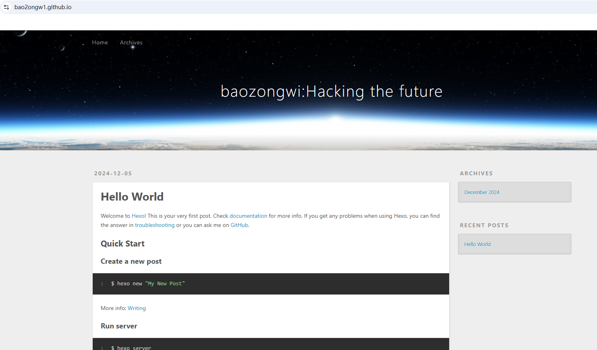

### hexo主题cactus

说实话看了很多主题，我觉得都挺好的，都各有千秋但是我建议是找一个网上参考文章较多的，不然官方文档肯定是不够用的，到时候你就有可能要耗费很多时间去解析这个博客主题，这里选择很多师傅都在使用的cactus，其中挺多功能不是很完善，这也给了个性化的机会

[cactus主题](https://github.com/probberechts/hexo-theme-cactus)

下载之后解压到theme文件夹，结构就像这样就行，然后到根目录的`config.yml`里面把

```yaml
theme: landscape
# 改成
theme: cactus
```

然后创建页面

```
hexo new page about

hexo new page links

hexo new page tags

hexo new page categories
```

然后进入source文件夹发现多了好几个文件夹，里面都有md文件，直接添加如图即可

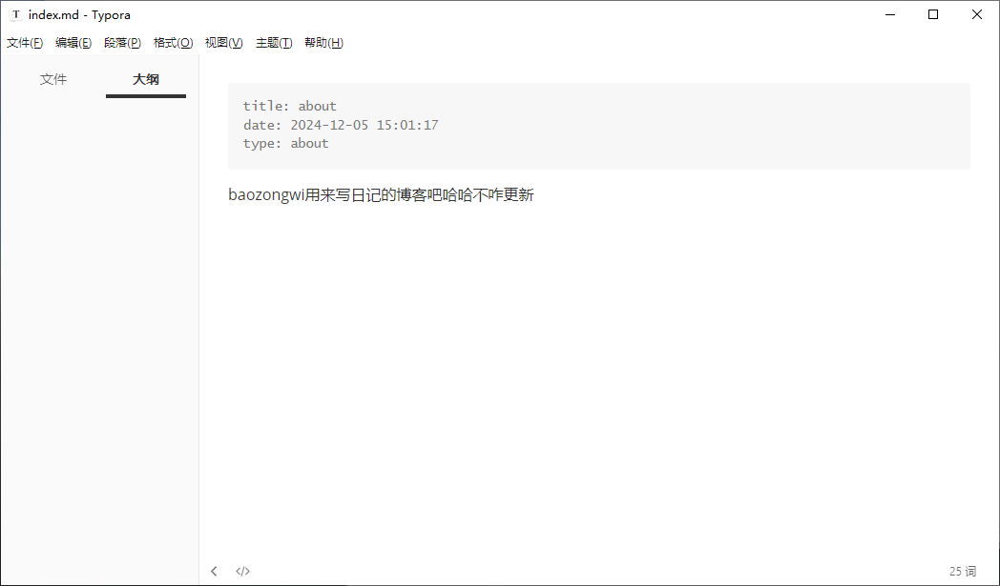

搞好之后再来个文章的搜索功能

```
npm install hexo-generator-search --save
```

然后添加访客人数

```
# themes/cactus/_config.yml
busuanzi:
  enable: true
```

然后把这个路径的这个文件

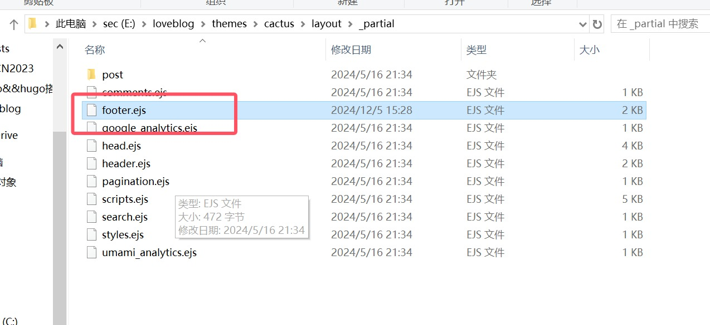

改成

```js
<footer id="footer">
  <div class="footer-left">
    <%= __('footer.copyright') %> &copy;
    <% var endYear = (theme.copyright && theme.copyright.end_year) ? theme.copyright.end_year : new Date().getFullYear() %>
    <% var startYear = (theme.copyright && theme.copyright.start_year) ? theme.copyright.start_year : new Date().getFullYear() %>
    <%= startYear >= endYear ? endYear : startYear + "-" + endYear %>
    <%= config.author || config.title %>
  </div>
  <div class="footer-right">
    <nav>
      <ul>
        <% for (var i in theme.nav) { %><!--
       --><li><a href="<%- url_for(theme.nav[i]) %>"><%= __('nav.'+i).replace("nav.", "") %></a></li><!--
     --><% } %>
      </ul>
	  <ul>
            <% if (theme.busuanzi && theme.busuanzi.enable){ %>
              <!-- 不蒜子统计 -->
              <span id="busuanzi_container_site_pv">
                  本站总访问量<span id="busuanzi_value_site_pv"></span>次
              </span>
              <span class="post-meta-divider">|</span>
              <span id="busuanzi_container_site_uv" style='display:none'>
                      本站访客数<span id="busuanzi_value_site_uv"></span>人
              </span>
            <script async src="//busuanzi.ibruce.info/busuanzi/2.3/busuanzi.pure.mini.js"></script>
            <% } %>
          </ul>
    </nav>
  </div>
</footer>
```

评论啥的肯定也是要整的，但是不一样的主题配置也不一样，我推荐是waline评论或者是disqus评论这两个好用，配好之后写文章就这样

```
hexo new psot "test"

###-----------里面的格式如下
title: test
date: 2017-12-24 23:29:53
tags:
- Foo
- Bar
categories: 
- Baz
---
```

### 图片

图片这件事，真的很简单，我最开始不是让说放一个比较大的盘里面吗，就是因为这个问题，直接在source里面新建一个文件夹images然后在分层

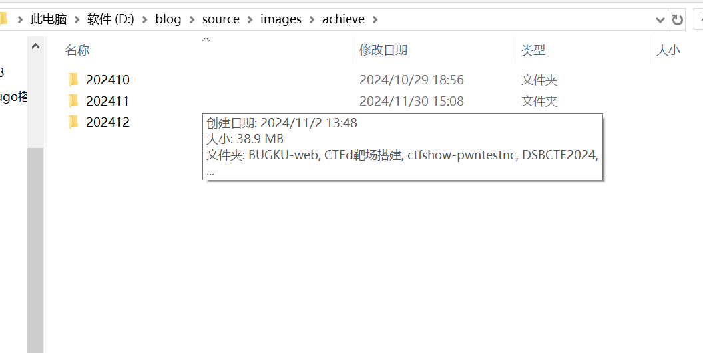

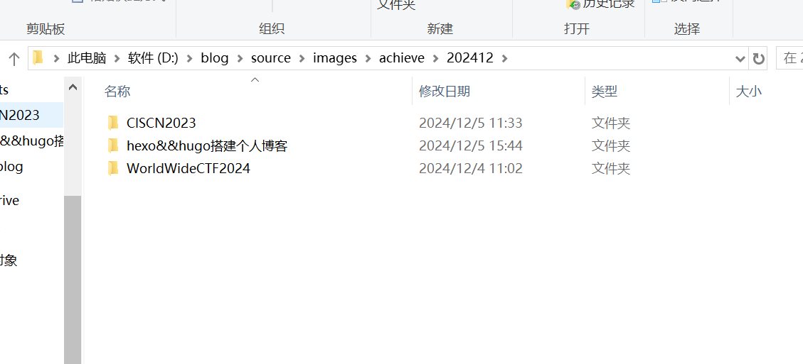

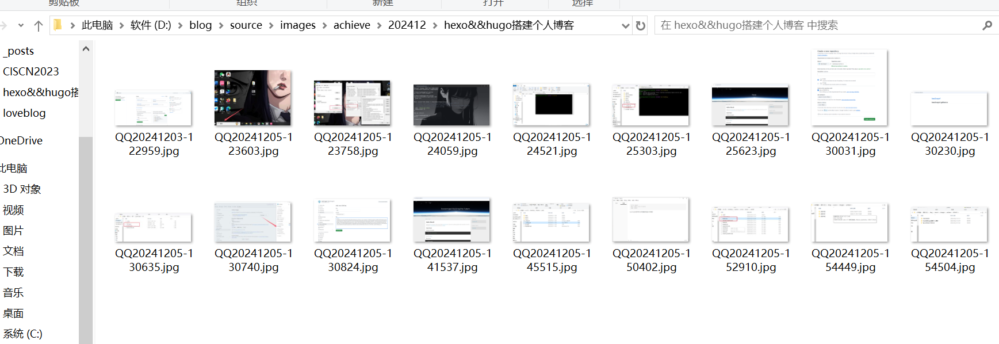

当然你还可以分的再细一点比如说

```
iamges->achieve->2024->12->文章的文件夹->图片
```

引用的时候就直接用md语法就可以了

```

```

其实当你打出这一对括号`()`的时候就已经能够选择文件夹了比如

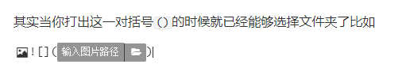

就放图片就行了，文件夹的路径一定要对，之前有见过一些人把这个放在public里面，那里确实是有图片但是，public文件夹是你在github上面的文件夹，当你运行**hexo clean**的时候就会消失，**hexo g**的时候才会再次出现，最后就大概是这样子

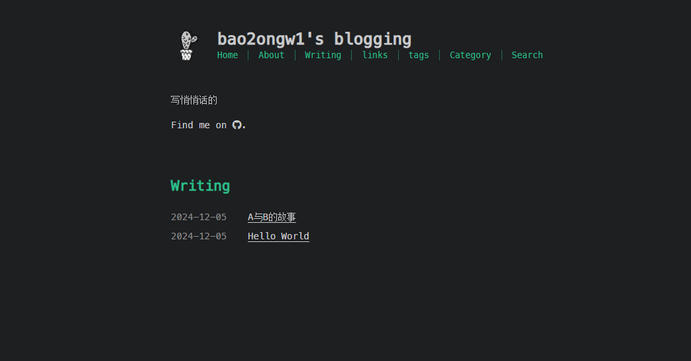

别嫌弃这个博客丑，你其实看很多师傅都是用的这个主题，如果自己动手能力强的话美化可以这样

[一个香港的姐姐的博客](https://jiayu-augustine-chen.github.io/)

最开始我们邮件联系，然后他是走了WordPress结果发现并不是自己想要的，后面加了联系方式搭建hexo，我也没帮什么大忙也就和她起了最初的网站然后她自己美化的这个博客

## hugo

### 初始化

github什么的，就看hexo的就可以了，我们这里直接说怎么用hugo起站，首先去下载hugo

首先安装go，然后放在环境变量即可

[go下载 ](https://go.dev/dl/)   

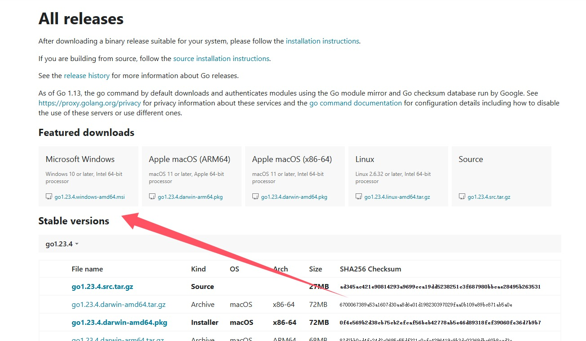

下载好了之后，就配置环境变量，不会配的看上面，然后终端里面检查

```cmd
go version
```

然后下载hugo到环境变量

[hugo](https://github.com/gohugoio/hugo/releases/tag/v0.139.4)   下载这个

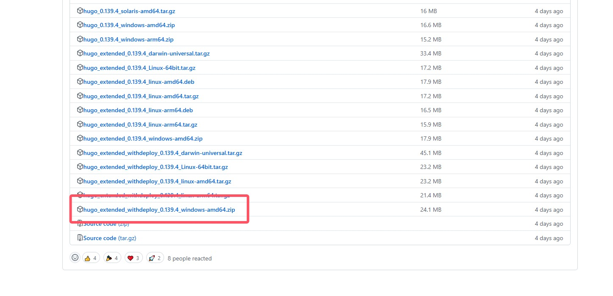

我也不知道那两个有啥区别，下大的，解压之后也是加到环境变量里面

> 这里一定要下载拓展版本

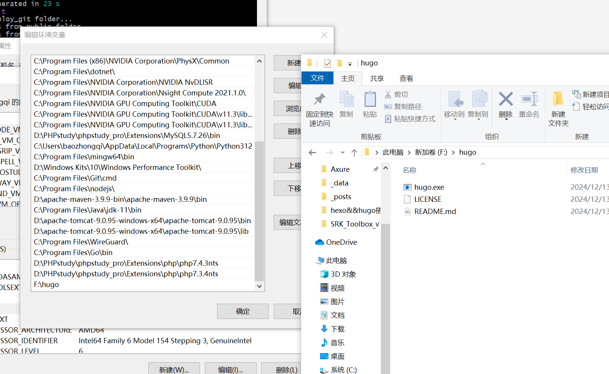

然后建站就可以启动了哈哈，我们克隆一个主题，选择stack主题

```
hugo new site hugostack
cd hugostack
git init
git submodule add https://github.com/CaiJimmy/hugo-theme-stack/ themes/hugo-theme-stack

cp -r themes/hugo-theme-stack/exampleSite/* ./
# 删除根目录下默认的配置文件，不同hugo版本各有不同：hugo.toml/config.yaml
rm hugo.toml
hugo server -D
```

### 常用命令

因为放图片的原因，所以我更倾向于创建一个文件夹

```shell
hugo new post/Java反射/index.md
# 写文章
hugo server -D
# 本地测试
```

嗯好起来了

然后可以看到我们的public目录已经载入好了，这里讲一个重要的点，之前帮朋友搭建的时候发现的一个大误区，就是更新是在`/public`下面，而所有的其他操作都是在根目录`/blogging`，写一下更新的命令吧

在`/public`目录下面

```shell
# 初始化git仓库
git init
# 绑定github仓库
git remote add origin git@github.com:bao2ongw1/bao2ongw1.github.io.git
# 查看绑定好没有
git remote -v
# 查看当前修改状态 
git status 
# 添加修改过得文件， . 表示所有，也可以指定文件 
git add . 
# ""里面的内容就是提交内容的说明信息(随便写)但是是可以看到日志的 
git commit -m "first commit"
# 部署到github,其中的main是github的分支，看你自己仓库什么样子
git push -u origin main
```

不过可能会不成功因为是第一次部署所以我们直接要写一个`f`参数

```
git push -u -f origin main
```

不过后面部署就不用了，我专门写了一个bat文件方便更新

```bat
@echo off
REM === 配置区 ===
set REPO=git@github.com:baozongwi/baozongwi.github.io.git


echo [1/4] 构建 Hugo 站点...
hugo --gc --minify
if errorlevel 1 (
    echo Hugo 构建失败，请检查错误。
    pause
    exit /b 1
)

echo [2/4] 进入 public 目录...
cd public

echo [3/4] 创建 .nojekyll 文件...
echo > .nojekyll

echo [4/4] 提交并推送到 GitHub Pages...
git add -A
git commit -m "Deploy site on %date% %time%" || (
    echo 没有更改需要提交
    goto end
)
git push -f origin main

:end
echo 部署完成！
pause

```

还有一个就是文章添加图片了，这个没有hexo那么方便，由于每一篇文章都是一个文件夹里面的`index.md`和图片，写的时候直接

```

```

即可

### stack主题配置

首先就是`E:\blog\hugostack\archetypes\default.md`

```
title= "{{ replace .Name "-" " " | title }}"
slug= "{{ replace .Name "-" " " | title }}"
description= ""
date= "{{ .Date }}"
lastmod= "{{ .Date }}"
image= ""
license= ""
categories= [""]
tags= [""]
```

改成这样，再生成出来的文章基本就是色香味俱全了，然后我还加了一个Reward功能，就没怎么改了，这个主题非常的完善，把`layouts\partials\article\components\footer.html`的内容改成

```html
<footer class="article-footer">
    {{ partial "article/components/tags" . }}

    {{ if and (site.Params.reward.enable) (ne .Params.reward false) }}
	<section class="article-reward" style="margin: var(--card-padding) 0 0;display:block;text-transform:none;text-align:center;">
	  {{ with site.Params.reward.title }}
		<h3 style="margin:0 0 .75rem 0; font-size:1.1rem;">{{ . }}</h3>
	  {{ end }}

	  <figure style="margin:0 auto;">
		{{ with site.Params.reward.wechat }}
		  
		{{ end }}
		<figcaption style="font-size:.9rem; color:#666; margin-top:.5rem;"></figcaption>
	  </figure>
	</section>
	{{ end }}


    {{ if and (.Site.Params.article.license.enabled) (not (eq .Params.license false)) }}
    <section class="article-copyright">
        {{ partial "helper/icon" "copyright" }}
        <span>{{ default .Site.Params.article.license.default .Params.license | markdownify }}</span>
    </section>
    {{ end }}

    {{- if ne .Lastmod .Date -}}
    <section class="article-lastmod">
        {{ partial "helper/icon" "clock" }}
        <span>
            {{ T "article.lastUpdatedOn" }} {{ .Lastmod | time.Format ( or .Site.Params.dateFormat.lastUpdated "Jan 02, 2006 15:04 MST" ) }}
        </span>
    </section>
    {{- end -}}
</footer>
```

然后在配置文件里面添加选项，我直接放在article后面的

```yaml
params:
    mainSections:
        - post
    featuredImageField: image
    rssFullContent: true
    favicon: # e.g.: favicon placed in `static/favicon.ico` of your site folder, then set this field to `/favicon.ico` (`/` is necessary)

    footer:
        since: 2024
        customText:

    dateFormat:
        published: Jan 02, 2006
        lastUpdated: Jan 02, 2006 15:04 MST

    sidebar:
        emoji: 
        subtitle: H@cking Th3 Fu1ure
        avatar:
            enabled: true
            local: true
            src: img/acvtar.jpg

    article:
        math: false
        toc: true
        readingTime: true
        wordCount:
          other: "{{.Count}} words"
        license:
            enabled: true
            default: Licensed under CC BY-NC-SA 4.0
    
    reward:
        enable: true
        title: "赞赏支持"
        wechat: "/wechat.png"
```

弄好这个之后，我发现hugo的更新比起hexo来说会相对麻烦一些，于是我就写了一个bat放在博客根目录专门用来更新

```bat
@echo off
chcp 65001 >nul
REM === 配置区 ===
set REPO=git@github.com:baozongwi/baozongwi.github.io.git


echo [1/4] 构建 Hugo 站点...
hugo --gc --minify
if errorlevel 1 (
    echo Hugo 构建失败，请检查错误。
    pause
    exit /b 1
)

echo [2/4] 进入 public 目录...
cd public

echo [3/4] 创建 .nojekyll 文件...
echo > .nojekyll

echo [4/4] 提交并推送到 GitHub Pages...
git add -A
git commit -m "Deploy site on %date% %time%" || (
    echo 没有更改需要提交
    goto end
)
git push -f origin main

:end
echo 部署完成！
pause

```

与此同时，我已经成功二开 Stack 主题，喜欢的师傅可以私聊我发你源代码
