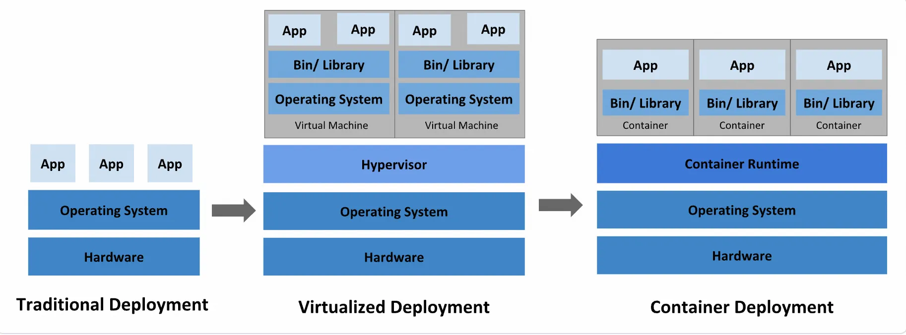
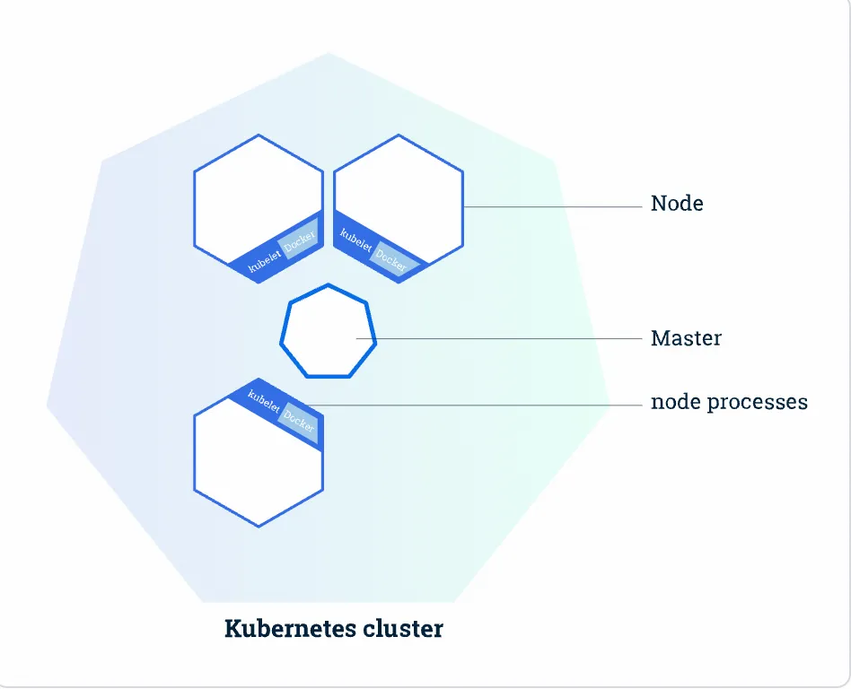
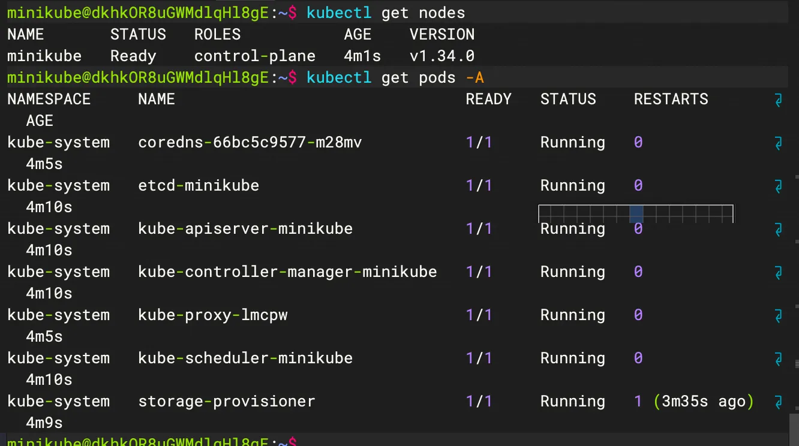
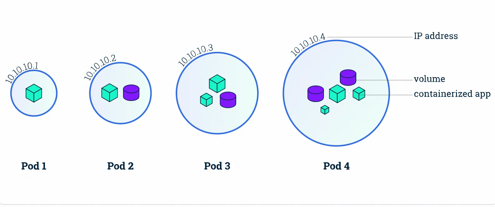
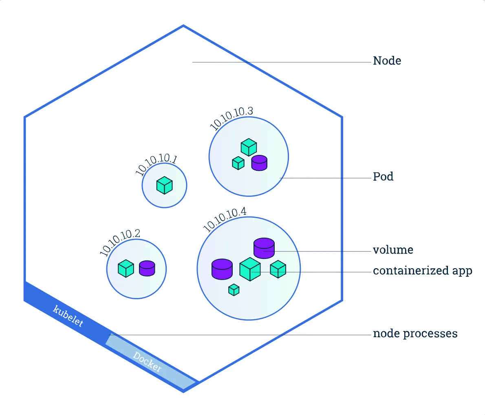
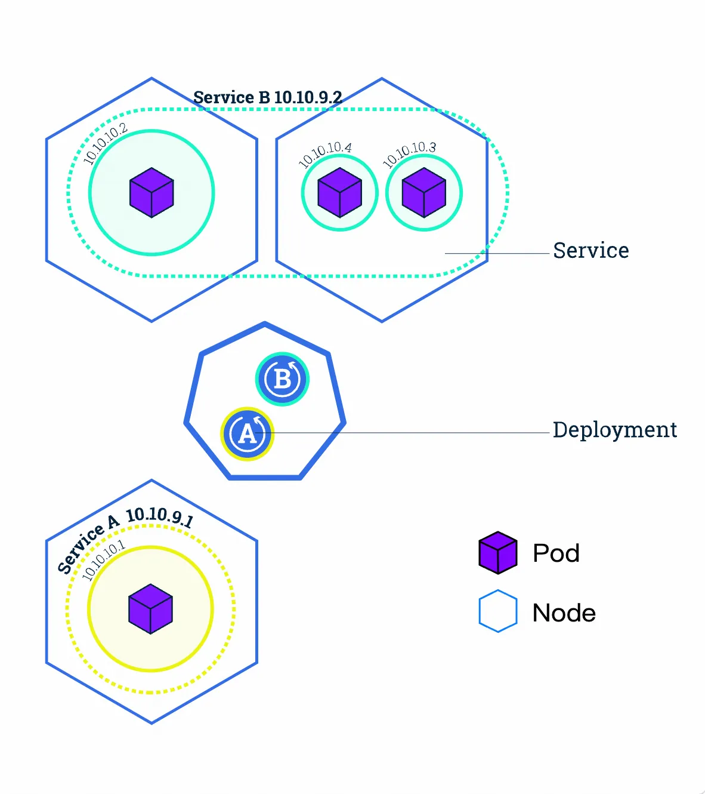
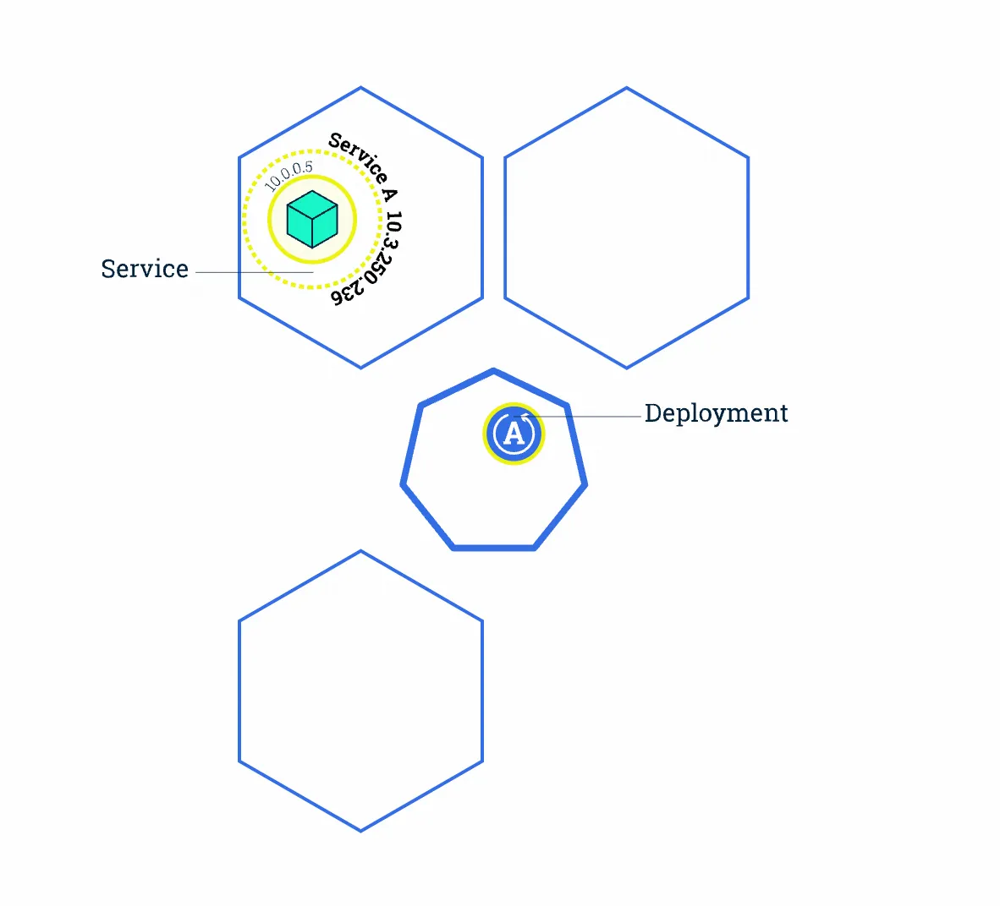
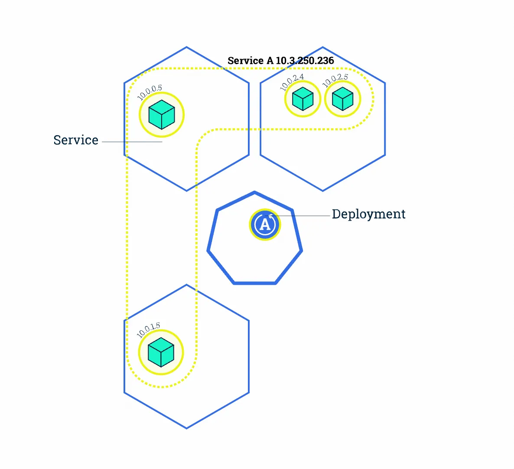
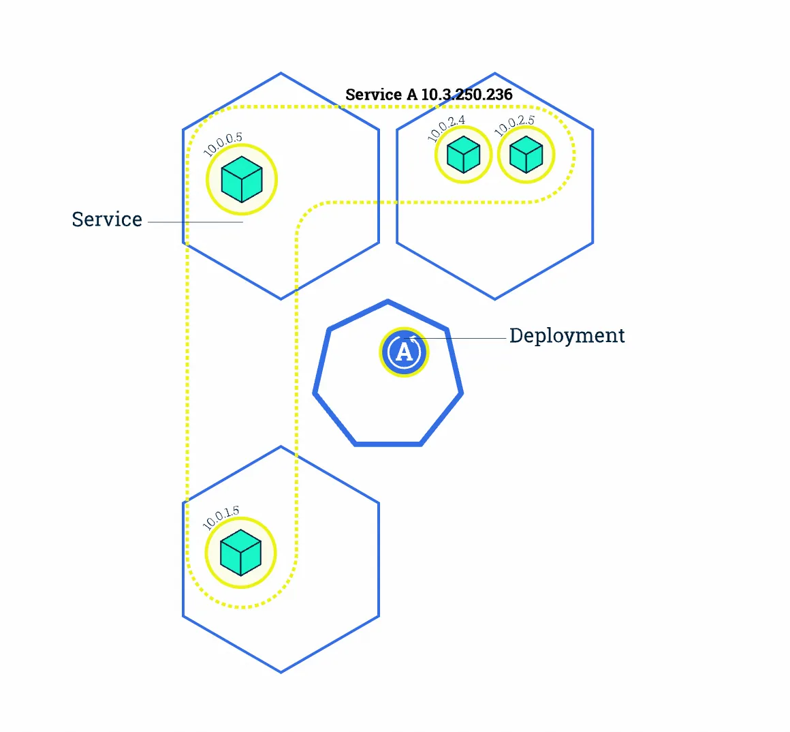
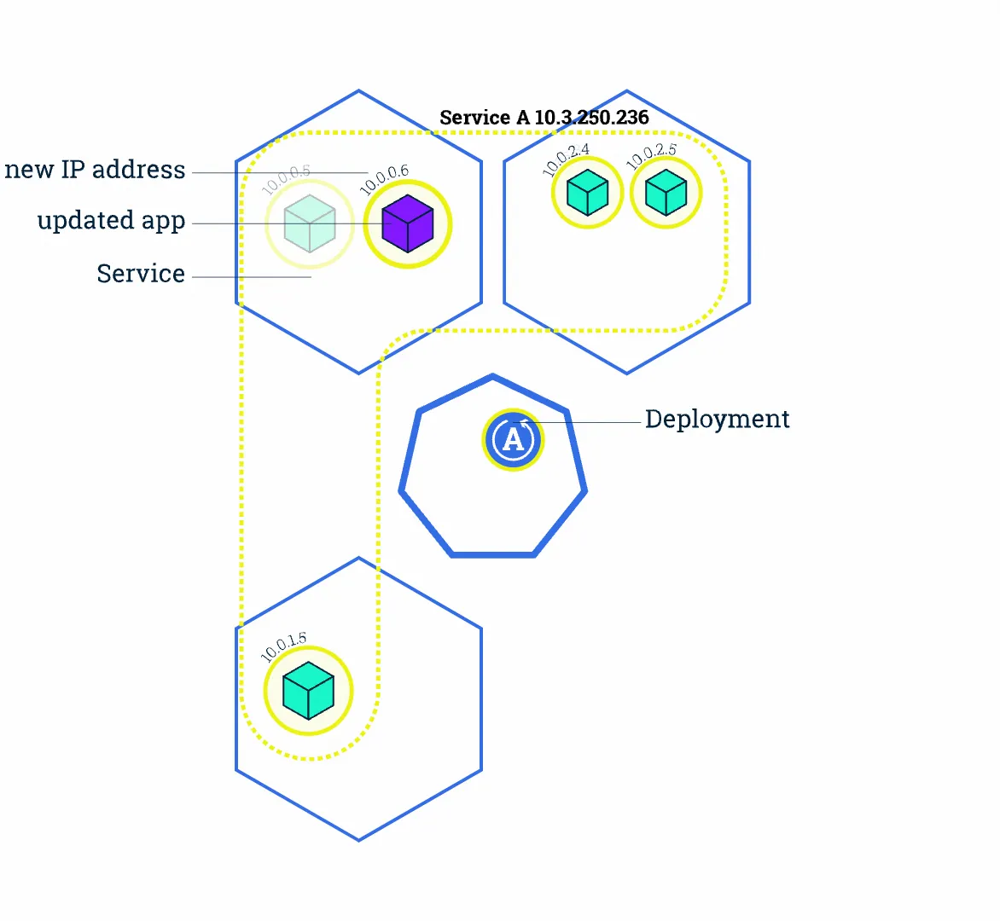

+++
title= "Kubernetes基础入门使用"
slug= "kubernetes-getting-started-tutorial"
description= ""
date= "2025-09-29T09:04:12+08:00"
lastmod= "2025-09-29T09:04:12+08:00"
image= ""
license= ""
categories= ["talk"]
tags= ["k8s"]

+++

## 概念

现在国内的安全越来越少的传统AD了，所以k8s是不可能越过的坎，必须来了解学习一下。包括现在很多的CTF平台其实都更倾向于使用轻量k8s(k3s)。

Kubernetes是一个可以移植、可扩展的开源平台，使用声明式配置并依据配置信息自动地执行容器化应用程序的管理。在所有的容器编排工具中（类似的还有 docker swarm / mesos等），Kubernetes的生态系统更大、增长更快，有更多的支持、服务和工具可供用户选择。

其中，声明式配置就是使用yaml等文件明确定义应用等期望状态，这样的好处是什么呢？

- Kubernetes 的控制器（如 Deployment Controller）持续比较 **当前状态** 和 **声明中期望的状态** 。
- 若不一致（如Pod崩溃导致副本数不足），自动触发修复（如新建Pod）。



- **传统部署时代**：早期，企业直接将应用程序部署在物理机上。由于物理机上不能为应用程序定义资源使用边界，我们也就很难合理地分配计算资源。例如：如果多个应用程序运行在同一台物理机上，可能发生这样的情况：其中的一个应用程序消耗了大多数的计算资源，导致其他应用程序不能正常运行。应对此问题的一种解决办法是，将每一个应用程序运行在不同的物理机上。然而，这种做法无法大规模实施，因为资源利用率很低，且企业维护更多物理机的成本昂贵。
- **虚拟化部署时代**：针对上述问题，虚拟化技术应运而生。用户可以在单台物理机的CPU上运行多个虚拟机（Virtual Machine）。

- 虚拟化技术使得应用程序被虚拟机相互分隔开，限制了应用程序之间的非法访问，进而提供了一定程度的安全性。
- 虚拟化技术提高了物理机的资源利用率，可以更容易地安装或更新应用程序，降低了硬件成本，因此可以更好地规模化实施。
- 每一个虚拟机可以认为是被虚拟化的物理机之上的一台完整的机器，其中运行了一台机器的所有组件，包括虚拟机自身的操作系统。

- **容器化部署时代**：容器与虚拟机类似，但是降低了隔离层级，共享了操作系统。因此，容器可以认为是轻量级的。

- 与虚拟机相似，每个容器拥有自己的文件系统、CPU、内存、进程空间等
- 运行应用程序所需要的资源都被容器包装，并和底层基础架构解耦
- 容器化的应用程序可以跨云服务商、跨Linux操作系统发行版进行部署

🥺我们平时直接在服务器或者是虚拟机上面起docker复现就是第一种，相当操蛋了，如果你起了一个较大的容器，其他容器服务可能就遭不住了，甚至你的服务器也会白给(别问，我知道

我们在自己电脑上面安装虚拟机就是第二种，而第三种就是本文，小包所学习的。第三种的好处可就是多多的了，如下：

容器技术通过轻量化、标准化和自动化 ，显著提升了应用开发和部署的效率与灵活性。相较于虚拟机，容器镜像的构建和部署更快速敏捷 ，支持持续集成与回滚，同时解耦开发与运维 ——开发聚焦应用构建，运维专注基础设施。容器提供环境一致性 ，确保开发、测试、生产环境无缝衔接，并具备跨云跨平台 的可移植性。它以应用为中心 ，优化资源隔离与利用率，支持弹性微服务架构 ，使分布式应用更易扩展和维护，同时通过细粒度监控保障应用健康。

## 基础组件

### Master组件

Master组件是集群的控制平台（control plane）：

- master 组件负责集群中的全局决策（例如，调度）
- master 组件探测并响应集群事件（例如，当 Deployment 的实际 Pod 副本数未达到 `replicas` 字段的规定时，启动一个新的 Pod）

Master组件可以运行于集群中的任何机器上。但是，为了简洁性，通常在同一台机器上运行所有的 master 组件，且不在此机器上运行用户的容器，这就是master节点。

**kube-apiserver如下：**

此 master 组件提供 Kubernetes API。这是Kubernetes控制平台的前端（front-end），可以水平扩展（通过部署更多的实例以达到性能要求）。kubectl / kubernetes dashboard / kuboard 等Kubernetes管理工具就是通过 kubernetes API 实现对 Kubernetes 集群的管理。

**etcd如下：**

支持一致性和高可用的名值对存储组件，Kubernetes集群的所有配置信息都存储在 etcd 中。

**kube-scheduler如下：**

此 master 组件监控所有新创建尚未分配到节点上的 Pod，并且自动选择为 Pod 选择一个合适的节点去运行。影响调度的因素有：

- 单个或多个 Pod 的资源需求
- 硬件、软件、策略的限制
- 亲和与反亲和（affinity and anti-affinity）的约定
- 数据本地化要求
- 工作负载间的相互作用

**kube-controller-manager如下：**

此 master 组件运行了所有的控制器。逻辑上来说，每一个控制器是一个独立的进程，但是为了降低复杂度，这些控制器都被合并运行在一个进程里。

kube-controller-manager 中包含的控制器有：

- 节点控制器： 负责监听节点停机的事件并作出对应响应
- 副本控制器： 负责为集群中每一个 副本控制器对象（Replication Controller Object）维护期望的 Pod 副本数
- 端点（Endpoints）控制器：负责为端点对象（Endpoints Object，连接 Service 和 Pod）赋值
- Service Account & Token控制器： 负责为新的名称空间创建 default Service Account 以及 API Access Token

**cloud-controller-manager如下：**

cloud-controller-manager 中运行了与具体云基础设施供应商互动的控制器。这是 Kubernetes 1.6 版本中引入的特性，尚处在内测阶段。cloud-controller-manager 只运行特定于云基础设施供应商的控制器。如果您参考 www.kuboard.cn 上提供的文档安装 Kubernetes 集群，默认不安装 cloud-controller-manager。

cloud-controller-manager 使得云供应商的代码和 Kubernetes 的代码可以各自独立的演化。在此之前的版本中，Kubernetes的核心代码是依赖于云供应商的代码的。在后续的版本中，特定于云供应商的代码将由云供应商自行维护，并在运行Kubernetes时链接到 cloud-controller-manager。

以下控制器中包含与云供应商相关的依赖：

- 节点控制器：当某一个节点停止响应时，调用云供应商的接口，以检查该节点的虚拟机是否已经被云供应商删除
- 路由控制器：在云供应商的基础设施中设定网络路由
- 服务（Service）控制器：创建、更新、删除云供应商提供的负载均衡器
- 数据卷（Volume）控制器：创建、绑定、挂载数据卷，并协调云供应商编排数据卷

### Node组件

Node 组件运行在每一个节点上（包括 master 节点和 worker 节点），负责维护运行中的 Pod 并提供 Kubernetes 运行时环境。
**kubelet如下：**

此组件是运行在每一个集群节点上的代理程序。它确保 Pod 中的容器处于运行状态。Kubelet 通过多种途径获得 PodSpec 定义，并确保 PodSpec 定义中所描述的容器处于运行和健康的状态。Kubelet不管理不是通过 Kubernetes 创建的容器。

**kube-proxy如下：**

[kube-proxy](https://www.kuboard.cn/learning/k8s-intermediate/service/service-details.html#虚拟-ip-和服务代理) 是一个网络代理程序，运行在集群中的每一个节点上，是实现 Kubernetes Service 概念的重要部分。

kube-proxy 在节点上维护网络规则。这些网络规则使得您可以在集群内、集群外正确地与 Pod 进行网络通信。如果操作系统中存在 packet filtering layer，kube-proxy 将使用这一特性（[iptables代理模式](https://www.kuboard.cn/learning/k8s-intermediate/service/service-details.html#iptables-代理模式)），否则，kube-proxy将自行转发网络请求（[User space代理模式](https://www.kuboard.cn/learning/k8s-intermediate/service/service-details.html#user-space-代理模式)）
**容器引擎如下：**

容器引擎负责**运行容器**。Kubernetes支持多种容器引擎：[Docker](http://www.docker.com/)、[containerd](https://containerd.io/)、[cri-o](https://cri-o.io/)、[rktlet](https://github.com/kubernetes-incubator/rktlet)以及任何实现了 Kubernetes容器引擎接口的容器引擎

```plain
用户通过 kubectl 创建 Pod/Service
   │
   ↓
API Server 写入 etcd
   │
   ├── kubelet 监听到 Pod 变化 → 调用容器引擎运行容器
   │
   └── kube-proxy 监听到 Service 变化 → 配置 iptables/ipvs 规则
```

### Addons组件

Addons 使用 Kubernetes 资源（DaemonSet、Deployment等）实现集群的功能特性。由于他们提供集群级别的功能特性，addons使用到的Kubernetes资源都放置在 `kube-system` 名称空间下。

**DNS如下：**

除了 DNS Addon 以外，其他的 addon 都不是必须的，所有 Kubernetes 集群都应该有 [Cluster DNS](https://www.kuboard.cn/learning/k8s-intermediate/service/dns.html)

Cluster DNS 是一个 DNS 服务器，是对您已有环境中其他 DNS 服务器的一个补充，存放了 Kubernetes Service 的 DNS 记录。Kubernetes 启动容器时，自动将该 DNS 服务器加入到容器的 DNS 搜索列表中。

**Web UI（Dashboard）如下：**

可视化查看资源状态、创建/删除对象、查看日志等

**Kuboard如下：**

[Kuboard](https://www.kuboard.cn/install/v3/install.html) 是一款基于Kubernetes的微服务管理界面，相较于 Dashboard，Kuboard 强调：

- 无需手工编写 YAML 文件
- 微服务参考架构
- 上下文相关的监控
- 场景化的设计

- 导出配置
- 导入配置

适合非运维成员进行使用

**ContainerResource Monitoring如下：**

- **Metrics Server** ：收集节点/Pod 资源指标，供 `**kubectl top**` 和 HPA 使用。
- **Prometheus** ：存储历史指标，结合 Grafana 展示。

**Cluster-level Logging如下：**

- **Fluentd** 从容器收集日志 → 发送到 **Elasticsearch** → **Kibana** 可视化查询。

了解了这些基础组件，我们来看看整体架构


一般都集群的机器图如上，上图是一个拥有一个Master(主)节点和六个Worker(工作)节点的k8s集群



**Master 负责管理集群** 负责协调集群中的所有活动，例如调度应用程序，维护应用程序的状态，扩展和更新应用程序。**Worker节点(即图中的Node)是VM(虚拟机)或物理计算机，充当k8s集群中的工作计算机。** 每个Worker节点都有一个Kubelet，它管理该Worker节点并负责与Master节点通信。该Worker节点还应具有用于处理容器操作的工具，例如Docker等。

## 安装&&部署第一个应用

😎了解了基础的机制之后就动手操练操练，但是由于我只有一台服务器，所以我是单节点模式。这里选择使用minikube，docker容器作为node。

```bash
sudo apt update
sudo apt install -y curl wget

# 安装 kubectl（Kubernetes 命令行工具）
curl -LO "https://dl.k8s.io/release/$(curl -L -s https://dl.k8s.io/release/stable.txt)/bin/linux/amd64/kubectl"
chmod +x kubectl
sudo mv kubectl /usr/local/bin/

# 下载最新版 Minikube
curl -LO https://storage.googleapis.com/minikube/releases/latest/minikube-linux-amd64
sudo install minikube-linux-amd64 /usr/local/bin/minikube

# 验证安装
minikube version
```

安装好了之后启动集群，但是其为了安全考虑不允许root启动，所以我们先创建一个用户。

```bash
sudo adduser minikube
# 按提示设置密码
sudo usermod -aG docker minikube

# 添加sudo权限
visudo
## 添加minikube到最后保存
minikube ALL=(ALL:ALL) ALL

su - minikube

minikube start --driver=docker

minikube status
kubectl get nodes
kubectl get pods -A

# 停止当前运行的集群
minikube stop

# 彻底删除集群（释放所有资源）
minikube delete
```

前面我们说了k8s是声明式配置，一般地，我们使用yaml来创建容器。


由于我们是测试环境所以选择**port-forward**这种模式

```yaml
apiVersion: apps/v1
kind: Deployment
metadata:
  name: nginx-deployment
spec:
  replicas: 1
  selector:
    matchLabels:
      app: nginx
  template:
    metadata:
      labels:
        app: nginx
    spec:
      containers:
      - name: nginx
        image: nginx:latest
        ports:
        - containerPort: 80
---
apiVersion: v1
kind: Service
metadata:
  name: nginx-service
spec:
  selector:
    app: nginx
  ports:
    - protocol: TCP
      port: 80
      targetPort: 80
```

其中的`---`是精髓，因为我在这个yaml里面写了`Deployment`和`service`两个东西，写好之后，应用模版

```bash
kubectl apply -f nginx.yaml

kubectl port-forward svc/nginx-service 8080:80

kubectl get pods

# 管理pod之删除
kubectl delete -f nginx-deployment.yaml
kubectl delete -f nginx-service-nodeport.yaml
# 如果提前把配置文件删了的，可以直接从deployment删除
kubectl get deployment
kubectl delete deployment nginx-deployment
```

本地（服务器）就可以访问这个nginx了

## 基础的资源部署

刚才创建 Deployment 后，k8s创建了一个 **Pod（容器组）** 来放置应用程序实例（container 容器）。

Pod 是 k8s 集群上的最基本的单元。但是他并不是容器，而是容器组，如下图


**Pod 容器组** 是一个k8s中一个抽象的概念，用于存放一组 container（可包含一个或多个 container 容器，即图上正方体)，以及这些 container （容器)的一些共享资源。这些资源包括：

- 共享存储，称为卷(Volumes)，即图上紫色圆柱
- 网络，每个 Pod（容器组）在集群中有个唯一的 IP，pod（容器组）中的 container（容器）共享该IP地址
- container（容器）的基本信息，例如容器的镜像版本，对外暴露的端口等

当我们在 k8s 上创建 Deployment 时，会在集群上创建包含容器的 Pod (而不是直接创建容器)。每个Pod都与运行它的 worker 节点（Node）绑定，并保持在那里直到终止或被删除。如果节点（Node）发生故障，则会在群集中的其他可用节点（Node）上运行相同的 Pod（从同样的镜像创建 Container，使用同样的配置，IP 地址不同，Pod 名字不同）。

总的来说，

- Pod 是一组容器（可包含一个或多个应用程序容器），以及共享存储（卷 Volumes）、IP 地址和有关如何运行容器的信息。
- 如果多个容器紧密耦合并且需要共享磁盘等资源，则他们应该被部署在同一个Pod（容器组）中。

而node节点就是运行 pod（容器组）的母鸡



Node（节点）是 kubernetes 集群中的计算机，可以是虚拟机或物理机。每个 Node（节点）都由 master 管理。一个 Node（节点）可以有多个Pod（容器组），kubernetes master 会根据每个 Node（节点）上可用资源的情况，自动调度 Pod（容器组）到最佳的 Node（节点）上。

每个 Kubernetes Node（节点）至少运行：

- Kubelet，负责 master 节点和 worker 节点之间通信的进程；管理 Pod（容器组）和 Pod（容器组）内运行的 Container（容器）。
- 容器运行环境（如Docker）负责下载镜像、创建和运行容器等。

现在来学习一下常用的操作资源的命令

```bash
#获取类型为Deployment\pods\nodes的资源列表
kubectl get deployments
kubectl get pods
kubectl get nodes


# 在命令后增加 -A 或 --all-namespaces 可查看所有 名称空间中 的对象，使用参数 -n 可查看指定名称空间的对象
kubectl get deployments -A
kubectl get deployments --all-namespaces

kubectl get deployments -n kube-system

# kubectl describe 显示有关资源的详细信息（包括查询报错）
kubectl describe pod nginx-XXXXXX	
kubectl describe deployment nginx	

# 查询日志
kubectl logs -f nginx-pod-XXXXXXX

## 进入pod
kubectl exec -it nginx-pod-xxxxxx /bin/bash
```

那我们创建的nginx是只能本地访问的，如何才能做到外部访问呢？

Kubernetes 中的 **Service（服务）** 提供了这样的一个抽象层，它选择具备某些特征的 Pod（容器组）并为它们定义一个访问方式。Service（服务）使 Pod（容器组）之间的相互依赖解耦（原本从一个 Pod 中访问另外一个 Pod，需要知道对方的 IP 地址）。一个 Service（服务）选定哪些 **Pod（容器组）** 通常由 **LabelSelector(标签选择器)** 来决定。

在创建Service的时候，通过设置配置文件中的 spec.type 字段的值，可以以不同方式向外部暴露应用程序：

- **ClusterIP**（默认）：

在群集中的内部IP上公布服务，这种方式的 Service（服务）只在集群内部可以访问到

- **NodePort：**

使用 NAT 在集群中每个的同一端口上公布服务。这种方式下，可以通过访问集群中任意节点+端口号的方式访问服务 `<NodeIP>:<NodePort>`。此时 ClusterIP 的访问方式仍然可用。

- **LoadBalancer：**

在云环境中（需要云供应商可以支持）创建一个集群外部的负载均衡器，并为使用该负载均衡器的 IP 地址作为服务的访问地址。此时 ClusterIP 和 NodePort 的访问方式仍然可用。


Service 将外部请求路由到一组 Pod 中，它提供了一个抽象层，使得 Kubernetes 可以在不影响服务调用者的情况下，动态调度容器组（在容器组失效后重新创建容器组，增加或者减少同一个 Deployment 对应容器组的数量等）。这个东西就是LabelSelector。

创建pod的时候配置文件里，会明确写明Labels，通过查询对应返回外部，具体实现我们选择NodePort

```yaml
apiVersion: apps/v1
kind: Deployment
metadata:
  name: nginx-deployment
spec:
  replicas: 1
  selector:
    matchLabels:
      app: nginx
  template:
    metadata:
      labels:
        app: nginx
    spec:
      containers:
      - name: nginx
        image: nginx:latest
        ports:
        - containerPort: 80
---
apiVersion: v1
kind: Service
metadata:
  name: nginx-service
spec:
  selector:
    app: nginx
  ports:
    - protocol: TCP
      port: 80
      targetPort: 80
      nodePort: 32600
  type: NodePort
```

启动好之后查看是否成功执行

```bash
kubectl get services -o wide
```

依旧不能访问，原因是因为minikube的网络是隔离的，所以本地能通过访问节点访问就行了

上面我们发布的 Deployment 只创建了一个 Pod 来运行我们的应用程序。当流量增加时，我们需要对应用程序进行伸缩操作以满足系统性能需求。这个时候我们只需要增加副本数就可以增加应用程序



修改了 Deployment 的 replicas 为 4 后，Kubernetes 又为该 Deployment 创建了 3 新的 Pod，这 4 个 Pod 有相同的标签。因此Service A通过标签选择器与新的 Pod建立了对应关系，将访问流量通过负载均衡在 4 个 Pod 之间进行转发。



```yaml
apiVersion: apps/v1
kind: Deployment
metadata:
  name: nginx-deployment
spec:
  replicas: 4
  selector:
    matchLabels:
      app: nginx
  template:
    metadata:
      labels:
        app: nginx
    spec:
      containers:
      - name: nginx
        image: nginx:latest
        ports:
        - containerPort: 80
---
apiVersion: v1
kind: Service
metadata:
  name: nginx-service
spec:
  selector:
    app: nginx
  ports:
    - protocol: TCP
      port: 80
      targetPort: 80
```

启动之后就发现确实多了嗷，耐造

```bash
# 观察运行状态
watch kubectl get pods -o wide
```

那有时候应用更新我们也需要跟着迭代，在 Kubernetes 中，这是通过 Rolling Update 滚动更新完成的。**Rolling Update滚动更新** 通过使用新版本的 Pod 逐步替代旧版本的 Pod 来实现 Deployment 的更新，从而实现零停机。新的 Pod 将在具有可用资源的 Node（节点）上进行调度。


原本 Service A 将流量负载均衡到 4 个旧版本的 Pod （当中的容器为 绿色）上



更新完 Deployment 部署文件中的镜像版本后，master 节点选择了一个 worker 节点，并根据新的镜像版本创建 Pod（紫色容器）。新 Pod 拥有唯一的新的 IP。同时，master 节点选择一个旧版本的 Pod 将其移除。此时，Service A 将新 Pod 纳入到负载均衡中，将旧Pod移除。类似的将所有pod更新完

观察更新过程

```bash
kubectl apply -f nginx.yaml

watch kubectl get pods -l app=nginx
```

> https://www.kuboard.cn/learning/
