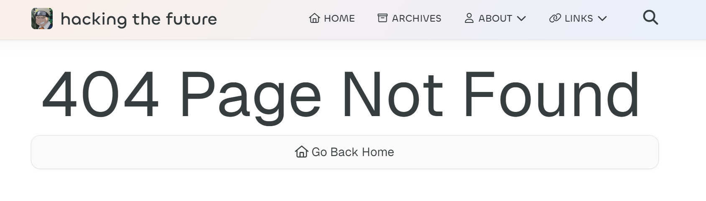
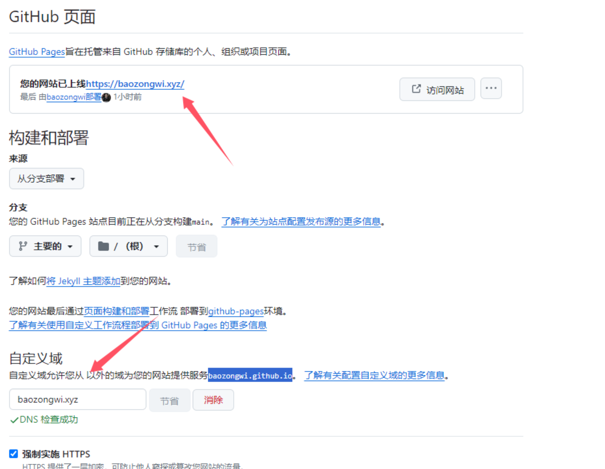
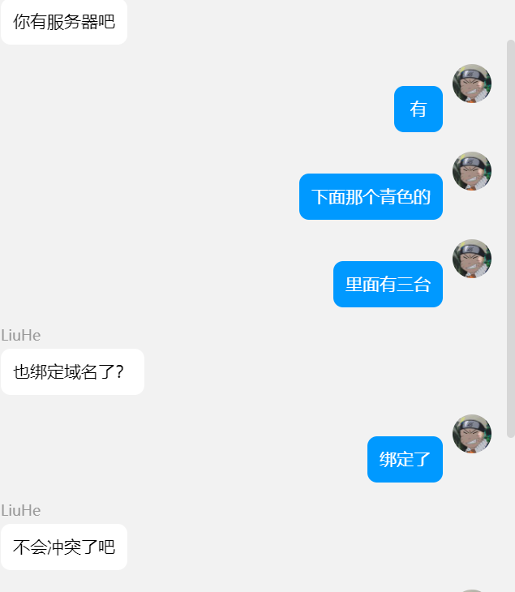
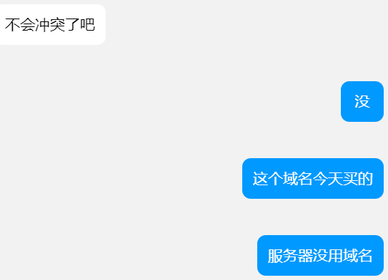

+++
title = "Liu ✌最帅"
slug = "liu-most-handsome"
description = "用服务器托管博客"
date = "2024-08-14T22:36:06"
lastmod = "2024-08-14T22:36:06"
image = ""
license = ""
categories = ["talk"]
tags = ["小站"]
+++

# 0x01 前言

我实在是受不了GitHub的访问太慢了,而且要魔法,也不是很方便,于是去腾子那里注册了一个`xyz`我是觉得很有意思的名字啦昂,但是中途出现了一些意外

# 0x02 自己倒腾

## 域名解析

我像网上一般,直接先在`github`仓库里面创建

```
CNAME:baozongwi.xyz
```

然后配置好之后,确实是可以访问了,但是!!!,他nn的后面在`yml`里面出了大问题

```
deploy:
  type: git
  repo: git@baozongwi.xyz:/www/repo/hexo.git
  branch: main
```

那个教程叫我这样子放,,像我这种老实人很听话直接就放了,然后`hexo d`出错为

```
ssh: connect to host baozongwi.xyz port 22: Network is unreachable
fatal: Could not read from remote repository.
```

`ssh` 出了问题?不会啊我进行远程`ssh`链接是正确的,但是为什么不对呢,难道是权限不够,但是还是弄对了呀

```
ssh -v git@服务器公网IP
```

成功了,给权限也没有任何错误

于是乎我想着这本来就是在GitHub上面我直接部署在GitHub上面然后再解析不就行了,"天真的我"

成功把网页`404`了



嗯甚至是`GitHub`的界面`404`的也有

## vps

vps跟着操作之后也是用上了宝塔然后发现欸,这网站,我和vps有半毛钱关系嘛,我文件都是本地文件,有啥用呢,于是我把网站停了,直接访问域名,这下确实是好起来了,速度也快了,但是还是部署有问题,我还发现一个事情

### 强行部署

我每次部署完之后是不能使用的,只能重新在`GitHub`上面重新进行一个操作



oh shit,那不是很麻烦，于是我只能在群里救援了

# 0x03 Liu

"我帮你远程一下吧",听到这个话我还是非常的开心的，因为终于不用自己坐牢了，至少还有他陪我一起嘿嘿嘿

开始解析，他明白我想要的东西是什么之后还是先直接开始CNAME,但是后面发现网站被占用了(我忘记关站了)，于是开始配置，慢慢的一步一步的

## 难绷1

我没关站，但是我说我关了





哈哈哈,太™搞笑了.jpg

## 难绷2

在起站之后我们发现`php`不行,即使`php`我们开的静态的,于是乎Liu✌大胆的去开了一个`html`,结果解析都不行

## 成功

终于三下五除二,慢慢一步步排查,我们发现了问题,最后部署`blog`的方案是

首先本地部署到`GitHub`仓库,然后`vps`进行`git clone`,欸那么服务器所起的站不就能行了嘛

所以我们直接gank

最后在`无痕模式下`成功访问了`http`,再者去藤子那里拿了免费的`ssl`证书,欧克也是成功了


# 0x04 小结

其实我想的并不是这个样子，因为我跟着那个师傅的blog走，确实是没达到效果，但是后面我主动去评论区提问，师傅也很快就回答我了，但是并没有解决问题

我的心路历程

```
blog太慢了-》要不看着教程再完善一下，反正有vps大不了只做vps那部分-》我擦，不行啊-》买个域名吧，买xyz之前就挺喜欢，虽然续费有点贵-》啊？怎么还是不行-》重装，肯定是vps的问题-》我累了-》我麻了-》没事我脸皮厚，我去问吧-》师傅的回答，基本都没啥用但是还是谢谢-》Liu来操盘-》爽啦，都爽啦
```

