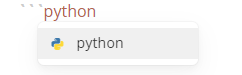
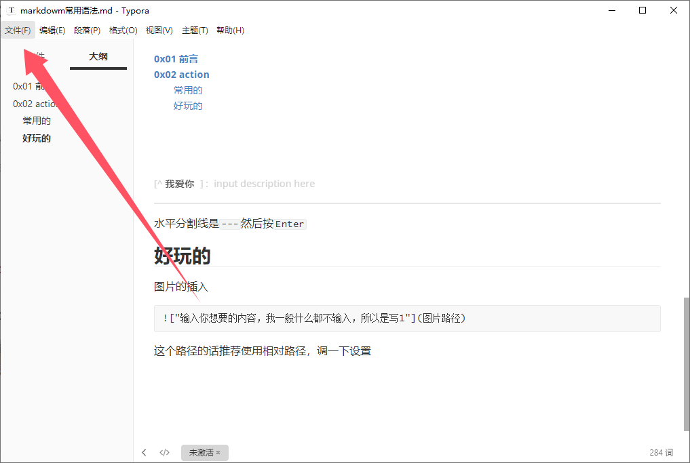
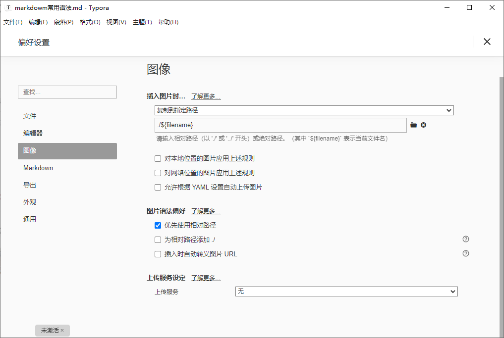
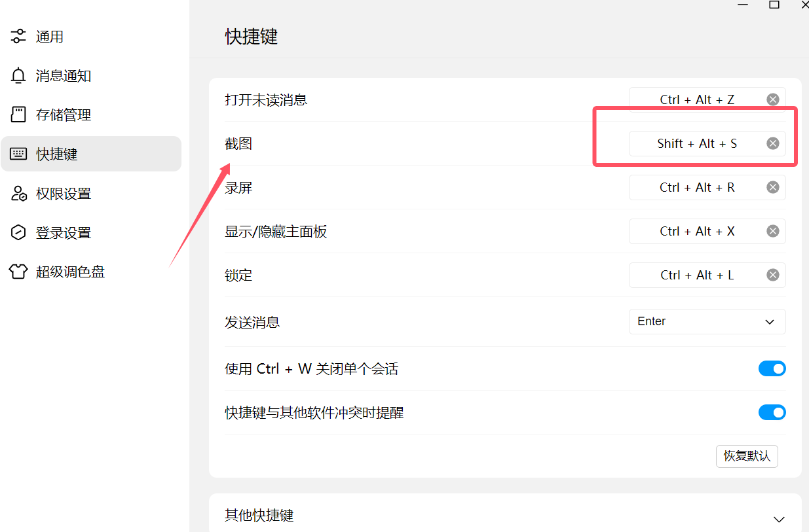
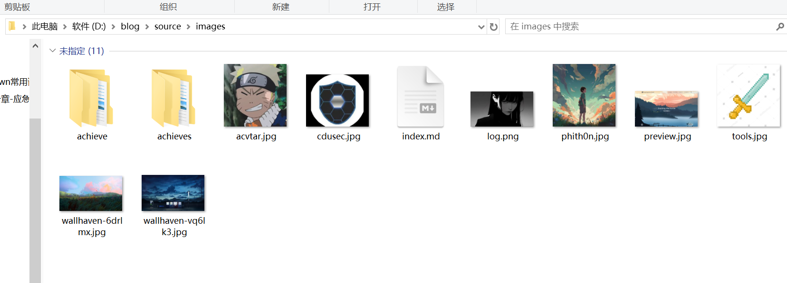
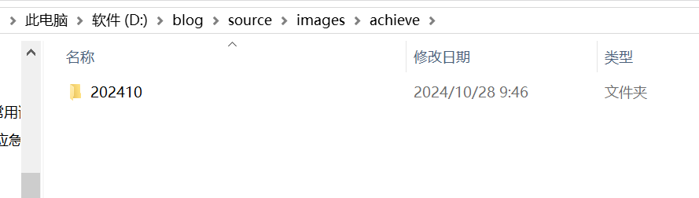

+++
title = "markdown常用语法"
slug = "markdown-common-syntax"
description = "写md最开始看的文章"
date = "2024-10-28T21:15:30"
lastmod = "2024-10-28T21:15:30"
image = ""
license = ""
categories = ["talk"]
tags = []
+++

# 0x01 前言

程序员都用的做笔记的语法，也是非常实用了，下面我只提及好用并且经常用的

# 0x02 action

## 常用的

首先就是标题，使用`#`

```
# 一级标题
## 二级标题
### 三级标题
总共最多是六级标题
```

加粗，**Ctrl+B**

代码的包裹，使用反引号

```
`baozongwi`
```

代码块，使用三个反引号，这里有个小技巧，直接写，就不用在代码块的右下角选择语言了



删除线，~~wi菜菜~~

```
~~wi菜菜~~
```

公式块的话就是鼠标右键选择插入
$$
师傅
=6
$$
鼠标右键合集

```
目录插入
公式块插入
段落插入
表格插入
脚注插入
有序列表、无序列表
```

[TOC]

还有就是引入别人的链接

```
[]()
```

[baozongwi](https://baozongwi.xyz)

[^我爱你]: 

---

水平分割线是`---`然后按`Enter`

## 好玩的

图片的插入

```

```

这个路径的话推荐使用相对路径，调一下设置





在一个自己存图片的地方给存上，我是使用的QQ截图



截图另存为一个地方



新建文件夹做好分类



就这样就好了，当然可以是用在线图床，但是有两个槽点

- 动手能力差的师傅，搭建耗时过长，不美
- 上传速度和显示速度都不如本地，不雅

但是会有师傅说，诶，那本地我直接发给别人md文档看不到图片呀，这种东西的话直接导出为PDF等常用格式即可解决(**文件->导出->PDF)**

还有一个好玩的就是表情了

```
 :英文单词:
```

就这么简单就可以打出表情

 :happy:

 :sweat:

我觉得是非常好用且好玩的

但是我这个博客貌似有问题，直接写的话渲染不成功，在typora里面是成功的，可以直接去网站复制粘贴虽然麻烦了点，不好我觉得是值得的

```
https://emojipedia.org/
```

# 0x03 小结

我个人认为写笔记是一个非常好的习惯，因为程序员学的东西会比较多(~~虽然我现在不配称为程序员~~)，如果长时间不用就忘了，但是你如果记了笔记，看一下还是很快就能恢复过来的
