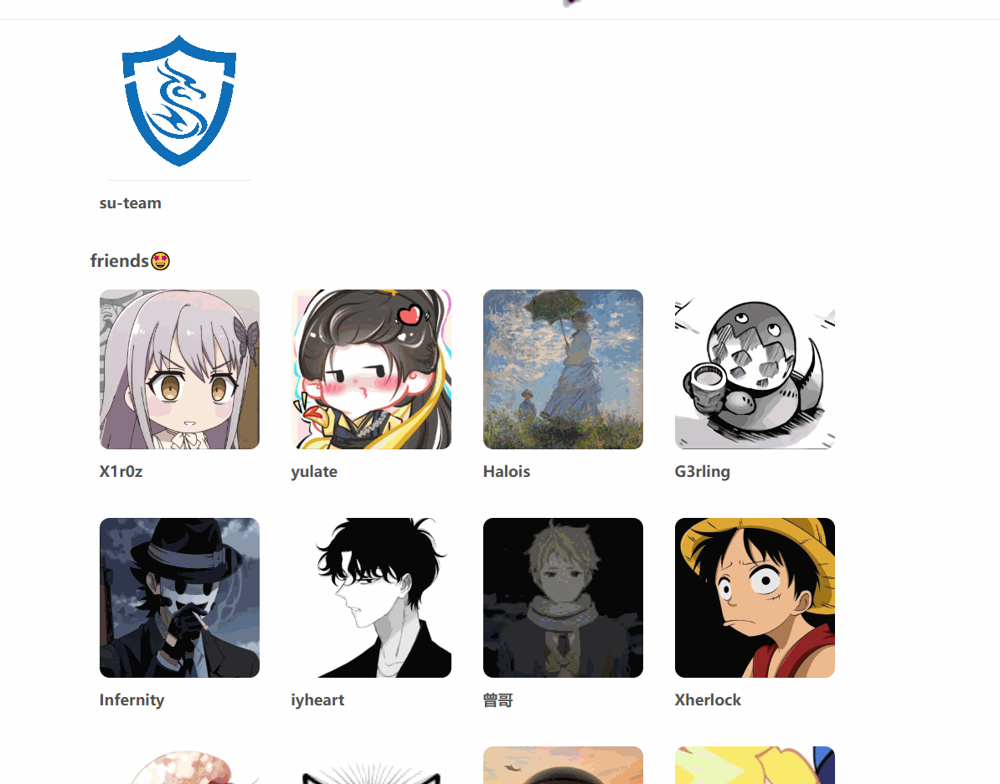

+++
title = "next主题优化(bug修复)"
slug = "next-theme-optimization-bug-fixes"
description = "搜索bug修复、友链新增、waline评论"
date = "2025-08-10T10:04:10"
lastmod = "2025-08-10T10:04:10"
image = ""
license = ""
categories = ["talk"]
tags = []
+++

在我换了新主题之后，我发现有一个非常影响我个人使用的bug，就是搜索功能缺陷。打个比方，我有200篇文章，但是他貌似是只能检索前100篇，去年写的100篇就完全搜索不到了，并且每个主题好像都有bug是说搜索关键词之后，文章内容和文章标题优先级是等同的，这个非常不好，因为大部分技术就这样了，比方说php，在绝大多数文章里面都会有，这个要修复。

再者就是经典的友链环节了，这次我新增会和往常不一样，其他时候我是修改、增加主题的源文件。显而易见的问题就是现在的主题更新还挺勤快，一更新就要重新来，前几日 3a0-Eminem师傅给我提及到了一个关键点，就是markdown是支持html语法的。（把这事给忘了），那我们就可以直接嵌入一个页面，而且也不会和主题之间也不会有明显的嵌入感

## search

安装插件

```bash
npm install hexo-generator-searchdb --save
```

在博客根目录的`__config.yml`中增加

```yaml
search:
  # path: search.xml
  path: search.json
  field: post
  content: true
  format: html
```

注意，是`json`，`xml`有部分影响对于本次bug产生，这样子已经能搜索部分文章了，但是并没把bug修复，还有一个重要的点就是修改插件函数，打开`D:\blog\node_modules\hexo-generator-searchdb\lib\json_generator.js`，修改为如下代码，将正则问题修复即可

```js
"use strict";

module.exports = function (locals) {
  var config = this.config;
  var database = require("./database")(locals, config);

  // ---------------------------------------------新增修改
  function reconvert(str) {
    str = str.replace(/(\\u)(\w{1,4})/gi, function ($0) {
      return String.fromCharCode(
        parseInt(escape($0).replace(/(%5Cu)(\w{1,4})/g, "$2"), 16)
      );
    });
    str = str.replace(/(&#x)(\w{1,4});/gi, function ($0) {
      return String.fromCharCode(
        parseInt(escape($0).replace(/(%26%23x)(\w{1,4})(%3B)/g, "$2"), 16)
      );
    });
    str = str.replace(/(&#)(\d{1,6});/gi, function ($0) {
      return String.fromCharCode(
        parseInt(escape($0).replace(/(%26%23)(\d{1,6})(%3B)/g, "$2"))
      );
    });

    return str;
  }
  database.forEach(function (item) {
    item.content = reconvert(item.content);
  });
  // -----------------------------------------------
  return {
    path: config.search.path,
    data: JSON.stringify(database),
  };
};
```

## links

首先在md文件里面加`type: links`，然后写文件的时候注意里面的html是会被**Nunjucks**解析的，为了防止解析可以加raw

```html

<div id="links-root"></div>
<style>
  #links-root{--gap:16px;--radius:14px;--card-bg:rgba(255,255,255,0.7);--card-border:rgba(0,0,0,0.06);--card-hover-bg:rgba(0,0,0,0.04);--shadow:0 6px 18px rgba(0,0,0,0.06);margin:0 auto;max-width:1100px}
  #links-root .links-category{margin:28px 0 22px}
  #links-root .links-category h2{margin:0 0 12px;font-size:1.25rem;font-weight:700;line-height:1.2}
  #links-root .links-grid{display:grid;grid-template-columns:repeat(4,minmax(0,1fr));gap:var(--gap)}
  @media (max-width:768px){#links-root .links-grid{grid-template-columns:repeat(2,minmax(0,1fr))}}
  #links-root .friend-card{display:block;text-decoration:none;color:inherit;border-radius:var(--radius);border:1px solid var(--card-border);background:var(--card-bg);padding:10px;transition:transform .15s ease,box-shadow .15s ease,background .2s}
  #links-root .friend-card:hover{background:var(--card-hover-bg);transform:translateY(-2px);box-shadow:var(--shadow)}
  #links-root .avatar-wrap{position:relative;border-radius:12px;overflow:hidden;aspect-ratio:1/1}
  #links-root .avatar-wrap img{width:100%;height:100%;object-fit:cover;display:block}
  #links-root .avatar-wrap .desc{position:absolute;left:0;right:0;bottom:0;transform:translateY(100%);padding:10px 12px;background:rgba(0,0,0,.72);color:#fff;font-size:.875rem;line-height:1.35;transition:transform .2s ease;pointer-events:none}
  #links-root .avatar-wrap.reveal .desc{transform:translateY(0)}
  #links-root .meta{padding-top:8px}
  #links-root .name{font-weight:600;white-space:nowrap;overflow:hidden;text-overflow:ellipsis}
  .post-title{display:none!important}
</style>
<script>
  const LINKS_DATA=[{links_category:"Team",list:[{name:"su-team",link:"https://su-team.cn/",description:"不止是CTF！",avatar:"https://baozongwi.xyz/images/su_logo/SU4.jpg"}]},{links_category:"friends🤩",list:[{name:"fushuling",link:"https://fushuling.com/",description:"带我进SU的好哥哥",avatar:"https://fushuling-1309926051.cos.ap-shanghai.myqcloud.com/2022/08/QQ%E5%9B%BE%E7%89%8720220812001845.jpg"},{name:"Y4tacker",link:"https://y4tacker.github.io/",description:"Y4师傅诶~",avatar:"https://y4tacker.github.io/images/me.jpeg"}]}];
  const escapeHTML=(s)=>String(s).replace(/[&<>"']/g,(m)=>({'&':'&amp;','<':'&lt;','>':'&gt;','"':'&quot;',"'":'&#39;'}[m]));
  function shuffle(arr){for(let i=arr.length-1;i>0;i--){const j=Math.floor(Math.random()*(i+1));[arr[i],arr[j]]=[arr[j],arr[i]]}return arr}
  function createCard(item){
    const a=document.createElement('a');
    a.className='friend-card';
    a.href=item.link;
    a.target='_blank';
    a.rel='noopener noreferrer';
    a.setAttribute('aria-label',`${item.name} - ${item.description||''}`);
    a.innerHTML=`
      <div class="avatar-wrap">
        
        <div class="desc" aria-hidden="true">${escapeHTML(item.description||'')}</div>
      </div>
      <div class="meta">
        <div class="name" title="${escapeHTML(item.name)}">${escapeHTML(item.name)}</div>
      </div>
    `;
    const wrap=a.querySelector('.avatar-wrap');
    let shownOnce=false;
    wrap.addEventListener('mouseenter',()=>{if(!shownOnce){wrap.classList.add('reveal');shownOnce=true}});
    wrap.addEventListener('mouseleave',()=>{wrap.classList.remove('reveal');shownOnce=false});
    wrap.addEventListener('touchstart',(e)=>{e.preventDefault();const willShow=!wrap.classList.contains('reveal');wrap.classList.toggle('reveal',willShow);shownOnce=willShow},{passive:false});
    a.querySelector('img').addEventListener('error',(ev)=>{ev.target.src='data:image/svg+xml;utf8,'+encodeURIComponent(`<svg xmlns="http://www.w3.org/2000/svg" width="400" height="400"><rect width="100%" height="100%" fill="#ddd"/><text x="50%" y="50%" dominant-baseline="middle" text-anchor="middle" fill="#555" font-size="22">${escapeHTML(item.name)}</text></svg>`)});return a}
  (function(){
    const root=document.getElementById('links-root');if(!root)return;
    LINKS_DATA.forEach(cat=>{
      const section=document.createElement('section');
      section.className='links-category';
      section.innerHTML=`<h2>${escapeHTML(cat.links_category)}</h2><div class="links-grid"></div>`;
      const grid=section.querySelector('.links-grid');
      shuffle(cat.list.slice()).forEach(item=>grid.appendChild(createCard(item)));
      root.appendChild(section);
    });
  })();
</script>

```

直接把上面的代码放进去就可以了，页面就做好了，再自己把收集的友链信息放进去，效果图如下（非常满意）



不过我发现了这样子之后博客加载速度会慢一些，所以我选择学习陆队，简约一点，直接放，用python脚本处理yml文件生成md表格

```python
import sys,yaml
from pypinyin import lazy_pinyin
p=sys.argv[1]if len(sys.argv)>1 else"_data/links.yml"
d=yaml.safe_load(open(p,encoding="utf-8"))
e=lambda s:(s or"").replace("|",r"\|").strip()
k=lambda n:(1,s)if(s:=''.join(lazy_pinyin((n or"").strip())).lower())[0].isdigit()else(0,s)
print("| Group | Name | Link |\n| --- | --- | --- |")
for b in d or[]:
    g=e(b.get("links_category",""));f=1
    for i in sorted(b.get("list",[]),key=lambda x:k(x.get("name",""))):
        print(f"| {g if f else''} | {e(i.get('name',''))} | {e(i.get('link',''))} |");f=0

```

## waline评论

最经典的了，每次我都会弄这个，next主题的话需要安装一个插件，再直接把配置项加到`next/_config.yml`

```bash
npm install @waline/hexo-next
```

```yaml
# Multiple Comment System Support
comments:
  # Available values: tabs | buttons
  style: tabs
  # Choose a comment system to be displayed by default.
  # Available values: disqus | disqusjs | changyan | livere | gitalk | utterances
  active:
  # Setting `true` means remembering the comment system selected by the visitor.
  storage: true
  # Lazyload all comment systems.
  lazyload: false
  # Modify texts or order for any naves, here are some examples.
  nav:
    #disqus:
    #  text: Load Disqus
    #  order: -1
    #gitalk:
    #  order: -2
   
   
# 添加的部分   
waline:
  enable: true
  serverURL: 'https://waline.baozongwi.xyz/'
  avatar: 'mm'
  meta: ['nick','mail']
  pageSize: 10
  lang: 'zh-CN'
  visitor: false
  comment_count: true
  requiredFields: ['nick','mail']
```

