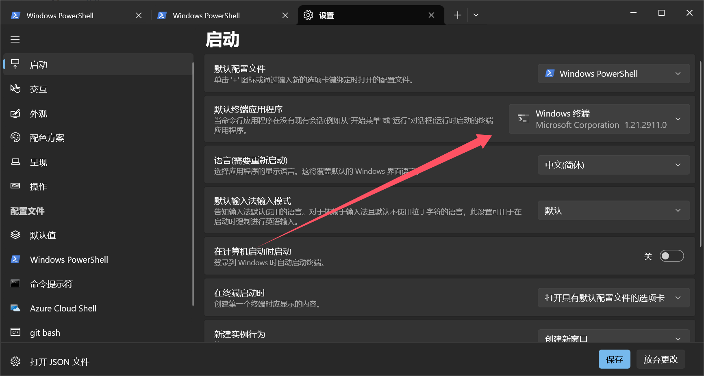
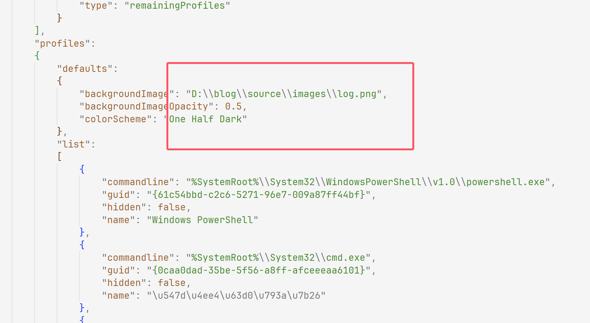
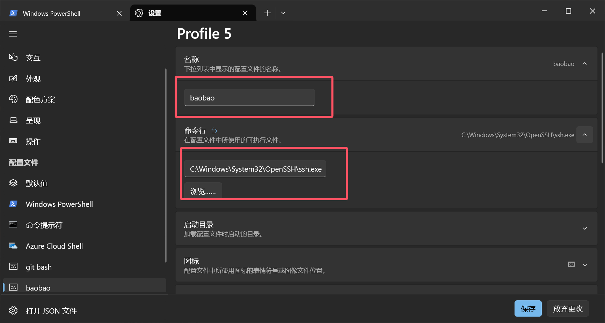
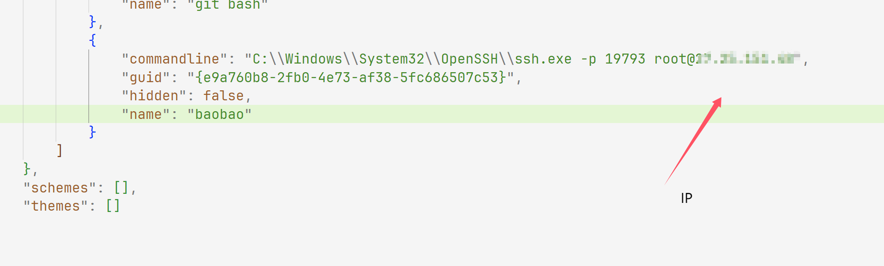
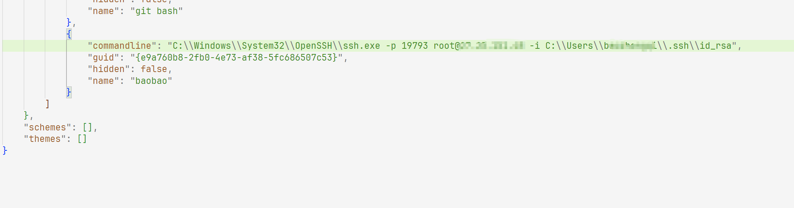

+++
title = "powershell链接vps"
slug = "powershell-vps-connection"
description = "丝滑"
date = "2024-11-04T15:52:58"
lastmod = "2024-11-04T15:52:58"
image = ""
license = ""
categories = ["talk"]
tags = ["工具"]
+++

# 0x01 前言

看到朋友上个月的终端非常好看，那么我也要，意外是没想到这个东西还这么丝滑

# 0x02 action

## 安装&&美化

下载`terminal`

```
https://github.com/microsoft/terminal/releases/tag/v1.21.2911.0
```

下载之后安装即可，那么如何有一个好看的终端呢，大家打开尝试就知道，这个比cmd丝滑多了，而且还可以用Linux的命令来控制Windows，所以我们直接把默认的改成`terminal`



**打开json文件**，找到这个位置进行背景图的修改



其他的设置大家自己修改就好了

## 链接vps

### key

我之前使用的终端工具是tabby虽然他可以同时多端控制，但是机器一多就会很卡，而且传文件也慢，最近做Docker的时候发现powershell很丝滑并且够快的

这里我们新添加配置文件



找到ssh进行修改之后

```
Get-Command -name ssh
```

然后我们再次打开json文件进行修改



诶这里再重新进来发现输入密码就可以连接了，但是很麻烦不雅

我们生成密钥然后再上传(在本地操作)

```
ssh-keygen -t rsa

cd .ssh

#上传公钥文件
scp -P port id_rsa.pub root@ip:/root/.ssh

adewESHJ0923
```

然后我们在vps操作

```
cd .ssh

#生成验证文件authorized_keys：
cat id_rsa.pub > authorized_keys

#给权限
chmod 600 authorized_keys
chmod 700 ~/.ssh
```

编辑config文件

```
sudo vim /etc/ssh/sshd_config

RSAAuthentication yes
PubkeyAuthentication yes
```

再重启ssh

```
service sshd restart
```

尝试一下在powershell里面

```
ssh root@ip -p port -i .ssh/id_rsa
```

成功了，那么我们再次**打开json文件**



然后保存之后发现就成功了，好耶

### 密码

直接在`powershell`里面

```
ssh -p port username@ip

然后输入密码就好了
```

# 0x03 小结

好用，谢谢我5m宝的安利哈哈
