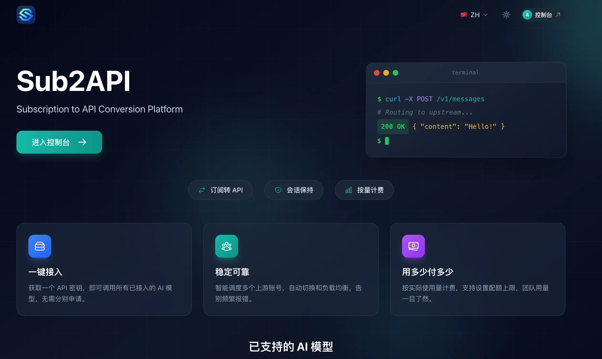
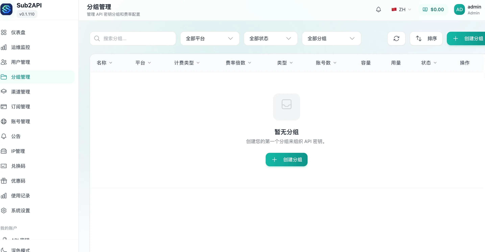
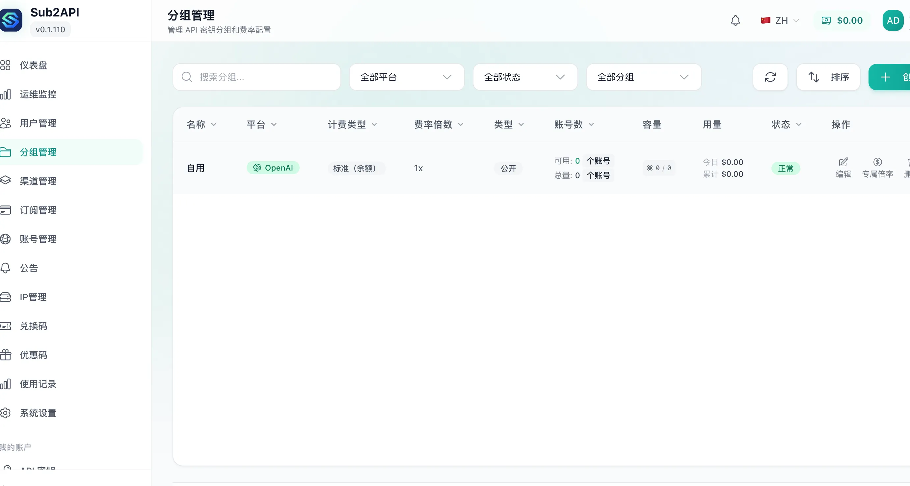
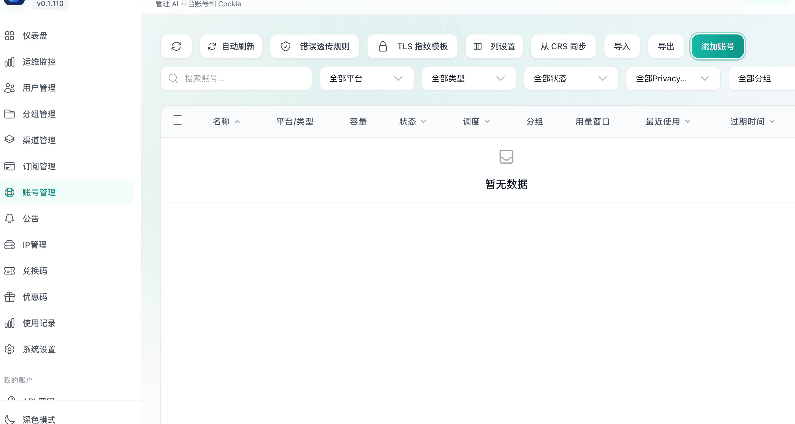
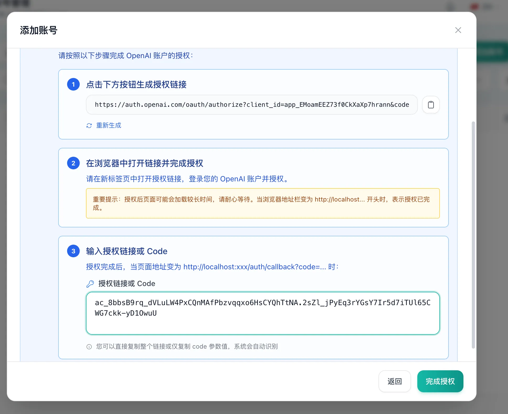
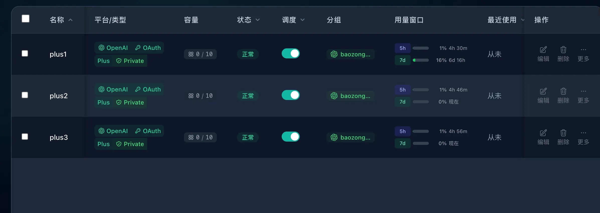
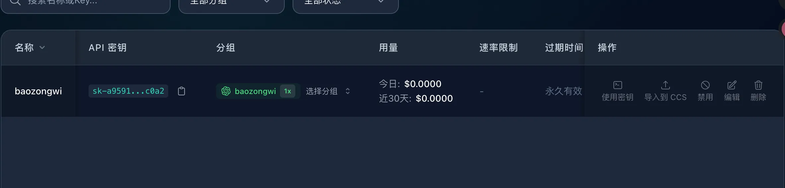

+++
title= "Sub2api 搭建"
slug= "sub2api-setup"
description= "站起来蹬🚉"
date= "2026-04-11T14:32:12+08:00"
lastmod= "2026-04-11T14:32:12+08:00"
image= ""
license= ""
categories= ["talk"]
tags= [""]

+++

## TL;DR

由于中转站的注册机大多都是 free 的账号，每次官方充值额度就会被封号，然后我前段日子在群里和好哥哥们闲聊发现还不止一个人有 sub2api，自己统筹管理自己的账号，再加上自己的邮箱有好几个，plus 账号也足够便宜，所以我也搞了一个，虽然中途出了点问题，但是 [@Mnzn](https://mnzn.me/) 帮我解决了，感谢啧啧🤪

## 操作

https://github.com/Wei-Shaw/sub2api

用服务器快速搭建

```bash
curl -fsSL https://get.docker.com -o get-docker.sh
sudo sh get-docker.sh
sudo systemctl enable --now docker

sudo mkdir -p /opt/sub2api && cd /opt/sub2api
curl -sSL https://raw.githubusercontent.com/Wei-Shaw/sub2api/main/deploy/docker-deploy.sh | bash
sudo docker compose up -d
sudo docker compose logs -f sub2api
```

搭建好了之后



调一下端口以及管理员密码，只需要修改环境变量之后再重启即可

```bash
sed -i 's/^ADMIN_PASSWORD=.*/ADMIN_PASSWORD=12SqweR\@/' .env
sed -i 's/^SERVER_PORT=.*/SERVER_PORT=9876/' .env

docker compose down && rm -rf data/ postgres_data/ redis_data/
docker compose up -d
admin@sub2api.local\12SqweR@
```

看了下教程，其实其中就三个地方需要设置，然后的话需要注意的是需要使用日本服务器来完成这个操作，不然的话无法链接到 openAI

1.分组管理





2.账号管理





这里需要能链接到 openAI 的地区服务器，不然成功不了（这里经过了多次折腾终于成功导入了



然后就可以新建 API 了



购买账号地址：https://mamabt.top/
