+++
title = "uptime-kuma部署使用"
slug = "uptime-kuma-deployment-usage"
description = "监控自己的服务"
date = "2025-03-20T21:50:56"
lastmod = "2025-03-20T21:50:56"
image = ""
license = ""
categories = ["talk"]
tags = []
+++

在网上经常看到博客里面有个状态页，美美看到这个，我就非常好奇\喜欢\想要，或许这个东西现在是用不上的，但是我就是想建一个，这里选择使用docker来搭建[项目源码](https://github.com/louislam/uptime-kuma) 

## docker搭建服务

docker怎么安装不说了，在我博客search一下就可以了，

```
docker run -d \
  --restart=always \
  -p 30001:3001 \
  -v uptime-kuma:/app/data \
  --name uptime-kuma \
  louislam/uptime-kuma:latest
```

直接一键部署到服务器的30001端口，更新服务的命令是这个

```
docker pull louislam/uptime-kuma:latest && docker restart uptime-kuma
```

现在就可以访问服务器的30001端口来看了

## uptime_kuma

### 基础设置

第一次访问会让我们注册一个管理员账号

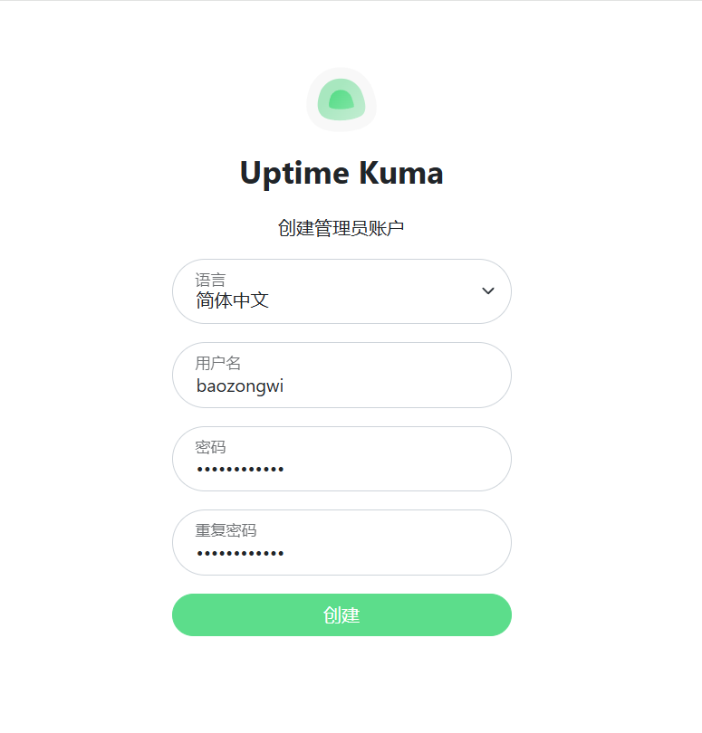

添加监控

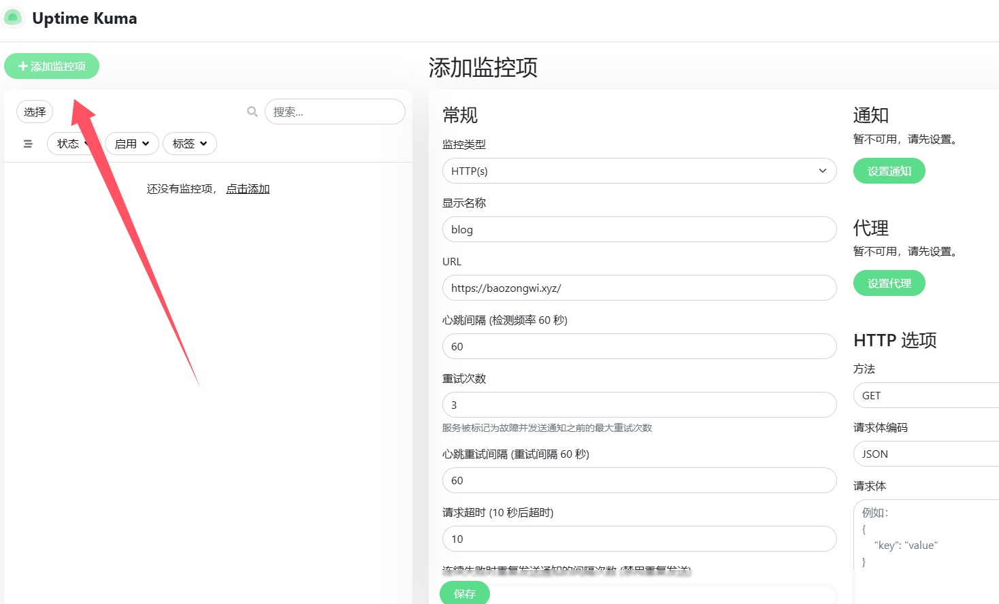

当然啦最重要的还是邮件通知，

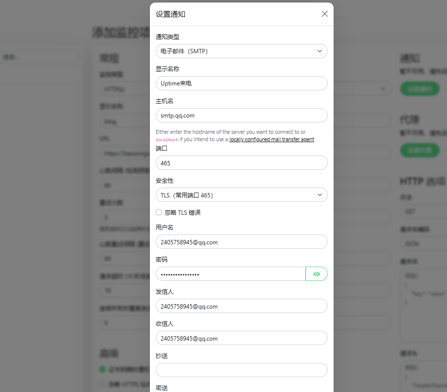

测试了一下发现成功，然后依次克隆添加就好了，

### 新建状态页

但是这是在我们服务器上面，如果是IP的话，那是相当的不方便的，所以我们可以新建一个状态页来进行一个监控

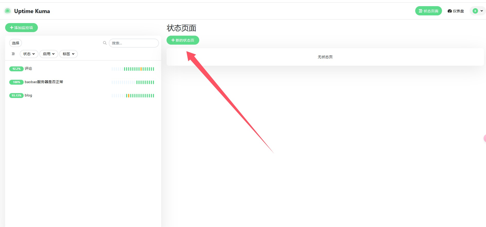

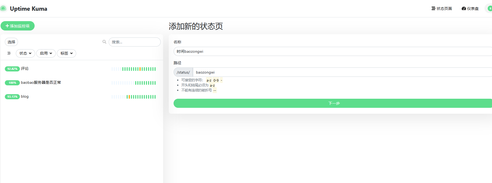

上图中的内容是随便写的

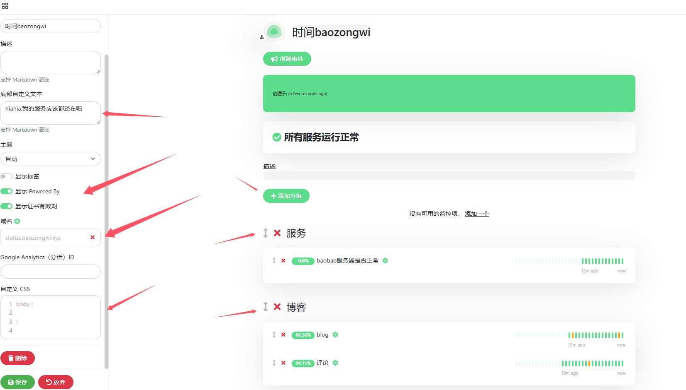

我勾选的部分全部都可以点，比如CSS什么的，为了能自定义域名，我们在这里添加了还不够，改改设置

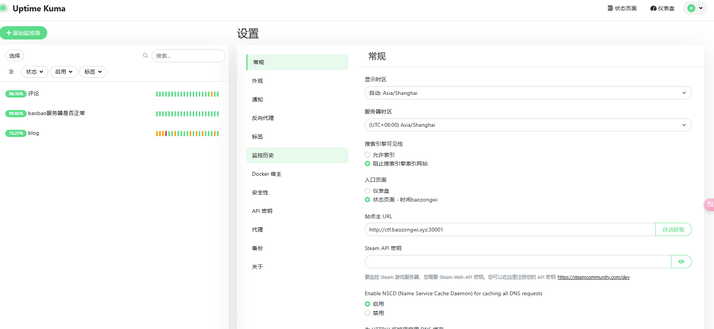

还需要做一个反代，由于没有安装任何服务器面板所以这里还是手动，运行以下命令

```
# 1. 创建配置文件
vim /etc/nginx/conf.d/uptime_kuma.conf

server {
    listen 80;
    server_name status.baozongwi.xyz;

    location / {
        proxy_pass http://ctf.baozongwi.xyz:30001/;
        proxy_set_header Host $host;
        proxy_set_header X-Real-IP $remote_addr;
        proxy_set_header X-Forwarded-For $proxy_add_x_forwarded_for;
        
        proxy_redirect http://ctf.baozongwi.xyz:30001/ http://$host/;
    }
}

# 3. 测试配置语法
sudo nginx -t

# 4. 重载Nginx配置
sudo systemctl reload nginx
```

但是怎么也不能成功，其实动动脑就知道，我的`status.baozongwi.xyz`都没有解析，他怎么可能有权限来进行反代，所以说，我们只要把这个子域名解析到**部署这个服务的服务器**上就好了

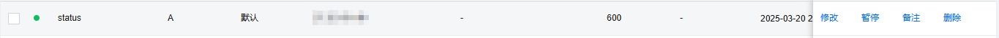


然后就可以访问，但是出现了一个神奇的现象

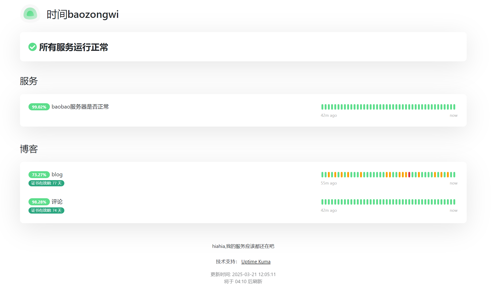

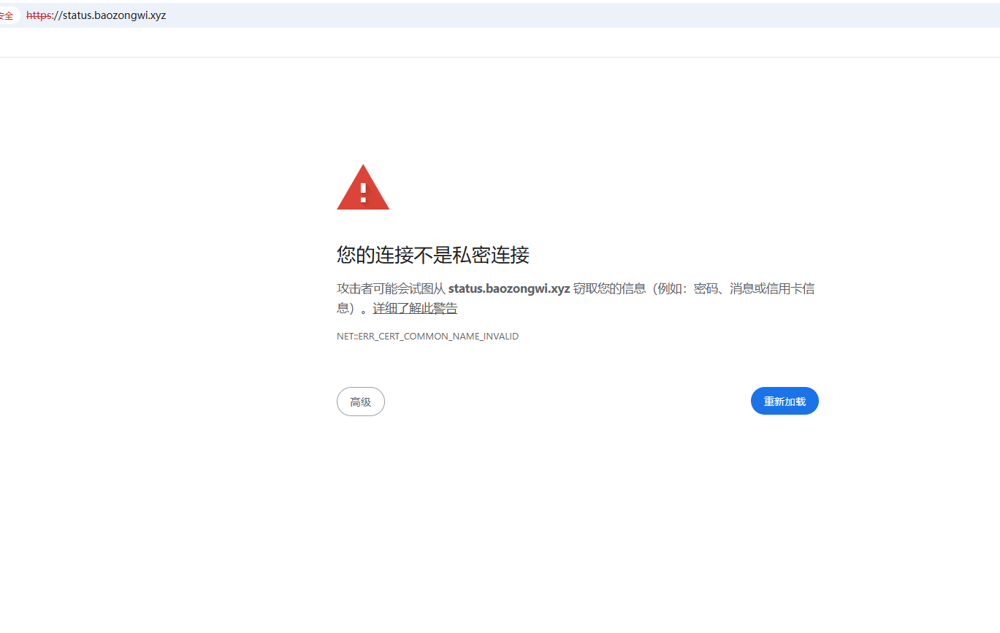

浏览器自动给国内服务器加https，我的发，那还是需要配置一个https，修改一下配置文件如下

```
# /etc/nginx/conf.d/uptime_kuma.conf

server {
    listen 80;
    server_name status.baozongwi.xyz;
    return 301 https://$server_name$request_uri;
}

server {
    listen 443 ssl;
    server_name status.baozongwi.xyz;

    ssl_certificate /etc/ssl/status.baozongwi.xyz_bundle.crt;
    ssl_certificate_key /etc/ssl/private/status.baozongwi.xyz.key;

    ssl_protocols TLSv1.2 TLSv1.3;
    ssl_ciphers ECDHE-ECDSA-AES128-GCM-SHA256:ECDHE-RSA-AES128-GCM-SHA256;
    ssl_prefer_server_ciphers on;
    ssl_session_cache shared:SSL:10m;
    ssl_session_timeout 10m;
    add_header Strict-Transport-Security "max-age=31536000" always;

    location / {
        proxy_pass http://ctf.baozongwi.xyz:30001/;
        proxy_set_header Host $host;
        proxy_set_header X-Real-IP $remote_addr;
        proxy_set_header X-Forwarded-For $proxy_add_x_forwarded_for;
        proxy_set_header X-Forwarded-Proto $scheme;
        
        proxy_http_version 1.1;
        proxy_set_header Connection "";
        
        proxy_redirect http://ctf.baozongwi.xyz:30001/ https://$host/;
    }
}
```

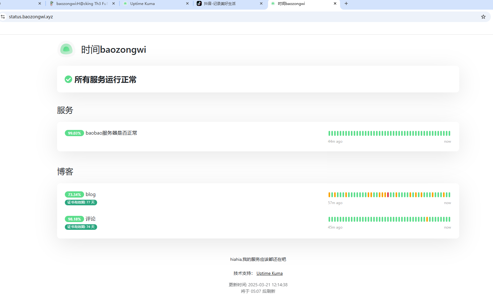

## 小结

反代经常在群里听师傅们说到，我以为多难的，因为网上也没有什么仔细的教程，有也是用的面板直接改那种，没想到就改个location就好了😆，并且这东西添加监控服务好像是不限量的，非常的舒服
