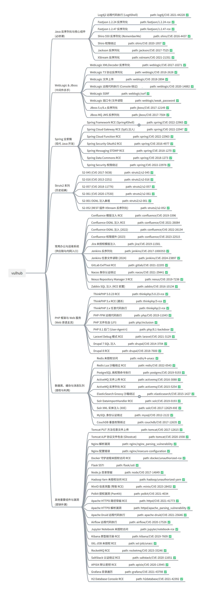

+++
title= "Vulhub复现学习"
slug= "vulhub-reproduction"
description= ""
date= "2025-12-10T08:48:14+08:00"
lastmod= "2025-12-10T08:48:14+08:00"
image= ""
license= ""
categories= ["talk"]
tags= [""]

+++

在这里学到了 Java-chains 的使用，了解了各种漏洞复现，但是还是不知道每个应用能在生产环境中能干嘛，以及合理的修复😣
