+++
title = "waline评论设置一条龙"
slug = "waline-comment-setup-guide"
description = "来评论区开黑"
date = "2024-11-09T19:50:46"
lastmod = "2024-11-09T19:50:46"
image = ""
license = ""
categories = ["talk"]
tags = ["小站"]
+++

# 0x01 说在前面

博客的意义或许就是交流技术？但是没有评论区的话，总感觉我的博客不是完整的，不过这个问题我前前后后弄了一个月之久，为了让后人省省力，也为我自己记录一下，出个教程吧(虽然可能不是每个博客框架或者主题都是一模一样，但是肯定能够作为参考

# 0x02 action

## 初始化

首先我们去国际版本的`leancloud`去注册一个账号去获得秘钥，这个平台emm一定要用国际版，国内的话会有很多的限制

```
https://leancloud.app/
```

注册好之后登录创建一个项目

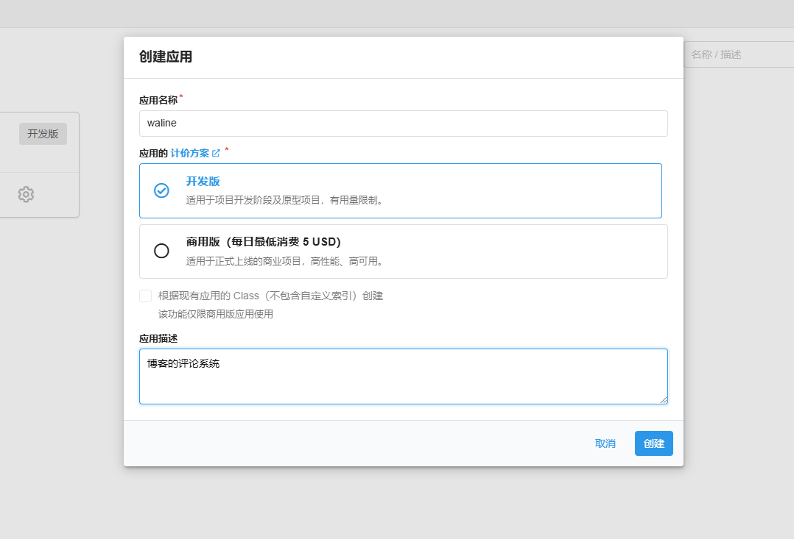

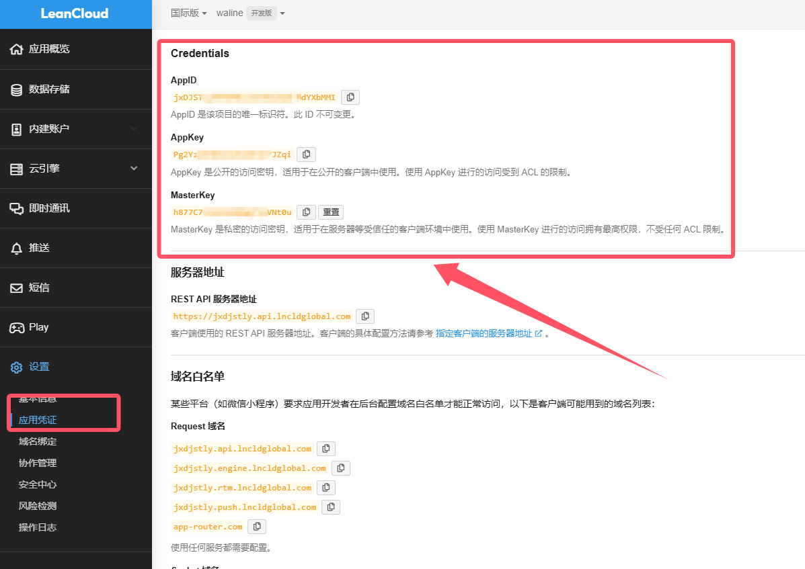

把这三个存下来

然后换平台了，到`vercel`上面

```
https://vercel.com/
```

这里我们直接使用github进行登录，然后进行项目的新建，这里借用一下其他师傅的图，我自己是建好了

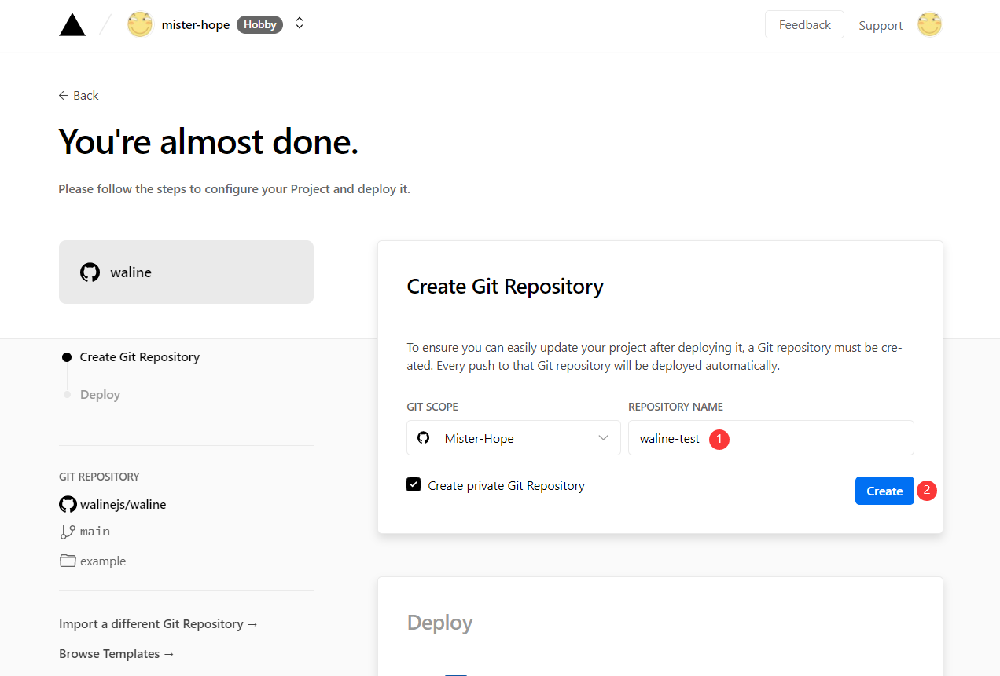

接着他就会在github帮我们自动化的初始化仓库

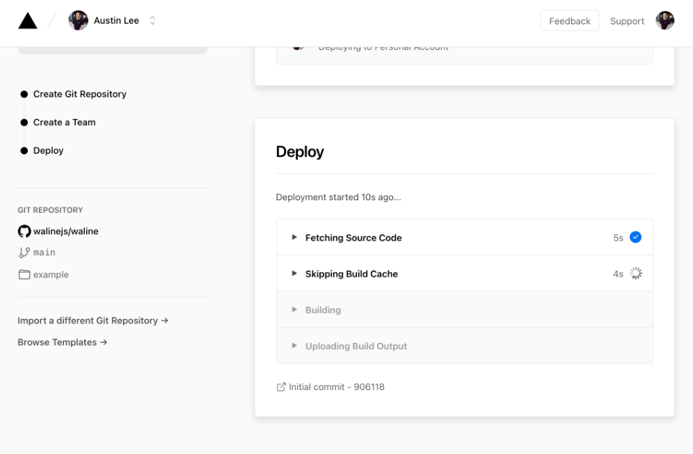

然后等待一会就成功啦

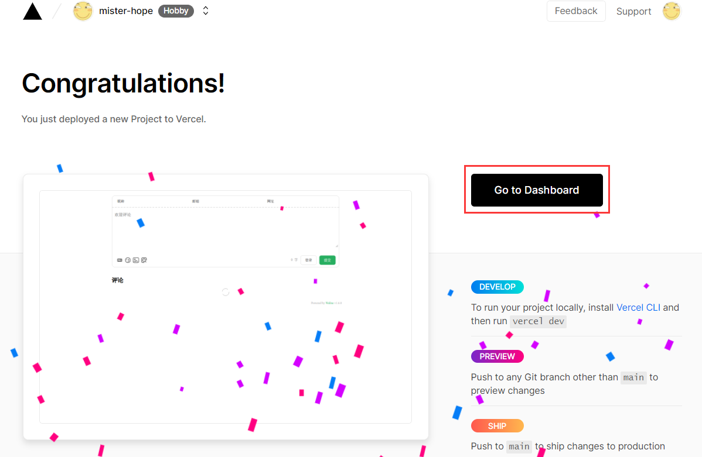

然后进行环境变量的配置，也就是我们刚才在`leancloud`拿到的三个秘钥，并配置三个环境变量 `LEAN_ID`, `LEAN_KEY` 和 `LEAN_MASTER_KEY` 。它们的值分别对应上一步在 LeanCloud 中获得的 `APP ID`, `APP KEY`, `Master Key`。

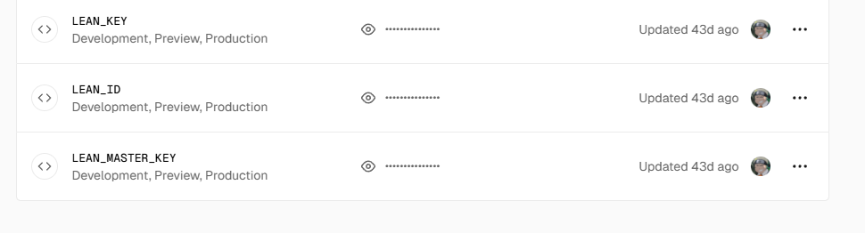

配置好之后我们进行重新的部署就好了

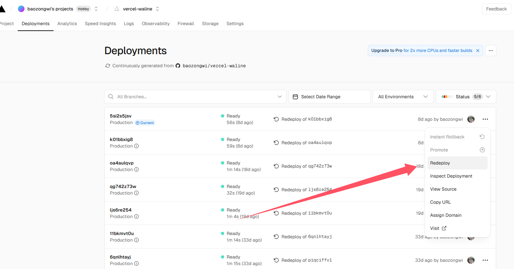

这里我们就完成初始化了，但是其实并不可用，因为在国内嘛，会被墙，根本就显示不出来会被直接解析成`application/octet-stream`，所以我们要自己弄一个域名，子域名就可以了

## 自定义域名

进入设置选择重定义网站

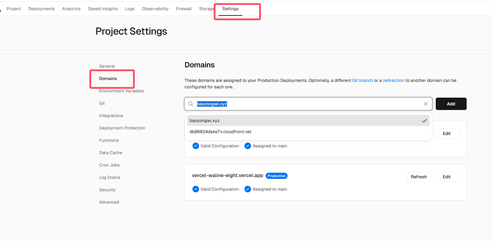

如果只是这里弄好肯定是不能成功的，别忘了解析


恩这样弄好之后基本就能使用了，进入博客主题的`config.yml`

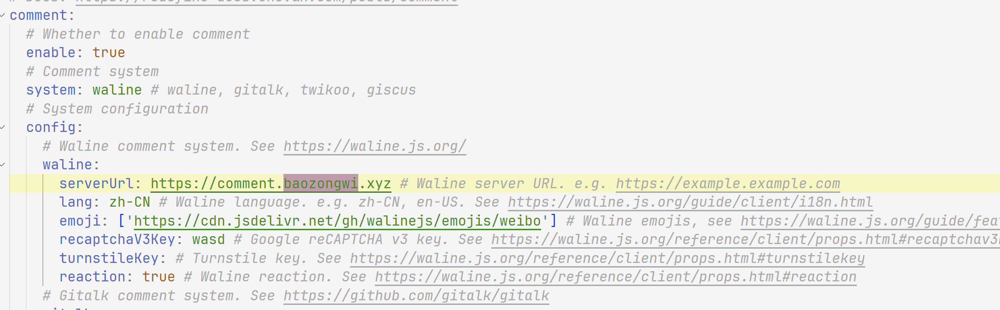

不过我本人在这里遇到了一个问题，原因也不知道为什么，反正就是给我的整个评论系统解析成了`application/octet-stream`，上网查了很久最后终于找到，我们知道评论系统是由`ejs`文件进行的，这里我们直接修改`nginx`配置文件，来制定`mime-type`

```
# 在http{ }中添加：
include /etc/nginx/mime.types;
default_type application/octet-stream;
```

我是直接写到最后的，也没出现覆盖问题

## 评论通知

这个可太重要了，而且我弄了起码四五次，**gmail，QQ机器人，微信**啥的都试过，最后使用QQ邮箱成功了，这里我们先登录QQ邮箱

```
https://wx.mail.qq.com/?cancel_login=true&from=get_ticket_fail
```

进入设置

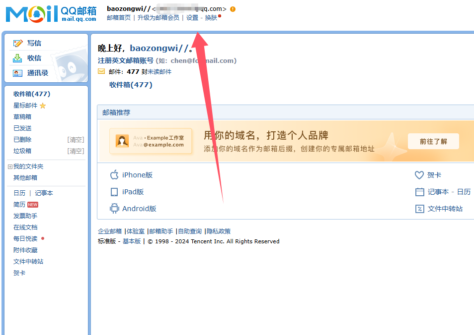

进入设置之后选择账号，然后下滑到这里

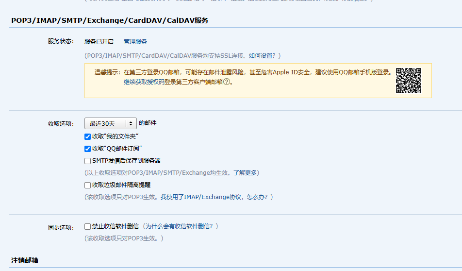

进行服务的开启，填一些资料，我已经弄好了，然后会得到一个密码，把这个密码记下来，这个密码相当于是个二级密码(不是第二次验证的，而是类似于二级域名的那种)

然后我们直接回到`vercel`配置环境变量就可以了

```
# SMTP_SERVICE: SMTP 邮件发送服务提供商。
# SMTP_USER: SMTP 邮件发送服务的用户名，一般为登录邮箱。
# SMTP_PASS: 刚才获得的二级密码

# SMTP_SECURE: 是否使用 SSL 连接 SMTP。

# SITE_NAME: 网站名称，用于在消息中显示。
# SITE_URL: 自己网站地址
# AUTHOR_EMAIL: 你自己评论的时候用的邮箱
```

像这样

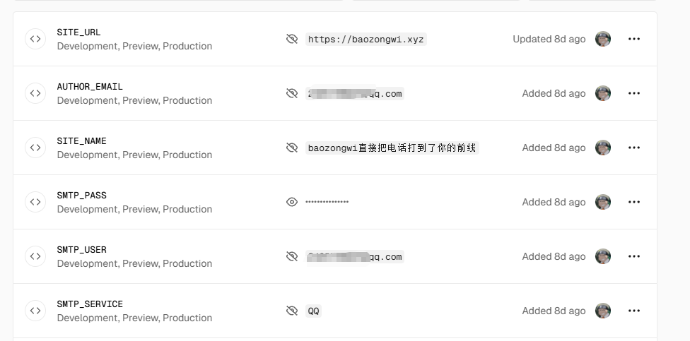

然后重新部署就可以了

## 评论管理

1. 部署完成后，请访问 `<serverURL>/ui/register` 进行注册。首个注册的人会被设定成管理员。
2. 管理员登陆后，即可看到评论管理界面。在这里可以修改、标记或删除评论。
3. 用户也可通过评论框注册账号，登陆后会跳转到自己的档案页。

但是我自己弄好之后是会自动跳转，不过评论应该也没什么管理的吧，会的师傅可以聊聊

# 0x03

我感觉现在的博客基本是什么东西都有了，啊哈不用倒腾了
