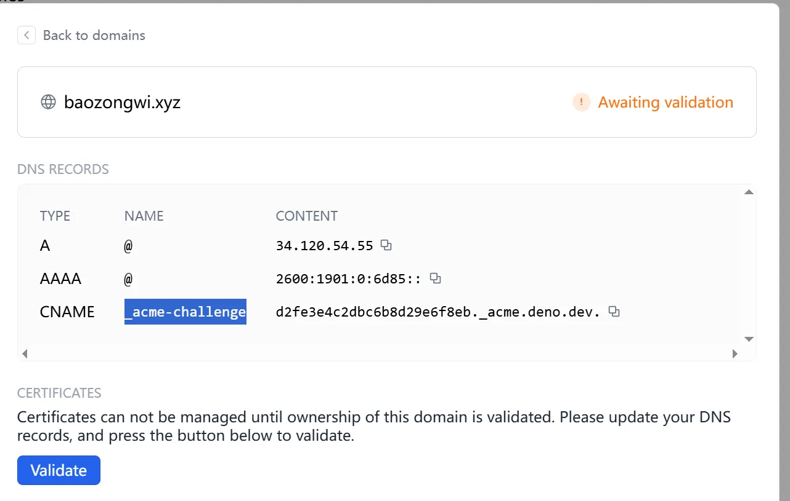
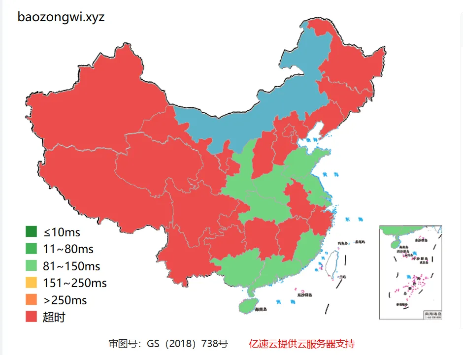
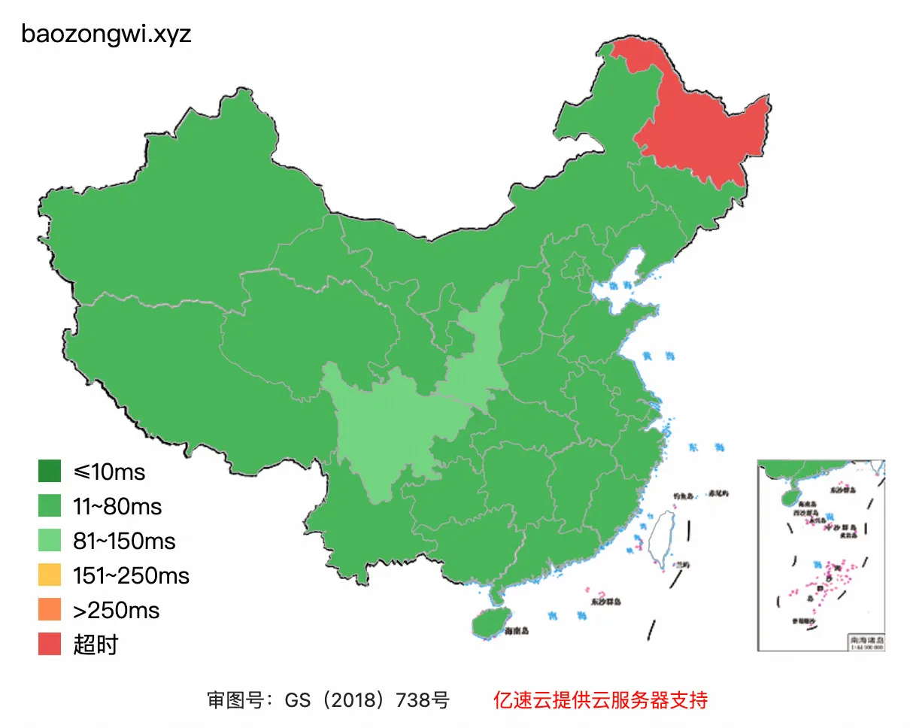

+++
title= "加速博客折腾记"
slug= "blog-performance-optimization"
description= "最终当然还是持续利用Vps😋"
date= "2025-11-23T16:25:23+08:00"
lastmod= "2025-11-23T16:25:23+08:00"
image= ""
license= ""
categories= ["talk"]
tags= [""]

+++

## Deno

https://dash.deno.com/tutorial/tutorial-http

new一个playground

```javascript
const UPSTREAM_HOST = "baozongwi.github.io";
const MY_DOMAIN = "baozongwi.xyz";

Deno.serve(async (request) => {
  const url = new URL(request.url);

  url.hostname = UPSTREAM_HOST;
  url.protocol = "https:";
  url.port = "443";

  const newHeaders = new Headers(request.headers);
  newHeaders.set("Host", MY_DOMAIN);

  newHeaders.set("Referer", `https://${MY_DOMAIN}`);

  const newRequest = new Request(url, {
    method: request.method,
    headers: newHeaders,
    body: request.body,
    redirect: "manual",
  });

  const response = await fetch(newRequest);
  return new Response(response.body, {
    status: response.status,
    statusText: response.statusText,
    headers: response.headers,
  });
});
```

由于我是腾讯云的域名做了一个CNAME到博客，所以解析也需要修改，现在项目的settings打开，添加域名，然后照着加解析即可

接着申请证书，成功部署就会发现



还不如以前了，nnd

## CN2 HK 

后来打算用国内的CDN的，因为CF太慢了，所以我是不可能用的，但是我发现个事情，我不是服务器多吗，那我可以直接走这个的流量啊，CN2的线路也很合适，做一个反代就可以了，我使用的是 apache2

```bash
a2enmod proxy proxy_http ssl headers
systemctl reload  apache2
```

修改域名的解析，不用CNAME了，直接 A 类型解析到服务器，然后写入配置文件`nano /etc/apache2/sites-available/baozongwi.xyz.conf`

```nginx
<VirtualHost *:80>
    ServerName baozongwi.xyz
    ServerAlias www.baozongwi.xyz

    DocumentRoot /var/www/html/baozongwi.xyz

    ErrorLog ${APACHE_LOG_DIR}/baozongwi_error.log
    CustomLog ${APACHE_LOG_DIR}/baozongwi_access.log combined
</VirtualHost>
```

再启用这个配置

```nginx
a2ensite baozongwi.xyz.conf
systemctl reload apache2
```

申请 https 

```nginx
certbot --apache -d baozongwi.xyz
```

现在来配置反代

```nginx
# nano /etc/apache2/sites-available/baozongwi.xyz-le-ssl.conf
<IfModule mod_ssl.c>
<VirtualHost *:443>
    ServerName baozongwi.xyz
    DocumentRoot /var/www/html

    ErrorLog ${APACHE_LOG_DIR}/baozongwi_error.log
    CustomLog ${APACHE_LOG_DIR}/baozongwi_access.log combined

    SSLCertificateFile /etc/letsencrypt/live/baozongwi.xyz/fullchain.pem
    SSLCertificateKeyFile /etc/letsencrypt/live/baozongwi.xyz/privkey.pem
    Include /etc/letsencrypt/options-ssl-apache.conf

    SSLProxyEngine on
    SSLProxyVerify none
    SSLProxyCheckPeerCN off
    SSLProxyCheckPeerName off
    ProxyPreserveHost On
    ProxyPass / https://baozongwi.github.io/
    ProxyPassReverse / https://baozongwi.github.io/
</VirtualHost>
</IfModule>
```

重启

```nginx
apachectl configtest
# 如果显示 Syntax OK，就重启
systemctl restart apache2
```



最后网站速度如上，简直无敌
